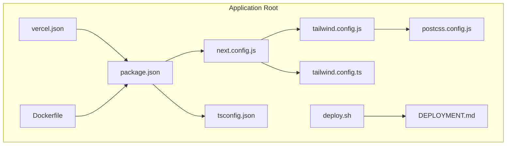
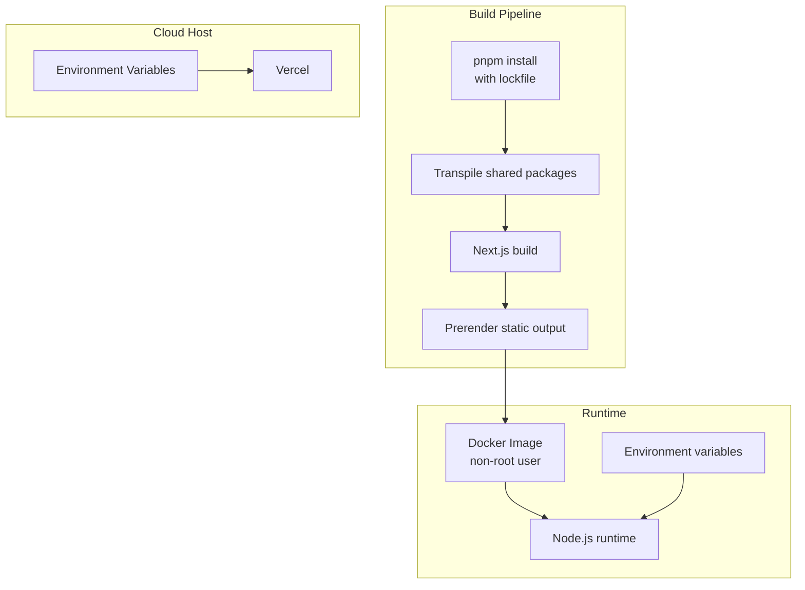
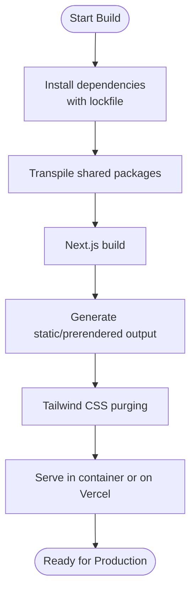
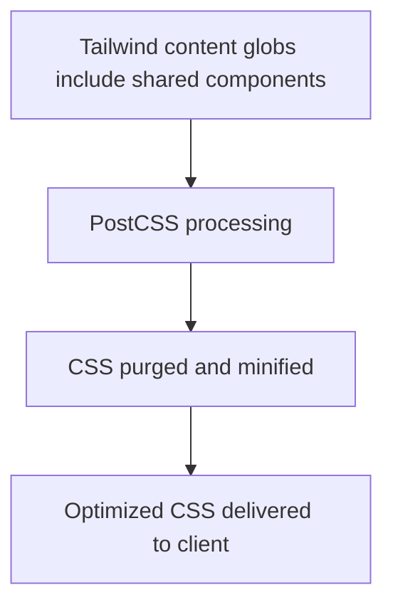
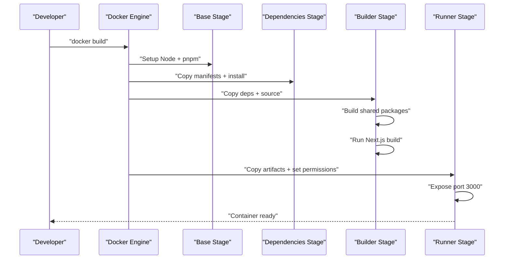
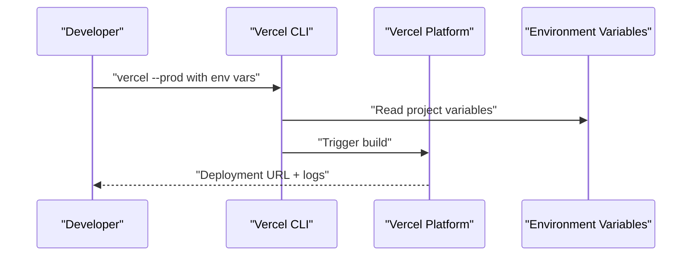
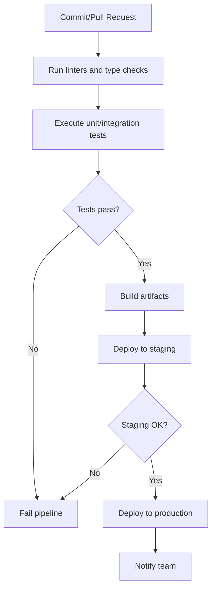
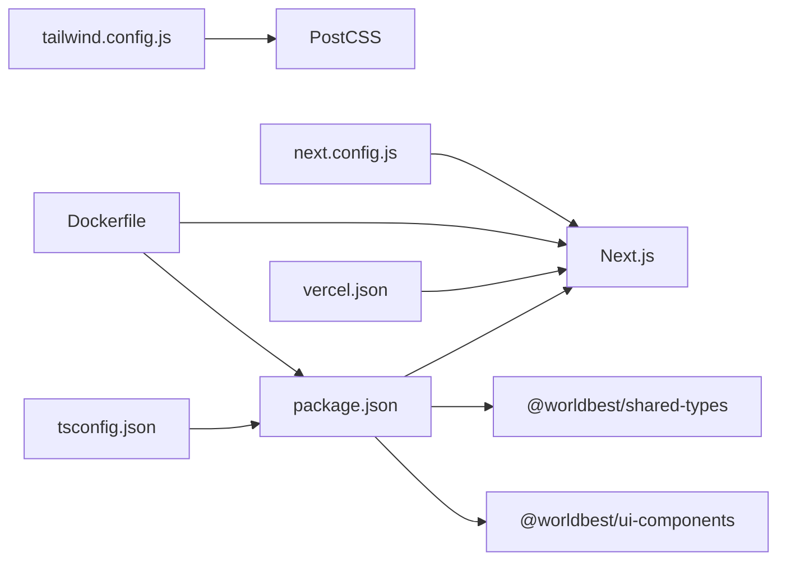

# Build and Deployment

<cite>
**Referenced Files in This Document**
- [DEPLOYMENT.md](file://DEPLOYMENT.md)
- [vercel.json](file://vercel.json)
- [Dockerfile](file://Dockerfile)
- [deploy.sh](file://deploy.sh)
- [next.config.js](file://next.config.js)
- [package.json](file://package.json)
- [tsconfig.json](file://tsconfig.json)
- [tailwind.config.js](file://tailwind.config.js)
- [tailwind.config.ts](file://tailwind.config.ts)
- [postcss.config.js](file://postcss.config.js)
- [README.md](file://README.md)
- [EXECUTIVE_SUMMARY.md](file://EXECUTIVE_SUMMARY.md)
</cite>

## Table of Contents
1. [Introduction](#introduction)
2. [Project Structure](#project-structure)
3. [Core Components](#core-components)
4. [Architecture Overview](#architecture-overview)
5. [Detailed Component Analysis](#detailed-component-analysis)
6. [Dependency Analysis](#dependency-analysis)
7. [Performance Considerations](#performance-considerations)
8. [Troubleshooting Guide](#troubleshooting-guide)
9. [Conclusion](#conclusion)
10. [Appendices](#appendices)

## Introduction
This document provides a comprehensive guide to building and deploying the WorldBest application in production. It covers the build pipeline configuration, asset optimization, bundle analysis, containerization, and cloud deployment strategies. It also documents environment-specific configurations, CI/CD pipeline setup, automated testing integration, deployment validation, rollback procedures, monitoring, and troubleshooting. The focus is on production-grade practices while remaining accessible to readers with varying technical backgrounds.

## Project Structure
The repository follows a monorepo-like structure with a Next.js application and shared packages. The build and deployment assets are centralized in the repository root, enabling straightforward containerization and cloud deployment.

**Diagram sources**
- [package.json](file://package.json#L1-L80)
- [next.config.js](file://next.config.js#L1-L56)
- [tsconfig.json](file://tsconfig.json#L1-L38)
- [tailwind.config.js](file://tailwind.config.js#L1-L108)
- [tailwind.config.ts](file://tailwind.config.ts#L1-L133)
- [postcss.config.js](file://postcss.config.js#L1-L7)
- [vercel.json](file://vercel.json#L1-L4)
- [Dockerfile](file://Dockerfile#L1-L73)
- [deploy.sh](file://deploy.sh#L1-L13)
- [DEPLOYMENT.md](file://DEPLOYMENT.md#L1-L147)

**Section sources**
- [package.json](file://package.json#L1-L80)
- [next.config.js](file://next.config.js#L1-L56)
- [tsconfig.json](file://tsconfig.json#L1-L38)
- [tailwind.config.js](file://tailwind.config.js#L1-L108)
- [tailwind.config.ts](file://tailwind.config.ts#L1-L133)
- [postcss.config.js](file://postcss.config.js#L1-L7)
- [vercel.json](file://vercel.json#L1-L4)
- [Dockerfile](file://Dockerfile#L1-L73)
- [deploy.sh](file://deploy.sh#L1-L13)
- [DEPLOYMENT.md](file://DEPLOYMENT.md#L1-L147)

## Core Components
- Build and runtime configuration: Next.js configuration, TypeScript compiler options, and Tailwind CSS setup define the build pipeline and asset optimization behavior.
- Containerization: A multi-stage Dockerfile ensures a minimal, secure production image with deterministic builds and non-root user execution.
- Cloud deployment: Vercel configuration and deployment script streamline production deployments with environment variables.
- Environment variables: Public and private variables are separated to prevent accidental exposure of secrets in the frontend.

Key configuration highlights:
- Next.js build pipeline with transpiled shared packages and externalized database dependencies.
- Tailwind CSS content scanning extended to shared UI components for accurate CSS purging.
- Docker multi-stage build with pnpm for dependency isolation and production runtime hardening.
- Vercel framework detection and environment variable management via CLI.

**Section sources**
- [next.config.js](file://next.config.js#L1-L56)
- [tsconfig.json](file://tsconfig.json#L1-L38)
- [tailwind.config.js](file://tailwind.config.js#L1-L108)
- [tailwind.config.ts](file://tailwind.config.ts#L1-L133)
- [Dockerfile](file://Dockerfile#L1-L73)
- [vercel.json](file://vercel.json#L1-L4)
- [deploy.sh](file://deploy.sh#L1-L13)
- [DEPLOYMENT.md](file://DEPLOYMENT.md#L1-L147)

## Architecture Overview
The deployment architecture integrates Next.js application builds, shared packages, and a containerized runtime. Vercel hosts the frontend with environment variables managed externally, while Docker provides an alternative containerized deployment option.

**Diagram sources**
- [Dockerfile](file://Dockerfile#L1-L73)
- [next.config.js](file://next.config.js#L1-L56)
- [vercel.json](file://vercel.json#L1-L4)
- [DEPLOYMENT.md](file://DEPLOYMENT.md#L1-L147)

## Detailed Component Analysis

### Build Pipeline Configuration
- Next.js configuration:
  - Transpiles shared packages for compatibility in the monorepo.
  - Externalizes a database package to avoid bundling server-only dependencies.
  - Defines image remote patterns for CDN and local MinIO storage.
  - Exposes public environment variables for the client.
  - Adds redirects and rewrites for authentication and API routing.
- TypeScript configuration:
  - Enables strict mode and modern module resolution.
  - Extends paths for shared packages to align with the monorepo structure.
- Tailwind CSS:
  - Content globs include shared UI components to ensure purge-safe CSS generation.
  - Theme customization supports brand-specific tokens and animations.

**Diagram sources**
- [next.config.js](file://next.config.js#L1-L56)
- [tsconfig.json](file://tsconfig.json#L1-L38)
- [tailwind.config.js](file://tailwind.config.js#L1-L108)
- [tailwind.config.ts](file://tailwind.config.ts#L1-L133)
- [Dockerfile](file://Dockerfile#L1-L73)

**Section sources**
- [next.config.js](file://next.config.js#L1-L56)
- [tsconfig.json](file://tsconfig.json#L1-L38)
- [tailwind.config.js](file://tailwind.config.js#L1-L108)
- [tailwind.config.ts](file://tailwind.config.ts#L1-L133)

### Asset Optimization and Bundle Analysis
- Tailwind CSS purging:
  - Content globs include shared UI components to prevent unused CSS from shipping to production.
  - Autoprefixer and Tailwind CSS are chained via PostCSS for efficient CSS processing.
- Bundle analysis:
  - Use Next.js telemetry flags and profiling tools to measure bundle sizes and identify large dependencies.
  - Analyze static exports and prerendered routes to optimize initial load performance.

**Diagram sources**
- [tailwind.config.js](file://tailwind.config.js#L1-L108)
- [postcss.config.js](file://postcss.config.js#L1-L7)

**Section sources**
- [tailwind.config.js](file://tailwind.config.js#L1-L108)
- [postcss.config.js](file://postcss.config.js#L1-L7)

### Containerization with Docker
- Multi-stage build:
  - Base stage installs pnpm and system dependencies.
  - Dependencies stage copies package manifests and installs with a frozen lockfile.
  - Builder stage copies dependencies and source, builds shared packages, and runs Next.js build with production flags.
  - Runner stage creates a non-root user, sets permissions, exposes port 3000, and starts the standalone server.
- Environment variables:
  - Production flags and host binding are set for the container runtime.
- Command execution:
  - The container runs the Next.js standalone server entrypoint.

**Diagram sources**
- [Dockerfile](file://Dockerfile#L1-L73)

**Section sources**
- [Dockerfile](file://Dockerfile#L1-L73)

### Cloud Deployment to Vercel
- Framework detection:
  - Vercel configuration declares Next.js as the framework to enable automatic build and deployment.
- Environment variables:
  - Database and Supabase credentials are configured in Vercel settings.
  - Public frontend variables are exposed to the client.
- Deployment command:
  - A convenience script demonstrates passing environment variables to the Vercel CLI for production deploys.

**Diagram sources**
- [vercel.json](file://vercel.json#L1-L4)
- [deploy.sh](file://deploy.sh#L1-L13)
- [DEPLOYMENT.md](file://DEPLOYMENT.md#L1-L147)

**Section sources**
- [vercel.json](file://vercel.json#L1-L4)
- [deploy.sh](file://deploy.sh#L1-L13)
- [DEPLOYMENT.md](file://DEPLOYMENT.md#L1-L147)

### Environment-Specific Configurations
- Public variables (client-safe):
  - Supabase public URL and anonymous key are exposed to the client via Next.js env configuration.
- Private variables (server-side only):
  - Database URLs and service role keys are managed as Vercel environment variables and not committed to source control.
- Local development:
  - Example environment template and local copy guidance are documented for development setups.

**Section sources**
- [next.config.js](file://next.config.js#L24-L27)
- [DEPLOYMENT.md](file://DEPLOYMENT.md#L12-L66)

### CI/CD Pipeline Setup and Automated Testing Integration
- CI/CD framework:
  - The project is planned to use GitHub Actions for automated testing and deployment.
- Testing strategy:
  - Unit, integration, and E2E testing with Vitest, React Testing Library, and Playwright is outlined in the executive summary.
- Deployment automation:
  - The Vercel CLI script demonstrates a pattern for automating deployments with environment variables.

**Diagram sources**
- [EXECUTIVE_SUMMARY.md](file://EXECUTIVE_SUMMARY.md#L1-L454)
- [deploy.sh](file://deploy.sh#L1-L13)

**Section sources**
- [EXECUTIVE_SUMMARY.md](file://EXECUTIVE_SUMMARY.md#L1-L454)
- [deploy.sh](file://deploy.sh#L1-L13)

### Deployment Validation and Rollback Procedures
- Validation steps:
  - Confirm build logs and environment variable configuration in Vercel.
  - Verify database connectivity and authentication flows after deployment.
- Rollback procedure:
  - Revert to the previous successful production release by redeploying the prior commit or tag.
  - Use Vercel’s deployment history to select the last known good version.

**Section sources**
- [DEPLOYMENT.md](file://DEPLOYMENT.md#L99-L147)

### Monitoring Setup and Post-Deployment Verification
- Monitoring:
  - Error tracking with Sentry is planned for production error monitoring.
  - Web Vitals and custom metrics are intended for performance monitoring.
- Post-deployment verification:
  - Test critical user journeys, database queries, and real-time connections.
  - Validate custom domain configuration and DNS propagation if applicable.

**Section sources**
- [EXECUTIVE_SUMMARY.md](file://EXECUTIVE_SUMMARY.md#L1-L454)
- [DEPLOYMENT.md](file://DEPLOYMENT.md#L99-L147)

## Dependency Analysis
The build and deployment pipeline depends on Next.js, shared packages, and Tailwind CSS. The Dockerfile coordinates multi-stage builds across the monorepo structure.

**Diagram sources**
- [package.json](file://package.json#L1-L80)
- [next.config.js](file://next.config.js#L1-L56)
- [tsconfig.json](file://tsconfig.json#L1-L38)
- [tailwind.config.js](file://tailwind.config.js#L1-L108)
- [Dockerfile](file://Dockerfile#L1-L73)
- [vercel.json](file://vercel.json#L1-L4)

**Section sources**
- [package.json](file://package.json#L1-L80)
- [next.config.js](file://next.config.js#L1-L56)
- [tsconfig.json](file://tsconfig.json#L1-L38)
- [tailwind.config.js](file://tailwind.config.js#L1-L108)
- [Dockerfile](file://Dockerfile#L1-L73)
- [vercel.json](file://vercel.json#L1-L4)

## Performance Considerations
- Bundle size and optimization:
  - Monitor gzipped bundle size and reduce vendor bundle size by analyzing dynamic imports and third-party dependencies.
  - Use Next.js static export and ISR selectively to balance freshness and performance.
- CSS optimization:
  - Tailwind purging reduces CSS payload; ensure content globs remain accurate as the UI evolves.
- Runtime performance:
  - Prefer server actions and ISR for data fetching; leverage caching strategies for API responses.
- Observability:
  - Integrate Web Vitals and custom metrics to track performance in production.

[No sources needed since this section provides general guidance]

## Troubleshooting Guide
Common issues and resolutions:
- Database connection failures:
  - Verify environment variables in Vercel, confirm Supabase project health, and ensure SSL mode is enabled.
- Build failures:
  - Inspect Vercel build logs, confirm all dependencies are present, resolve TypeScript errors, and validate environment variables.
- Authentication problems:
  - Confirm Supabase JWT secret and public keys are correctly configured and accessible to the client.

**Section sources**
- [DEPLOYMENT.md](file://DEPLOYMENT.md#L116-L147)

## Conclusion
The repository provides a solid foundation for production builds and deployments. The Next.js configuration, Dockerfile, and Vercel setup enable reliable, repeatable deployments. The included environment variable management and troubleshooting guidance help maintain a secure and stable production environment. As the project progresses, integrating CI/CD, comprehensive testing, and monitoring will further strengthen the deployment lifecycle.

[No sources needed since this section summarizes without analyzing specific files]

## Appendices

### Practical Deployment Commands
- Manual build and start:
  - Build: [package.json](file://package.json#L6-L12)
  - Start: [package.json](file://package.json#L6-L12)
- Docker deployment:
  - Build image: [Dockerfile](file://Dockerfile#L1-L73)
  - Run container: [Dockerfile](file://Dockerfile#L67-L73)
- Vercel deployment:
  - CLI with environment variables: [deploy.sh](file://deploy.sh#L1-L13)
  - Framework configuration: [vercel.json](file://vercel.json#L1-L4)

**Section sources**
- [package.json](file://package.json#L6-L12)
- [Dockerfile](file://Dockerfile#L1-L73)
- [deploy.sh](file://deploy.sh#L1-L13)
- [vercel.json](file://vercel.json#L1-L4)

### Environment Variable Management
- Public variables (client-safe):
  - Supabase public URL and anonymous key are exposed via Next.js env configuration.
- Private variables (server-side only):
  - Database URLs and service role keys are configured in Vercel settings and kept out of source control.
- Local development:
  - Use the example template and local copy guidance for development environments.

**Section sources**
- [next.config.js](file://next.config.js#L24-L27)
- [DEPLOYMENT.md](file://DEPLOYMENT.md#L12-L66)

### Deployment Checklist
- Pre-deployment:
  - Confirm environment variables in Vercel.
  - Validate database connectivity and Supabase project status.
- Post-deployment:
  - Test application routes, authentication, and API integrations.
  - Monitor Vercel logs and Supabase dashboards.
  - Optionally configure custom domain and DNS records.

**Section sources**
- [DEPLOYMENT.md](file://DEPLOYMENT.md#L99-L147)

### Security Hardening for Production
- Protect secrets:
  - Store sensitive keys as Vercel environment variables; avoid committing to source control.
- Client exposure:
  - Use only public variables for the frontend; keep service role keys private.
- Additional measures:
  - Implement CSP headers, rate limiting, CSRF protection, and input validation as part of the security hardening plan.

**Section sources**
- [DEPLOYMENT.md](file://DEPLOYMENT.md#L59-L66)
- [EXECUTIVE_SUMMARY.md](file://EXECUTIVE_SUMMARY.md#L249-L256)