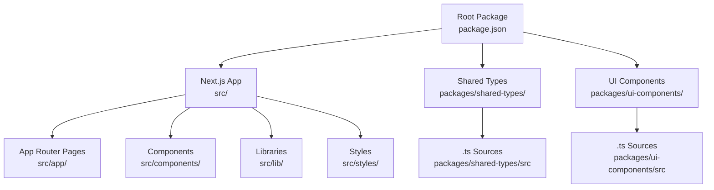
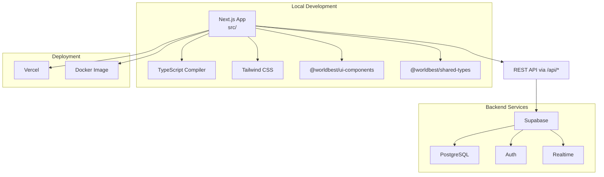
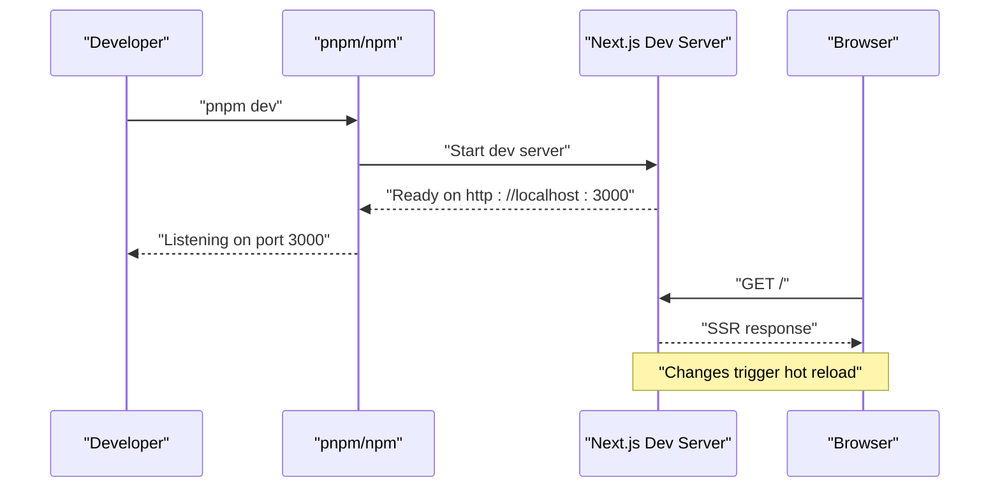
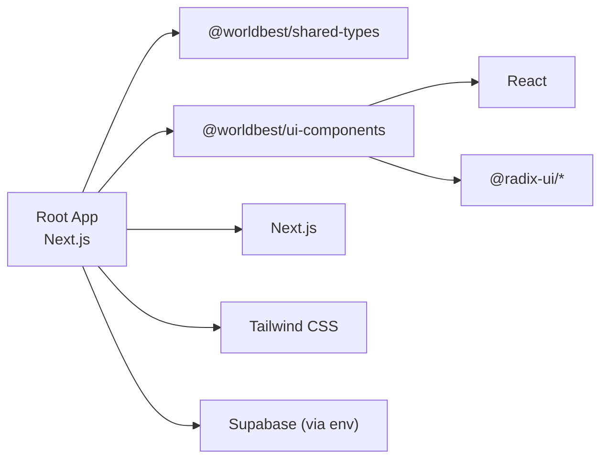

# Development Setup

<cite>
**Referenced Files in This Document**
- [README.md](file://README.md)
- [DEPLOYMENT.md](file://DEPLOYMENT.md)
- [START_HERE.md](file://START_HERE.md)
- [package.json](file://package.json)
- [packages/ui-components/package.json](file://packages/ui-components/package.json)
- [packages/shared-types/package.json](file://packages/shared-types/package.json)
- [next.config.js](file://next.config.js)
- [tsconfig.json](file://tsconfig.json)
- [tailwind.config.js](file://tailwind.config.js)
- [vercel.json](file://vercel.json)
- [Dockerfile](file://Dockerfile)
- [deploy.sh](file://deploy.sh)
</cite>

## Table of Contents
1. [Introduction](#introduction)
2. [Project Structure](#project-structure)
3. [Core Components](#core-components)
4. [Architecture Overview](#architecture-overview)
5. [Detailed Component Analysis](#detailed-component-analysis)
6. [Dependency Analysis](#dependency-analysis)
7. [Performance Considerations](#performance-considerations)
8. [Troubleshooting Guide](#troubleshooting-guide)
9. [Conclusion](#conclusion)
10. [Appendices](#appendices)

## Introduction
This document provides a complete development setup guide for the project, focusing on environment configuration, dependency management, and local development server setup. It explains prerequisites (Node.js version, package manager, and system dependencies), step-by-step installation, environment variable configuration, and database setup. It also covers development server startup, hot reloading, debugging, common development tasks, environment configuration for different deployment targets, troubleshooting, project structure for contributors, IDE recommendations, workflow best practices, performance optimization during development, and security considerations for local environments.

## Project Structure
The project is a Next.js 14 application using TypeScript and a monorepo-like structure for shared packages. The frontend code resides under src, while shared UI components and shared types are located under packages.

**Diagram sources**
- [package.json](file://package.json#L1-L80)
- [packages/shared-types/package.json](file://packages/shared-types/package.json#L1-L17)
- [packages/ui-components/package.json](file://packages/ui-components/package.json#L1-L54)

**Section sources**
- [README.md](file://README.md#L73-L104)
- [package.json](file://package.json#L1-L80)
- [packages/shared-types/package.json](file://packages/shared-types/package.json#L1-L17)
- [packages/ui-components/package.json](file://packages/ui-components/package.json#L1-L54)

## Core Components
- Next.js 14 application with TypeScript and App Router
- Monorepo-style packages for shared types and UI components
- Tailwind CSS for styling and Radix UI for primitives
- Supabase for database, authentication, and real-time features
- Vercel for hosting and deployment automation
- Docker for containerized builds and runtime

Prerequisites and supported Node.js version are defined in the root package configuration.

**Section sources**
- [README.md](file://README.md#L110-L116)
- [package.json](file://package.json#L77-L79)
- [packages/ui-components/package.json](file://packages/ui-components/package.json#L51-L53)
- [packages/shared-types/package.json](file://packages/shared-types/package.json#L1-L17)

## Architecture Overview
The development stack centers on Next.js with TypeScript, using shared packages for types and UI components. Supabase provides backend services (PostgreSQL, Auth, Storage, Realtime). Vercel hosts the application, and Docker supports local and CI builds.

**Diagram sources**
- [next.config.js](file://next.config.js#L1-L56)
- [tsconfig.json](file://tsconfig.json#L1-L38)
- [tailwind.config.js](file://tailwind.config.js#L1-L108)
- [vercel.json](file://vercel.json#L1-L4)
- [Dockerfile](file://Dockerfile#L1-L73)

## Detailed Component Analysis

### Environment and Prerequisites
- Node.js: Version requirement is specified in engines.
- Package manager: pnpm is recommended and used in Docker; npm is also supported.
- Additional tools: Git; optional Docker for local services.

Installation steps and environment setup are documented in the project’s README.

**Section sources**
- [package.json](file://package.json#L77-L79)
- [README.md](file://README.md#L110-L116)
- [README.md](file://README.md#L125-L139)

### Dependency Management
- Root dependencies include Next.js, React, Radix UI, Tailwind CSS, TanStack Query, and others.
- Dev dependencies include TypeScript, ESLint, and related configs.
- Shared packages are linked locally via file: dependencies and built with TypeScript.

Monorepo build order:
- Build shared types and UI components first, then the web application.

**Section sources**
- [package.json](file://package.json#L13-L63)
- [package.json](file://package.json#L64-L76)
- [packages/shared-types/package.json](file://packages/shared-types/package.json#L1-L17)
- [packages/ui-components/package.json](file://packages/ui-components/package.json#L1-L54)
- [Dockerfile](file://Dockerfile#L34-L41)

### Local Development Server Setup
- Development script runs Next.js dev server.
- The default local URL is http://localhost:3000.
- Hot reloading is enabled by default in Next.js dev mode.

**Diagram sources**
- [package.json](file://package.json#L6-L12)
- [README.md](file://README.md#L136-L144)

**Section sources**
- [package.json](file://package.json#L6-L12)
- [README.md](file://README.md#L136-L144)

### Environment Variable Configuration
- Next.js configuration defines public environment variables for the client.
- The application expects Supabase-related variables for database and auth.
- A deployment script demonstrates how to pass environment variables to Vercel.

Recommended variables (public and private) are documented in the deployment guide.

**Section sources**
- [next.config.js](file://next.config.js#L24-L27)
- [DEPLOYMENT.md](file://DEPLOYMENT.md#L14-L55)
- [deploy.sh](file://deploy.sh#L4-L12)

### Database Setup
- Supabase is configured as the backend with PostgreSQL, Auth, and Realtime.
- The deployment guide outlines environment variables and quick copy-paste format.
- Options for setting up database tables include Supabase Dashboard, Prisma migrations, or running SQL scripts.

**Section sources**
- [DEPLOYMENT.md](file://DEPLOYMENT.md#L16-L87)

### Rewrites, Redirects, and Public URLs
- Next.js rewrites proxy requests under /api/* to the configured backend URL.
- A redirect sends authenticated users from the root to the dashboard.
- Remote image patterns include GitHub avatars, Unsplash, and a local MinIO endpoint.

**Section sources**
- [next.config.js](file://next.config.js#L28-L51)
- [next.config.js](file://next.config.js#L7-L23)

### Type Checking and Path Aliases
- TypeScript strict mode is enabled with incremental compilation.
- Path aliases simplify imports across the app and shared packages.
- The base URL and path mapping are defined centrally.

**Section sources**
- [tsconfig.json](file://tsconfig.json#L3-L22)
- [tsconfig.json](file://tsconfig.json#L24-L34)

### Styling with Tailwind CSS
- Tailwind is configured to scan components, pages, and shared UI components.
- Theme extensions define colors, animations, and typography plugins.

**Section sources**
- [tailwind.config.js](file://tailwind.config.js#L4-L9)
- [tailwind.config.js](file://tailwind.config.js#L18-L101)

### Containerization and Production Runtime
- Dockerfile uses a multi-stage build with pnpm, installs dependencies, builds shared packages, then builds and runs the Next.js app.
- The production image exposes port 3000 and runs the standalone server.

**Section sources**
- [Dockerfile](file://Dockerfile#L1-L73)

### Deployment Target Configuration
- Vercel framework is set to Next.js.
- The deployment guide documents environment variables and quick copy-paste format.
- A convenience script automates deploying with environment variables to Vercel.

**Section sources**
- [vercel.json](file://vercel.json#L1-L4)
- [DEPLOYMENT.md](file://DEPLOYMENT.md#L1-L55)
- [deploy.sh](file://deploy.sh#L1-L13)

### IDE Setup Recommendations
- Use TypeScript-aware editors with ESLint and Prettier integrations.
- Enable TypeScript checking and linting in your editor.
- Recommended extensions include TypeScript, ESLint, and Tailwind CSS IntelliSense.

**Section sources**
- [README.md](file://README.md#L302-L308)

### Development Workflow Best Practices
- Branching strategy: feature branches with conventional commits.
- Code style: strict TypeScript, ESLint, and formatting standards.
- Testing: planned unit, integration, and E2E test suites.
- Pull request guidelines: tests, linting, documentation updates, and reviews.

**Section sources**
- [README.md](file://README.md#L280-L316)

### Practical Examples of Common Development Tasks
- Start development server
- Build for production
- Start production server
- Run linting and type checks
- Copy environment template and edit local variables

**Section sources**
- [README.md](file://README.md#L146-L155)
- [README.md](file://README.md#L130-L134)

## Dependency Analysis
The project uses a hybrid dependency model:
- Root Next.js app depends on shared packages via file: links.
- Shared packages depend on React and Radix UI.
- Next.js configuration transpiles shared packages and externalizes a database package.

**Diagram sources**
- [package.json](file://package.json#L34-L35)
- [packages/ui-components/package.json](file://packages/ui-components/package.json#L14-L40)
- [next.config.js](file://next.config.js#L4-L6)

**Section sources**
- [package.json](file://package.json#L34-L35)
- [packages/ui-components/package.json](file://packages/ui-components/package.json#L14-L40)
- [next.config.js](file://next.config.js#L4-L6)

## Performance Considerations
- Development performance tips:
  - Keep TypeScript strict mode enabled for early bug detection.
  - Use path aliases to reduce deep import paths.
  - Leverage Tailwind’s purge and JIT modes for faster rebuilds.
  - Prefer lightweight components and avoid unnecessary re-renders.
- Production optimization targets are documented in the implementation plan.

**Section sources**
- [README.md](file://README.md#L261-L274)

## Troubleshooting Guide
Common setup issues and resolutions:
- Node.js version mismatch: ensure Node.js meets the engines requirement.
- Missing environment variables: configure Supabase variables as per the deployment guide.
- Database connection failures: verify connection strings and SSL settings.
- Build failures: check Vercel logs, ensure all dependencies are present, and resolve TypeScript errors.
- Local image serving: confirm remotePatterns include required hosts and ports.

**Section sources**
- [package.json](file://package.json#L77-L79)
- [DEPLOYMENT.md](file://DEPLOYMENT.md#L116-L133)
- [next.config.js](file://next.config.js#L7-L23)

## Conclusion
This guide consolidates environment setup, dependency management, local development server configuration, and deployment preparation for contributors. By following the documented steps and leveraging the provided configurations, developers can quickly establish a productive local environment aligned with the project’s architecture and deployment targets.

## Appendices

### Appendix A: Environment Variables Reference
- Public variables for the frontend
- Private variables for the backend
- Supabase-specific variables and connection strings

**Section sources**
- [next.config.js](file://next.config.js#L24-L27)
- [DEPLOYMENT.md](file://DEPLOYMENT.md#L14-L55)

### Appendix B: Next.js Configuration Highlights
- Transpiled packages
- Externalized packages
- Image remote patterns
- Environment variables exposed to the client
- Rewrites and redirects

**Section sources**
- [next.config.js](file://next.config.js#L3-L6)
- [next.config.js](file://next.config.js#L7-L23)
- [next.config.js](file://next.config.js#L24-L51)

### Appendix C: Monorepo Build Order
- Build shared types and UI components
- Build the web application
- Run production server

**Section sources**
- [Dockerfile](file://Dockerfile#L34-L41)