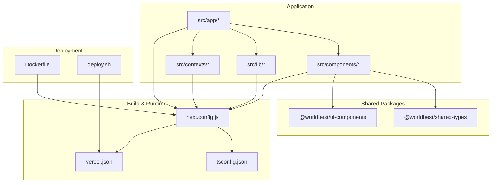
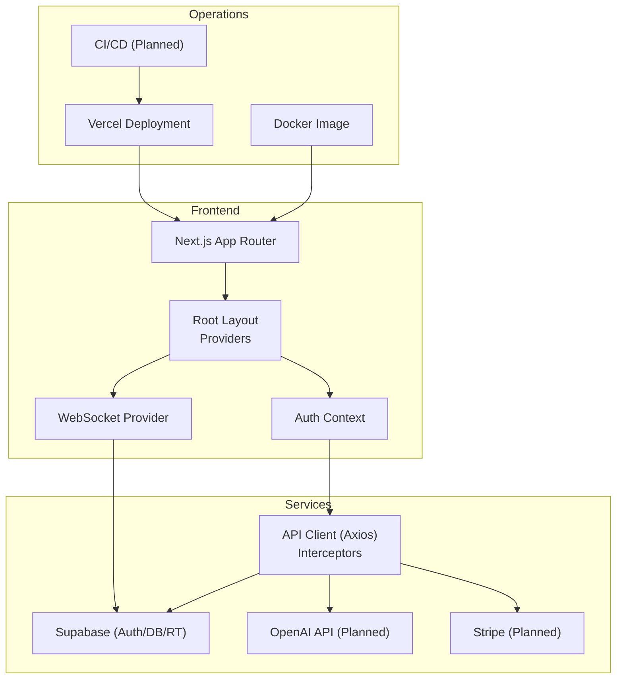
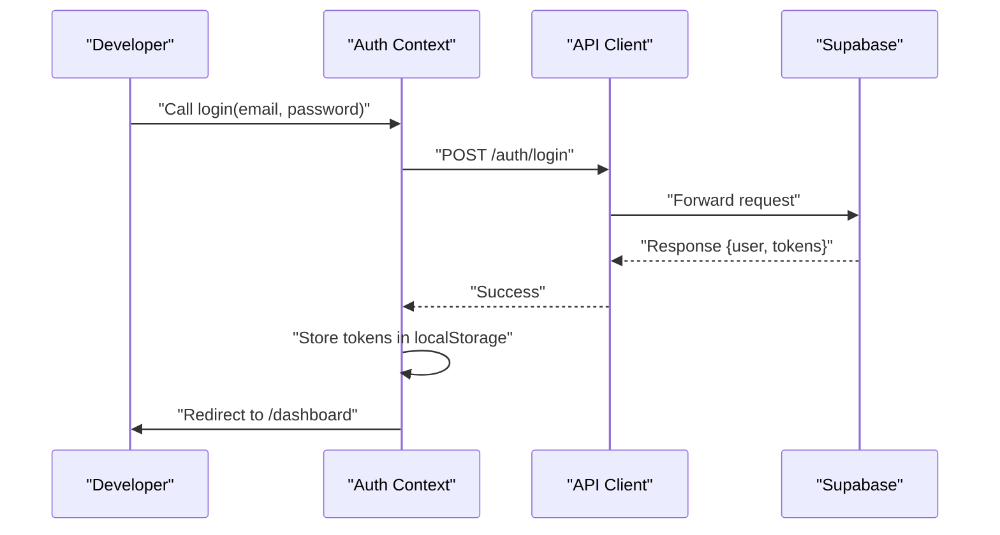
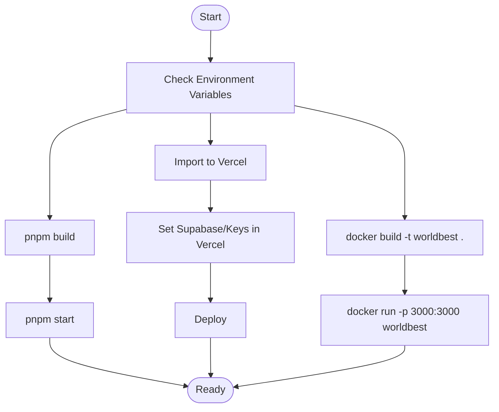
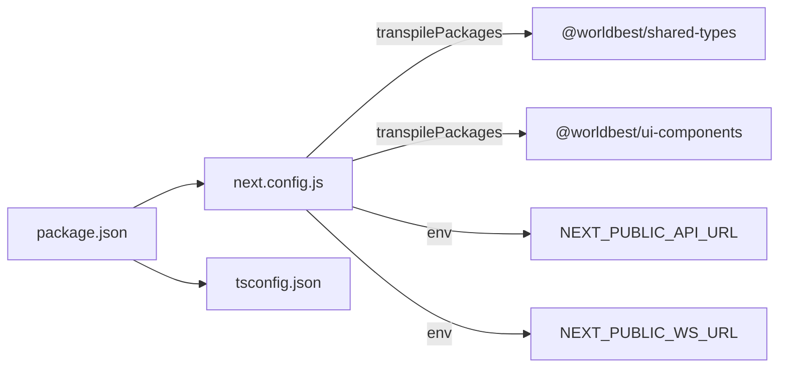

# Development Workflow

<cite>
**Referenced Files in This Document**
- [README.md](file://README.md)
- [START_HERE.md](file://START_HERE.md)
- [IMPLEMENTATION_PLAN.md](file://IMPLEMENTATION_PLAN.md)
- [DEPLOYMENT.md](file://DEPLOYMENT.md)
- [package.json](file://package.json)
- [next.config.js](file://next.config.js)
- [tsconfig.json](file://tsconfig.json)
- [Dockerfile](file://Dockerfile)
- [deploy.sh](file://deploy.sh)
- [vercel.json](file://vercel.json)
- [src/app/layout.tsx](file://src/app/layout.tsx)
- [src/components/providers.tsx](file://src/components/providers.tsx)
- [src/components/websocket/websocket-provider.tsx](file://src/components/websocket/websocket-provider.tsx)
- [src/contexts/auth-context.tsx](file://src/contexts/auth-context.tsx)
- [src/lib/api.ts](file://src/lib/api.ts)
</cite>

## Table of Contents
1. [Introduction](#introduction)
2. [Project Structure](#project-structure)
3. [Core Components](#core-components)
4. [Architecture Overview](#architecture-overview)
5. [Detailed Component Analysis](#detailed-component-analysis)
6. [Dependency Analysis](#dependency-analysis)
7. [Performance Considerations](#performance-considerations)
8. [Troubleshooting Guide](#troubleshooting-guide)
9. [Conclusion](#conclusion)
10. [Appendices](#appendices)

## Introduction
This document defines the end-to-end development workflow for the WorldBest AI-powered writing platform. It covers environment setup, debugging, testing strategies, build and deployment processes, continuous integration, release management, implementation plan execution, milestone tracking, and team collaboration. It also documents contribution guidelines, code review processes, code quality tools, performance testing, and security scanning. The content is designed to be accessible to beginners while providing sufficient technical depth for experienced developers.

## Project Structure
The project follows a Next.js 14 App Router monorepo-style structure with shared packages and a client application. Key areas:
- Application code under src/app and src/components
- Shared packages under packages/
- Build and runtime configuration in next.config.js, tsconfig.json, vercel.json
- Containerization and deployment automation in Dockerfile and deploy.sh
- Comprehensive execution plan and documentation in IMPLEMENTATION_PLAN.md and START_HERE.md

**Diagram sources**
- [next.config.js](file://next.config.js#L1-L56)
- [tsconfig.json](file://tsconfig.json#L1-L38)
- [vercel.json](file://vercel.json#L1-L4)
- [Dockerfile](file://Dockerfile#L1-L73)
- [deploy.sh](file://deploy.sh#L1-L13)

**Section sources**
- [README.md](file://README.md#L73-L104)
- [next.config.js](file://next.config.js#L1-L56)
- [tsconfig.json](file://tsconfig.json#L1-L38)
- [vercel.json](file://vercel.json#L1-L4)

## Core Components
- Application shell and metadata: Root layout and providers configure theme, query client, auth, and WebSocket contexts.
- Authentication: Context-based auth with token persistence and refresh logic.
- API client: Axios-based client with request/response interceptors for auth and token refresh.
- WebSocket: Provider that connects/disconnects based on auth state and handles reconnection and auth errors.
- Routing and environment: Next.js configuration with redirects, rewrites, and environment variables for API and WebSocket URLs.

Practical implications:
- Providers wrap the app to supply global state and services.
- Auth context manages user lifecycle and integrates with the API client.
- WebSocket provider ensures real-time features activate only when authenticated.
- next.config.js centralizes environment-driven routing and proxying.

**Section sources**
- [src/app/layout.tsx](file://src/app/layout.tsx#L1-L102)
- [src/components/providers.tsx](file://src/components/providers.tsx#L1-L55)
- [src/contexts/auth-context.tsx](file://src/contexts/auth-context.tsx#L1-L154)
- [src/lib/api.ts](file://src/lib/api.ts#L1-L67)
- [src/components/websocket/websocket-provider.tsx](file://src/components/websocket/websocket-provider.tsx#L1-L138)
- [next.config.js](file://next.config.js#L24-L51)

## Architecture Overview
The system architecture integrates a Next.js frontend with Supabase backend services, real-time collaboration via WebSocket, and optional containerized deployment. The execution plan organizes feature delivery across phases with clear milestones and acceptance criteria.

**Diagram sources**
- [src/app/layout.tsx](file://src/app/layout.tsx#L83-L101)
- [src/components/providers.tsx](file://src/components/providers.tsx#L10-L54)
- [src/contexts/auth-context.tsx](file://src/contexts/auth-context.tsx#L30-L145)
- [src/lib/api.ts](file://src/lib/api.ts#L3-L67)
- [src/components/websocket/websocket-provider.tsx](file://src/components/websocket/websocket-provider.tsx#L17-L93)
- [next.config.js](file://next.config.js#L24-L51)
- [DEPLOYMENT.md](file://DEPLOYMENT.md#L3-L38)
- [Dockerfile](file://Dockerfile#L1-L73)
- [IMPLEMENTATION_PLAN.md](file://IMPLEMENTATION_PLAN.md#L665-L704)

**Section sources**
- [README.md](file://README.md#L49-L72)
- [IMPLEMENTATION_PLAN.md](file://IMPLEMENTATION_PLAN.md#L665-L704)

## Detailed Component Analysis

### Development Environment Setup
- Prerequisites: Node.js 18+, pnpm/npm, Git, Docker (optional).
- Steps: Clone → Install dependencies → Configure environment variables → Run dev server.
- Scripts: dev, build, start, lint, type-check.

Recommended tasks:
- Create .env.local from .env.example and populate Supabase and public variables.
- Verify NEXT_PUBLIC_API_URL and NEXT_PUBLIC_WS_URL in next.config.js align with your backend.
- Confirm package manager compatibility (pnpm recommended).

**Section sources**
- [README.md](file://README.md#L110-L155)
- [next.config.js](file://next.config.js#L24-L27)

### Debugging Techniques
Common debugging scenarios and approaches:
- Authentication issues
  - Verify tokens in localStorage and Authorization header propagation.
  - Check refresh endpoint and interceptor behavior.
  - Inspect auth context state and router redirects.
- WebSocket problems
  - Confirm cookie-based auth token extraction.
  - Observe connect/connect_error events and reconnection attempts.
  - Validate backend WebSocket URL and transport settings.
- API routing and proxying
  - Use next.config.js rewrites to forward /api/* to backend.
  - Check redirect logic for authenticated users.

**Diagram sources**
- [src/contexts/auth-context.tsx](file://src/contexts/auth-context.tsx#L57-L73)
- [src/lib/api.ts](file://src/lib/api.ts#L39-L53)

**Section sources**
- [src/contexts/auth-context.tsx](file://src/contexts/auth-context.tsx#L39-L55)
- [src/lib/api.ts](file://src/lib/api.ts#L24-L65)
- [next.config.js](file://next.config.js#L28-L51)

### Testing Methodologies
Testing is planned across unit, integration, and component levels with specific tools and targets:
- Unit tests: Vitest with coverage and test scripts.
- Integration/E2E: Playwright for cross-browser end-to-end flows.
- Component tests: React Testing Library with MSW mocks.
- Accessibility: Automated a11y tests aligned with WCAG.
Targets: >80% coverage for critical paths, 100% coverage for critical user flows.

Execution guidance:
- Phase 3 of the implementation plan outlines setup and test suites.
- Use the weekly checklist to schedule test coverage milestones.

**Section sources**
- [README.md](file://README.md#L190-L206)
- [IMPLEMENTATION_PLAN.md](file://IMPLEMENTATION_PLAN.md#L359-L490)
- [START_HERE.md](file://START_HERE.md#L128-L139)

### Build and Deployment Processes
- Local builds: pnpm build and pnpm start.
- Vercel deployment: One-click import and environment variable configuration.
- Manual deployment: Build then start the production server.
- Docker deployment: Multi-stage build producing a standalone Next.js app.

**Diagram sources**
- [README.md](file://README.md#L210-L232)
- [DEPLOYMENT.md](file://DEPLOYMENT.md#L3-L38)
- [Dockerfile](file://Dockerfile#L38-L72)
- [deploy.sh](file://deploy.sh#L1-L13)

**Section sources**
- [README.md](file://README.md#L210-L232)
- [DEPLOYMENT.md](file://DEPLOYMENT.md#L1-L147)
- [Dockerfile](file://Dockerfile#L1-L73)
- [deploy.sh](file://deploy.sh#L1-L13)
- [vercel.json](file://vercel.json#L1-L4)

### Continuous Integration and Release Management
Planned CI/CD pipeline includes:
- GitHub Actions workflows for linting, testing, staging/production deployments, and preview deployments.
- Dependabot for automated dependency updates and security scanning.
- Zero-downtime deployment strategy with rollback capability.

Execution plan:
- Phase 5 of the implementation plan details CI/CD setup, preview deployments, and operational runbooks.

**Section sources**
- [IMPLEMENTATION_PLAN.md](file://IMPLEMENTATION_PLAN.md#L665-L704)
- [START_HERE.md](file://START_HERE.md#L154-L163)

### Implementation Plan Execution and Milestone Tracking
The execution plan organizes work into seven phases with acceptance criteria and file-by-file guidance:
- Phase 1: Infrastructure & Foundation (state management, hooks, API clients, error handling)
- Phase 2: Core Feature Completion (story bible, AI, collaboration, billing)
- Phase 3: Testing Infrastructure (unit/integration/component tests)
- Phase 4: Production Optimization (performance, security, monitoring)
- Phase 5: Documentation & DevOps (API docs, CI/CD, Docker, monitoring dashboards)
- Phase 6: Advanced Features (export, analytics, voice/OCR)
- Phase 7: Ongoing (bug fixes, refactoring, performance tuning)

Weekly tracking and go/no-go checkpoints ensure steady progress toward launch.

**Section sources**
- [START_HERE.md](file://START_HERE.md#L98-L190)
- [IMPLEMENTATION_PLAN.md](file://IMPLEMENTATION_PLAN.md#L1-L1173)
- [README.md](file://README.md#L159-L186)

### Contribution Guidelines and Code Review
Workflow:
- Branching: Create feature branches prefixed with feature/.
- Changes: Follow TypeScript strictness, write tests, update docs.
- Commits: Use conventional commit messages.
- Pull Requests: Ensure tests pass, code is linted, documentation updated, and review requested.

Code quality:
- Linting: ESLint with Next.js configuration.
- Formatting: Prettier recommended.
- Type checking: TypeScript strict mode.

**Section sources**
- [README.md](file://README.md#L278-L316)
- [package.json](file://package.json#L64-L76)

### Practical Examples

#### Example: Running Locally
- Clone repository
- Install dependencies
- Copy and edit .env.local
- Start development server
- Open http://localhost:3000

**Section sources**
- [README.md](file://README.md#L117-L144)

#### Example: Adding a New API Endpoint
- Create a new module under src/lib/api/<resource>.ts
- Implement CRUD operations and export functions
- Add TypeScript types and error handling
- Integrate with React Query hooks and UI components

**Section sources**
- [IMPLEMENTATION_PLAN.md](file://IMPLEMENTATION_PLAN.md#L111-L150)
- [src/lib/api.ts](file://src/lib/api.ts#L1-L67)

#### Example: Implementing Real-time Collaboration
- Use WebSocketProvider to manage connections
- Emit and listen for collaboration events
- Implement presence indicators and cursor tracking
- Add reconnection logic and auth error handling

**Section sources**
- [src/components/websocket/websocket-provider.tsx](file://src/components/websocket/websocket-provider.tsx#L17-L93)
- [IMPLEMENTATION_PLAN.md](file://IMPLEMENTATION_PLAN.md#L275-L314)

#### Example: Deploying to Vercel
- Import repository
- Configure environment variables
- Deploy and monitor logs
- Optionally set up custom domain

**Section sources**
- [DEPLOYMENT.md](file://DEPLOYMENT.md#L3-L38)
- [deploy.sh](file://deploy.sh#L1-L13)

## Dependency Analysis
The application relies on Next.js, TypeScript, Radix UI, TanStack Query, Zustand, and external services (Supabase, OpenAI, Stripe). The configuration ensures:
- Transpilation of shared packages
- Remote image domains
- Environment-driven API/WebSocket URLs
- Redirects and rewrites for seamless routing

**Diagram sources**
- [package.json](file://package.json#L13-L62)
- [next.config.js](file://next.config.js#L4-L27)
- [tsconfig.json](file://tsconfig.json#L24-L34)

**Section sources**
- [package.json](file://package.json#L1-L80)
- [next.config.js](file://next.config.js#L1-L56)
- [tsconfig.json](file://tsconfig.json#L1-L38)

## Performance Considerations
Planned optimizations include:
- Code splitting and dynamic imports
- Bundle size reduction and tree-shaking
- Image optimization and responsive assets
- Web Vitals monitoring and performance budgets
- Database query optimization and caching

Targets:
- Lighthouse Performance >90
- Time to Interactive <3s
- First Contentful Paint <1.5s
- Bundle Size <300KB gzipped

**Section sources**
- [README.md](file://README.md#L261-L274)
- [IMPLEMENTATION_PLAN.md](file://IMPLEMENTATION_PLAN.md#L492-L533)

## Troubleshooting Guide
Common issues and resolutions:
- Authentication
  - Inconsistent token storage: Align token persistence to a single secure method.
  - Duplicate API client instances: Ensure a single API client instance is imported and reused.
  - Fragile WebSocket authentication: Use cookie-based auth and validate token lifecycle.
- Database connectivity
  - Verify environment variables in Vercel and connection string format.
  - Ensure SSL mode is enabled and pooler settings are correct.
- Build failures
  - Check Vercel logs, verify dependencies, resolve TypeScript errors, and confirm environment variables.

**Section sources**
- [README.md](file://README.md#L344-L356)
- [DEPLOYMENT.md](file://DEPLOYMENT.md#L116-L133)

## Conclusion
This development workflow ties together environment setup, debugging, testing, build/deployment, CI/CD, and project execution. By following the phased implementation plan, leveraging the provided configuration files, and adhering to contribution and quality standards, the team can deliver a production-ready platform with strong reliability, performance, and security.

## Appendices

### Appendix A: Quick Commands Reference
- Development: pnpm dev
- Build: pnpm build
- Start: pnpm start
- Lint: pnpm lint
- Type check: pnpm type-check
- Deploy to Vercel: pnpm vercel (via deploy script)
- Docker build/run: docker build -t worldbest .; docker run -p 3000:3000 worldbest

**Section sources**
- [README.md](file://README.md#L146-L155)
- [deploy.sh](file://deploy.sh#L1-L13)
- [Dockerfile](file://Dockerfile#L38-L72)