# Project Management

<cite>
**Referenced Files in This Document**
- [README.md](file://README.md)
- [EXECUTIVE_SUMMARY.md](file://EXECUTIVE_SUMMARY.md)
- [IMPLEMENTATION_PLAN.md](file://IMPLEMENTATION_PLAN.md)
- [QUICK_START_CHECKLIST.md](file://QUICK_START_CHECKLIST.md)
- [DOCS_INDEX.md](file://DOCS_INDEX.md)
- [START_HERE.md](file://START_HERE.md)
- [DEPLOYMENT.md](file://DEPLOYMENT.md)
- [package.json](file://package.json)
- [next.config.js](file://next.config.js)
- [tailwind.config.js](file://tailwind.config.js)
- [tsconfig.json](file://tsconfig.json)
- [src/lib/api.ts](file://src/lib/api.ts)
- [src/contexts/auth-context.tsx](file://src/contexts/auth-context.tsx)
- [src/components/websocket/websocket-provider.tsx](file://src/components/websocket/websocket-provider.tsx)
</cite>

## Table of Contents
1. [Introduction](#introduction)
2. [Project Structure](#project-structure)
3. [Core Components](#core-components)
4. [Architecture Overview](#architecture-overview)
5. [Detailed Component Analysis](#detailed-component-analysis)
6. [Dependency Analysis](#dependency-analysis)
7. [Performance Considerations](#performance-considerations)
8. [Troubleshooting Guide](#troubleshooting-guide)
9. [Conclusion](#conclusion)
10. [Appendices](#appendices)

## Introduction
This document provides project management workflows for the WorldBest AI-Powered Writing Platform, focusing on implementation planning, milestone tracking, and team collaboration processes. It explains how to execute the implementation plan, manage the feature roadmap, and apply sprint planning methodologies. It also documents the documentation workflow, version control practices, and code review processes, along with project tracking systems, issue management, and release planning. Practical examples of planning templates, progress tracking methodologies, and stakeholder communication strategies are included, alongside contribution guidelines, onboarding processes, and team coordination workflows. Finally, it addresses project risk management, scope changes, and delivery timelines.

## Project Structure
The repository provides a comprehensive documentation suite and a clear development structure aligned with Next.js 14 and TypeScript. The documentation includes:
- Executive Summary: High-level strategic overview, current state, resource requirements, success metrics, risk management, and go/no-go criteria
- Implementation Plan: Seven-phase roadmap with detailed tasks, acceptance criteria, and file-by-file guidance
- Quick Start Checklist: Week-by-week execution plan, daily/weekly templates, and pre-launch checklist
- Deployment Guide: Vercel deployment instructions and environment configuration
- Documentation Index: Role-based navigation and common tasks reference
- Start Here: Execution summary and critical path highlights

The codebase demonstrates:
- Authentication context and API client with token management
- WebSocket provider for real-time collaboration
- UI component library integration (Radix UI) and Tailwind CSS theming
- Project structure supporting modular development and shared packages

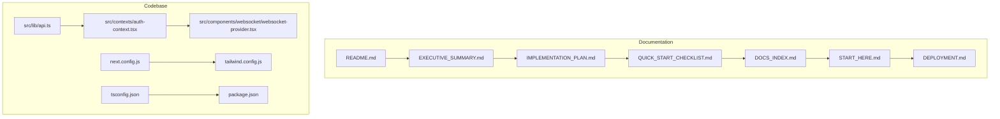

**Diagram sources**
- [README.md](file://README.md#L1-L426)
- [EXECUTIVE_SUMMARY.md](file://EXECUTIVE_SUMMARY.md#L1-L454)
- [IMPLEMENTATION_PLAN.md](file://IMPLEMENTATION_PLAN.md#L1-L1173)
- [QUICK_START_CHECKLIST.md](file://QUICK_START_CHECKLIST.md#L1-L380)
- [DOCS_INDEX.md](file://DOCS_INDEX.md#L1-L416)
- [START_HERE.md](file://START_HERE.md#L1-L477)
- [DEPLOYMENT.md](file://DEPLOYMENT.md#L1-L147)
- [src/lib/api.ts](file://src/lib/api.ts#L1-L67)
- [src/contexts/auth-context.tsx](file://src/contexts/auth-context.tsx#L1-L154)
- [src/components/websocket/websocket-provider.tsx](file://src/components/websocket/websocket-provider.tsx#L1-L138)
- [next.config.js](file://next.config.js#L1-L56)
- [tailwind.config.js](file://tailwind.config.js#L1-L108)
- [tsconfig.json](file://tsconfig.json#L1-L38)
- [package.json](file://package.json#L1-L80)

**Section sources**
- [README.md](file://README.md#L1-L426)
- [DOCS_INDEX.md](file://DOCS_INDEX.md#L1-L416)
- [START_HERE.md](file://START_HERE.md#L1-L477)

## Core Components
This section outlines the core project management components derived from the documentation suite and codebase:

- Implementation Plan Execution
  - Seven-phase roadmap with detailed tasks, acceptance criteria, and timeline estimates
  - File-by-file guidance for each task to ensure traceability and consistency
  - Priority framework (Critical, High, Medium, Low) to guide resource allocation

- Feature Roadmap Management
  - Executable phases: Infrastructure & Foundation, Core Feature Completion, Testing Infrastructure, Production Optimization, Documentation & DevOps, Advanced Features, Bug Fixes & Refactoring
  - Success metrics and KPIs to track progress and readiness

- Sprint Planning Methodologies
  - Week-by-week execution in the Quick Start Checklist
  - Daily standup and weekly review templates for continuous alignment
  - Critical path items to prioritize launch-blocking deliverables

- Documentation Workflow
  - Central navigation hub (Documentation Index) with role-based guides
  - Maintenance standards and update frequency for documentation
  - Cross-linking between documents to maintain coherence

- Version Control Practices
  - Branching and PR workflow described in contributing guidelines
  - Conventional commits and linting/formatting standards
  - Automated testing and deployment pipelines planned in Phase 5

- Code Review Processes
  - Pull request guidelines requiring tests, linting, documentation updates, and team lead review
  - Quality gates for merges

- Project Tracking Systems and Issue Management
  - Use of the Quick Start Checklist for tracking progress and blockers
  - Go/no-go criteria for launch readiness
  - Known issues catalog and remediation steps

- Release Planning
  - Pre-launch checklist with technical, infrastructure, and business readiness criteria
  - Rollback plan and stakeholder approval requirements

**Section sources**
- [EXECUTIVE_SUMMARY.md](file://EXECUTIVE_SUMMARY.md#L82-L295)
- [IMPLEMENTATION_PLAN.md](file://IMPLEMENTATION_PLAN.md#L1-L1173)
- [QUICK_START_CHECKLIST.md](file://QUICK_START_CHECKLIST.md#L1-L380)
- [DOCS_INDEX.md](file://DOCS_INDEX.md#L337-L357)
- [README.md](file://README.md#L278-L317)

## Architecture Overview
The project’s architecture integrates frontend, backend services, and DevOps tooling as outlined below. The documentation aligns with the current codebase and future implementation plan.

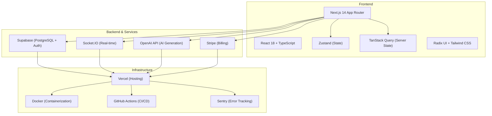

**Diagram sources**
- [README.md](file://README.md#L49-L72)
- [EXECUTIVE_SUMMARY.md](file://EXECUTIVE_SUMMARY.md#L129-L151)
- [IMPLEMENTATION_PLAN.md](file://IMPLEMENTATION_PLAN.md#L582-L612)

**Section sources**
- [README.md](file://README.md#L49-L72)
- [EXECUTIVE_SUMMARY.md](file://EXECUTIVE_SUMMARY.md#L129-L151)

## Detailed Component Analysis

### Implementation Plan Execution
The Implementation Plan provides a structured, executable roadmap with seven phases. Each phase includes tasks, acceptance criteria, and file-by-file guidance. The plan balances feature development with production readiness, ensuring quality, performance, and observability.

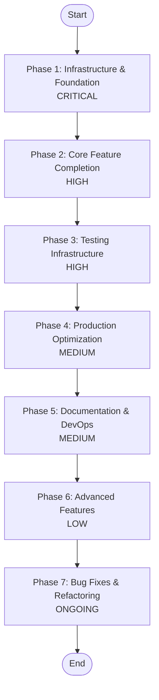

**Diagram sources**
- [IMPLEMENTATION_PLAN.md](file://IMPLEMENTATION_PLAN.md#L25-L749)

**Section sources**
- [IMPLEMENTATION_PLAN.md](file://IMPLEMENTATION_PLAN.md#L25-L749)

### Feature Roadmap Management
The roadmap is managed through the Executive Summary and Implementation Plan, with explicit success metrics and risk mitigation strategies. The Quick Start Checklist translates the roadmap into weekly deliverables and critical path items.

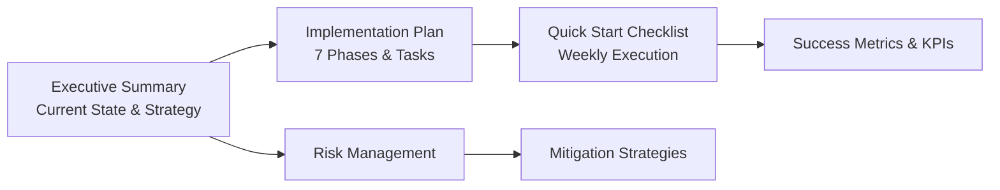

**Diagram sources**
- [EXECUTIVE_SUMMARY.md](file://EXECUTIVE_SUMMARY.md#L184-L244)
- [IMPLEMENTATION_PLAN.md](file://IMPLEMENTATION_PLAN.md#L1-L1173)
- [QUICK_START_CHECKLIST.md](file://QUICK_START_CHECKLIST.md#L1-L380)

**Section sources**
- [EXECUTIVE_SUMMARY.md](file://EXECUTIVE_SUMMARY.md#L184-L244)
- [QUICK_START_CHECKLIST.md](file://QUICK_START_CHECKLIST.md#L282-L326)

### Sprint Planning Methodologies
Sprint planning is supported by the Quick Start Checklist’s weekly breakdown, daily standup template, and weekly review template. Teams can align on priorities, track blockers, and adjust timelines weekly.

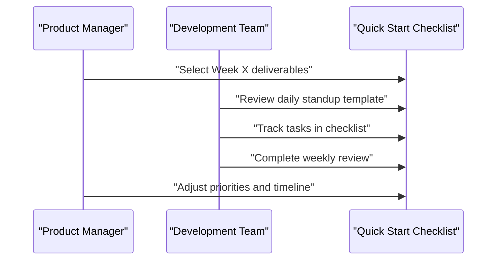

**Diagram sources**
- [QUICK_START_CHECKLIST.md](file://QUICK_START_CHECKLIST.md#L240-L280)

**Section sources**
- [QUICK_START_CHECKLIST.md](file://QUICK_START_CHECKLIST.md#L240-L280)

### Documentation Workflow
The Documentation Index serves as a central hub with role-based guides and maintenance standards. Documentation updates follow a process that encourages contributions and ensures currency.

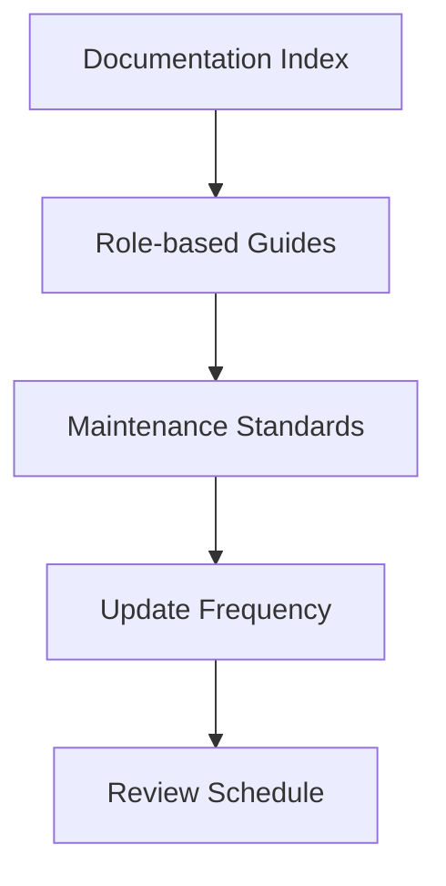

**Diagram sources**
- [DOCS_INDEX.md](file://DOCS_INDEX.md#L337-L357)

**Section sources**
- [DOCS_INDEX.md](file://DOCS_INDEX.md#L337-L357)

### Version Control Practices and Code Review Processes
Version control and code review processes are defined in the contributing guidelines. They emphasize conventional commits, linting, formatting, and comprehensive pull request requirements.

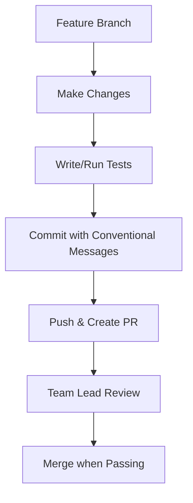

**Diagram sources**
- [README.md](file://README.md#L278-L317)

**Section sources**
- [README.md](file://README.md#L278-L317)

### Project Tracking Systems and Issue Management
Project tracking is facilitated by the Quick Start Checklist’s weekly deliverables and critical path items. The pre-launch checklist defines go/no-go criteria and readiness verification.

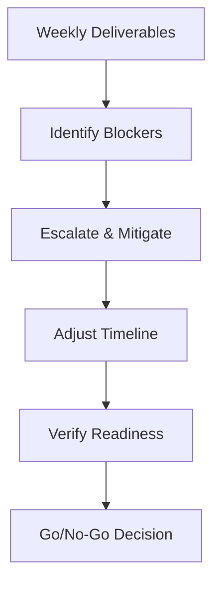

**Diagram sources**
- [QUICK_START_CHECKLIST.md](file://QUICK_START_CHECKCHECKLIST.md#L282-L326)
- [QUICK_START_CHECKLIST.md](file://QUICK_START_CHECKLIST.md#L203-L237)

**Section sources**
- [QUICK_START_CHECKLIST.md](file://QUICK_START_CHECKLIST.md#L282-L326)
- [QUICK_START_CHECKLIST.md](file://QUICK_START_CHECKLIST.md#L203-L237)

### Release Planning
Release planning is anchored in the pre-launch checklist, covering technical, infrastructure, and business readiness. Rollback planning and stakeholder approvals are integral to the go/no-go process.

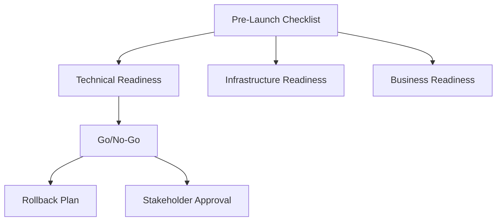

**Diagram sources**
- [QUICK_START_CHECKLIST.md](file://QUICK_START_CHECKLIST.md#L203-L237)

**Section sources**
- [QUICK_START_CHECKLIST.md](file://QUICK_START_CHECKLIST.md#L203-L237)

### Authentication and Token Management
Authentication relies on JWT tokens with refresh logic and cookie-based WebSocket authentication. The current implementation consolidates token storage and improves auth robustness.

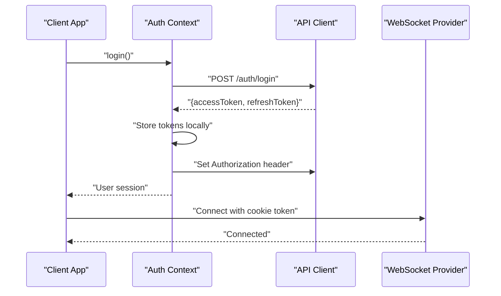

**Diagram sources**
- [src/contexts/auth-context.tsx](file://src/contexts/auth-context.tsx#L57-L125)
- [src/lib/api.ts](file://src/lib/api.ts#L10-L65)
- [src/components/websocket/websocket-provider.tsx](file://src/components/websocket/websocket-provider.tsx#L36-L93)

**Section sources**
- [src/contexts/auth-context.tsx](file://src/contexts/auth-context.tsx#L1-L154)
- [src/lib/api.ts](file://src/lib/api.ts#L1-L67)
- [src/components/websocket/websocket-provider.tsx](file://src/components/websocket/websocket-provider.tsx#L1-L138)

### Real-time Collaboration Infrastructure
The WebSocket provider establishes connections with authentication and auto-reconnection logic. Collaboration features (presence, editing, comments, activity feed) are planned in the Implementation Plan.

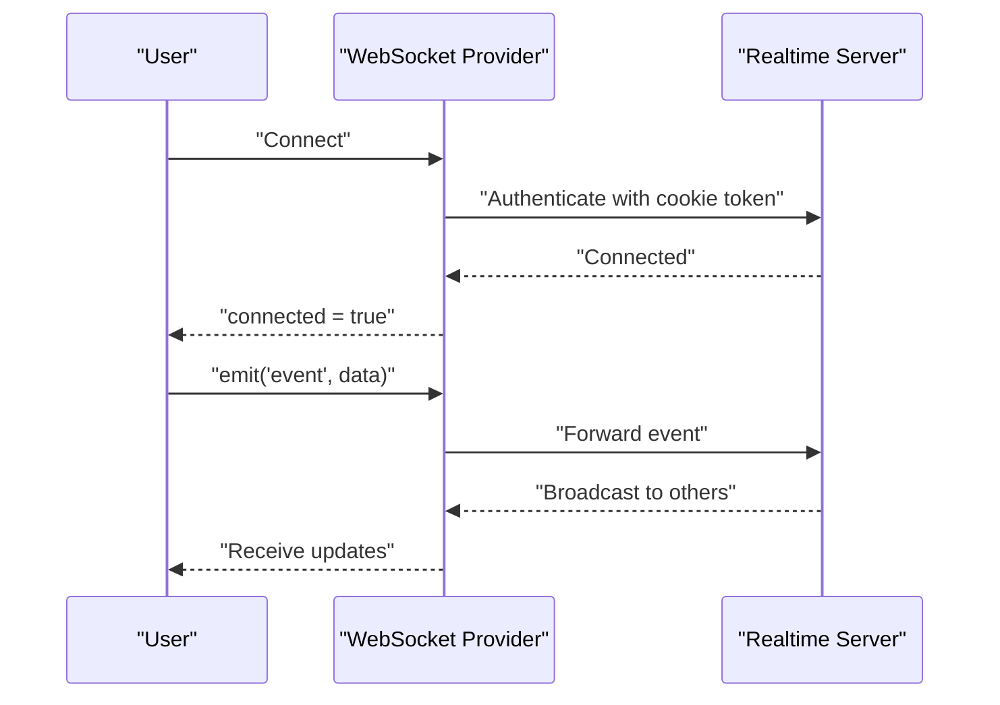

**Diagram sources**
- [src/components/websocket/websocket-provider.tsx](file://src/components/websocket/websocket-provider.tsx#L17-L93)

**Section sources**
- [src/components/websocket/websocket-provider.tsx](file://src/components/websocket/websocket-provider.tsx#L1-L138)
- [IMPLEMENTATION_PLAN.md](file://IMPLEMENTATION_PLAN.md#L275-L314)

### Testing Infrastructure and Coverage
Testing is planned across unit, integration, and component layers with specific coverage targets. The Quick Start Checklist outlines milestones for test setup and coverage achievement.

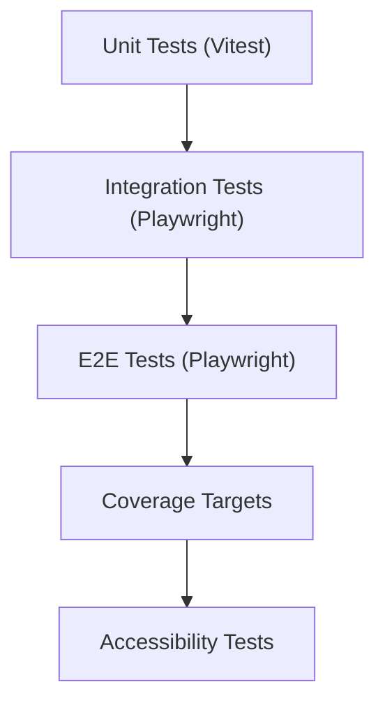

**Diagram sources**
- [IMPLEMENTATION_PLAN.md](file://IMPLEMENTATION_PLAN.md#L359-L490)
- [QUICK_START_CHECKLIST.md](file://QUICK_START_CHECKLIST.md#L99-L127)

**Section sources**
- [IMPLEMENTATION_PLAN.md](file://IMPLEMENTATION_PLAN.md#L359-L490)
- [QUICK_START_CHECKLIST.md](file://QUICK_START_CHECKLIST.md#L99-L127)

### Monitoring and Observability
Monitoring and observability are planned with Sentry for error tracking, structured logging, analytics, health checks, and dashboards. These are part of Phase 4 and Phase 5.

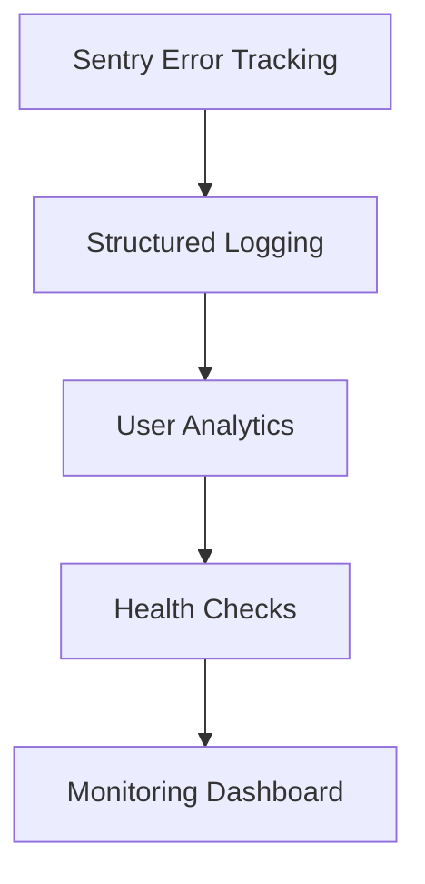

**Diagram sources**
- [IMPLEMENTATION_PLAN.md](file://IMPLEMENTATION_PLAN.md#L578-L618)

**Section sources**
- [IMPLEMENTATION_PLAN.md](file://IMPLEMENTATION_PLAN.md#L578-L618)

### CI/CD Pipeline
CI/CD is planned with GitHub Actions workflows for linting, testing, staging/production deployments, preview deployments, and Dependabot for dependency updates.

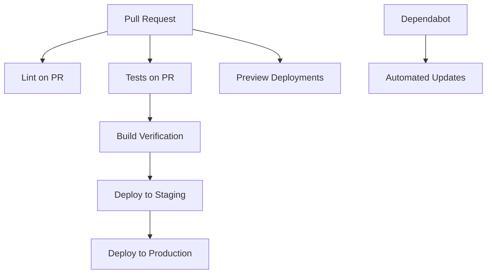

**Diagram sources**
- [IMPLEMENTATION_PLAN.md](file://IMPLEMENTATION_PLAN.md#L665-L704)

**Section sources**
- [IMPLEMENTATION_PLAN.md](file://IMPLEMENTATION_PLAN.md#L665-L704)

### Contribution Guidelines and Onboarding
Contribution guidelines define development workflow, code style, and pull request requirements. Onboarding is supported by the Documentation Index and Quick Start Checklist.

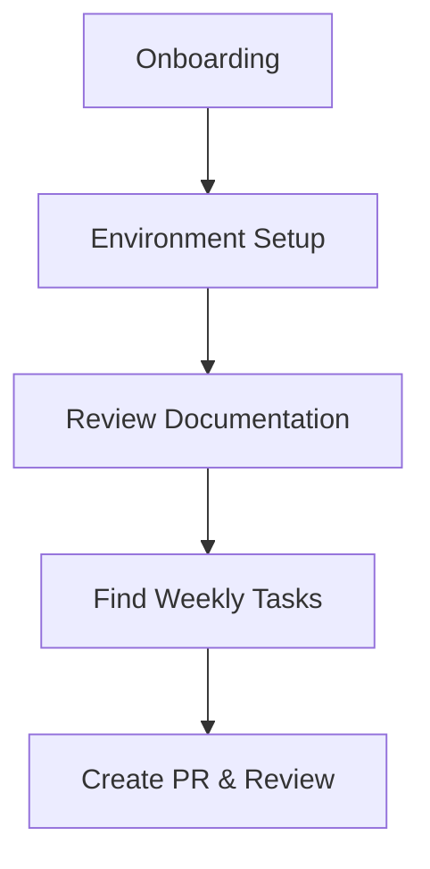

**Diagram sources**
- [README.md](file://README.md#L278-L317)
- [DOCS_INDEX.md](file://DOCS_INDEX.md#L154-L220)
- [QUICK_START_CHECKLIST.md](file://QUICK_START_CHECKLIST.md#L1-L380)

**Section sources**
- [README.md](file://README.md#L278-L317)
- [DOCS_INDEX.md](file://DOCS_INDEX.md#L154-L220)
- [QUICK_START_CHECKLIST.md](file://QUICK_START_CHECKLIST.md#L1-L380)

### Team Coordination Workflows
Team coordination is supported by daily standups, weekly reviews, and role-based documentation. The Documentation Index provides quick links and templates.

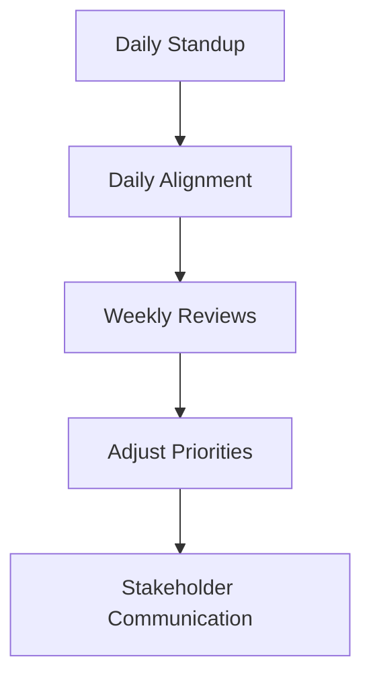

**Diagram sources**
- [DOCS_INDEX.md](file://DOCS_INDEX.md#L296-L335)
- [QUICK_START_CHECKLIST.md](file://QUICK_START_CHECKLIST.md#L240-L280)

**Section sources**
- [DOCS_INDEX.md](file://DOCS_INDEX.md#L296-L335)
- [QUICK_START_CHECKLIST.md](file://QUICK_START_CHECKLIST.md#L240-L280)

### Risk Management, Scope Changes, and Delivery Timelines
Risk management includes identified high-risk areas with mitigation strategies and fallbacks. Scope changes follow a documented process with impact assessment and stakeholder approval. Delivery timelines are defined in the Executive Summary and Quick Start Checklist.

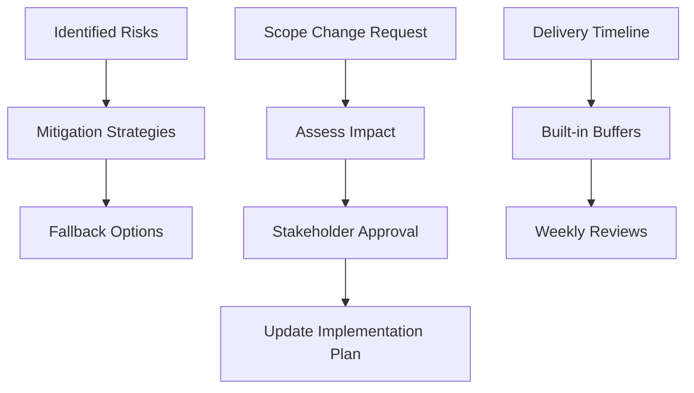

**Diagram sources**
- [EXECUTIVE_SUMMARY.md](file://EXECUTIVE_SUMMARY.md#L214-L244)
- [EXECUTIVE_SUMMARY.md](file://EXECUTIVE_SUMMARY.md#L407-L418)
- [QUICK_START_CHECKLIST.md](file://QUICK_START_CHECKLIST.md#L354-L374)

**Section sources**
- [EXECUTIVE_SUMMARY.md](file://EXECUTIVE_SUMMARY.md#L214-L244)
- [EXECUTIVE_SUMMARY.md](file://EXECUTIVE_SUMMARY.md#L407-L418)
- [QUICK_START_CHECKLIST.md](file://QUICK_START_CHECKLIST.md#L354-L374)

## Dependency Analysis
The project’s dependencies and configuration influence project management practices, particularly around build, linting, and runtime behavior.

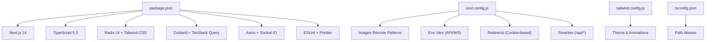

**Diagram sources**
- [package.json](file://package.json#L1-L80)
- [next.config.js](file://next.config.js#L1-L56)
- [tailwind.config.js](file://tailwind.config.js#L1-L108)
- [tsconfig.json](file://tsconfig.json#L1-L38)

**Section sources**
- [package.json](file://package.json#L1-L80)
- [next.config.js](file://next.config.js#L1-L56)
- [tailwind.config.js](file://tailwind.config.js#L1-L108)
- [tsconfig.json](file://tsconfig.json#L1-L38)

## Performance Considerations
Performance targets are defined in the Executive Summary and Implementation Plan. The Quick Start Checklist outlines milestones for optimization and monitoring.

- Performance Targets
  - Lighthouse Performance >90
  - Time to Interactive <3s
  - First Contentful Paint <1.5s
  - Bundle Size <300KB (gzipped)

- Optimization Activities
  - Code splitting and lazy loading
  - Bundle size optimization
  - Image optimization
  - Performance monitoring (Web Vitals)
  - Database query optimization and caching

**Section sources**
- [EXECUTIVE_SUMMARY.md](file://EXECUTIVE_SUMMARY.md#L184-L211)
- [IMPLEMENTATION_PLAN.md](file://IMPLEMENTATION_PLAN.md#L492-L533)
- [QUICK_START_CHECKLIST.md](file://QUICK_START_CHECKLIST.md#L132-L151)

## Troubleshooting Guide
Common troubleshooting areas include authentication, WebSocket connectivity, database configuration, and build issues. The Deployment Guide and Quick Start Checklist provide targeted guidance.

- Authentication Troubleshooting
  - Token storage consolidation and refresh logic
  - Auth context and API client integration

- WebSocket Troubleshooting
  - Cookie-based authentication parsing
  - Reconnection logic and error handling

- Database Troubleshooting
  - Environment variables configuration
  - Connection pooling and SSL modes

- Build Troubleshooting
  - Dependency verification
  - TypeScript and ESLint checks

**Section sources**
- [src/contexts/auth-context.tsx](file://src/contexts/auth-context.tsx#L39-L125)
- [src/lib/api.ts](file://src/lib/api.ts#L10-L65)
- [src/components/websocket/websocket-provider.tsx](file://src/components/websocket/websocket-provider.tsx#L24-L93)
- [DEPLOYMENT.md](file://DEPLOYMENT.md#L116-L134)
- [README.md](file://README.md#L344-L377)

## Conclusion
The WorldBest project management framework combines a comprehensive implementation plan, role-based documentation, and practical execution tools. By leveraging the seven-phase roadmap, weekly checklists, and go/no-go criteria, teams can systematically deliver a production-ready platform. The documented workflows for planning, tracking, collaboration, and release enable predictable outcomes while maintaining flexibility for scope changes and risk mitigation.

## Appendices

### Practical Examples and Templates
- Daily Standup Template
  - What was completed yesterday
  - What will be worked on today
  - Any blockers

- Weekly Review Template
  - Week number
  - Completed tasks
  - Accomplishments, challenges, priorities, risks

- Pre-Launch Checklist
  - Technical, infrastructure, and business readiness
  - Go/No-Go criteria and rollback planning

**Section sources**
- [QUICK_START_CHECKLIST.md](file://QUICK_START_CHECKLIST.md#L240-L280)
- [QUICK_START_CHECKLIST.md](file://QUICK_START_CHECKLIST.md#L203-L237)

### Stakeholder Communication Strategies
- Executive Summary for high-level updates
- Quick Start Checklist for progress tracking
- Documentation Index for navigable resources
- Known Issues and Resolution Steps for transparency

**Section sources**
- [EXECUTIVE_SUMMARY.md](file://EXECUTIVE_SUMMARY.md#L346-L371)
- [DOCS_INDEX.md](file://DOCS_INDEX.md#L360-L378)
- [README.md](file://README.md#L344-L377)