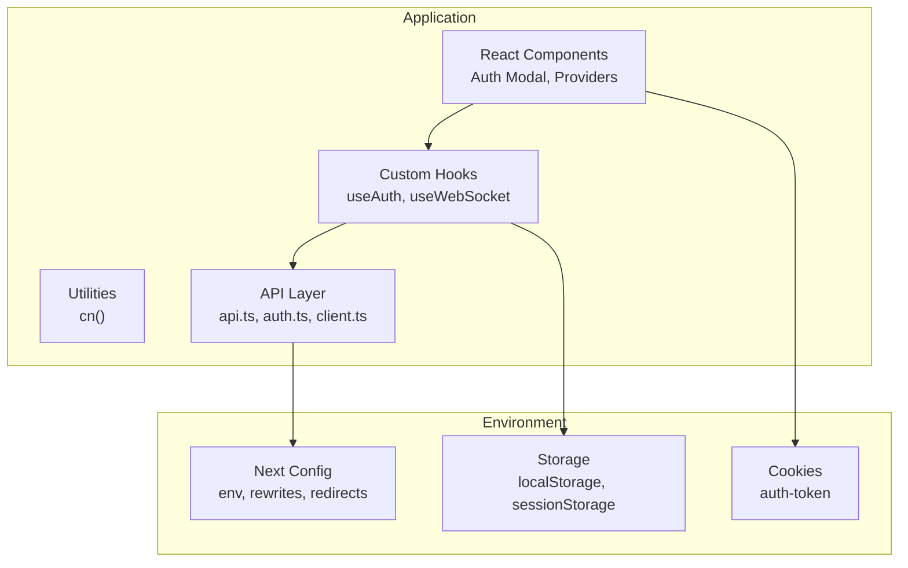
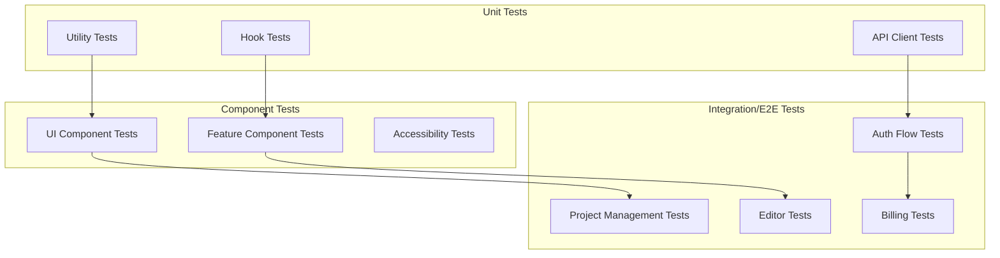
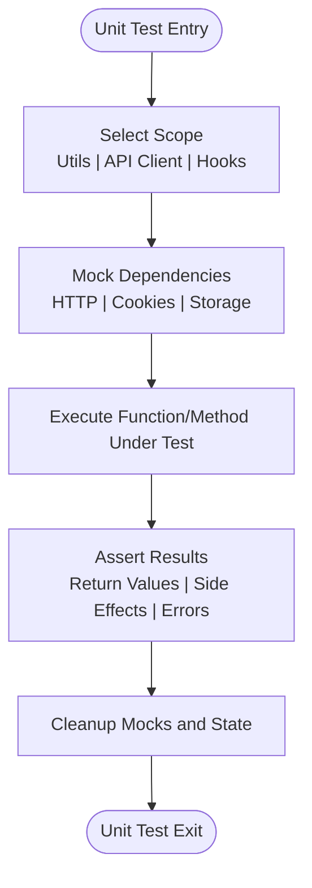
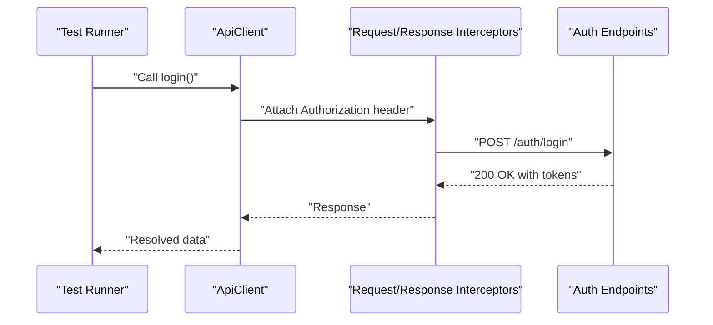
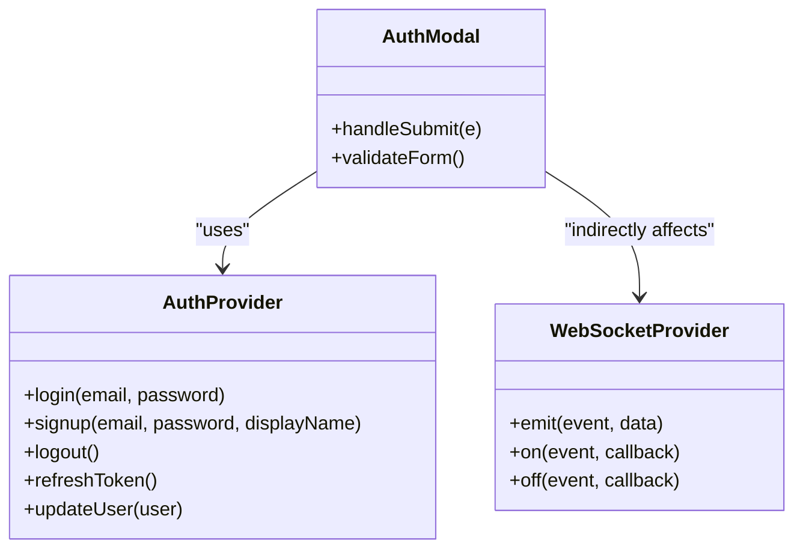
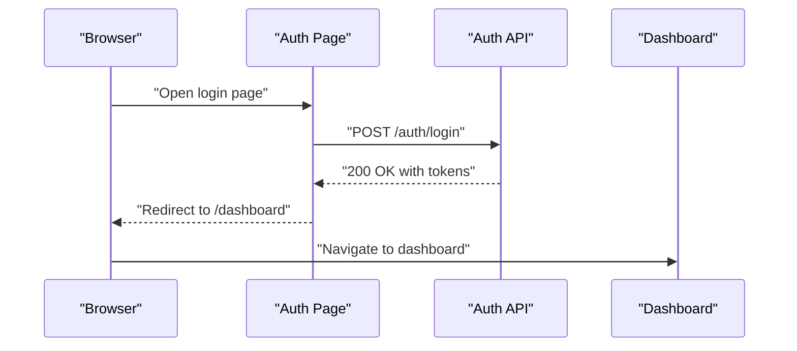
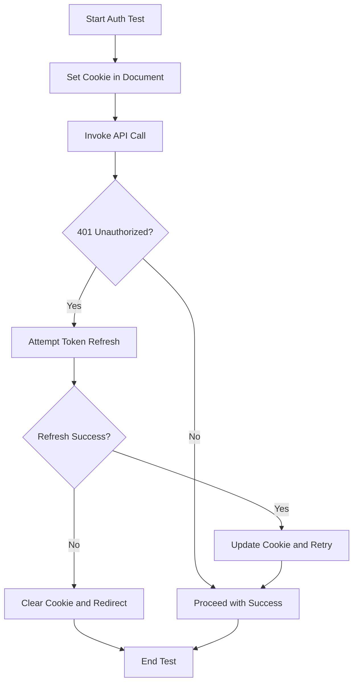
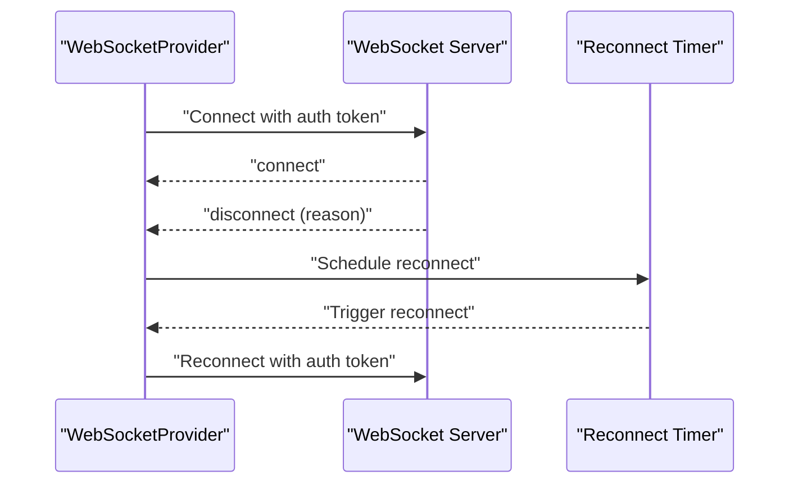
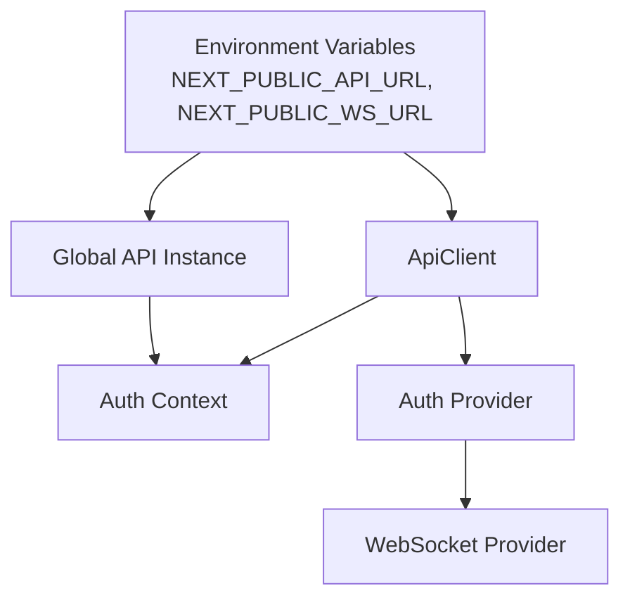

# Testing Strategies

<cite>
**Referenced Files in This Document**
- [package.json](file://package.json)
- [next.config.js](file://next.config.js)
- [IMPLEMENTATION_PLAN.md](file://IMPLEMENTATION_PLAN.md)
- [QUICK_START_CHECKLIST.md](file://QUICK_START_CHECKLIST.md)
- [src/lib/api/client.ts](file://src/lib/api/client.ts)
- [src/lib/api/auth.ts](file://src/lib/api/auth.ts)
- [src/lib/api.ts](file://src/lib/api.ts)
- [src/lib/utils.ts](file://src/lib/utils.ts)
- [src/contexts/auth-context.tsx](file://src/contexts/auth-context.tsx)
- [src/components/auth/auth-provider.tsx](file://src/components/auth/auth-provider.tsx)
- [src/components/auth/auth-modal.tsx](file://src/components/auth/auth-modal.tsx)
- [src/components/websocket/websocket-provider.tsx](file://src/components/websocket/websocket-provider.tsx)
</cite>

## Table of Contents
1. [Introduction](#introduction)
2. [Project Structure](#project-structure)
3. [Core Components](#core-components)
4. [Architecture Overview](#architecture-overview)
5. [Detailed Component Analysis](#detailed-component-analysis)
6. [Dependency Analysis](#dependency-analysis)
7. [Performance Considerations](#performance-considerations)
8. [Troubleshooting Guide](#troubleshooting-guide)
9. [Conclusion](#conclusion)
10. [Appendices](#appendices)

## Introduction
This document defines a comprehensive testing strategy for the project, covering unit testing, integration testing, and end-to-end (E2E) testing. It explains the testing framework setup, test runner configuration, coverage reporting, and continuous integration. It also documents component testing strategies for React components, API testing for backend services, and integration testing for full application workflows. Special attention is given to mocking strategies for external dependencies, authentication testing, and WebSocket connection testing. Practical examples of test implementation, test data management, and CI pipelines are included, along with best practices, performance testing approaches, accessibility testing methodologies, and maintenance/debugging guidance.

## Project Structure
The project is a Next.js application with a monorepo-like structure for shared packages. Testing is planned to be introduced in three layers:
- Unit tests for utilities, API clients, and custom hooks
- Component tests for React UI and feature components
- Integration/E2E tests for critical user flows and full-stack workflows

Key configuration and environment variables relevant to testing:
- Next.js configuration exposes environment variables for API and WebSocket URLs
- Multiple API clients exist in the codebase, which impacts test isolation and mocking strategies
- Authentication and WebSocket components rely on cookies and local storage, requiring careful mocking

**Diagram sources**
- [next.config.js](file://next.config.js#L24-L27)
- [src/lib/api.ts](file://src/lib/api.ts#L3-L8)
- [src/lib/api/client.ts](file://src/lib/api/client.ts#L6-L13)
- [src/contexts/auth-context.tsx](file://src/contexts/auth-context.tsx#L41-L54)
- [src/components/websocket/websocket-provider.tsx](file://src/components/websocket/websocket-provider.tsx#L36-L47)

**Section sources**
- [package.json](file://package.json#L1-L80)
- [next.config.js](file://next.config.js#L1-L56)
- [IMPLEMENTATION_PLAN.md](file://IMPLEMENTATION_PLAN.md#L361-L495)

## Core Components
This section outlines the core testing components and their responsibilities:
- API client and interceptors: Centralized HTTP client with authentication and token refresh logic
- Authentication context and provider: Manage user state, login/signup/logout, and token refresh
- WebSocket provider: Manage real-time connections with authentication and auto-reconnect
- Utilities: Lightweight helpers like class merging

Key implementation patterns:
- Dual API clients: A dedicated ApiClient class and a global axios instance with interceptors
- Authentication via cookies and localStorage: Used in both API client and providers
- WebSocket authentication via cookie header

**Section sources**
- [src/lib/api/client.ts](file://src/lib/api/client.ts#L1-L138)
- [src/lib/api/auth.ts](file://src/lib/api/auth.ts#L1-L101)
- [src/lib/api.ts](file://src/lib/api.ts#L1-L67)
- [src/lib/utils.ts](file://src/lib/utils.ts#L1-L6)
- [src/contexts/auth-context.tsx](file://src/contexts/auth-context.tsx#L1-L154)
- [src/components/auth/auth-provider.tsx](file://src/components/auth/auth-provider.tsx#L37-L165)
- [src/components/websocket/websocket-provider.tsx](file://src/components/websocket/websocket-provider.tsx#L1-L138)

## Architecture Overview
The testing architecture aligns with the existing application architecture:
- Unit tests focus on pure functions, API client logic, and custom hooks
- Component tests validate UI behavior and accessibility using React Testing Library
- Integration/E2E tests validate end-to-end flows using Playwright against a controlled backend

[No sources needed since this diagram shows conceptual workflow, not actual code structure]

## Detailed Component Analysis

### Unit Testing Strategy
Unit tests should target:
- Utility functions: Pure functions like class merging
- API client: HTTP methods, interceptors, error handling, and retry logic
- Custom hooks: State updates, cleanup, and side effects

Recommended setup:
- Test runner: Vitest
- Coverage: Istanbul or similar for coverage reporting
- Mocking: Jest-style mocks for HTTP and browser APIs
- Scripts: Add test scripts to package.json

Mocking strategies:
- HTTP mocking: Use a library compatible with Axios interceptors
- Browser APIs: Mock cookies and localStorage via jsdom or explicit overrides
- Interceptors: Isolate interceptors by creating a fresh client instance per test

Coverage targets:
- Utilities: 100%
- Hooks: >80%
- API client: >90%

**Diagram sources**
- [src/lib/utils.ts](file://src/lib/utils.ts#L1-L6)
- [src/lib/api/client.ts](file://src/lib/api/client.ts#L18-L81)
- [src/lib/api.ts](file://src/lib/api.ts#L10-L65)

**Section sources**
- [IMPLEMENTATION_PLAN.md](file://IMPLEMENTATION_PLAN.md#L364-L401)
- [QUICK_START_CHECKLIST.md](file://QUICK_START_CHECKLIST.md#L111-L119)
- [package.json](file://package.json#L64-L79)

### API Testing Strategy
API testing focuses on:
- Authentication endpoints: login, signup, logout, refresh, profile, 2FA
- Error handling: 401 unauthorized, token refresh failures, transformed errors
- Uploads: Progress tracking and multipart form data
- Interceptor behavior: Authorization header injection and retry logic

Mocking strategies:
- Use a test-friendly HTTP client instance per test
- Mock axios interceptors to avoid network calls
- Simulate token refresh responses and failures
- Verify Authorization header propagation

**Diagram sources**
- [src/lib/api/client.ts](file://src/lib/api/client.ts#L18-L81)
- [src/lib/api/auth.ts](file://src/lib/api/auth.ts#L25-L56)

**Section sources**
- [src/lib/api/client.ts](file://src/lib/api/client.ts#L1-L138)
- [src/lib/api/auth.ts](file://src/lib/api/auth.ts#L1-L101)
- [src/lib/api.ts](file://src/lib/api.ts#L1-L67)

### Component Testing Strategy (React)
Component tests should validate:
- UI components: Variants, states, and rendering correctness
- Feature components: Editor, forms, and collaboration features
- Forms: Validation, submission, and error states
- Accessibility: Keyboard navigation, screen reader support, WCAG compliance

Recommended setup:
- React Testing Library for DOM testing
- MSW for API mocking in component tests
- Custom render wrapper for providers (Auth, WebSocket)
- Snapshot tests for critical UI components

**Diagram sources**
- [src/components/auth/auth-provider.tsx](file://src/components/auth/auth-provider.tsx#L67-L141)
- [src/components/auth/auth-modal.tsx](file://src/components/auth/auth-modal.tsx#L54-L72)
- [src/components/websocket/websocket-provider.tsx](file://src/components/websocket/websocket-provider.tsx#L95-L123)

**Section sources**
- [IMPLEMENTATION_PLAN.md](file://IMPLEMENTATION_PLAN.md#L450-L495)
- [src/components/auth/auth-modal.tsx](file://src/components/auth/auth-modal.tsx#L34-L83)
- [src/components/auth/auth-provider.tsx](file://src/components/auth/auth-provider.tsx#L37-L165)
- [src/components/websocket/websocket-provider.tsx](file://src/components/websocket/websocket-provider.tsx#L1-L138)

### Integration Testing Strategy (Playwright)
Integration tests validate end-to-end flows:
- Authentication: Login, signup, password reset, token refresh
- Project management: Create, edit, delete, collaborate
- Editor: Content editing, auto-save, version history, AI generation
- Billing: Subscription purchase, plan changes, payment methods, invoice viewing

Setup:
- Playwright configuration with multiple browsers
- Test fixtures for authenticated sessions
- Screenshots on failure and video recording
- CI scripts to run tests in parallel

**Diagram sources**
- [src/components/auth/auth-modal.tsx](file://src/components/auth/auth-modal.tsx#L54-L72)
- [src/lib/api/auth.ts](file://src/lib/api/auth.ts#L25-L56)
- [next.config.js](file://next.config.js#L28-L42)

**Section sources**
- [IMPLEMENTATION_PLAN.md](file://IMPLEMENTATION_PLAN.md#L404-L447)
- [next.config.js](file://next.config.js#L28-L51)

### Authentication Testing
Authentication spans multiple layers:
- Cookie-based auth in API client and WebSocket provider
- localStorage-based tokens in higher-level providers
- Token refresh logic and error handling
- Redirects based on cookie presence

Testing approaches:
- Mock cookie parsing and Authorization header injection
- Simulate token refresh success and failure scenarios
- Validate redirects and navigation behavior
- Test logout and cleanup of tokens and headers

**Diagram sources**
- [src/lib/api/client.ts](file://src/lib/api/client.ts#L44-L77)
- [src/lib/api.ts](file://src/lib/api.ts#L30-L61)
- [next.config.js](file://next.config.js#L28-L42)

**Section sources**
- [src/lib/api/client.ts](file://src/lib/api/client.ts#L18-L81)
- [src/lib/api.ts](file://src/lib/api.ts#L24-L65)
- [src/contexts/auth-context.tsx](file://src/contexts/auth-context.tsx#L39-L125)
- [src/components/auth/auth-provider.tsx](file://src/components/auth/auth-provider.tsx#L51-L141)
- [next.config.js](file://next.config.js#L24-L42)

### WebSocket Connection Testing
WebSocket testing should validate:
- Connection establishment with cookie-based auth
- Auto-reconnect logic and exponential backoff
- Event emission and listening
- Authentication error handling and disconnection

Mocking strategies:
- Use a WebSocket mock library to simulate server events
- Test reconnection attempts and thresholds
- Validate that unauthenticated users trigger disconnect

**Diagram sources**
- [src/components/websocket/websocket-provider.tsx](file://src/components/websocket/websocket-provider.tsx#L24-L93)

**Section sources**
- [src/components/websocket/websocket-provider.tsx](file://src/components/websocket/websocket-provider.tsx#L1-L138)

### Test Data Management
Best practices:
- Use deterministic fixtures for predictable tests
- Separate test data per test suite to avoid cross-contamination
- Leverage environment variables for test-specific endpoints
- Clean up cookies, localStorage, and global headers after each test

**Section sources**
- [next.config.js](file://next.config.js#L24-L27)

### Continuous Integration Testing Pipelines
Recommended CI configuration:
- Run unit tests on pull requests with coverage thresholds
- Execute component tests in a headless browser environment
- Run Playwright E2E tests in parallel with screenshots on failure
- Gate deployments on passing tests and coverage checks

**Section sources**
- [IMPLEMENTATION_PLAN.md](file://IMPLEMENTATION_PLAN.md#L364-L401)
- [IMPLEMENTATION_PLAN.md](file://IMPLEMENTATION_PLAN.md#L404-L447)
- [package.json](file://package.json#L6-L11)

## Dependency Analysis
Testing dependencies and relationships:
- API client depends on environment variables for base URL
- Providers depend on API client and browser APIs (cookies, localStorage)
- WebSocket provider depends on auth provider and environment variables
- Next.js configuration influences environment variable availability and routing

**Diagram sources**
- [next.config.js](file://next.config.js#L24-L27)
- [src/lib/api/client.ts](file://src/lib/api/client.ts#L6-L13)
- [src/lib/api.ts](file://src/lib/api.ts#L3-L8)
- [src/contexts/auth-context.tsx](file://src/contexts/auth-context.tsx#L30-L145)
- [src/components/auth/auth-provider.tsx](file://src/components/auth/auth-provider.tsx#L133-L150)
- [src/components/websocket/websocket-provider.tsx](file://src/components/websocket/websocket-provider.tsx#L36-L47)

**Section sources**
- [next.config.js](file://next.config.js#L24-L27)
- [src/lib/api/client.ts](file://src/lib/api/client.ts#L1-L138)
- [src/lib/api.ts](file://src/lib/api.ts#L1-L67)
- [src/contexts/auth-context.tsx](file://src/contexts/auth-context.tsx#L1-L154)
- [src/components/auth/auth-provider.tsx](file://src/components/auth/auth-provider.tsx#L1-L165)
- [src/components/websocket/websocket-provider.tsx](file://src/components/websocket/websocket-provider.tsx#L1-L138)

## Performance Considerations
- Keep tests fast: Use lightweight mocks and avoid real network calls
- Parallelize tests: Run unit and component tests in parallel where safe
- Snapshot tests: Limit snapshot tests to critical UI to reduce maintenance overhead
- Coverage thresholds: Enforce minimum coverage to prevent regressions
- CI performance: Cache dependencies and reuse test environments

[No sources needed since this section provides general guidance]

## Troubleshooting Guide
Common issues and resolutions:
- Duplicate API clients: Prefer a single test-friendly client instance per test
- Cookie parsing failures: Normalize cookie parsing and inject test cookies explicitly
- Token refresh loops: Mock refresh endpoint to simulate failures and verify fallback behavior
- WebSocket flakiness: Use deterministic reconnection delays and mock server events
- Environment mismatches: Ensure NEXT_PUBLIC_API_URL and NEXT_PUBLIC_WS_URL are set consistently in CI

**Section sources**
- [src/lib/api/client.ts](file://src/lib/api/client.ts#L22-L31)
- [src/lib/api.ts](file://src/lib/api.ts#L12-L17)
- [src/components/websocket/websocket-provider.tsx](file://src/components/websocket/websocket-provider.tsx#L66-L74)
- [next.config.js](file://next.config.js#L24-L27)

## Conclusion
A robust testing strategy requires coordinated efforts across unit, component, and integration layers. By establishing clear frameworks, mocking strategies, and CI pipelines, the project can achieve reliable, maintainable, and fast tests. Prioritize critical user flows, enforce coverage thresholds, and continuously refine tests alongside feature development.

[No sources needed since this section summarizes without analyzing specific files]

## Appendices

### Appendix A: Testing Setup Checklist
- Configure Vitest and coverage reporting
- Create testing utilities and custom render wrappers
- Write tests for utility functions, API client, and custom hooks
- Set up React Testing Library and MSW for component tests
- Configure Playwright for E2E tests with multiple browsers
- Integrate tests into CI with coverage enforcement

**Section sources**
- [IMPLEMENTATION_PLAN.md](file://IMPLEMENTATION_PLAN.md#L364-L495)
- [QUICK_START_CHECKLIST.md](file://QUICK_START_CHECKLIST.md#L111-L127)