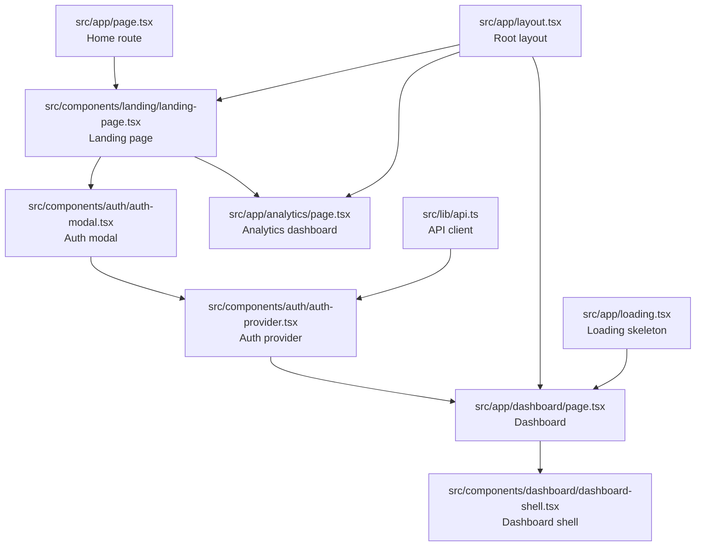
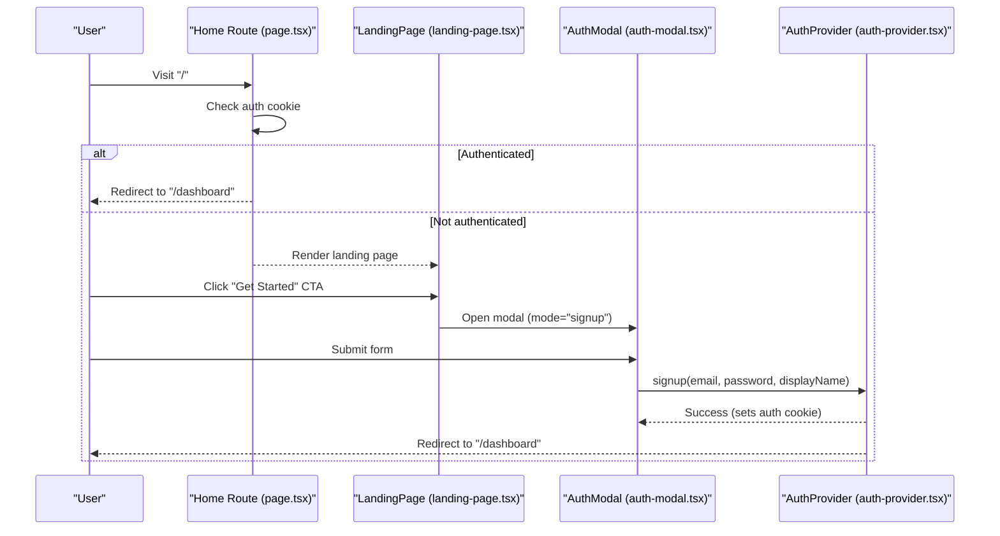
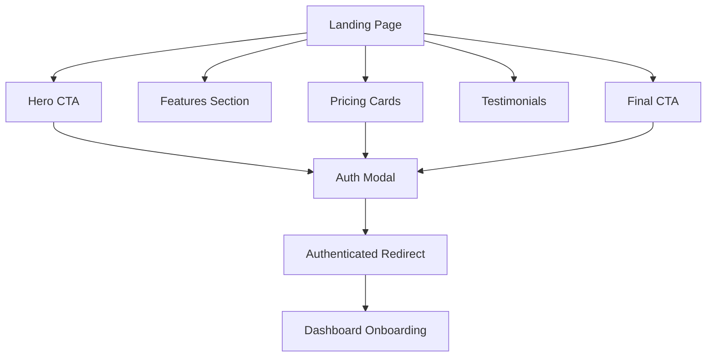
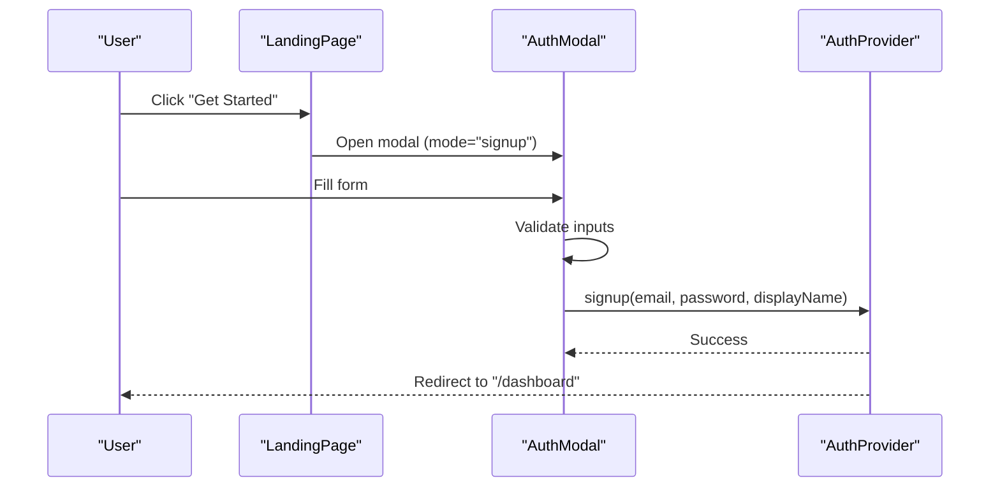
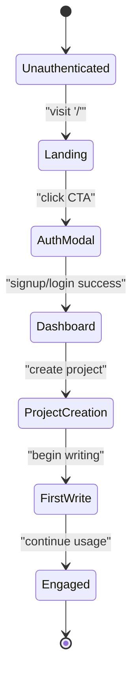
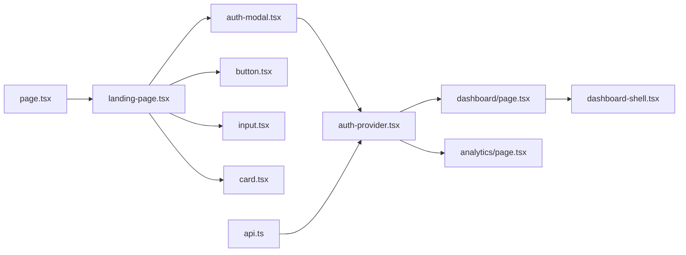

# Conversion Optimization

<cite>
**Referenced Files in This Document**
- [page.tsx](file://src/app/page.tsx)
- [landing-page.tsx](file://src/components/landing/landing-page.tsx)
- [auth-modal.tsx](file://src/components/auth/auth-modal.tsx)
- [auth-provider.tsx](file://src/components/auth/auth-provider.tsx)
- [button.tsx](file://src/components/ui/button.tsx)
- [input.tsx](file://src/components/ui/input.tsx)
- [card.tsx](file://src/components/ui/card.tsx)
- [analytics/page.tsx](file://src/app/analytics/page.tsx)
- [dashboard/page.tsx](file://src/app/dashboard/page.tsx)
- [dashboard-shell.tsx](file://src/components/dashboard/dashboard-shell.tsx)
- [layout.tsx](file://src/app/layout.tsx)
- [loading.tsx](file://src/app/loading.tsx)
- [api.ts](file://src/lib/api.ts)
</cite>

## Table of Contents
1. [Introduction](#introduction)
2. [Project Structure](#project-structure)
3. [Core Components](#core-components)
4. [Architecture Overview](#architecture-overview)
5. [Detailed Component Analysis](#detailed-component-analysis)
6. [Dependency Analysis](#dependency-analysis)
7. [Performance Considerations](#performance-considerations)
8. [Troubleshooting Guide](#troubleshooting-guide)
9. [Conclusion](#conclusion)
10. [Appendices](#appendices)

## Introduction
This document focuses on conversion optimization to maximize user sign-ups and reduce bounce rates. It explains strategic placement of call-to-action buttons, demo video integration, and value proposition messaging. It documents the conversion funnel optimization, A/B testing framework, and user journey mapping. It also details the authentication modal integration, form optimization, and user onboarding flow. Practical examples illustrate CTA button optimization, headline testing, and persuasive copywriting. Finally, it covers analytics integration for conversion tracking, heat mapping implementation, user behavior analysis, mobile optimization, loading speed optimization, and accessibility compliance.

## Project Structure
The conversion-focused surfaces live primarily in the landing page, authentication flow, and analytics dashboard. The Next.js app router routes unauthenticated users to the landing page and authenticated users to the dashboard. The landing page integrates CTAs, pricing cards, testimonials, and a demo callout. Authentication modals provide frictionless sign-up and login. Analytics pages visualize user behavior and productivity.

**Diagram sources**
- [page.tsx](file://src/app/page.tsx#L1-L17)
- [landing-page.tsx](file://src/components/landing/landing-page.tsx#L1-L434)
- [auth-modal.tsx](file://src/components/auth/auth-modal.tsx#L1-L212)
- [auth-provider.tsx](file://src/components/auth/auth-provider.tsx#L1-L165)
- [dashboard/page.tsx](file://src/app/dashboard/page.tsx#L1-L260)
- [dashboard-shell.tsx](file://src/components/dashboard/dashboard-shell.tsx#L1-L224)
- [analytics/page.tsx](file://src/app/analytics/page.tsx#L1-L470)
- [layout.tsx](file://src/app/layout.tsx#L1-L102)
- [loading.tsx](file://src/app/loading.tsx#L1-L39)
- [api.ts](file://src/lib/api.ts#L1-L67)

**Section sources**
- [page.tsx](file://src/app/page.tsx#L1-L17)
- [layout.tsx](file://src/app/layout.tsx#L1-L102)

## Core Components
- Landing page: Hero headline, value proposition, demo CTA, features, pricing cards, testimonials, and final CTA.
- Authentication modal: Login/signup forms with validation, password visibility toggle, and seamless redirection.
- Auth provider: Cookie-based auth, token refresh, and toast notifications.
- Dashboard: Onboarding continuation after sign-up, quick actions, and project progression.
- Analytics dashboard: Writing metrics, productivity charts, and behavioral insights.
- UI primitives: Button, Input, Card components used across conversion touchpoints.

Practical conversion levers:
- Prominent primary CTAs in hero and final CTA sections.
- Pricing cards with highlighted popular plan and clear CTA per card.
- Testimonials and social proof to reduce perceived risk.
- Minimal friction authentication via modal with inline validation.

**Section sources**
- [landing-page.tsx](file://src/components/landing/landing-page.tsx#L247-L406)
- [auth-modal.tsx](file://src/components/auth/auth-modal.tsx#L17-L212)
- [auth-provider.tsx](file://src/components/auth/auth-provider.tsx#L67-L113)
- [dashboard/page.tsx](file://src/app/dashboard/page.tsx#L53-L260)
- [analytics/page.tsx](file://src/app/analytics/page.tsx#L93-L470)
- [button.tsx](file://src/components/ui/button.tsx#L1-L55)
- [input.tsx](file://src/components/ui/input.tsx#L1-L24)
- [card.tsx](file://src/components/ui/card.tsx#L1-L78)

## Architecture Overview
The conversion pipeline begins at the home route, which detects authentication and serves either the landing page or redirects to the dashboard. The landing page triggers the authentication modal for sign-ups. Successful authentication updates cookies, navigates to the dashboard, and displays onboarding prompts.

**Diagram sources**
- [page.tsx](file://src/app/page.tsx#L5-L17)
- [landing-page.tsx](file://src/components/landing/landing-page.tsx#L127-L131)
- [auth-modal.tsx](file://src/components/auth/auth-modal.tsx#L54-L72)
- [auth-provider.tsx](file://src/components/auth/auth-provider.tsx#L91-L113)

## Detailed Component Analysis

### Conversion Funnel Optimization
- Awareness: Hero headline and value proposition immediately communicate benefit.
- Interest: Features and testimonials reinforce trust and product fit.
- Desire: Pricing cards with clear benefits and highlighted plan increase perceived value.
- Action: Multiple CTAs (hero, pricing cards, final CTA) reduce friction and increase conversion opportunities.
- Retention: Post-login dashboard provides immediate next steps and reduces drop-off.

**Diagram sources**
- [landing-page.tsx](file://src/components/landing/landing-page.tsx#L247-L406)
- [auth-modal.tsx](file://src/components/auth/auth-modal.tsx#L17-L72)
- [auth-provider.tsx](file://src/components/auth/auth-provider.tsx#L91-L113)
- [dashboard/page.tsx](file://src/app/dashboard/page.tsx#L53-L87)

**Section sources**
- [landing-page.tsx](file://src/components/landing/landing-page.tsx#L247-L406)
- [dashboard/page.tsx](file://src/app/dashboard/page.tsx#L53-L87)

### Strategic CTA Placement and Messaging
- Hero CTA: Prominent primary button with directional icon to encourage immediate action.
- Demo CTA: Secondary outline button paired with Play icon to lower commitment barrier.
- Pricing CTA: Per-plan buttons aligned with plan benefits; highlighted plan emphasizes urgency.
- Final CTA: Reinforces call-to-action after testimonials and features.
- Persuasive copywriting examples:
  - Headline: “The Only AI Writing Platform Built for Steamy Romantasy” positions the product uniquely.
  - Value proposition: Highlights genre-tuned drafting, steam calibration, voice fingerprinting, and KDP export.
  - Pricing CTA: “Start Free Trial” signals low-risk commitment.

Optimization ideas:
- A/B test primary vs. secondary CTA prominence.
- Test “Watch Demo” vs. “See How It Works.”
- Test “Start Free Trial” vs. “Join Free.”

**Section sources**
- [landing-page.tsx](file://src/components/landing/landing-page.tsx#L250-L270)
- [landing-page.tsx](file://src/components/landing/landing-page.tsx#L313-L351)
- [landing-page.tsx](file://src/components/landing/landing-page.tsx#L396-L405)

### Demo Video Integration
- Place a prominent “Watch Demo” CTA alongside the primary CTA in the hero section.
- On click, open a modal or lightbox player to showcase key features.
- Use short-form, benefit-driven clips (e.g., steam calibration, voice fingerprinting).
- Add optional “No credit card required” messaging to reduce friction.

[No sources needed since this section provides general guidance]

### Value Proposition Messaging
- Focus on pain points and outcomes: “Stop fighting with generic AI,” “Understands trope beats,” “Exports KDP-ready files.”
- Use authoritative, genre-specific language: “Romantasy,” “Dark Romance,” “Paranormal Romance.”
- Emphasize uniqueness: “Only AI writing platform built for steamy romantasy.”

**Section sources**
- [landing-page.tsx](file://src/components/landing/landing-page.tsx#L256-L259)

### Authentication Modal Integration and Form Optimization
- Inline validation: Real-time feedback for email, password, and display name.
- Password visibility toggle improves completion by reducing friction.
- Toast notifications confirm success/failure and guide next steps.
- Seamless redirect to dashboard after successful auth.

**Diagram sources**
- [landing-page.tsx](file://src/components/landing/landing-page.tsx#L127-L131)
- [auth-modal.tsx](file://src/components/auth/auth-modal.tsx#L54-L72)
- [auth-provider.tsx](file://src/components/auth/auth-provider.tsx#L91-L113)

**Section sources**
- [auth-modal.tsx](file://src/components/auth/auth-modal.tsx#L27-L72)
- [auth-provider.tsx](file://src/components/auth/auth-provider.tsx#L91-L113)

### User Onboarding Flow
- Post-authentication dashboard greets the user by name and presents quick actions.
- Suggest next steps: “New Project,” “Manage Characters,” “AI Assistant,” “View Analytics.”
- Provide progress indicators for recent projects to maintain momentum.

**Section sources**
- [dashboard/page.tsx](file://src/app/dashboard/page.tsx#L53-L87)
- [dashboard/page.tsx](file://src/app/dashboard/page.tsx#L225-L257)

### Analytics Integration for Conversion Tracking
- Current analytics dashboard visualizes writing metrics, productivity, and AI usage.
- Implement event tracking for:
  - CTA clicks (primary, secondary, pricing, demo)
  - Modal opens (login vs. signup)
  - Form submissions (success/failure)
  - Time to first write session
  - Conversion funnels (landing → modal → dashboard)
- Use heatmaps to identify engagement hotspots and drop-off points.

**Section sources**
- [analytics/page.tsx](file://src/app/analytics/page.tsx#L93-L470)

### Heat Mapping Implementation and User Behavior Analysis
- Integrate a lightweight heatmap library to record click density and scroll depth.
- Segment by conversion funnel stage to compare drop-off rates.
- Combine with analytics to correlate engagement with conversion.

[No sources needed since this section provides general guidance]

### A/B Testing Framework
- Hypotheses: CTA text, button size/shape, placement, demo CTA wording.
- Metrics: Conversion rate, time to first write, bounce rate.
- Tools: LaunchDarkly, Optimizely, or Vercel A/B testing.
- Sample size: Ensure statistical significance for small user base.

[No sources needed since this section provides general guidance]

### User Journey Mapping
- Unauthenticated: Landing → CTA → Auth Modal → Dashboard.
- Authenticated: Dashboard → Project Creation → First Write → Engagement.

**Diagram sources**
- [page.tsx](file://src/app/page.tsx#L5-L17)
- [landing-page.tsx](file://src/components/landing/landing-page.tsx#L127-L131)
- [auth-modal.tsx](file://src/components/auth/auth-modal.tsx#L54-L72)
- [auth-provider.tsx](file://src/components/auth/auth-provider.tsx#L91-L113)
- [dashboard/page.tsx](file://src/app/dashboard/page.tsx#L53-L87)

## Dependency Analysis
- Home route depends on cookie detection to decide landing vs. dashboard.
- Landing page composes UI primitives and the auth modal.
- Auth modal delegates to the auth provider for network requests.
- Dashboard shell provides navigation and user menu.
- API client handles token injection and refresh logic.

**Diagram sources**
- [page.tsx](file://src/app/page.tsx#L1-L17)
- [landing-page.tsx](file://src/components/landing/landing-page.tsx#L1-L434)
- [auth-modal.tsx](file://src/components/auth/auth-modal.tsx#L1-L212)
- [auth-provider.tsx](file://src/components/auth/auth-provider.tsx#L1-L165)
- [dashboard/page.tsx](file://src/app/dashboard/page.tsx#L1-L260)
- [dashboard-shell.tsx](file://src/components/dashboard/dashboard-shell.tsx#L1-L224)
- [analytics/page.tsx](file://src/app/analytics/page.tsx#L1-L470)
- [button.tsx](file://src/components/ui/button.tsx#L1-L55)
- [input.tsx](file://src/components/ui/input.tsx#L1-L24)
- [card.tsx](file://src/components/ui/card.tsx#L1-L78)
- [api.ts](file://src/lib/api.ts#L1-L67)

**Section sources**
- [api.ts](file://src/lib/api.ts#L1-L67)
- [auth-provider.tsx](file://src/components/auth/auth-provider.tsx#L1-L165)

## Performance Considerations
- Minimize Largest Contentful Paint (LCP) by deferring non-critical assets and optimizing hero imagery.
- Improve Time to Interactive (TTI) by code-splitting and lazy-loading non-essential components.
- Reduce bundle size to meet targets and improve conversion on slower connections.
- Use skeleton loaders for dashboard to signal progress and reduce perceived latency.

**Section sources**
- [loading.tsx](file://src/app/loading.tsx#L1-L39)
- [layout.tsx](file://src/app/layout.tsx#L1-L102)

## Troubleshooting Guide
- Authentication failures: Toast messages surface errors; ensure cookies are set and refreshed.
- Token refresh: API client interceptors handle 401 and refresh token flow.
- Redirect loops: Verify cookie parsing and auth state initialization.
- Form validation: Inline errors help users fix mistakes quickly.

**Section sources**
- [auth-provider.tsx](file://src/components/auth/auth-provider.tsx#L67-L113)
- [auth-modal.tsx](file://src/components/auth/auth-modal.tsx#L27-L72)
- [api.ts](file://src/lib/api.ts#L24-L65)

## Conclusion
By strategically placing CTAs, integrating a frictionless authentication flow, and reinforcing value propositions, the landing page drives sign-ups. The dashboard continues the conversion journey with clear next steps. Analytics enable continuous optimization, while performance and accessibility improvements reduce bounce and increase conversions across devices.

## Appendices

### Practical Examples Index
- CTA button optimization: Primary vs. secondary prominence, directional icons, and concise copy.
- Headline testing: “Only AI for Steamy Romantasy” vs. “AI Writing for Romance Authors.”
- Persuasive copywriting: Benefit-first messaging (“Exports KDP-ready”) and genre-specific positioning.

[No sources needed since this section provides general guidance]