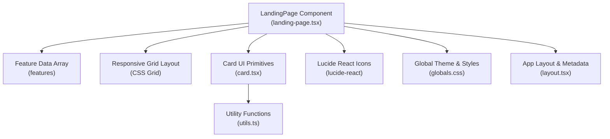
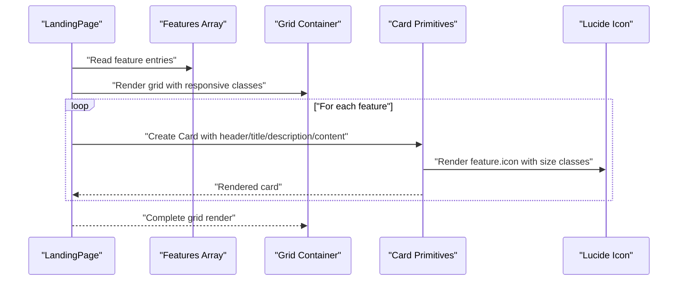
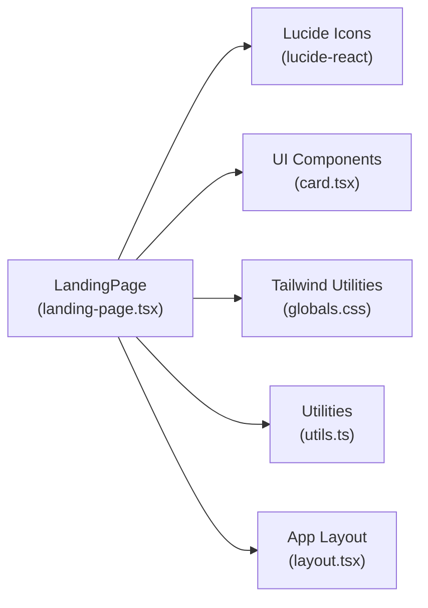

# Feature Showcase System

<cite>
**Referenced Files in This Document**
- [landing-page.tsx](file://src/components/landing/landing-page.tsx)
- [card.tsx](file://src/components/ui/card.tsx)
- [globals.css](file://src/styles/globals.css)
- [utils.ts](file://src/lib/utils.ts)
- [package.json](file://package.json)
- [layout.tsx](file://src/app/layout.tsx)
</cite>

## Table of Contents
1. [Introduction](#introduction)
2. [Project Structure](#project-structure)
3. [Core Components](#core-components)
4. [Architecture Overview](#architecture-overview)
5. [Detailed Component Analysis](#detailed-component-analysis)
6. [Dependency Analysis](#dependency-analysis)
7. [Performance Considerations](#performance-considerations)
8. [Troubleshooting Guide](#troubleshooting-guide)
9. [Conclusion](#conclusion)

## Introduction
This document explains the Feature Showcase System used to highlight WorldBest's core capabilities. It focuses on the feature cards implementation, Lucide React icon integration, responsive grid layout, feature data structure, dynamic rendering approach, and visual design patterns. It also covers practical examples for adding/modifying features, customization strategies, accessibility features, localization considerations, and performance optimizations.

## Project Structure
The feature showcase is implemented in the landing page component and leverages shared UI primitives and global styling.

**Diagram sources**
- [landing-page.tsx](file://src/components/landing/landing-page.tsx#L25-L56)
- [card.tsx](file://src/components/ui/card.tsx#L1-L78)
- [globals.css](file://src/styles/globals.css#L1-L288)
- [utils.ts](file://src/lib/utils.ts#L1-L6)
- [layout.tsx](file://src/app/layout.tsx#L1-L102)

**Section sources**
- [landing-page.tsx](file://src/components/landing/landing-page.tsx#L1-L434)
- [card.tsx](file://src/components/ui/card.tsx#L1-L78)
- [globals.css](file://src/styles/globals.css#L1-L288)
- [utils.ts](file://src/lib/utils.ts#L1-L6)
- [layout.tsx](file://src/app/layout.tsx#L1-L102)

## Core Components
- Feature data array: Defines feature entries with icon, title, and description.
- Card UI primitives: Reusable card parts (header, title, description, content).
- Responsive grid: CSS Grid layout that adapts to screen sizes.
- Icon integration: Lucide React icons imported and rendered inside feature cards.
- Utility functions: Tailwind class merging utility for flexible styling.

Key implementation references:
- Feature data array definition and usage: [landing-page.tsx](file://src/components/landing/landing-page.tsx#L25-L56)
- Dynamic rendering loop: [landing-page.tsx](file://src/components/landing/landing-page.tsx#L284-L299)
- Card primitives: [card.tsx](file://src/components/ui/card.tsx#L1-L78)
- Responsive grid class: [landing-page.tsx](file://src/components/landing/landing-page.tsx#L284)
- Icon imports and usage: [landing-page.tsx](file://src/components/landing/landing-page.tsx#L7-L22)
- Utility class merging: [utils.ts](file://src/lib/utils.ts#L1-L6)

**Section sources**
- [landing-page.tsx](file://src/components/landing/landing-page.tsx#L25-L56)
- [landing-page.tsx](file://src/components/landing/landing-page.tsx#L284-L299)
- [card.tsx](file://src/components/ui/card.tsx#L1-L78)
- [utils.ts](file://src/lib/utils.ts#L1-L6)

## Architecture Overview
The feature showcase follows a straightforward composition pattern:
- Data-driven features define the content.
- A responsive grid renders cards.
- Each card composes UI primitives for header/title/description/content.
- Icons are dynamically selected per feature entry.

**Diagram sources**
- [landing-page.tsx](file://src/components/landing/landing-page.tsx#L25-L56)
- [landing-page.tsx](file://src/components/landing/landing-page.tsx#L284-L299)
- [card.tsx](file://src/components/ui/card.tsx#L1-L78)

## Detailed Component Analysis

### Feature Data Structure
The feature data is an array of objects, each containing:
- icon: A Lucide React component reference.
- title: Feature headline text.
- description: Feature explanation text.

Implementation references:
- Feature entries: [landing-page.tsx](file://src/components/landing/landing-page.tsx#L25-L56)

Extending the data structure:
- Add a new feature by appending an object with icon, title, and description.
- Example path for adding a new feature: [landing-page.tsx](file://src/components/landing/landing-page.tsx#L56-L56)

Modifying existing features:
- Change icon reference to another Lucide component.
- Update title and description strings.
- Example path for editing a feature: [landing-page.tsx](file://src/components/landing/landing-page.tsx#L25-L56)

Localization considerations:
- Replace hardcoded strings with localized keys.
- Use a translation library and pass translated values into the feature array.
- Keep icon and component references unchanged.

**Section sources**
- [landing-page.tsx](file://src/components/landing/landing-page.tsx#L25-L56)

### Dynamic Rendering Approach
The feature list is rendered using a mapping loop over the features array. Each iteration creates a card with a dynamically selected icon.

Implementation references:
- Grid container and responsive classes: [landing-page.tsx](file://src/components/landing/landing-page.tsx#L284)
- Mapping loop and card composition: [landing-page.tsx](file://src/components/landing/landing-page.tsx#L285-L299)
- Card primitives usage: [card.tsx](file://src/components/ui/card.tsx#L1-L78)

Practical examples:
- Adding a new feature: Append a new object to the features array. Reference: [landing-page.tsx](file://src/components/landing/landing-page.tsx#L25-L56)
- Removing a feature: Delete an entry from the features array. Reference: [landing-page.tsx](file://src/components/landing/landing-page.tsx#L25-L56)
- Reordering features: Adjust array order. Reference: [landing-page.tsx](file://src/components/landing/landing-page.tsx#L25-L56)

**Section sources**
- [landing-page.tsx](file://src/components/landing/landing-page.tsx#L284-L299)
- [card.tsx](file://src/components/ui/card.tsx#L1-L78)

### Visual Design Patterns
- Card layout: Uses CardHeader, CardTitle, and CardDescription for consistent spacing and typography.
- Icon styling: Icons are wrapped in a circular background with primary color and size classes.
- Responsive grid: Grid columns adapt via utility classes for small, medium, and large screens.
- Theme integration: Uses Tailwind CSS variables and dark mode support.

Implementation references:
- Card composition: [landing-page.tsx](file://src/components/landing/landing-page.tsx#L286-L298)
- Icon wrapper and sizing: [landing-page.tsx](file://src/components/landing/landing-page.tsx#L288-L289)
- Grid responsiveness: [landing-page.tsx](file://src/components/landing/landing-page.tsx#L284)
- Theme variables and dark mode: [globals.css](file://src/styles/globals.css#L5-L58)

Customization examples:
- Changing icon background color: Modify the CardHeader wrapper classes. Reference: [landing-page.tsx](file://src/components/landing/landing-page.tsx#L288-L290)
- Adjusting card padding/margins: Update CardContent/CardHeader classes. Reference: [card.tsx](file://src/components/ui/card.tsx#L19-L64)
- Modifying grid columns: Change grid utility classes on the container. Reference: [landing-page.tsx](file://src/components/landing/landing-page.tsx#L284)

**Section sources**
- [landing-page.tsx](file://src/components/landing/landing-page.tsx#L286-L298)
- [card.tsx](file://src/components/ui/card.tsx#L19-L64)
- [globals.css](file://src/styles/globals.css#L5-L58)

### Accessibility Features
- Semantic structure: Cards use semantic heading and paragraph elements.
- Focus management: Cards rely on default focus behavior; consider adding explicit focus styles if needed.
- Color contrast: Theme variables ensure readable text across light/dark modes.
- Reduced motion: Global reduced-motion support is defined in the theme. Reference: [globals.css](file://src/styles/globals.css#L273-L288)

Enhancement suggestions:
- Add keyboard navigation support for interactive cards.
- Include ARIA attributes for screen readers if cards become interactive.

**Section sources**
- [card.tsx](file://src/components/ui/card.tsx#L31-L43)
- [globals.css](file://src/styles/globals.css#L273-L288)

### Icon Integration with Lucide React
Icons are imported from lucide-react and passed as components into the feature cards.

Implementation references:
- Icon imports: [landing-page.tsx](file://src/components/landing/landing-page.tsx#L7-L22)
- Icon usage inside cards: [landing-page.tsx](file://src/components/landing/landing-page.tsx#L288-L289)
- Package dependency: [package.json](file://package.json#L42)

Practical examples:
- Adding a new icon: Import the desired Lucide component and assign it to a feature. Reference: [landing-page.tsx](file://src/components/landing/landing-page.tsx#L7-L22)
- Swapping icons: Replace the icon reference in the features array. Reference: [landing-page.tsx](file://src/components/landing/landing-page.tsx#L25-L56)

**Section sources**
- [landing-page.tsx](file://src/components/landing/landing-page.tsx#L7-L22)
- [landing-page.tsx](file://src/components/landing/landing-page.tsx#L288-L289)
- [package.json](file://package.json#L42)

### Responsive Grid Layout
The grid uses CSS Grid with responsive utility classes to adjust column counts across breakpoints.

Implementation references:
- Grid container classes: [landing-page.tsx](file://src/components/landing/landing-page.tsx#L284)
- Card container classes: [landing-page.tsx](file://src/components/landing/landing-page.tsx#L286-L298)

Customization examples:
- Adjusting columns: Modify grid utility classes on the container element. Reference: [landing-page.tsx](file://src/components/landing/landing-page.tsx#L284)
- Adding gutters: Use gap utilities on the grid container. Reference: [landing-page.tsx](file://src/components/landing/landing-page.tsx#L284)

**Section sources**
- [landing-page.tsx](file://src/components/landing/landing-page.tsx#L284-L298)

### Card Component Styling and Hover Effects
The card primitives provide consistent styling and spacing. Additional hover effects are present in the global stylesheet for draggable items and can be adapted for cards.

Implementation references:
- Card primitives: [card.tsx](file://src/components/ui/card.tsx#L1-L78)
- Hover effect example (global): [globals.css](file://src/styles/globals.css#L229-L231)

Customization examples:
- Applying hover scaling: Add hover classes to the card container. Reference: [globals.css](file://src/styles/globals.css#L229-L231)
- Adjusting shadows: Modify shadow classes on the card. Reference: [card.tsx](file://src/components/ui/card.tsx#L7-L16)

**Section sources**
- [card.tsx](file://src/components/ui/card.tsx#L1-L78)
- [globals.css](file://src/styles/globals.css#L229-L231)

### Feature Categories and Descriptions
The current feature showcase highlights capabilities aligned with the following categories:
- Story management: Beat sheet templates for structured storytelling.
- Character development: Rich character profiles and voice notes.
- AI orchestration: Genre-tuned drafting and steam calibration.
- Content safety: Controlled content levels with configurable intensity.
- Export capabilities: KDP-ready export formats.
- Analytics: Usage insights and performance metrics.

Implementation references:
- Feature entries: [landing-page.tsx](file://src/components/landing/landing-page.tsx#L25-L56)

Note: Some categories (e.g., analytics) are represented conceptually in the current showcase. For deeper integration, expand the feature data and add corresponding UI elements.

**Section sources**
- [landing-page.tsx](file://src/components/landing/landing-page.tsx#L25-L56)

## Dependency Analysis
The feature showcase relies on:
- Lucide React for icons.
- Shared UI components for cards.
- Tailwind CSS for responsive layouts and theming.
- Utility functions for class merging.

**Diagram sources**
- [landing-page.tsx](file://src/components/landing/landing-page.tsx#L7-L22)
- [card.tsx](file://src/components/ui/card.tsx#L1-L78)
- [globals.css](file://src/styles/globals.css#L1-L288)
- [utils.ts](file://src/lib/utils.ts#L1-L6)
- [layout.tsx](file://src/app/layout.tsx#L1-L102)

**Section sources**
- [landing-page.tsx](file://src/components/landing/landing-page.tsx#L7-L22)
- [card.tsx](file://src/components/ui/card.tsx#L1-L78)
- [globals.css](file://src/styles/globals.css#L1-L288)
- [utils.ts](file://src/lib/utils.ts#L1-L6)
- [layout.tsx](file://src/app/layout.tsx#L1-L102)

## Performance Considerations
- Minimize re-renders: Use stable references for icon components and avoid unnecessary prop changes.
- Virtualization: For very long feature lists, consider virtualized grids.
- Image/icon lazy-loading: Preload critical icons; defer others if needed.
- CSS optimization: Keep grid and utility classes minimal; remove unused variants.
- Bundle size: Import only required Lucide icons to reduce bundle size.

[No sources needed since this section provides general guidance]

## Troubleshooting Guide
Common issues and resolutions:
- Icons not rendering: Verify Lucide React installation and import paths. Reference: [package.json](file://package.json#L42)
- Styling inconsistencies: Ensure Tailwind utilities match the card primitives. Reference: [card.tsx](file://src/components/ui/card.tsx#L1-L78)
- Responsive layout problems: Confirm grid utility classes and viewport testing. Reference: [landing-page.tsx](file://src/components/landing/landing-page.tsx#L284)
- Dark mode mismatches: Check theme variables and dark mode selectors. Reference: [globals.css](file://src/styles/globals.css#L37-L58)

**Section sources**
- [package.json](file://package.json#L42)
- [card.tsx](file://src/components/ui/card.tsx#L1-L78)
- [landing-page.tsx](file://src/components/landing/landing-page.tsx#L284)
- [globals.css](file://src/styles/globals.css#L37-L58)

## Conclusion
The Feature Showcase System demonstrates a clean, data-driven approach to presenting capabilities with Lucide React icons, responsive grid layouts, and reusable UI primitives. By extending the feature data array and leveraging the provided components and utilities, teams can quickly add, modify, and localize feature presentations while maintaining consistent design and performance.