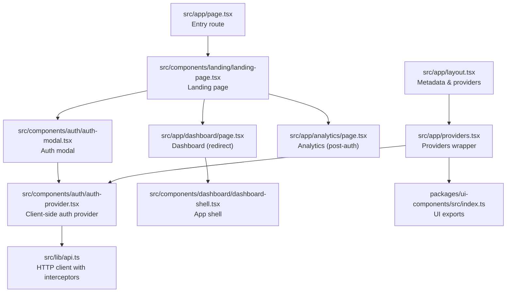
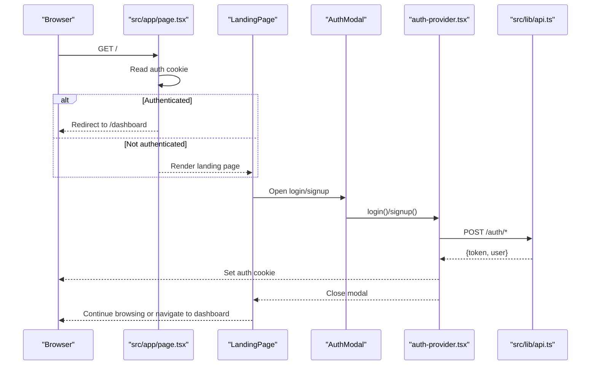
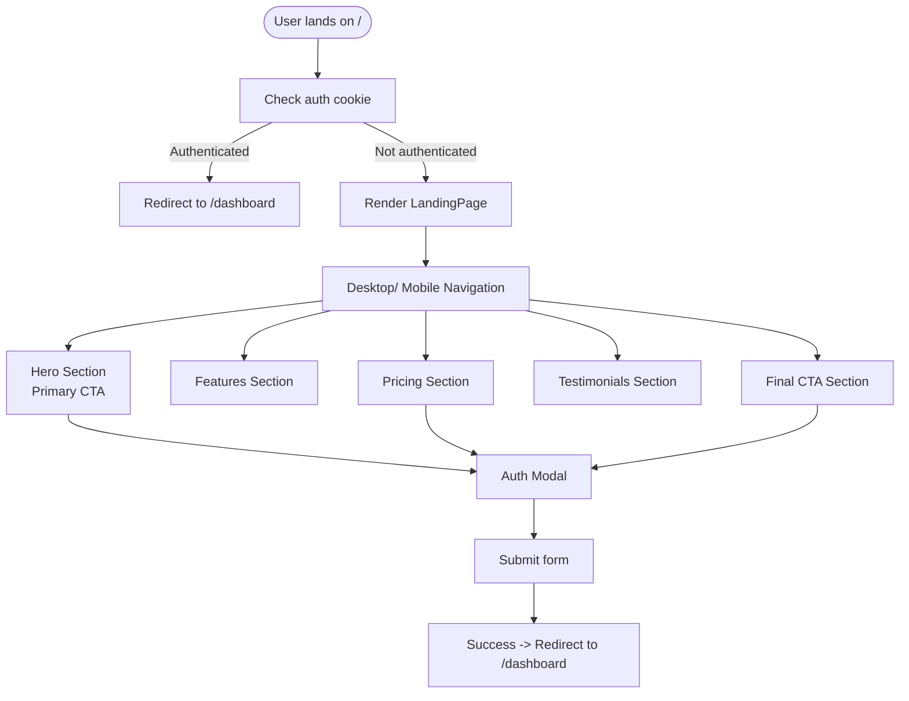
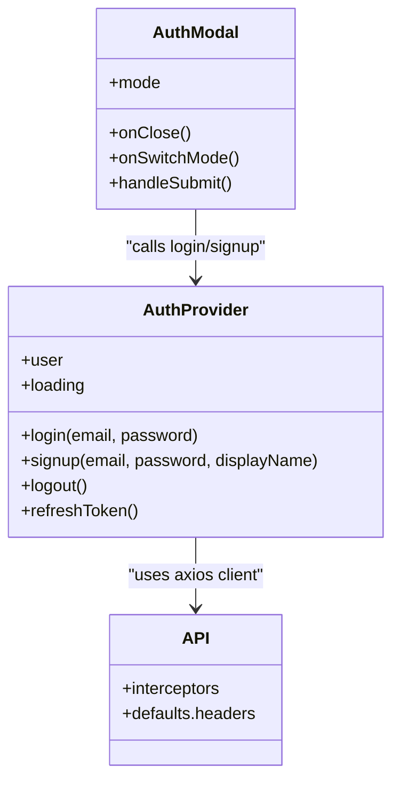
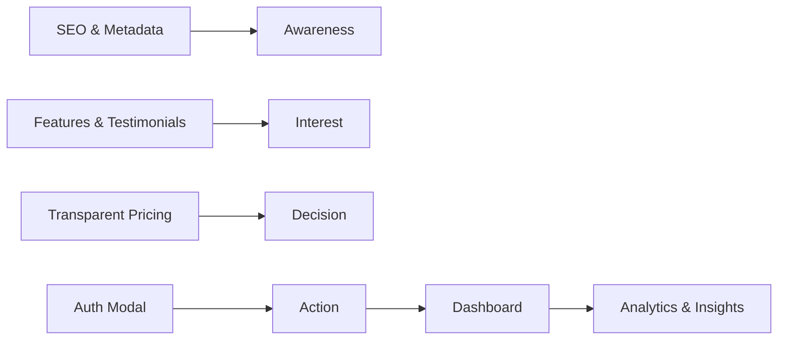
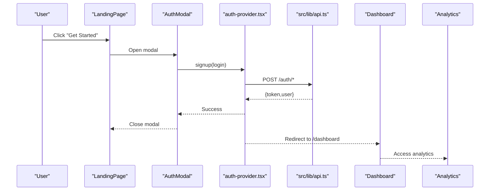
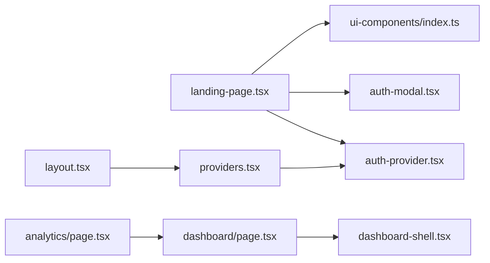

# Landing Page & Marketing

<cite>
**Referenced Files in This Document**
- [src/app/page.tsx](file://src/app/page.tsx)
- [src/components/landing/landing-page.tsx](file://src/components/landing/landing-page.tsx)
- [src/app/layout.tsx](file://src/app/layout.tsx)
- [src/app/providers.tsx](file://src/app/providers.tsx)
- [src/components/auth/auth-modal.tsx](file://src/components/auth/auth-modal.tsx)
- [src/components/auth/auth-provider.tsx](file://src/components/auth/auth-provider.tsx)
- [src/contexts/auth-context.tsx](file://src/contexts/auth-context.tsx)
- [src/lib/api.ts](file://src/lib/api.ts)
- [src/components/ui/button.tsx](file://src/components/ui/button.tsx)
- [src/app/dashboard/page.tsx](file://src/app/dashboard/page.tsx)
- [src/components/dashboard/dashboard-shell.tsx](file://src/components/dashboard/dashboard-shell.tsx)
- [src/app/analytics/page.tsx](file://src/app/analytics/page.tsx)
- [packages/ui-components/src/index.ts](file://packages/ui-components/src/index.ts)
- [packages/shared-types/src/index.ts](file://packages/shared-types/src/index.ts)
</cite>

## Table of Contents
1. [Introduction](#introduction)
2. [Project Structure](#project-structure)
3. [Core Components](#core-components)
4. [Architecture Overview](#architecture-overview)
5. [Detailed Component Analysis](#detailed-component-analysis)
6. [Dependency Analysis](#dependency-analysis)
7. [Performance Considerations](#performance-considerations)
8. [Troubleshooting Guide](#troubleshooting-guide)
9. [Conclusion](#conclusion)
10. [Appendices](#appendices)

## Introduction
This document explains the landing page and marketing system with a focus on conversion-focused design and feature showcase. It covers the landing page architecture, marketing copy and call-to-action optimization, feature presentation, pricing display, user acquisition flows, conversion funnel, marketing automation touchpoints, and user onboarding experience. It also documents integrations with the authentication system, analytics tracking, and marketing platforms, along with A/B testing capabilities, performance optimization, and mobile responsiveness. The content is accessible to beginners while providing sufficient technical depth for experienced developers.

## Project Structure
The marketing and conversion system centers around a Next.js landing page that serves authenticated users into the dashboard and unauthenticated users into the marketing funnel. Authentication is cookie-based on the client and integrates with an API layer. UI components are shared via a dedicated package. Providers wrap the app with theme, query caching, and auth context.

**Diagram sources**
- [src/app/page.tsx](file://src/app/page.tsx#L1-L17)
- [src/components/landing/landing-page.tsx](file://src/components/landing/landing-page.tsx#L1-L434)
- [src/components/auth/auth-modal.tsx](file://src/components/auth/auth-modal.tsx#L1-L212)
- [src/components/auth/auth-provider.tsx](file://src/components/auth/auth-provider.tsx#L1-L165)
- [src/lib/api.ts](file://src/lib/api.ts#L1-L67)
- [src/app/dashboard/page.tsx](file://src/app/dashboard/page.tsx#L1-L260)
- [src/components/dashboard/dashboard-shell.tsx](file://src/components/dashboard/dashboard-shell.tsx#L1-L224)
- [src/app/analytics/page.tsx](file://src/app/analytics/page.tsx#L1-L470)
- [src/app/layout.tsx](file://src/app/layout.tsx#L1-L102)
- [src/app/providers.tsx](file://src/app/providers.tsx#L1-L37)
- [packages/ui-components/src/index.ts](file://packages/ui-components/src/index.ts#L1-L12)

**Section sources**
- [src/app/page.tsx](file://src/app/page.tsx#L1-L17)
- [src/app/layout.tsx](file://src/app/layout.tsx#L1-L102)
- [src/app/providers.tsx](file://src/app/providers.tsx#L1-L37)

## Core Components
- Landing page: Hero, features, pricing, testimonials, and CTA sections with conversion-focused CTAs and navigation.
- Authentication system: Cookie-based client-side auth provider, modal form with validation, and server API integration.
- Providers: Theme switching, React Query caching, and auth context.
- Dashboard and analytics: Post-auth experience showcasing productivity and AI usage.

Key conversion levers:
- Navigation and mobile menu for frictionless access.
- Prominent CTAs in hero and pricing sections.
- Social proof via testimonials.
- Transparent pricing with highlighted popular plan.
- Auth modal integrated across the page.

**Section sources**
- [src/components/landing/landing-page.tsx](file://src/components/landing/landing-page.tsx#L127-L434)
- [src/components/auth/auth-modal.tsx](file://src/components/auth/auth-modal.tsx#L17-L212)
- [src/app/providers.tsx](file://src/app/providers.tsx#L9-L36)
- [src/app/dashboard/page.tsx](file://src/app/dashboard/page.tsx#L53-L260)
- [src/app/analytics/page.tsx](file://src/app/analytics/page.tsx#L93-L470)

## Architecture Overview
The landing page is a client-rendered React component that conditionally renders the marketing funnel or redirects authenticated users to the dashboard. Authentication is handled by a client-side provider that sets a cookie and manages user state. HTTP requests are routed through a centralized API client with automatic token injection and refresh handling. Providers supply theme, query caching, and auth context to the entire app.

**Diagram sources**
- [src/app/page.tsx](file://src/app/page.tsx#L5-L17)
- [src/components/landing/landing-page.tsx](file://src/components/landing/landing-page.tsx#L127-L434)
- [src/components/auth/auth-modal.tsx](file://src/components/auth/auth-modal.tsx#L17-L212)
- [src/components/auth/auth-provider.tsx](file://src/components/auth/auth-provider.tsx#L67-L113)
- [src/lib/api.ts](file://src/lib/api.ts#L11-L65)

## Detailed Component Analysis

### Landing Page Architecture and Conversion Design
The landing page is a single-page marketing site with:
- Navigation with desktop/mobile variants and auth triggers.
- Hero section with primary CTA and demo trigger.
- Feature cards with icons and descriptions aligned to the target audience’s needs.
- Pricing tiers with clear feature lists and CTAs.
- Testimonials with star ratings for social proof.
- Final CTA section and footer.

Conversion-focused patterns:
- Sticky navigation with prominent “Get Started” and “Log in” buttons.
- “Most Popular” badge on the recommended tier.
- Consistent CTAs (“Get Started”, “Start Free Trial”) across sections.
- Mobile-first responsive design with collapsible menu.

**Diagram sources**
- [src/app/page.tsx](file://src/app/page.tsx#L5-L17)
- [src/components/landing/landing-page.tsx](file://src/components/landing/landing-page.tsx#L127-L434)
- [src/components/auth/auth-modal.tsx](file://src/components/auth/auth-modal.tsx#L54-L72)

**Section sources**
- [src/components/landing/landing-page.tsx](file://src/components/landing/landing-page.tsx#L127-L434)

### Authentication System Integration
The client-side auth provider:
- Reads a cookie on mount and fetches user info if present.
- Provides login/signup functions that set a cookie and update user state.
- Handles token refresh automatically and logs out on failure.
- Exposes a logout function and toast feedback.

The centralized API client:
- Injects Authorization header from local storage for protected routes.
- Implements a response interceptor to refresh tokens and retry requests.

**Diagram sources**
- [src/components/auth/auth-provider.tsx](file://src/components/auth/auth-provider.tsx#L20-L156)
- [src/components/auth/auth-modal.tsx](file://src/components/auth/auth-modal.tsx#L17-L72)
- [src/lib/api.ts](file://src/lib/api.ts#L11-L65)

**Section sources**
- [src/components/auth/auth-provider.tsx](file://src/components/auth/auth-provider.tsx#L20-L156)
- [src/components/auth/auth-modal.tsx](file://src/components/auth/auth-modal.tsx#L17-L212)
- [src/lib/api.ts](file://src/lib/api.ts#L11-L65)

### Pricing Display System
The pricing section defines three tiers with:
- Plan name, price, billing period, and description.
- Feature lists with checkmarks.
- Prominent CTAs that open the auth modal.
- “Most Popular” highlight for the recommended tier.

Optimization opportunities:
- Add A/B test variants for CTAs and feature emphasis.
- Include trial length and cancellation policy for trust.
- Add FAQ accordion below pricing for objections.

**Section sources**
- [src/components/landing/landing-page.tsx](file://src/components/landing/landing-page.tsx#L58-L104)

### Feature Showcase Implementation
Features are presented as cards with:
- Lucide icons representing each capability.
- Titles and concise descriptions tailored to the target genre.
- Grid layout optimized for readability and scanning.

Best practices:
- Use benefit-driven headlines and outcomes.
- Pair each feature with a short, actionable description.
- Ensure icons are recognizable and scalable.

**Section sources**
- [src/components/landing/landing-page.tsx](file://src/components/landing/landing-page.tsx#L25-L56)

### Marketing Copy and Call-to-Action Optimization
Marketing copy emphasizes:
- Problem-solution alignment (“Stop fighting with generic AI”).
- Specific benefits (“steam calibration”, “voice fingerprinting”, “KDP-ready export”).
- Trust signals (“transparent pricing”, “loved by romantasy authors”).

CTA optimization:
- Multiple CTAs placed strategically (hero, pricing, final CTA).
- Action verbs (“Start Writing”, “Get Started”, “Start Free Trial”).
- Visual prominence and hover states via shared Button component.

**Section sources**
- [src/components/landing/landing-page.tsx](file://src/components/landing/landing-page.tsx#L248-L271)
- [src/components/landing/landing-page.tsx](file://src/components/landing/landing-page.tsx#L303-L351)
- [src/components/landing/landing-page.tsx](file://src/components/landing/landing-page.tsx#L387-L406)
- [src/components/ui/button.tsx](file://src/components/ui/button.tsx#L6-L55)

### User Acquisition Flows
The funnel:
- Awareness: SEO-friendly metadata and OG images.
- Interest: Feature and testimonial sections.
- Decision: Transparent pricing and highlighted plan.
- Action: Auth modal with minimal friction.
- Retention: Redirect to dashboard and analytics for engagement.

**Diagram sources**
- [src/app/layout.tsx](file://src/app/layout.tsx#L14-L81)
- [src/components/landing/landing-page.tsx](file://src/components/landing/landing-page.tsx#L274-L385)
- [src/components/auth/auth-modal.tsx](file://src/components/auth/auth-modal.tsx#L17-L72)
- [src/app/dashboard/page.tsx](file://src/app/dashboard/page.tsx#L53-L260)
- [src/app/analytics/page.tsx](file://src/app/analytics/page.tsx#L93-L470)

**Section sources**
- [src/app/layout.tsx](file://src/app/layout.tsx#L14-L81)
- [src/app/page.tsx](file://src/app/page.tsx#L5-L17)

### Conversion Funnel and Onboarding Experience
Post-authentication:
- Redirect to dashboard with welcome messaging.
- Project overview and quick actions.
- Analytics dashboard for productivity insights and AI usage.

**Diagram sources**
- [src/components/landing/landing-page.tsx](file://src/components/landing/landing-page.tsx#L127-L434)
- [src/components/auth/auth-modal.tsx](file://src/components/auth/auth-modal.tsx#L54-L72)
- [src/components/auth/auth-provider.tsx](file://src/components/auth/auth-provider.tsx#L67-L113)
- [src/lib/api.ts](file://src/lib/api.ts#L11-L65)
- [src/app/dashboard/page.tsx](file://src/app/dashboard/page.tsx#L53-L260)
- [src/app/analytics/page.tsx](file://src/app/analytics/page.tsx#L93-L470)

**Section sources**
- [src/app/dashboard/page.tsx](file://src/app/dashboard/page.tsx#L53-L260)
- [src/app/analytics/page.tsx](file://src/app/analytics/page.tsx#L93-L470)

### Practical Examples and Optimization Tips
- Example: Highlight “Most Popular” plan with a subtle shadow and badge.
- Example: Swap “Start Free Trial” to “Start 7-Day Free” for clarity.
- Example: Add “What’s included” expandable section under pricing.
- Example: Use emoji or small illustrations next to feature titles for scannability.
- Example: Add “No credit card required” note to free plan for trust.
- Example: Implement A/B tests for CTA text and placement using a feature flag system.

[No sources needed since this section provides general guidance]

### Integration with Authentication, Analytics, and Marketing Platforms
- Authentication: Cookie-based client-side provider with API integration for login/signup/refresh.
- Analytics: Dedicated analytics page with charts and insights; can be extended to integrate with external analytics platforms.
- Marketing: Landing page metadata and OG images for social sharing; consider adding UTM-aware links and email capture.

**Section sources**
- [src/components/auth/auth-provider.tsx](file://src/components/auth/auth-provider.tsx#L20-L156)
- [src/app/analytics/page.tsx](file://src/app/analytics/page.tsx#L93-L470)
- [src/app/layout.tsx](file://src/app/layout.tsx#L14-L81)

### A/B Testing Capabilities
Current state:
- No explicit A/B framework is implemented in the codebase.

Recommended approach:
- Feature flags for variant assignment.
- Persist variant in localStorage or cookies.
- Track conversions per variant using analytics events.
- Toggle pricing CTAs, hero copy, or testimonials by variant.

[No sources needed since this section proposes future enhancements]

### Mobile Responsiveness
- Mobile menu toggle with backdrop overlay.
- Responsive grid layouts for features and pricing.
- Touch-friendly CTA sizing and spacing.

**Section sources**
- [src/components/landing/landing-page.tsx](file://src/components/landing/landing-page.tsx#L182-L244)
- [src/components/landing/landing-page.tsx](file://src/components/landing/landing-page.tsx#L284-L300)
- [src/components/landing/landing-page.tsx](file://src/components/landing/landing-page.tsx#L313-L350)

## Dependency Analysis
The landing page depends on:
- Shared UI components for consistent styling and behavior.
- Auth modal and provider for conversion.
- Providers for theme and query caching.
- Layout for SEO metadata and base structure.

**Diagram sources**
- [src/components/landing/landing-page.tsx](file://src/components/landing/landing-page.tsx#L1-L434)
- [packages/ui-components/src/index.ts](file://packages/ui-components/src/index.ts#L1-L12)
- [src/components/auth/auth-modal.tsx](file://src/components/auth/auth-modal.tsx#L1-L212)
- [src/components/auth/auth-provider.tsx](file://src/components/auth/auth-provider.tsx#L1-L165)
- [src/app/providers.tsx](file://src/app/providers.tsx#L1-L37)
- [src/app/layout.tsx](file://src/app/layout.tsx#L1-L102)
- [src/app/dashboard/page.tsx](file://src/app/dashboard/page.tsx#L1-L260)
- [src/components/dashboard/dashboard-shell.tsx](file://src/components/dashboard/dashboard-shell.tsx#L1-L224)
- [src/app/analytics/page.tsx](file://src/app/analytics/page.tsx#L1-L470)

**Section sources**
- [src/components/landing/landing-page.tsx](file://src/components/landing/landing-page.tsx#L1-L434)
- [src/app/providers.tsx](file://src/app/providers.tsx#L1-L37)
- [src/app/layout.tsx](file://src/app/layout.tsx#L1-L102)

## Performance Considerations
- Bundle size and hydration: Keep client components lightweight; defer non-critical scripts.
- Image optimization: Use modern formats and lazy loading for hero and testimonials.
- Client-side routing: Minimize unnecessary re-renders in the landing page.
- Analytics: Defer heavy chart rendering until visible or on demand.
- Mobile: Ensure touch targets are sufficiently sized; avoid excessive z-index stacking.

[No sources needed since this section provides general guidance]

## Troubleshooting Guide
Common issues and resolutions:
- Auth modal not closing after successful login/signup: Verify provider resolves promises and closes modal.
- 401 errors after token expiration: Confirm API interceptor refresh flow and localStorage cleanup.
- Cookie not persisting: Check SameSite and Secure flags and path configuration.
- Dashboard redirect loop: Ensure cookie presence logic and redirect conditions are correct.

**Section sources**
- [src/components/auth/auth-modal.tsx](file://src/components/auth/auth-modal.tsx#L54-L72)
- [src/components/auth/auth-provider.tsx](file://src/components/auth/auth-provider.tsx#L133-L141)
- [src/lib/api.ts](file://src/lib/api.ts#L24-L65)
- [src/app/page.tsx](file://src/app/page.tsx#L5-L17)

## Conclusion
The landing page and marketing system are structured to convert visitors efficiently through clear value communication, persuasive pricing, social proof, and seamless authentication. The architecture integrates a cookie-based auth provider, centralized API client, and shared UI components to deliver a consistent, responsive experience. Extending the system with A/B testing, deeper analytics integration, and marketing automation will further optimize conversion rates and user retention.

[No sources needed since this section summarizes without analyzing specific files]

## Appendices

### UI Component Reference
Shared UI exports include button, card, skeleton, toast, and utilities.

**Section sources**
- [packages/ui-components/src/index.ts](file://packages/ui-components/src/index.ts#L1-L12)

### Data Types Reference
Shared types include AI, API, auth, billing, entities, and enums.

**Section sources**
- [packages/shared-types/src/index.ts](file://packages/shared-types/src/index.ts#L1-L7)