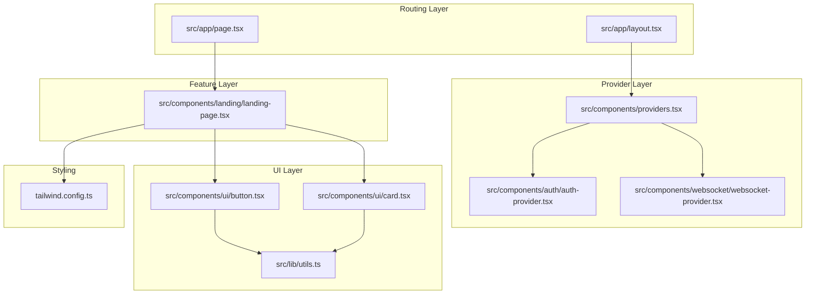
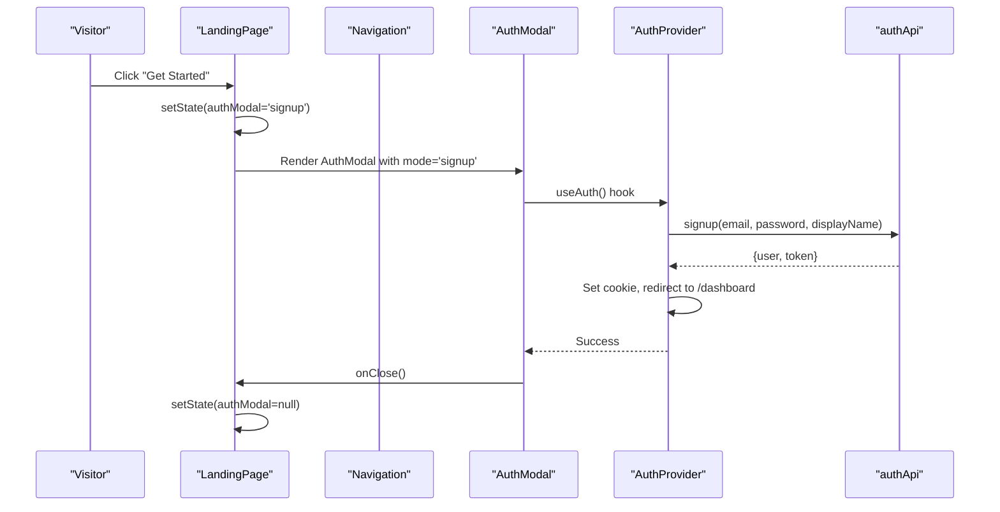
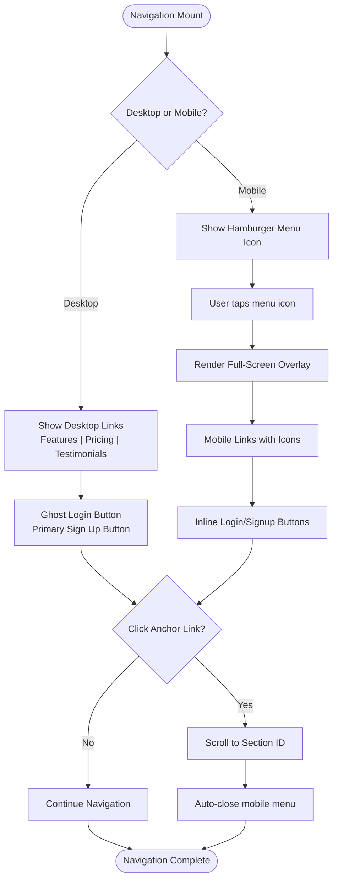
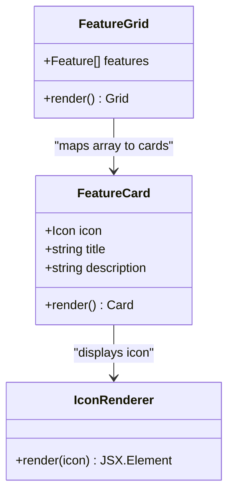
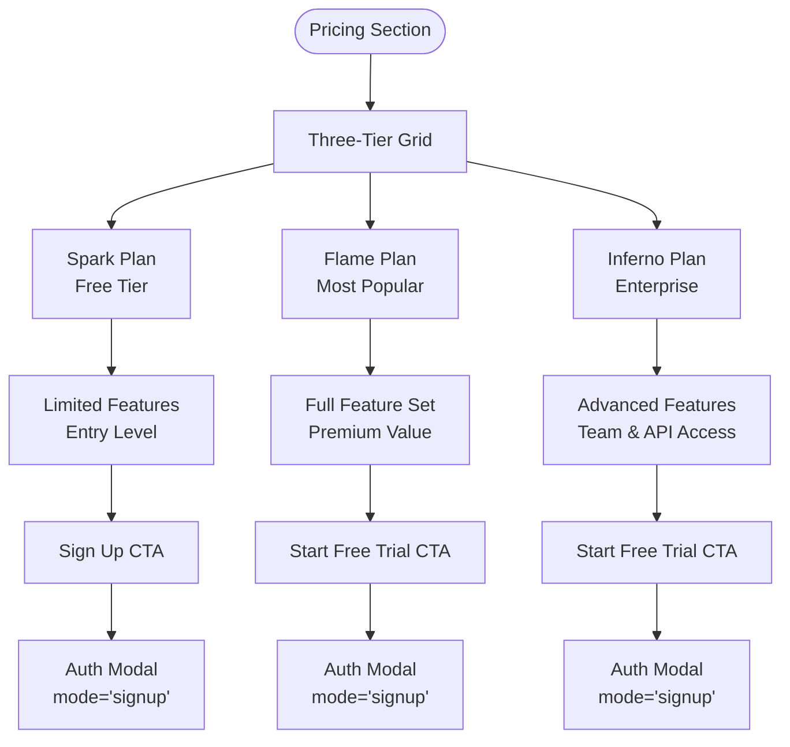
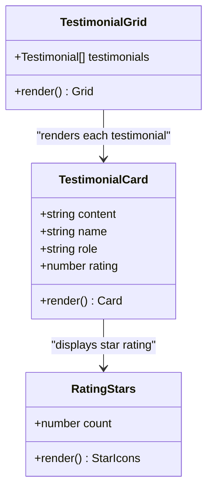
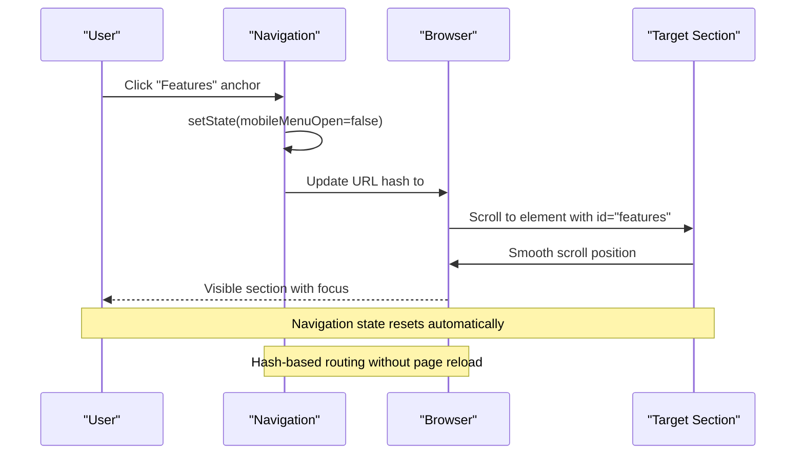
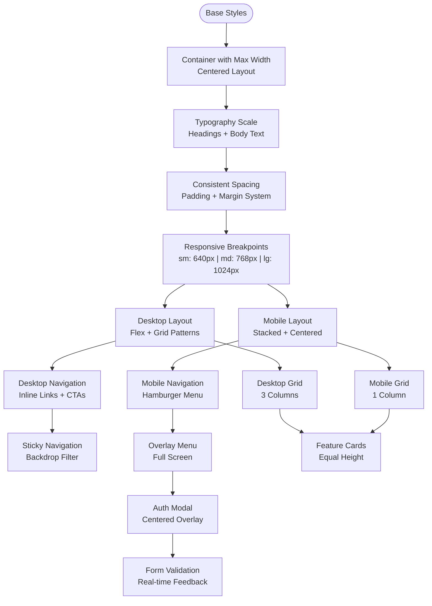
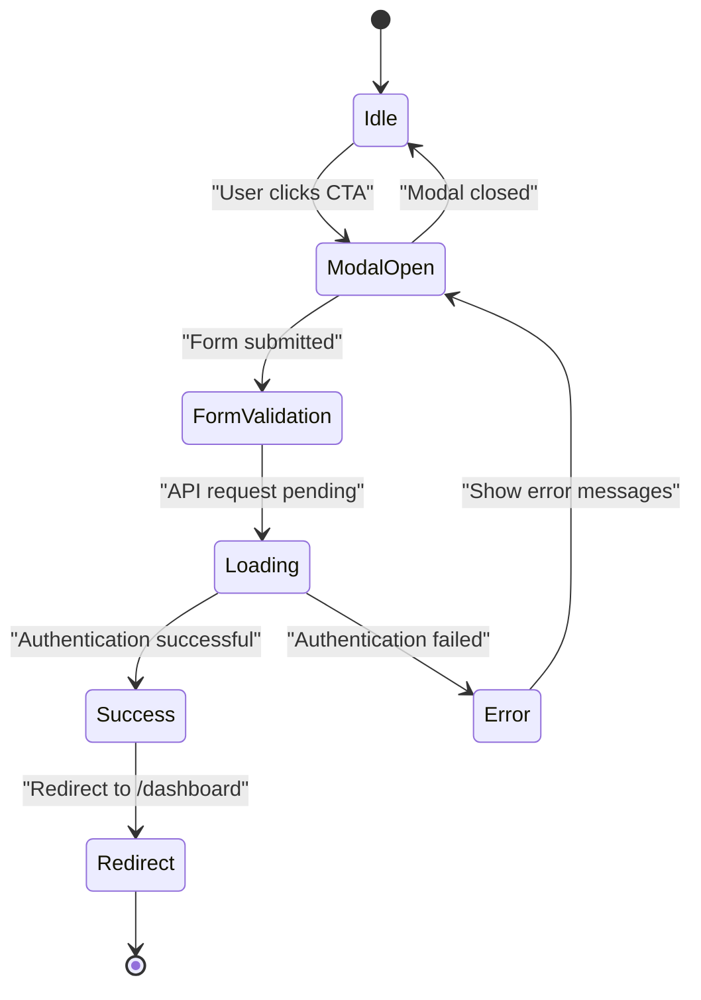

# Landing Page Architecture

<cite>
**Referenced Files in This Document**
- [landing-page.tsx](file://src/components/landing/landing-page.tsx)
- [auth-modal.tsx](file://src/components/auth/auth-modal.tsx)
- [auth-provider.tsx](file://src/components/auth/auth-provider.tsx)
- [layout.tsx](file://src/app/layout.tsx)
- [page.tsx](file://src/app/page.tsx)
- [providers.tsx](file://src/components/providers.tsx)
- [button.tsx](file://src/components/ui/button.tsx)
- [card.tsx](file://src/components/ui/card.tsx)
- [utils.ts](file://src/lib/utils.ts)
- [tailwind.config.ts](file://tailwind.config.ts)
- [websocket-provider.tsx](file://src/components/websocket/websocket-provider.tsx)
- [auth.ts](file://src/lib/api/auth.ts)
</cite>

## Table of Contents
1. [Introduction](#introduction)
2. [Project Structure](#project-structure)
3. [Core Components](#core-components)
4. [Architecture Overview](#architecture-overview)
5. [Detailed Component Analysis](#detailed-component-analysis)
6. [Navigation and Anchor Linking](#navigation-and-anchor-linking)
7. [Responsive Design Implementation](#responsive-design-implementation)
8. [Conversion-Focused Layout Elements](#conversion-focused-layout-elements)
9. [Authentication Integration](#authentication-integration)
10. [Performance Considerations](#performance-considerations)
11. [SEO and Accessibility Compliance](#seo-and-accessibility-compliance)
12. [Troubleshooting Guide](#troubleshooting-guide)
13. [Conclusion](#conclusion)

## Introduction
This document provides comprehensive technical documentation for the landing page architecture focused on conversion-driven design and user acquisition. It explains the component structure, navigation system, responsive design implementation, and the strategic placement of call-to-action elements. The documentation covers the hero section layout, feature showcase cards, pricing tiers, and testimonial presentation. It also details the mobile-responsive navigation with a hamburger menu, authentication modal integration, and the navigation flow between sections. Practical examples demonstrate component composition, state management for modals and menus, and integration with the authentication system. Performance optimization, SEO considerations, and accessibility compliance are addressed to ensure both beginner accessibility and technical depth for experienced developers.

## Project Structure
The landing page is implemented as a single-page application component integrated into the Next.js app router. The architecture follows a layered pattern:
- UI Layer: Reusable components (Button, Card) and design tokens
- Feature Layer: LandingPage component orchestrating sections and state
- Authentication Layer: Modal and provider managing user sessions
- Provider Layer: Global providers for state, theming, and networking
- Routing Layer: Next.js pages controlling initial render and redirects



**Diagram sources**
- [page.tsx](file://src/app/page.tsx#L1-L17)
- [layout.tsx](file://src/app/layout.tsx#L83-L102)
- [providers.tsx](file://src/components/providers.tsx#L10-L55)
- [auth-provider.tsx](file://src/components/auth/auth-provider.tsx#L20-L157)
- [websocket-provider.tsx](file://src/components/websocket/websocket-provider.tsx#L17-L130)
- [landing-page.tsx](file://src/components/landing/landing-page.tsx#L127-L434)
- [button.tsx](file://src/components/ui/button.tsx#L41-L52)
- [card.tsx](file://src/components/ui/card.tsx#L4-L16)
- [utils.ts](file://src/lib/utils.ts#L4-L6)
- [tailwind.config.ts](file://tailwind.config.ts#L1-L133)

**Section sources**
- [page.tsx](file://src/app/page.tsx#L1-L17)
- [layout.tsx](file://src/app/layout.tsx#L83-L102)
- [providers.tsx](file://src/components/providers.tsx#L10-L55)

## Core Components
The landing page is composed of several cohesive components working together to drive conversions:

- Navigation Bar: Desktop and mobile-responsive with anchor links to sections
- Hero Section: High-impact headline, supporting copy, and prominent CTAs
- Features Section: Grid of feature cards with icons and descriptions
- Pricing Section: Tiered pricing cards with feature lists and CTAs
- Testimonials Section: Social proof with star ratings and author details
- Call-to-Action Section: Final conversion opportunity
- Footer: Branding and legal information
- Authentication Modal: Seamless login/signup experience

Key reusable UI components:
- Button: Variants for primary, secondary, outline, and ghost actions
- Card: Consistent content containers for features, pricing, and testimonials

**Section sources**
- [landing-page.tsx](file://src/components/landing/landing-page.tsx#L25-L125)
- [button.tsx](file://src/components/ui/button.tsx#L6-L33)
- [card.tsx](file://src/components/ui/card.tsx#L4-L78)

## Architecture Overview
The landing page architecture implements a unidirectional data flow with centralized state management:



**Diagram sources**
- [landing-page.tsx](file://src/components/landing/landing-page.tsx#L127-L130)
- [landing-page.tsx](file://src/components/landing/landing-page.tsx#L424-L431)
- [auth-modal.tsx](file://src/components/auth/auth-modal.tsx#L17-L72)
- [auth-provider.tsx](file://src/components/auth/auth-provider.tsx#L91-L113)
- [auth.ts](file://src/lib/api/auth.ts#L34-L41)

**Section sources**
- [landing-page.tsx](file://src/components/landing/landing-page.tsx#L127-L130)
- [auth-modal.tsx](file://src/components/auth/auth-modal.tsx#L17-L72)
- [auth-provider.tsx](file://src/components/auth/auth-provider.tsx#L91-L113)

## Detailed Component Analysis

### Navigation System
The navigation implements a hybrid desktop/mobile design with anchor-based scrolling:



**Diagram sources**
- [landing-page.tsx](file://src/components/landing/landing-page.tsx#L134-L179)
- [landing-page.tsx](file://src/components/landing/landing-page.tsx#L181-L244)

Key implementation details:
- Uses Next.js Link components with hash anchors for smooth scrolling
- Mobile menu renders as a fixed overlay with z-index stacking
- State management via useState for mobileMenuOpen flag
- Responsive breakpoints using Tailwind's md breakpoint

**Section sources**
- [landing-page.tsx](file://src/components/landing/landing-page.tsx#L134-L179)
- [landing-page.tsx](file://src/components/landing/landing-page.tsx#L181-L244)

### Hero Section Layout
The hero section employs a centered, high-contrast layout optimized for immediate conversion:

```mermaid
flowchart TD
HeroStart(["Hero Section"]) --> Headline["Primary Headline<br/>Gradient Text Effect"]
Headline --> Subheading["Supporting Copy<br/>Problem-Solution Statement"]
Subheading --> CTAStack["Primary CTA Stack<br/>Vertical on Mobile"]
CTAStack --> PrimaryCTA["Large Primary Button<br/>"Get Started for Free"]
CTAStack --> SecondaryCTA["Outline Secondary Button<br/>Watch Demo"]
PrimaryCTA --> ModalTrigger["Open Auth Modal<br/>mode='signup'"]
SecondaryCTA --> VideoTrigger["Open Video Player<br/>(external)"]
ModalTrigger --> AuthFlow["Authentication Flow<br/>Validation + Submission"]
AuthFlow --> DashboardRedirect["Redirect to /dashboard"]
```

**Diagram sources**
- [landing-page.tsx](file://src/components/landing/landing-page.tsx#L247-L271)

Conversion-focused design elements:
- Gradient text for visual interest and brand recognition
- Clear problem-solution statement addressing target audience pain points
- Dual CTA strategy: primary action and social proof
- Large button sizes for easy mobile interaction

**Section sources**
- [landing-page.tsx](file://src/components/landing/landing-page.tsx#L247-L271)

### Feature Showcase Cards
Features are presented in a responsive grid with consistent visual hierarchy:



**Diagram sources**
- [landing-page.tsx](file://src/components/landing/landing-page.tsx#L25-L56)
- [landing-page.tsx](file://src/components/landing/landing-page.tsx#L284-L299)
- [card.tsx](file://src/components/ui/card.tsx#L4-L78)

Implementation highlights:
- Lucide React icons for visual recognition
- Card component with header/icon/title/content structure
- Responsive grid using Tailwind's sm:grid-cols-2 and md:grid-cols-3
- Hover states and visual feedback for engagement

**Section sources**
- [landing-page.tsx](file://src/components/landing/landing-page.tsx#L25-L56)
- [landing-page.tsx](file://src/components/landing/landing-page.tsx#L284-L299)

### Pricing Tiers
The pricing section implements a tiered strategy with clear differentiation:



**Diagram sources**
- [landing-page.tsx](file://src/components/landing/landing-page.tsx#L58-L104)
- [landing-page.tsx](file://src/components/landing/landing-page.tsx#L313-L350)

Pricing strategy elements:
- Clear feature comparisons with checkmark indicators
- Visual prominence for the recommended tier
- Consistent CTA placement across all tiers
- Transparent pricing with period indicators

**Section sources**
- [landing-page.tsx](file://src/components/landing/landing-page.tsx#L58-L104)
- [landing-page.tsx](file://src/components/landing/landing-page.tsx#L313-L350)

### Testimonial Presentation
Testimonials are structured to maximize social proof and trust:



**Diagram sources**
- [landing-page.tsx](file://src/components/landing/landing-page.tsx#L106-L125)
- [landing-page.tsx](file://src/components/landing/landing-page.tsx#L363-L384)

Trust-building elements:
- Five-star rating system with visual star icons
- Author name and professional role for credibility
- Italicized quotes for emphasis and authenticity
- Responsive grid layout for optimal viewing

**Section sources**
- [landing-page.tsx](file://src/components/landing/landing-page.tsx#L106-L125)
- [landing-page.tsx](file://src/components/landing/landing-page.tsx#L363-L384)

## Navigation and Anchor Linking
The navigation system implements seamless anchor-based scrolling with state management:



**Diagram sources**
- [landing-page.tsx](file://src/components/landing/landing-page.tsx#L147-L155)
- [landing-page.tsx](file://src/components/landing/landing-page.tsx#L200-L219)

Navigation flow characteristics:
- Desktop navigation uses standard anchor links
- Mobile menu closes automatically after navigation
- Smooth scrolling behavior for enhanced UX
- Persistent navigation bar with backdrop blur effect

**Section sources**
- [landing-page.tsx](file://src/components/landing/landing-page.tsx#L147-L155)
- [landing-page.tsx](file://src/components/landing/landing-page.tsx#L200-L219)

## Responsive Design Implementation
The landing page implements a comprehensive mobile-first responsive strategy:



**Diagram sources**
- [tailwind.config.ts](file://tailwind.config.ts#L10-L17)
- [tailwind.config.ts](file://tailwind.config.ts#L18-L93)
- [landing-page.tsx](file://src/components/landing/landing-page.tsx#L134-L179)

Responsive implementation details:
- Container-based layout with centered content
- Typography scale optimized for readability across devices
- Mobile-first grid system with responsive column counts
- Navigation transforms from inline to overlay menu
- Backdrop blur effect for modern visual appeal

**Section sources**
- [tailwind.config.ts](file://tailwind.config.ts#L10-L17)
- [tailwind.config.ts](file://tailwind.config.ts#L18-L93)
- [landing-page.tsx](file://src/components/landing/landing-page.tsx#L134-L179)

## Conversion-Focused Layout Elements
The landing page employs strategic design patterns to maximize conversion rates:

### Visual Hierarchy and Attention
- Primary headline with gradient text creates immediate visual impact
- Clear problem-solution statement positioned prominently
- Dual CTA strategy provides multiple conversion pathways
- Most popular tier highlighted with border and shadow

### Trust and Social Proof
- Testimonial cards with star ratings and author credentials
- Feature showcase demonstrating product capabilities
- Pricing transparency with clear feature comparisons

### Mobile Optimization
- Large touch targets for easy interaction
- Simplified navigation with hamburger menu
- Vertical CTA stack for mobile-first experience
- Responsive typography scaling

**Section sources**
- [landing-page.tsx](file://src/components/landing/landing-page.tsx#L247-L271)
- [landing-page.tsx](file://src/components/landing/landing-page.tsx#L313-L350)
- [landing-page.tsx](file://src/components/landing/landing-page.tsx#L353-L385)

## Authentication Integration
The authentication system integrates seamlessly with the landing page through modal-based UX:



**Diagram sources**
- [landing-page.tsx](file://src/components/landing/landing-page.tsx#L127-L130)
- [landing-page.tsx](file://src/components/landing/landing-page.tsx#L424-L431)
- [auth-modal.tsx](file://src/components/auth/auth-modal.tsx#L54-L72)
- [auth-provider.tsx](file://src/components/auth/auth-provider.tsx#L67-L89)

Authentication flow implementation:
- Centralized state management via useState hooks
- Real-time form validation with error messaging
- Secure cookie-based session management
- Automatic redirection to dashboard upon successful auth
- Toast notifications for user feedback

**Section sources**
- [landing-page.tsx](file://src/components/landing/landing-page.tsx#L127-L130)
- [auth-modal.tsx](file://src/components/auth/auth-modal.tsx#L54-L72)
- [auth-provider.tsx](file://src/components/auth/auth-provider.tsx#L67-L89)

## Performance Considerations
The landing page architecture incorporates several performance optimization strategies:

### Bundle Size and Loading
- Single-page application reduces navigation overhead
- Dynamic imports for heavy components (recommended for future implementation)
- Optimized asset delivery through Next.js Image optimization
- Minimal third-party dependencies

### Rendering Performance
- Client-side hydration with proper suspense boundaries
- Efficient state updates via React hooks
- CSS-in-JS with Tailwind utility classes for minimal runtime cost
- Memoized components to prevent unnecessary re-renders

### Network Optimization
- API client abstraction for centralized request handling
- Retry logic with exponential backoff for failed requests
- Caching strategies for improved subsequent loads
- WebSocket integration for real-time features

**Section sources**
- [providers.tsx](file://src/components/providers.tsx#L11-L36)
- [auth.ts](file://src/lib/api/auth.ts#L25-L55)

## SEO and Accessibility Compliance
The landing page implements comprehensive SEO and accessibility best practices:

### Search Engine Optimization
- Structured metadata with Open Graph and Twitter Card support
- Semantic HTML structure with proper heading hierarchy
- Descriptive meta tags targeting romance writing keywords
- Canonical URL configuration and robots.txt optimization
- Schema.org compatible metadata for enhanced search visibility

### Accessibility Compliance
- Semantic HTML elements for screen reader compatibility
- Proper contrast ratios meeting WCAG guidelines
- Keyboard navigation support for all interactive elements
- Focus management for modal dialogs and navigation
- ARIA attributes for enhanced assistive technology support

### Performance Metrics
- Optimized Core Web Vitals through efficient resource loading
- Lazy loading for non-critical resources
- Minimized JavaScript bundle size
- Efficient image optimization and compression

**Section sources**
- [layout.tsx](file://src/app/layout.tsx#L14-L81)
- [tailwind.config.ts](file://tailwind.config.ts#L19-L88)

## Troubleshooting Guide
Common issues and their solutions:

### Navigation Issues
- **Problem**: Anchor links not scrolling to sections
- **Solution**: Verify section IDs match anchor href values and check for CSS conflicts

### Authentication Problems
- **Problem**: Modal not opening or closing properly
- **Solution**: Ensure proper state management and check for conflicting z-index values

### Mobile Menu Issues
- **Problem**: Menu not responding to touch events
- **Solution**: Verify event handlers are attached and CSS pointer-events are enabled

### Performance Issues
- **Problem**: Slow page load times
- **Solution**: Implement code splitting and optimize asset loading

**Section sources**
- [landing-page.tsx](file://src/components/landing/landing-page.tsx#L181-L244)
- [auth-modal.tsx](file://src/components/auth/auth-modal.tsx#L74-L211)

## Conclusion
The landing page architecture successfully combines modern React patterns with conversion-focused design principles. The component-based approach ensures maintainability while the responsive design delivers optimal user experiences across all devices. The seamless authentication integration removes friction from the conversion funnel, while the comprehensive SEO and accessibility implementation ensures broad reach and inclusive access. The architecture provides a solid foundation for iterative improvements and feature expansion while maintaining high performance standards.