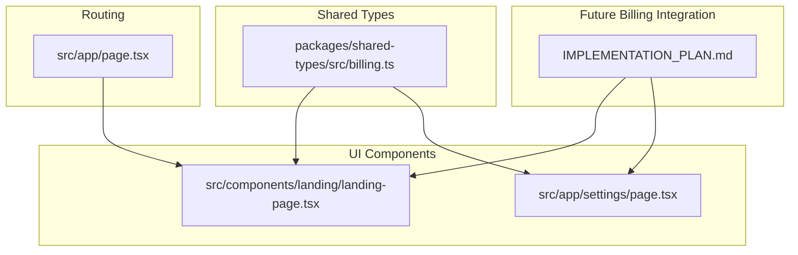
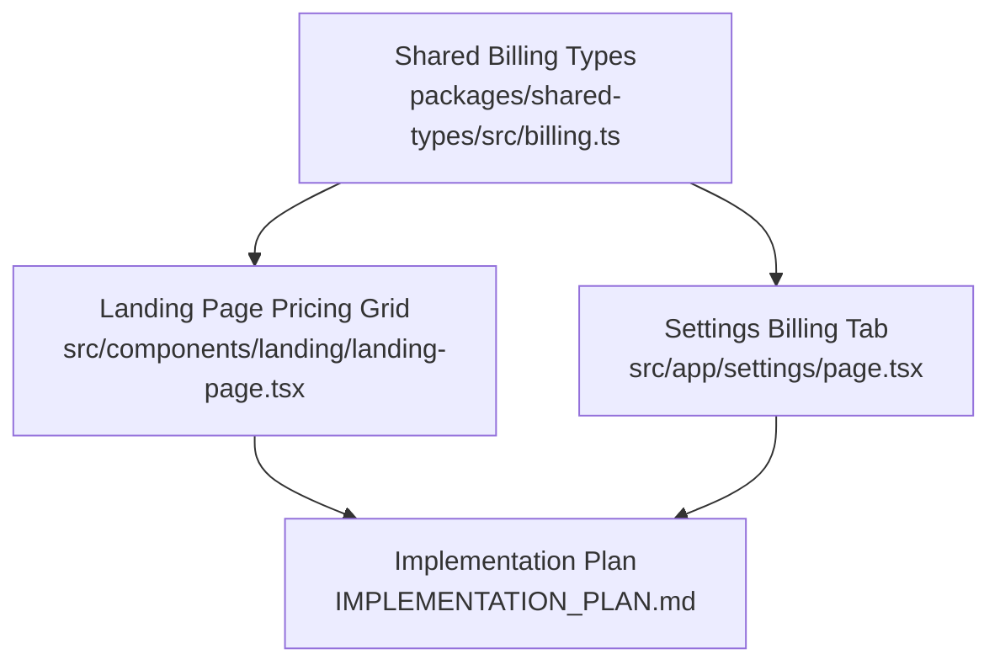
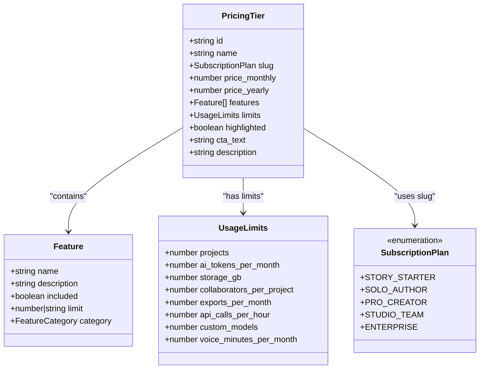
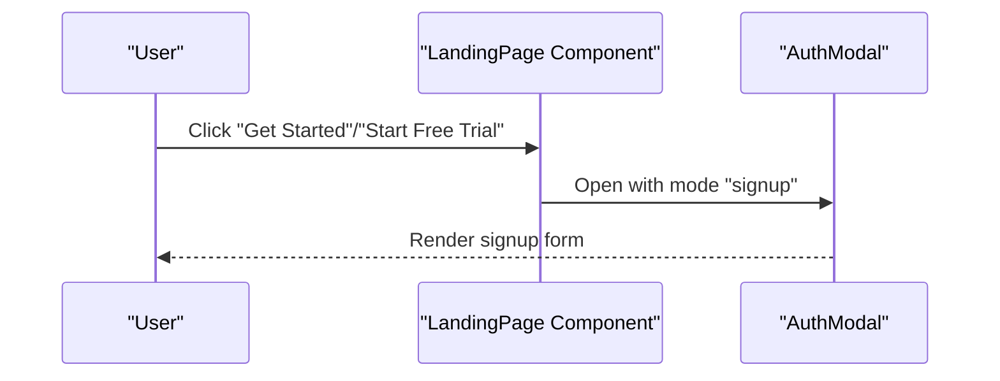
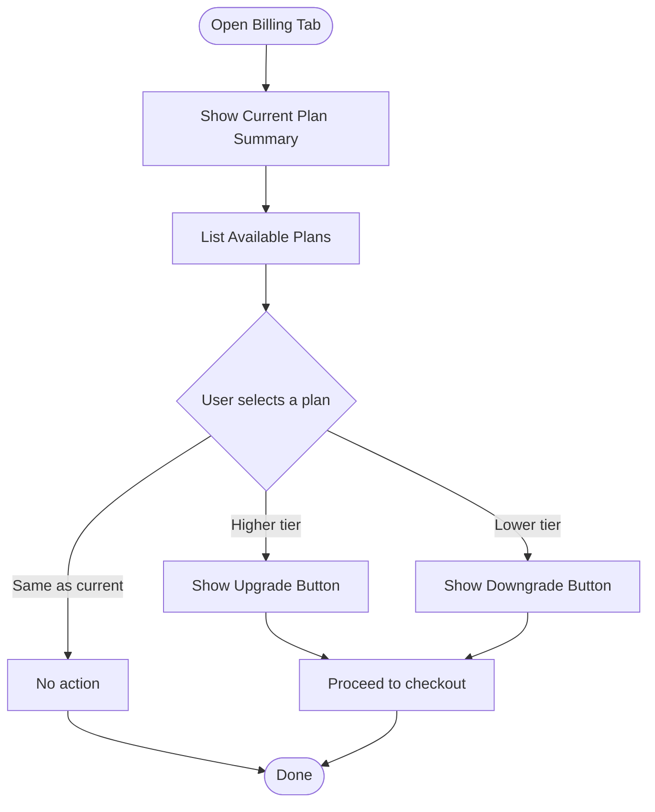
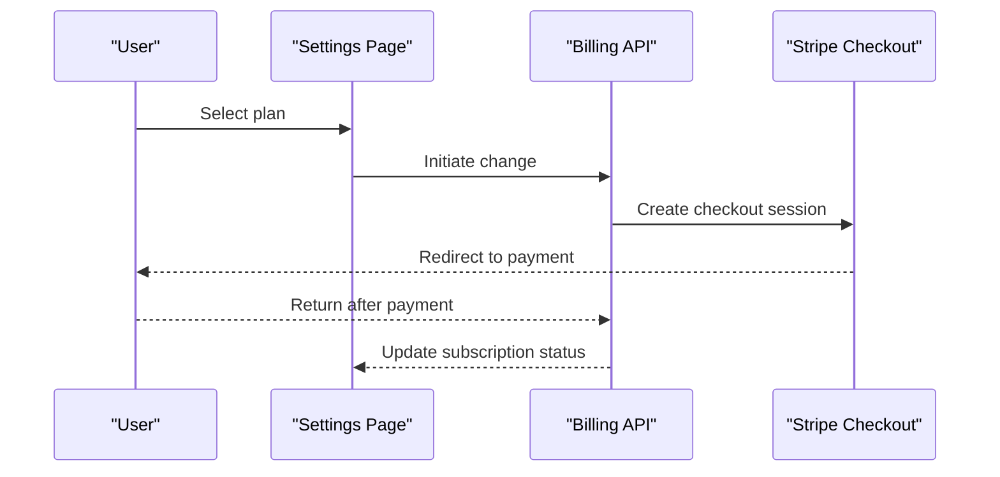
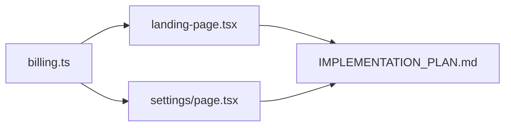

# Pricing Display System

<cite>
**Referenced Files in This Document**
- [landing-page.tsx](file://src/components/landing/landing-page.tsx)
- [billing.ts](file://packages/shared-types/src/billing.ts)
- [page.tsx](file://src/app/settings/page.tsx)
- [IMPLEMENTATION_PLAN.md](file://IMPLEMENTATION_PLAN.md)
- [page.tsx](file://src/app/page.tsx)
</cite>

## Table of Contents
1. [Introduction](#introduction)
2. [Project Structure](#project-structure)
3. [Core Components](#core-components)
4. [Architecture Overview](#architecture-overview)
5. [Detailed Component Analysis](#detailed-component-analysis)
6. [Dependency Analysis](#dependency-analysis)
7. [Performance Considerations](#performance-considerations)
8. [Troubleshooting Guide](#troubleshooting-guide)
9. [Conclusion](#conclusion)

## Introduction
This document explains the pricing display system for transparent pricing presentation and conversion optimization. It covers the pricing tier structure, feature comparison matrix, call-to-action buttons, data structures, popular plan highlighting, responsive grid layout, feature listings, pricing calculation display, promotional messaging, and practical examples for extending the system. It also addresses plan selection logic, popular plan indicators, responsive design, localization, currency formatting, and integration with subscription management.

## Project Structure
The pricing system spans multiple areas:
- Shared billing types define the canonical pricing and subscription models
- Landing page displays a simplified pricing grid for prospective users
- Settings page shows the internal plan hierarchy and current plan details
- Implementation plan outlines future Stripe integration and billing UI components

**Diagram sources**
- [billing.ts](file://packages/shared-types/src/billing.ts#L65-L114)
- [landing-page.tsx](file://src/components/landing/landing-page.tsx#L58-L104)
- [page.tsx](file://src/app/settings/page.tsx#L71-L104)
- [page.tsx](file://src/app/page.tsx#L1-L17)
- [IMPLEMENTATION_PLAN.md](file://IMPLEMENTATION_PLAN.md#L317-L356)

**Section sources**
- [billing.ts](file://packages/shared-types/src/billing.ts#L65-L114)
- [landing-page.tsx](file://src/components/landing/landing-page.tsx#L58-L104)
- [page.tsx](file://src/app/settings/page.tsx#L71-L104)
- [page.tsx](file://src/app/page.tsx#L1-L17)
- [IMPLEMENTATION_PLAN.md](file://IMPLEMENTATION_PLAN.md#L317-L356)

## Core Components
- Pricing data structures:
  - Canonical pricing tiers and features are defined in shared types
  - Internal plan list in settings reflects the current product plans
- Pricing display components:
  - Landing page pricing cards with popular plan highlighting
  - Settings page plan comparison and change controls
- Integration roadmap:
  - Stripe checkout, webhooks, usage metering, and billing UI components are planned

Key responsibilities:
- Present transparent pricing with clear feature lists and CTAs
- Highlight the recommended plan
- Support responsive layouts for desktop and mobile
- Prepare for localization and currency formatting
- Enable plan selection and upgrade/downgrade flows

**Section sources**
- [billing.ts](file://packages/shared-types/src/billing.ts#L65-L95)
- [page.tsx](file://src/app/settings/page.tsx#L71-L104)
- [landing-page.tsx](file://src/components/landing/landing-page.tsx#L303-L351)
- [IMPLEMENTATION_PLAN.md](file://IMPLEMENTATION_PLAN.md#L317-L356)

## Architecture Overview
The pricing system architecture combines shared data models with UI components and a future billing integration layer.

**Diagram sources**
- [billing.ts](file://packages/shared-types/src/billing.ts#L65-L114)
- [landing-page.tsx](file://src/components/landing/landing-page.tsx#L303-L351)
- [page.tsx](file://src/app/settings/page.tsx#L441-L538)
- [IMPLEMENTATION_PLAN.md](file://IMPLEMENTATION_PLAN.md#L317-L356)

## Detailed Component Analysis

### Pricing Data Model
The shared billing types define the canonical pricing model:
- PricingTier: id, name, slug, monthly/yearly prices, features, limits, highlighted flag, CTA text, description
- Feature: name, optional description, included flag, optional limit, category
- FeatureCategory: categorization for features
- SubscriptionPlan: enumeration of available plans (including enterprise tiers)

**Diagram sources**
- [billing.ts](file://packages/shared-types/src/billing.ts#L65-L95)
- [billing.ts](file://packages/shared-types/src/billing.ts#L31-L40)
- [billing.ts](file://packages/shared-types/src/billing.ts#L108-L114)

**Section sources**
- [billing.ts](file://packages/shared-types/src/billing.ts#L65-L95)
- [billing.ts](file://packages/shared-types/src/billing.ts#L31-L40)
- [billing.ts](file://packages/shared-types/src/billing.ts#L108-L114)

### Landing Page Pricing Grid
The landing page presents a responsive pricing grid with:
- Three-tier pricing cards (Spark, Flame, Inferno)
- Popular plan indicator ("Most Popular")
- Feature lists with checkmarks
- Call-to-action buttons that open the auth modal

Responsive design:
- Grid layout adapts from single column on mobile to three columns on desktop
- Popular card receives emphasis styling and a prominent badge

Promotional messaging:
- Descriptive copy and CTA text per plan
- Emphasis on free trials and value propositions

**Diagram sources**
- [landing-page.tsx](file://src/components/landing/landing-page.tsx#L313-L351)
- [landing-page.tsx](file://src/components/landing/landing-page.tsx#L340-L346)

**Section sources**
- [landing-page.tsx](file://src/components/landing/landing-page.tsx#L58-L104)
- [landing-page.tsx](file://src/components/landing/landing-page.tsx#L303-L351)

### Settings Page Plan Comparison
The settings page shows:
- Current plan prominently displayed
- Available plans with icons, colors, and feature summaries
- Upgrade/downgrade controls
- Payment method display

Plan selection logic:
- Visual indication of the current plan
- Action buttons reflect whether to upgrade or downgrade based on plan price

**Diagram sources**
- [page.tsx](file://src/app/settings/page.tsx#L441-L538)
- [page.tsx](file://src/app/settings/page.tsx#L484-L514)

**Section sources**
- [page.tsx](file://src/app/settings/page.tsx#L71-L104)
- [page.tsx](file://src/app/settings/page.tsx#L441-L538)

### Feature Comparison Matrix
Both landing and settings pages present feature comparisons:
- Feature bullet points with included/excluded indicators
- Optional limits or categories for advanced plans
- Color-coded plan cards and icons for quick scanning

Popular plan highlighting:
- Landing page: badge and enhanced border/shadow
- Settings page: prominent current plan display with summary

**Section sources**
- [landing-page.tsx](file://src/components/landing/landing-page.tsx#L331-L349)
- [page.tsx](file://src/app/settings/page.tsx#L484-L514)

### Pricing Calculation Display
- Landing page: simple price display with optional period suffix
- Settings page: explicit monthly pricing strings
- Shared types: separate monthly and yearly price fields for advanced plans

Localization and currency formatting:
- Currency values are represented as numbers in shared types
- UI surfaces formatted strings; future localization should use locale-aware formatting

**Section sources**
- [landing-page.tsx](file://src/components/landing/landing-page.tsx#L324-L328)
- [page.tsx](file://src/app/settings/page.tsx#L82-L92)
- [billing.ts](file://packages/shared-types/src/billing.ts#L69-L70)

### Promotional Messaging
- Landing page: descriptive plan descriptions and CTA text
- Settings page: concise feature summaries and clear action labels
- Future billing UI components will support promotional banners and coupon messaging

**Section sources**
- [landing-page.tsx](file://src/components/landing/landing-page.tsx#L60-L104)
- [page.tsx](file://src/app/settings/page.tsx#L71-L104)

### Practical Examples

#### Adding a New Pricing Tier
Steps:
1. Extend the shared types with a new plan slug and pricing tier definition
2. Add features and limits to the pricing tier
3. Update the settings page plan list with the new tier
4. Update the landing page pricing grid if external pricing is shown

Example references:
- Add plan slug to the enumeration
- Define pricing tier with features and limits
- Include the new plan in the settings list

**Section sources**
- [billing.ts](file://packages/shared-types/src/billing.ts#L108-L114)
- [billing.ts](file://packages/shared-types/src/billing.ts#L65-L76)
- [page.tsx](file://src/app/settings/page.tsx#L71-L104)

#### Modifying Feature Sets
Steps:
1. Update the Feature array in the pricing tier
2. Adjust feature categories as needed
3. Reflect changes in landing and settings displays

Example references:
- Feature interface and categories
- Plan feature arrays in landing and settings

**Section sources**
- [billing.ts](file://packages/shared-types/src/billing.ts#L78-L95)
- [landing-page.tsx](file://src/components/landing/landing-page.tsx#L63-L103)
- [page.tsx](file://src/app/settings/page.tsx#L76-L103)

#### Updating Pricing Information
Steps:
1. Modify monthly/yearly prices in shared types
2. Update UI strings to reflect new amounts
3. Ensure localization formatting is applied consistently

Example references:
- Pricing fields in shared types
- Price display in landing and settings

**Section sources**
- [billing.ts](file://packages/shared-types/src/billing.ts#L69-L70)
- [landing-page.tsx](file://src/components/landing/landing-page.tsx#L74-L90)
- [page.tsx](file://src/app/settings/page.tsx#L82-L92)

### Plan Selection Logic
- Landing page: clicking a CTA opens the auth modal for sign-up
- Settings page: plan comparison highlights current plan and offers upgrade/downgrade actions
- Future integration: Stripe checkout sessions and customer portal

**Diagram sources**
- [page.tsx](file://src/app/settings/page.tsx#L484-L514)
- [IMPLEMENTATION_PLAN.md](file://IMPLEMENTATION_PLAN.md#L317-L356)

**Section sources**
- [page.tsx](file://src/app/settings/page.tsx#L484-L514)
- [IMPLEMENTATION_PLAN.md](file://IMPLEMENTATION_PLAN.md#L317-L356)

### Popular Plan Indicator Implementation
- Landing page: absolute positioning badge with prominent styling
- Settings page: current plan emphasis and summary

Responsive considerations:
- Badge placement remains centered across breakpoints
- Card elevation and borders adapt to viewport width

**Section sources**
- [landing-page.tsx](file://src/components/landing/landing-page.tsx#L315-L322)
- [page.tsx](file://src/app/settings/page.tsx#L451-L481)

### Responsive Design Considerations
- Grid layout: single column on small screens, three columns on large screens
- Typography scales appropriately across breakpoints
- Interactive elements maintain touch-friendly sizes

**Section sources**
- [landing-page.tsx](file://src/components/landing/landing-page.tsx#L313)
- [page.tsx](file://src/app/page.tsx#L1-L17)

### Localization, Currency Formatting, and Subscription Integration
- Localization: use locale-aware formatting for currency and dates
- Currency: represent amounts as numbers in shared types; format in UI
- Integration: Stripe SDK for checkout, webhooks for events, usage metering for limits

**Section sources**
- [billing.ts](file://packages/shared-types/src/billing.ts#L116-L144)
- [IMPLEMENTATION_PLAN.md](file://IMPLEMENTATION_PLAN.md#L317-L356)

## Dependency Analysis
The pricing system depends on shared billing types and integrates with UI components and future billing services.

**Diagram sources**
- [billing.ts](file://packages/shared-types/src/billing.ts#L65-L114)
- [landing-page.tsx](file://src/components/landing/landing-page.tsx#L303-L351)
- [page.tsx](file://src/app/settings/page.tsx#L441-L538)
- [IMPLEMENTATION_PLAN.md](file://IMPLEMENTATION_PLAN.md#L317-L356)

**Section sources**
- [billing.ts](file://packages/shared-types/src/billing.ts#L65-L114)
- [landing-page.tsx](file://src/components/landing/landing-page.tsx#L303-L351)
- [page.tsx](file://src/app/settings/page.tsx#L441-L538)
- [IMPLEMENTATION_PLAN.md](file://IMPLEMENTATION_PLAN.md#L317-L356)

## Performance Considerations
- Keep pricing data static or cached to minimize re-renders
- Use memoization for feature lists and plan comparisons
- Lazy-load heavy components only when needed
- Optimize grid rendering for large screens

## Troubleshooting Guide
Common issues and resolutions:
- Pricing mismatch: verify shared types and UI strings align
- Popular plan not highlighted: confirm the highlight flag and styling logic
- Responsive layout breaks: check Tailwind grid classes and breakpoints
- Plan selection fails: ensure billing API integration is complete

**Section sources**
- [billing.ts](file://packages/shared-types/src/billing.ts#L65-L76)
- [landing-page.tsx](file://src/components/landing/landing-page.tsx#L315-L322)
- [page.tsx](file://src/app/settings/page.tsx#L484-L514)
- [IMPLEMENTATION_PLAN.md](file://IMPLEMENTATION_PLAN.md#L317-L356)

## Conclusion
The pricing display system combines shared data models with responsive UI components to present transparent pricing and drive conversions. By leveraging the shared billing types, implementing popular plan indicators, and preparing for Stripe integration, the system supports easy maintenance and future enhancements. Follow the practical examples to add tiers, modify features, and update pricing while maintaining consistency across landing and settings experiences.