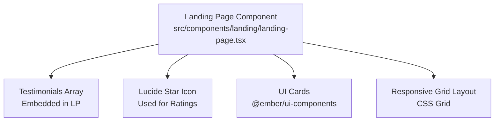
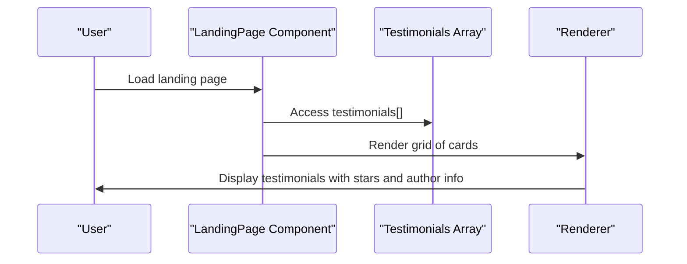
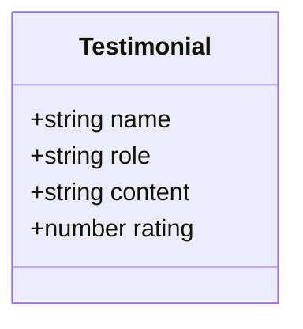
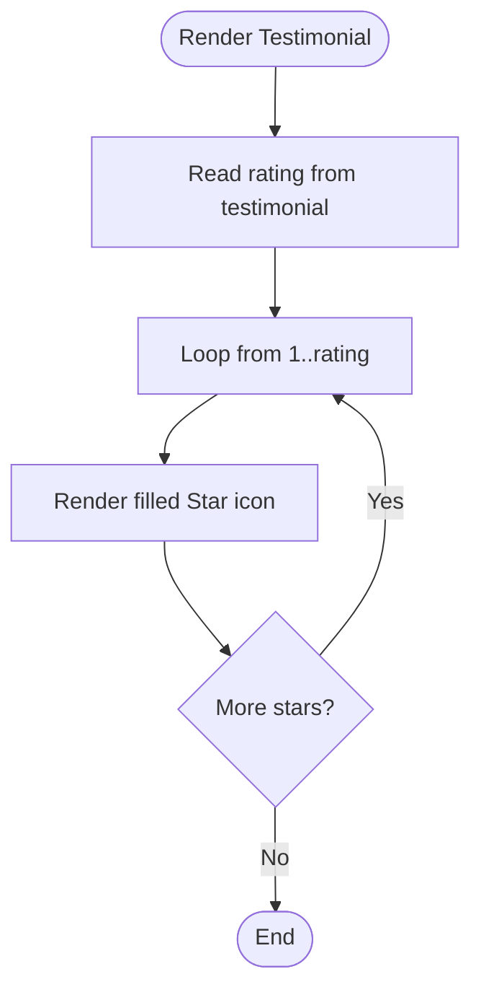
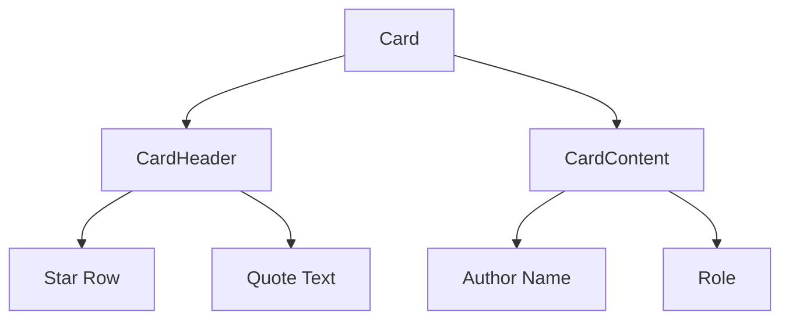
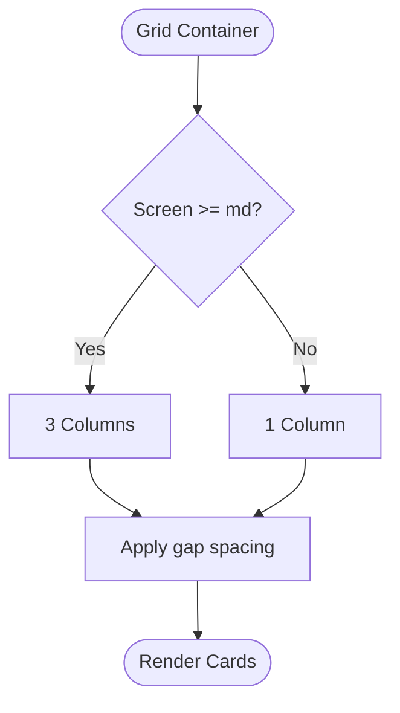
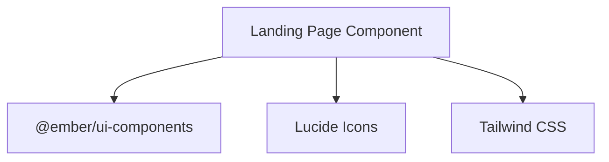

# Testimonials & Social Proof

<cite>
**Referenced Files in This Document**
- [landing-page.tsx](file://src/components/landing/landing-page.tsx)
- [package.json](file://packages/ui-components/package.json)
- [shared-types/package.json](file://packages/shared-types/package.json)
</cite>

## Table of Contents
1. [Introduction](#introduction)
2. [Project Structure](#project-structure)
3. [Core Components](#core-components)
4. [Architecture Overview](#architecture-overview)
5. [Detailed Component Analysis](#detailed-component-analysis)
6. [Dependency Analysis](#dependency-analysis)
7. [Performance Considerations](#performance-considerations)
8. [Troubleshooting Guide](#troubleshooting-guide)
9. [Conclusion](#conclusion)
10. [Appendices](#appendices)

## Introduction
This document explains the testimonials and social proof system used to build trust and credibility on the landing page. It covers the testimonial data model, star rating display, author attribution, card layout, quote formatting, and responsive grid. It also outlines selection criteria, moderation approaches, and automated rotation strategies. Practical examples show how to add testimonials, adjust ratings, and customize layouts. Finally, it addresses integration with user feedback systems, authenticity verification, approval workflows, and performance optimization for large sets of testimonials.

## Project Structure
The testimonials system is implemented in the landing page component and relies on shared UI components and icons. The key elements are:
- Testimonial data array embedded in the landing page component
- Star icons rendered via Lucide React
- Card-based layout using shared UI components
- Responsive grid layout for testimonial cards

**Diagram sources**
- [landing-page.tsx](file://src/components/landing/landing-page.tsx#L106-L125)
- [landing-page.tsx](file://src/components/landing/landing-page.tsx#L363-L384)

**Section sources**
- [landing-page.tsx](file://src/components/landing/landing-page.tsx#L106-L125)
- [landing-page.tsx](file://src/components/landing/landing-page.tsx#L353-L384)

## Core Components
- Testimonial data structure
  - Fields: name, role, content, rating
  - Rating is a numeric value used to render filled stars
- Star rating display
  - Renders a fixed number of filled star icons equal to the testimonial’s rating
- Author attribution
  - Name and role displayed beneath the quote
- Quote formatting
  - Content wrapped in italics and quotation marks
- Testimonial card design
  - Uses Card, CardHeader, CardDescription, and CardContent from shared UI components
- Responsive grid layout
  - Three-column grid on medium screens and above; gaps between cards

Practical example: To add a new testimonial, append an object with the required fields to the testimonials array. To change the rating display, adjust the loop that renders stars based on the rating field.

**Section sources**
- [landing-page.tsx](file://src/components/landing/landing-page.tsx#L106-L125)
- [landing-page.tsx](file://src/components/landing/landing-page.tsx#L363-L384)

## Architecture Overview
The testimonials section is a static rendering block within the landing page. It does not integrate with external APIs or databases in this codebase snapshot. The rendering pipeline is straightforward: the component defines the data, then maps over it to render cards with star ratings and author info.

**Diagram sources**
- [landing-page.tsx](file://src/components/landing/landing-page.tsx#L106-L125)
- [landing-page.tsx](file://src/components/landing/landing-page.tsx#L363-L384)

## Detailed Component Analysis

### Testimonial Data Model
The testimonials array defines each testimonial as an object with:
- name: displayed prominently
- role: author’s professional role or identifier
- content: quoted text
- rating: integer representing star count

**Diagram sources**
- [landing-page.tsx](file://src/components/landing/landing-page.tsx#L106-L125)

**Section sources**
- [landing-page.tsx](file://src/components/landing/landing-page.tsx#L106-L125)

### Star Rating Component Implementation
The star rating is implemented by rendering a fixed number of filled star icons equal to the testimonial’s rating. The icon library used is Lucide React, and the star component is imported and rendered with consistent sizing and color.

**Diagram sources**
- [landing-page.tsx](file://src/components/landing/landing-page.tsx#L367-L371)

**Section sources**
- [landing-page.tsx](file://src/components/landing/landing-page.tsx#L367-L371)

### Testimonial Card Design and Layout
Each testimonial is rendered inside a card with:
- Header containing the star rating row
- Description with the quoted content
- Content area with author name and role
- Responsive grid layout with three columns on medium screens and above

**Diagram sources**
- [landing-page.tsx](file://src/components/landing/landing-page.tsx#L364-L383)

**Section sources**
- [landing-page.tsx](file://src/components/landing/landing-page.tsx#L364-L383)

### Responsive Grid Layout
The testimonials are arranged in a responsive grid:
- Default: single column
- Medium breakpoint and above: three columns
- Gap spacing applied between cards

**Diagram sources**
- [landing-page.tsx](file://src/components/landing/landing-page.tsx#L363)

**Section sources**
- [landing-page.tsx](file://src/components/landing/landing-page.tsx#L363)

### Testimonial Selection Criteria
Selection criteria for testimonials can be defined at authoring time:
- Relevance to target audience (romantasy authors)
- Demonstrated impact or results
- Diversity of roles and experiences
- Quality of content and tone

These criteria guide content creation and help maintain a consistent, credible narrative.

### Content Moderation Approach
Moderation steps for testimonials:
- Pre-submission review for relevance and appropriateness
- Approval workflow requiring at least one reviewer
- Automated checks for prohibited language or spam-like patterns
- Periodic re-evaluation of older testimonials for continued relevance

### Automated Rotation Strategies
Rotation strategies for dynamic presentation:
- Randomized order on initial load
- Time-based rotation with configurable intervals
- Threshold-based rotation after reaching a minimum number of testimonials
- A/B testing variants for different layouts or subsets

Note: The current implementation renders testimonials statically. Rotation would require moving to a client-side state-driven approach and optional server-side updates.

### Practical Examples

- Adding a new testimonial
  - Append a new object to the testimonials array with fields: name, role, content, rating
  - Reference: [Testimonials Array](file://src/components/landing/landing-page.tsx#L106-L125)

- Modifying rating displays
  - Adjust the loop that renders stars based on the rating field
  - Reference: [Star Rendering](file://src/components/landing/landing-page.tsx#L367-L371)

- Customizing testimonial layouts
  - Modify CardHeader/CardContent content or add new fields to the data model
  - Reference: [Card Layout](file://src/components/landing/landing-page.tsx#L364-L383)

- Integrating with user feedback systems
  - Collect testimonials via forms and store in a database
  - Implement moderation and approval workflows before publishing
  - Fetch testimonials dynamically and replace the static array

- Authenticity verification
  - Require verified purchase or usage history
  - Use third-party verification badges or links to public reviews
  - Add disclaimers or timestamps for transparency

- Performance optimization for multiple testimonials
  - Lazy-load testimonials beyond the viewport
  - Virtualize long lists to reduce DOM nodes
  - Cache rendered cards and reuse components efficiently

## Dependency Analysis
The testimonials section depends on:
- Shared UI components for Card and related elements
- Lucide React for the Star icon
- Tailwind CSS for responsive grid and styling

**Diagram sources**
- [landing-page.tsx](file://src/components/landing/landing-page.tsx#L5-L22)
- [package.json](file://packages/ui-components/package.json#L14-L39)

**Section sources**
- [landing-page.tsx](file://src/components/landing/landing-page.tsx#L5-L22)
- [package.json](file://packages/ui-components/package.json#L14-L39)

## Performance Considerations
- Static rendering: The current implementation renders all testimonials at once. For large datasets, consider pagination or virtualization.
- Icon rendering: Star icons are lightweight; keep the number per testimonial minimal.
- CSS grid: Efficient for small to moderate numbers of testimonials; avoid excessive nesting.
- Accessibility: Ensure screen readers announce quotes and author attributions clearly.

## Troubleshooting Guide
- Missing stars
  - Verify the rating value is a positive integer and within the expected range
  - Confirm the star rendering loop executes correctly
  - References: [Star Rendering](file://src/components/landing/landing-page.tsx#L367-L371)

- Incorrect quote formatting
  - Ensure the quote text is properly wrapped and styled
  - References: [Quote Formatting](file://src/components/landing/landing-page.tsx#L372-L374)

- Misaligned grid
  - Check Tailwind grid classes and ensure consistent item heights
  - References: [Grid Layout](file://src/components/landing/landing-page.tsx#L363)

- Broken navigation to testimonials
  - Confirm the anchor link targets the correct section ID
  - References: [Navigation Anchor](file://src/components/landing/landing-page.tsx#L153-L218)

## Conclusion
The testimonials and social proof system is a straightforward, visually effective way to communicate credibility. By maintaining a clear data model, consistent star rendering, and responsive layout, the system scales well. Extending it to support dynamic content, moderation, and rotation will further strengthen trust signals and user engagement.

## Appendices

### Testimonial Data Schema
- name: string
- role: string
- content: string
- rating: number

**Section sources**
- [landing-page.tsx](file://src/components/landing/landing-page.tsx#L106-L125)