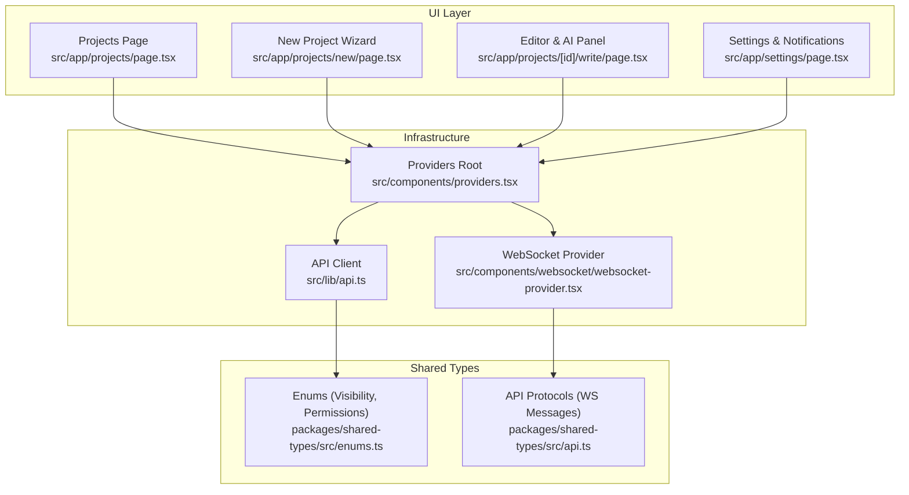
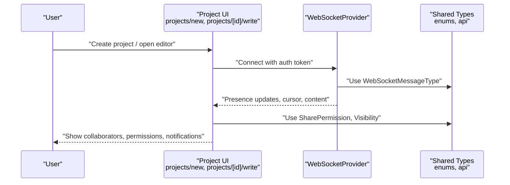
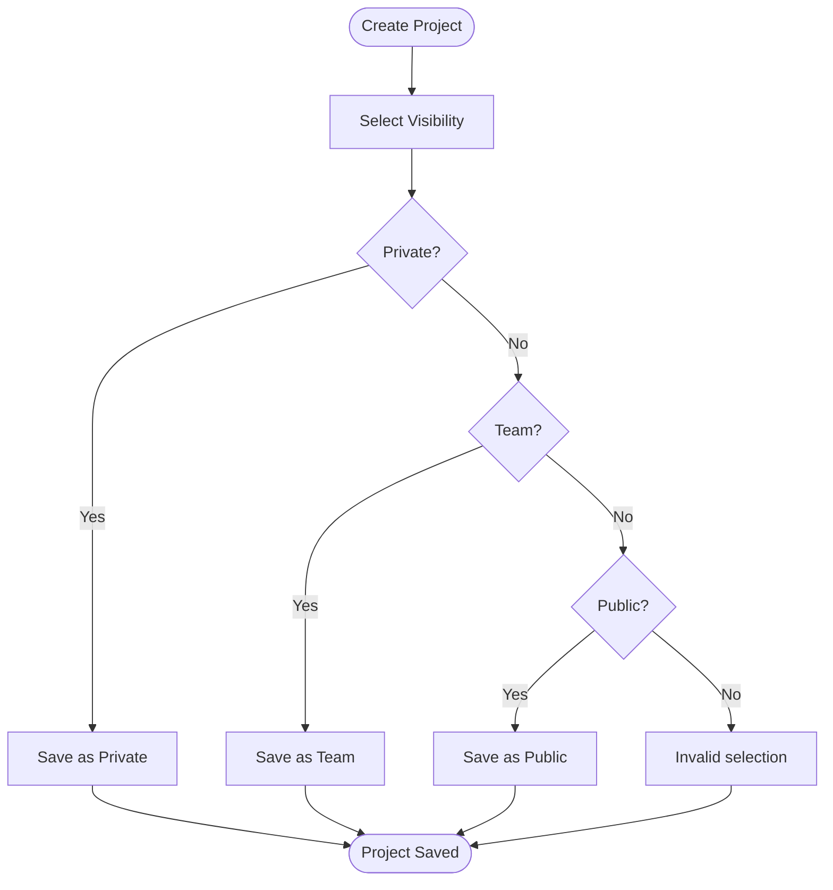
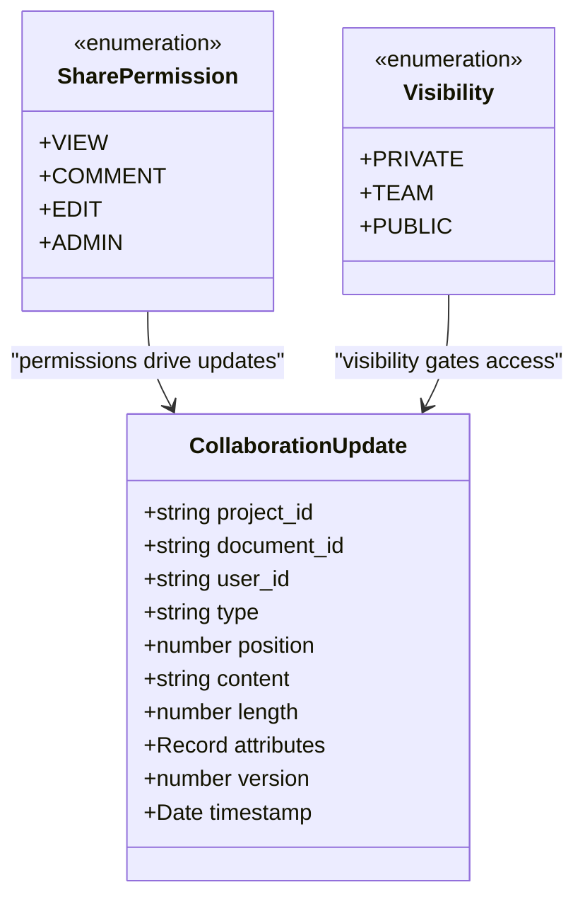
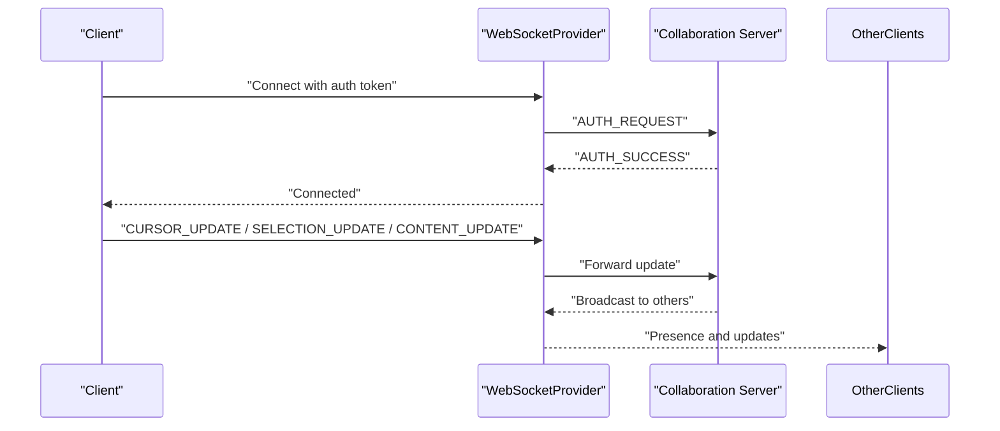
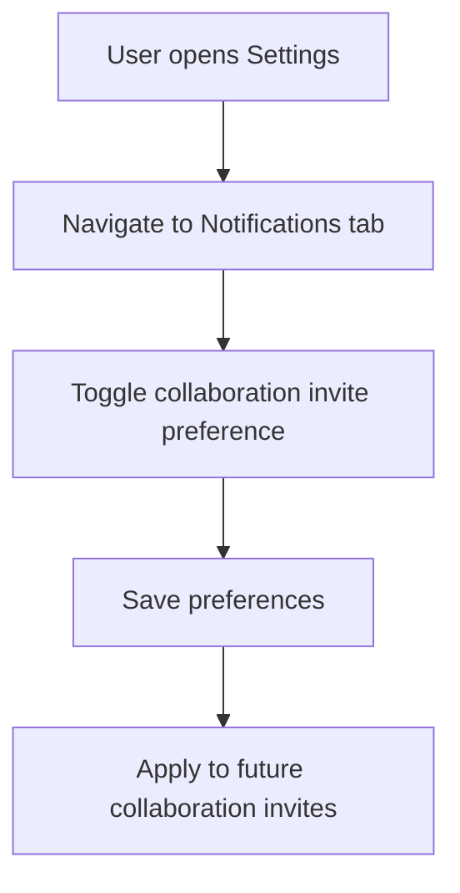
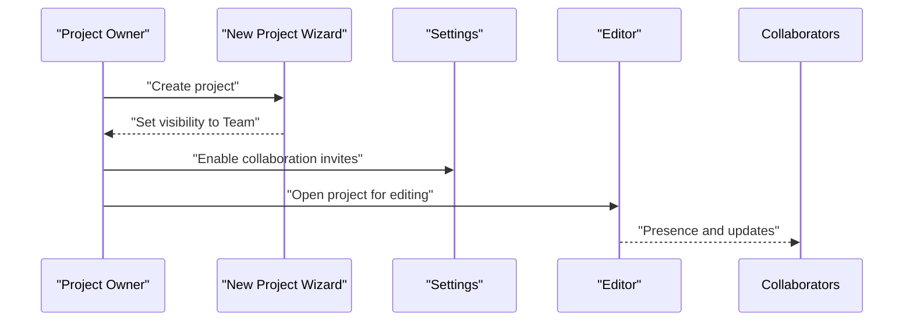
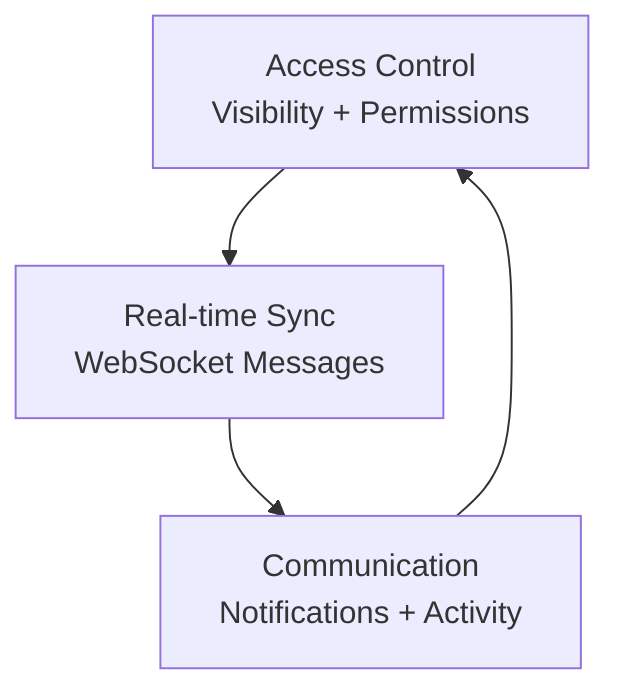
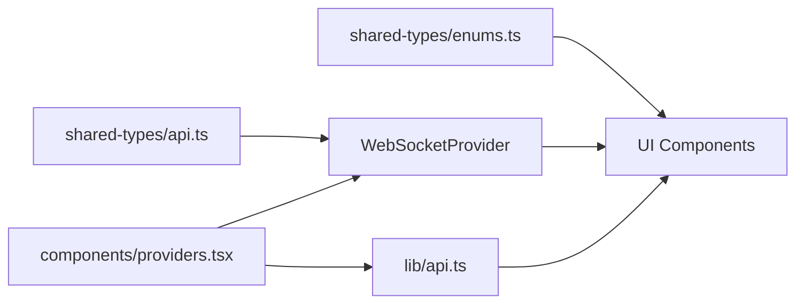

# Collaboration & Sharing Tools

<cite>
**Referenced Files in This Document**
- [README.md](file://README.md)
- [IMPLEMENTATION_PLAN.md](file://IMPLEMENTATION_PLAN.md)
- [src/app/projects/page.tsx](file://src/app/projects/page.tsx)
- [src/app/projects/new/page.tsx](file://src/app/projects/new/page.tsx)
- [src/app/projects/[id]/write/page.tsx](file://src/app/projects/[id]/write/page.tsx)
- [src/app/settings/page.tsx](file://src/app/settings/page.tsx)
- [src/components/websocket/websocket-provider.tsx](file://src/components/websocket/websocket-provider.tsx)
- [src/components/providers.tsx](file://src/components/providers.tsx)
- [src/lib/api.ts](file://src/lib/api.ts)
- [packages/shared-types/src/enums.ts](file://packages/shared-types/src/enums.ts)
- [packages/shared-types/src/api.ts](file://packages/shared-types/src/api.ts)
</cite>

## Table of Contents
1. [Introduction](#introduction)
2. [Project Structure](#project-structure)
3. [Core Components](#core-components)
4. [Architecture Overview](#architecture-overview)
5. [Detailed Component Analysis](#detailed-component-analysis)
6. [Dependency Analysis](#dependency-analysis)
7. [Performance Considerations](#performance-considerations)
8. [Troubleshooting Guide](#troubleshooting-guide)
9. [Conclusion](#conclusion)
10. [Appendices](#appendices)

## Introduction
This document explains the collaboration and sharing features planned for the WorldBest AI-powered writing platform. It covers project sharing settings, collaborator invitation workflows, permission management, real-time collaboration, comments, activity tracking, role-based access control, contributor management, and project ownership transfer. It also includes practical examples for setting up collaborative writing projects, managing team permissions, coordinating with multiple contributors, and integrating notifications and activity feeds.

## Project Structure
The collaboration and sharing features span several areas:
- Project listing and creation with visibility controls
- Real-time collaboration infrastructure (WebSocket provider)
- Notification preferences and system-wide collaboration events
- Shared type definitions for permissions, visibility, and collaboration messages

**Diagram sources**
- [src/app/projects/page.tsx](file://src/app/projects/page.tsx#L48-L126)
- [src/app/projects/new/page.tsx](file://src/app/projects/new/page.tsx#L65-L89)
- [src/app/projects/[id]/write/page.tsx](file://src/app/projects/[id]/write/page.tsx#L100-L135)
- [src/app/settings/page.tsx](file://src/app/settings/page.tsx#L106-L139)
- [src/components/providers.tsx](file://src/components/providers.tsx#L10-L54)
- [src/components/websocket/websocket-provider.tsx](file://src/components/websocket/websocket-provider.tsx#L17-L93)
- [src/lib/api.ts](file://src/lib/api.ts#L1-L67)
- [packages/shared-types/src/enums.ts](file://packages/shared-types/src/enums.ts#L126-L138)
- [packages/shared-types/src/api.ts](file://packages/shared-types/src/api.ts#L77-L121)

**Section sources**
- [README.md](file://README.md#L28-L46)
- [IMPLEMENTATION_PLAN.md](file://IMPLEMENTATION_PLAN.md#L275-L318)
- [src/app/projects/page.tsx](file://src/app/projects/page.tsx#L31-L46)
- [src/app/projects/new/page.tsx](file://src/app/projects/new/page.tsx#L23-L41)
- [src/app/projects/[id]/write/page.tsx](file://src/app/projects/[id]/write/page.tsx#L49-L98)
- [src/app/settings/page.tsx](file://src/app/settings/page.tsx#L60-L69)
- [src/components/websocket/websocket-provider.tsx](file://src/components/websocket/websocket-provider.tsx#L17-L93)
- [src/components/providers.tsx](file://src/components/providers.tsx#L10-L54)
- [src/lib/api.ts](file://src/lib/api.ts#L1-L67)
- [packages/shared-types/src/enums.ts](file://packages/shared-types/src/enums.ts#L126-L138)
- [packages/shared-types/src/api.ts](file://packages/shared-types/src/api.ts#L77-L121)

## Core Components
- Project visibility and sharing settings: Private, Team, Public
- Role-based permissions: View, Comment, Edit, Admin
- Real-time collaboration messaging: Cursor, selection, content, presence updates
- Notification preferences for collaboration invites and updates
- WebSocket provider for real-time presence and collaboration

**Section sources**
- [src/app/projects/new/page.tsx](file://src/app/projects/new/page.tsx#L348-L378)
- [packages/shared-types/src/enums.ts](file://packages/shared-types/src/enums.ts#L133-L138)
- [packages/shared-types/src/api.ts](file://packages/shared-types/src/api.ts#L85-L121)
- [src/app/settings/page.tsx](file://src/app/settings/page.tsx#L130-L139)
- [src/components/websocket/websocket-provider.tsx](file://src/components/websocket/websocket-provider.tsx#L17-L93)

## Architecture Overview
The collaboration architecture integrates UI components with a WebSocket provider and shared type definitions. The WebSocket provider manages connections and emits/receives collaboration messages. The API client handles authentication and token refresh. Shared types define visibility, permissions, and WebSocket message types used across the system.

**Diagram sources**
- [src/app/projects/new/page.tsx](file://src/app/projects/new/page.tsx#L348-L378)
- [src/app/projects/[id]/write/page.tsx](file://src/app/projects/[id]/write/page.tsx#L100-L135)
- [src/components/websocket/websocket-provider.tsx](file://src/components/websocket/websocket-provider.tsx#L17-L93)
- [packages/shared-types/src/enums.ts](file://packages/shared-types/src/enums.ts#L126-L138)
- [packages/shared-types/src/api.ts](file://packages/shared-types/src/api.ts#L85-L121)

## Detailed Component Analysis

### Project Visibility and Sharing Settings
- Visibility levels: Private, Team, Public
- Visibility is configurable during project creation and affects who can view the project
- UI components render visibility options and selection feedback

**Diagram sources**
- [src/app/projects/new/page.tsx](file://src/app/projects/new/page.tsx#L348-L378)

**Section sources**
- [src/app/projects/new/page.tsx](file://src/app/projects/new/page.tsx#L348-L378)

### Role-Based Access Control (RBAC) and Permissions
- Permission levels: View, Comment, Edit, Admin
- These roles govern what collaborators can do within a project
- Shared enums define standardized permission identifiers

**Diagram sources**
- [packages/shared-types/src/enums.ts](file://packages/shared-types/src/enums.ts#L133-L138)
- [packages/shared-types/src/enums.ts](file://packages/shared-types/src/enums.ts#L126-L131)
- [packages/shared-types/src/api.ts](file://packages/shared-types/src/api.ts#L123-L134)

**Section sources**
- [packages/shared-types/src/enums.ts](file://packages/shared-types/src/enums.ts#L133-L138)
- [packages/shared-types/src/enums.ts](file://packages/shared-types/src/enums.ts#L126-L131)
- [packages/shared-types/src/api.ts](file://packages/shared-types/src/api.ts#L123-L134)

### Real-Time Collaboration Infrastructure
- WebSocket provider establishes and maintains connections
- Emits/receives collaboration messages (cursor, selection, content, presence)
- Handles authentication and reconnection logic

**Diagram sources**
- [src/components/websocket/websocket-provider.tsx](file://src/components/websocket/websocket-provider.tsx#L17-L93)
- [packages/shared-types/src/api.ts](file://packages/shared-types/src/api.ts#L85-L121)

**Section sources**
- [src/components/websocket/websocket-provider.tsx](file://src/components/websocket/websocket-provider.tsx#L17-L93)
- [packages/shared-types/src/api.ts](file://packages/shared-types/src/api.ts#L85-L121)

### Notification Preferences and Collaboration Invites
- Users can configure email and in-app notification preferences
- Collaboration invite notifications are supported via notification types
- Notification categories include collaboration-related events

**Diagram sources**
- [src/app/settings/page.tsx](file://src/app/settings/page.tsx#L540-L621)
- [packages/shared-types/src/api.ts](file://packages/shared-types/src/api.ts#L397-L409)

**Section sources**
- [src/app/settings/page.tsx](file://src/app/settings/page.tsx#L130-L139)
- [src/app/settings/page.tsx](file://src/app/settings/page.tsx#L540-L621)
- [packages/shared-types/src/api.ts](file://packages/shared-types/src/api.ts#L397-L409)

### Practical Examples

#### Example: Setting Up a Collaborative Writing Project
- Create a new project and choose Team visibility to enable collaboration
- Invite collaborators by email; assign roles (View, Comment, Edit, Admin)
- Configure notification preferences for collaboration invites
- Open the editor to collaborate in real-time

**Diagram sources**
- [src/app/projects/new/page.tsx](file://src/app/projects/new/page.tsx#L348-L378)
- [src/app/settings/page.tsx](file://src/app/settings/page.tsx#L540-L621)
- [src/app/projects/[id]/write/page.tsx](file://src/app/projects/[id]/write/page.tsx#L100-L135)

**Section sources**
- [src/app/projects/new/page.tsx](file://src/app/projects/new/page.tsx#L348-L378)
- [src/app/settings/page.tsx](file://src/app/settings/page.tsx#L540-L621)
- [src/app/projects/[id]/write/page.tsx](file://src/app/projects/[id]/write/page.tsx#L100-L135)

#### Example: Managing Team Permissions
- Assign roles per collaborator: View (read-only), Comment (add comments), Edit (modify content), Admin (manage collaborators)
- Adjust permissions as needed; visibility determines who can discover the project

**Section sources**
- [packages/shared-types/src/enums.ts](file://packages/shared-types/src/enums.ts#L133-L138)
- [src/app/projects/new/page.tsx](file://src/app/projects/new/page.tsx#L348-L378)

#### Example: Coordinating with Multiple Contributors
- Use real-time presence indicators to see who is online/editing
- Utilize inline comments for targeted feedback
- Monitor activity feed for recent changes and mentions

**Section sources**
- [packages/shared-types/src/api.ts](file://packages/shared-types/src/api.ts#L136-L155)
- [src/app/projects/[id]/write/page.tsx](file://src/app/projects/[id]/write/page.tsx#L29-L46)

### Conceptual Overview
The collaboration system is designed around three pillars:
- Access control: visibility and permissions gate who can see and modify content
- Real-time synchronization: WebSocket messages propagate cursor, selection, and content updates
- Communication: notifications and activity feeds keep collaborators informed

[No sources needed since this diagram shows conceptual workflow, not actual code structure]

[No sources needed since this section doesn't analyze specific source files]

## Dependency Analysis
The collaboration features depend on:
- Shared type definitions for permissions and visibility
- WebSocket provider for real-time updates
- API client for authentication and token refresh
- UI components for project creation, editor, and settings

**Diagram sources**
- [packages/shared-types/src/enums.ts](file://packages/shared-types/src/enums.ts#L126-L138)
- [packages/shared-types/src/api.ts](file://packages/shared-types/src/api.ts#L77-L121)
- [src/components/websocket/websocket-provider.tsx](file://src/components/websocket/websocket-provider.tsx#L17-L93)
- [src/lib/api.ts](file://src/lib/api.ts#L1-L67)
- [src/components/providers.tsx](file://src/components/providers.tsx#L10-L54)

**Section sources**
- [packages/shared-types/src/enums.ts](file://packages/shared-types/src/enums.ts#L126-L138)
- [packages/shared-types/src/api.ts](file://packages/shared-types/src/api.ts#L77-L121)
- [src/components/websocket/websocket-provider.tsx](file://src/components/websocket/websocket-provider.tsx#L17-L93)
- [src/lib/api.ts](file://src/lib/api.ts#L1-L67)
- [src/components/providers.tsx](file://src/components/providers.tsx#L10-L54)

## Performance Considerations
- Minimize real-time message volume by batching cursor and presence updates
- Use efficient WebSocket message types and avoid unnecessary broadcasts
- Implement client-side debouncing for frequent updates (e.g., cursor movement)
- Ensure server-side rate limiting to prevent abuse

[No sources needed since this section provides general guidance]

## Troubleshooting Guide
Common issues and resolutions:
- WebSocket authentication failures: Verify auth token cookie and refresh logic
- Reconnection loops: Check exponential backoff and max attempts
- Missing collaboration updates: Confirm subscription to project/document rooms
- Permission denied errors: Validate SharePermission against project visibility

**Section sources**
- [src/components/websocket/websocket-provider.tsx](file://src/components/websocket/websocket-provider.tsx#L77-L86)
- [src/lib/api.ts](file://src/lib/api.ts#L24-L65)

## Conclusion
The WorldBest platform is structured to support robust collaboration through visibility controls, RBAC, real-time synchronization, and integrated notifications. The shared type definitions and WebSocket provider lay the foundation for scalable, real-time collaboration. As features are implemented, teams can confidently coordinate on writing projects with clear permissions, presence awareness, and communication channels.

[No sources needed since this section summarizes without analyzing specific files]

## Appendices

### Appendix A: Implementation Roadmap References
- Real-time collaboration tasks and acceptance criteria
- Notification preferences and categories
- WebSocket message types for collaboration

**Section sources**
- [IMPLEMENTATION_PLAN.md](file://IMPLEMENTATION_PLAN.md#L275-L318)
- [src/app/settings/page.tsx](file://src/app/settings/page.tsx#L540-L621)
- [packages/shared-types/src/api.ts](file://packages/shared-types/src/api.ts#L85-L121)