# Content Management & Organization

<cite>
**Referenced Files in This Document**
- [src/app/projects/page.tsx](file://src/app/projects/page.tsx)
- [src/app/projects/new/page.tsx](file://src/app/projects/new/page.tsx)
- [src/app/projects/[id]/write/page.tsx](file://src/app/projects/[id]/write/page.tsx)
- [src/lib/api.ts](file://src/lib/api.ts)
- [packages/shared-types/src/entities.ts](file://packages/shared-types/src/entities.ts)
- [packages/shared-types/src/api.ts](file://packages/shared-types/src/api.ts)
- [README.md](file://README.md)
- [IMPLEMENTATION_PLAN.md](file://IMPLEMENTATION_PLAN.md)
- [QUICK_START_CHECKLIST.md](file://QUICK_START_CHECKLIST.md)
</cite>

## Table of Contents
1. [Introduction](#introduction)
2. [Project Structure](#project-structure)
3. [Core Components](#core-components)
4. [Architecture Overview](#architecture-overview)
5. [Detailed Component Analysis](#detailed-component-analysis)
6. [Dependency Analysis](#dependency-analysis)
7. [Performance Considerations](#performance-considerations)
8. [Troubleshooting Guide](#troubleshooting-guide)
9. [Conclusion](#conclusion)

## Introduction
This document explains content management and organization features for the WorldBest AI-powered writing platform. It covers how to add, edit, delete, and organize content across project levels, integrates a rich text editor with formatting controls, outlines version control and history features, and details content organization strategies, linking mechanisms, search and categorization, and backup/restore and migration capabilities. The content is grounded in the current implementation state and the planned feature roadmap.

## Project Structure
The content management system spans several Next.js app router pages and shared type definitions:
- Project listing and filtering: `/src/app/projects/page.tsx`
- New project wizard: `/src/app/projects/new/page.tsx`
- Rich text editor and content organization: `/src/app/projects/[id]/write/page.tsx`
- API client for authentication and token refresh: `/src/lib/api.ts`
- Shared entity and API type definitions: `/packages/shared-types/src/entities.ts`, `/packages/shared-types/src/api.ts`
- Project overview and roadmap: `README.md`, `IMPLEMENTATION_PLAN.md`, `QUICK_START_CHECKLIST.md`

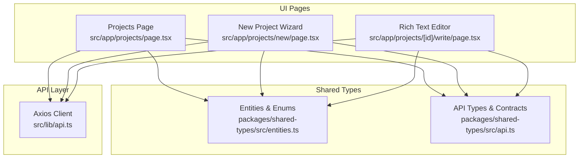

**Diagram sources**
- [src/app/projects/page.tsx](file://src/app/projects/page.tsx#L1-L394)
- [src/app/projects/new/page.tsx](file://src/app/projects/new/page.tsx#L1-L555)
- [src/app/projects/[id]/write/page.tsx](file://src/app/projects/[id]/write/page.tsx#L1-L626)
- [src/lib/api.ts](file://src/lib/api.ts#L1-L67)
- [packages/shared-types/src/entities.ts](file://packages/shared-types/src/entities.ts#L1-L458)
- [packages/shared-types/src/api.ts](file://packages/shared-types/src/api.ts#L1-L409)

**Section sources**
- [src/app/projects/page.tsx](file://src/app/projects/page.tsx#L1-L394)
- [src/app/projects/new/page.tsx](file://src/app/projects/new/page.tsx#L1-L555)
- [src/app/projects/[id]/write/page.tsx](file://src/app/projects/[id]/write/page.tsx#L1-L626)
- [src/lib/api.ts](file://src/lib/api.ts#L1-L67)
- [packages/shared-types/src/entities.ts](file://packages/shared-types/src/entities.ts#L1-L458)
- [packages/shared-types/src/api.ts](file://packages/shared-types/src/api.ts#L1-L409)
- [README.md](file://README.md#L1-L426)

## Core Components
- Project management UI: Lists, filters, and sorts projects; toggles favorites; opens project details.
- New project wizard: Multi-step form collecting project metadata, genre/subgenre, goals, and AI preferences.
- Rich text editor: Content-editable area with toolbar, auto-save, word counting, AI assistant panel, and version history toggle.
- Shared entities: Defines hierarchical content model (Project → Books → Chapters → Scenes) and versioning metadata.
- API client: Centralized Axios client with auth token injection and automatic refresh logic.

Key capabilities:
- Add/edit/delete projects and their metadata.
- Organize content via Books → Chapters → Scenes hierarchy.
- Rich text formatting (headings, lists, alignment, bold/italic/underline).
- Version control and history tracking per scene.
- AI-assisted writing with three personas (Muse, Editor, Coach).
- Export/import system (planned) and backup/restore (planned).

**Section sources**
- [src/app/projects/page.tsx](file://src/app/projects/page.tsx#L31-L126)
- [src/app/projects/new/page.tsx](file://src/app/projects/new/page.tsx#L23-L89)
- [src/app/projects/[id]/write/page.tsx](file://src/app/projects/[id]/write/page.tsx#L49-L135)
- [packages/shared-types/src/entities.ts](file://packages/shared-types/src/entities.ts#L9-L76)
- [src/lib/api.ts](file://src/lib/api.ts#L11-L65)

## Architecture Overview
The content management architecture combines UI pages, shared type definitions, and an API client. The editor integrates with a WebSocket-based collaboration layer (planned) and supports AI generation (planned). Export/import and backup/restore are defined in shared types and implementation plans.

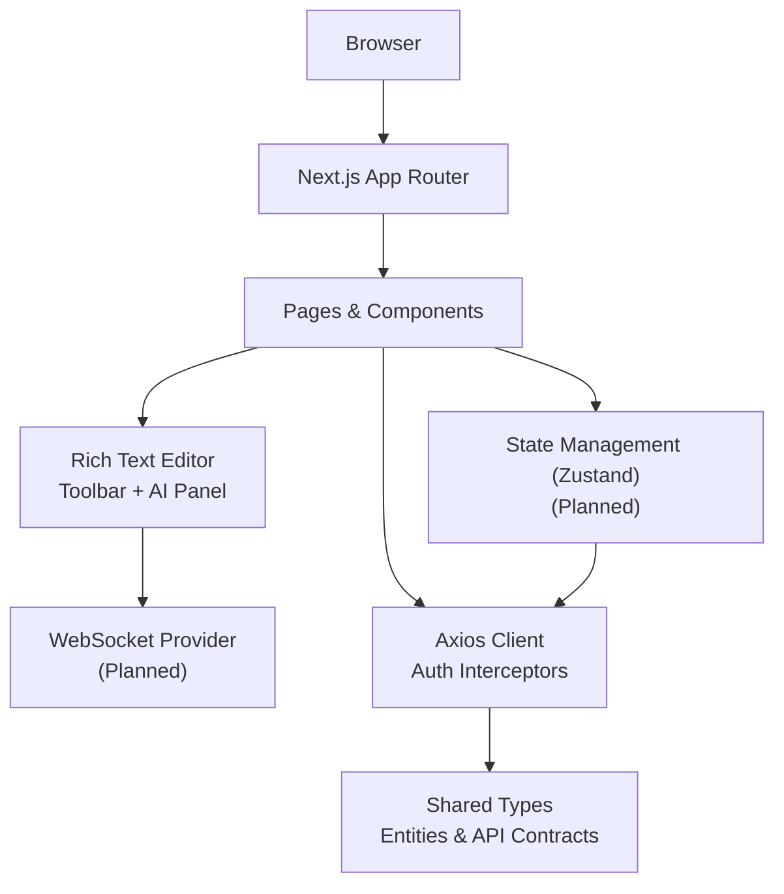

**Diagram sources**
- [src/app/projects/[id]/write/page.tsx](file://src/app/projects/[id]/write/page.tsx#L187-L349)
- [src/lib/api.ts](file://src/lib/api.ts#L1-L67)
- [packages/shared-types/src/api.ts](file://packages/shared-types/src/api.ts#L77-L121)
- [IMPLEMENTATION_PLAN.md](file://IMPLEMENTATION_PLAN.md#L275-L314)

**Section sources**
- [src/app/projects/[id]/write/page.tsx](file://src/app/projects/[id]/write/page.tsx#L187-L349)
- [src/lib/api.ts](file://src/lib/api.ts#L1-L67)
- [packages/shared-types/src/api.ts](file://packages/shared-types/src/api.ts#L77-L121)
- [IMPLEMENTATION_PLAN.md](file://IMPLEMENTATION_PLAN.md#L275-L314)

## Detailed Component Analysis

### Project Management UI
- Displays projects with genre, status, collaborators, progress, and star/favorite toggle.
- Provides search, filter by genre/status, sorting, and view mode (grid/list).
- Opens project detail or creates a new project.

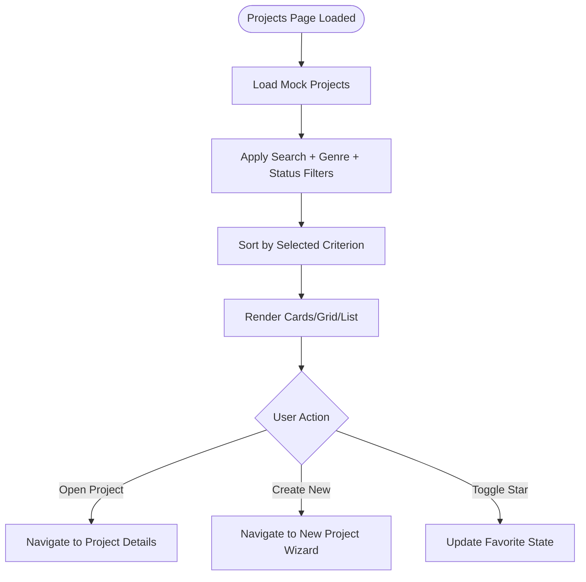

**Diagram sources**
- [src/app/projects/page.tsx](file://src/app/projects/page.tsx#L59-L153)

**Section sources**
- [src/app/projects/page.tsx](file://src/app/projects/page.tsx#L48-L394)

### New Project Wizard
- Multi-step form collecting:
  - Basic info: title, synopsis, optional time period.
  - Genre and subgenres selection.
  - Goals: target word count, audience, rating, visibility.
  - AI preferences: models, creativity/precision sliders, token limits.
- Progress indicator and navigation controls.

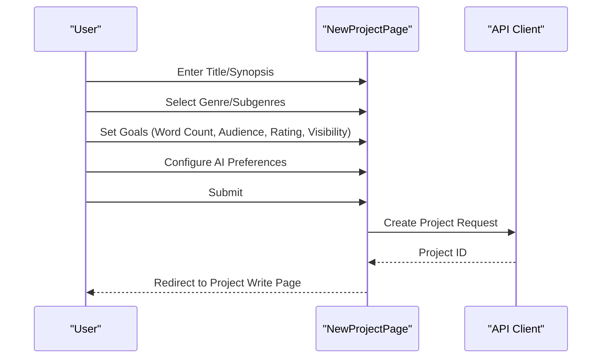

**Diagram sources**
- [src/app/projects/new/page.tsx](file://src/app/projects/new/page.tsx#L108-L114)
- [src/lib/api.ts](file://src/lib/api.ts#L1-L67)

**Section sources**
- [src/app/projects/new/page.tsx](file://src/app/projects/new/page.tsx#L65-L555)

### Rich Text Editor and Content Organization
- Hierarchical content model:
  - Project → Book → Chapter → Scene
  - Scene includes title, content (HTML), word count, last saved, and version number.
- Editor features:
  - Toolbar with undo/redo, headings, bold/italic/underline, lists, blockquote, alignment.
  - Auto-save with configurable interval.
  - Word count and quick stats (paragraphs, characters, reading time).
  - AI assistant panel with three personas (Muse, Editor, Coach).
  - Version history toggle and sidebar navigation for chapters/scenes.

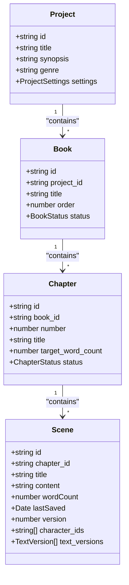

**Diagram sources**
- [packages/shared-types/src/entities.ts](file://packages/shared-types/src/entities.ts#L9-L76)

**Section sources**
- [src/app/projects/[id]/write/page.tsx](file://src/app/projects/[id]/write/page.tsx#L49-L135)
- [packages/shared-types/src/entities.ts](file://packages/shared-types/src/entities.ts#L43-L76)

### Rich Text Editor Toolbar and Formatting
- Formatting commands executed via document.execCommand for headings, emphasis, lists, blockquote, and alignment.
- Selection tracking enables AI suggestions based on selected text.
- Save and auto-save controls; version display in toolbar.

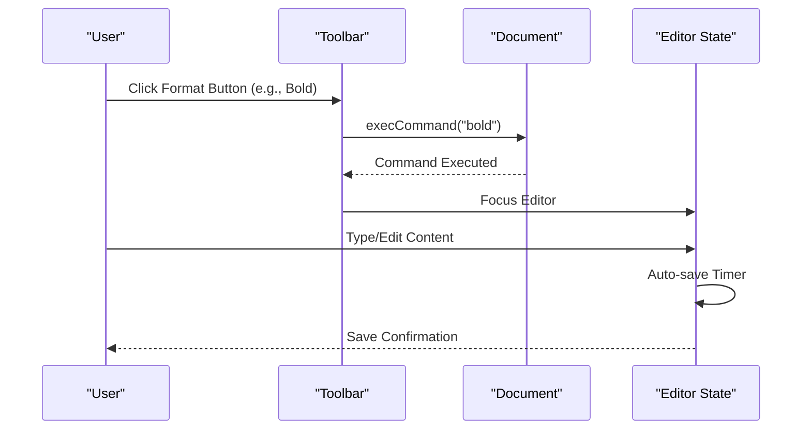

**Diagram sources**
- [src/app/projects/[id]/write/page.tsx](file://src/app/projects/[id]/write/page.tsx#L168-L180)
- [src/app/projects/[id]/write/page.tsx](file://src/app/projects/[id]/write/page.tsx#L139-L166)

**Section sources**
- [src/app/projects/[id]/write/page.tsx](file://src/app/projects/[id]/write/page.tsx#L187-L349)

### Version Control and History
- Scenes track version numbers and last saved timestamps.
- Version history panel toggle allows reviewing revisions.
- TextVersion entries capture author, content, summary, parent_id, semantic hash, word count, and AI metadata.

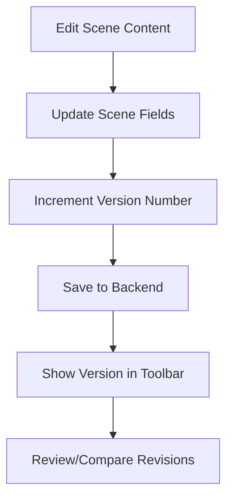

**Diagram sources**
- [src/app/projects/[id]/write/page.tsx](file://src/app/projects/[id]/write/page.tsx#L56-L57)
- [packages/shared-types/src/entities.ts](file://packages/shared-types/src/entities.ts#L322-L335)

**Section sources**
- [src/app/projects/[id]/write/page.tsx](file://src/app/projects/[id]/write/page.tsx#L111-L112)
- [packages/shared-types/src/entities.ts](file://packages/shared-types/src/entities.ts#L322-L335)

### AI-Assisted Writing and Personas
- Three personas: Muse (inspiration), Editor (grammar/style), Coach (structure/pacing).
- AI panel allows selecting persona, generating suggestions, and custom prompts.
- Integration points for streaming generation and token tracking are defined in shared types and implementation plan.

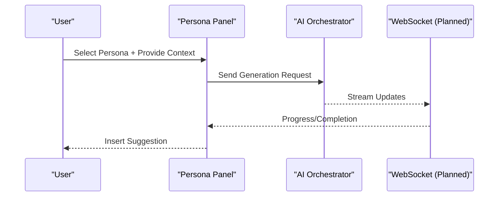

**Diagram sources**
- [src/app/projects/[id]/write/page.tsx](file://src/app/projects/[id]/write/page.tsx#L76-L98)
- [packages/shared-types/src/api.ts](file://packages/shared-types/src/api.ts#L112-L121)
- [IMPLEMENTATION_PLAN.md](file://IMPLEMENTATION_PLAN.md#L233-L272)

**Section sources**
- [src/app/projects/[id]/write/page.tsx](file://src/app/projects/[id]/write/page.tsx#L76-L98)
- [packages/shared-types/src/api.ts](file://packages/shared-types/src/api.ts#L112-L121)
- [IMPLEMENTATION_PLAN.md](file://IMPLEMENTATION_PLAN.md#L233-L272)

### Content Organization Strategies and Folder Structures
- Hierarchical organization: Project → Book → Chapter → Scene.
- Practical examples:
  - Scenes: individual writing units with titles and content.
  - Chapters: collections of scenes with target word counts.
  - Books: logical groupings of chapters (e.g., volumes).
- Navigation sidebar displays chapters and current scene editing controls.

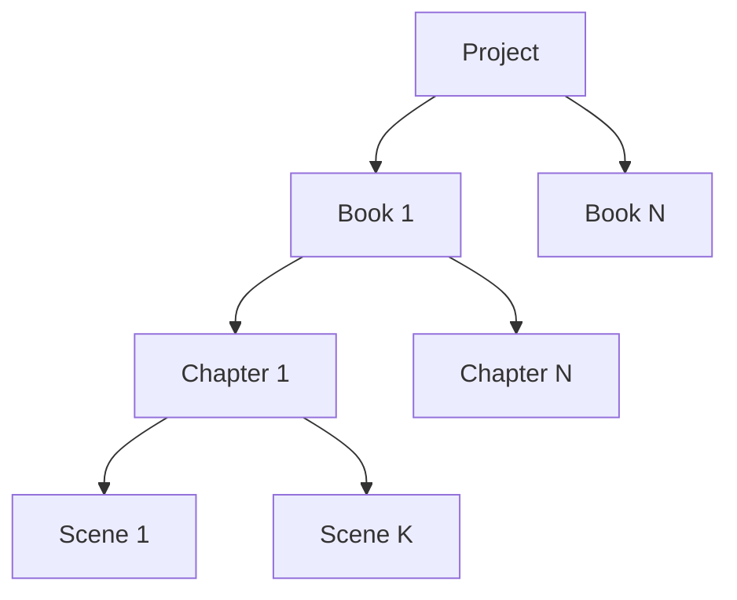

**Diagram sources**
- [packages/shared-types/src/entities.ts](file://packages/shared-types/src/entities.ts#L43-L61)

**Section sources**
- [packages/shared-types/src/entities.ts](file://packages/shared-types/src/entities.ts#L43-L61)
- [src/app/projects/[id]/write/page.tsx](file://src/app/projects/[id]/write/page.tsx#L395-L491)

### Content Linking Mechanisms
- Placeholder system supports mapping to characters, locations, cultures, and events for dynamic linking and redaction.
- TextVersion includes semantic hash and optional AI generation metadata for traceability.

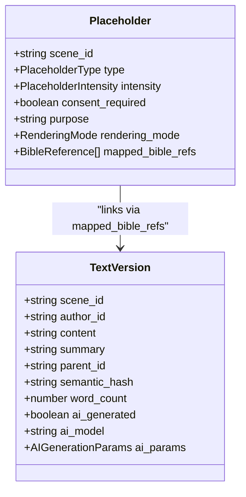

**Diagram sources**
- [packages/shared-types/src/entities.ts](file://packages/shared-types/src/entities.ts#L304-L344)

**Section sources**
- [packages/shared-types/src/entities.ts](file://packages/shared-types/src/entities.ts#L304-L344)

### Content Search, Tagging, and Categorization
- Project listing supports search by title/synopsis and filter by genre/status.
- Timeline events include tags for categorization.
- Filtering and sorting are implemented in the projects page.

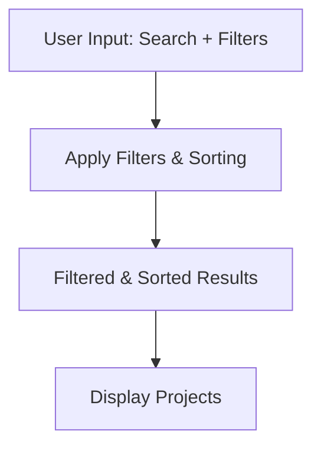

**Diagram sources**
- [src/app/projects/page.tsx](file://src/app/projects/page.tsx#L131-L153)
- [packages/shared-types/src/entities.ts](file://packages/shared-types/src/entities.ts#L285-L294)

**Section sources**
- [src/app/projects/page.tsx](file://src/app/projects/page.tsx#L131-L153)
- [packages/shared-types/src/entities.ts](file://packages/shared-types/src/entities.ts#L285-L294)

### Backup, Restore, and Migration
- Export system: JSON, EPUB, PDF, DOCX, Markdown, HTML, LaTeX, Scrivener, Final Draft with options for metadata, comments, revision history, placeholders, and style profiles.
- Import system: Supports JSON, DOCX, Markdown, Scrivener, Final Draft, Plain Text with merge strategies and auto-detection options.
- Job tracking for import/export with status, progress, and statistics.

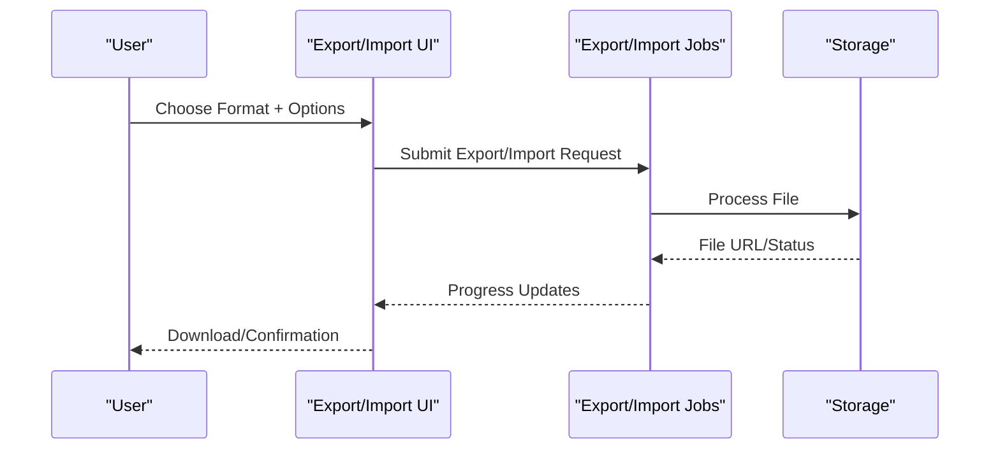

**Diagram sources**
- [packages/shared-types/src/api.ts](file://packages/shared-types/src/api.ts#L157-L233)
- [packages/shared-types/src/api.ts](file://packages/shared-types/src/api.ts#L244-L285)
- [IMPLEMENTATION_PLAN.md](file://IMPLEMENTATION_PLAN.md#L756-L792)

**Section sources**
- [packages/shared-types/src/api.ts](file://packages/shared-types/src/api.ts#L157-L233)
- [packages/shared-types/src/api.ts](file://packages/shared-types/src/api.ts#L244-L285)
- [IMPLEMENTATION_PLAN.md](file://IMPLEMENTATION_PLAN.md#L756-L792)

## Dependency Analysis
- UI pages depend on shared types for strong typing of entities and API contracts.
- The API client centralizes authentication and token refresh logic.
- The editor depends on the content model and integrates with collaboration and AI systems (planned).

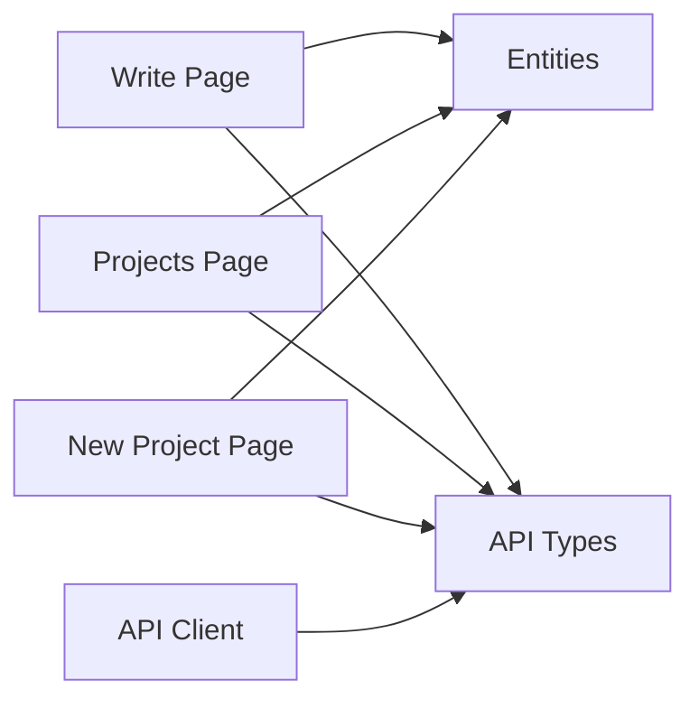

**Diagram sources**
- [src/app/projects/[id]/write/page.tsx](file://src/app/projects/[id]/write/page.tsx#L1-L47)
- [src/app/projects/page.tsx](file://src/app/projects/page.tsx#L1-L29)
- [src/app/projects/new/page.tsx](file://src/app/projects/new/page.tsx#L1-L21)
- [src/lib/api.ts](file://src/lib/api.ts#L1-L67)
- [packages/shared-types/src/entities.ts](file://packages/shared-types/src/entities.ts#L1-L458)
- [packages/shared-types/src/api.ts](file://packages/shared-types/src/api.ts#L1-L409)

**Section sources**
- [src/app/projects/[id]/write/page.tsx](file://src/app/projects/[id]/write/page.tsx#L1-L47)
- [src/app/projects/page.tsx](file://src/app/projects/page.tsx#L1-L29)
- [src/app/projects/new/page.tsx](file://src/app/projects/new/page.tsx#L1-L21)
- [src/lib/api.ts](file://src/lib/api.ts#L1-L67)
- [packages/shared-types/src/entities.ts](file://packages/shared-types/src/entities.ts#L1-L458)
- [packages/shared-types/src/api.ts](file://packages/shared-types/src/api.ts#L1-L409)

## Performance Considerations
- Auto-save intervals and debounced calculations reduce unnecessary saves and computations.
- Word count computed by stripping HTML and splitting text; optimize for very large documents by batching updates.
- Future performance enhancements include code splitting, bundle optimization, image optimization, and performance monitoring.

[No sources needed since this section provides general guidance]

## Troubleshooting Guide
- Authentication token refresh: The API client handles 401 responses by refreshing tokens and retrying requests.
- Error boundaries and logging: Global error handling and error logging service are part of the planned infrastructure.
- Collaboration and WebSocket stability: Presence indicators, cursor presence, and collaborative editing are defined in the implementation plan.

**Section sources**
- [src/lib/api.ts](file://src/lib/api.ts#L24-L65)
- [IMPLEMENTATION_PLAN.md](file://IMPLEMENTATION_PLAN.md#L153-L186)
- [IMPLEMENTATION_PLAN.md](file://IMPLEMENTATION_PLAN.md#L275-L314)

## Conclusion
The WorldBest platform provides a robust foundation for content management and organization, with a rich text editor, hierarchical content model, and strong typing via shared entities and API contracts. While many advanced features (collaboration, AI generation, export/import, and monitoring) are planned, the current UI pages demonstrate clear pathways for adding, editing, organizing, and versioning content. The shared type definitions and implementation plan outline the direction for backup/restore, migration, and production readiness.