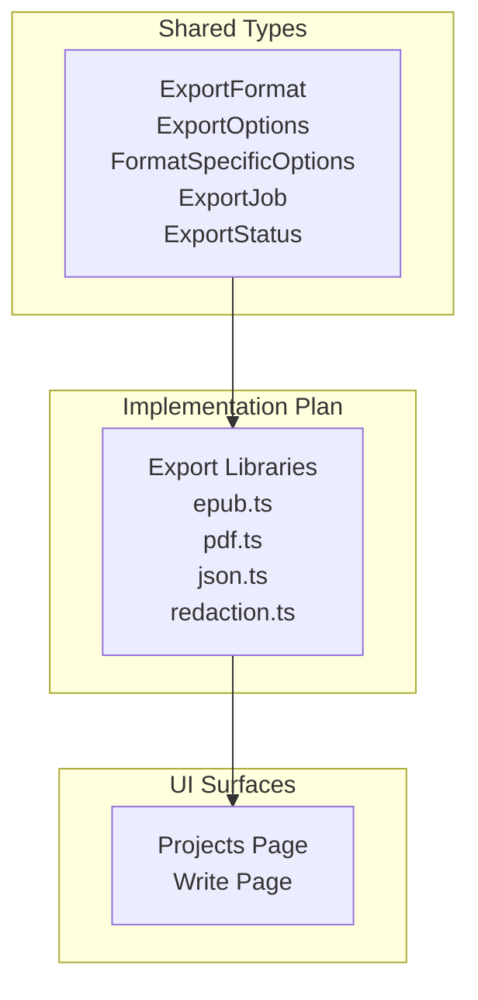
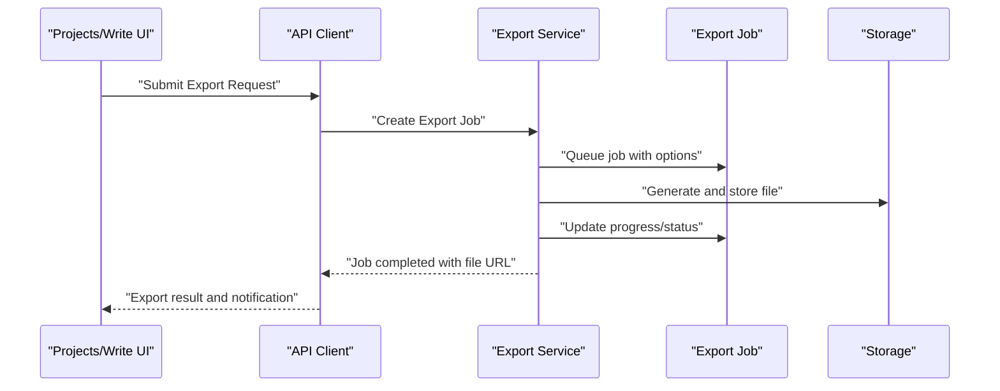
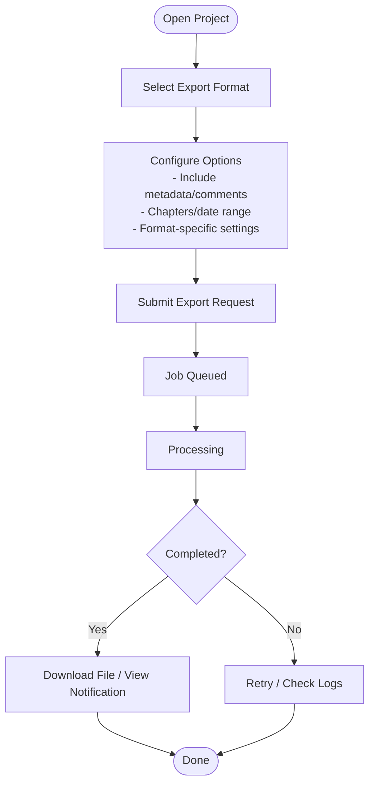
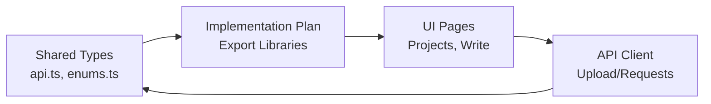

# Export & File Management

<cite>
**Referenced Files in This Document**
- [api.ts](file://packages/shared-types/src/api.ts)
- [enums.ts](file://packages/shared-types/src/enums.ts)
- [IMPLEMENTATION_PLAN.md](file://IMPLEMENTATION_PLAN.md)
- [client.ts](file://src/lib/api/client.ts)
- [page.tsx](file://src/app/projects/[id]/write/page.tsx)
- [page.tsx](file://src/app/projects/page.tsx)
</cite>

## Table of Contents
1. [Introduction](#introduction)
2. [Project Structure](#project-structure)
3. [Core Components](#core-components)
4. [Architecture Overview](#architecture-overview)
5. [Detailed Component Analysis](#detailed-component-analysis)
6. [Dependency Analysis](#dependency-analysis)
7. [Performance Considerations](#performance-considerations)
8. [Troubleshooting Guide](#troubleshooting-guide)
9. [Conclusion](#conclusion)

## Introduction
This document describes the export and file management capabilities planned for the project management system. It focuses on supported export formats (ePub, PDF, HTML, and plain text), batch and selective export options, format customization, file attachment management, media asset handling, external file integration, scheduling and automation, and quality assurance features. The content synthesizes the current shared type definitions, implementation roadmap, and UI scaffolding to present a comprehensive guide for building and using these capabilities.

## Project Structure
The export and file management system spans shared type definitions, a planned export library, and UI surfaces for project management and writing. The key areas are:
- Shared types define export formats, options, jobs, and notification types.
- The implementation plan outlines export libraries and tasks.
- UI pages provide project navigation and writing surfaces where export actions would integrate.

**Diagram sources**
- [api.ts](file://packages/shared-types/src/api.ts#L163-L242)
- [IMPLEMENTATION_PLAN.md](file://IMPLEMENTATION_PLAN.md#L756-L796)
- [page.tsx](file://src/app/projects/page.tsx#L48-L126)
- [page.tsx](file://src/app/projects/[id]/write/page.tsx#L100-L166)

**Section sources**
- [api.ts](file://packages/shared-types/src/api.ts#L163-L242)
- [IMPLEMENTATION_PLAN.md](file://IMPLEMENTATION_PLAN.md#L756-L796)
- [page.tsx](file://src/app/projects/page.tsx#L48-L126)
- [page.tsx](file://src/app/projects/[id]/write/page.tsx#L100-L166)

## Core Components
This section outlines the core elements that enable export and file management:

- Export formats and options
  - Formats include JSON, EPUB, PDF, DOCX, MARKDOWN, HTML, LATEX, SCRIVENER, FINAL_DRAFT.
  - Options support selective inclusion of metadata, comments, revision history, character sheets, and world bible entries.
  - Placeholder application and modes (full, redacted, summary) enable controlled content exposure.
  - Style profile selection and format-specific options (page size, margins, fonts for PDF; cover image, TOC depth, chapter break for EPUB; title page, TOC, headers/footers for common formats).

- Export job lifecycle
  - Jobs track status (queued, processing, completed, failed, canceled, expired), progress, file URL and size, timestamps, and optional metadata.
  - Notifications include export completion events.

- File types and media formats
  - File categories include images, documents, audio, video, archives, and other.
  - Document formats include PDF, DOCX, ODT, RTF, TXT, MD.
  - Audio formats include MP3, WAV, OGG, M4A, FLAC.
  - Image formats include JPEG, PNG, WEBP, GIF, SVG.

- Upload and progress tracking
  - The API client supports multipart uploads with progress callbacks suitable for attaching files and assets.

- UI integration points
  - The projects page lists projects and provides navigation to write/edit pages.
  - The write page hosts the editor and would surface export actions.

**Section sources**
- [api.ts](file://packages/shared-types/src/api.ts#L163-L242)
- [api.ts](file://packages/shared-types/src/api.ts#L397-L409)
- [enums.ts](file://packages/shared-types/src/enums.ts#L43-L73)
- [client.ts](file://src/lib/api/client.ts#L103-L123)
- [page.tsx](file://src/app/projects/page.tsx#L48-L126)
- [page.tsx](file://src/app/projects/[id]/write/page.tsx#L100-L166)

## Architecture Overview
The export system follows a request-driven model:
- Clients submit export requests with project identifiers, desired format, and options.
- The backend queues and processes export jobs, updating progress and status.
- On completion, clients receive a file URL and metadata.
- Notifications inform users of export completion.

**Diagram sources**
- [api.ts](file://packages/shared-types/src/api.ts#L157-L161)
- [api.ts](file://packages/shared-types/src/api.ts#L218-L233)
- [api.ts](file://packages/shared-types/src/api.ts#L235-L242)
- [api.ts](file://packages/shared-types/src/api.ts#L397-L409)

## Detailed Component Analysis

### Export Formats and Options
Supported formats and customization options are defined centrally:
- Formats: JSON, EPUB, PDF, DOCX, MARKDOWN, HTML, LATEX, SCRIVENER, FINAL_DRAFT.
- Options:
  - Selective inclusion: metadata, comments, revision history, character sheets, world bible.
  - Placeholders: enable replacement and choose mode (full, redacted, summary).
  - Style profiles and format-specific options (PDF page size/margins/fonts; EPUB cover/TOC/chapter break; common title page/TOC/page numbers/headers/footers).
  - Scope: chapters and date range filters.

Practical implications:
- Batch export: specify multiple chapters or a date range to limit scope.
- Selective export: disable inclusion of comments or world bible for privacy or size reduction.
- Format customization: adjust PDF typography and EPUB structure to match publishing workflows.

**Section sources**
- [api.ts](file://packages/shared-types/src/api.ts#L163-L173)
- [api.ts](file://packages/shared-types/src/api.ts#L175-L190)
- [api.ts](file://packages/shared-types/src/api.ts#L192-L216)

### Export Job Lifecycle
Jobs encapsulate the asynchronous export process:
- Fields: identifiers, format, status, progress, file URL/size, timestamps, expiration, and metadata.
- Status transitions: queued → processing → completed/failed/canceled/expired.
- Notifications: export completion event type enables user alerts.

Quality assurance:
- Progress reporting allows users to monitor long-running exports.
- Expiration prevents indefinite storage of generated artifacts.
- Error and metadata fields aid diagnostics.

**Section sources**
- [api.ts](file://packages/shared-types/src/api.ts#L218-L233)
- [api.ts](file://packages/shared-types/src/api.ts#L235-L242)
- [api.ts](file://packages/shared-types/src/api.ts#L397-L409)

### File Attachment Management and Media Assets
File handling is supported via:
- File type categories (images, documents, audio, video, archives, other).
- Document and audio format enumerations.
- Upload API with progress tracking for attaching assets and submitting files.

Integration points:
- Attachments can be included in exports (e.g., cover images for EPUB).
- Media assets can be uploaded and referenced within project content.

**Section sources**
- [enums.ts](file://packages/shared-types/src/enums.ts#L43-L73)
- [client.ts](file://src/lib/api/client.ts#L103-L123)

### UI Integration and Workflows
The UI provides:
- Project listing and filtering, enabling selection of projects for export.
- Writing interface where export actions would be surfaced.

Example workflows:
- Export a completed project as PDF for print submission.
- Prepare a manuscript as EPUB for distribution platforms.
- Archive project content as JSON for backup or migration.

**Diagram sources**
- [api.ts](file://packages/shared-types/src/api.ts#L157-L161)
- [api.ts](file://packages/shared-types/src/api.ts#L175-L190)
- [api.ts](file://packages/shared-types/src/api.ts#L218-L233)
- [page.tsx](file://src/app/projects/page.tsx#L48-L126)
- [page.tsx](file://src/app/projects/[id]/write/page.tsx#L100-L166)

**Section sources**
- [page.tsx](file://src/app/projects/page.tsx#L48-L126)
- [page.tsx](file://src/app/projects/[id]/write/page.tsx#L100-L166)

### Planned Export Libraries
The implementation plan outlines the following export libraries:
- EPUB export: generation, metadata inclusion, image handling.
- PDF export: generation, styling options, table of contents.
- JSON export: full data export, schema versioning, validation.
- Redaction system: placeholder replacement, selective content export, preview.

These libraries will implement the format-specific options and integrate with the shared export job model.

**Section sources**
- [IMPLEMENTATION_PLAN.md](file://IMPLEMENTATION_PLAN.md#L756-L796)

## Dependency Analysis
The export system depends on shared types and UI surfaces. The following diagram shows the relationships:

**Diagram sources**
- [api.ts](file://packages/shared-types/src/api.ts#L163-L242)
- [enums.ts](file://packages/shared-types/src/enums.ts#L43-L73)
- [IMPLEMENTATION_PLAN.md](file://IMPLEMENTATION_PLAN.md#L756-L796)
- [page.tsx](file://src/app/projects/page.tsx#L48-L126)
- [page.tsx](file://src/app/projects/[id]/write/page.tsx#L100-L166)
- [client.ts](file://src/lib/api/client.ts#L103-L123)

**Section sources**
- [api.ts](file://packages/shared-types/src/api.ts#L163-L242)
- [enums.ts](file://packages/shared-types/src/enums.ts#L43-L73)
- [IMPLEMENTATION_PLAN.md](file://IMPLEMENTATION_PLAN.md#L756-L796)
- [page.tsx](file://src/app/projects/page.tsx#L48-L126)
- [page.tsx](file://src/app/projects/[id]/write/page.tsx#L100-L166)
- [client.ts](file://src/lib/api/client.ts#L103-L123)

## Performance Considerations
- Large document handling: Use pagination, chunked processing, and streaming where applicable.
- Progress reporting: Keep clients informed during long-running exports.
- Caching and reuse: Reuse computed assets (e.g., covers) to reduce processing overhead.
- Storage efficiency: Compress outputs and manage temporary files with expiration.

## Troubleshooting Guide
Common issues and resolutions:
- Export fails silently
  - Verify job status and error fields; check logs and metadata.
  - Confirm format-specific options are valid (e.g., page size, margins).
- Slow exports
  - Reduce scope (chapters/date range), disable heavy inclusions (comments/world bible), or split into smaller batches.
- File not downloadable
  - Check file URL validity and expiration; regenerate export if expired.
- Upload progress not reported
  - Ensure multipart upload is used and progress callback is attached.

**Section sources**
- [api.ts](file://packages/shared-types/src/api.ts#L218-L233)
- [client.ts](file://src/lib/api/client.ts#L103-L123)

## Conclusion
The export and file management system is designed around shared types, a robust job lifecycle, and flexible format options. The implementation plan identifies concrete libraries for EPUB, PDF, JSON, and redaction. Integrating these with the UI surfaces enables practical workflows for preparing manuscripts, archiving content, and managing media assets. By leveraging progress tracking, notifications, and quality assurance features, teams can reliably produce high-quality exports for publication and archival.