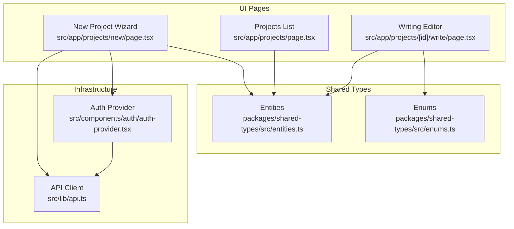
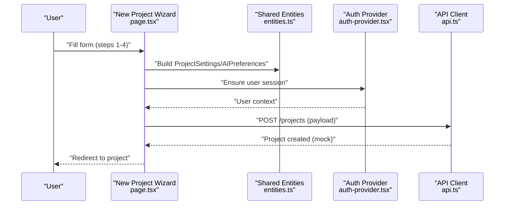
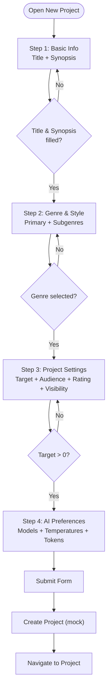
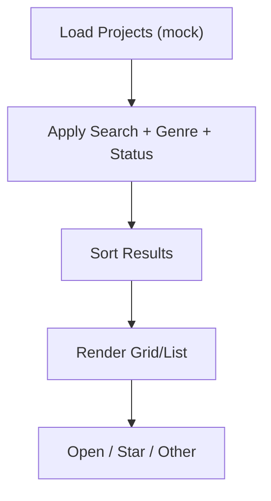
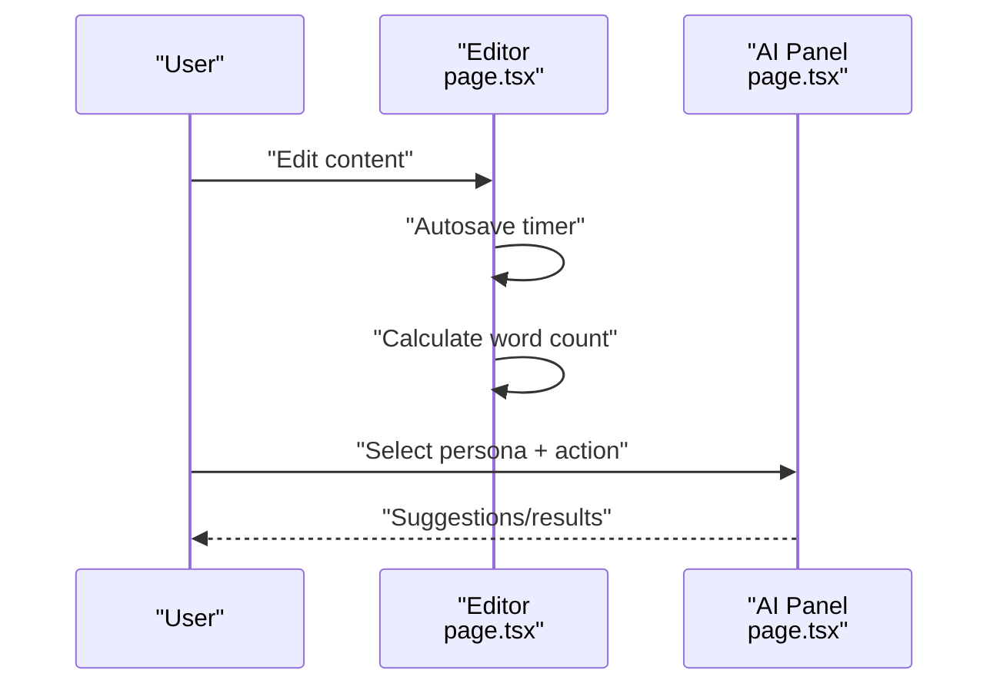
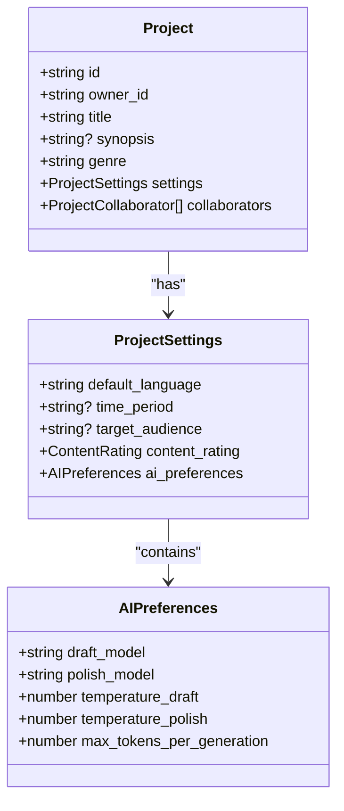
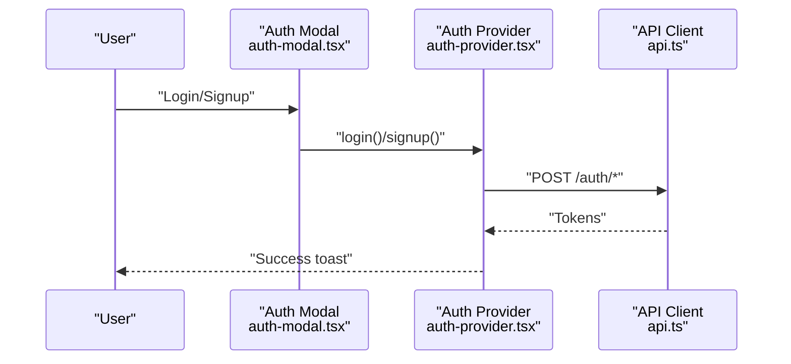
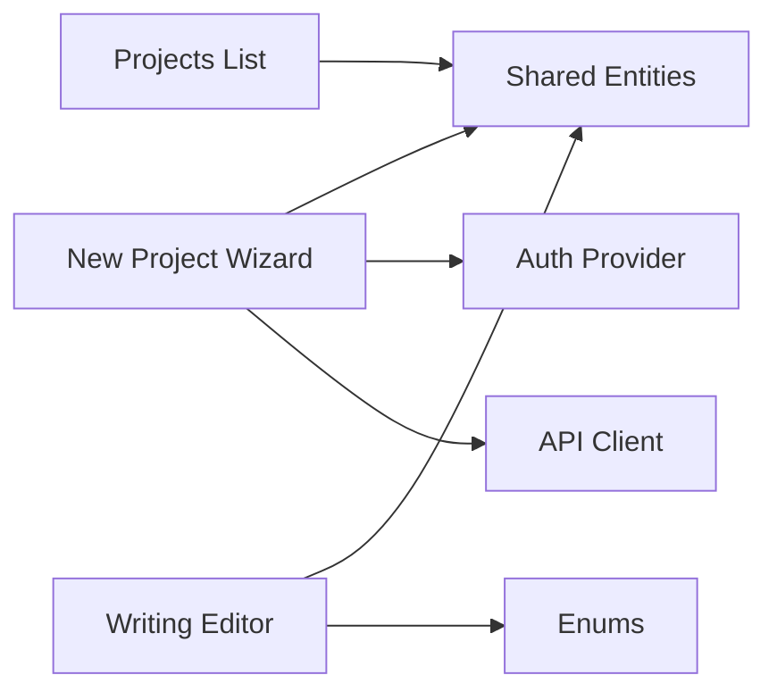

# Project Creation & Configuration

<cite>
**Referenced Files in This Document**
- [page.tsx](file://src/app/projects/new/page.tsx)
- [page.tsx](file://src/app/projects/page.tsx)
- [page.tsx](file://src/app/projects/[id]/write/page.tsx)
- [auth-provider.tsx](file://src/components/auth/auth-provider.tsx)
- [auth-modal.tsx](file://src/components/auth/auth-modal.tsx)
- [api.ts](file://src/lib/api.ts)
- [entities.ts](file://packages/shared-types/src/entities.ts)
- [enums.ts](file://packages/shared-types/src/enums.ts)
- [IMPLEMENTATION_PLAN.md](file://IMPLEMENTATION_PLAN.md)
- [QUICK_START_CHECKLIST.md](file://QUICK_START_CHECKLIST.md)
</cite>

## Table of Contents
1. [Introduction](#introduction)
2. [Project Structure](#project-structure)
3. [Core Components](#core-components)
4. [Architecture Overview](#architecture-overview)
5. [Detailed Component Analysis](#detailed-component-analysis)
6. [Dependency Analysis](#dependency-analysis)
7. [Performance Considerations](#performance-considerations)
8. [Troubleshooting Guide](#troubleshooting-guide)
9. [Conclusion](#conclusion)

## Introduction
This document explains the end-to-end workflow for creating and configuring writing projects in the platform. It covers the step-by-step creation process, project metadata configuration, genre classification, target word counts, visibility settings, collaboration preferences, AI assistant customization, and the writing interface. It also documents form validation, error handling, user guidance, and outlines planned features for cloning, import/export, and bulk management operations.

## Project Structure
The project creation and configuration flow spans several pages and shared types:
- New project wizard: multi-step form with validation and navigation
- Project listing: filtering, sorting, and project cards
- Writing interface: rich text editor with AI assistance and autosave
- Shared types: strongly typed project, settings, and enums
- Authentication and API infrastructure: token management and request/response handling

**Diagram sources**
- [page.tsx](file://src/app/projects/new/page.tsx#L65-L555)
- [page.tsx](file://src/app/projects/page.tsx#L48-L394)
- [page.tsx](file://src/app/projects/[id]/write/page.tsx#L100-L626)
- [auth-provider.tsx](file://src/components/auth/auth-provider.tsx#L20-L165)
- [api.ts](file://src/lib/api.ts#L1-L67)
- [entities.ts](file://packages/shared-types/src/entities.ts#L9-L458)
- [enums.ts](file://packages/shared-types/src/enums.ts#L126-L131)

**Section sources**
- [page.tsx](file://src/app/projects/new/page.tsx#L1-L555)
- [page.tsx](file://src/app/projects/page.tsx#L1-L394)
- [page.tsx](file://src/app/projects/[id]/write/page.tsx#L1-L626)
- [auth-provider.tsx](file://src/components/auth/auth-provider.tsx#L1-L165)
- [api.ts](file://src/lib/api.ts#L1-L67)
- [entities.ts](file://packages/shared-types/src/entities.ts#L1-L458)
- [enums.ts](file://packages/shared-types/src/enums.ts#L1-L241)

## Core Components
- New Project Wizard: Multi-step form collecting basic info, genre/style, project settings, and AI preferences with step validation and navigation.
- Projects List: Grid/list view with search, filter, sort, star toggling, and open actions.
- Writing Editor: Rich text editor with toolbar, autosave, version history, AI persona panel, and stats.
- Shared Entities and Enums: Strongly typed project settings, AI preferences, visibility, roles, and statuses.
- Authentication and API: Token-based auth, request/response interceptors, and refresh logic.

**Section sources**
- [page.tsx](file://src/app/projects/new/page.tsx#L23-L127)
- [page.tsx](file://src/app/projects/page.tsx#L31-L176)
- [page.tsx](file://src/app/projects/[id]/write/page.tsx#L49-L112)
- [entities.ts](file://packages/shared-types/src/entities.ts#L9-L458)
- [enums.ts](file://packages/shared-types/src/enums.ts#L126-L131)
- [auth-provider.tsx](file://src/components/auth/auth-provider.tsx#L20-L165)
- [api.ts](file://src/lib/api.ts#L1-L67)

## Architecture Overview
The creation workflow integrates UI forms, shared types, and infrastructure components. The new project wizard captures user input, validates steps, and prepares a structured payload aligned with shared entities. Authentication ensures secure access, while the API client manages requests and token refresh.

**Diagram sources**
- [page.tsx](file://src/app/projects/new/page.tsx#L65-L114)
- [entities.ts](file://packages/shared-types/src/entities.ts#L20-L34)
- [auth-provider.tsx](file://src/components/auth/auth-provider.tsx#L20-L49)
- [api.ts](file://src/lib/api.ts#L1-L67)

## Detailed Component Analysis

### New Project Wizard
The wizard guides users through four steps:
- Step 1: Basic Information (title, synopsis, optional time period)
- Step 2: Genre & Style (primary genre selection, optional subgenres)
- Step 3: Project Settings (target word count presets, audience, content rating, visibility)
- Step 4: AI Preferences (models, creativity/precision sliders, tokens per generation)

Validation prevents progression until required fields are filled. The submit handler currently simulates creation and redirects to the new project.

**Diagram sources**
- [page.tsx](file://src/app/projects/new/page.tsx#L116-L127)
- [page.tsx](file://src/app/projects/new/page.tsx#L108-L114)

Key configuration options:
- Target word count presets: short story, novella, novel, epic
- Audience: children, young adult, new adult, adult
- Content rating: G, PG, PG-13, R, NC-17
- Visibility: private, team, public
- AI preferences: model selection, temperature sliders, max tokens

User guidance:
- Step descriptions and inline hints
- Preset buttons for quick target word count selection
- Visual feedback for selections (selected states, progress bar)

**Section sources**
- [page.tsx](file://src/app/projects/new/page.tsx#L23-L127)
- [page.tsx](file://src/app/projects/new/page.tsx#L174-L551)

### Projects List
The projects list page displays projects with filtering, sorting, and view modes. It includes:
- Search by title/synopsis
- Filter by genre and status
- Sort by last updated, created, title, or progress
- Grid or list view
- Star toggling and open actions

**Diagram sources**
- [page.tsx](file://src/app/projects/page.tsx#L59-L126)
- [page.tsx](file://src/app/projects/page.tsx#L131-L153)

**Section sources**
- [page.tsx](file://src/app/projects/page.tsx#L48-L394)

### Writing Editor
The writing interface provides:
- Rich text editor with toolbar (formatting, alignment, lists)
- Autosave with configurable delay
- Word count calculation and progress visualization
- AI assistant panel with personas (Muse, Editor, Coach)
- Version history toggle and quick stats

**Diagram sources**
- [page.tsx](file://src/app/projects/[id]/write/page.tsx#L140-L166)
- [page.tsx](file://src/app/projects/[id]/write/page.tsx#L187-L349)
- [page.tsx](file://src/app/projects/[id]/write/page.tsx#L518-L622)

**Section sources**
- [page.tsx](file://src/app/projects/[id]/write/page.tsx#L100-L626)

### Shared Types and Enums
Strongly typed project settings and enums define:
- ProjectSettings: default language, time period, target audience, content rating, AI preferences
- AIPreferences: models, temperatures, max tokens
- Visibility: private, team, public, unlisted
- Roles: owner, editor, reviewer, reader
- Statuses: planning, in_progress, editing, completed, archived

**Diagram sources**
- [entities.ts](file://packages/shared-types/src/entities.ts#L9-L34)
- [enums.ts](file://packages/shared-types/src/enums.ts#L126-L131)

**Section sources**
- [entities.ts](file://packages/shared-types/src/entities.ts#L9-L458)
- [enums.ts](file://packages/shared-types/src/enums.ts#L126-L131)

### Authentication and API Infrastructure
- Auth provider initializes user session, handles login/signup/logout, and refreshes tokens periodically.
- API client injects Authorization headers and manages token refresh on 401 responses.
- Auth modal provides form validation and user feedback.

**Diagram sources**
- [auth-modal.tsx](file://src/components/auth/auth-modal.tsx#L54-L72)
- [auth-provider.tsx](file://src/components/auth/auth-provider.tsx#L67-L113)
- [api.ts](file://src/lib/api.ts#L11-L22)

**Section sources**
- [auth-provider.tsx](file://src/components/auth/auth-provider.tsx#L20-L165)
- [auth-modal.tsx](file://src/components/auth/auth-modal.tsx#L17-L72)
- [api.ts](file://src/lib/api.ts#L1-L67)

## Dependency Analysis
- New Project Wizard depends on:
  - Shared entities for typed settings
  - Auth provider for user context
  - API client for network requests
- Projects List depends on:
  - Shared entities for project model
  - Sorting/filtering logic
- Writing Editor depends on:
  - Shared entities for chapters/scenes
  - Enums for visibility/statuses
  - Autosave and AI panels

**Diagram sources**
- [page.tsx](file://src/app/projects/new/page.tsx#L65-L114)
- [page.tsx](file://src/app/projects/page.tsx#L48-L126)
- [page.tsx](file://src/app/projects/[id]/write/page.tsx#L100-L112)
- [entities.ts](file://packages/shared-types/src/entities.ts#L9-L458)
- [enums.ts](file://packages/shared-types/src/enums.ts#L126-L131)
- [auth-provider.tsx](file://src/components/auth/auth-provider.tsx#L20-L49)
- [api.ts](file://src/lib/api.ts#L1-L67)

**Section sources**
- [page.tsx](file://src/app/projects/new/page.tsx#L1-L555)
- [page.tsx](file://src/app/projects/page.tsx#L1-L394)
- [page.tsx](file://src/app/projects/[id]/write/page.tsx#L1-L626)
- [entities.ts](file://packages/shared-types/src/entities.ts#L1-L458)
- [enums.ts](file://packages/shared-types/src/enums.ts#L1-L241)
- [auth-provider.tsx](file://src/components/auth/auth-provider.tsx#L1-L165)
- [api.ts](file://src/lib/api.ts#L1-L67)

## Performance Considerations
- Form validation occurs locally; avoid unnecessary re-renders by updating state atomically per field.
- Use debounced search in the projects list to reduce filtering overhead.
- Lazy-load autosave and AI suggestions to minimize initial bundle size.
- Cache frequently accessed project metadata to reduce repeated calculations.

## Troubleshooting Guide
Common issues and resolutions:
- Authentication failures: Verify token refresh logic and ensure cookies are set correctly.
- API errors: Inspect request/response interceptors and handle 401/403 scenarios gracefully.
- Form validation errors: Confirm required fields and numeric ranges before submission.
- Autosave conflicts: Implement optimistic updates with conflict resolution on reload.

**Section sources**
- [auth-provider.tsx](file://src/components/auth/auth-provider.tsx#L133-L141)
- [api.ts](file://src/lib/api.ts#L24-L65)
- [page.tsx](file://src/app/projects/new/page.tsx#L116-L127)

## Conclusion
The project creation and configuration workflow combines a guided wizard, typed entities, robust authentication, and a powerful writing interface. While the current implementation simulates creation and autosave, the shared types and infrastructure are ready to integrate with backend APIs for full CRUD, collaboration, import/export, and bulk operations as outlined in the implementation plan.