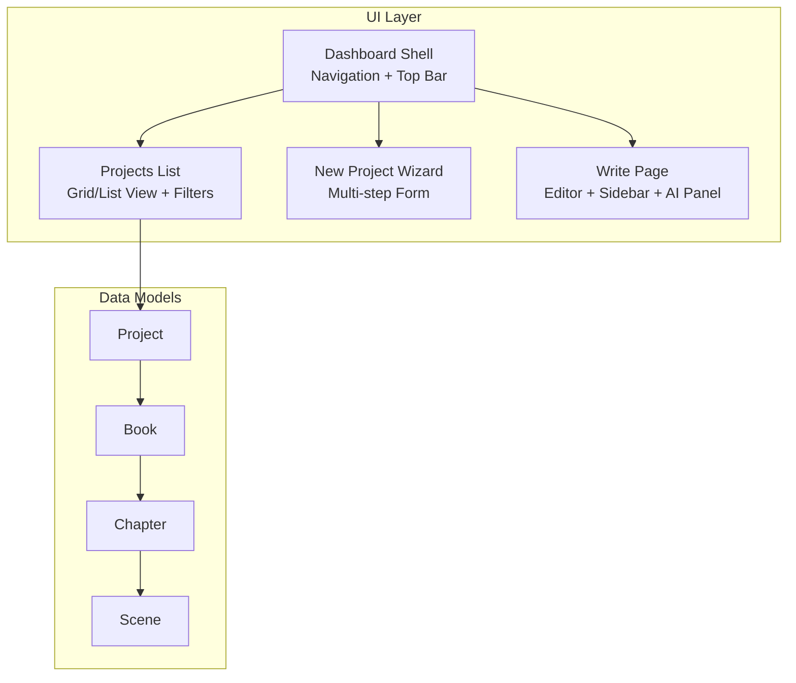
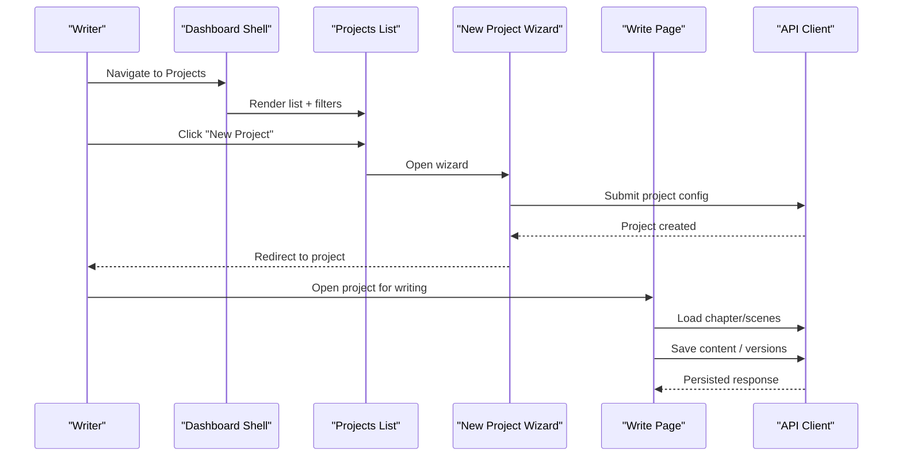
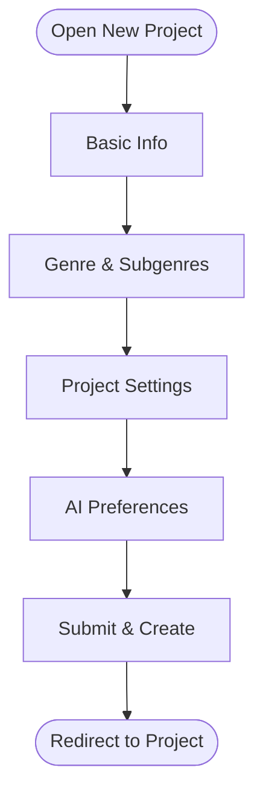
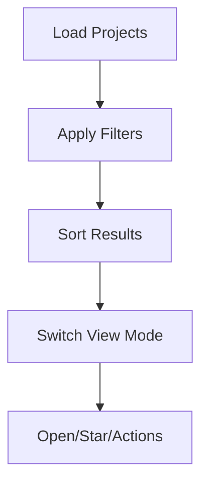
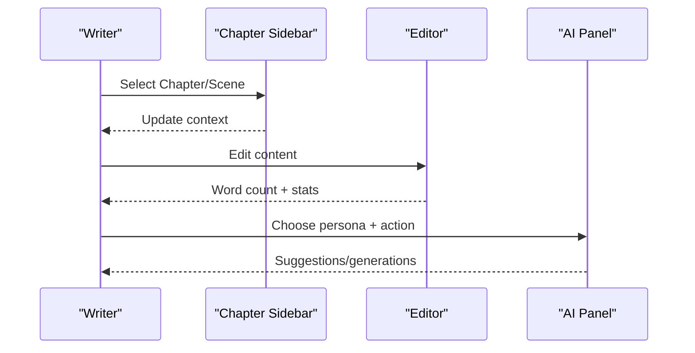
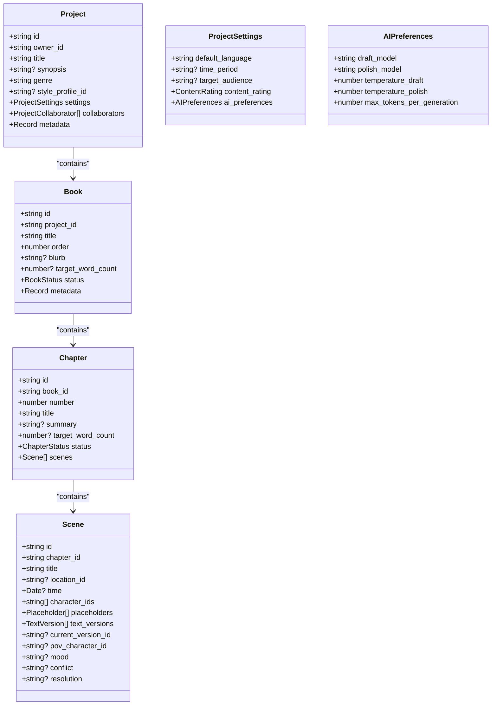
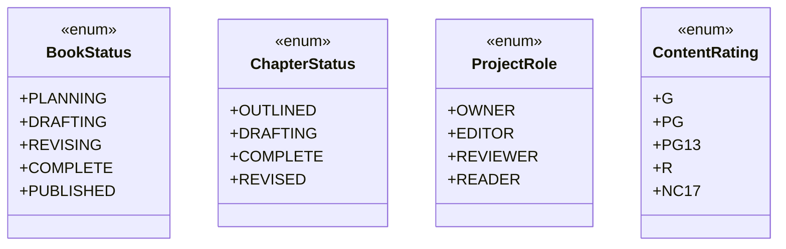
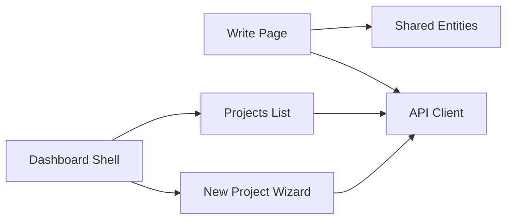

# Project Hierarchy & Organization

<cite>
**Referenced Files in This Document**
- [README.md](file://README.md)
- [IMPLEMENTATION_PLAN.md](file://IMPLEMENTATION_PLAN.md)
- [QUICK_START_CHECKLIST.md](file://QUICK_START_CHECKLIST.md)
- [src/app/projects/page.tsx](file://src/app/projects/page.tsx)
- [src/app/projects/new/page.tsx](file://src/app/projects/new/page.tsx)
- [src/app/projects/[id]/write/page.tsx](file://src/app/projects/[id]/write/page.tsx)
- [src/app/dashboard/page.tsx](file://src/app/dashboard/page.tsx)
- [src/components/dashboard/dashboard-shell.tsx](file://src/components/dashboard/dashboard-shell.tsx)
- [src/lib/api.ts](file://src/lib/api.ts)
- [packages/shared-types/src/entities.ts](file://packages/shared-types/src/entities.ts)
</cite>

## Table of Contents
1. [Introduction](#introduction)
2. [Project Structure](#project-structure)
3. [Core Components](#core-components)
4. [Architecture Overview](#architecture-overview)
5. [Detailed Component Analysis](#detailed-component-analysis)
6. [Dependency Analysis](#dependency-analysis)
7. [Performance Considerations](#performance-considerations)
8. [Troubleshooting Guide](#troubleshooting-guide)
9. [Conclusion](#conclusion)
10. [Appendices](#appendices)

## Introduction
This document explains the multi-level project hierarchy and organization system for the WorldBest AI-powered writing platform. It covers how writing projects are structured across books, chapters, and scenes, and documents the data models, UI flows, and management interfaces. It also outlines the project creation workflow, configuration options, navigation patterns, and content access controls. Practical examples demonstrate structuring projects, organizing content, and managing scene-level content. Finally, it addresses templates, bulk operations, and organizational best practices aligned with the current implementation plan.

## Project Structure
The application follows a Next.js App Router structure with a dashboard shell and dedicated pages for project management and writing. The hierarchy centers around:
- Project: top-level container with settings, collaborators, and metadata
- Book: logical grouping within a project (e.g., volumes or arcs)
- Chapter: ordered segments within a book
- Scene: granular writing units within a chapter

**Diagram sources**
- [src/components/dashboard/dashboard-shell.tsx](file://src/components/dashboard/dashboard-shell.tsx#L32-L47)
- [src/app/projects/page.tsx](file://src/app/projects/page.tsx#L48-L126)
- [src/app/projects/new/page.tsx](file://src/app/projects/new/page.tsx#L65-L89)
- [src/app/projects/[id]/write/page.tsx](file://src/app/projects/[id]/write/page.tsx#L100-L135)
- [packages/shared-types/src/entities.ts](file://packages/shared-types/src/entities.ts#L9-L76)

**Section sources**
- [README.md](file://README.md#L73-L104)
- [src/components/dashboard/dashboard-shell.tsx](file://src/components/dashboard/dashboard-shell.tsx#L32-L47)
- [src/app/projects/page.tsx](file://src/app/projects/page.tsx#L48-L126)
- [src/app/projects/new/page.tsx](file://src/app/projects/new/page.tsx#L65-L89)
- [src/app/projects/[id]/write/page.tsx](file://src/app/projects/[id]/write/page.tsx#L100-L135)
- [packages/shared-types/src/entities.ts](file://packages/shared-types/src/entities.ts#L9-L76)

## Core Components
- Project management page: lists projects with filtering, sorting, and view modes; links to open projects or create new ones.
- New project wizard: multi-step form configuring basic info, genre/subgenres, project settings, and AI preferences.
- Write page: rich text editor with chapter navigation sidebar, scene management, auto-save, version history, and AI assistant panel.
- Dashboard shell: navigation, search, and actions integrated across the app.
- Shared data models: TypeScript interfaces define the hierarchical entities and enums for status, roles, and types.

Key UI and model references:
- Project list and filters: [src/app/projects/page.tsx](file://src/app/projects/page.tsx#L48-L394)
- New project steps and form data: [src/app/projects/new/page.tsx](file://src/app/projects/new/page.tsx#L65-L555)
- Write page editor and sidebar: [src/app/projects/[id]/write/page.tsx](file://src/app/projects/[id]/write/page.tsx#L100-L626)
- Dashboard navigation and actions: [src/components/dashboard/dashboard-shell.tsx](file://src/components/dashboard/dashboard-shell.tsx#L32-L224)
- Data models and enums: [packages/shared-types/src/entities.ts](file://packages/shared-types/src/entities.ts#L9-L458)

**Section sources**
- [src/app/projects/page.tsx](file://src/app/projects/page.tsx#L48-L394)
- [src/app/projects/new/page.tsx](file://src/app/projects/new/page.tsx#L65-L555)
- [src/app/projects/[id]/write/page.tsx](file://src/app/projects/[id]/write/page.tsx#L100-L626)
- [src/components/dashboard/dashboard-shell.tsx](file://src/components/dashboard/dashboard-shell.tsx#L32-L224)
- [packages/shared-types/src/entities.ts](file://packages/shared-types/src/entities.ts#L9-L458)

## Architecture Overview
The system integrates UI components with shared data models and an API client. The write page demonstrates a typical flow: load project context, render chapter and scene navigation, manage content editing and AI assistance, and persist changes.

**Diagram sources**
- [src/components/dashboard/dashboard-shell.tsx](file://src/components/dashboard/dashboard-shell.tsx#L32-L47)
- [src/app/projects/page.tsx](file://src/app/projects/page.tsx#L276-L282)
- [src/app/projects/new/page.tsx](file://src/app/projects/new/page.tsx#L108-L114)
- [src/app/projects/[id]/write/page.tsx](file://src/app/projects/[id]/write/page.tsx#L157-L166)
- [src/lib/api.ts](file://src/lib/api.ts#L1-L67)

**Section sources**
- [src/lib/api.ts](file://src/lib/api.ts#L1-L67)
- [src/app/projects/[id]/write/page.tsx](file://src/app/projects/[id]/write/page.tsx#L157-L166)
- [src/app/projects/new/page.tsx](file://src/app/projects/new/page.tsx#L108-L114)

## Detailed Component Analysis

### Project Creation Workflow
The new project wizard guides users through four steps:
1. Basic Information: title, synopsis, optional time period
2. Genre & Style: primary genre selection and optional subgenres
3. Project Settings: target word count, audience, content rating, visibility
4. AI Preferences: model selection, creativity/precision sliders, token limits

**Diagram sources**
- [src/app/projects/new/page.tsx](file://src/app/projects/new/page.tsx#L65-L555)

**Section sources**
- [src/app/projects/new/page.tsx](file://src/app/projects/new/page.tsx#L65-L555)

### Project Management UI
The projects page supports:
- Filtering by genre and status
- Sorting by updated/created/title/progress
- Grid/list view toggling
- Star/favorite toggling
- Open and star actions per project

**Diagram sources**
- [src/app/projects/page.tsx](file://src/app/projects/page.tsx#L131-L153)
- [src/app/projects/page.tsx](file://src/app/projects/page.tsx#L327-L351)

**Section sources**
- [src/app/projects/page.tsx](file://src/app/projects/page.tsx#L131-L153)
- [src/app/projects/page.tsx](file://src/app/projects/page.tsx#L327-L351)

### Writing Interface and Navigation
The write page provides:
- Rich text editor with toolbar
- Chapter sidebar with navigation and scene stats
- Current scene title editing
- Auto-save toggle and version history
- AI assistant panel with personas (Muse, Editor, Coach)

**Diagram sources**
- [src/app/projects/[id]/write/page.tsx](file://src/app/projects/[id]/write/page.tsx#L187-L349)
- [src/app/projects/[id]/write/page.tsx](file://src/app/projects/[id]/write/page.tsx#L395-L492)
- [src/app/projects/[id]/write/page.tsx](file://src/app/projects/[id]/write/page.tsx#L518-L622)

**Section sources**
- [src/app/projects/[id]/write/page.tsx](file://src/app/projects/[id]/write/page.tsx#L187-L349)
- [src/app/projects/[id]/write/page.tsx](file://src/app/projects/[id]/write/page.tsx#L395-L492)
- [src/app/projects/[id]/write/page.tsx](file://src/app/projects/[id]/write/page.tsx#L518-L622)

### Data Models for Hierarchy Levels
The shared entities define the core hierarchy and related types.

**Diagram sources**
- [packages/shared-types/src/entities.ts](file://packages/shared-types/src/entities.ts#L9-L76)

**Section sources**
- [packages/shared-types/src/entities.ts](file://packages/shared-types/src/entities.ts#L9-L76)

### Enumerations and Roles
Additional enums define statuses, roles, and types used across the hierarchy.

**Diagram sources**
- [packages/shared-types/src/entities.ts](file://packages/shared-types/src/entities.ts#L389-L409)
- [packages/shared-types/src/entities.ts](file://packages/shared-types/src/entities.ts#L445-L449)

**Section sources**
- [packages/shared-types/src/entities.ts](file://packages/shared-types/src/entities.ts#L389-L409)
- [packages/shared-types/src/entities.ts](file://packages/shared-types/src/entities.ts#L445-L449)

### Project Templates and Bulk Operations
- Templates: The new project wizard collects genre and subgenres to seed project style and expectations. While explicit template APIs are not implemented yet, the form captures genre/style and AI preferences that can serve as template-like configurations.
- Bulk operations: The current UI focuses on single-project management. Bulk operations (e.g., batch chapter creation, mass visibility updates) are not exposed in the current pages and would require new UI surfaces and API endpoints.

**Section sources**
- [src/app/projects/new/page.tsx](file://src/app/projects/new/page.tsx#L43-L63)
- [src/app/projects/new/page.tsx](file://src/app/projects/new/page.tsx#L65-L89)

### Organizational Best Practices
- Use genres and subgenres during project creation to align AI preferences and categorization.
- Set realistic target word counts per chapter to maintain steady progress.
- Keep scenes focused and atomic for easier editing and AI assistance.
- Use the chapter sidebar to track word counts and navigate between scenes efficiently.
- Enable auto-save and leverage version history for content safety.

**Section sources**
- [src/app/projects/new/page.tsx](file://src/app/projects/new/page.tsx#L270-L308)
- [src/app/projects/[id]/write/page.tsx](file://src/app/projects/[id]/write/page.tsx#L440-L466)
- [src/app/projects/[id]/write/page.tsx](file://src/app/projects/[id]/write/page.tsx#L139-L148)

## Dependency Analysis
The write page depends on shared data models and uses the API client for persistence. The dashboard shell provides navigation and actions across the app.

**Diagram sources**
- [src/app/projects/[id]/write/page.tsx](file://src/app/projects/[id]/write/page.tsx#L100-L135)
- [packages/shared-types/src/entities.ts](file://packages/shared-types/src/entities.ts#L9-L76)
- [src/lib/api.ts](file://src/lib/api.ts#L1-L67)
- [src/components/dashboard/dashboard-shell.tsx](file://src/components/dashboard/dashboard-shell.tsx#L32-L47)

**Section sources**
- [src/app/projects/[id]/write/page.tsx](file://src/app/projects/[id]/write/page.tsx#L100-L135)
- [src/lib/api.ts](file://src/lib/api.ts#L1-L67)
- [src/components/dashboard/dashboard-shell.tsx](file://src/components/dashboard/dashboard-shell.tsx#L32-L47)

## Performance Considerations
- Lazy loading and code splitting: Implement route-based code splitting for heavy pages like the editor and AI panels.
- Debounced autosave: Use debounced save handlers to reduce API calls while maintaining responsiveness.
- Virtualized lists: For large project lists or long chapter lists, consider virtualization to improve rendering performance.
- Image optimization: Use modern image formats and sizes for project covers and assets.
- Bundle size: Monitor and optimize bundle size targets as outlined in the implementation plan.

[No sources needed since this section provides general guidance]

## Troubleshooting Guide
Common issues and resolutions:
- Authentication token handling: Consolidate token storage and ensure consistent bearer token injection via the API client.
- API client instances: Avoid duplicate API client instances to prevent inconsistent headers and state.
- WebSocket authentication: Ensure tokens are refreshed and applied to WebSocket connections.
- Error boundaries: Add global error boundaries and user-friendly messaging for network failures and unexpected errors.
- Logging: Integrate error logging to capture stack traces and contextual information.

**Section sources**
- [src/lib/api.ts](file://src/lib/api.ts#L1-L67)
- [IMPLEMENTATION_PLAN.md](file://IMPLEMENTATION_PLAN.md#L154-L186)
- [QUICK_START_CHECKLIST.md](file://QUICK_START_CHECKLIST.md#L35-L46)

## Conclusion
The WorldBest platform organizes writing projects through a clear hierarchy of project → book → chapter → scene. The UI provides robust project management, a guided creation flow, and a powerful writing interface with AI assistance. Shared data models define the structure and constraints, while the API client handles authentication and persistence. By following the recommended best practices and implementing the planned enhancements, teams can efficiently structure, collaborate on, and publish writing projects.

[No sources needed since this section summarizes without analyzing specific files]

## Appendices

### API Endpoints (Planned)
- Projects: list, create, get, update, delete
- Characters: CRUD, relationships, search
- AI: generation requests, persona management
- Analytics: usage statistics, progress tracking
- Billing: subscriptions, payments, invoices

**Section sources**
- [README.md](file://README.md#L329-L340)