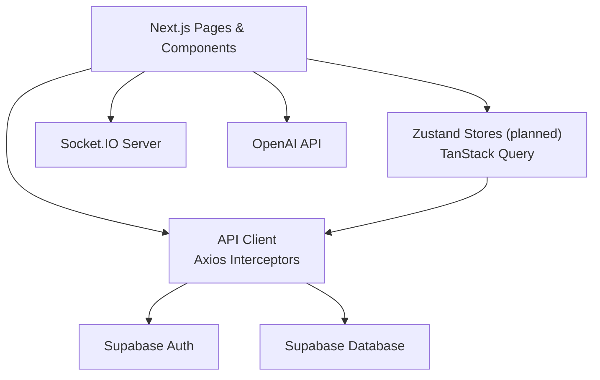
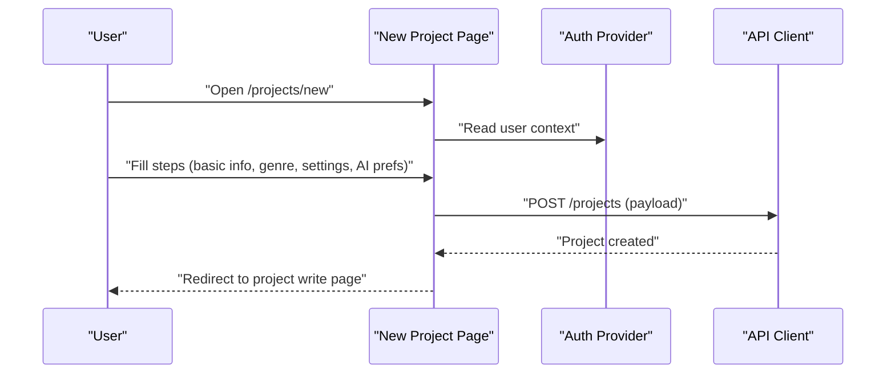
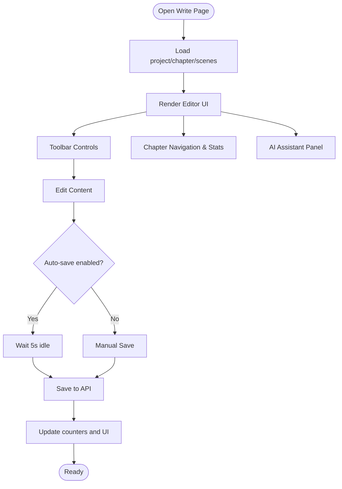
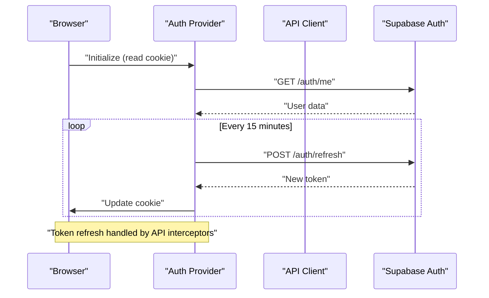
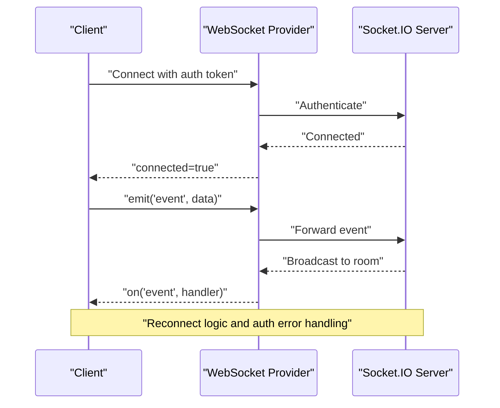
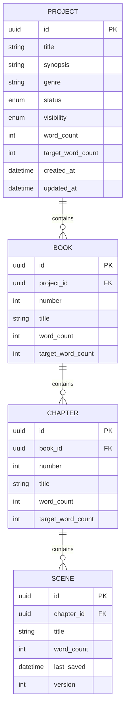
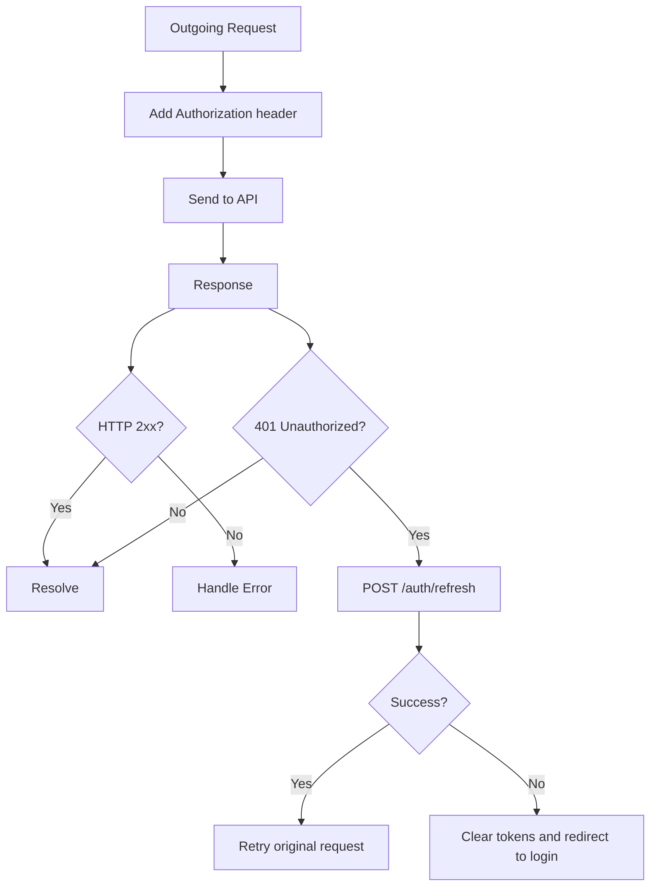
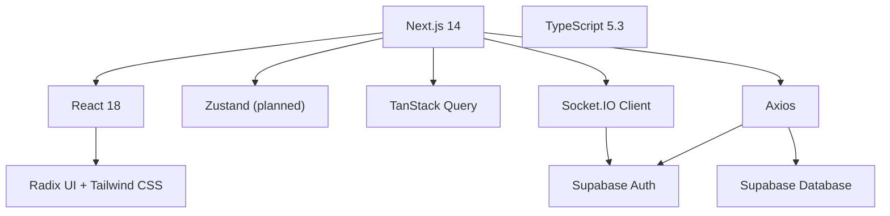

# Project Management System

<cite>
**Referenced Files in This Document**
- [README.md](file://README.md)
- [EXECUTIVE_SUMMARY.md](file://EXECUTIVE_SUMMARY.md)
- [IMPLEMENTATION_PLAN.md](file://IMPLEMENTATION_PLAN.md)
- [src/app/projects/page.tsx](file://src/app/projects/page.tsx)
- [src/app/projects/new/page.tsx](file://src/app/projects/new/page.tsx)
- [src/app/projects/[id]/write/page.tsx](file://src/app/projects/[id]/write/page.tsx)
- [src/app/dashboard/page.tsx](file://src/app/dashboard/page.tsx)
- [src/lib/api.ts](file://src/lib/api.ts)
- [src/components/auth/auth-provider.tsx](file://src/components/auth/auth-provider.tsx)
- [src/components/websocket/websocket-provider.tsx](file://src/components/websocket/websocket-provider.tsx)
- [src/components/providers.tsx](file://src/components/providers.tsx)
- [src/app/layout.tsx](file://src/app/layout.tsx)
- [next.config.js](file://next.config.js)
- [package.json](file://package.json)
</cite>

## Table of Contents
1. [Introduction](#introduction)
2. [Project Structure](#project-structure)
3. [Core Components](#core-components)
4. [Architecture Overview](#architecture-overview)
5. [Detailed Component Analysis](#detailed-component-analysis)
6. [Dependency Analysis](#dependency-analysis)
7. [Performance Considerations](#performance-considerations)
8. [Troubleshooting Guide](#troubleshooting-guide)
9. [Conclusion](#conclusion)
10. [Appendices](#appendices)

## Introduction
This document describes the project management system for organizing writing projects and story bibles. It explains the hierarchical structure (projects → books → chapters → scenes), outlines workflows for creation and management, and details the rich text editor integration, content organization, and planned collaboration and version control features. Practical examples show how to create projects, add content, and manage hierarchies. Data modeling, relationships, and storage strategies are discussed, along with sharing, collaboration, and export capabilities. The content is designed to be accessible to beginners while offering technical depth for experienced developers.

## Project Structure
The application is a Next.js 14 App Router application with a clear separation of concerns:
- Pages and routing under src/app for projects, dashboard, settings, and analytics
- UI components under src/components for reusable building blocks
- State and server state management via Zustand and TanStack Query
- Authentication and WebSocket providers wired at the root layout level
- API client abstraction for backend communication

```mermaid
graph TB
subgraph "Pages"
Projects["Projects Page<br/>src/app/projects/page.tsx"]
NewProject["New Project Wizard<br/>src/app/projects/new/page.tsx"]
Write["Rich Text Editor<br/>src/app/projects/[id]/write/page.tsx"]
Dashboard["Dashboard<br/>src/app/dashboard/page.tsx"]
end
subgraph "Providers"
Providers["Root Providers<br/>src/components/providers.tsx"]
Auth["Auth Provider<br/>src/components/auth/auth-provider.tsx"]
WS["WebSocket Provider<br/>src/components/websocket/websocket-provider.tsx"]
end
subgraph "Libraries"
API["API Client<br/>src/lib/api.ts"]
Layout["Root Layout<br/>src/app/layout.tsx"]
end
Providers --> Auth
Providers --> WS
Projects --> Auth
NewProject --> Auth
Write --> Auth
Dashboard --> Auth
Projects --> API
NewProject --> API
Write --> API
Dashboard --> API
Layout --> Providers
```

**Diagram sources**
- [src/app/projects/page.tsx](file://src/app/projects/page.tsx#L48-L394)
- [src/app/projects/new/page.tsx](file://src/app/projects/new/page.tsx#L65-L555)
- [src/app/projects/[id]/write/page.tsx](file://src/app/projects/[id]/write/page.tsx#L100-L626)
- [src/app/dashboard/page.tsx](file://src/app/dashboard/page.tsx#L53-L260)
- [src/components/providers.tsx](file://src/components/providers.tsx#L10-L55)
- [src/components/auth/auth-provider.tsx](file://src/components/auth/auth-provider.tsx#L20-L165)
- [src/components/websocket/websocket-provider.tsx](file://src/components/websocket/websocket-provider.tsx#L17-L138)
- [src/lib/api.ts](file://src/lib/api.ts#L1-L67)
- [src/app/layout.tsx](file://src/app/layout.tsx#L83-L102)

**Section sources**
- [README.md](file://README.md#L73-L104)
- [src/app/layout.tsx](file://src/app/layout.tsx#L83-L102)
- [src/components/providers.tsx](file://src/components/providers.tsx#L10-L55)

## Core Components
- Authentication Provider: Manages user session, JWT cookie handling, and token refresh cycles.
- WebSocket Provider: Establishes real-time connections for collaboration and live updates.
- API Client: Centralized Axios client with request/response interceptors for auth and token refresh.
- Project Pages: Project listing, creation wizard, and writing interface with rich text editing.
- Dashboard: Overview of recent projects and quick actions.

Key responsibilities:
- Authentication and session lifecycle
- Real-time collaboration readiness
- API communication and error handling
- Project CRUD and hierarchy navigation
- Rich text editing with toolbar and AI assistant panel

**Section sources**
- [src/components/auth/auth-provider.tsx](file://src/components/auth/auth-provider.tsx#L20-L165)
- [src/components/websocket/websocket-provider.tsx](file://src/components/websocket/websocket-provider.tsx#L17-L138)
- [src/lib/api.ts](file://src/lib/api.ts#L1-L67)
- [src/app/projects/page.tsx](file://src/app/projects/page.tsx#L48-L394)
- [src/app/projects/new/page.tsx](file://src/app/projects/new/page.tsx#L65-L555)
- [src/app/projects/[id]/write/page.tsx](file://src/app/projects/[id]/write/page.tsx#L100-L626)
- [src/app/dashboard/page.tsx](file://src/app/dashboard/page.tsx#L53-L260)

## Architecture Overview
The system follows a layered architecture:
- Presentation layer: Next.js pages and components
- State layer: Zustand stores (planned), TanStack Query for server state
- Service layer: API client with interceptors
- Infrastructure: Supabase for auth/database, Socket.IO for real-time, OpenAI for AI



**Diagram sources**
- [src/lib/api.ts](file://src/lib/api.ts#L1-L67)
- [src/components/auth/auth-provider.tsx](file://src/components/auth/auth-provider.tsx#L20-L165)
- [src/components/websocket/websocket-provider.tsx](file://src/components/websocket/websocket-provider.tsx#L17-L138)
- [README.md](file://README.md#L61-L72)

## Detailed Component Analysis

### Project Creation and Management
The creation flow is guided by a multi-step wizard that captures essential project metadata and preferences. The listing page supports filtering, sorting, and view modes. Both pages are currently backed by mock data and will connect to the API in later phases.



**Diagram sources**
- [src/app/projects/new/page.tsx](file://src/app/projects/new/page.tsx#L65-L114)
- [src/components/auth/auth-provider.tsx](file://src/components/auth/auth-provider.tsx#L20-L165)
- [src/lib/api.ts](file://src/lib/api.ts#L1-L67)

Practical example: Creating a project
- Navigate to the new project wizard
- Complete the four-step form (basic info, genre/style, project settings, AI preferences)
- Submit to create the project
- Access the writing interface for the newly created project

**Section sources**
- [src/app/projects/new/page.tsx](file://src/app/projects/new/page.tsx#L65-L555)
- [src/app/projects/page.tsx](file://src/app/projects/page.tsx#L48-L394)

### Rich Text Editor Integration
The writing interface provides a professional editing experience with:
- Rich text toolbar (formatting, lists, alignment)
- Auto-save and manual save controls
- Word count tracking and progress visualization
- AI assistant panel with persona selection and quick actions
- Version history toggle for scene versions



**Diagram sources**
- [src/app/projects/[id]/write/page.tsx](file://src/app/projects/[id]/write/page.tsx#L100-L626)

Practical example: Adding content
- Open a chapter’s write page
- Use the toolbar to format text
- Toggle auto-save on/off
- Use the AI panel to improve selections or continue writing
- Save manually or rely on auto-save

**Section sources**
- [src/app/projects/[id]/write/page.tsx](file://src/app/projects/[id]/write/page.tsx#L100-L626)

### Authentication and Session Management
Authentication relies on JWT tokens stored in cookies and refreshed via the API client interceptors. The auth provider initializes the session on load and periodically refreshes tokens.



**Diagram sources**
- [src/components/auth/auth-provider.tsx](file://src/components/auth/auth-provider.tsx#L20-L165)
- [src/lib/api.ts](file://src/lib/api.ts#L1-L67)

**Section sources**
- [src/components/auth/auth-provider.tsx](file://src/components/auth/auth-provider.tsx#L20-L165)
- [src/lib/api.ts](file://src/lib/api.ts#L1-L67)

### Real-time Collaboration and Presence
The WebSocket provider establishes a persistent connection authenticated via cookies. It includes reconnection logic and emits events when connected. Collaboration features (cursor presence, collaborative editing, comments, activity feed, presence indicators) are planned for future phases.



**Diagram sources**
- [src/components/websocket/websocket-provider.tsx](file://src/components/websocket/websocket-provider.tsx#L17-L138)

**Section sources**
- [src/components/websocket/websocket-provider.tsx](file://src/components/websocket/websocket-provider.tsx#L17-L138)
- [IMPLEMENTATION_PLAN.md](file://IMPLEMENTATION_PLAN.md#L278-L318)

### Data Modeling and Hierarchical Structure
The system organizes content in a hierarchy:
- Project: top-level container with metadata and visibility
- Book: grouping within a project
- Chapter: ordered sections within a book
- Scene: editable content units within a chapter



**Diagram sources**
- [src/app/projects/page.tsx](file://src/app/projects/page.tsx#L31-L46)
- [src/app/projects/[id]/write/page.tsx](file://src/app/projects/[id]/write/page.tsx#L49-L66)

**Section sources**
- [src/app/projects/page.tsx](file://src/app/projects/page.tsx#L31-L46)
- [src/app/projects/[id]/write/page.tsx](file://src/app/projects/[id]/write/page.tsx#L49-L66)

### API Communication and Error Handling
The API client centralizes base URL configuration, auth headers, and automatic token refresh on 401 responses. It also handles retry logic and redirects to login when refresh fails.



**Diagram sources**
- [src/lib/api.ts](file://src/lib/api.ts#L1-L67)

**Section sources**
- [src/lib/api.ts](file://src/lib/api.ts#L1-L67)

### Dashboard and Navigation
The dashboard provides a high-level overview of projects, quick stats, and shortcuts to create new projects and navigate to writing sessions.

**Section sources**
- [src/app/dashboard/page.tsx](file://src/app/dashboard/page.tsx#L53-L260)

## Dependency Analysis
The project leverages a modern frontend stack with clear boundaries between presentation, state, and services.



**Diagram sources**
- [package.json](file://package.json#L13-L62)
- [README.md](file://README.md#L51-L72)

**Section sources**
- [package.json](file://package.json#L13-L62)
- [README.md](file://README.md#L51-L72)

## Performance Considerations
- Bundle optimization and code splitting are planned to meet performance targets.
- Image optimization and responsive assets are supported via Next.js configuration.
- Database query optimization and caching strategies are documented in the implementation plan.
- Monitoring and observability are part of production optimization.

[No sources needed since this section provides general guidance]

## Troubleshooting Guide
Common issues and remedies:
- Inconsistent token storage: The current implementation mixes localStorage and cookies. Consolidate to cookies for auth tokens and ensure secure, sameSite attributes.
- Duplicate API clients: Ensure a single Axios instance with shared interceptors is used across the app.
- Fragile WebSocket authentication: Verify cookie parsing and ensure consistent token delivery to Socket.IO.
- Missing error boundaries: Implement robust error handling and user-friendly messaging.
- API retries: Configure retry policies for transient network errors while avoiding retry on client errors.

**Section sources**
- [EXECUTIVE_SUMMARY.md](file://EXECUTIVE_SUMMARY.md#L38-L44)
- [src/lib/api.ts](file://src/lib/api.ts#L1-L67)
- [src/components/websocket/websocket-provider.tsx](file://src/components/websocket/websocket-provider.tsx#L17-L138)

## Conclusion
The project management system provides a solid foundation for organizing writing projects and story bibles. The UI is feature-complete in concept, with backend integrations and collaboration features planned. The architecture supports scalability and real-time collaboration, while the API client and providers establish a robust foundation for authentication, state, and networking. Execution of the implementation plan will deliver production-ready features incrementally.

[No sources needed since this section summarizes without analyzing specific files]

## Appendices

### Practical Workflows
- Create a project: Use the new project wizard to define metadata and preferences, then open the writing interface.
- Add content: Use the rich text editor toolbar, AI assistant, and auto-save to compose scenes.
- Manage hierarchy: Navigate chapters via the sidebar; plan new chapters as needed.
- Share and collaborate: Visibility settings control access; collaboration features are upcoming.

**Section sources**
- [src/app/projects/new/page.tsx](file://src/app/projects/new/page.tsx#L65-L555)
- [src/app/projects/[id]/write/page.tsx](file://src/app/projects/[id]/write/page.tsx#L100-L626)
- [src/app/projects/page.tsx](file://src/app/projects/page.tsx#L48-L394)

### Planned Features and Roadmap
- Story bible management: Books, chapters, worldbuilding, and relationship graphs
- AI content generation: Muse, Editor, and Coach personas with streaming and token tracking
- Real-time collaboration: Cursor presence, collaborative editing, comments, activity feed, presence indicators
- Billing integration: Stripe checkout, customer portal, usage metering, webhooks
- Export capabilities: ePub, PDF, JSON, and import functionality
- Analytics dashboard: Writing statistics and progress tracking

**Section sources**
- [IMPLEMENTATION_PLAN.md](file://IMPLEMENTATION_PLAN.md#L189-L356)
- [README.md](file://README.md#L28-L46)