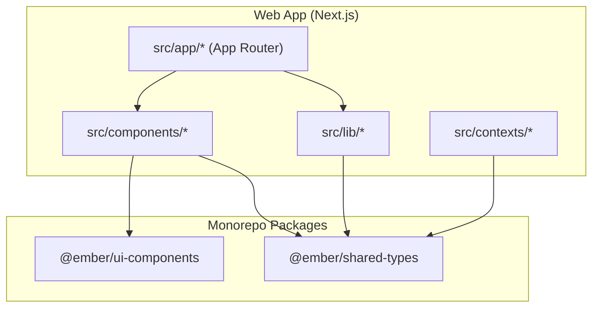
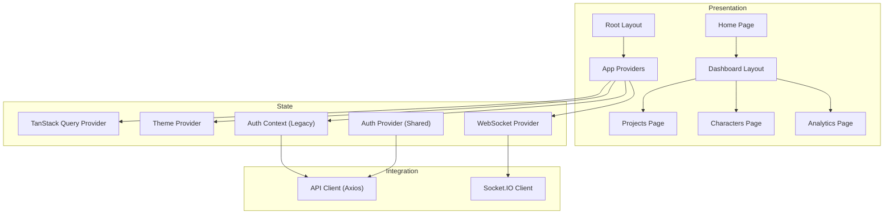
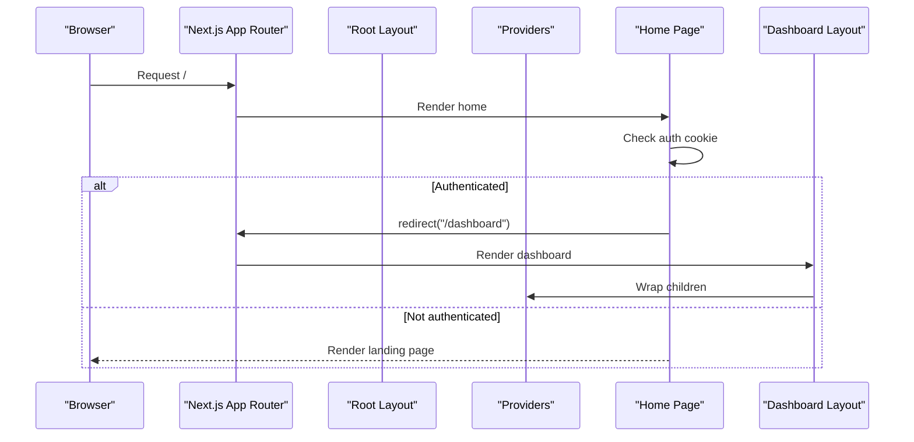
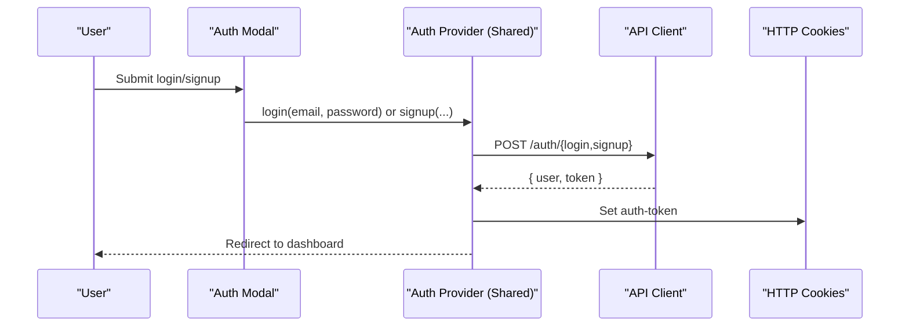
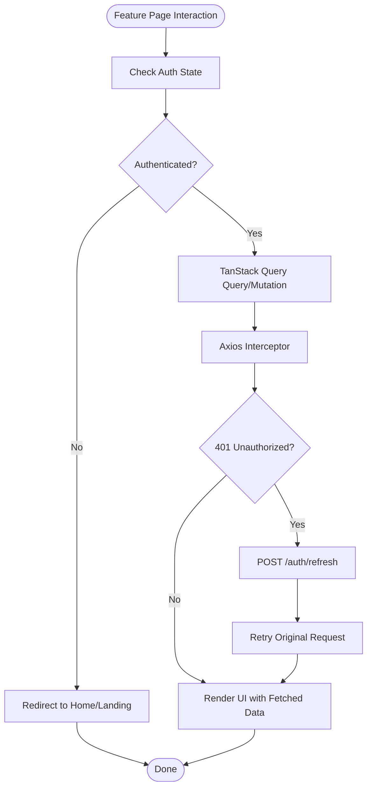
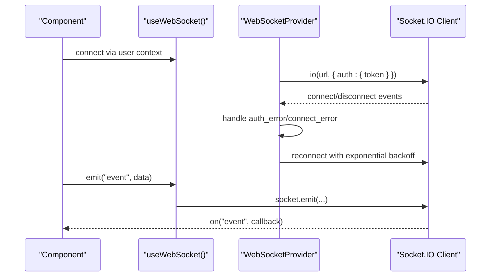
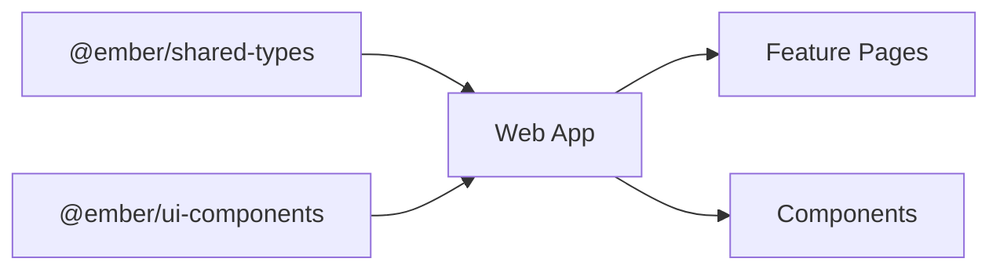
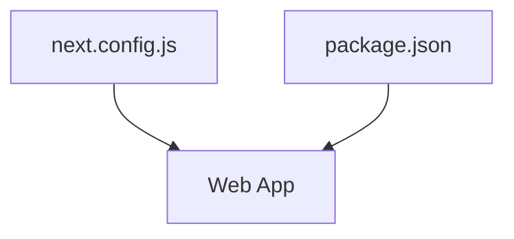

# Architecture Overview

<cite>
**Referenced Files in This Document**
- [README.md](file://README.md)
- [package.json](file://package.json)
- [next.config.js](file://next.config.js)
- [src/app/layout.tsx](file://src/app/layout.tsx)
- [src/app/providers.tsx](file://src/app/providers.tsx)
- [src/components/providers.tsx](file://src/components/providers.tsx)
- [src/contexts/auth-context.tsx](file://src/contexts/auth-context.tsx)
- [src/components/auth/auth-provider.tsx](file://src/components/auth/auth-provider.tsx)
- [src/components/auth/auth-modal.tsx](file://src/components/auth/auth-modal.tsx)
- [src/lib/api.ts](file://src/lib/api.ts)
- [src/components/websocket/websocket-provider.tsx](file://src/components/websocket/websocket-provider.tsx)
- [src/components/ui/button.tsx](file://src/components/ui/button.tsx)
- [src/app/page.tsx](file://src/app/page.tsx)
- [src/app/dashboard/layout.tsx](file://src/app/dashboard/layout.tsx)
- [src/app/projects/page.tsx](file://src/app/projects/page.tsx)
- [src/app/characters/page.tsx](file://src/app/characters/page.tsx)
- [src/app/analytics/page.tsx](file://src/app/analytics/page.tsx)
</cite>

## Table of Contents
1. [Introduction](#introduction)
2. [Project Structure](#project-structure)
3. [Core Components](#core-components)
4. [Architecture Overview](#architecture-overview)
5. [Detailed Component Analysis](#detailed-component-analysis)
6. [Dependency Analysis](#dependency-analysis)
7. [Performance Considerations](#performance-considerations)
8. [Troubleshooting Guide](#troubleshooting-guide)
9. [Conclusion](#conclusion)
10. [Appendices](#appendices)

## Introduction
This document presents the WorldBest architecture overview, focusing on the Next.js App Router structure, monorepo organization with shared packages, and modular component architecture. It explains data flow patterns, state management using Zustand and TanStack Query, and real-time communication via WebSocket. Practical examples demonstrate architectural decisions and design patterns, along with scalability considerations, performance implications, and integration points with external services.

## Project Structure
WorldBest follows a Next.js 14 App Router project layout with a monorepo organization:
- Application code resides under src/, organized by routes and features.
- Two packages are published as internal libraries:
  - @ember/shared-types: shared TypeScript types consumed by the web app and backend.
  - @ember/ui-components: shared UI primitives and components.
- The frontend uses Next.js App Router with route groups, dynamic routes, and nested layouts.

**Diagram sources**
- [package.json](file://package.json#L34-L35)
- [src/app/layout.tsx](file://src/app/layout.tsx#L1-L102)
- [src/components/providers.tsx](file://src/components/providers.tsx#L1-L55)

**Section sources**
- [README.md](file://README.md#L73-L104)
- [package.json](file://package.json#L1-L80)

## Core Components
- Providers layer: Centralizes TanStack Query, theme switching, authentication, and WebSocket providers.
- Authentication: Dual-mode auth providers—context-based and component-based—handling cookies, token refresh, and redirects.
- API client: Axios-based client with interceptors for auth and automatic token refresh.
- WebSocket: Socket.IO client integrated via a provider with robust reconnection and auth error handling.
- UI components: Shared Radix-based components and reusable building blocks.

Key implementation references:
- Providers composition and defaults: [Providers](file://src/components/providers.tsx#L10-L55), [App Providers](file://src/app/providers.tsx#L9-L37)
- Auth provider and modal: [Auth Provider](file://src/components/auth/auth-provider.tsx#L20-L165), [Auth Modal](file://src/components/auth/auth-modal.tsx#L17-L212)
- API client and interceptors: [API Client](file://src/lib/api.ts#L1-L67)
- WebSocket provider: [WebSocket Provider](file://src/components/websocket/websocket-provider.tsx#L17-L138)
- Shared UI button: [Button](file://src/components/ui/button.tsx#L1-L55)

**Section sources**
- [src/components/providers.tsx](file://src/components/providers.tsx#L1-L55)
- [src/app/providers.tsx](file://src/app/providers.tsx#L9-L37)
- [src/components/auth/auth-provider.tsx](file://src/components/auth/auth-provider.tsx#L20-L165)
- [src/components/auth/auth-modal.tsx](file://src/components/auth/auth-modal.tsx#L17-L212)
- [src/lib/api.ts](file://src/lib/api.ts#L1-L67)
- [src/components/websocket/websocket-provider.tsx](file://src/components/websocket/websocket-provider.tsx#L17-L138)
- [src/components/ui/button.tsx](file://src/components/ui/button.tsx#L1-L55)

## Architecture Overview
The system is layered:
- Presentation Layer: Next.js App Router pages and shared UI components.
- Domain Layer: Feature pages (Projects, Characters, Analytics) encapsulate UI logic and data presentation.
- Integration Layer: API client and WebSocket provider manage external integrations.
- State Layer: TanStack Query for server-state caching and optimistic updates; context-based auth state.

**Diagram sources**
- [src/app/layout.tsx](file://src/app/layout.tsx#L83-L102)
- [src/app/providers.tsx](file://src/app/providers.tsx#L9-L37)
- [src/components/providers.tsx](file://src/components/providers.tsx#L10-L55)
- [src/app/page.tsx](file://src/app/page.tsx#L5-L17)
- [src/app/dashboard/layout.tsx](file://src/app/dashboard/layout.tsx#L5-L23)
- [src/app/projects/page.tsx](file://src/app/projects/page.tsx#L48-L394)
- [src/app/characters/page.tsx](file://src/app/characters/page.tsx#L70-L512)
- [src/app/analytics/page.tsx](file://src/app/analytics/page.tsx#L93-L470)
- [src/lib/api.ts](file://src/lib/api.ts#L1-L67)
- [src/components/websocket/websocket-provider.tsx](file://src/components/websocket/websocket-provider.tsx#L17-L138)

## Detailed Component Analysis

### Next.js App Router and Routing Model
- Root layout initializes providers and global styles.
- Home page conditionally renders the landing page or redirects to the dashboard based on authentication state.
- Dashboard layout enforces authentication via server-side cookies and wraps children in a shell component.
- Feature pages (Projects, Characters, Analytics) encapsulate UI logic and present domain-specific views.

**Diagram sources**
- [src/app/layout.tsx](file://src/app/layout.tsx#L83-L102)
- [src/app/providers.tsx](file://src/app/providers.tsx#L9-L37)
- [src/app/page.tsx](file://src/app/page.tsx#L5-L17)
- [src/app/dashboard/layout.tsx](file://src/app/dashboard/layout.tsx#L5-L23)

**Section sources**
- [src/app/layout.tsx](file://src/app/layout.tsx#L1-L102)
- [src/app/page.tsx](file://src/app/page.tsx#L1-L17)
- [src/app/dashboard/layout.tsx](file://src/app/dashboard/layout.tsx#L1-L23)

### Authentication Architecture
Two complementary authentication systems coexist:
- Legacy context-based auth: Manages user state, login/signup, logout, and token refresh using localStorage.
- Shared component-based auth: Uses cookies for tokens, auto-refreshes periodically, and integrates with shared UI components.

**Diagram sources**
- [src/components/auth/auth-modal.tsx](file://src/components/auth/auth-modal.tsx#L54-L72)
- [src/components/auth/auth-provider.tsx](file://src/components/auth/auth-provider.tsx#L67-L113)
- [src/lib/api.ts](file://src/lib/api.ts#L39-L53)

**Section sources**
- [src/contexts/auth-context.tsx](file://src/contexts/auth-context.tsx#L30-L154)
- [src/components/auth/auth-provider.tsx](file://src/components/auth/auth-provider.tsx#L20-L165)
- [src/components/auth/auth-modal.tsx](file://src/components/auth/auth-modal.tsx#L17-L212)
- [src/lib/api.ts](file://src/lib/api.ts#L1-L67)

### Data Flow and State Management
- TanStack Query manages server state with a centralized QueryClient configured in providers.
- API client uses interceptors to attach Authorization headers and refresh tokens automatically.
- Feature pages orchestrate rendering and user interactions; they rely on shared UI components and context providers.

**Diagram sources**
- [src/app/projects/page.tsx](file://src/app/projects/page.tsx#L48-L126)
- [src/app/characters/page.tsx](file://src/app/characters/page.tsx#L70-L183)
- [src/app/analytics/page.tsx](file://src/app/analytics/page.tsx#L93-L160)
- [src/lib/api.ts](file://src/lib/api.ts#L24-L65)
- [src/components/providers.tsx](file://src/components/providers.tsx#L11-L36)

**Section sources**
- [src/app/providers.tsx](file://src/app/providers.tsx#L9-L37)
- [src/components/providers.tsx](file://src/components/providers.tsx#L10-L55)
- [src/lib/api.ts](file://src/lib/api.ts#L1-L67)

### Real-Time Communication via WebSocket
- WebSocketProvider connects to the server using Socket.IO with cookie-based auth.
- Implements exponential backoff reconnection, disconnect handling, and auth error cleanup.
- Provides emit/on/off APIs for downstream components.

**Diagram sources**
- [src/components/websocket/websocket-provider.tsx](file://src/components/websocket/websocket-provider.tsx#L17-L138)

**Section sources**
- [src/components/websocket/websocket-provider.tsx](file://src/components/websocket/websocket-provider.tsx#L17-L138)

### Monorepo Packages and Shared Types/UI
- @ember/shared-types and @ember/ui-components are linked locally and transpiled by Next.js.
- Feature pages import shared UI components and types, ensuring consistency across the app.

**Diagram sources**
- [package.json](file://package.json#L34-L35)
- [next.config.js](file://next.config.js#L6-L6)

**Section sources**
- [package.json](file://package.json#L34-L35)
- [next.config.js](file://next.config.js#L6-L6)

## Dependency Analysis
- Next.js configuration:
  - Transpiles shared packages for consistent builds.
  - Rewrites /api/* to backend URL and sets public env vars for API and WS URLs.
  - Redirects root to dashboard when auth cookie exists.
- Dependencies:
  - UI: Radix UI, Tailwind-based shared components.
  - State: TanStack Query for caching and optimistic updates.
  - Networking: Axios with interceptors; Socket.IO for real-time.
  - Utilities: date-fns, clsx, lucide-react, recharts.

**Diagram sources**
- [next.config.js](file://next.config.js#L1-L56)
- [package.json](file://package.json#L1-L80)

**Section sources**
- [next.config.js](file://next.config.js#L1-L56)
- [package.json](file://package.json#L1-L80)

## Performance Considerations
- TanStack Query defaults:
  - Stale time reduces redundant network requests.
  - Controlled retries avoid thundering herds on transient failures.
- Image optimization:
  - Remote patterns configured for CDN and local MinIO.
- Routing:
  - Redirects minimize unnecessary client-side hydration when authenticated.
- Recommendations:
  - Enable React Query Devtools in development.
  - Consider pagination and virtualization for large lists in feature pages.
  - Lazy-load heavy charts and modals.

[No sources needed since this section provides general guidance]

## Troubleshooting Guide
Common issues and resolutions:
- Inconsistent token storage:
  - The legacy context-based auth uses localStorage while the shared auth uses cookies. Align on a single strategy (prefer cookies for SSR).
- Duplicate API client instances:
  - Ensure a single API client instance is imported and reused across modules.
- Fragile WebSocket authentication:
  - Verify cookie presence and validity before connecting; handle auth_error by disconnecting and prompting re-authentication.

**Section sources**
- [README.md](file://README.md#L344-L356)
- [src/lib/api.ts](file://src/lib/api.ts#L1-L67)
- [src/components/websocket/websocket-provider.tsx](file://src/components/websocket/websocket-provider.tsx#L36-L86)

## Conclusion
WorldBest employs a clean separation of concerns with Next.js App Router, a shared monorepo for types and UI, and a pragmatic combination of TanStack Query and context-based state. Authentication and real-time features are integrated via providers and interceptors. The architecture supports scalability through shared packages, predictable data flows, and modular feature pages. Addressing token storage alignment and API client instantiation will improve reliability and maintainability.

[No sources needed since this section summarizes without analyzing specific files]

## Appendices
- Example references:
  - Auth modal form submission: [Auth Modal](file://src/components/auth/auth-modal.tsx#L54-L72)
  - Projects page filtering and sorting: [Projects Page](file://src/app/projects/page.tsx#L131-L153)
  - Characters page stats and filters: [Characters Page](file://src/app/characters/page.tsx#L345-L446)
  - Analytics charts and data: [Analytics Page](file://src/app/analytics/page.tsx#L250-L341)

[No sources needed since this section aggregates references already cited above]