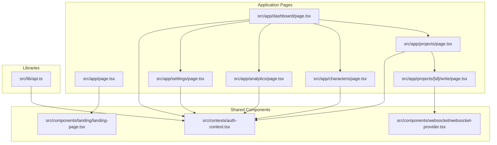
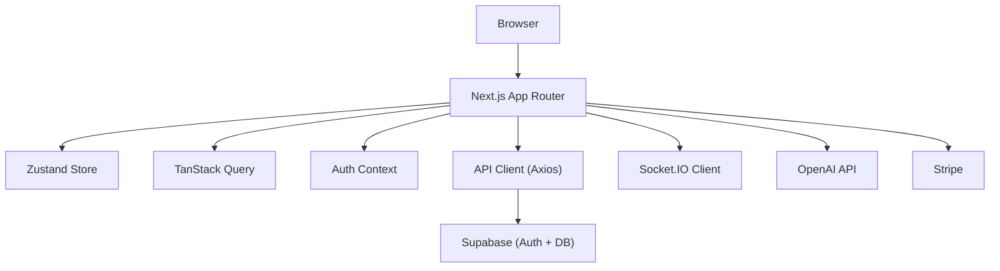
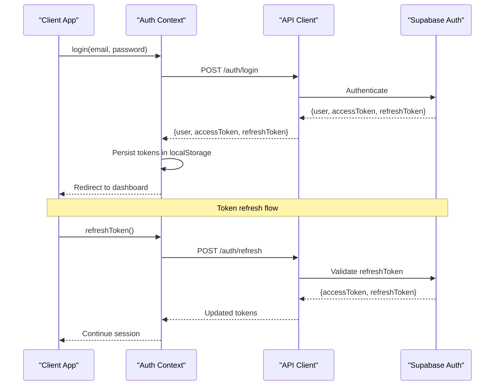
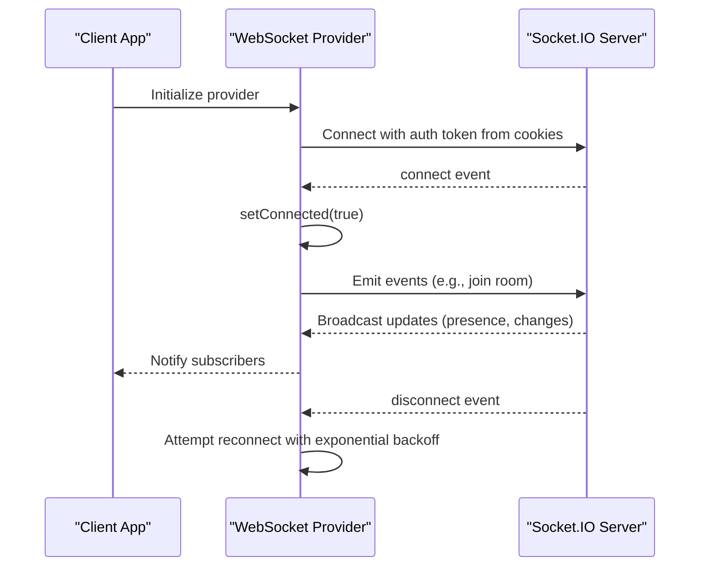
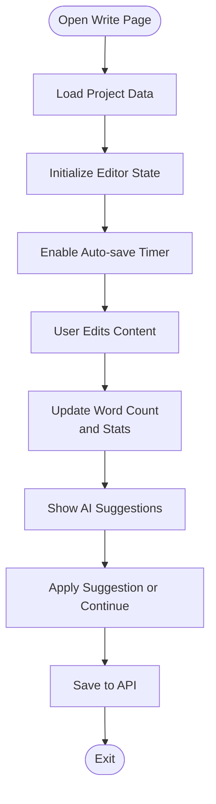
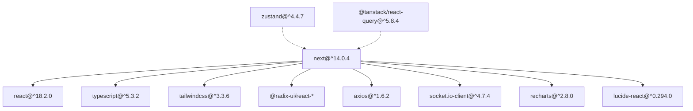

# Executive Summary

<cite>
**Referenced Files in This Document**
- [EXECUTIVE_SUMMARY.md](file://EXECUTIVE_SUMMARY.md)
- [README.md](file://README.md)
- [IMPLEMENTATION_PLAN.md](file://IMPLEMENTATION_PLAN.md)
- [package.json](file://package.json)
- [src/app/page.tsx](file://src/app/page.tsx)
- [src/components/landing/landing-page.tsx](file://src/components/landing/landing-page.tsx)
- [src/app/dashboard/page.tsx](file://src/app/dashboard/page.tsx)
- [src/app/projects/page.tsx](file://src/app/projects/page.tsx)
- [src/app/projects/[id]/write/page.tsx](file://src/app/projects/[id]/write/page.tsx)
- [src/app/characters/page.tsx](file://src/app/characters/page.tsx)
- [src/app/analytics/page.tsx](file://src/app/analytics/page.tsx)
- [src/app/settings/page.tsx](file://src/app/settings/page.tsx)
- [src/lib/api.ts](file://src/lib/api.ts)
- [src/contexts/auth-context.tsx](file://src/contexts/auth-context.tsx)
- [src/components/websocket/websocket-provider.tsx](file://src/components/websocket/websocket-provider.tsx)
</cite>

## Table of Contents
1. [Introduction](#introduction)
2. [Project Structure](#project-structure)
3. [Core Components](#core-components)
4. [Architecture Overview](#architecture-overview)
5. [Detailed Component Analysis](#detailed-component-analysis)
6. [Dependency Analysis](#dependency-analysis)
7. [Performance Considerations](#performance-considerations)
8. [Troubleshooting Guide](#troubleshooting-guide)
9. [Conclusion](#conclusion)
10. [Appendices](#appendices)

## Introduction
WorldBest is an AI-powered writing platform designed to revolutionize creative writing through intelligent assistance, collaborative authoring, and comprehensive project management. The platform targets writers across genres who seek productivity tools that understand narrative craft, enforce writing goals, and streamline the path from first draft to publication-ready files.

Strategic vision:
- Mission: Empower writers with AI that understands genre-specific beats, calibrates tone, and augments creativity while preserving author voice.
- Vision: Become the primary writing environment for authors who rely on AI, collaboration, and structured project management to meet deadlines and publish consistently.
- Values: Author-first design, transparent pricing, robust privacy, and continuous innovation in AI-assisted writing.

Business objectives:
- Revenue model: Freemium with tiered subscriptions, optional AI usage quotas, and enterprise team plans.
- Market focus: Indie authors, agencies, and publishing professionals who write fiction and nonfiction.
- Growth levers: Conversion from free trial to paid plans, cross-selling premium features, and team seat upsells.

## Project Structure
The repository follows a Next.js 14 App Router project layout with a clear separation of concerns:
- Application pages under src/app for routing and navigation
- Shared UI components and design system under src/components
- State management, API clients, and providers under src/lib and src/contexts
- Feature-focused pages for dashboard, projects, characters, analytics, and settings
- Shared packages for types and UI components

**Diagram sources**
- [src/app/page.tsx](file://src/app/page.tsx#L1-L17)
- [src/components/landing/landing-page.tsx](file://src/components/landing/landing-page.tsx#L1-L434)
- [src/app/dashboard/page.tsx](file://src/app/dashboard/page.tsx#L1-L260)
- [src/app/projects/page.tsx](file://src/app/projects/page.tsx#L1-L394)
- [src/app/projects/[id]/write/page.tsx](file://src/app/projects/[id]/write/page.tsx#L1-L626)
- [src/app/characters/page.tsx](file://src/app/characters/page.tsx#L1-L512)
- [src/app/analytics/page.tsx](file://src/app/analytics/page.tsx#L1-L470)
- [src/app/settings/page.tsx](file://src/app/settings/page.tsx#L1-L846)
- [src/lib/api.ts](file://src/lib/api.ts#L1-L67)
- [src/contexts/auth-context.tsx](file://src/contexts/auth-context.tsx#L1-L154)
- [src/components/websocket/websocket-provider.tsx](file://src/components/websocket/websocket-provider.tsx#L1-L138)

**Section sources**
- [README.md](file://README.md#L73-L104)

## Core Components
- Authentication and session management: JWT-based authentication with refresh token handling, persisted in localStorage, and integrated with the API client.
- Real-time collaboration: WebSocket provider with Socket.IO, cookie-based auth, and automatic reconnection logic.
- Project management: CRUD operations for projects, chapters, and scenes with auto-save and version history.
- AI assistant: Persona-driven writing assistance (Muse, Editor, Coach) with inline suggestions and custom prompts.
- Character management: Rich character profiles with MBTI, roles, relationships, and visual relationship maps.
- Analytics dashboard: Writing metrics, progress charts, genre distribution, and AI usage insights.
- Settings and billing: User preferences, plan management, payment method handling, and notification controls.

Practical examples:
- Onboarding flow: Visitors land on the marketing page, sign up, and are redirected to the dashboard where they can create their first project.
- Writing workflow: Authors open a project, navigate to the editor, use AI personas to improve or continue writing, and track progress in real-time.
- Collaboration: Multiple users can edit the same document with cursor presence and comments.
- Analytics: Writers review daily progress, project targets, and AI usage to optimize their productivity.

**Section sources**
- [src/lib/api.ts](file://src/lib/api.ts#L1-L67)
- [src/contexts/auth-context.tsx](file://src/contexts/auth-context.tsx#L1-L154)
- [src/components/websocket/websocket-provider.tsx](file://src/components/websocket/websocket-provider.tsx#L1-L138)
- [src/app/projects/[id]/write/page.tsx](file://src/app/projects/[id]/write/page.tsx#L1-L626)
- [src/app/characters/page.tsx](file://src/app/characters/page.tsx#L1-L512)
- [src/app/analytics/page.tsx](file://src/app/analytics/page.tsx#L1-L470)
- [src/app/settings/page.tsx](file://src/app/settings/page.tsx#L1-L846)

## Architecture Overview
The platform leverages a modern frontend stack with a clear separation between presentation, state, and services:
- Frontend: Next.js 14 App Router, React 18, TypeScript, Tailwind CSS, Radix UI
- State: Zustand for client state, TanStack Query for server state
- Real-time: Socket.IO with Supabase Realtime
- Authentication: Supabase Auth (JWT)
- AI: OpenAI API (GPT-4)
- Payments: Stripe
- Hosting: Vercel (frontend), Docker (backend as needed)

**Diagram sources**
- [package.json](file://package.json#L13-L62)
- [src/lib/api.ts](file://src/lib/api.ts#L1-L67)
- [src/contexts/auth-context.tsx](file://src/contexts/auth-context.tsx#L1-L154)
- [src/components/websocket/websocket-provider.tsx](file://src/components/websocket/websocket-provider.tsx#L1-L138)

**Section sources**
- [README.md](file://README.md#L49-L72)

## Detailed Component Analysis

### Authentication and Session Management
The authentication system integrates JWT-based login/signup, refresh token rotation, and centralized user state management. It ensures secure access to protected routes and maintains session persistence across browser sessions.

**Diagram sources**
- [src/contexts/auth-context.tsx](file://src/contexts/auth-context.tsx#L57-L125)
- [src/lib/api.ts](file://src/lib/api.ts#L24-L65)

**Section sources**
- [src/contexts/auth-context.tsx](file://src/contexts/auth-context.tsx#L1-L154)
- [src/lib/api.ts](file://src/lib/api.ts#L1-L67)

### Real-time Collaboration
The WebSocket provider establishes a persistent connection using Socket.IO with cookie-based authentication and automatic reconnection. It exposes convenience methods for emitting events and subscribing to updates, enabling features like cursor presence and collaborative editing.

**Diagram sources**
- [src/components/websocket/websocket-provider.tsx](file://src/components/websocket/websocket-provider.tsx#L24-L93)

**Section sources**
- [src/components/websocket/websocket-provider.tsx](file://src/components/websocket/websocket-provider.tsx#L1-L138)

### Project Management and Editor
The editor provides a rich text writing environment with auto-save, version history, and persona-driven AI assistance. It organizes content into chapters and scenes, tracks word counts, and integrates with analytics to monitor progress.

**Diagram sources**
- [src/app/projects/[id]/write/page.tsx](file://src/app/projects/[id]/write/page.tsx#L140-L166)

**Section sources**
- [src/app/projects/[id]/write/page.tsx](file://src/app/projects/[id]/write/page.tsx#L1-L626)

### AI Assistant Personas
The AI assistant offers three distinct personas:
- Muse: Creative inspiration and ideation
- Editor: Grammar, style, and clarity improvements
- Coach: Structural guidance and pacing advice

These personas are selectable inline, with contextual suggestions and custom prompt support.

**Section sources**
- [src/app/projects/[id]/write/page.tsx](file://src/app/projects/[id]/write/page.tsx#L68-L98)

### Character Management
The character system enables rich profiles with MBTI, roles, aliases, and relationships. It includes filtering, sorting, and quick actions for generating backstories, dialogue, and conflicts.

**Section sources**
- [src/app/characters/page.tsx](file://src/app/characters/page.tsx#L1-L512)

### Analytics Dashboard
The analytics dashboard presents key metrics, daily progress charts, project progress bars, genre distribution, AI usage radar, and writing patterns. It helps writers understand productivity trends and optimize their workflow.

**Section sources**
- [src/app/analytics/page.tsx](file://src/app/analytics/page.tsx#L1-L470)

### Settings and Billing
The settings interface covers profile management, notification preferences, app preferences, security controls, and billing plan management. It supports plan upgrades/downgrades and payment method updates.

**Section sources**
- [src/app/settings/page.tsx](file://src/app/settings/page.tsx#L1-L846)

## Dependency Analysis
The platform relies on a cohesive set of dependencies that align with the stated architecture and feature set.

**Diagram sources**
- [package.json](file://package.json#L13-L62)

**Section sources**
- [package.json](file://package.json#L1-L80)

## Performance Considerations
- Bundle size and runtime performance: The implementation plan emphasizes optimizing bundle size, enabling code splitting, and measuring Web Vitals to meet targets.
- Database and API responsiveness: Query optimization, indexing, and caching strategies are planned to ensure scalable performance.
- Real-time responsiveness: WebSocket reconnection logic and operational transformation/CRT are considered to minimize latency and conflicts.

[No sources needed since this section provides general guidance]

## Troubleshooting Guide
Common issues and mitigations:
- Inconsistent token storage: The implementation plan identifies mixing localStorage and cookies as a critical issue and recommends consolidating token storage and authentication flows.
- Duplicate API clients: The plan highlights the need to consolidate API client instances to avoid confusion and inconsistent behavior.
- Fragile WebSocket authentication: Cookie parsing logic is flagged as brittle and should be refactored to use a more robust authentication mechanism.
- Missing error boundaries and logging: The plan outlines implementing comprehensive error handling and integrating error tracking services.

**Section sources**
- [EXECUTIVE_SUMMARY.md](file://EXECUTIVE_SUMMARY.md#L38-L44)
- [README.md](file://README.md#L344-L356)

## Conclusion
WorldBest is positioned to become a leading AI-powered writing platform by combining genre-aware AI assistance, real-time collaboration, and robust project management. The current state shows strong foundational elements with clear gaps in state management, testing, and production-grade integrations. The implementation plan provides a structured, phased approach to address these gaps, establish monitoring and CI/CD, and deliver a production-ready product aligned with the platform’s strategic vision.

[No sources needed since this section summarizes without analyzing specific files]

## Appendices

### Strategic Overview for Stakeholders
- Mission and vision: Enhance creative writing through AI, collaboration, and project management.
- Target market: Indie authors, agencies, and publishing professionals.
- Competitive positioning: Genre-specific AI, collaborative editing, and integrated analytics differentiate the platform.
- Revenue model: Freemium with tiered subscriptions, optional AI usage quotas, and team plans.

**Section sources**
- [README.md](file://README.md#L28-L46)
- [src/components/landing/landing-page.tsx](file://src/components/landing/landing-page.tsx#L58-L104)

### Implementation Details for Technical Teams
- Phased execution: Foundation, core features, testing, production optimization, documentation, advanced features, and ongoing bug fixes.
- Critical priorities: State management, API clients, authentication, testing infrastructure, error tracking, and performance optimization.
- Go/no-go criteria: Authentication, project editing, editor auto-save, at least one AI persona, billing integration, test coverage, error tracking, performance targets, and security audit.

**Section sources**
- [EXECUTIVE_SUMMARY.md](file://EXECUTIVE_SUMMARY.md#L82-L126)
- [EXECUTIVE_SUMMARY.md](file://EXECUTIVE_SUMMARY.md#L246-L318)

### Value Proposition Examples
- From concept to publication: Use AI personas to brainstorm, develop characters, and refine scenes; collaborate with editors; track progress; and export to publishing formats.
- Time savings: Auto-save, version history, and analytics reduce friction and highlight productivity trends.
- Collaboration: Real-time editing with cursor presence and comments streamlines team workflows.

**Section sources**
- [src/app/projects/[id]/write/page.tsx](file://src/app/projects/[id]/write/page.tsx#L1-L626)
- [src/app/analytics/page.tsx](file://src/app/analytics/page.tsx#L1-L470)

### Market Opportunity and Risk Analysis
- Market opportunity: Growing demand for AI-assisted writing tools among indie authors and agencies.
- Risks: Real-time collaboration complexity, AI API cost overruns, database scalability, and timeline slippage.
- Mitigations: Use proven libraries, implement caching and quotas, optimize queries and indexing, and build buffer time into the schedule.

**Section sources**
- [EXECUTIVE_SUMMARY.md](file://EXECUTIVE_SUMMARY.md#L214-L243)