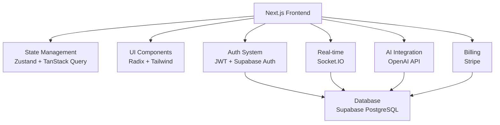
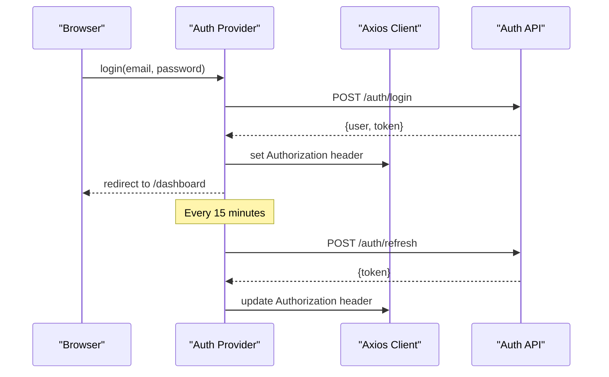
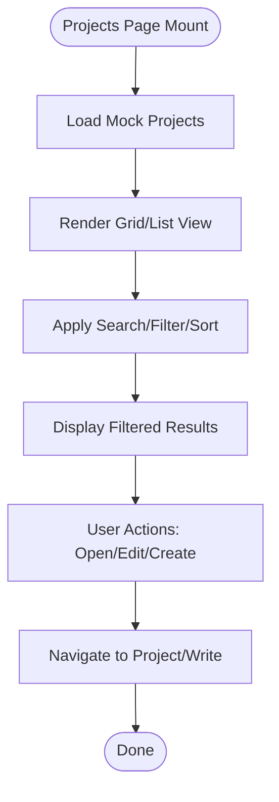
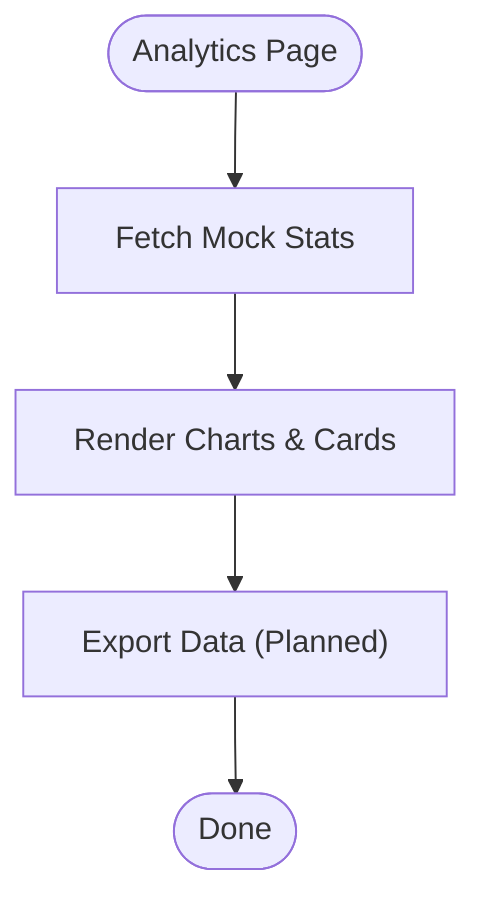
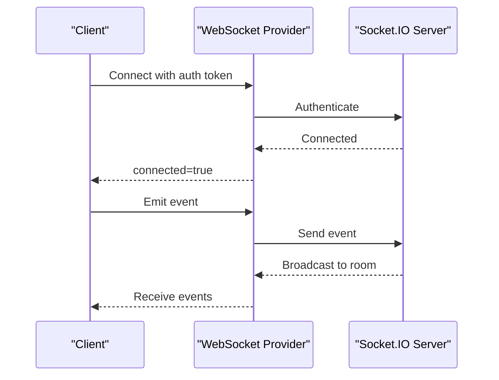
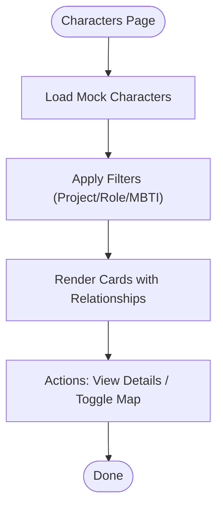
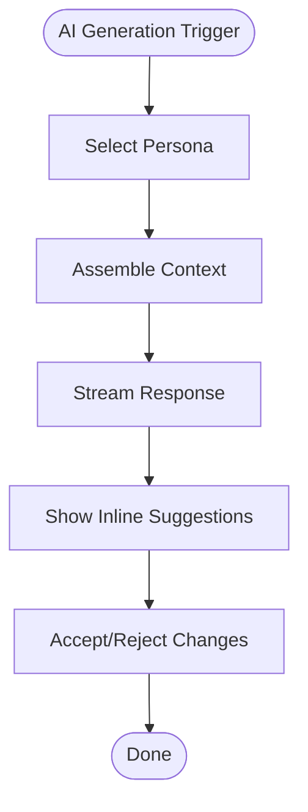
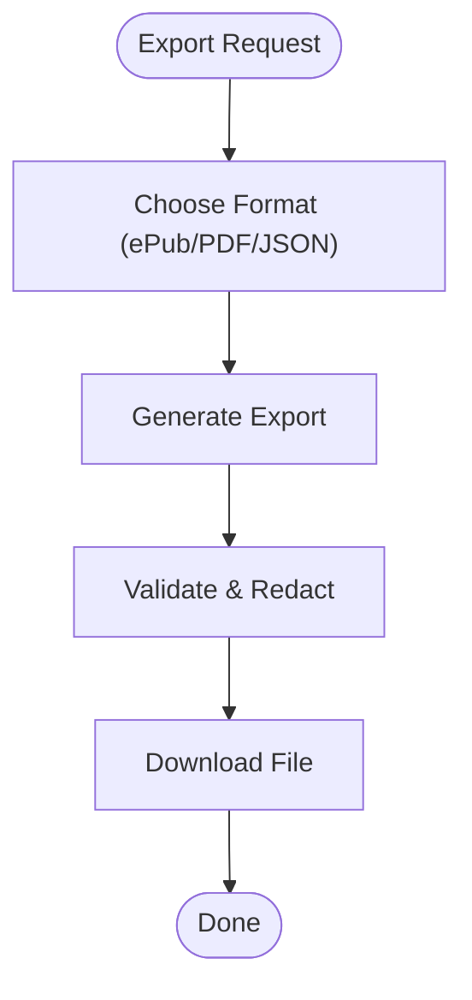
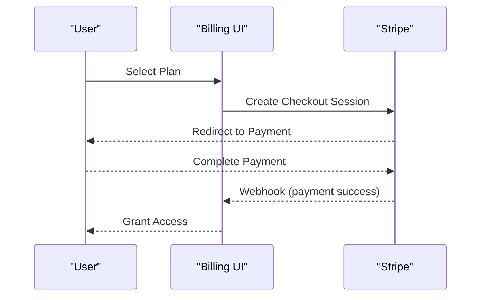
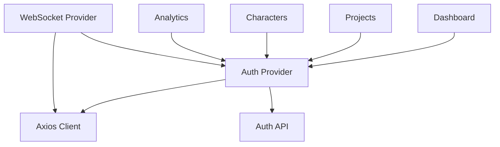

# Features Showcase

<cite>
**Referenced Files in This Document**
- [README.md](file://README.md)
- [EXECUTIVE_SUMMARY.md](file://EXECUTIVE_SUMMARY.md)
- [IMPLEMENTATION_PLAN.md](file://IMPLEMENTATION_PLAN.md)
- [src/app/page.tsx](file://src/app/page.tsx)
- [src/app/providers.tsx](file://src/app/providers.tsx)
- [src/contexts/auth-context.tsx](file://src/contexts/auth-context.tsx)
- [src/components/auth/auth-provider.tsx](file://src/components/auth/auth-provider.tsx)
- [src/components/auth/auth-modal.tsx](file://src/components/auth/auth-modal.tsx)
- [src/components/websocket/websocket-provider.tsx](file://src/components/websocket/websocket-provider.tsx)
- [src/lib/api/client.ts](file://src/lib/api/client.ts)
- [src/lib/api/auth.ts](file://src/lib/api/auth.ts)
- [src/app/dashboard/page.tsx](file://src/app/dashboard/page.tsx)
- [src/app/projects/page.tsx](file://src/app/projects/page.tsx)
- [src/app/characters/page.tsx](file://src/app/characters/page.tsx)
- [src/app/analytics/page.tsx](file://src/app/analytics/page.tsx)
</cite>

## Table of Contents
1. [Introduction](#introduction)
2. [Project Structure](#project-structure)
3. [Core Components](#core-components)
4. [Architecture Overview](#architecture-overview)
5. [Detailed Component Analysis](#detailed-component-analysis)
6. [Dependency Analysis](#dependency-analysis)
7. [Performance Considerations](#performance-considerations)
8. [Troubleshooting Guide](#troubleshooting-guide)
9. [Conclusion](#conclusion)

## Introduction
This document presents the WorldBest features showcase, highlighting the platform’s core capabilities and user value propositions. It consolidates the current implementation status, conceptual overviews for users, and technical implementation details for developers. The platform is an AI-powered writing environment emphasizing story bibles, real-time collaboration, AI-assisted content generation, and subscription billing, with a robust frontend architecture built on Next.js 14, TypeScript, and modern client-side state management.

## Project Structure
The repository follows a Next.js App Router structure with clear separation of concerns:
- Application pages under src/app for routing and navigation
- UI components under src/components for reusable building blocks
- State and API utilities under src/lib and src/contexts
- Providers for global state and theming under src/app/providers.tsx

```mermaid
graph TB
subgraph "Application Pages"
Home["src/app/page.tsx"]
Dashboard["src/app/dashboard/page.tsx"]
Projects["src/app/projects/page.tsx"]
Characters["src/app/characters/page.tsx"]
Analytics["src/app/analytics/page.tsx"]
end
subgraph "Providers"
Providers["src/app/providers.tsx"]
AuthCtx["src/contexts/auth-context.tsx"]
AuthComp["src/components/auth/auth-provider.tsx"]
WS["src/components/websocket/websocket-provider.tsx"]
end
subgraph "API Layer"
APIClient["src/lib/api/client.ts"]
APIAuth["src/lib/api/auth.ts"]
end
Home --> Providers
Dashboard --> Providers
Projects --> Providers
Characters --> Providers
Analytics --> Providers
Providers --> AuthCtx
Providers --> AuthComp
Providers --> WS
AuthComp --> APIClient
AuthCtx --> APIClient
APIClient --> APIAuth
```

**Diagram sources**
- [src/app/page.tsx](file://src/app/page.tsx#L1-L17)
- [src/app/providers.tsx](file://src/app/providers.tsx#L1-L37)
- [src/contexts/auth-context.tsx](file://src/contexts/auth-context.tsx#L1-L154)
- [src/components/auth/auth-provider.tsx](file://src/components/auth/auth-provider.tsx#L1-L165)
- [src/components/websocket/websocket-provider.tsx](file://src/components/websocket/websocket-provider.tsx#L1-L138)
- [src/lib/api/client.ts](file://src/lib/api/client.ts#L1-L138)
- [src/lib/api/auth.ts](file://src/lib/api/auth.ts#L1-L101)

**Section sources**
- [README.md](file://README.md#L73-L104)
- [src/app/providers.tsx](file://src/app/providers.tsx#L1-L37)

## Core Components
This section outlines each major feature with its current status, user benefits, and technical implementation details.

- User Authentication
  - Status: Implemented
  - Conceptual overview: Secure login/signup with JWT tokens, automatic token refresh, and logout flows. The system supports 2FA enablement/verification/disablement and profile updates.
  - Technical details:
    - Auth context manages user state and token lifecycle
    - Axios client injects Authorization headers and handles 401 refresh logic
    - Auth modals provide form validation and user feedback
  - Practical example: On successful login, the app sets cookies and redirects to the dashboard; token refresh occurs automatically every 15 minutes.
  - Interdependencies: Authentication is foundational for protected routes and real-time collaboration.

- Project Management
  - Status: Implemented (UI scaffolding; API integration planned)
  - Conceptual overview: Browse, filter, sort, and manage writing projects with progress tracking and quick actions.
  - Technical details:
    - Projects page renders a grid/list view with search, filters, and sorting
    - Mock data demonstrates CRUD-ready structure awaiting API integration
  - Practical example: Filter projects by genre or status, toggle star, and open project details.
  - Interdependencies: Integrates with the dashboard and analytics for progress insights.

- Rich Text Editor
  - Status: UI placeholders exist; editor implementation is planned
  - Conceptual overview: Professional writing environment with auto-save, version history, and AI suggestions.
  - Technical details: Editor store slices and hooks are defined in the implementation plan; editor components are planned.
  - Practical example: Auto-save prevents data loss; inline AI suggestions streamline content creation.
  - Interdependencies: Real-time collaboration and AI generation depend on editor state.

- AI Content Generation
  - Status: UI placeholders exist; backend integration is planned
  - Conceptual overview: Three specialized personas (Muse, Editor, Coach) for ideation, editing, and coaching. Includes generation orchestration, streaming responses, and token usage tracking.
  - Technical details: Persona configurations, orchestrator, suggestions UI, batch generation, and token tracking are defined in the implementation plan.
  - Practical example: Choose a persona, receive contextual suggestions, and accept/reject changes seamlessly.
  - Interdependencies: Depends on editor state and billing for usage quotas.

- Real-time Collaboration
  - Status: WebSocket provider exists; collaboration features are planned
  - Conceptual overview: Multi-user editing with cursor presence, collaborative editing, comments, activity feed, and presence indicators.
  - Technical details: WebSocket provider connects with auth tokens and includes reconnection logic; collaboration features are defined in the implementation plan.
  - Practical example: See others’ cursors, collaborate on edits, and receive real-time notifications.
  - Interdependencies: Requires editor state and AI generation to be fully realized.

- Character Management
  - Status: Implemented (UI scaffolding; API integration planned)
  - Conceptual overview: Rich character profiles with roles, MBTI, aliases, traits, and relationship graphs.
  - Technical details: Characters page displays cards with filters, stats, and relationship previews; relationship map toggle is included.
  - Practical example: Search characters, filter by role or project, and view relationship networks.
  - Interdependencies: Supports worldbuilding and story bible features.

- Worldbuilding Tools
  - Status: UI placeholders exist; backend integration is planned
  - Conceptual overview: Locations, timelines, cultures, and factions to enrich storytelling.
  - Technical details: Worldbuilding features are defined in the implementation plan.
  - Practical example: Create and manage locations, timelines, and cultural artifacts linked to projects.
  - Interdependencies: Integrates with characters and story bible.

- Export Capabilities
  - Status: UI placeholders exist; functionality is planned
  - Conceptual overview: Export to ePub, PDF, and JSON formats; import capabilities for data portability.
  - Technical details: Export and import modules are defined in the implementation plan.
  - Practical example: Export a finished novel to ePub for distribution or import a previous version.
  - Interdependencies: Depends on editor content and project metadata.

- Analytics Dashboard
  - Status: Implemented (UI scaffolding; data integration planned)
  - Conceptual overview: Track writing progress, productivity, AI usage, and insights with charts and achievements.
  - Technical details: Analytics page includes charts, stats cards, and insights; mock data demonstrates expected integrations.
  - Practical example: View weekly progress, genre distribution, and AI persona performance.
  - Interdependencies: Provides insights for billing and feature prioritization.

- Subscription Billing
  - Status: UI mockups exist; Stripe integration is planned
  - Conceptual overview: Plan selection, upgrade/downgrade flows, customer portal, and usage metering.
  - Technical details: Billing integration, usage tracking, webhooks, and pricing UI are defined in the implementation plan.
  - Practical example: Subscribe to a plan, manage billing details, and monitor usage against quotas.
  - Interdependencies: Drives monetization and feature gating for AI and exports.

**Section sources**
- [README.md](file://README.md#L28-L46)
- [src/app/dashboard/page.tsx](file://src/app/dashboard/page.tsx#L1-L260)
- [src/app/projects/page.tsx](file://src/app/projects/page.tsx#L1-L394)
- [src/app/characters/page.tsx](file://src/app/characters/page.tsx#L1-L512)
- [src/app/analytics/page.tsx](file://src/app/analytics/page.tsx#L1-L470)
- [src/components/auth/auth-provider.tsx](file://src/components/auth/auth-provider.tsx#L1-L165)
- [src/contexts/auth-context.tsx](file://src/contexts/auth-context.tsx#L1-L154)
- [src/lib/api/client.ts](file://src/lib/api/client.ts#L1-L138)
- [src/lib/api/auth.ts](file://src/lib/api/auth.ts#L1-L101)
- [src/components/websocket/websocket-provider.tsx](file://src/components/websocket/websocket-provider.tsx#L1-L138)
- [EXECUTIVE_SUMMARY.md](file://EXECUTIVE_SUMMARY.md#L1-L454)
- [IMPLEMENTATION_PLAN.md](file://IMPLEMENTATION_PLAN.md#L1-L800)

## Architecture Overview
The platform leverages a layered architecture:
- Frontend: Next.js 14 App Router, React 18, TypeScript, Zustand/TanStack Query for state, Radix UI for components
- Backend & Services: Supabase (database + auth), Socket.IO (real-time), OpenAI API (AI generation), Stripe (billing)
- Infrastructure: Vercel hosting, Docker, CI/CD, Sentry error tracking



**Diagram sources**
- [README.md](file://README.md#L49-L72)
- [src/app/providers.tsx](file://src/app/providers.tsx#L1-L37)

## Detailed Component Analysis

### User Authentication
- Implementation pattern: Context-based auth with token persistence and refresh cycles
- Data structures: User interface, AuthResponse, RefreshTokenResponse
- Dependencies: Axios client for API calls, cookie/localStorage for token storage
- Error handling: Centralized toast notifications and automatic logout on refresh failure
- Performance implications: Token refresh interval balances UX and server load



**Diagram sources**
- [src/components/auth/auth-provider.tsx](file://src/components/auth/auth-provider.tsx#L67-L141)
- [src/lib/api/auth.ts](file://src/lib/api/auth.ts#L25-L55)
- [src/lib/api/client.ts](file://src/lib/api/client.ts#L43-L78)

**Section sources**
- [src/components/auth/auth-provider.tsx](file://src/components/auth/auth-provider.tsx#L1-L165)
- [src/lib/api/auth.ts](file://src/lib/api/auth.ts#L1-L101)
- [src/lib/api/client.ts](file://src/lib/api/client.ts#L1-L138)

### Project Management
- Implementation pattern: Client-side state with mock data; API integration planned
- Data structures: Project interface with status, visibility, and progress metrics
- Dependencies: Auth context for user-awareness; router for navigation
- Error handling: Loading states and empty-state cards



**Diagram sources**
- [src/app/projects/page.tsx](file://src/app/projects/page.tsx#L48-L126)

**Section sources**
- [src/app/projects/page.tsx](file://src/app/projects/page.tsx#L1-L394)

### Analytics Dashboard
- Implementation pattern: Data visualization with Recharts; mock data for demonstration
- Data structures: WritingStats, DailyProgress, ProjectProgress, GenreDistribution
- Dependencies: Auth context; charting libraries for responsive visualizations
- Error handling: Loading state and graceful empty states



**Diagram sources**
- [src/app/analytics/page.tsx](file://src/app/analytics/page.tsx#L93-L160)

**Section sources**
- [src/app/analytics/page.tsx](file://src/app/analytics/page.tsx#L1-L470)

### Real-time Collaboration
- Implementation pattern: WebSocket provider with auth token injection and reconnection logic
- Dependencies: Socket.IO client; auth context for user presence
- Error handling: Auth error handling and automatic reconnection attempts



**Diagram sources**
- [src/components/websocket/websocket-provider.tsx](file://src/components/websocket/websocket-provider.tsx#L24-L93)

**Section sources**
- [src/components/websocket/websocket-provider.tsx](file://src/components/websocket/websocket-provider.tsx#L1-L138)

### Character Management
- Implementation pattern: Filterable grid with role-based coloring and relationship previews
- Data structures: Character interface with relationships and traits
- Dependencies: Auth context; router for navigation
- Error handling: Loading states and empty-state cards



**Diagram sources**
- [src/app/characters/page.tsx](file://src/app/characters/page.tsx#L70-L183)

**Section sources**
- [src/app/characters/page.tsx](file://src/app/characters/page.tsx#L1-L512)

### AI Content Generation
- Implementation pattern: Persona-driven generation with orchestration and streaming
- Dependencies: OpenAI API; editor state for context
- Error handling: Generation hooks and UI components are defined in the implementation plan



**Diagram sources**
- [IMPLEMENTATION_PLAN.md](file://IMPLEMENTATION_PLAN.md#L233-L272)

**Section sources**
- [IMPLEMENTATION_PLAN.md](file://IMPLEMENTATION_PLAN.md#L233-L272)

### Export Capabilities
- Implementation pattern: Export modules for ePub, PDF, JSON; import parser planned
- Dependencies: Editor content and project metadata
- Error handling: Redaction system and validation are defined in the implementation plan



**Diagram sources**
- [IMPLEMENTATION_PLAN.md](file://IMPLEMENTATION_PLAN.md#L753-L792)

**Section sources**
- [IMPLEMENTATION_PLAN.md](file://IMPLEMENTATION_PLAN.md#L753-L792)

### Subscription Billing
- Implementation pattern: Stripe integration with checkout sessions, customer portal, and webhooks
- Dependencies: Auth context for user subscription status; usage tracking for quotas
- Error handling: Webhook verification and retry logic are defined in the implementation plan



**Diagram sources**
- [IMPLEMENTATION_PLAN.md](file://IMPLEMENTATION_PLAN.md#L317-L356)

**Section sources**
- [IMPLEMENTATION_PLAN.md](file://IMPLEMENTATION_PLAN.md#L317-L356)

## Dependency Analysis
The following diagram highlights key dependencies among components:



**Diagram sources**
- [src/components/auth/auth-provider.tsx](file://src/components/auth/auth-provider.tsx#L1-L165)
- [src/lib/api/client.ts](file://src/lib/api/client.ts#L1-L138)
- [src/lib/api/auth.ts](file://src/lib/api/auth.ts#L1-L101)
- [src/app/dashboard/page.tsx](file://src/app/dashboard/page.tsx#L1-L260)
- [src/app/projects/page.tsx](file://src/app/projects/page.tsx#L1-L394)
- [src/app/characters/page.tsx](file://src/app/characters/page.tsx#L1-L512)
- [src/app/analytics/page.tsx](file://src/app/analytics/page.tsx#L1-L470)
- [src/components/websocket/websocket-provider.tsx](file://src/components/websocket/websocket-provider.tsx#L1-L138)

**Section sources**
- [src/app/providers.tsx](file://src/app/providers.tsx#L1-L37)
- [src/contexts/auth-context.tsx](file://src/contexts/auth-context.tsx#L1-L154)

## Performance Considerations
- Bundle size and Lighthouse scores are targets defined in the executive summary
- Performance optimization tasks include code splitting, image optimization, and bundle analysis
- Monitoring and observability are planned to track real-time performance metrics

[No sources needed since this section provides general guidance]

## Troubleshooting Guide
Common issues and resolutions:
- Inconsistent token storage: The implementation plan identifies conflicts between localStorage and cookies; align storage to a single source
- Duplicate API clients: The plan addresses multiple Axios instances causing confusion; consolidate to a single client
- Fragile WebSocket authentication: Cookie parsing is brittle; improve parsing and add robust error handling
- Missing error boundaries: Global error.tsx exists but is incomplete; enhance with logging and recovery strategies
- No production monitoring: Setup Sentry and health checks for proactive monitoring

**Section sources**
- [README.md](file://README.md#L344-L356)
- [EXECUTIVE_SUMMARY.md](file://EXECUTIVE_SUMMARY.md#L38-L44)

## Conclusion
WorldBest is a rapidly maturing AI-powered writing platform with a strong foundation in authentication, UI components, and real-time infrastructure. The features showcase reflects a clear roadmap: authentication and project management are implemented, while AI generation, real-time collaboration, character/worldbuilding tools, export, analytics, and billing are in development or planned. The implementation plan provides detailed tasks, acceptance criteria, and phased execution guidance to achieve production readiness and deliver exceptional user value.