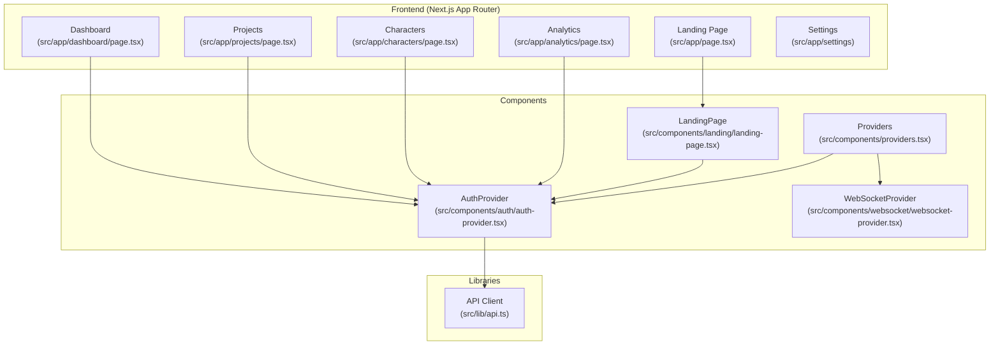
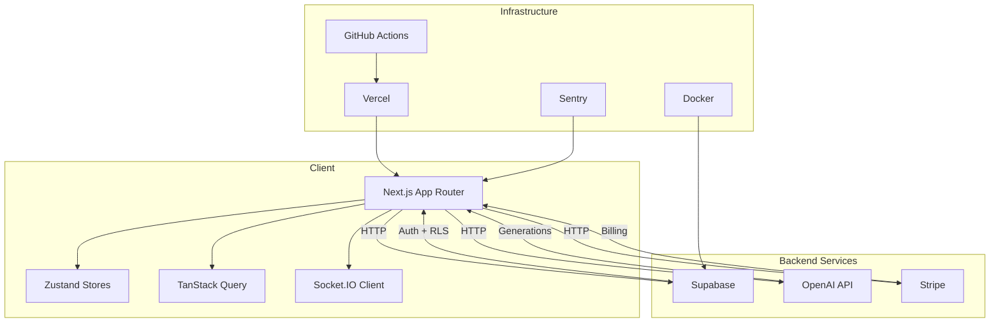
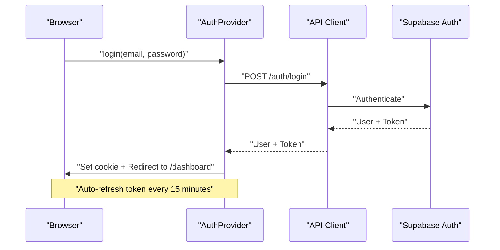
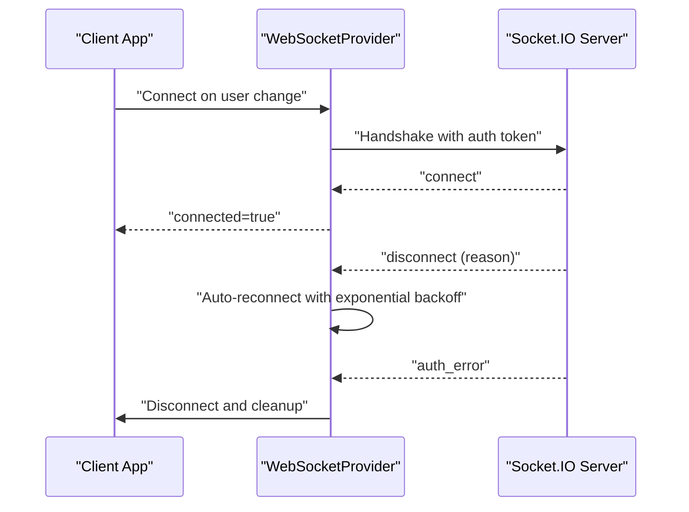
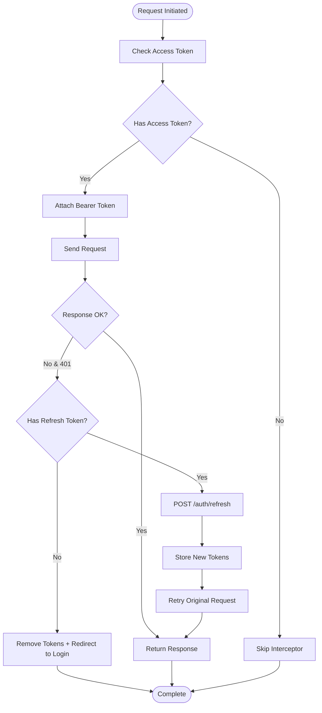
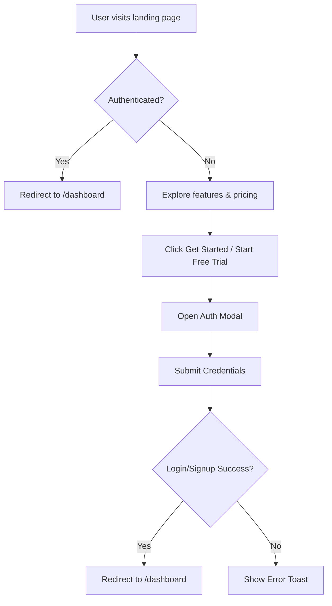
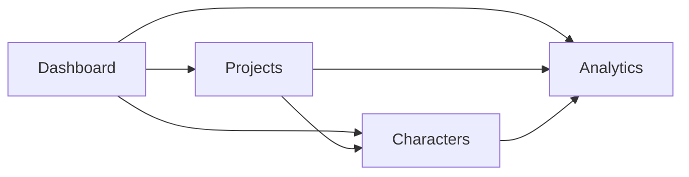
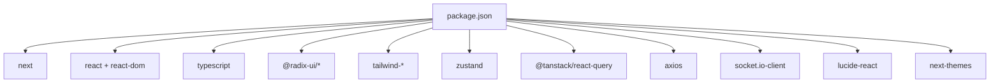

# Project Overview

<cite>
**Referenced Files in This Document**
- [README.md](file://README.md)
- [EXECUTIVE_SUMMARY.md](file://EXECUTIVE_SUMMARY.md)
- [package.json](file://package.json)
- [src/app/layout.tsx](file://src/app/layout.tsx)
- [src/app/page.tsx](file://src/app/page.tsx)
- [src/components/landing/landing-page.tsx](file://src/components/landing/landing-page.tsx)
- [src/components/auth/auth-provider.tsx](file://src/components/auth/auth-provider.tsx)
- [src/components/websocket/websocket-provider.tsx](file://src/components/websocket/websocket-provider.tsx)
- [src/lib/api.ts](file://src/lib/api.ts)
- [src/contexts/auth-context.tsx](file://src/contexts/auth-context.tsx)
- [src/components/providers.tsx](file://src/components/providers.tsx)
- [src/app/dashboard/page.tsx](file://src/app/dashboard/page.tsx)
- [src/app/projects/page.tsx](file://src/app/projects/page.tsx)
- [src/app/characters/page.tsx](file://src/app/characters/page.tsx)
- [src/app/analytics/page.tsx](file://src/app/analytics/page.tsx)
</cite>

## Table of Contents
1. [Introduction](#introduction)
2. [Project Structure](#project-structure)
3. [Core Components](#core-components)
4. [Architecture Overview](#architecture-overview)
5. [Detailed Component Analysis](#detailed-component-analysis)
6. [Dependency Analysis](#dependency-analysis)
7. [Performance Considerations](#performance-considerations)
8. [Troubleshooting Guide](#troubleshooting-guide)
9. [Conclusion](#conclusion)
10. [Appendices](#appendices)

## Introduction
WorldBest is an AI-powered writing platform designed to help authors and writers streamline their creative process. The platform centers on story bibles, AI-assisted content generation, real-time collaboration, and subscription billing. It targets authors who want professional-grade tools for organizing projects, managing characters, tracking progress, and generating content with AI personas tuned to specific genres and writing needs.

Key value propositions:
- Genre-aware AI drafting and editing to match voice and pacing
- Centralized story bibles and character relationship management
- Real-time collaboration for multi-author projects
- Transparent, flexible subscription tiers with trial periods
- Analytics and insights to optimize writing productivity

Competitive advantages:
- Specialized AI personas (Muse, Editor, Coach) tailored for narrative construction
- Integrated real-time collaboration infrastructure
- Strong focus on productivity metrics and habit-building features
- Modern, scalable architecture using proven technologies (Next.js, Supabase, Socket.IO)

## Project Structure
The project follows a Next.js 14 App Router structure with a clear separation of concerns:
- src/app: Page-based routes for landing, dashboard, projects, characters, analytics, and settings
- src/components: Reusable UI and feature components (auth, websocket, landing)
- src/contexts: Legacy context-based auth implementation
- src/lib: API client configuration and utilities
- src/styles: Global styling and themes
- packages: Shared UI components and types

**Diagram sources**
- [src/app/page.tsx](file://src/app/page.tsx#L1-L17)
- [src/app/dashboard/page.tsx](file://src/app/dashboard/page.tsx#L1-L260)
- [src/app/projects/page.tsx](file://src/app/projects/page.tsx#L1-L394)
- [src/app/characters/page.tsx](file://src/app/characters/page.tsx#L1-L512)
- [src/app/analytics/page.tsx](file://src/app/analytics/page.tsx#L1-L470)
- [src/components/landing/landing-page.tsx](file://src/components/landing/landing-page.tsx#L1-L438)
- [src/components/auth/auth-provider.tsx](file://src/components/auth/auth-provider.tsx#L1-L165)
- [src/components/websocket/websocket-provider.tsx](file://src/components/websocket/websocket-provider.tsx#L1-L138)
- [src/components/providers.tsx](file://src/components/providers.tsx#L1-L55)
- [src/lib/api.ts](file://src/lib/api.ts#L1-L67)

**Section sources**
- [README.md](file://README.md#L73-L104)
- [src/app/layout.tsx](file://src/app/layout.tsx#L1-L102)
- [src/app/page.tsx](file://src/app/page.tsx#L1-L17)

## Core Components
- Authentication system: JWT-based auth with cookie storage and token refresh; includes both legacy context-based implementation and modern provider-based implementation
- Real-time collaboration: WebSocket provider with automatic reconnection and auth error handling
- API client: Axios-based client with interceptors for auth and token refresh
- Providers: Centralized provider stack combining TanStack Query, ThemeProvider, AuthProvider, and WebSocketProvider
- Feature pages: Dashboard, Projects, Characters, Analytics, and Landing showcasing core workflows

Practical examples:
- Landing page presents pricing tiers and feature highlights for authors
- Dashboard aggregates project stats and quick actions
- Projects page organizes writing projects with filtering, sorting, and progress tracking
- Characters page manages character profiles, roles, MBTI, relationships, and AI suggestions
- Analytics page visualizes writing progress, project distribution, AI usage, and productivity insights

**Section sources**
- [src/components/landing/landing-page.tsx](file://src/components/landing/landing-page.tsx#L1-L438)
- [src/app/dashboard/page.tsx](file://src/app/dashboard/page.tsx#L1-L260)
- [src/app/projects/page.tsx](file://src/app/projects/page.tsx#L1-L394)
- [src/app/characters/page.tsx](file://src/app/characters/page.tsx#L1-L512)
- [src/app/analytics/page.tsx](file://src/app/analytics/page.tsx#L1-L470)
- [src/components/auth/auth-provider.tsx](file://src/components/auth/auth-provider.tsx#L1-L165)
- [src/components/websocket/websocket-provider.tsx](file://src/components/websocket/websocket-provider.tsx#L1-L138)
- [src/lib/api.ts](file://src/lib/api.ts#L1-L67)
- [src/components/providers.tsx](file://src/components/providers.tsx#L1-L55)

## Architecture Overview
The platform uses a modern full-stack architecture:
- Frontend: Next.js 14 App Router with React 18, TypeScript, Tailwind CSS, Radix UI
- State management: Zustand (client state) and TanStack Query (server state)
- Backend services: Supabase (database + auth), Socket.IO (real-time), OpenAI API (AI generation), Stripe (billing)
- Hosting: Vercel (frontend), Docker (optional backend), GitHub Actions (CI/CD)
- Monitoring: Sentry (error tracking), Web Vitals, custom metrics

**Diagram sources**
- [README.md](file://README.md#L49-L72)
- [package.json](file://package.json#L13-L62)
- [src/components/providers.tsx](file://src/components/providers.tsx#L1-L55)

**Section sources**
- [README.md](file://README.md#L49-L72)
- [EXECUTIVE_SUMMARY.md](file://EXECUTIVE_SUMMARY.md#L129-L151)
- [package.json](file://package.json#L13-L62)

## Detailed Component Analysis

### Authentication System
The authentication system supports both legacy context-based and modern provider-based implementations. It handles login, signup, logout, and token refresh, with robust error handling and user state management.

**Diagram sources**
- [src/components/auth/auth-provider.tsx](file://src/components/auth/auth-provider.tsx#L67-L141)
- [src/lib/api.ts](file://src/lib/api.ts#L24-L65)

**Section sources**
- [src/components/auth/auth-provider.tsx](file://src/components/auth/auth-provider.tsx#L1-L165)
- [src/contexts/auth-context.tsx](file://src/contexts/auth-context.tsx#L1-L154)
- [src/lib/api.ts](file://src/lib/api.ts#L1-L67)

### Real-Time Collaboration
The WebSocket provider establishes and maintains real-time connections with automatic reconnection and authentication error handling. It integrates with the auth context to ensure only authenticated users connect.

**Diagram sources**
- [src/components/websocket/websocket-provider.tsx](file://src/components/websocket/websocket-provider.tsx#L24-L93)

**Section sources**
- [src/components/websocket/websocket-provider.tsx](file://src/components/websocket/websocket-provider.tsx#L1-L138)

### API Client and Token Refresh
The API client centralizes HTTP requests with interceptors for adding Authorization headers and handling token refresh on 401 responses. It ensures consistent authentication across the application.

**Diagram sources**
- [src/lib/api.ts](file://src/lib/api.ts#L10-L65)

**Section sources**
- [src/lib/api.ts](file://src/lib/api.ts#L1-L67)

### Landing Page and Business Model
The landing page showcases the platform’s value to authors with clear pricing tiers and feature highlights. It drives conversion through social proof, testimonials, and prominent sign-up CTAs.

**Diagram sources**
- [src/app/page.tsx](file://src/app/page.tsx#L5-L16)
- [src/components/landing/landing-page.tsx](file://src/components/landing/landing-page.tsx#L127-L438)

**Section sources**
- [src/app/page.tsx](file://src/app/page.tsx#L1-L17)
- [src/components/landing/landing-page.tsx](file://src/components/landing/landing-page.tsx#L1-L438)

### Dashboard, Projects, Characters, Analytics
These pages demonstrate the platform’s core workflows:
- Dashboard: Aggregates stats, recent projects, and quick actions
- Projects: Lists, filters, sorts, and manages writing projects
- Characters: Manages character profiles, roles, MBTI, relationships, and AI suggestions
- Analytics: Visualizes writing progress, project distribution, AI usage, and productivity insights

**Diagram sources**
- [src/app/dashboard/page.tsx](file://src/app/dashboard/page.tsx#L53-L260)
- [src/app/projects/page.tsx](file://src/app/projects/page.tsx#L48-L394)
- [src/app/characters/page.tsx](file://src/app/characters/page.tsx#L70-L512)
- [src/app/analytics/page.tsx](file://src/app/analytics/page.tsx#L93-L470)

**Section sources**
- [src/app/dashboard/page.tsx](file://src/app/dashboard/page.tsx#L1-L260)
- [src/app/projects/page.tsx](file://src/app/projects/page.tsx#L1-L394)
- [src/app/characters/page.tsx](file://src/app/characters/page.tsx#L1-L512)
- [src/app/analytics/page.tsx](file://src/app/analytics/page.tsx#L1-L470)

## Dependency Analysis
The project relies on a cohesive set of dependencies:
- Frontend: Next.js, React, TypeScript, Radix UI, Tailwind CSS, Zustand, TanStack Query
- Real-time: Socket.IO client
- Utilities: Axios, date-fns, js-cookie, react-hook-form, zod, recharts
- Icons: lucide-react
- Theming: next-themes

**Diagram sources**
- [package.json](file://package.json#L13-L62)

**Section sources**
- [package.json](file://package.json#L1-L80)

## Performance Considerations
- Client-side caching: TanStack Query with sensible stale times and retry policies
- Bundle optimization: Use of lightweight libraries and tree-shaking via Next.js
- Real-time efficiency: WebSocket with exponential backoff and auth error handling
- Progressive enhancement: Feature-rich UI with graceful fallbacks

[No sources needed since this section provides general guidance]

## Troubleshooting Guide
Common issues and resolutions:
- Inconsistent token storage: Prefer one storage mechanism (cookies vs localStorage) to avoid conflicts
- Duplicate API clients: Consolidate to a single Axios instance with shared interceptors
- Fragile WebSocket authentication: Ensure token extraction and propagation are robust
- Missing error boundaries: Add global error boundaries and integrate Sentry for production error tracking
- Form validation: Use React Hook Form + Zod for comprehensive validation
- Real-time collaboration: Implement CRDT-based conflict resolution and optimistic updates

**Section sources**
- [README.md](file://README.md#L344-L356)
- [EXECUTIVE_SUMMARY.md](file://EXECUTIVE_SUMMARY.md#L38-L44)

## Conclusion
WorldBest is a modern, scalable AI-powered writing platform designed to serve authors with specialized tools for story bibles, AI-assisted content generation, real-time collaboration, and subscription billing. Its architecture leverages proven technologies and follows best practices for state management, real-time communication, and developer experience. With clear roadmaps, comprehensive testing strategies, and production-grade monitoring, the platform is positioned for rapid iteration and reliable growth.

[No sources needed since this section summarizes without analyzing specific files]

## Appendices
- Technology stack overview and confirmed decisions
- Implementation phases and priorities
- Go/no-go criteria for launch
- Post-launch plan and milestones

**Section sources**
- [EXECUTIVE_SUMMARY.md](file://EXECUTIVE_SUMMARY.md#L129-L151)
- [EXECUTIVE_SUMMARY.md](file://EXECUTIVE_SUMMARY.md#L246-L295)
- [EXECUTIVE_SUMMARY.md](file://EXECUTIVE_SUMMARY.md#L298-L343)