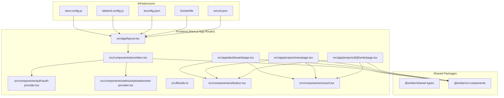
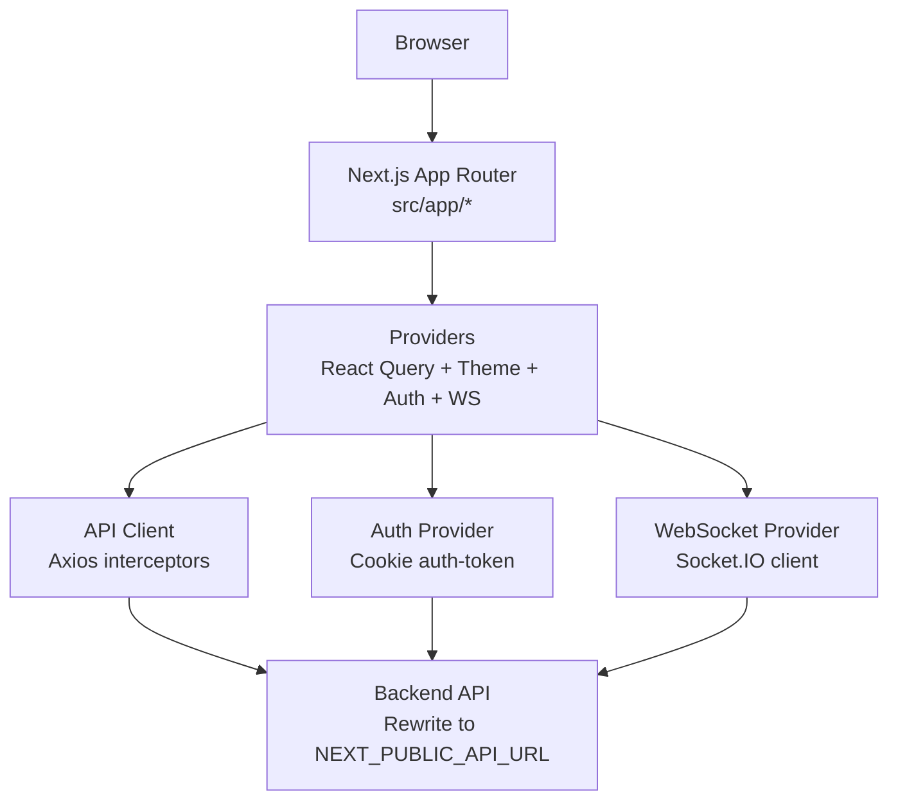
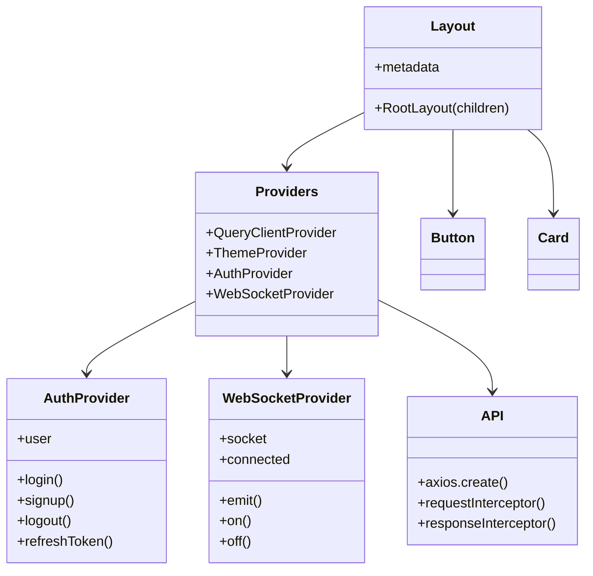
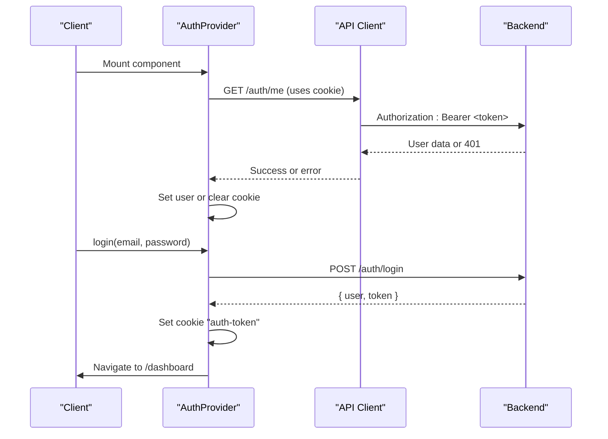
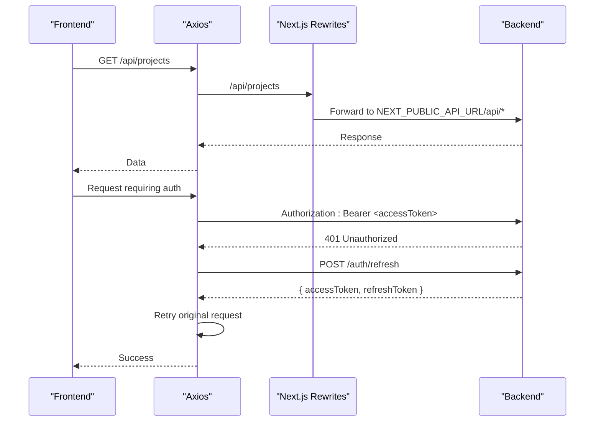
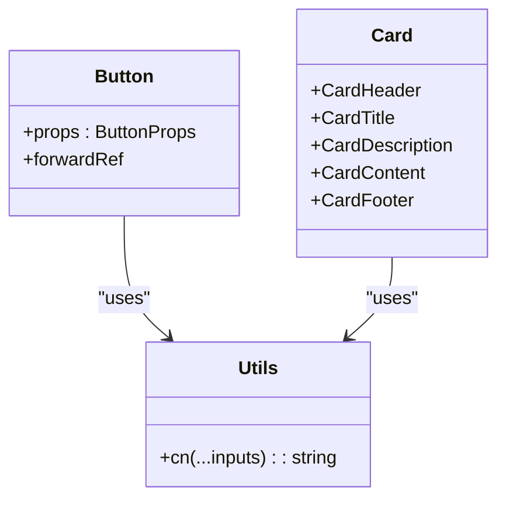
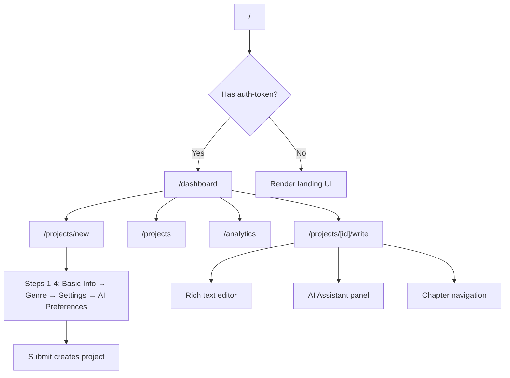
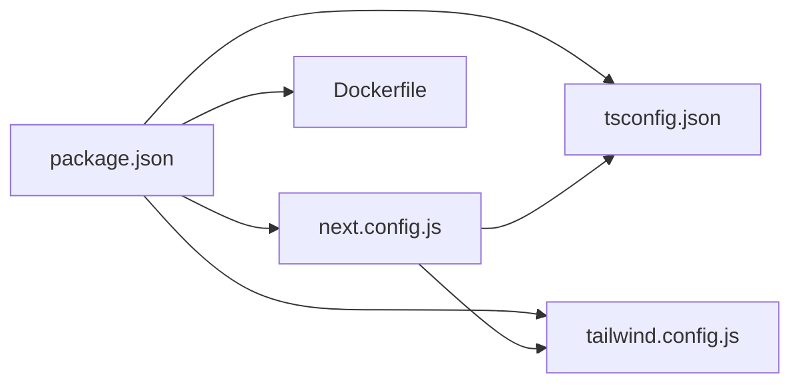

# Technology Stack

<cite>
**Referenced Files in This Document**
- [package.json](file://package.json)
- [next.config.js](file://next.config.js)
- [tsconfig.json](file://tsconfig.json)
- [tailwind.config.js](file://tailwind.config.js)
- [vercel.json](file://vercel.json)
- [Dockerfile](file://Dockerfile)
- [src/app/layout.tsx](file://src/app/layout.tsx)
- [src/components/providers.tsx](file://src/components/providers.tsx)
- [src/components/auth/auth-provider.tsx](file://src/components/auth/auth-provider.tsx)
- [src/components/websocket/websocket-provider.tsx](file://src/components/websocket/websocket-provider.tsx)
- [src/lib/api.ts](file://src/lib/api.ts)
- [src/lib/utils.ts](file://src/lib/utils.ts)
- [src/components/ui/button.tsx](file://src/components/ui/button.tsx)
- [src/components/ui/card.tsx](file://src/components/ui/card.tsx)
- [src/app/dashboard/page.tsx](file://src/app/dashboard/page.tsx)
- [src/app/projects/new/page.tsx](file://src/app/projects/new/page.tsx)
- [src/app/projects/[id]/write/page.tsx](file://src/app/projects/[id]/write/page.tsx)
</cite>

## Table of Contents
1. [Introduction](#introduction)
2. [Project Structure](#project-structure)
3. [Core Components](#core-components)
4. [Architecture Overview](#architecture-overview)
5. [Detailed Component Analysis](#detailed-component-analysis)
6. [Dependency Analysis](#dependency-analysis)
7. [Performance Considerations](#performance-considerations)
8. [Troubleshooting Guide](#troubleshooting-guide)
9. [Conclusion](#conclusion)
10. [Appendices](#appendices)

## Introduction
This document describes the complete technology stack for the WorldBest platform, focusing on the frontend, backend, and infrastructure. The frontend is built with Next.js 14 App Router, React 18, TypeScript 5.3, Tailwind CSS, and Radix UI. Backend services integrate with Supabase for database and authentication, Socket.IO for real-time features, OpenAI-compatible APIs for AI generation, and Stripe for billing. Infrastructure leverages Vercel for hosting, Docker for containerization, GitHub Actions for CI/CD, and Sentry for error tracking.

## Project Structure
The repository follows a monorepo-like structure with a Next.js application at the root and shared packages for types and UI components. Key areas:
- Application shell and routing under src/app
- Shared UI components and types under packages/
- Frontend providers for state, theming, auth, and WebSocket
- Tailwind CSS configuration and global styles
- Next.js configuration for rewrites, redirects, and environment variables
- Containerization and deployment artifacts

**Diagram sources**
- [src/app/layout.tsx](file://src/app/layout.tsx#L1-L102)
- [src/components/providers.tsx](file://src/components/providers.tsx#L1-L55)
- [src/components/auth/auth-provider.tsx](file://src/components/auth/auth-provider.tsx#L1-L165)
- [src/components/websocket/websocket-provider.tsx](file://src/components/websocket/websocket-provider.tsx#L1-L138)
- [src/lib/utils.ts](file://src/lib/utils.ts#L1-L6)
- [src/components/ui/button.tsx](file://src/components/ui/button.tsx#L1-L55)
- [src/components/ui/card.tsx](file://src/components/ui/card.tsx#L1-L78)
- [src/app/dashboard/page.tsx](file://src/app/dashboard/page.tsx#L1-L260)
- [src/app/projects/new/page.tsx](file://src/app/projects/new/page.tsx#L1-L555)
- [src/app/projects/[id]/write/page.tsx](file://src/app/projects/[id]/write/page.tsx#L1-L626)
- [next.config.js](file://next.config.js#L1-L56)
- [tailwind.config.js](file://tailwind.config.js#L1-L108)
- [tsconfig.json](file://tsconfig.json#L1-L38)
- [Dockerfile](file://Dockerfile#L1-L73)
- [vercel.json](file://vercel.json#L1-L4)

**Section sources**
- [package.json](file://package.json#L1-L80)
- [next.config.js](file://next.config.js#L1-L56)
- [tsconfig.json](file://tsconfig.json#L1-L38)
- [tailwind.config.js](file://tailwind.config.js#L1-L108)
- [vercel.json](file://vercel.json#L1-L4)
- [Dockerfile](file://Dockerfile#L1-L73)

## Core Components
- Next.js 14 App Router: Routing, metadata, and SSR/SSG via pages and app directory.
- React 18: Concurrent features, hooks, and component composition.
- TypeScript 5.3: Strict typing across the app and shared packages.
- Tailwind CSS + Radix UI: Utility-first styling and accessible UI primitives.
- Shared packages: @ember/shared-types and @ember/ui-components for cross-package reuse.
- Providers: React Query for caching and optimistic updates, Theme provider, Auth provider, and WebSocket provider.
- API client: Axios-based client with interceptors for auth and token refresh.
- Real-time: Socket.IO client integrated with auth cookies and exponential backoff.
- Pages: Dashboard, project creation wizard, and rich text writing interface.

**Section sources**
- [package.json](file://package.json#L13-L62)
- [src/components/providers.tsx](file://src/components/providers.tsx#L1-L55)
- [src/lib/api.ts](file://src/lib/api.ts#L1-L67)
- [src/components/websocket/websocket-provider.tsx](file://src/components/websocket/websocket-provider.tsx#L1-L138)
- [src/app/dashboard/page.tsx](file://src/app/dashboard/page.tsx#L1-L260)
- [src/app/projects/new/page.tsx](file://src/app/projects/new/page.tsx#L1-L555)
- [src/app/projects/[id]/write/page.tsx](file://src/app/projects/[id]/write/page.tsx#L1-L626)

## Architecture Overview
The frontend integrates multiple services:
- Authentication: Cookie-based session stored in auth-token; validated via API and refreshed automatically.
- Real-time: WebSocket connections using Socket.IO with auth headers and retry logic.
- API gateway: Next.js rewrites proxy requests to the backend API URL.
- Theming and UX: Next-themes, Radix UI, and Tailwind utilities.
- Infrastructure: Vercel-hosted Next.js app with Docker image for standalone builds.

**Diagram sources**
- [src/app/layout.tsx](file://src/app/layout.tsx#L1-L102)
- [src/components/providers.tsx](file://src/components/providers.tsx#L1-L55)
- [src/lib/api.ts](file://src/lib/api.ts#L1-L67)
- [src/components/auth/auth-provider.tsx](file://src/components/auth/auth-provider.tsx#L1-L165)
- [src/components/websocket/websocket-provider.tsx](file://src/components/websocket/websocket-provider.tsx#L1-L138)
- [next.config.js](file://next.config.js#L43-L51)

## Detailed Component Analysis

### Frontend Stack: Next.js 14 + React 18 + TypeScript + Tailwind + Radix UI
- Next.js App Router: Global metadata, fonts, and providers are configured in the root layout. Environment variables define public URLs for API and WebSocket.
- Providers: React Query client with retry policies, ThemeProvider for dark/light mode, AuthProvider for session management, and WebSocketProvider for real-time events.
- UI primitives: Tailwind utilities and Radix UI components (buttons, cards, inputs, labels, toasts) compose the interface.
- Utilities: clsx/tailwind-merge helper ensures responsive and composable class names.

**Diagram sources**
- [src/app/layout.tsx](file://src/app/layout.tsx#L1-L102)
- [src/components/providers.tsx](file://src/components/providers.tsx#L1-L55)
- [src/components/auth/auth-provider.tsx](file://src/components/auth/auth-provider.tsx#L1-L165)
- [src/components/websocket/websocket-provider.tsx](file://src/components/websocket/websocket-provider.tsx#L1-L138)
- [src/lib/api.ts](file://src/lib/api.ts#L1-L67)
- [src/components/ui/button.tsx](file://src/components/ui/button.tsx#L1-L55)
- [src/components/ui/card.tsx](file://src/components/ui/card.tsx#L1-L78)

**Section sources**
- [src/app/layout.tsx](file://src/app/layout.tsx#L1-L102)
- [src/components/providers.tsx](file://src/components/providers.tsx#L1-L55)
- [src/lib/utils.ts](file://src/lib/utils.ts#L1-L6)
- [src/components/ui/button.tsx](file://src/components/ui/button.tsx#L1-L55)
- [src/components/ui/card.tsx](file://src/components/ui/card.tsx#L1-L78)

### Authentication Flow
- Initialization: On mount, the provider reads the auth-token cookie and fetches user info.
- Login/Signup: Calls backend endpoints, stores auth-token cookie, and navigates to dashboard.
- Token refresh: Periodic refresh keeps sessions alive; on 401, attempts refresh and falls back to login.
- Logout: Clears cookie and redirects to home.

**Diagram sources**
- [src/components/auth/auth-provider.tsx](file://src/components/auth/auth-provider.tsx#L27-L49)
- [src/lib/api.ts](file://src/lib/api.ts#L39-L64)

**Section sources**
- [src/components/auth/auth-provider.tsx](file://src/components/auth/auth-provider.tsx#L1-L165)
- [src/lib/api.ts](file://src/lib/api.ts#L1-L67)

### Real-Time WebSocket Integration
- Connection: Uses Socket.IO client with auth headers derived from the auth-token cookie.
- Lifecycle: Tracks connect/disconnect/connect_error; handles auth_error; implements exponential backoff with capped retries.
- Hooks: Provides emit/on/off for components to subscribe to events.

```mermaid
flowchart TD
Start(["Mount WebSocketProvider"]) --> CheckUser{"Has user?"}
CheckUser --> |No| Disconnect["Disconnect socket if exists"] --> End
CheckUser --> |Yes| Connect["io(NEXT_PUBLIC_WS_URL, { auth: { token } })"]
Connect --> OnConnect["on('connect') set connected=true"]
Connect --> OnDisconnect["on('disconnect') handle reason"]
OnDisconnect --> ServerInit{"Server-initiated?"}
ServerInit --> |Yes| End
ServerInit --> |No| Retry["Exponential backoff until max attempts"]
Connect --> OnError["on('connect_error') log error"]
Connect --> OnAuthError["on('auth_error') disconnect"]
OnConnect --> Ready["Provider ready"]
Retry --> End
```

**Diagram sources**
- [src/components/websocket/websocket-provider.tsx](file://src/components/websocket/websocket-provider.tsx#L24-L93)

**Section sources**
- [src/components/websocket/websocket-provider.tsx](file://src/components/websocket/websocket-provider.tsx#L1-L138)

### API Client and Rewrites
- Axios client sets base URL from environment and injects Authorization header from localStorage.
- Response interceptor handles 401 by refreshing tokens and retrying the original request.
- Next.js rewrites proxy /api/* to NEXT_PUBLIC_API_URL, and redirects root to /dashboard when auth cookie is present.

**Diagram sources**
- [src/lib/api.ts](file://src/lib/api.ts#L3-L67)
- [next.config.js](file://next.config.js#L43-L51)

**Section sources**
- [src/lib/api.ts](file://src/lib/api.ts#L1-L67)
- [next.config.js](file://next.config.js#L24-L51)

### UI Components and Design System
- Button and Card components demonstrate Radix UI slots, class variance authority, and Tailwind utilities.
- cn helper merges classes safely, ensuring predictable overrides.

**Diagram sources**
- [src/components/ui/button.tsx](file://src/components/ui/button.tsx#L1-L55)
- [src/components/ui/card.tsx](file://src/components/ui/card.tsx#L1-L78)
- [src/lib/utils.ts](file://src/lib/utils.ts#L1-L6)

**Section sources**
- [src/components/ui/button.tsx](file://src/components/ui/button.tsx#L1-L55)
- [src/components/ui/card.tsx](file://src/components/ui/card.tsx#L1-L78)
- [src/lib/utils.ts](file://src/lib/utils.ts#L1-L6)

### Application Pages and Workflows
- Dashboard: Shows stats and recent projects; links to create new projects and navigate to analytics.
- New Project Wizard: Multi-step form configuring genre, audience, visibility, and AI preferences.
- Writing Interface: Rich text editor with toolbar, AI assistant panel, chapter navigation, and autosave.

**Diagram sources**
- [next.config.js](file://next.config.js#L28-L42)
- [src/app/dashboard/page.tsx](file://src/app/dashboard/page.tsx#L1-L260)
- [src/app/projects/new/page.tsx](file://src/app/projects/new/page.tsx#L1-L555)
- [src/app/projects/[id]/write/page.tsx](file://src/app/projects/[id]/write/page.tsx#L1-L626)

**Section sources**
- [src/app/dashboard/page.tsx](file://src/app/dashboard/page.tsx#L1-L260)
- [src/app/projects/new/page.tsx](file://src/app/projects/new/page.tsx#L1-L555)
- [src/app/projects/[id]/write/page.tsx](file://src/app/projects/[id]/write/page.tsx#L1-L626)

## Dependency Analysis
- Frontend dependencies include Next.js, React 18, Radix UI, Tailwind CSS, Socket.IO client, React Query, and others.
- TypeScript configuration enables strict mode, bundler module resolution, and path aliases.
- Tailwind scans app, components, and shared UI packages for class usage.
- Next.js configuration externalizes server-side packages, transpiles shared packages, defines image remote patterns, and exposes environment variables.

**Diagram sources**
- [package.json](file://package.json#L13-L62)
- [tsconfig.json](file://tsconfig.json#L24-L34)
- [tailwind.config.js](file://tailwind.config.js#L4-L8)
- [next.config.js](file://next.config.js#L3-L6)

**Section sources**
- [package.json](file://package.json#L1-L80)
- [tsconfig.json](file://tsconfig.json#L1-L38)
- [tailwind.config.js](file://tailwind.config.js#L1-L108)
- [next.config.js](file://next.config.js#L1-L56)
- [Dockerfile](file://Dockerfile#L1-L73)

## Performance Considerations
- Client caching: React Query default staleTime and retry policies reduce redundant network calls and improve resilience.
- Image optimization: Remote patterns configured for avatar and image domains; local MinIO proxy for localhost assets.
- Build optimization: Next.js transpilation of shared packages and serverComponentsExternalPackages for server-only modules.
- Bundle hygiene: Path aliases and strict TypeScript settings prevent unused code and enforce type safety.

[No sources needed since this section provides general guidance]

## Troubleshooting Guide
- Authentication issues:
  - Verify auth-token cookie presence and expiration.
  - Confirm refresh endpoint availability and token rotation.
- Real-time connectivity:
  - Check WebSocket URL and auth headers.
  - Review exponential backoff logs and disconnect reasons.
- API errors:
  - Inspect 401 responses and ensure token refresh flow executes.
  - Validate rewrites to NEXT_PUBLIC_API_URL.

**Section sources**
- [src/components/auth/auth-provider.tsx](file://src/components/auth/auth-provider.tsx#L51-L65)
- [src/components/websocket/websocket-provider.tsx](file://src/components/websocket/websocket-provider.tsx#L77-L86)
- [src/lib/api.ts](file://src/lib/api.ts#L24-L64)
- [next.config.js](file://next.config.js#L43-L51)

## Conclusion
The WorldBest frontend leverages a modern, scalable stack centered on Next.js 14 App Router, React 18, TypeScript, Tailwind CSS, and Radix UI. Providers encapsulate state, theming, auth, and real-time capabilities, while API and WebSocket clients integrate seamlessly with backend services. Infrastructure supports Vercel hosting and Docker-based deployments, enabling reliable CI/CD and observability.

[No sources needed since this section summarizes without analyzing specific files]

## Appendices

### Backend Services Integration Patterns
- Supabase: Database and authentication handled by backend; frontend authenticates via cookie and refresh tokens.
- Socket.IO: Real-time collaboration and notifications; client connects with auth headers and retries on disconnect.
- OpenAI API: AI generation flows are integrated into the writing interface; prompts and persona selection drive content creation.
- Stripe: Billing and subscription management are handled by backend; checkout and portal flows are exposed via API routes.

[No sources needed since this section provides general guidance]