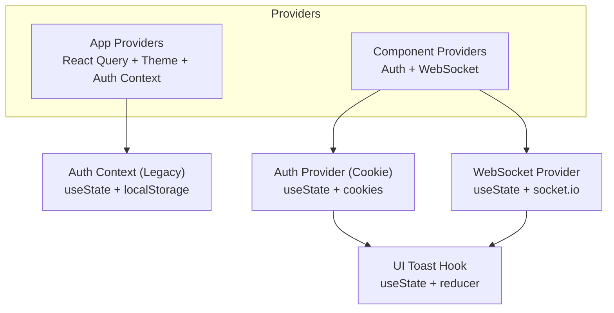
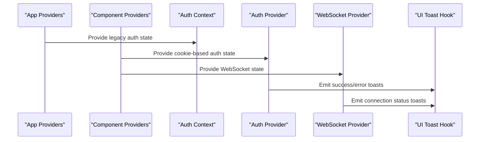
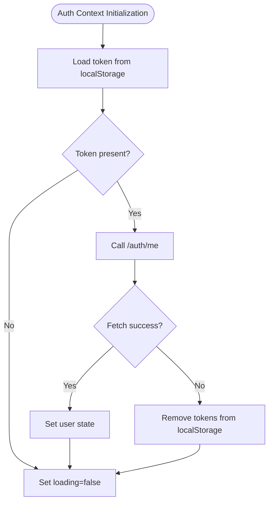
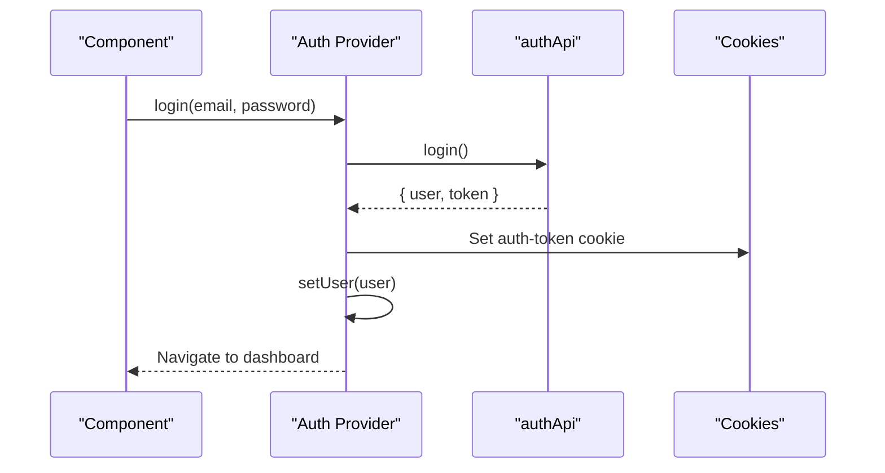
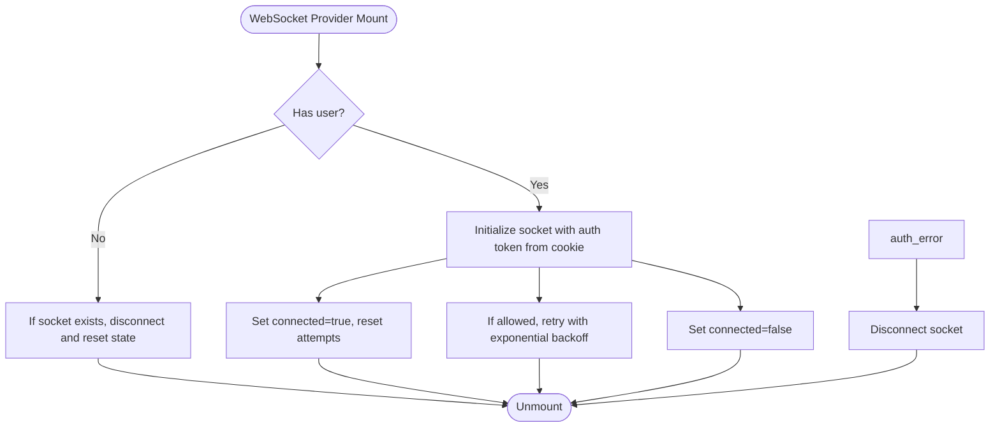
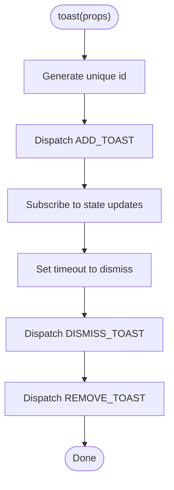
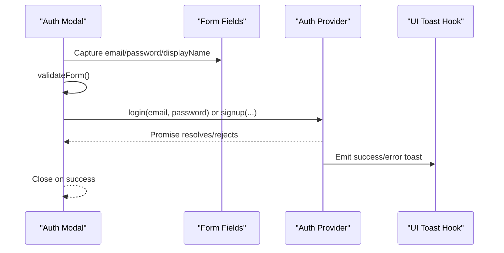
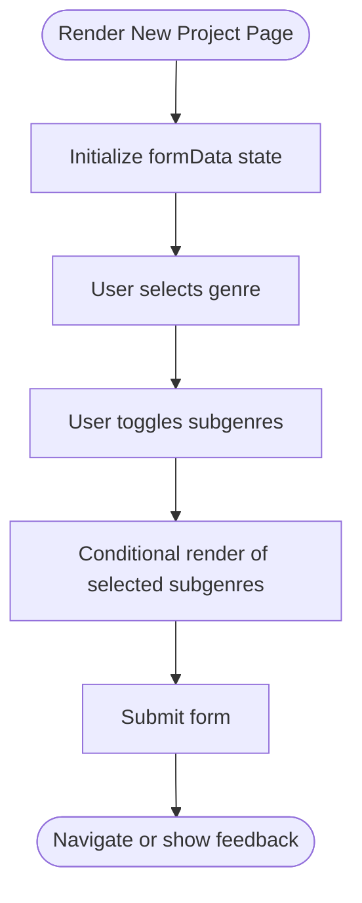
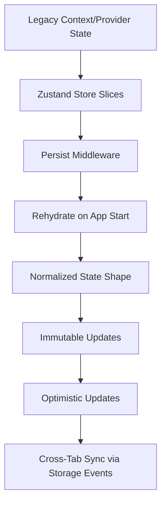
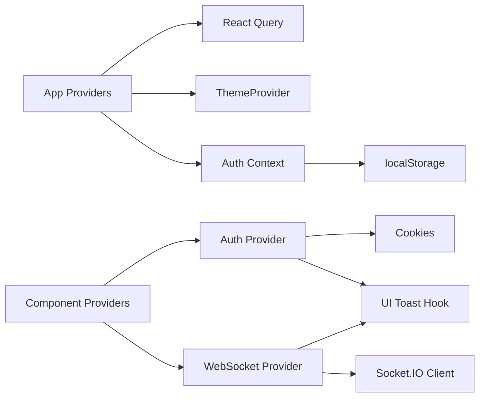

# Local State Management

<cite>
**Referenced Files in This Document**
- [README.md](file://README.md)
- [IMPLEMENTATION_PLAN.md](file://IMPLEMENTATION_PLAN.md)
- [src/app/providers.tsx](file://src/app/providers.tsx)
- [src/components/providers.tsx](file://src/components/providers.tsx)
- [src/contexts/auth-context.tsx](file://src/contexts/auth-context.tsx)
- [src/components/auth/auth-provider.tsx](file://src/components/auth/auth-provider.tsx)
- [src/components/websocket/websocket-provider.tsx](file://src/components/websocket/websocket-provider.tsx)
- [src/lib/api/client.ts](file://src/lib/api/client.ts)
- [src/components/auth/auth-modal.tsx](file://src/components/auth/auth-modal.tsx)
- [packages/ui-components/src/hooks/use-toast.ts](file://packages/ui-components/src/hooks/use-toast.ts)
- [src/app/projects/new/page.tsx](file://src/app/projects/new/page.tsx)
</cite>

## Table of Contents
1. [Introduction](#introduction)
2. [Project Structure](#project-structure)
3. [Core Components](#core-components)
4. [Architecture Overview](#architecture-overview)
5. [Detailed Component Analysis](#detailed-component-analysis)
6. [Dependency Analysis](#dependency-analysis)
7. [Performance Considerations](#performance-considerations)
8. [Troubleshooting Guide](#troubleshooting-guide)
9. [Conclusion](#conclusion)
10. [Appendices](#appendices)

## Introduction
This document explains local state management strategies in the WorldBest application. It covers:
- useState hooks and local component state
- UI state handling and form state management
- Integration points with React Query for server state
- Planned integration with Zustand for lightweight client-side state
- State persistence patterns, immutability considerations, and normalization techniques
- Practical examples drawn from the codebase
- Debugging approaches, performance optimization, and memory leak prevention
- State rehydration, localStorage integration, and cross-tab synchronization

## Project Structure
The application uses a layered structure:
- App-level providers wrap the entire app with React Query, theme switching, and authentication context
- Component-level providers add WebSocket connectivity alongside authentication
- Authentication is implemented via two complementary providers:
  - A legacy context-based provider in the app layer
  - A newer cookie-based provider in the components layer
- WebSocket provider manages connection lifecycle and emits/receives events
- UI toast notifications are centralized in a shared hook

**Diagram sources**
- [src/app/providers.tsx](file://src/app/providers.tsx#L9-L37)
- [src/components/providers.tsx](file://src/components/providers.tsx#L10-L55)
- [src/contexts/auth-context.tsx](file://src/contexts/auth-context.tsx#L30-L146)
- [src/components/auth/auth-provider.tsx](file://src/components/auth/auth-provider.tsx#L20-L157)
- [src/components/websocket/websocket-provider.tsx](file://src/components/websocket/websocket-provider.tsx#L17-L130)
- [packages/ui-components/src/hooks/use-toast.ts](file://packages/ui-components/src/hooks/use-toast.ts#L171-L189)

**Section sources**
- [README.md](file://README.md#L49-L72)
- [src/app/providers.tsx](file://src/app/providers.tsx#L1-L37)
- [src/components/providers.tsx](file://src/components/providers.tsx#L1-L55)

## Core Components
- Auth Context (legacy): Manages user session state with useState, handles login/signup/logout, token refresh, and localStorage-backed persistence. It also integrates with a toast notification system.
- Auth Provider (cookie-based): Manages user session state with useState, handles login/signup/logout, token refresh, and cookie-backed persistence. It also integrates with a toast notification system.
- WebSocket Provider: Manages socket connection state with useState, handles connect/disconnect/reconnect logic, and exposes emit/on/off APIs.
- UI Toast Hook: Centralized toast state management using a reducer and useState, with automatic cleanup and dismissal timers.

Key patterns:
- useState for local component state
- useEffect for side effects (auth initialization, token refresh, WebSocket lifecycle)
- Context providers for sharing state across components
- Local persistence via localStorage (legacy) and cookies (current)

**Section sources**
- [src/contexts/auth-context.tsx](file://src/contexts/auth-context.tsx#L30-L146)
- [src/components/auth/auth-provider.tsx](file://src/components/auth/auth-provider.tsx#L20-L157)
- [src/components/websocket/websocket-provider.tsx](file://src/components/websocket/websocket-provider.tsx#L17-L130)
- [packages/ui-components/src/hooks/use-toast.ts](file://packages/ui-components/src/hooks/use-toast.ts#L171-L189)

## Architecture Overview
The local state architecture combines:
- App-level providers for global concerns (theme, React Query)
- Component-level providers for domain-specific concerns (authentication, WebSocket)
- Contexts for state sharing
- Hooks for reusable state logic (toasts)

**Diagram sources**
- [src/app/providers.tsx](file://src/app/providers.tsx#L9-L37)
- [src/components/providers.tsx](file://src/components/providers.tsx#L10-L55)
- [src/contexts/auth-context.tsx](file://src/contexts/auth-context.tsx#L30-L146)
- [src/components/auth/auth-provider.tsx](file://src/components/auth/auth-provider.tsx#L20-L157)
- [src/components/websocket/websocket-provider.tsx](file://src/components/websocket/websocket-provider.tsx#L17-L130)
- [packages/ui-components/src/hooks/use-toast.ts](file://packages/ui-components/src/hooks/use-toast.ts#L171-L189)

## Detailed Component Analysis

### Auth Context (Legacy) Analysis
- Purpose: Manage user session state locally with useState, initialize from localStorage, and coordinate login/logout flows.
- State: user, loading
- Persistence: localStorage for tokens and Authorization header propagation
- Token refresh: periodic refresh via API, with fallback to logout on failure
- UI feedback: toast notifications for success/error messages

**Diagram sources**
- [src/contexts/auth-context.tsx](file://src/contexts/auth-context.tsx#L35-L55)

**Section sources**
- [src/contexts/auth-context.tsx](file://src/contexts/auth-context.tsx#L30-L146)

### Auth Provider (Cookie-Based) Analysis
- Purpose: Manage user session state locally with useState, initialize from cookies, and coordinate login/logout flows.
- State: user, loading
- Persistence: cookies for tokens and Authorization header propagation
- Token refresh: periodic refresh via API, with fallback to logout on failure
- UI feedback: toast notifications via shared hook

**Diagram sources**
- [src/components/auth/auth-provider.tsx](file://src/components/auth/auth-provider.tsx#L67-L89)
- [src/components/auth/auth-provider.tsx](file://src/components/auth/auth-provider.tsx#L133-L141)

**Section sources**
- [src/components/auth/auth-provider.tsx](file://src/components/auth/auth-provider.tsx#L20-L157)

### WebSocket Provider Analysis
- Purpose: Manage WebSocket connection state with useState, handle connect/disconnect/reconnect logic, and expose emit/on/off APIs.
- State: socket, connected
- Lifecycle: Connect when user is present; disconnect otherwise; auto-retry with exponential backoff; handle auth errors
- Cleanup: Disconnect socket on unmount

**Diagram sources**
- [src/components/websocket/websocket-provider.tsx](file://src/components/websocket/websocket-provider.tsx#L24-L93)

**Section sources**
- [src/components/websocket/websocket-provider.tsx](file://src/components/websocket/websocket-provider.tsx#L17-L138)

### UI Toast Hook Analysis
- Purpose: Centralized toast notifications with reducer-driven state updates and automatic dismissal timers.
- State: toasts array with immutable updates
- Patterns: ADD_TOAST, UPDATE_TOAST, DISMISS_TOAST, REMOVE_TOAST
- Memory safety: listeners cleanup on unmount

**Diagram sources**
- [packages/ui-components/src/hooks/use-toast.ts](file://packages/ui-components/src/hooks/use-toast.ts#L142-L169)
- [packages/ui-components/src/hooks/use-toast.ts](file://packages/ui-components/src/hooks/use-toast.ts#L171-L189)

**Section sources**
- [packages/ui-components/src/hooks/use-toast.ts](file://packages/ui-components/src/hooks/use-toast.ts#L74-L127)
- [packages/ui-components/src/hooks/use-toast.ts](file://packages/ui-components/src/hooks/use-toast.ts#L171-L189)

### Form State Management Example
- The authentication modal demonstrates local form state with useState for inputs and errors, validation with local checks, and submission flow that delegates to the auth provider.
- UI state toggles (loading, mode) are managed locally.

**Diagram sources**
- [src/components/auth/auth-modal.tsx](file://src/components/auth/auth-modal.tsx#L54-L72)
- [src/components/auth/auth-provider.tsx](file://src/components/auth/auth-provider.tsx#L67-L113)
- [packages/ui-components/src/hooks/use-toast.ts](file://packages/ui-components/src/hooks/use-toast.ts#L171-L189)

**Section sources**
- [src/components/auth/auth-modal.tsx](file://src/components/auth/auth-modal.tsx#L34-L83)

### UI State Handling Example
- The new project page demonstrates local UI state for genre selection and subgenre toggling using useState and conditional rendering. This is typical local component state for UI affordances.

**Diagram sources**
- [src/app/projects/new/page.tsx](file://src/app/projects/new/page.tsx#L229-L257)

**Section sources**
- [src/app/projects/new/page.tsx](file://src/app/projects/new/page.tsx#L229-L257)

### Planned Zustand Integration
The implementation plan outlines a structured migration toward Zustand for lightweight client-side state:
- Root store with combine pattern, devtools middleware, and persist middleware
- Auth slice: migrate from context/provider to Zustand slice with token management and auto-refresh
- Project slice: CRUD operations state, active project management, optimistic updates
- Editor slice: content state, version history, auto-save
- AI slice: generation queue, persona state, token usage tracking

**Diagram sources**
- [IMPLEMENTATION_PLAN.md](file://IMPLEMENTATION_PLAN.md#L30-L66)

**Section sources**
- [IMPLEMENTATION_PLAN.md](file://IMPLEMENTATION_PLAN.md#L30-L66)

## Dependency Analysis
- App Providers depend on:
  - React Query for server state caching
  - ThemeProvider for UI themes
  - Auth Context for legacy auth state
- Component Providers depend on:
  - Auth Provider for modern auth state
  - WebSocket Provider for real-time features
- Auth Context depends on:
  - localStorage for persistence
  - API client for server calls
  - Toast notifications for UX
- Auth Provider depends on:
  - Cookies for persistence
  - API client for server calls
  - Toast notifications for UX
- WebSocket Provider depends on:
  - Socket.IO client
  - Auth Provider for token retrieval
- Toast Hook depends on:
  - React state/reducer primitives
  - Timers for dismissal

**Diagram sources**
- [src/app/providers.tsx](file://src/app/providers.tsx#L9-L37)
- [src/components/providers.tsx](file://src/components/providers.tsx#L10-L55)
- [src/contexts/auth-context.tsx](file://src/contexts/auth-context.tsx#L30-L146)
- [src/components/auth/auth-provider.tsx](file://src/components/auth/auth-provider.tsx#L20-L157)
- [src/components/websocket/websocket-provider.tsx](file://src/components/websocket/websocket-provider.tsx#L17-L130)
- [packages/ui-components/src/hooks/use-toast.ts](file://packages/ui-components/src/hooks/use-toast.ts#L171-L189)

**Section sources**
- [src/app/providers.tsx](file://src/app/providers.tsx#L9-L37)
- [src/components/providers.tsx](file://src/components/providers.tsx#L10-L55)
- [src/contexts/auth-context.tsx](file://src/contexts/auth-context.tsx#L30-L146)
- [src/components/auth/auth-provider.tsx](file://src/components/auth/auth-provider.tsx#L20-L157)
- [src/components/websocket/websocket-provider.tsx](file://src/components/websocket/websocket-provider.tsx#L17-L130)
- [packages/ui-components/src/hooks/use-toast.ts](file://packages/ui-components/src/hooks/use-toast.ts#L171-L189)

## Performance Considerations
- Prefer local component state (useState) for UI-only concerns to minimize unnecessary re-renders
- Use memoization (e.g., useMemo/useCallback) around heavy computations or callbacks passed to child components
- Keep state normalized to avoid duplication and simplify updates
- Avoid frequent deep object updates; prefer immutable updates to preserve referential equality
- Debounce or throttle rapid UI state changes (e.g., search input) to reduce render pressure
- Limit the scope of state updates to the smallest possible component subtree
- Use React Query for server state caching to reduce redundant network requests
- Clean up timers, intervals, and subscriptions in useEffect cleanup functions

## Troubleshooting Guide
Common issues and remedies:
- Inconsistent token storage: The implementation plan identifies inconsistencies between localStorage and cookies. Standardize on cookies for auth tokens and ensure Authorization headers are set consistently.
- WebSocket authentication: Cookie parsing in the WebSocket provider is fragile. Use the dedicated auth provider to retrieve tokens reliably.
- Duplicate API client instances: Consolidate to a single Axios instance to avoid conflicting interceptors and headers.
- Missing error handling in forms: Implement consistent error display wrappers for form fields.
- Accessibility: Audit components for ARIA labels and keyboard navigation.

Debugging tips:
- Use React DevTools to inspect component state and hooks
- Enable React Query Devtools to observe cache behavior and query lifecycles
- Log state transitions in providers and reducers to trace unexpected updates
- Verify localStorage/cookies keys and expiration policies
- Monitor WebSocket connection events and reconnection attempts

**Section sources**
- [IMPLEMENTATION_PLAN.md](file://IMPLEMENTATION_PLAN.md#L884-L915)
- [src/components/websocket/websocket-provider.tsx](file://src/components/websocket/websocket-provider.tsx#L36-L47)
- [src/lib/api/client.ts](file://src/lib/api/client.ts#L18-L47)

## Conclusion
WorldBest currently relies on useState and contexts for local state, with React Query managing server state. The codebase is actively evolving toward a Zustand-based architecture for lightweight client-side state, with clear plans for slices covering auth, projects, editor, and AI domains. By adopting immutable updates, normalization, and robust persistence strategies, the application can achieve predictable state behavior, strong developer ergonomics, and excellent performance.

## Appendices

### State Persistence and Rehydration
- Legacy persistence: localStorage for tokens and Authorization header propagation
- Modern persistence: cookies for tokens and Authorization header propagation
- Rehydration: Initialize auth state on mount by reading persisted tokens and fetching user data
- Cross-tab sync: Use storage events to synchronize state across tabs when persistence is involved

**Section sources**
- [src/contexts/auth-context.tsx](file://src/contexts/auth-context.tsx#L35-L55)
- [src/components/auth/auth-provider.tsx](file://src/components/auth/auth-provider.tsx#L26-L49)
- [src/lib/api/client.ts](file://src/lib/api/client.ts#L18-L47)

### Immutability and Normalization Techniques
- Prefer immutable updates: Replace entire objects/arrays rather than mutating in place
- Normalize entities: Store arrays of entities keyed by ID to avoid duplication
- Use selectors: Derive views from normalized state to minimize recomputation
- Batch updates: Group related state changes to reduce intermediate renders

### Component Communication Patterns
- Context providers: Share state across component subtrees
- Event-driven: WebSocket provider emits and listens to events for real-time updates
- Local state: Parent components manage UI state and pass callbacks to children