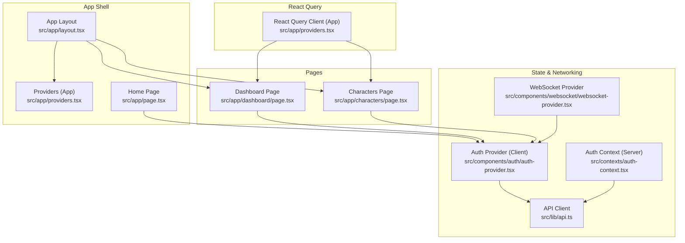
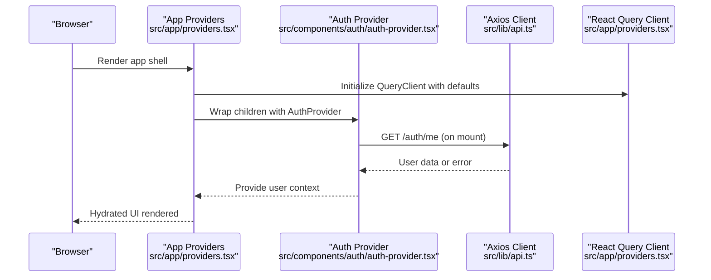
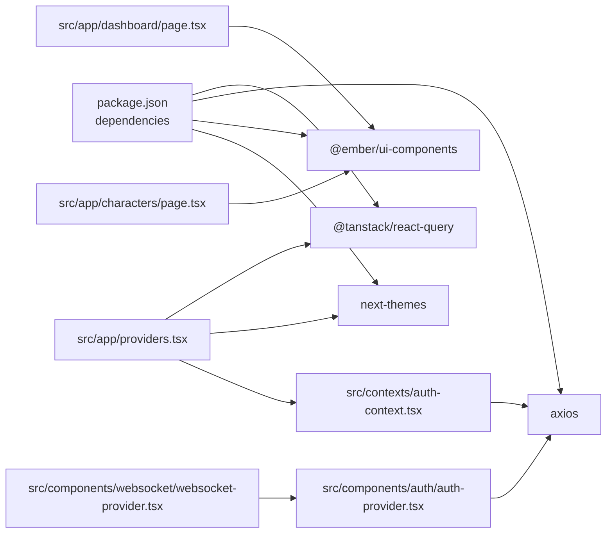

# Performance Optimization

<cite>
**Referenced Files in This Document**
- [next.config.js](file://next.config.js)
- [package.json](file://package.json)
- [src/app/providers.tsx](file://src/app/providers.tsx)
- [src/components/providers.tsx](file://src/components/providers.tsx)
- [src/lib/api.ts](file://src/lib/api.ts)
- [src/contexts/auth-context.tsx](file://src/contexts/auth-context.tsx)
- [src/components/auth/auth-provider.tsx](file://src/components/auth/auth-provider.tsx)
- [src/components/websocket/websocket-provider.tsx](file://src/components/websocket/websocket-provider.tsx)
- [src/app/dashboard/page.tsx](file://src/app/dashboard/page.tsx)
- [src/app/characters/page.tsx](file://src/app/characters/page.tsx)
- [src/app/page.tsx](file://src/app/page.tsx)
- [src/lib/utils.ts](file://src/lib/utils.ts)
</cite>

## Table of Contents
1. [Introduction](#introduction)
2. [Project Structure](#project-structure)
3. [Core Components](#core-components)
4. [Architecture Overview](#architecture-overview)
5. [Detailed Component Analysis](#detailed-component-analysis)
6. [Dependency Analysis](#dependency-analysis)
7. [Performance Considerations](#performance-considerations)
8. [Troubleshooting Guide](#troubleshooting-guide)
9. [Conclusion](#conclusion)
10. [Appendices](#appendices)

## Introduction
This document focuses on state management performance optimization in the WorldBest application. It explains caching strategies, memoization techniques, and lazy loading patterns. It documents React Query performance tuning, including query deduplication, background refetching, and cache size management. It also covers local state optimization using React.memo, useMemo, and useCallback hooks, along with examples of performance monitoring, bundle size optimization, hydration strategies, avoiding unnecessary re-renders, optimizing large datasets, and managing memory efficiently. Finally, it addresses debugging performance issues and implementing performance budgets.

## Project Structure
The application is a Next.js app with client-side providers for state and networking. Key areas relevant to performance:
- Providers encapsulate React Query, theme switching, authentication, and WebSocket connectivity.
- Pages demonstrate local state usage and UI rendering patterns.
- Shared packages provide UI components and types.

**Diagram sources**
- [src/app/layout.tsx](file://src/app/layout.tsx)
- [src/app/providers.tsx](file://src/app/providers.tsx)
- [src/app/page.tsx](file://src/app/page.tsx)
- [src/app/dashboard/page.tsx](file://src/app/dashboard/page.tsx)
- [src/app/characters/page.tsx](file://src/app/characters/page.tsx)
- [src/contexts/auth-context.tsx](file://src/contexts/auth-context.tsx)
- [src/components/auth/auth-provider.tsx](file://src/components/auth/auth-provider.tsx)
- [src/components/websocket/websocket-provider.tsx](file://src/components/websocket/websocket-provider.tsx)
- [src/lib/api.ts](file://src/lib/api.ts)

**Section sources**
- [next.config.js](file://next.config.js#L1-L56)
- [package.json](file://package.json#L1-L80)
- [src/app/providers.tsx](file://src/app/providers.tsx#L1-L37)
- [src/components/providers.tsx](file://src/components/providers.tsx#L1-L55)
- [src/app/page.tsx](file://src/app/page.tsx#L1-L17)

## Core Components
- React Query client configured with default query options for stale time and retry behavior.
- Authentication provider managing tokens via cookies and local storage, with periodic refresh.
- WebSocket provider handling connection lifecycle and reconnection with exponential backoff.
- Axios client with interceptors for auth token injection and automatic refresh flow.
- UI components from shared packages used across pages.

Key performance-relevant defaults:
- React Query staleTime reduces redundant network requests.
- Retry policies avoid retrying on client errors and cap attempts for server errors.
- WebSocket auto-reconnect with bounded attempts prevents tight loops.

**Section sources**
- [src/app/providers.tsx](file://src/app/providers.tsx#L9-L20)
- [src/components/providers.tsx](file://src/components/providers.tsx#L10-L36)
- [src/lib/api.ts](file://src/lib/api.ts#L1-L67)
- [src/components/websocket/websocket-provider.tsx](file://src/components/websocket/websocket-provider.tsx#L17-L93)

## Architecture Overview
The runtime state architecture centers around:
- Provider hierarchy: App-level providers wrap the entire app with React Query, theme, auth, and optional WebSocket.
- Local state: Pages maintain small, focused local state for UI controls and lightweight data.
- Remote state: React Query manages cached server data with explicit staleness and retry policies.
- Authentication: Dual-layer auth (server context and client provider) ensures robust hydration and refresh.
- Real-time updates: WebSocket provider connects when user is present and reconnects with backoff.

**Diagram sources**
- [src/app/providers.tsx](file://src/app/providers.tsx#L9-L20)
- [src/components/auth/auth-provider.tsx](file://src/components/auth/auth-provider.tsx#L20-L49)
- [src/lib/api.ts](file://src/lib/api.ts#L1-L67)

## Detailed Component Analysis

### React Query Performance Tuning
- Query defaults:
  - Stale time set to a short duration to balance freshness and reduced network load.
  - Refetch on window focus disabled to prevent unnecessary background refetches.
  - Retry policy configured to avoid retries on client errors and cap retry attempts for server errors.
- Mutation defaults mirror query retry behavior to keep error handling consistent.
- Devtools are included for inspection without enabling on initial render.

Recommendations:
- Use query keys that uniquely identify resources to leverage built-in deduplication.
- Prefer background refetching selectively for critical data and disable for low-priority lists.
- Monitor cache sizes and consider pagination or selective invalidation to bound memory usage.

**Section sources**
- [src/app/providers.tsx](file://src/app/providers.tsx#L10-L20)
- [src/components/providers.tsx](file://src/components/providers.tsx#L11-L36)

### Authentication State and Hydration
- Server context hydrates user from cookies on the server and stores tokens in local storage.
- Client provider sets cookies for session persistence and periodically refreshes tokens.
- Axios interceptors inject Authorization headers and handle token refresh on 401 responses.

Performance implications:
- Hydration avoids extra round trips by pre-validating tokens server-side.
- Token refresh via interceptors prevents repeated manual refresh logic.
- Periodic refresh reduces stale token errors and improves UX.

**Section sources**
- [src/contexts/auth-context.tsx](file://src/contexts/auth-context.tsx#L30-L55)
- [src/components/auth/auth-provider.tsx](file://src/components/auth/auth-provider.tsx#L20-L65)
- [src/lib/api.ts](file://src/lib/api.ts#L10-L65)

### WebSocket Connectivity and Memory Management
- Connects when a user exists; disconnects otherwise to save resources.
- Implements exponential backoff with a capped maximum and a fixed number of attempts.
- Emits and listens for events only when connected to avoid dangling listeners.

Recommendations:
- Scope event subscriptions to component lifecycles and clean up on unmount.
- Debounce frequent emits to reduce bandwidth and server load.
- Consider disabling auto-reconnect for sensitive flows and rely on explicit reconnect triggers.

**Section sources**
- [src/components/websocket/websocket-provider.tsx](file://src/components/websocket/websocket-provider.tsx#L17-L93)

### Local State Optimization Patterns
- Pages use minimal local state for UI controls and lightweight data.
- Avoid storing large immutable structures in component state; prefer React Query for remote data and local state for UI flags.

Techniques to adopt:
- Use React.memo for components that render large lists or static content.
- Use useMemo to compute derived data from props or state only when inputs change.
- Use useCallback to stabilize callbacks passed to child components to prevent unnecessary re-renders.

Note: Current pages demonstrate local state usage but do not yet apply React.memo/useMemo/useCallback. These can be introduced incrementally in components that render frequently or handle large datasets.

**Section sources**
- [src/app/dashboard/page.tsx](file://src/app/dashboard/page.tsx#L53-L57)
- [src/app/characters/page.tsx](file://src/app/characters/page.tsx#L70-L79)

### Bundle Size Optimization
- Transpile shared packages to align with the app’s runtime.
- Externalize server-side packages from server components to reduce server bundle size.
- Enable image optimization with remote patterns to avoid unnecessary bundling of unused assets.

Practical steps:
- Keep shared UI components lean and tree-shakeable.
- Prefer dynamic imports for heavy features not needed on initial load.
- Audit dependencies regularly and remove unused ones.

**Section sources**
- [next.config.js](file://next.config.js#L3-L6)
- [next.config.js](file://next.config.js#L7-L23)
- [package.json](file://package.json#L13-L62)

### Hydration Strategies
- Server-side hydration validates tokens and renders the home page accordingly.
- Client-side auth provider initializes from cookies and refreshes tokens periodically.
- Theme provider disables transition on change to minimize FOUC.

Recommendations:
- Ensure hydration mismatches are avoided by serializing state consistently.
- Defer non-critical UI updates until after hydration to improve TTFB.

**Section sources**
- [src/app/page.tsx](file://src/app/page.tsx#L5-L17)
- [src/components/auth/auth-provider.tsx](file://src/components/auth/auth-provider.tsx#L26-L49)
- [src/app/providers.tsx](file://src/app/providers.tsx#L22-L34)

### Large Dataset Rendering
- The characters page demonstrates filtering and rendering a grid of cards.
- Recommendations:
  - Virtualize long lists using libraries designed for large datasets.
  - Paginate or infinite scroll to limit DOM nodes.
  - Memoize computed filters and derived arrays to avoid recomputation.

**Section sources**
- [src/app/characters/page.tsx](file://src/app/characters/page.tsx#L187-L196)

### Caching Strategies
- React Query caches query results with configurable staleness and background refetch policies.
- Axios caches are not used; rely on React Query for remote data caching.
- Local component caches can be introduced using useMemo for derived computations.

**Section sources**
- [src/app/providers.tsx](file://src/app/providers.tsx#L13-L18)
- [src/components/providers.tsx](file://src/components/providers.tsx#L13-L25)

### Memoization Techniques
- Use React.memo for pure components that render frequently.
- Use useMemo to compute expensive derived values only when inputs change.
- Use useCallback to keep event handlers and callbacks referentially stable across renders.

Note: These techniques are not currently applied in the analyzed pages and can be introduced gradually.

**Section sources**
- [src/app/dashboard/page.tsx](file://src/app/dashboard/page.tsx#L198-L318)
- [src/app/characters/page.tsx](file://src/app/characters/page.tsx#L198-L318)

### Lazy Loading Patterns
- Dynamic imports for routes and heavy components.
- Skeleton loaders and deferred rendering for non-critical content.

Recommendations:
- Split large pages into route segments and load lazily.
- Use Suspense boundaries to manage loading states.

**Section sources**
- [src/app/characters/page.tsx](file://src/app/characters/page.tsx#L449-L453)

## Dependency Analysis
The following diagram shows key runtime dependencies and their roles in performance:

**Diagram sources**
- [package.json](file://package.json#L13-L62)
- [src/app/providers.tsx](file://src/app/providers.tsx#L3-L36)
- [src/contexts/auth-context.tsx](file://src/contexts/auth-context.tsx#L6-L6)
- [src/components/auth/auth-provider.tsx](file://src/components/auth/auth-provider.tsx#L6-L6)
- [src/components/websocket/websocket-provider.tsx](file://src/components/websocket/websocket-provider.tsx#L4-L4)
- [src/app/dashboard/page.tsx](file://src/app/dashboard/page.tsx#L5-L5)
- [src/app/characters/page.tsx](file://src/app/characters/page.tsx#L5-L5)

**Section sources**
- [package.json](file://package.json#L13-L62)
- [src/app/providers.tsx](file://src/app/providers.tsx#L1-L37)
- [src/components/providers.tsx](file://src/components/providers.tsx#L1-L55)

## Performance Considerations
- Query deduplication: React Query automatically deduplicates identical queries; ensure unique query keys for distinct resources.
- Background refetching: Enable for critical data; disable for non-critical lists to reduce network churn.
- Cache size management: Use pagination, selective invalidation, and cache timeouts to bound memory usage.
- Avoid unnecessary re-renders: Apply React.memo, useMemo, and useCallback judiciously.
- Optimize large datasets: Virtualize lists, paginate, and memoize derived computations.
- Memory efficiency: Disconnect WebSockets when user logs out, and clear intervals on unmount.
- Bundle size: Transpile shared packages, externalize server-only packages, and audit dependencies.
- Hydration: Ensure consistent server/client state to avoid hydration mismatches.

[No sources needed since this section provides general guidance]

## Troubleshooting Guide
Common performance issues and remedies:
- Slow initial loads:
  - Verify transpiled packages and externalized server packages.
  - Use dynamic imports for non-critical routes.
- Excessive network requests:
  - Adjust staleTime and refetchOnWindowFocus in React Query defaults.
  - Review retry policies to avoid retry storms.
- Frequent re-renders:
  - Introduce React.memo for static components.
  - Use useMemo for derived data and useCallback for event handlers.
- Memory leaks:
  - Ensure WebSocket cleanup on unmount and user logout.
  - Clear intervals and timers in useEffect cleanup.
- Auth token errors:
  - Confirm interceptors update Authorization headers after refresh.
  - Validate cookie-based hydration and periodic refresh logic.

**Section sources**
- [next.config.js](file://next.config.js#L3-L6)
- [src/app/providers.tsx](file://src/app/providers.tsx#L13-L18)
- [src/lib/api.ts](file://src/lib/api.ts#L10-L65)
- [src/components/websocket/websocket-provider.tsx](file://src/components/websocket/websocket-provider.tsx#L90-L93)
- [src/components/auth/auth-provider.tsx](file://src/components/auth/auth-provider.tsx#L51-L65)

## Conclusion
WorldBest’s current architecture establishes strong foundations for performance through React Query defaults, robust authentication with token refresh, and a structured provider hierarchy. To further optimize, introduce React.memo/useMemo/useCallback for hot paths, virtualize large lists, refine query keys and cache policies, and monitor bundle size and hydration stability. These incremental improvements will yield measurable gains in interactivity, responsiveness, and resource efficiency.

[No sources needed since this section summarizes without analyzing specific files]

## Appendices
- Performance monitoring checklist:
  - Measure LCP, FID, CLS, and TTFB across routes.
  - Track query hit rates and cache sizes.
  - Observe WebSocket connection stability and reconnection metrics.
- Performance budgets:
  - Set limits for bundle size per route segment.
  - Cap the number of concurrent queries and WebSocket connections.
  - Enforce memoization thresholds for derived computations.

[No sources needed since this section provides general guidance]