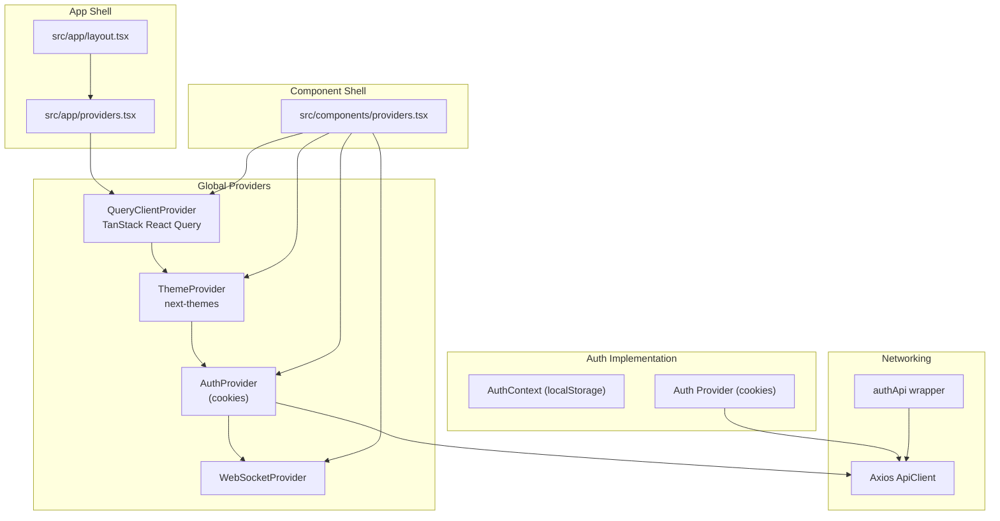
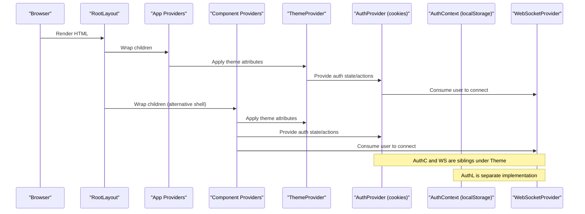
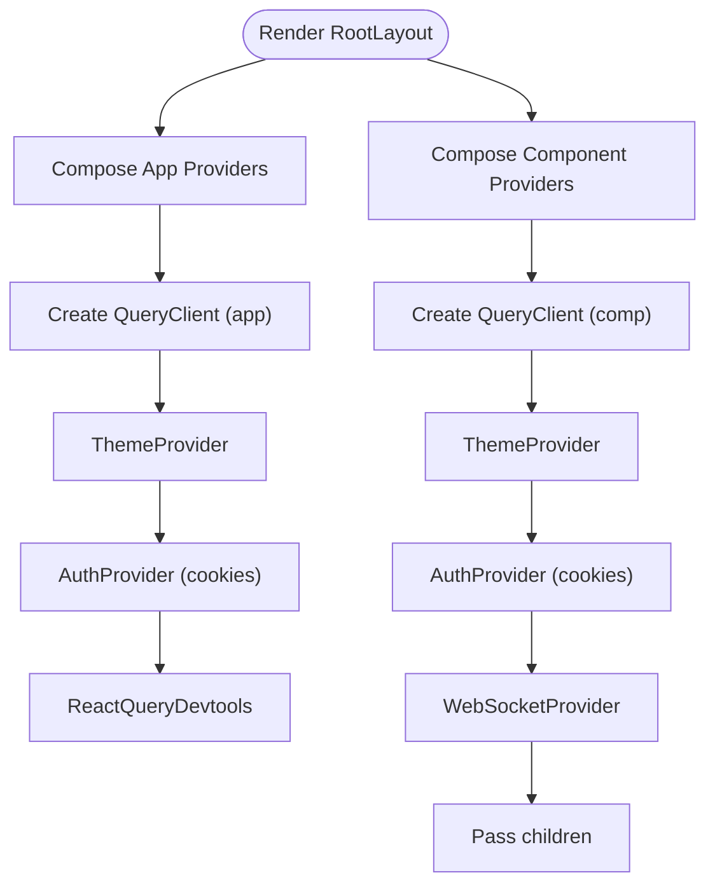
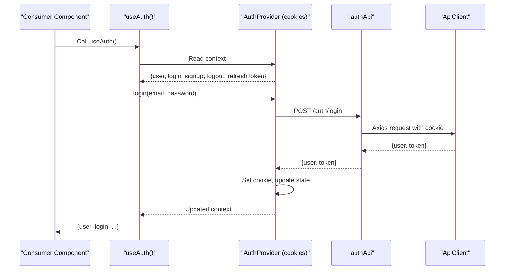
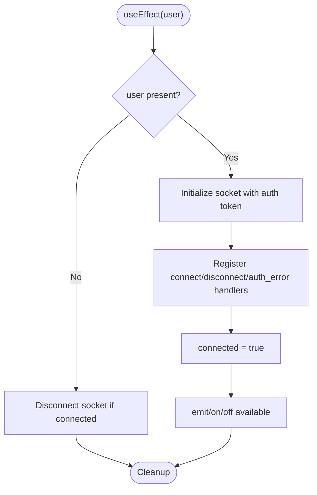
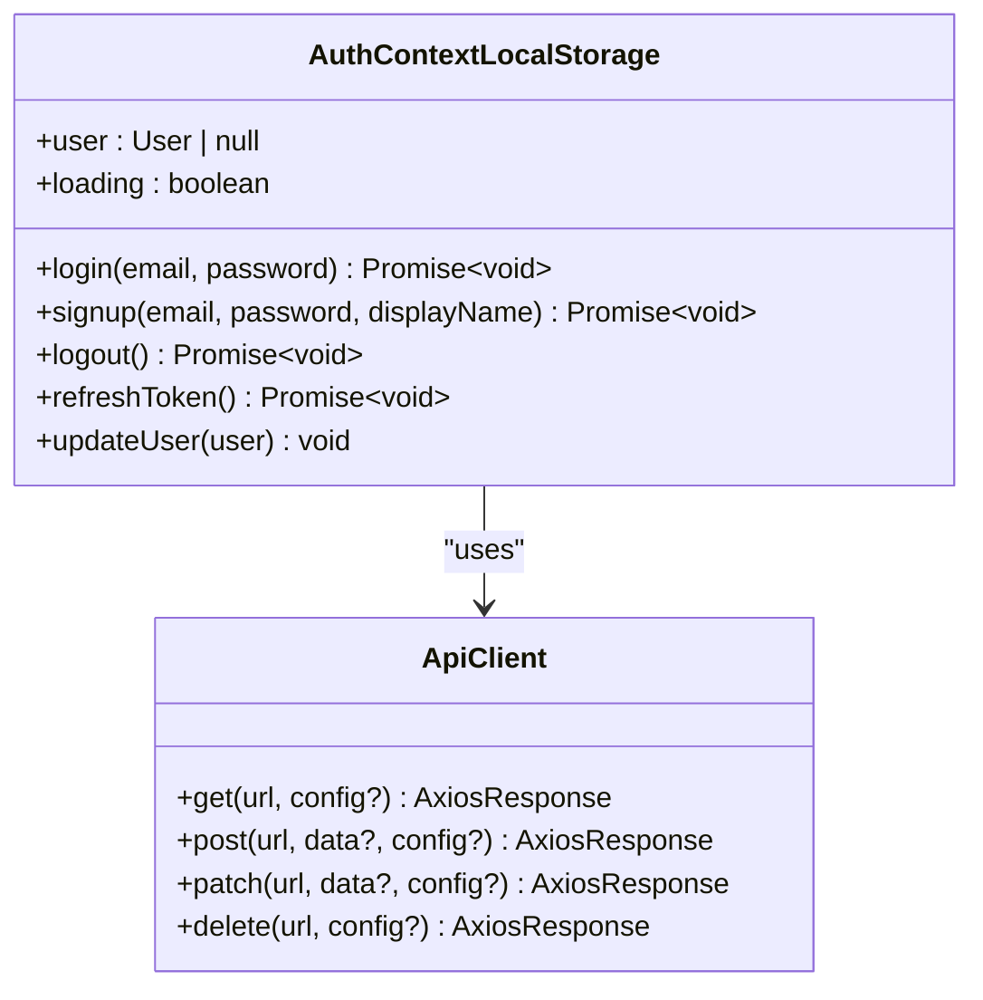
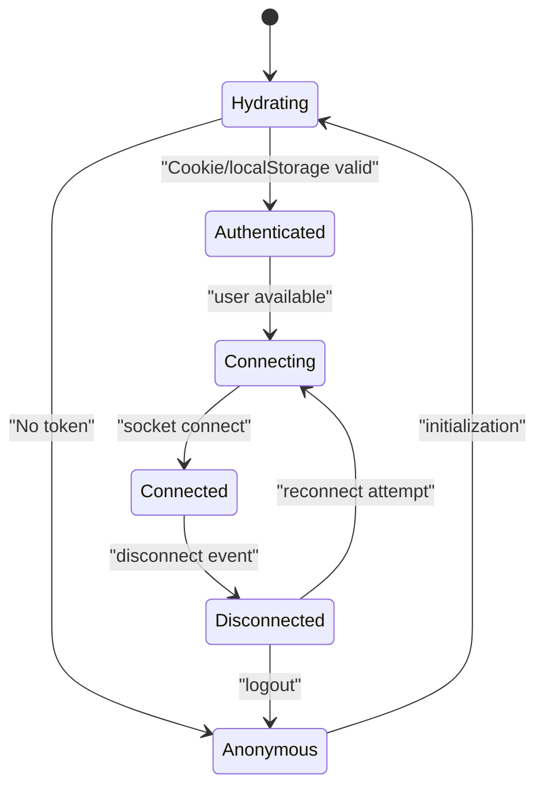
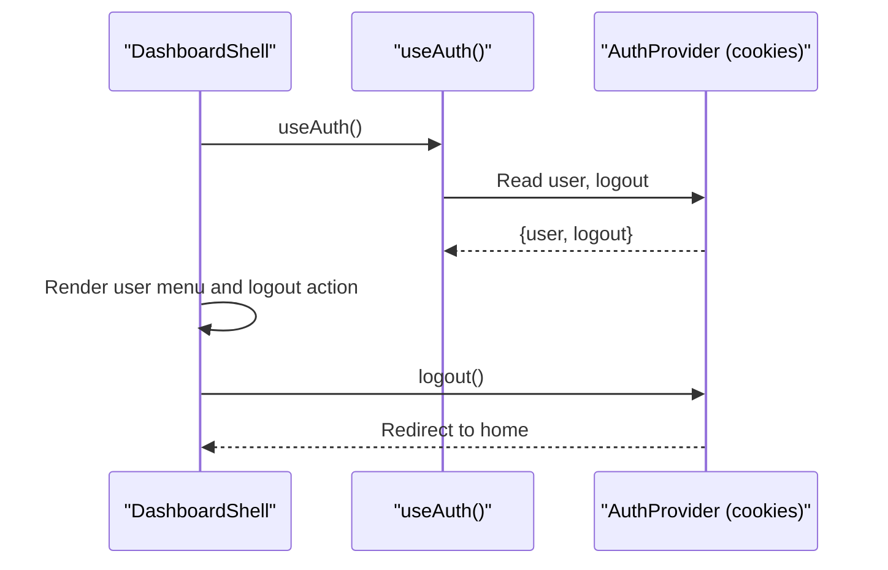
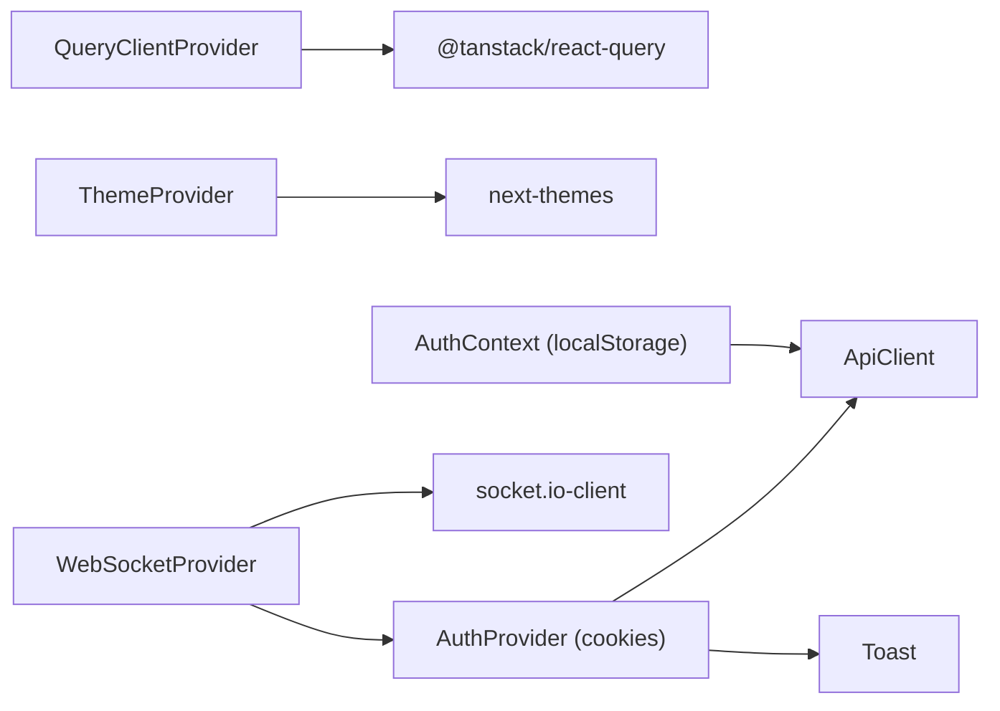

# Provider Pattern Architecture

<cite>
**Referenced Files in This Document**
- [src/app/providers.tsx](file://src/app/providers.tsx)
- [src/components/providers.tsx](file://src/components/providers.tsx)
- [src/app/layout.tsx](file://src/app/layout.tsx)
- [src/components/auth/auth-provider.tsx](file://src/components/auth/auth-provider.tsx)
- [src/contexts/auth-context.tsx](file://src/contexts/auth-context.tsx)
- [src/components/websocket/websocket-provider.tsx](file://src/components/websocket/websocket-provider.tsx)
- [src/lib/api/auth.ts](file://src/lib/api/auth.ts)
- [src/lib/api/client.ts](file://src/lib/api/client.ts)
- [src/components/dashboard/dashboard-shell.tsx](file://src/components/dashboard/dashboard-shell.tsx)
- [src/components/auth/auth-modal.tsx](file://src/components/auth/auth-modal.tsx)
- [src/app/page.tsx](file://src/app/page.tsx)
</cite>

## Table of Contents
1. [Introduction](#introduction)
2. [Project Structure](#project-structure)
3. [Core Components](#core-components)
4. [Architecture Overview](#architecture-overview)
5. [Detailed Component Analysis](#detailed-component-analysis)
6. [Dependency Analysis](#dependency-analysis)
7. [Performance Considerations](#performance-considerations)
8. [Troubleshooting Guide](#troubleshooting-guide)
9. [Conclusion](#conclusion)

## Introduction
This document explains the provider pattern architecture used throughout the application. It focuses on the hierarchical provider structure starting from the root Providers component, detailing how QueryClientProvider, ThemeProvider, and AuthProvider collaborate to manage global state. It also documents the provider composition pattern, dependency injection across the component tree, lifecycle and initialization order, cleanup processes, and performance implications. Practical examples demonstrate provider usage, context consumption, and state sharing between components.

## Project Structure
The provider pattern is implemented at two levels:
- Application-level provider composition in the app directory
- Component-level provider composition in the components directory

Key files:
- Root provider composition and hydration guard in the app layout
- Global providers for state management, theming, and networking
- Auth providers with dual implementations (one using cookies, another using local storage)
- WebSocket provider consuming auth state to establish connections
- API client with interceptors for token management and retries

**Diagram sources**
- [src/app/layout.tsx](file://src/app/layout.tsx#L1-L102)
- [src/app/providers.tsx](file://src/app/providers.tsx#L1-L37)
- [src/components/providers.tsx](file://src/components/providers.tsx#L1-L55)
- [src/components/auth/auth-provider.tsx](file://src/components/auth/auth-provider.tsx#L1-L165)
- [src/contexts/auth-context.tsx](file://src/contexts/auth-context.tsx#L1-L154)
- [src/lib/api/client.ts](file://src/lib/api/client.ts#L1-L138)
- [src/lib/api/auth.ts](file://src/lib/api/auth.ts#L1-L101)

**Section sources**
- [src/app/layout.tsx](file://src/app/layout.tsx#L1-L102)
- [src/app/providers.tsx](file://src/app/providers.tsx#L1-L37)
- [src/components/providers.tsx](file://src/components/providers.tsx#L1-L55)

## Core Components
- QueryClientProvider: Centralizes caching, background updates, and retry policies for data fetching via TanStack React Query.
- ThemeProvider: Manages theme switching and persistence using next-themes.
- AuthProvider (cookies): Provides authentication state, login/signup/logout, and periodic token refresh using cookies.
- WebSocketProvider: Establishes and manages a real-time connection using socket.io, consuming auth state to connect/disconnect.
- AuthContext (localStorage): Alternative auth implementation using localStorage and API routes for token management.

These components form a layered dependency graph where AuthProvider and WebSocketProvider depend on the presence of QueryClientProvider and ThemeProvider higher in the tree.

**Section sources**
- [src/app/providers.tsx](file://src/app/providers.tsx#L3-L36)
- [src/components/providers.tsx](file://src/components/providers.tsx#L3-L36)
- [src/components/auth/auth-provider.tsx](file://src/components/auth/auth-provider.tsx#L1-L165)
- [src/contexts/auth-context.tsx](file://src/contexts/auth-context.tsx#L1-L154)
- [src/components/websocket/websocket-provider.tsx](file://src/components/websocket/websocket-provider.tsx#L1-L138)

## Architecture Overview
The provider hierarchy ensures that:
- Global state (queries, theme, auth, websockets) is initialized once per page load.
- Child components consume context via hooks to access shared state and actions.
- Cleanup is performed automatically when components unmount (e.g., WebSocket disconnect, intervals cleared).

**Diagram sources**
- [src/app/layout.tsx](file://src/app/layout.tsx#L83-L99)
- [src/app/providers.tsx](file://src/app/providers.tsx#L9-L36)
- [src/components/providers.tsx](file://src/components/providers.tsx#L10-L54)
- [src/components/auth/auth-provider.tsx](file://src/components/auth/auth-provider.tsx#L20-L49)
- [src/contexts/auth-context.tsx](file://src/contexts/auth-context.tsx#L30-L55)
- [src/components/websocket/websocket-provider.tsx](file://src/components/websocket/websocket-provider.tsx#L17-L93)

## Detailed Component Analysis

### Root Providers Composition
- App-level Providers composes QueryClientProvider, ThemeProvider, and AuthProvider.
- A second Providers composition exists at the component level, adding WebSocketProvider alongside AuthProvider.
- Both compositions define QueryClient configuration with cache policies and retry strategies.

**Diagram sources**
- [src/app/providers.tsx](file://src/app/providers.tsx#L9-L36)
- [src/components/providers.tsx](file://src/components/providers.tsx#L10-L54)

**Section sources**
- [src/app/providers.tsx](file://src/app/providers.tsx#L9-L36)
- [src/components/providers.tsx](file://src/components/providers.tsx#L10-L54)

### Auth Provider (Cookies) and Context Consumption
- Initializes auth state by reading a cookie and validating against the backend.
- Periodically refreshes tokens and handles logout on failures.
- Exposes login, signup, logout, and refreshToken actions to consumers.
- Components consume auth via a dedicated hook and receive user state and actions.

**Diagram sources**
- [src/components/auth/auth-provider.tsx](file://src/components/auth/auth-provider.tsx#L20-L156)
- [src/lib/api/auth.ts](file://src/lib/api/auth.ts#L25-L55)
- [src/lib/api/client.ts](file://src/lib/api/client.ts#L18-L81)

**Section sources**
- [src/components/auth/auth-provider.tsx](file://src/components/auth/auth-provider.tsx#L20-L156)
- [src/lib/api/auth.ts](file://src/lib/api/auth.ts#L25-L55)
- [src/lib/api/client.ts](file://src/lib/api/client.ts#L18-L81)

### WebSocket Provider and Conditional Connection
- Consumes auth state to connect/disconnect the WebSocket.
- Uses cookies to pass authentication to the server.
- Implements exponential backoff for reconnection attempts.
- Exposes emit/on/off APIs for event-driven communication.

**Diagram sources**
- [src/components/websocket/websocket-provider.tsx](file://src/components/websocket/websocket-provider.tsx#L17-L93)

**Section sources**
- [src/components/websocket/websocket-provider.tsx](file://src/components/websocket/websocket-provider.tsx#L17-L138)

### Alternative Auth Implementation (LocalStorage)
- An alternate AuthContext implementation stores tokens in localStorage and uses API routes for authentication.
- Provides similar actions (login, signup, logout, refreshToken) and exposes a hook for consumption.
- Useful when the application needs to support multiple auth strategies or environments.

**Diagram sources**
- [src/contexts/auth-context.tsx](file://src/contexts/auth-context.tsx#L18-L145)
- [src/lib/api/client.ts](file://src/lib/api/client.ts#L83-L101)

**Section sources**
- [src/contexts/auth-context.tsx](file://src/contexts/auth-context.tsx#L18-L145)
- [src/lib/api/client.ts](file://src/lib/api/client.ts#L83-L101)

### Provider Lifecycle, Initialization Order, and Cleanup
- Initialization order:
  1) QueryClientProvider initializes the cache manager.
  2) ThemeProvider applies theme attributes and persists preferences.
  3) AuthProvider hydrates from cookies/localStorage and sets up token refresh intervals.
  4) WebSocketProvider connects after user becomes available and disconnects otherwise.
- Cleanup:
  - WebSocketProvider disconnects sockets on unmount and when user logs out.
  - AuthProvider clears intervals on unmount.
  - Axios interceptors clean up on logout and redirect to the home route.

**Diagram sources**
- [src/components/auth/auth-provider.tsx](file://src/components/auth/auth-provider.tsx#L27-L65)
- [src/components/websocket/websocket-provider.tsx](file://src/components/websocket/websocket-provider.tsx#L24-L93)
- [src/app/page.tsx](file://src/app/page.tsx#L5-L17)

**Section sources**
- [src/components/auth/auth-provider.tsx](file://src/components/auth/auth-provider.tsx#L27-L65)
- [src/components/websocket/websocket-provider.tsx](file://src/components/websocket/websocket-provider.tsx#L24-L93)
- [src/app/page.tsx](file://src/app/page.tsx#L5-L17)

### Examples of Provider Usage and State Sharing
- Context consumption in a dashboard shell:
  - The dashboard shell consumes auth state to render user-specific navigation and trigger logout.
- Auth modal usage:
  - The modal consumes auth actions to perform login/signup and displays feedback via toasts.
- Conditional rendering based on auth state:
  - The home page redirects authenticated users to the dashboard, demonstrating server-side hydration and routing.

**Diagram sources**
- [src/components/dashboard/dashboard-shell.tsx](file://src/components/dashboard/dashboard-shell.tsx#L49-L61)
- [src/components/auth/auth-provider.tsx](file://src/components/auth/auth-provider.tsx#L115-L131)

**Section sources**
- [src/components/dashboard/dashboard-shell.tsx](file://src/components/dashboard/dashboard-shell.tsx#L49-L61)
- [src/components/auth/auth-modal.tsx](file://src/components/auth/auth-modal.tsx#L17-L72)
- [src/app/page.tsx](file://src/app/page.tsx#L5-L17)

## Dependency Analysis
Provider dependencies and relationships:
- QueryClientProvider depends on TanStack React Query libraries.
- ThemeProvider depends on next-themes.
- AuthProvider depends on the API client and toast notifications.
- WebSocketProvider depends on AuthProvider and socket.io-client.
- Two distinct auth implementations coexist: one using cookies and another using localStorage.

**Diagram sources**
- [src/app/providers.tsx](file://src/app/providers.tsx#L3-L5)
- [src/components/providers.tsx](file://src/components/providers.tsx#L3-L8)
- [src/components/auth/auth-provider.tsx](file://src/components/auth/auth-provider.tsx#L3-L7)
- [src/components/websocket/websocket-provider.tsx](file://src/components/websocket/websocket-provider.tsx#L3-L5)
- [src/lib/api/client.ts](file://src/lib/api/client.ts#L1-L138)

**Section sources**
- [src/app/providers.tsx](file://src/app/providers.tsx#L3-L5)
- [src/components/providers.tsx](file://src/components/providers.tsx#L3-L8)
- [src/components/auth/auth-provider.tsx](file://src/components/auth/auth-provider.tsx#L3-L7)
- [src/components/websocket/websocket-provider.tsx](file://src/components/websocket/websocket-provider.tsx#L3-L5)
- [src/lib/api/client.ts](file://src/lib/api/client.ts#L1-L138)

## Performance Considerations
- Caching and staleTime: Configure appropriate staleTime and cache times to balance freshness and performance.
- Retry policies: Limit retries for client-side errors to avoid unnecessary network pressure.
- Theme transitions: Disable theme transition changes to prevent layout shifts during SSR hydration.
- WebSocket reconnection: Use exponential backoff to avoid thundering herd on server restarts.
- Token refresh intervals: Avoid overly frequent refresh calls; stagger intervals and handle failures gracefully.
- Provider nesting: Keep provider depth minimal to reduce re-render overhead; group related providers when possible.

[No sources needed since this section provides general guidance]

## Troubleshooting Guide
Common issues and resolutions:
- Auth initialization errors: On invalid tokens, the auth provider clears cookies and logs the error; ensure cookie domain/path matches the application.
- Token refresh failures: On repeated failures, the provider triggers logout; verify backend refresh endpoint availability and error responses.
- WebSocket connection errors: The provider logs connection errors and stops reconnections; check server-side auth and transport configurations.
- Axios unauthorized responses: The API client interceptors attempt token refresh and redirect on failure; confirm refresh endpoint and cookie propagation.
- Hydration mismatches: Use the hydration guard in the layout to suppress hydration warnings during theme application.

**Section sources**
- [src/components/auth/auth-provider.tsx](file://src/components/auth/auth-provider.tsx#L39-L45)
- [src/components/auth/auth-provider.tsx](file://src/components/auth/auth-provider.tsx#L58-L62)
- [src/components/websocket/websocket-provider.tsx](file://src/components/websocket/websocket-provider.tsx#L77-L86)
- [src/lib/api/client.ts](file://src/lib/api/client.ts#L44-L67)
- [src/app/layout.tsx](file://src/app/layout.tsx#L89-L94)

## Conclusion
The provider pattern in this application establishes a robust, layered architecture for global state management. QueryClientProvider centralizes data fetching, ThemeProvider controls UI appearance, and AuthProvider delivers authentication state and actions. The optional WebSocketProvider extends the system with real-time capabilities. The composition pattern enables dependency injection across the component tree, while lifecycle hooks and cleanup ensure predictable behavior. Following the best practices outlined here will help maintain performance and scalability as the provider hierarchy grows.