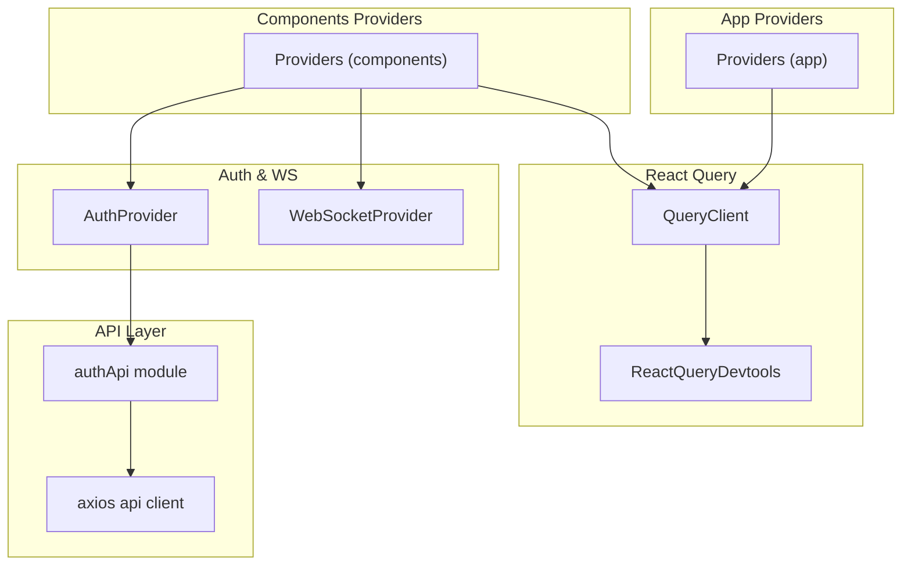
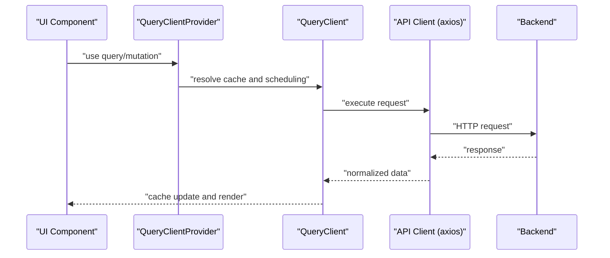
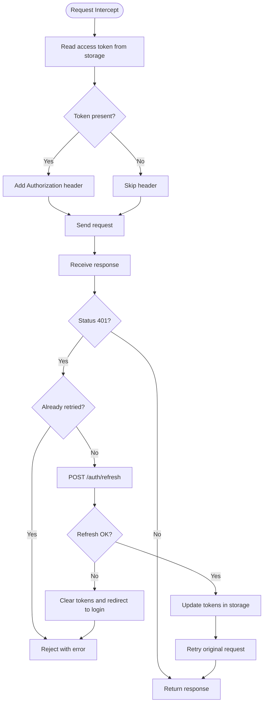
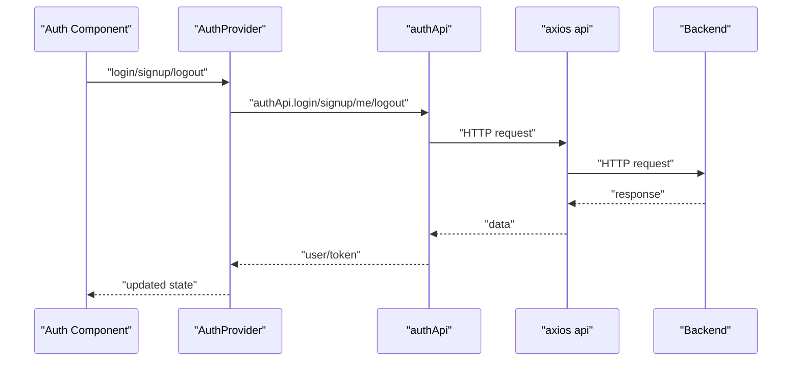
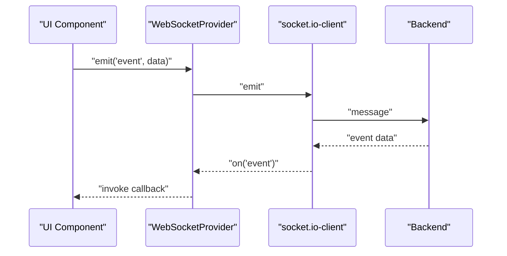
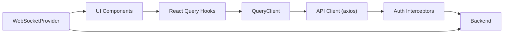
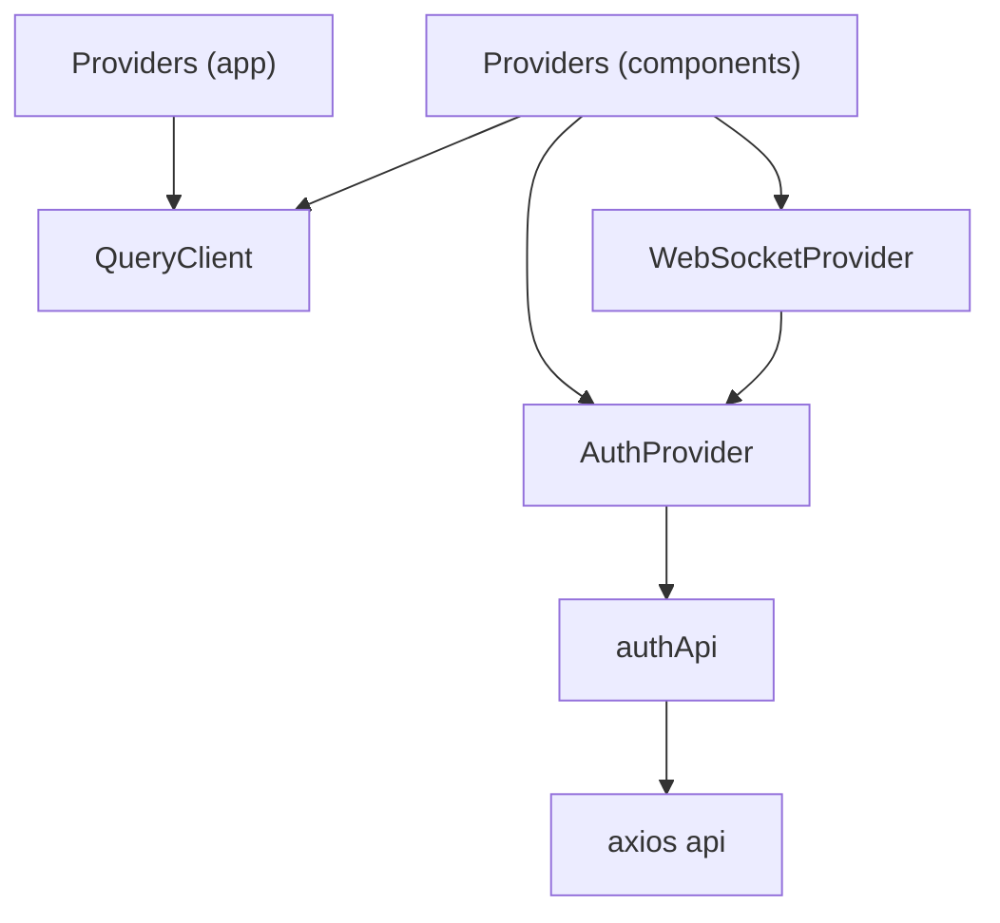

# React Query Integration

<cite>
**Referenced Files in This Document**
- [src/app/providers.tsx](file://src/app/providers.tsx)
- [src/components/providers.tsx](file://src/components/providers.tsx)
- [src/lib/api.ts](file://src/lib/api.ts)
- [src/lib/api/auth.ts](file://src/lib/api/auth.ts)
- [src/components/auth/auth-provider.tsx](file://src/components/auth/auth-provider.tsx)
- [src/components/websocket/websocket-provider.tsx](file://src/components/websocket/websocket-provider.tsx)
- [src/app/projects/page.tsx](file://src/app/projects/page.tsx)
- [src/app/dashboard/page.tsx](file://src/app/dashboard/page.tsx)
</cite>

## Table of Contents
1. [Introduction](#introduction)
2. [Project Structure](#project-structure)
3. [Core Components](#core-components)
4. [Architecture Overview](#architecture-overview)
5. [Detailed Component Analysis](#detailed-component-analysis)
6. [Dependency Analysis](#dependency-analysis)
7. [Performance Considerations](#performance-considerations)
8. [Troubleshooting Guide](#troubleshooting-guide)
9. [Conclusion](#conclusion)
10. [Appendices](#appendices)

## Introduction
This document explains how React Query is integrated into the WorldBest application. It covers QueryClient configuration, caching strategies, query optimization, defaultOptions (including staleTime and refetchOnWindowFocus), server state management, data synchronization, cache invalidation, and practical patterns for queries and mutations. It also documents the integration with the API client, data flow between components and the backend, performance considerations, memory management, and debugging techniques using ReactQueryDevtools.

## Project Structure
React Query is initialized at the application boundary via a Providers wrapper that sets up the QueryClient and exposes it to the rest of the app. Two provider files exist: one under the app layer and another under the components layer. Both configure QueryClient with defaultOptions and enable ReactQueryDevtools. The API client is configured separately to handle authentication tokens and automatic token refresh.

**Diagram sources**
- [src/app/providers.tsx](file://src/app/providers.tsx#L9-L37)
- [src/components/providers.tsx](file://src/components/providers.tsx#L10-L55)
- [src/lib/api.ts](file://src/lib/api.ts#L1-L67)
- [src/lib/api/auth.ts](file://src/lib/api/auth.ts#L1-L101)
- [src/components/auth/auth-provider.tsx](file://src/components/auth/auth-provider.tsx#L20-L165)
- [src/components/websocket/websocket-provider.tsx](file://src/components/websocket/websocket-provider.tsx#L17-L138)

**Section sources**
- [src/app/providers.tsx](file://src/app/providers.tsx#L1-L37)
- [src/components/providers.tsx](file://src/components/providers.tsx#L1-L55)

## Core Components
- QueryClient configuration with defaultOptions:
  - Queries: staleTime and refetchOnWindowFocus (app-level) or retry policy (components-level).
  - Mutations: retry policy (components-level).
- ReactQueryDevtools enabled globally for debugging.
- API client configured with request/response interceptors for authentication and token refresh.
- Auth provider integrates with the API client and manages session lifecycle.
- WebSocket provider complements real-time updates alongside React Query’s cache.

Key configuration highlights:
- App-level Providers defines staleTime and disables refetch on window focus.
- Components-level Providers adds retry policies for queries and mutations.

**Section sources**
- [src/app/providers.tsx](file://src/app/providers.tsx#L10-L20)
- [src/components/providers.tsx](file://src/components/providers.tsx#L11-L36)
- [src/lib/api.ts](file://src/lib/api.ts#L1-L67)
- [src/lib/api/auth.ts](file://src/lib/api/auth.ts#L1-L101)
- [src/components/auth/auth-provider.tsx](file://src/components/auth/auth-provider.tsx#L20-L165)
- [src/components/websocket/websocket-provider.tsx](file://src/components/websocket/websocket-provider.tsx#L17-L138)

## Architecture Overview
The React Query integration centers on a single QueryClient instance provided at the root. Components consume queries and mutations through the API client, which handles authentication and token refresh. The devtools are included to inspect cache state and network activity.

**Diagram sources**
- [src/app/providers.tsx](file://src/app/providers.tsx#L22-L36)
- [src/components/providers.tsx](file://src/components/providers.tsx#L38-L54)
- [src/lib/api.ts](file://src/lib/api.ts#L3-L8)
- [src/lib/api/auth.ts](file://src/lib/api/auth.ts#L25-L55)

## Detailed Component Analysis

### QueryClient Configuration and Devtools
- App-level Provider:
  - Creates a QueryClient with defaultOptions.queries.staleTime and refetchOnWindowFocus disabled.
  - Wraps children with QueryClientProvider and includes ReactQueryDevtools.
- Components-level Provider:
  - Creates a QueryClient with defaultOptions.queries.retry and defaultOptions.mutations.retry.
  - Wraps children with QueryClientProvider and includes ReactQueryDevtools.

Implications:
- StaleTime reduces unnecessary refetches for short-lived data.
- Disabling refetch on window focus prevents unexpected reloads when tabs regain focus.
- Retry policies avoid retrying on client-side errors (4xx) and cap retry attempts for robustness.

**Section sources**
- [src/app/providers.tsx](file://src/app/providers.tsx#L10-L20)
- [src/components/providers.tsx](file://src/components/providers.tsx#L11-L36)

### API Client Integration
- axios instance configured with base URL and JSON content-type.
- Request interceptor attaches Authorization header using a stored token.
- Response interceptor handles 401 Unauthorized by attempting a token refresh endpoint, updating local storage, and retrying the original request. On failure, clears tokens and redirects to login.

**Diagram sources**
- [src/lib/api.ts](file://src/lib/api.ts#L10-L65)

**Section sources**
- [src/lib/api.ts](file://src/lib/api.ts#L1-L67)

### Auth Provider and API Client Usage
- Auth provider initializes user state by calling the API client’s me endpoint.
- Login/signup set cookies and navigate to dashboard; logout clears cookies and navigates home.
- Token refresh runs on an interval and renews the session automatically.

**Diagram sources**
- [src/components/auth/auth-provider.tsx](file://src/components/auth/auth-provider.tsx#L27-L49)
- [src/lib/api/auth.ts](file://src/lib/api/auth.ts#L25-L55)
- [src/lib/api.ts](file://src/lib/api.ts#L3-L8)

**Section sources**
- [src/components/auth/auth-provider.tsx](file://src/components/auth/auth-provider.tsx#L20-L165)
- [src/lib/api/auth.ts](file://src/lib/api/auth.ts#L1-L101)

### WebSocket Provider and Real-Time Updates
- Establishes a WebSocket connection using the auth token for authentication.
- Handles connect/disconnect events, auto-reconnect with exponential backoff, and auth errors.
- Provides emit/on/off APIs for components to subscribe to real-time events.

**Diagram sources**
- [src/components/websocket/websocket-provider.tsx](file://src/components/websocket/websocket-provider.tsx#L49-L93)

**Section sources**
- [src/components/websocket/websocket-provider.tsx](file://src/components/websocket/websocket-provider.tsx#L17-L138)

### Practical Patterns: Queries, Mutations, and Cache Invalidation
- Queries:
  - Configure defaultOptions.staleTime to balance freshness vs. performance.
  - Disable refetchOnWindowFocus to prevent unwanted refetches when users switch tabs.
  - Use retry policies to handle transient failures while avoiding retries on client errors.
- Mutations:
  - Apply retry policies tailored to mutation failure modes.
  - Invalidate related queries after successful mutations to keep cache synchronized.
- Cache invalidation:
  - Use queryClient.invalidateQueries to trigger refetches after write operations.
  - Invalidate specific query keys to minimize unnecessary work.
- Error handling:
  - Rely on React Query’s built-in error propagation and retry behavior.
  - Combine with UI feedback (toasts) to inform users of failures.

Note: The current codebase does not include explicit React Query hooks or cache invalidation calls. The above patterns describe recommended approaches aligned with the existing QueryClient configuration and API client behavior.

[No sources needed since this section provides general guidance]

### Data Flow Between Components and Backend
- UI components trigger queries/mutations via the API client.
- The API client enforces authentication and refresh logic.
- React Query caches normalized data and coordinates refetches according to defaultOptions.
- WebSocketProvider complements cache updates with real-time events.

**Diagram sources**
- [src/app/providers.tsx](file://src/app/providers.tsx#L22-L36)
- [src/components/providers.tsx](file://src/components/providers.tsx#L38-L54)
- [src/lib/api.ts](file://src/lib/api.ts#L10-L65)
- [src/components/websocket/websocket-provider.tsx](file://src/components/websocket/websocket-provider.tsx#L36-L93)

**Section sources**
- [src/app/providers.tsx](file://src/app/providers.tsx#L1-L37)
- [src/components/providers.tsx](file://src/components/providers.tsx#L1-L55)
- [src/lib/api.ts](file://src/lib/api.ts#L1-L67)
- [src/components/websocket/websocket-provider.tsx](file://src/components/websocket/websocket-provider.tsx#L17-L138)

## Dependency Analysis
- Providers depend on QueryClient and ReactQueryDevtools.
- Auth provider depends on the auth API module.
- Auth API module depends on the axios client.
- WebSocket provider depends on the auth provider for token-based authentication.

**Diagram sources**
- [src/app/providers.tsx](file://src/app/providers.tsx#L22-L36)
- [src/components/providers.tsx](file://src/components/providers.tsx#L38-L54)
- [src/components/auth/auth-provider.tsx](file://src/components/auth/auth-provider.tsx#L20-L165)
- [src/lib/api/auth.ts](file://src/lib/api/auth.ts#L1-L101)
- [src/lib/api.ts](file://src/lib/api.ts#L1-L67)
- [src/components/websocket/websocket-provider.tsx](file://src/components/websocket/websocket-provider.tsx#L17-L138)

**Section sources**
- [src/app/providers.tsx](file://src/app/providers.tsx#L1-L37)
- [src/components/providers.tsx](file://src/components/providers.tsx#L1-L55)
- [src/components/auth/auth-provider.tsx](file://src/components/auth/auth-provider.tsx#L20-L165)
- [src/lib/api/auth.ts](file://src/lib/api/auth.ts#L1-L101)
- [src/lib/api.ts](file://src/lib/api.ts#L1-L67)
- [src/components/websocket/websocket-provider.tsx](file://src/components/websocket/websocket-provider.tsx#L17-L138)

## Performance Considerations
- staleTime: Short stale intervals reduce network usage but may serve slightly outdated data; adjust based on data volatility.
- refetchOnWindowFocus disabled: Prevents unnecessary refetches on tab focus; beneficial for long-running sessions.
- retry policies: Limit retries for transient failures; avoid retrying on client errors to save bandwidth and improve UX.
- cache size and garbage collection: React Query manages cache internally; avoid storing excessively large payloads unnecessarily.
- Devtools impact: Keep devtools closed in production to avoid overhead; the current setup initializes them closed.

[No sources needed since this section provides general guidance]

## Troubleshooting Guide
- Enable ReactQueryDevtools:
  - Devtools are included in both Providers; ensure they are visible during development to inspect queries, cache state, and errors.
- Network and authentication issues:
  - Verify Authorization headers are attached by the request interceptor.
  - Confirm token refresh logic executes on 401 responses and that tokens are persisted in storage.
- Query not updating:
  - Ensure cache invalidation is triggered after mutations.
  - Check staleTime and refetchOnWindowFocus settings.
- Real-time updates:
  - Confirm WebSocketProvider connects with the correct token and handles reconnects.

**Section sources**
- [src/app/providers.tsx](file://src/app/providers.tsx#L34-L34)
- [src/components/providers.tsx](file://src/components/providers.tsx#L52-L52)
- [src/lib/api.ts](file://src/lib/api.ts#L10-L65)
- [src/components/websocket/websocket-provider.tsx](file://src/components/websocket/websocket-provider.tsx#L49-L93)

## Conclusion
WorldBest integrates React Query with a pragmatic QueryClient configuration focused on controlled caching and resilient retries. The API client handles authentication and token refresh, ensuring reliable backend communication. While the current pages use mock data, the established providers and API client form a solid foundation for adopting React Query hooks, implementing cache invalidation, and synchronizing server state with real-time updates via WebSocket.

[No sources needed since this section summarizes without analyzing specific files]

## Appendices

### Appendix A: Recommended React Query Hook Usage Patterns
- Queries:
  - Use defaultOptions.staleTime and refetchOnWindowFocus settings to optimize cache behavior.
  - Trigger manual refetches when needed using queryClient.refetchQueries.
- Mutations:
  - Apply retry policies to handle transient failures.
  - Invalidate related queries after successful mutations to maintain consistency.
- Error handling:
  - Leverage React Query’s error propagation and combine with UI notifications.

[No sources needed since this section provides general guidance]

### Appendix B: Example Pages Using Mock Data
- Projects page and dashboard currently use mock data and state management. These pages are ideal candidates to adopt React Query hooks for fetching and managing server state.

**Section sources**
- [src/app/projects/page.tsx](file://src/app/projects/page.tsx#L48-L126)
- [src/app/dashboard/page.tsx](file://src/app/dashboard/page.tsx#L53-L57)