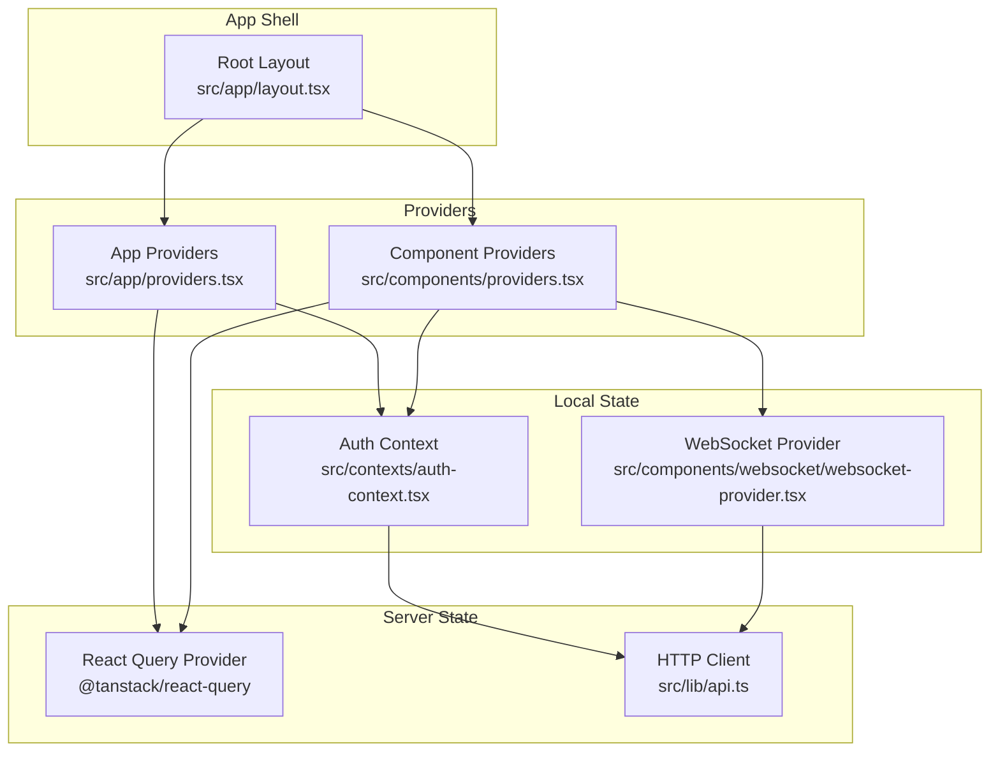
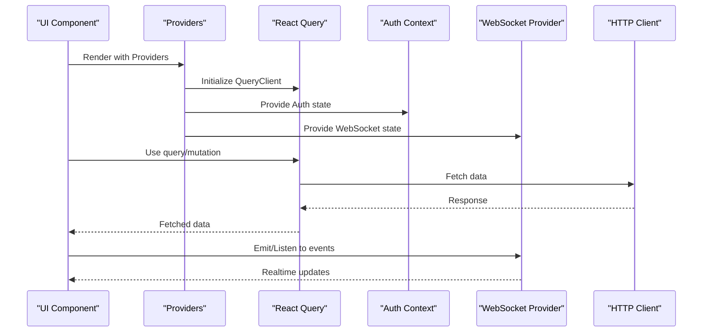
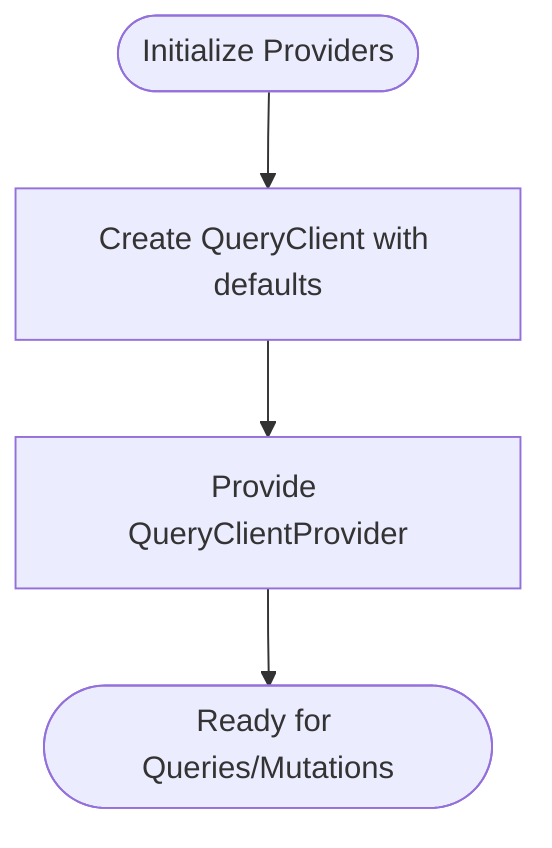
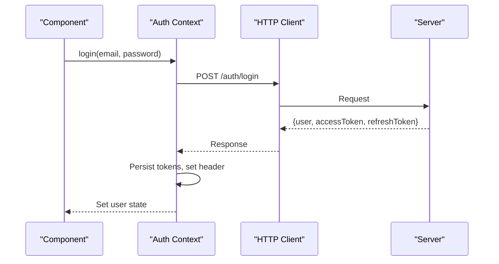
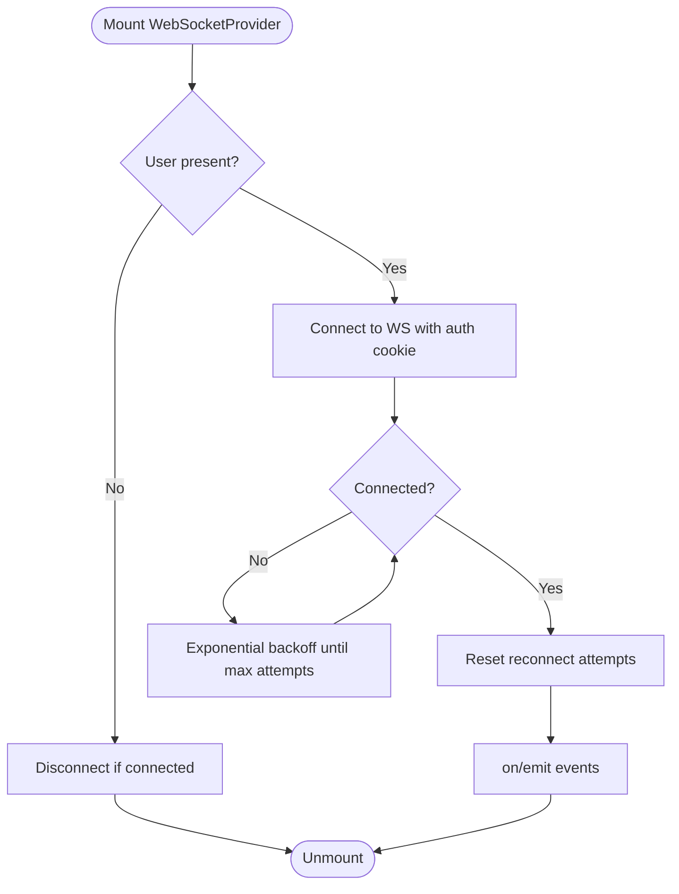
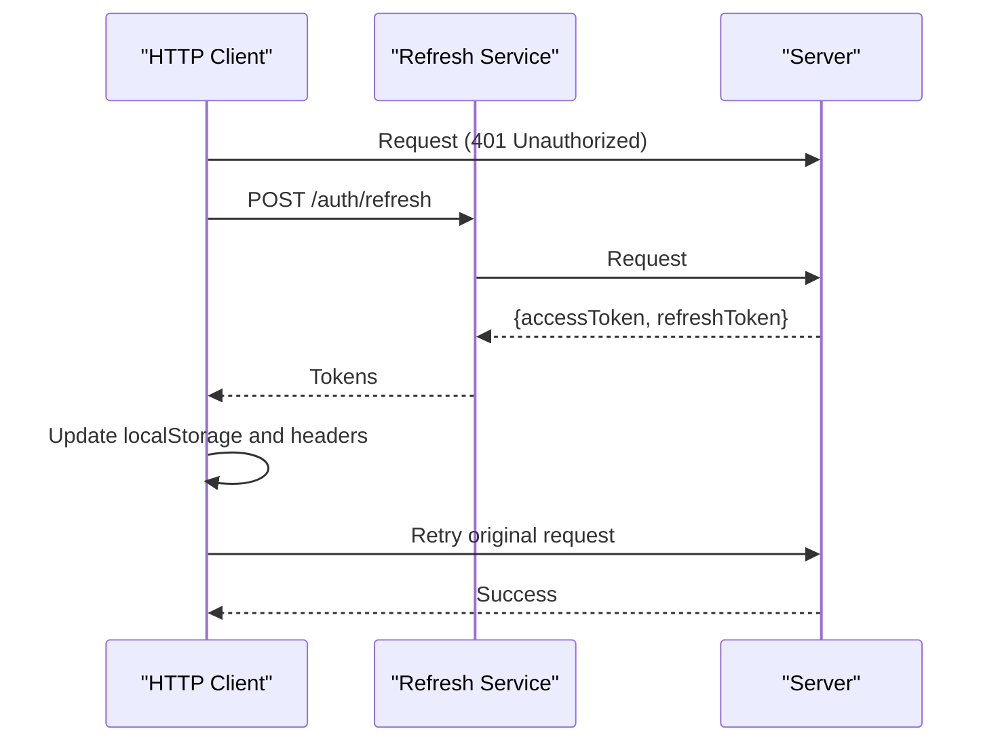
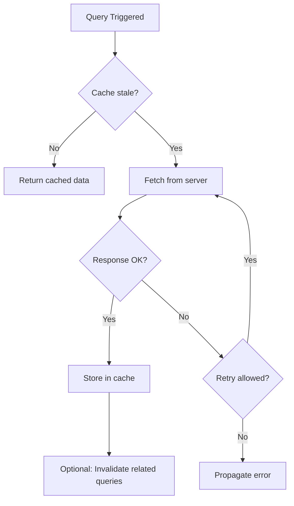
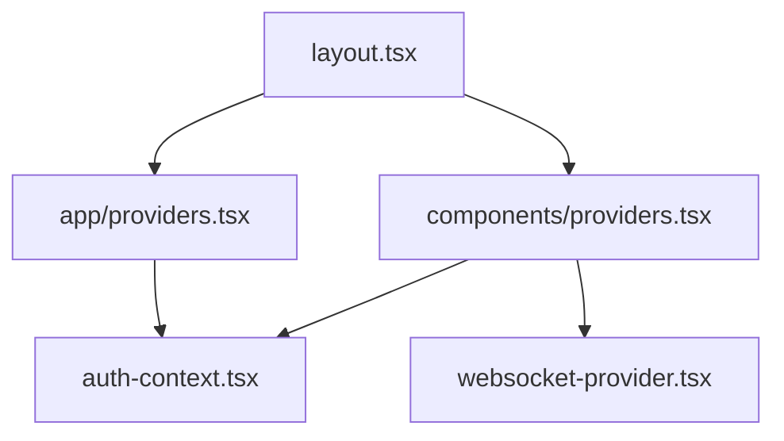
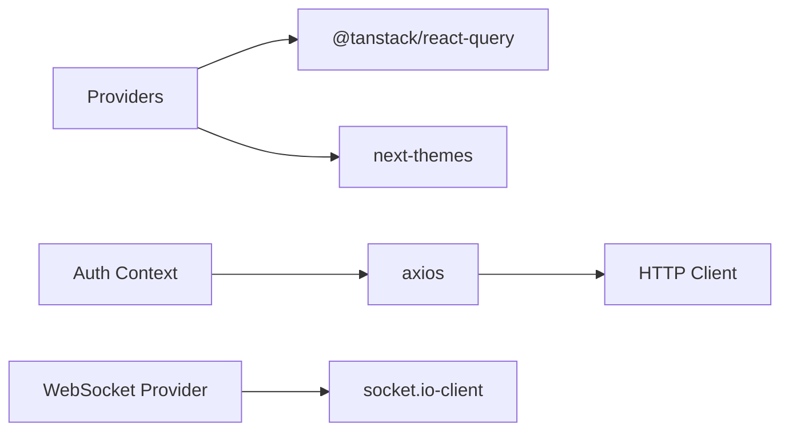

# State Management

<cite>
**Referenced Files in This Document**
- [src/app/layout.tsx](file://src/app/layout.tsx)
- [src/app/providers.tsx](file://src/app/providers.tsx)
- [src/components/providers.tsx](file://src/components/providers.tsx)
- [src/contexts/auth-context.tsx](file://src/contexts/auth-context.tsx)
- [src/components/websocket/websocket-provider.tsx](file://src/components/websocket/websocket-provider.tsx)
- [src/lib/api.ts](file://src/lib/api.ts)
- [package.json](file://package.json)
- [src/app/dashboard/page.tsx](file://src/app/dashboard/page.tsx)
- [src/app/projects/page.tsx](file://src/app/projects/page.tsx)
</cite>

## Table of Contents
1. [Introduction](#introduction)
2. [Project Structure](#project-structure)
3. [Core Components](#core-components)
4. [Architecture Overview](#architecture-overview)
5. [Detailed Component Analysis](#detailed-component-analysis)
6. [Dependency Analysis](#dependency-analysis)
7. [Performance Considerations](#performance-considerations)
8. [Troubleshooting Guide](#troubleshooting-guide)
9. [Conclusion](#conclusion)

## Introduction
This document explains the state management system implemented in the project, focusing on the provider pattern architecture, React Query integration, and local state management. It covers how server state is synchronized via React Query, how local state is managed with contexts and websockets, and how caching, retries, and invalidation strategies are applied. Practical patterns for data fetching, optimistic updates, hydration, persistence, and debugging are included to help both beginners and experienced developers adopt and extend the system effectively.

## Project Structure
The state management stack is organized around a layered provider hierarchy:
- Application-level provider wraps the entire app with theme, auth, and React Query providers.
- Component-level provider offers a richer setup with WebSocket integration alongside auth and React Query.
- Local state is handled via React Contexts for authentication and WebSocket connections.
- HTTP client integrates with Axios and handles token refresh automatically.

**Diagram sources**
- [src/app/layout.tsx](file://src/app/layout.tsx#L1-L102)
- [src/app/providers.tsx](file://src/app/providers.tsx#L1-L37)
- [src/components/providers.tsx](file://src/components/providers.tsx#L1-L55)
- [src/contexts/auth-context.tsx](file://src/contexts/auth-context.tsx#L1-L154)
- [src/components/websocket/websocket-provider.tsx](file://src/components/websocket/websocket-provider.tsx#L1-L138)
- [src/lib/api.ts](file://src/lib/api.ts#L1-L67)

**Section sources**
- [src/app/layout.tsx](file://src/app/layout.tsx#L1-L102)
- [src/app/providers.tsx](file://src/app/providers.tsx#L1-L37)
- [src/components/providers.tsx](file://src/components/providers.tsx#L1-L55)

## Core Components
- React Query Provider: Centralizes caching, background refetching, and retry policies. It is initialized once per app with default options for queries and mutations.
- Auth Context: Manages user session state, login/signup/logout, token refresh, and hydration from storage.
- WebSocket Provider: Handles real-time events, reconnection logic, and emits/observes events scoped to authenticated sessions.
- HTTP Client: Axios instance with automatic auth header injection and refresh token flow.

Key responsibilities:
- Caching and staleness: Controlled via staleTime and cache behavior.
- Retry and error handling: Configured per query/mutation to avoid retrying on client errors.
- Hydration: Auth state restored from localStorage on mount.
- Persistence: Tokens persisted in localStorage; WebSocket auth uses cookies.

**Section sources**
- [src/app/providers.tsx](file://src/app/providers.tsx#L9-L37)
- [src/components/providers.tsx](file://src/components/providers.tsx#L10-L55)
- [src/contexts/auth-context.tsx](file://src/contexts/auth-context.tsx#L30-L154)
- [src/components/websocket/websocket-provider.tsx](file://src/components/websocket/websocket-provider.tsx#L17-L138)
- [src/lib/api.ts](file://src/lib/api.ts#L1-L67)

## Architecture Overview
The provider hierarchy ensures that React Query is available globally, while local state providers manage authentication and real-time capabilities. The HTTP client centralizes network concerns and integrates with the auth layer for secure requests.

**Diagram sources**
- [src/app/layout.tsx](file://src/app/layout.tsx#L83-L101)
- [src/app/providers.tsx](file://src/app/providers.tsx#L9-L37)
- [src/components/providers.tsx](file://src/components/providers.tsx#L10-L55)
- [src/contexts/auth-context.tsx](file://src/contexts/auth-context.tsx#L30-L154)
- [src/components/websocket/websocket-provider.tsx](file://src/components/websocket/websocket-provider.tsx#L17-L138)
- [src/lib/api.ts](file://src/lib/api.ts#L1-L67)

## Detailed Component Analysis

### React Query Provider Pattern
- Initialization: A single QueryClient instance is created once and passed to QueryClientProvider.
- Defaults: Queries have a short staleTime and disabled refetch on window focus; mutations have stricter retry limits.
- Devtools: React Query Devtools are included for debugging.

**Diagram sources**
- [src/app/providers.tsx](file://src/app/providers.tsx#L10-L20)
- [src/components/providers.tsx](file://src/components/providers.tsx#L11-L36)

**Section sources**
- [src/app/providers.tsx](file://src/app/providers.tsx#L9-L37)
- [src/components/providers.tsx](file://src/components/providers.tsx#L10-L55)

### Authentication Context
- Hydration: On mount, reads tokens from localStorage and validates against the backend.
- Operations: login, signup, logout, and refresh token handling.
- Token propagation: Updates Axios defaults to include Authorization header after login/refresh.

**Diagram sources**
- [src/contexts/auth-context.tsx](file://src/contexts/auth-context.tsx#L57-L91)
- [src/lib/api.ts](file://src/lib/api.ts#L39-L53)

**Section sources**
- [src/contexts/auth-context.tsx](file://src/contexts/auth-context.tsx#L30-L154)
- [src/lib/api.ts](file://src/lib/api.ts#L1-L67)

### WebSocket Provider
- Connection lifecycle: Establishes connection when user is present, disconnects otherwise.
- Reconnection: Exponential backoff up to a capped delay with a maximum number of attempts.
- Events: Provides emit/on/off APIs for real-time features.

**Diagram sources**
- [src/components/websocket/websocket-provider.tsx](file://src/components/websocket/websocket-provider.tsx#L17-L93)

**Section sources**
- [src/components/websocket/websocket-provider.tsx](file://src/components/websocket/websocket-provider.tsx#L1-L138)

### HTTP Client and Token Refresh
- Request interceptor: Adds Authorization header from localStorage.
- Response interceptor: Detects 401, attempts refresh, retries original request with new tokens, or redirects to login.

**Diagram sources**
- [src/lib/api.ts](file://src/lib/api.ts#L24-L65)

**Section sources**
- [src/lib/api.ts](file://src/lib/api.ts#L1-L67)

### Local State Management Patterns
- Authentication state: Managed in a dedicated context with hydration and token propagation.
- WebSocket state: Encapsulated in a provider with explicit connect/disconnect semantics.
- UI state: Demonstrated in pages with local component state for UI controls (filters, view modes).

Examples of patterns:
- Hydration: Restore user session on app load.
- Event-driven updates: Use WebSocket provider to update UI reactively.
- Local UI state: Keep transient UI flags (loading, filters) in component state.

**Section sources**
- [src/contexts/auth-context.tsx](file://src/contexts/auth-context.tsx#L35-L55)
- [src/components/websocket/websocket-provider.tsx](file://src/components/websocket/websocket-provider.tsx#L24-L93)
- [src/app/dashboard/page.tsx](file://src/app/dashboard/page.tsx#L53-L67)
- [src/app/projects/page.tsx](file://src/app/projects/page.tsx#L48-L126)

### Server State Synchronization and Caching Strategies
- Staleness: Queries marked fresh for a short period to reduce unnecessary network calls.
- Refetch policy: Disabled window focus refetch to minimize background activity.
- Retry: Automatic retries for transient failures; intentionally avoids retrying on client errors (4xx).
- Mutations: Separate retry policy for mutations to prevent cascading failures.

**Diagram sources**
- [src/app/providers.tsx](file://src/app/providers.tsx#L14-L18)
- [src/components/providers.tsx](file://src/components/providers.tsx#L15-L34)

**Section sources**
- [src/app/providers.tsx](file://src/app/providers.tsx#L13-L19)
- [src/components/providers.tsx](file://src/components/providers.tsx#L13-L35)

### Optimistic Updates and Cache Invalidation
- Optimistic UI: Apply UI changes immediately upon mutation; roll back on error.
- Cache invalidation: Trigger refetch or selective cache updates after mutations.
- Real-time sync: Use WebSocket events to reflect server-side changes instantly.

Note: The current codebase demonstrates the infrastructure for these patterns (React Query, WebSocket provider). Implement optimistic updates and invalidation by composing these building blocks in your components.

**Section sources**
- [src/components/providers.tsx](file://src/components/providers.tsx#L10-L55)
- [src/components/websocket/websocket-provider.tsx](file://src/components/websocket/websocket-provider.tsx#L17-L138)

### Provider Hierarchy and Context Management
- Root layout renders Providers at the top level.
- Two provider variants exist:
  - App-level: Theme, Auth, React Query.
  - Component-level: Auth, WebSocket, Theme, React Query.
- Child components consume providers via hooks.

**Diagram sources**
- [src/app/layout.tsx](file://src/app/layout.tsx#L83-L101)
- [src/app/providers.tsx](file://src/app/providers.tsx#L9-L37)
- [src/components/providers.tsx](file://src/components/providers.tsx#L10-L55)
- [src/contexts/auth-context.tsx](file://src/contexts/auth-context.tsx#L30-L154)
- [src/components/websocket/websocket-provider.tsx](file://src/components/websocket/websocket-provider.tsx#L17-L138)

**Section sources**
- [src/app/layout.tsx](file://src/app/layout.tsx#L83-L101)
- [src/app/providers.tsx](file://src/app/providers.tsx#L9-L37)
- [src/components/providers.tsx](file://src/components/providers.tsx#L10-L55)

### State Persistence and Hydration
- Auth hydration: On mount, read tokens and validate; set user state accordingly.
- Token persistence: Store tokens in localStorage; update Axios defaults.
- WebSocket auth: Use cookies for server-side authentication during connection.

**Section sources**
- [src/contexts/auth-context.tsx](file://src/contexts/auth-context.tsx#L35-L55)
- [src/lib/api.ts](file://src/lib/api.ts#L11-L22)
- [src/components/websocket/websocket-provider.tsx](file://src/components/websocket/websocket-provider.tsx#L36-L47)

## Dependency Analysis
External libraries involved in state management:
- @tanstack/react-query: Caching, background updates, retries.
- next-themes: Theme switching and persistence.
- axios: HTTP client with interceptors.
- socket.io-client: Real-time communication.

**Diagram sources**
- [src/app/providers.tsx](file://src/app/providers.tsx#L3-L5)
- [src/components/providers.tsx](file://src/components/providers.tsx#L3-L5)
- [src/contexts/auth-context.tsx](file://src/contexts/auth-context.tsx#L6)
- [src/lib/api.ts](file://src/lib/api.ts#L1)
- [src/components/websocket/websocket-provider.tsx](file://src/components/websocket/websocket-provider.tsx#L4)
- [package.json](file://package.json#L32-L62)

**Section sources**
- [package.json](file://package.json#L13-L62)

## Performance Considerations
- Caching: Use appropriate staleTime to balance freshness and bandwidth.
- Retries: Limit retries for mutations; avoid retrying on client errors.
- Background refetch: Disable window focus refetch to reduce unnecessary work.
- Code splitting: Dynamically import heavy routes/components to improve TTI.
- Bundle optimization: Enable tree-shaking and remove unused dependencies.
- Image optimization: Use optimized components/lazy loading for images.
- Monitoring: Track Web Vitals and custom metrics to guide improvements.

[No sources needed since this section provides general guidance]

## Troubleshooting Guide
Common issues and remedies:
- Authentication loops or stale tokens:
  - Verify localStorage tokens and refresh flow.
  - Confirm Axios interceptor sets Authorization header.
- WebSocket disconnections:
  - Check reconnection attempts and exponential backoff.
  - Inspect auth errors and server-initiated disconnect reasons.
- React Query cache anomalies:
  - Review staleTime and refetch policies.
  - Use Devtools to inspect cache state and query status.
- Hydration mismatches:
  - Ensure theme and auth hydration occur before rendering UI.

**Section sources**
- [src/lib/api.ts](file://src/lib/api.ts#L24-L65)
- [src/components/websocket/websocket-provider.tsx](file://src/components/websocket/websocket-provider.tsx#L50-L87)
- [src/app/providers.tsx](file://src/app/providers.tsx#L14-L18)
- [src/components/providers.tsx](file://src/components/providers.tsx#L15-L34)

## Conclusion
The state management system combines React Query for robust server state caching and synchronization, with local contexts for authentication and WebSocket-driven real-time updates. The provider hierarchy cleanly separates concerns, enabling scalable patterns for data fetching, optimistic updates, cache invalidation, and persistence. By leveraging the existing infrastructure—QueryClient defaults, Axios interceptors, and WebSocket reconnection—you can implement efficient, maintainable state management that scales with your application’s needs.