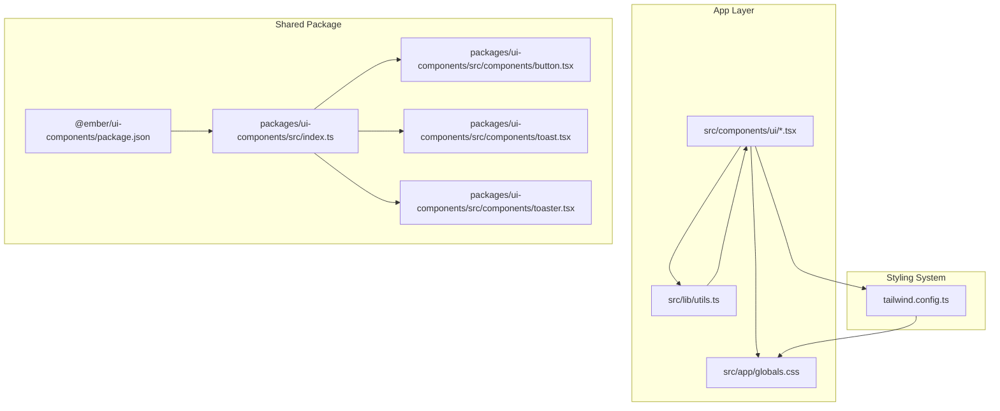
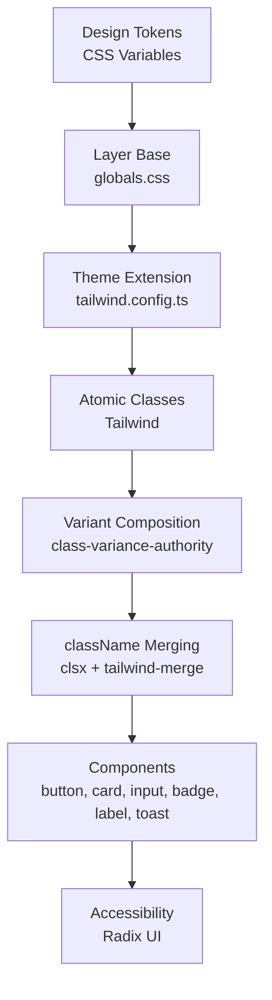
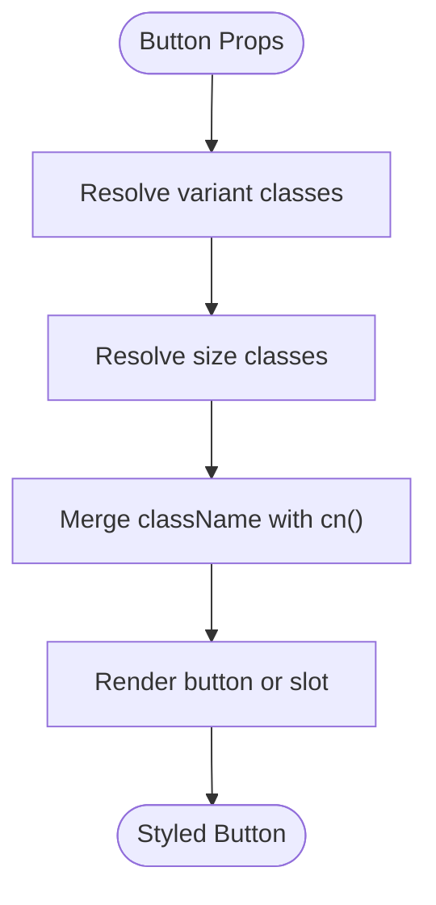
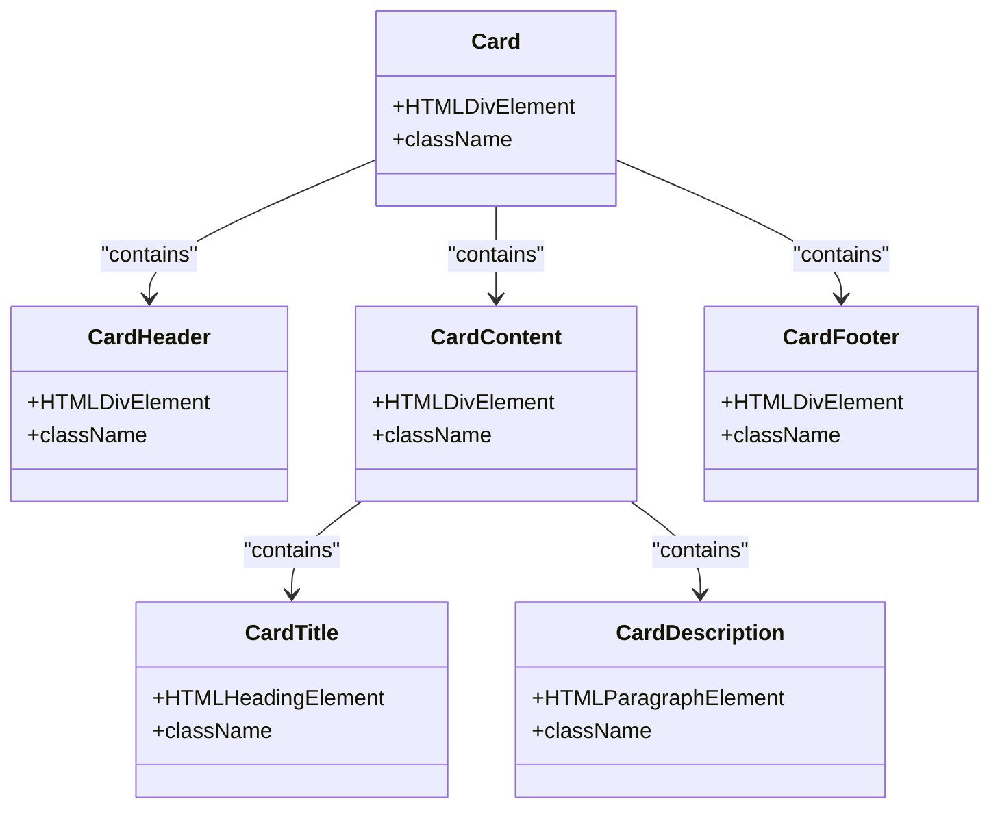
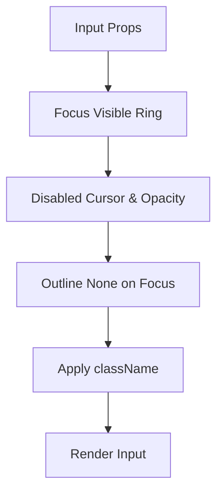
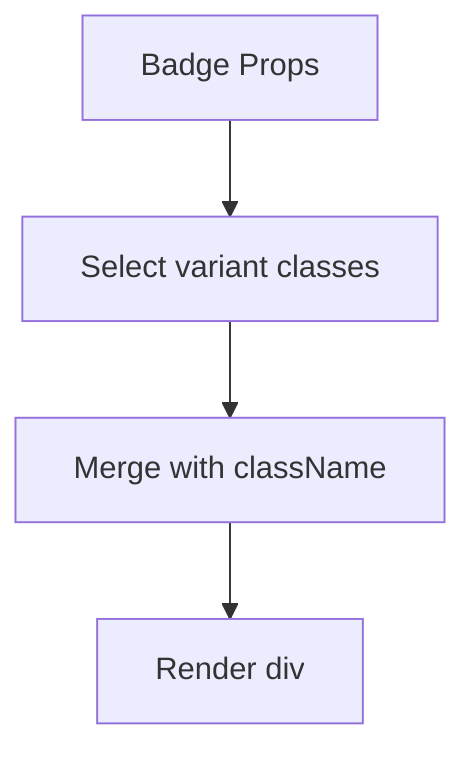
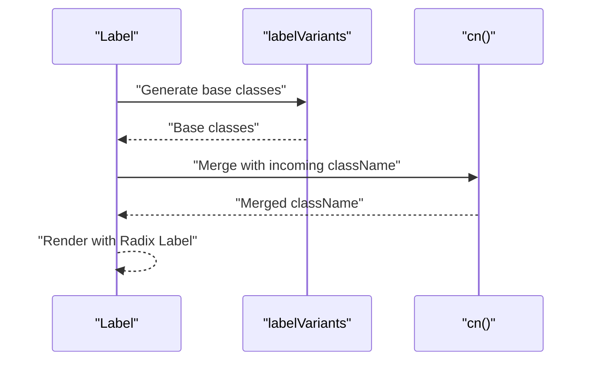
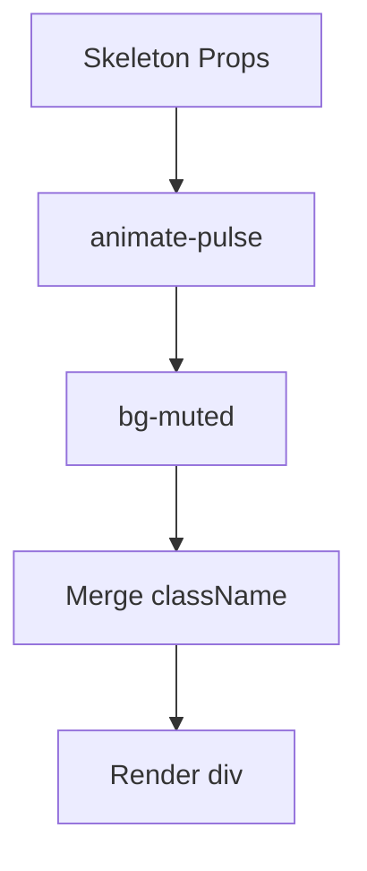
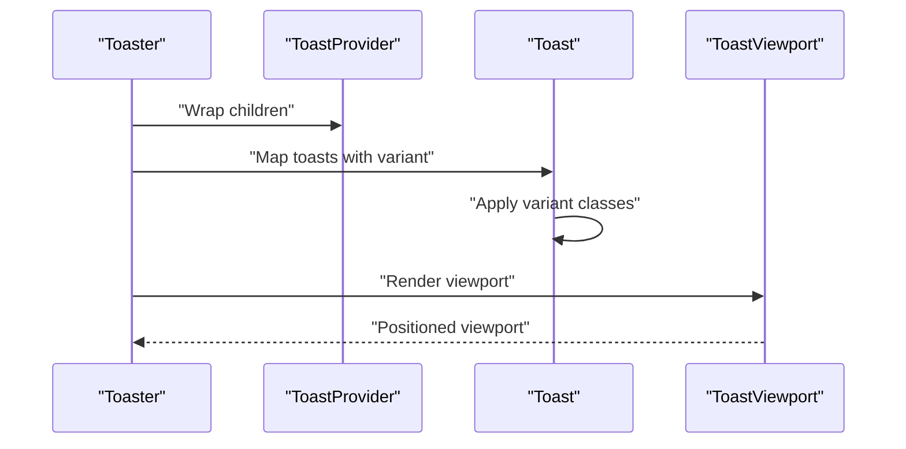
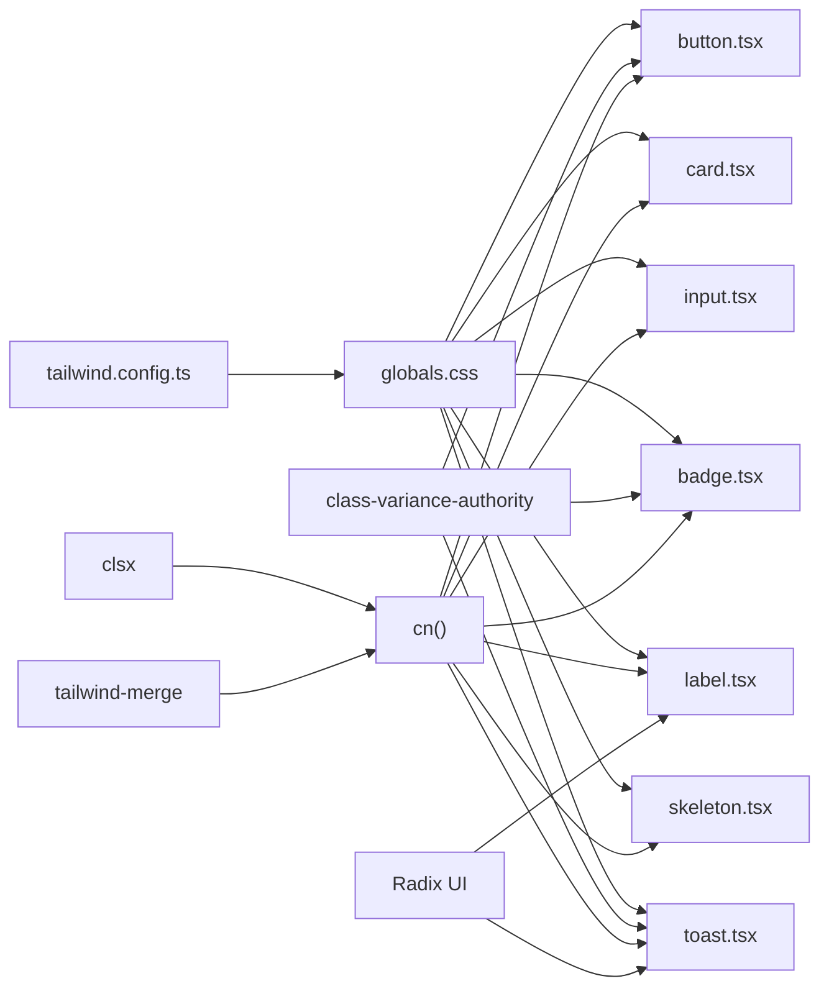

# Component Styling Patterns

<cite>
**Referenced Files in This Document**
- [button.tsx](file://src/components/ui/button.tsx)
- [card.tsx](file://src/components/ui/card.tsx)
- [input.tsx](file://src/components/ui/input.tsx)
- [badge.tsx](file://src/components/ui/badge.tsx)
- [label.tsx](file://src/components/ui/label.tsx)
- [skeleton.tsx](file://src/components/ui/skeleton.tsx)
- [toast.tsx](file://packages/ui-components/src/components/toast.tsx)
- [toaster.tsx](file://packages/ui-components/src/components/toaster.tsx)
- [utils.ts](file://src/lib/utils.ts)
- [globals.css](file://src/app/globals.css)
- [tailwind.config.ts](file://tailwind.config.ts)
- [package.json](file://packages/ui-components/package.json)
- [index.ts](file://packages/ui-components/src/index.ts)
</cite>

## Table of Contents
1. [Introduction](#introduction)
2. [Project Structure](#project-structure)
3. [Core Components](#core-components)
4. [Architecture Overview](#architecture-overview)
5. [Detailed Component Analysis](#detailed-component-analysis)
6. [Dependency Analysis](#dependency-analysis)
7. [Performance Considerations](#performance-considerations)
8. [Troubleshooting Guide](#troubleshooting-guide)
9. [Conclusion](#conclusion)

## Introduction
This document explains the component styling patterns used across the UI component library. It focuses on reusable UI architecture, prop-based styling, variant systems, className merging strategies, conditional styling, responsive design patterns, and integration with the design system. Practical examples demonstrate themed variants, size variations, and design consistency across buttons, cards, inputs, badges, labels, skeletons, and toast components. Accessibility and performance considerations are also addressed.

## Project Structure
The styling architecture is built around:
- Tailwind CSS with a layered design system (base, components, utilities)
- A centralized className merging utility
- Component libraries split between the app and a shared package
- Radix UI primitives for accessible interactions
- Variant-driven component composition via class-variance-authority

**Diagram sources**
- [globals.css](file://src/app/globals.css#L1-L141)
- [tailwind.config.ts](file://tailwind.config.ts#L1-L133)
- [utils.ts](file://src/lib/utils.ts#L1-L6)
- [index.ts](file://packages/ui-components/src/index.ts#L1-L12)
- [package.json](file://packages/ui-components/package.json#L1-L54)

**Section sources**
- [globals.css](file://src/app/globals.css#L1-L141)
- [tailwind.config.ts](file://tailwind.config.ts#L1-L133)
- [utils.ts](file://src/lib/utils.ts#L1-L6)
- [index.ts](file://packages/ui-components/src/index.ts#L1-L12)
- [package.json](file://packages/ui-components/package.json#L1-L54)

## Core Components
This section documents the foundational styling patterns used across primitive components.

- Prop-based styling: Components accept className and variant props to compose styles.
- Variant systems: class-variance-authority defines variant sets with defaults.
- className merging: clsx and tailwind-merge resolve conflicts deterministically.
- Conditional styling: Focus, disabled, and interactive states are applied consistently.
- Responsive patterns: Utilities leverage Tailwind’s responsive prefixes and container configuration.

Key patterns observed:
- Buttons define variant and size variants with default selections.
- Cards apply semantic color tokens and spacing conventions.
- Inputs and labels use focus-visible and disabled states with ring offsets.
- Badges support variant-based theming with consistent typography.
- Toasts integrate with Radix UI animations and variant-based destructive styling.
- Skeletons use pulse animation and muted backgrounds.

**Section sources**
- [button.tsx](file://src/components/ui/button.tsx#L1-L55)
- [card.tsx](file://src/components/ui/card.tsx#L1-L78)
- [input.tsx](file://src/components/ui/input.tsx#L1-L24)
- [badge.tsx](file://src/components/ui/badge.tsx#L1-L35)
- [label.tsx](file://src/components/ui/label.tsx#L1-L23)
- [skeleton.tsx](file://src/components/ui/skeleton.tsx#L1-L17)
- [toast.tsx](file://packages/ui-components/src/components/toast.tsx#L1-L126)

## Architecture Overview
The styling architecture centers on:
- Design tokens: CSS variables in base layer define semantic colors and radii.
- Theme extension: Tailwind resolves tokens to dynamic HSL values and adds brand colors.
- Component variants: class-variance-authority composes atomic classes per variant/size.
- Utility merging: A single cn(...) function merges and deduplicates classes.
- Accessibility: Radix UI primitives provide keyboard navigation and ARIA-ready markup.

**Diagram sources**
- [globals.css](file://src/app/globals.css#L5-L76)
- [tailwind.config.ts](file://tailwind.config.ts#L18-L127)
- [button.tsx](file://src/components/ui/button.tsx#L6-L33)
- [utils.ts](file://src/lib/utils.ts#L4-L6)

## Detailed Component Analysis

### Button Pattern
- Variant system: default, destructive, outline, secondary, ghost, link.
- Size system: default, sm, lg, icon.
- Composition: forwardRef with asChild slot support; className merges variant classes with incoming className.
- Accessibility: focus-visible ring, disabled pointer-events and opacity.
- Example snippet paths:
  - [buttonVariants definition](file://src/components/ui/button.tsx#L6-L33)
  - [Button component render](file://src/components/ui/button.tsx#L41-L52)

**Diagram sources**
- [button.tsx](file://src/components/ui/button.tsx#L6-L33)
- [button.tsx](file://src/components/ui/button.tsx#L41-L52)
- [utils.ts](file://src/lib/utils.ts#L4-L6)

**Section sources**
- [button.tsx](file://src/components/ui/button.tsx#L1-L55)
- [utils.ts](file://src/lib/utils.ts#L1-L6)

### Card Pattern
- Semantic roles: Card, CardHeader, CardTitle, CardDescription, CardContent, CardFooter.
- Color tokens: Uses card, card-foreground, muted, border.
- Spacing: Consistent padding and vertical rhythm.
- Example snippet paths:
  - [Card container](file://src/components/ui/card.tsx#L7-L16)
  - [CardTitle typography](file://src/components/ui/card.tsx#L34-L43)
  - [CardFooter layout](file://src/components/ui/card.tsx#L69-L76)

**Diagram sources**
- [card.tsx](file://src/components/ui/card.tsx#L4-L77)

**Section sources**
- [card.tsx](file://src/components/ui/card.tsx#L1-L78)

### Input Pattern
- Focus-visible ring with ring offset.
- Disabled state with cursor and opacity.
- Placeholder and file input resets for cross-browser consistency.
- Example snippet paths:
  - [Input component](file://src/components/ui/input.tsx#L7-L21)

**Diagram sources**
- [input.tsx](file://src/components/ui/input.tsx#L7-L21)

**Section sources**
- [input.tsx](file://src/components/ui/input.tsx#L1-L24)

### Badge Pattern
- Variant system: default, secondary, destructive, outline.
- Typography: small caps, rounded-full shape.
- Example snippet paths:
  - [badgeVariants definition](file://src/components/ui/badge.tsx#L5-L23)
  - [Badge render](file://src/components/ui/badge.tsx#L29-L33)

**Diagram sources**
- [badge.tsx](file://src/components/ui/badge.tsx#L5-L23)
- [badge.tsx](file://src/components/ui/badge.tsx#L29-L33)

**Section sources**
- [badge.tsx](file://src/components/ui/badge.tsx#L1-L35)

### Label Pattern
- Variant-less styling with class-variance-authority for future extensibility.
- Disabled state via peer-disabled utilities.
- Example snippet paths:
  - [labelVariants definition](file://src/components/ui/label.tsx#L6-L8)
  - [Label render](file://src/components/ui/label.tsx#L14-L20)

**Diagram sources**
- [label.tsx](file://src/components/ui/label.tsx#L6-L8)
- [label.tsx](file://src/components/ui/label.tsx#L14-L20)
- [utils.ts](file://src/lib/utils.ts#L4-L6)

**Section sources**
- [label.tsx](file://src/components/ui/label.tsx#L1-L23)

### Skeleton Pattern
- Pulse animation for loading states.
- Muted background for subtle indication.
- Example snippet paths:
  - [Skeleton render](file://src/components/ui/skeleton.tsx#L3-L13)

**Diagram sources**
- [skeleton.tsx](file://src/components/ui/skeleton.tsx#L3-L13)

**Section sources**
- [skeleton.tsx](file://src/components/ui/skeleton.tsx#L1-L17)

### Toast Pattern
- Variant system: default, destructive.
- Radix UI integration: viewport positioning, swipe gestures, open/close animations.
- Action and close button styling conditioned on variant.
- Example snippet paths:
  - [toastVariants definition](file://packages/ui-components/src/components/toast.tsx#L24-L38)
  - [Toast render](file://packages/ui-components/src/components/toast.tsx#L40-L53)
  - [Toaster mapping](file://packages/ui-components/src/components/toaster.tsx#L18-L31)

**Diagram sources**
- [toaster.tsx](file://packages/ui-components/src/components/toaster.tsx#L13-L35)
- [toast.tsx](file://packages/ui-components/src/components/toast.tsx#L40-L53)
- [toast.tsx](file://packages/ui-components/src/components/toast.tsx#L24-L38)

**Section sources**
- [toast.tsx](file://packages/ui-components/src/components/toast.tsx#L1-L126)
- [toaster.tsx](file://packages/ui-components/src/components/toaster.tsx#L1-L35)

## Dependency Analysis
The styling system relies on:
- Tailwind CSS for atomic classes and theme tokens
- class-variance-authority for variant composition
- clsx and tailwind-merge for deterministic className merging
- Radix UI for accessible primitives
- A shared package exporting components and utilities

**Diagram sources**
- [tailwind.config.ts](file://tailwind.config.ts#L1-L133)
- [globals.css](file://src/app/globals.css#L1-L141)
- [button.tsx](file://src/components/ui/button.tsx#L3-L4)
- [badge.tsx](file://src/components/ui/badge.tsx#L2-L3)
- [toast.tsx](file://packages/ui-components/src/components/toast.tsx#L1-L5)
- [utils.ts](file://src/lib/utils.ts#L1-L6)
- [package.json](file://packages/ui-components/package.json#L35-L39)

**Section sources**
- [package.json](file://packages/ui-components/package.json#L1-L54)
- [index.ts](file://packages/ui-components/src/index.ts#L1-L12)

## Performance Considerations
- className merging: Using clsx and tailwind-merge ensures minimal specificity and avoids redundant classes.
- Variant composition: class-variance-authority generates only necessary classes per variant/size combination.
- Atomic utilities: Tailwind’s atomic nature reduces CSS bloat and improves cacheability.
- Animation and transitions: CSS animations are preferred over heavy JavaScript for smooth UX.
- Bundle size: Keep variant sets concise; avoid excessive combinations.

[No sources needed since this section provides general guidance]

## Troubleshooting Guide
Common styling issues and resolutions:
- Conflicting classes: Ensure className order places user-provided classes last so they override defaults.
- Variant overrides: Pass variant and size props explicitly to avoid default fallbacks.
- Focus and disabled states: Verify focus-visible ring and disabled opacity are applied as expected.
- Dark mode: Confirm CSS variables update correctly under the dark class.
- Radix UI animations: Ensure provider wrappers are present for components relying on stateful animations.

**Section sources**
- [button.tsx](file://src/components/ui/button.tsx#L41-L52)
- [input.tsx](file://src/components/ui/input.tsx#L7-L21)
- [toast.tsx](file://packages/ui-components/src/components/toast.tsx#L7-L21)
- [globals.css](file://src/app/globals.css#L38-L66)

## Conclusion
The component styling architecture emphasizes:
- Consistent design tokens and theme extension
- Variant-driven composition with class-variance-authority
- Deterministic className merging with clsx and tailwind-merge
- Accessible primitives via Radix UI
- Scalable patterns across buttons, cards, inputs, badges, labels, skeletons, and toasts

Adhering to these patterns ensures maintainable, accessible, and performant UI components that scale with the design system.