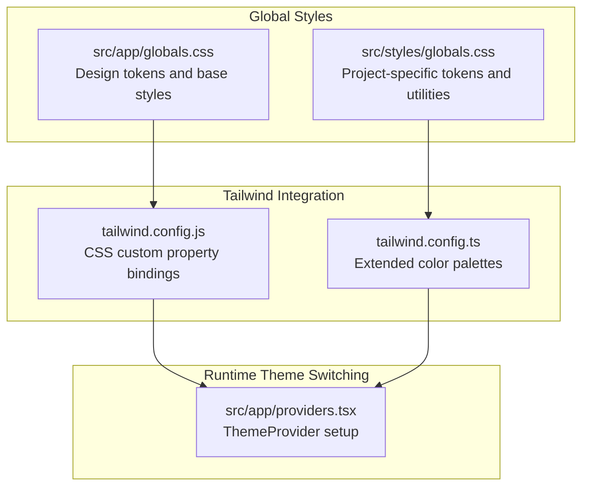
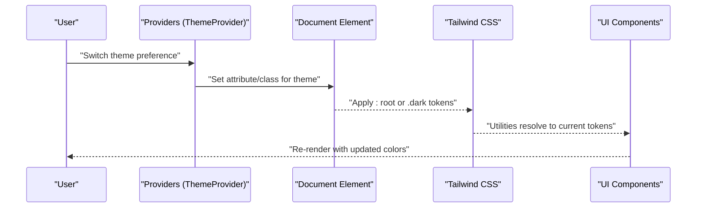
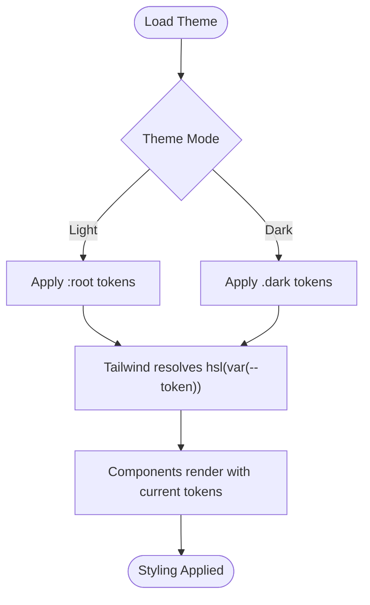
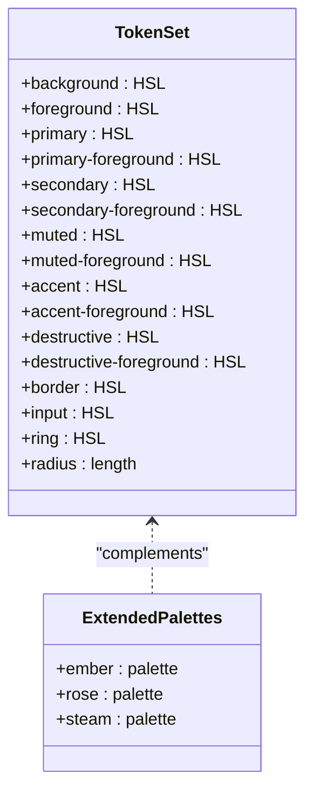
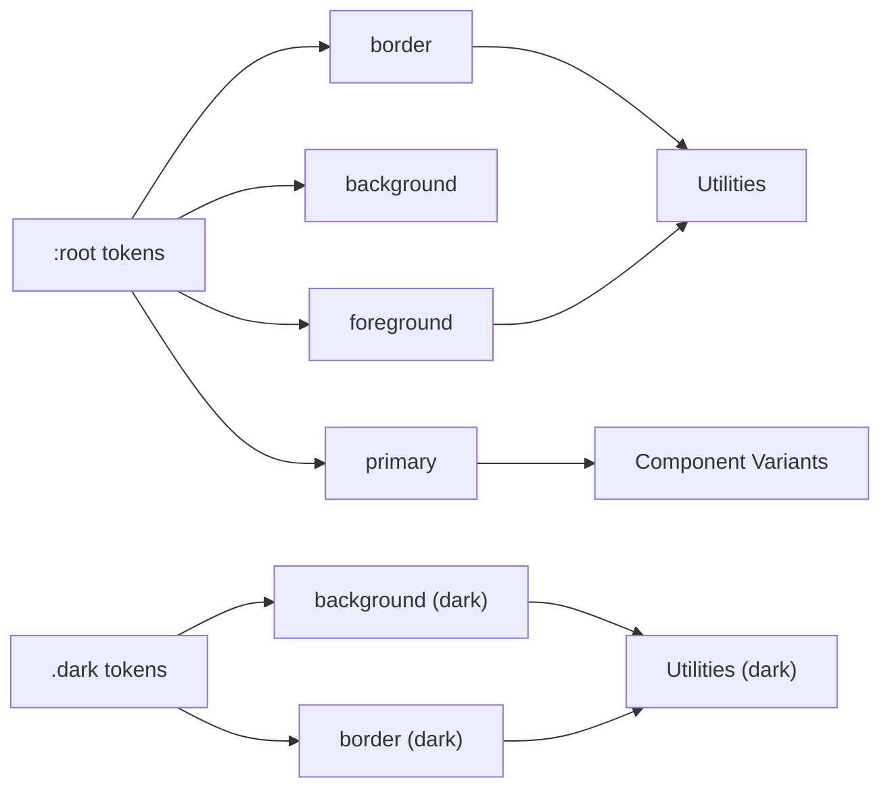
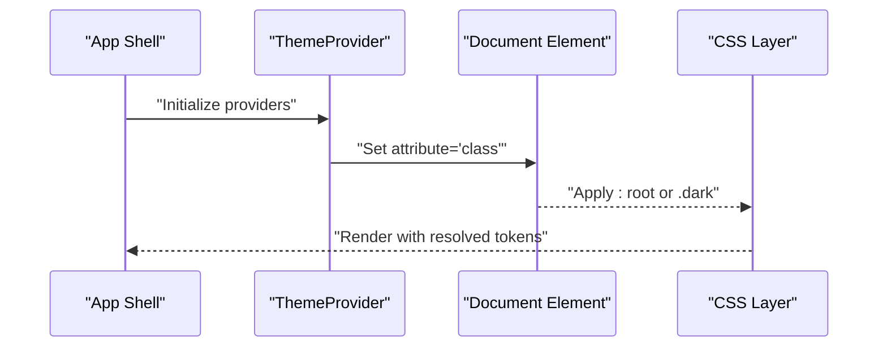
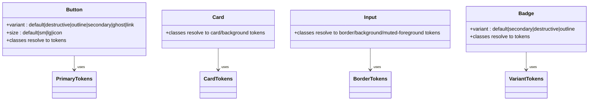
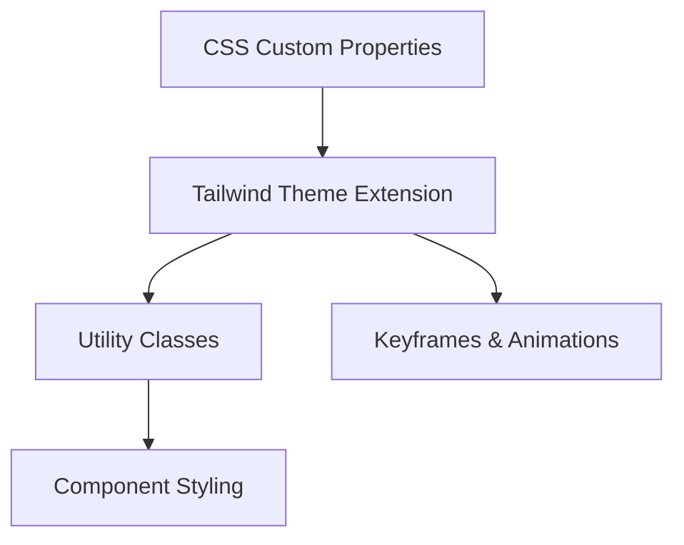
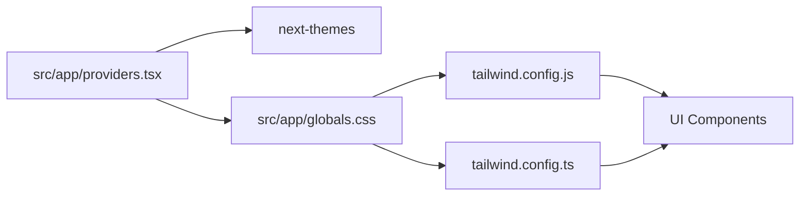

# Design Tokens & Theming

<cite>
**Referenced Files in This Document**
- [src/app/globals.css](file://src/app/globals.css)
- [src/styles/globals.css](file://src/styles/globals.css)
- [tailwind.config.js](file://tailwind.config.js)
- [tailwind.config.ts](file://tailwind.config.ts)
- [src/app/providers.tsx](file://src/app/providers.tsx)
- [src/components/ui/button.tsx](file://src/components/ui/button.tsx)
- [src/components/ui/card.tsx](file://src/components/ui/card.tsx)
- [src/components/ui/input.tsx](file://src/components/ui/input.tsx)
- [src/components/ui/badge.tsx](file://src/components/ui/badge.tsx)
- [src/contexts/auth-context.tsx](file://src/contexts/auth-context.tsx)
- [package.json](file://package.json)
</cite>

## Table of Contents
1. [Introduction](#introduction)
2. [Project Structure](#project-structure)
3. [Core Components](#core-components)
4. [Architecture Overview](#architecture-overview)
5. [Detailed Component Analysis](#detailed-component-analysis)
6. [Dependency Analysis](#dependency-analysis)
7. [Performance Considerations](#performance-considerations)
8. [Accessibility Considerations](#accessibility-considerations)
9. [Troubleshooting Guide](#troubleshooting-guide)
10. [Practical Theming Examples](#practical-theming-examples)
11. [Conclusion](#conclusion)

## Introduction
This document explains the design tokens and theming system used across the project. It focuses on the CSS custom properties architecture, HSL-based color system, theme variable structure, light/dark mode switching, and component-level theming. It also covers global CSS organization, Tailwind integration, and practical guidance for extending themes consistently while maintaining accessibility and responsive behavior.

## Project Structure
The theming system is built around three pillars:
- Global CSS custom properties defining design tokens
- Tailwind configuration that binds design tokens to utilities and component variants
- Provider-based theme switching using a client-side library

**Diagram sources**
- [src/app/globals.css](file://src/app/globals.css#L5-L76)
- [src/styles/globals.css](file://src/styles/globals.css#L5-L67)
- [tailwind.config.js](file://tailwind.config.js#L10-L58)
- [tailwind.config.ts](file://tailwind.config.ts#L10-L88)
- [src/app/providers.tsx](file://src/app/providers.tsx#L24-L33)

**Section sources**
- [src/app/globals.css](file://src/app/globals.css#L1-L141)
- [src/styles/globals.css](file://src/styles/globals.css#L1-L288)
- [tailwind.config.js](file://tailwind.config.js#L1-L108)
- [tailwind.config.ts](file://tailwind.config.ts#L1-L133)
- [src/app/providers.tsx](file://src/app/providers.tsx#L1-L37)

## Core Components
- Design tokens: Centralized HSL-based color tokens defined as CSS custom properties under :root and .dark selectors. These tokens form the semantic color system (background, foreground, primary, secondary, muted, accent, destructive, border, input, ring) plus project-specific tokens (e.g., ember glow and steam levels).
- Tailwind theme extension: Tailwind maps each design token to its HSL value via hsl(var(--token)), enabling consistent utility classes across components.
- Component-level theming: UI components consume Tailwind utilities that resolve to current theme tokens, ensuring consistent styling regardless of theme mode.
- Runtime theme switching: A provider sets the theme attribute on the document element, toggling .dark classes and updating CSS custom properties accordingly.

**Section sources**
- [src/app/globals.css](file://src/app/globals.css#L6-L66)
- [src/styles/globals.css](file://src/styles/globals.css#L6-L57)
- [tailwind.config.js](file://tailwind.config.js#L18-L58)
- [tailwind.config.ts](file://tailwind.config.ts#L18-L88)
- [src/app/providers.tsx](file://src/app/providers.tsx#L24-L33)

## Architecture Overview
The system follows a layered approach:
- Token layer: CSS custom properties define semantic tokens and optional project-specific tokens.
- Utility layer: Tailwind transforms tokens into utilities and component variants.
- Component layer: UI components apply Tailwind classes that bind to current tokens.
- Runtime layer: Theme provider switches modes by toggling the theme attribute and class on the document element.

**Diagram sources**
- [src/app/providers.tsx](file://src/app/providers.tsx#L24-L33)
- [src/app/globals.css](file://src/app/globals.css#L38-L66)
- [tailwind.config.js](file://tailwind.config.js#L18-L58)

## Detailed Component Analysis

### Design Token Architecture
- Semantic tokens: background, foreground, card, popover, primary, secondary, muted, accent, destructive, border, input, ring, radius.
- Project-specific tokens: ember glow and steam levels in the project styles.
- Token resolution: Tailwind reads tokens via hsl(var(--token)) and applies them to utilities and component variants.

**Diagram sources**
- [src/app/globals.css](file://src/app/globals.css#L6-L66)
- [tailwind.config.js](file://tailwind.config.js#L18-L58)

**Section sources**
- [src/app/globals.css](file://src/app/globals.css#L6-L66)
- [src/styles/globals.css](file://src/styles/globals.css#L28-L57)
- [tailwind.config.js](file://tailwind.config.js#L18-L58)

### HSL-Based Color System
- Tokens are expressed as HSL values, enabling consistent hue, saturation, and lightness scaling across light and dark modes.
- Variants: Each semantic token has a foreground counterpart for text/icons placed on top of the token background.
- Extended palettes: Tailwind config defines additional named palettes (e.g., ember, rose, steam) for project-specific usage.

**Diagram sources**
- [src/app/globals.css](file://src/app/globals.css#L6-L35)
- [src/styles/globals.css](file://src/styles/globals.css#L28-L87)
- [tailwind.config.ts](file://tailwind.config.ts#L53-L87)

**Section sources**
- [src/app/globals.css](file://src/app/globals.css#L6-L35)
- [src/styles/globals.css](file://src/styles/globals.css#L28-L87)
- [tailwind.config.ts](file://tailwind.config.ts#L53-L87)

### Theme Variable Structure and Inheritance
- Base tokens under :root define default values.
- .dark selector overrides tokens for dark mode.
- Utilities inherit from tokens (e.g., border inherits from --border).
- Component variants inherit from semantic tokens (e.g., button variants use primary, secondary, destructive).

**Diagram sources**
- [src/app/globals.css](file://src/app/globals.css#L6-L66)
- [tailwind.config.js](file://tailwind.config.js#L18-L58)

**Section sources**
- [src/app/globals.css](file://src/app/globals.css#L6-L66)
- [tailwind.config.js](file://tailwind.config.js#L18-L58)

### Dark/Light Mode Switching Mechanism
- Provider configuration sets the theme attribute to "class" and uses a system-aware default.
- The provider toggles the theme class on the root element, switching between light and dark tokens.
- CSS responds to the theme class to apply appropriate token sets.

**Diagram sources**
- [src/app/providers.tsx](file://src/app/providers.tsx#L24-L33)
- [src/app/globals.css](file://src/app/globals.css#L38-L66)

**Section sources**
- [src/app/providers.tsx](file://src/app/providers.tsx#L24-L33)
- [src/app/globals.css](file://src/app/globals.css#L38-L66)

### Component-Level Theming Approach
- Buttons: Variants map to semantic tokens (e.g., default uses primary and primary-foreground).
- Cards: Background and foreground tokens applied via class composition.
- Inputs: Use border, background, muted-foreground tokens for consistent styling.
- Badges: Variants map to primary/secondary/destructive tokens with appropriate foregrounds.

**Diagram sources**
- [src/components/ui/button.tsx](file://src/components/ui/button.tsx#L6-L33)
- [src/components/ui/card.tsx](file://src/components/ui/card.tsx#L10-L13)
- [src/components/ui/input.tsx](file://src/components/ui/input.tsx#L12-L13)
- [src/components/ui/badge.tsx](file://src/components/ui/badge.tsx#L5-L23)

**Section sources**
- [src/components/ui/button.tsx](file://src/components/ui/button.tsx#L6-L33)
- [src/components/ui/card.tsx](file://src/components/ui/card.tsx#L10-L13)
- [src/components/ui/input.tsx](file://src/components/ui/input.tsx#L12-L13)
- [src/components/ui/badge.tsx](file://src/components/ui/badge.tsx#L5-L23)

### CSS Custom Property Usage and Tailwind Integration
- Tailwind theme extends color definitions to resolve HSL tokens.
- Utilities and component variants rely on Tailwind’s token resolution.
- Typography and keyframes leverage tokens for consistent animations and text styles.

**Diagram sources**
- [tailwind.config.js](file://tailwind.config.js#L18-L100)
- [tailwind.config.ts](file://tailwind.config.ts#L18-L128)

**Section sources**
- [tailwind.config.js](file://tailwind.config.js#L18-L100)
- [tailwind.config.ts](file://tailwind.config.ts#L18-L128)

## Dependency Analysis
- Providers depend on the theme provider library to switch modes.
- Global CSS depends on Tailwind layers and the theme provider to apply tokens.
- UI components depend on Tailwind utilities that resolve to tokens.

**Diagram sources**
- [src/app/providers.tsx](file://src/app/providers.tsx#L5-L33)
- [src/app/globals.css](file://src/app/globals.css#L1-L141)
- [tailwind.config.js](file://tailwind.config.js#L1-L108)
- [tailwind.config.ts](file://tailwind.config.ts#L1-L133)

**Section sources**
- [package.json](file://package.json#L13-L62)
- [src/app/providers.tsx](file://src/app/providers.tsx#L5-L33)
- [src/app/globals.css](file://src/app/globals.css#L1-L141)
- [tailwind.config.js](file://tailwind.config.js#L1-L108)
- [tailwind.config.ts](file://tailwind.config.ts#L1-L133)

## Performance Considerations
- CSS custom properties avoid reflows by changing variables rather than recalculating styles.
- Tailwind utilities compose efficiently; prefer variant classes over ad hoc styles.
- Keep token updates minimal to reduce cascade and repaint costs.
- Avoid excessive dynamic calculations in CSS; rely on precomputed tokens.

## Accessibility Considerations
- Contrast: Ensure foreground tokens maintain sufficient contrast against background tokens. Use semantic tokens to preserve accessible combinations.
- High contrast mode: The project includes media queries to increase border and ring contrast for high-contrast preferences.
- Reduced motion: The project reduces motion for reduced-motion preferences, preserving usability.

**Section sources**
- [src/styles/globals.css](file://src/styles/globals.css#L261-L271)
- [src/styles/globals.css](file://src/styles/globals.css#L273-L287)

## Troubleshooting Guide
- Theme not switching: Verify the provider is wrapping the app and the theme attribute is set to "class".
- Tokens not applying: Confirm Tailwind is configured to resolve HSL tokens and that utilities reference the correct token names.
- Component colors incorrect: Check component variants and ensure they align with intended semantic tokens.
- Auth-related theme persistence: The auth context does not manage theme; ensure theme preference is persisted separately if needed.

**Section sources**
- [src/app/providers.tsx](file://src/app/providers.tsx#L24-L33)
- [tailwind.config.js](file://tailwind.config.js#L18-L58)
- [src/components/ui/button.tsx](file://src/components/ui/button.tsx#L10-L20)
- [src/contexts/auth-context.tsx](file://src/contexts/auth-context.tsx#L30-L145)

## Practical Theming Examples
- Customize a new semantic token:
  - Add the token under :root and .dark in the global CSS.
  - Extend Tailwind colors to expose the token as a utility.
  - Use the token in components via Tailwind classes.
- Create a variant color:
  - Define a new token pair (e.g., --success and --success-foreground).
  - Extend Tailwind colors with a new group (e.g., success) and foreground variant.
  - Apply the variant in components using the new token classes.
- Implement consistent design system:
  - Use semantic tokens for all components.
  - Prefer Tailwind utilities bound to tokens for consistency.
  - Maintain separate token sets for light and dark modes.
- Responsive theme adaptation:
  - Use media queries to adjust tokens for specific breakpoints if needed.
  - Ensure typography and spacing remain consistent across modes.

**Section sources**
- [src/app/globals.css](file://src/app/globals.css#L6-L66)
- [tailwind.config.js](file://tailwind.config.js#L18-L58)
- [tailwind.config.ts](file://tailwind.config.ts#L53-L87)
- [src/components/ui/button.tsx](file://src/components/ui/button.tsx#L10-L20)

## Conclusion
The project’s theming system leverages CSS custom properties and HSL-based tokens to deliver a consistent, maintainable design system. Tailwind integrates tokens into utilities and component variants, while a provider-driven theme switching mechanism ensures seamless light/dark mode transitions. By adhering to semantic tokens and extending the system thoughtfully, teams can scale design consistency across components and modes.