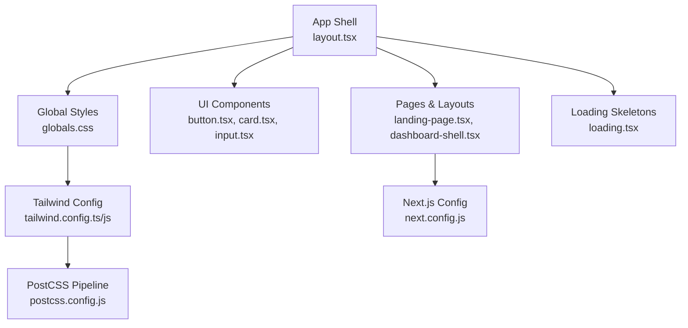
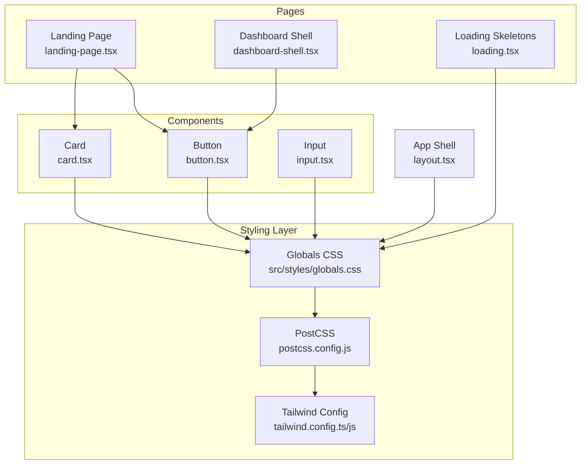
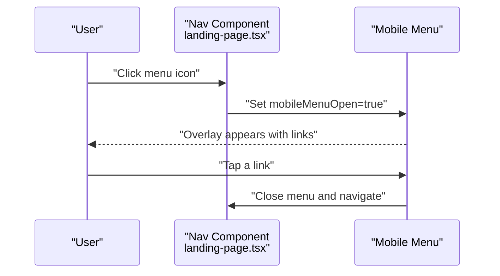
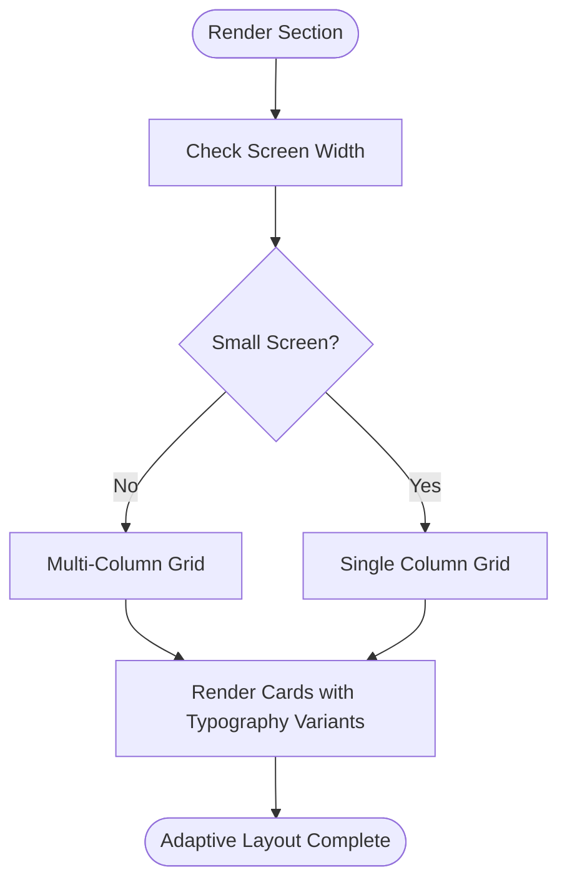
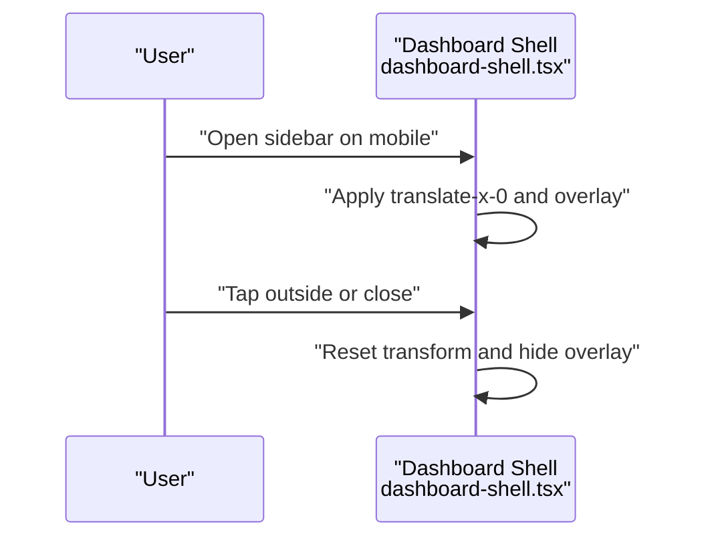
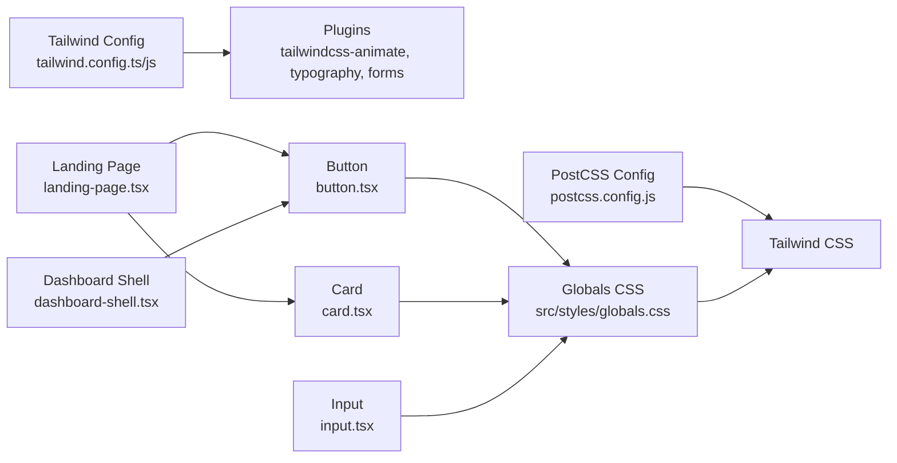

# Responsive Design System

<cite>
**Referenced Files in This Document**
- [tailwind.config.js](file://tailwind.config.js)
- [tailwind.config.ts](file://tailwind.config.ts)
- [globals.css](file://src/styles/globals.css)
- [layout.tsx](file://src/app/layout.tsx)
- [postcss.config.js](file://postcss.config.js)
- [button.tsx](file://src/components/ui/button.tsx)
- [card.tsx](file://src/components/ui/card.tsx)
- [input.tsx](file://src/components/ui/input.tsx)
- [landing-page.tsx](file://src/components/landing/landing-page.tsx)
- [dashboard-shell.tsx](file://src/components/dashboard/dashboard-shell.tsx)
- [loading.tsx](file://src/app/loading.tsx)
- [next.config.js](file://next.config.js)
- [utils.ts](file://src/lib/utils.ts)
</cite>

## Table of Contents
1. [Introduction](#introduction)
2. [Project Structure](#project-structure)
3. [Core Components](#core-components)
4. [Architecture Overview](#architecture-overview)
5. [Detailed Component Analysis](#detailed-component-analysis)
6. [Dependency Analysis](#dependency-analysis)
7. [Performance Considerations](#performance-considerations)
8. [Troubleshooting Guide](#troubleshooting-guide)
9. [Conclusion](#conclusion)
10. [Appendices](#appendices)

## Introduction
This document describes the responsive design system used across the application. It focuses on breakpoint management, mobile-first approach, container-based layouts, responsive utilities, grid systems, flexible component sizing, viewport-based scaling, aspect ratio handling, cross-device compatibility, and performance considerations. Practical examples demonstrate responsive navigation, adaptive content layouts, and mobile-optimized interfaces, alongside responsive typography, image scaling, and interactive element sizing.

## Project Structure
The responsive system is implemented via Tailwind CSS with a container-centered approach and a set of utility classes. Global styles define base tokens and media queries for accessibility and device-specific adjustments. UI components expose consistent sizing and spacing APIs that adapt across breakpoints.

**Diagram sources**
- [layout.tsx](file://src/app/layout.tsx#L1-L102)
- [globals.css](file://src/styles/globals.css#L1-L288)
- [button.tsx](file://src/components/ui/button.tsx#L1-L55)
- [card.tsx](file://src/components/ui/card.tsx#L1-L78)
- [input.tsx](file://src/components/ui/input.tsx#L1-L24)
- [landing-page.tsx](file://src/components/landing/landing-page.tsx#L1-L434)
- [dashboard-shell.tsx](file://src/components/dashboard/dashboard-shell.tsx#L1-L224)
- [loading.tsx](file://src/app/loading.tsx#L1-L39)
- [tailwind.config.js](file://tailwind.config.js#L1-L108)
- [tailwind.config.ts](file://tailwind.config.ts#L1-L133)
- [postcss.config.js](file://postcss.config.js#L1-L7)
- [next.config.js](file://next.config.js#L1-L56)

**Section sources**
- [layout.tsx](file://src/app/layout.tsx#L1-L102)
- [globals.css](file://src/styles/globals.css#L1-L288)
- [tailwind.config.js](file://tailwind.config.js#L1-L108)
- [tailwind.config.ts](file://tailwind.config.ts#L1-L133)
- [postcss.config.js](file://postcss.config.js#L1-L7)
- [next.config.js](file://next.config.js#L1-L56)

## Core Components
- Container-based layout: Tailwind’s container is centered with a max-width configuration, ensuring content remains readable and properly spaced across devices.
- Breakpoints and responsive utilities: Extensive use of responsive modifiers (e.g., md:, lg:) across components and pages to adapt layout and spacing.
- Flexible component sizing: UI primitives expose consistent size variants (default, sm, lg, icon) enabling scalable interactive elements.
- Typography and accessibility: Base tokens and media queries support high contrast and reduced motion preferences.
- Skeleton and loading patterns: Grid-based skeletons adapt to breakpoint grids for smooth perceived performance.

Key implementation references:
- Container configuration and extended theme tokens: [tailwind.config.js](file://tailwind.config.js#L10-L17), [tailwind.config.ts](file://tailwind.config.ts#L10-L17)
- Responsive utilities and component sizing: [button.tsx](file://src/components/ui/button.tsx#L21-L26), [card.tsx](file://src/components/ui/card.tsx#L38-L40)
- Global responsive text and accessibility media queries: [globals.css](file://src/styles/globals.css#L254-L288)
- Skeleton grid adaptation: [loading.tsx](file://src/app/loading.tsx#L23-L35)

**Section sources**
- [tailwind.config.js](file://tailwind.config.js#L10-L17)
- [tailwind.config.ts](file://tailwind.config.ts#L10-L17)
- [button.tsx](file://src/components/ui/button.tsx#L21-L26)
- [card.tsx](file://src/components/ui/card.tsx#L38-L40)
- [globals.css](file://src/styles/globals.css#L254-L288)
- [loading.tsx](file://src/app/loading.tsx#L23-L35)

## Architecture Overview
The responsive architecture combines:
- Tailwind configuration for container sizing and theme tokens
- Global CSS for base typography, accessibility, and device-specific tweaks
- UI components with consistent sizing APIs
- Pages that apply responsive modifiers to build adaptive layouts
- PostCSS pipeline to process Tailwind utilities
- Next.js configuration for images and routing

**Diagram sources**
- [tailwind.config.js](file://tailwind.config.js#L1-L108)
- [tailwind.config.ts](file://tailwind.config.ts#L1-L133)
- [postcss.config.js](file://postcss.config.js#L1-L7)
- [globals.css](file://src/styles/globals.css#L1-L288)
- [button.tsx](file://src/components/ui/button.tsx#L1-L55)
- [card.tsx](file://src/components/ui/card.tsx#L1-L78)
- [input.tsx](file://src/components/ui/input.tsx#L1-L24)
- [landing-page.tsx](file://src/components/landing/landing-page.tsx#L1-L434)
- [dashboard-shell.tsx](file://src/components/dashboard/dashboard-shell.tsx#L1-L224)
- [loading.tsx](file://src/app/loading.tsx#L1-L39)
- [layout.tsx](file://src/app/layout.tsx#L1-L102)

## Detailed Component Analysis

### Responsive Breakpoint Configuration
- Container-based layout: The container is centered with a max-width tailored for larger screens, ensuring content readability and consistent gutters.
- Theme extension: Colors, radii, keyframes, animations, and typography are defined centrally to maintain consistency across breakpoints.
- Plugins: Tailwind plugins enable form styling, typography enhancements, and animation utilities.

Implementation references:
- Container configuration: [tailwind.config.js](file://tailwind.config.js#L11-L17), [tailwind.config.ts](file://tailwind.config.ts#L11-L17)
- Extended theme tokens: [tailwind.config.js](file://tailwind.config.js#L18-L101), [tailwind.config.ts](file://tailwind.config.ts#L18-L129)
- Plugins: [tailwind.config.js](file://tailwind.config.js#L103-L108), [tailwind.config.ts](file://tailwind.config.ts#L130-L131)

**Section sources**
- [tailwind.config.js](file://tailwind.config.js#L11-L17)
- [tailwind.config.js](file://tailwind.config.js#L18-L101)
- [tailwind.config.ts](file://tailwind.config.ts#L11-L17)
- [tailwind.config.ts](file://tailwind.config.ts#L18-L129)
- [tailwind.config.js](file://tailwind.config.js#L103-L108)
- [tailwind.config.ts](file://tailwind.config.ts#L130-L131)

### Mobile-First Approach and Container-Based Layouts
- Mobile-first utilities: Components and pages apply responsive modifiers progressively (e.g., md:, lg:) to adapt from small to large screens.
- Container usage: Pages wrap content in containers to constrain widths and center content at larger breakpoints.
- Adaptive grids: Grid classes adjust column counts per breakpoint for cards, lists, and dashboards.

Examples:
- Navigation and hero sections with responsive spacing and alignment: [landing-page.tsx](file://src/components/landing/landing-page.tsx#L248-L271)
- Feature grid adapting columns: [landing-page.tsx](file://src/components/landing/landing-page.tsx#L284-L300)
- Pricing and testimonials grids: [landing-page.tsx](file://src/components/landing/landing-page.tsx#L313-L351), [landing-page.tsx](file://src/components/landing/landing-page.tsx#L363-L384)

**Section sources**
- [landing-page.tsx](file://src/components/landing/landing-page.tsx#L248-L271)
- [landing-page.tsx](file://src/components/landing/landing-page.tsx#L284-L300)
- [landing-page.tsx](file://src/components/landing/landing-page.tsx#L313-L351)
- [landing-page.tsx](file://src/components/landing/landing-page.tsx#L363-L384)

### Responsive Utility Patterns and Grid Systems
- Grid responsiveness: Pages use grid classes that change number of columns at different breakpoints (e.g., md:grid-cols-2, lg:grid-cols-3).
- Skeleton grids mirror page grids for consistent perceived layout during loading.
- Interactive elements: Buttons and inputs expose size variants that scale consistently across breakpoints.

References:
- Grid adaptations across pages: [landing-page.tsx](file://src/components/landing/landing-page.tsx#L284-L300), [landing-page.tsx](file://src/components/landing/landing-page.tsx#L313-L351)
- Skeleton grid: [loading.tsx](file://src/app/loading.tsx#L23-L35)
- Button sizes: [button.tsx](file://src/components/ui/button.tsx#L21-L26)

**Section sources**
- [landing-page.tsx](file://src/components/landing/landing-page.tsx#L284-L300)
- [landing-page.tsx](file://src/components/landing/landing-page.tsx#L313-L351)
- [loading.tsx](file://src/app/loading.tsx#L23-L35)
- [button.tsx](file://src/components/ui/button.tsx#L21-L26)

### Flexible Component Sizing
- Button sizing: Consistent height and padding variants (default, sm, lg, icon) scale appropriately across breakpoints.
- Card typography: Titles and descriptions use responsive text utilities to maintain readability.
- Input sizing: Inputs adopt consistent heights and paddings with focus states that remain visible across devices.

References:
- Button variants and sizes: [button.tsx](file://src/components/ui/button.tsx#L6-L33)
- Card typography: [card.tsx](file://src/components/ui/card.tsx#L31-L44)
- Input styling: [input.tsx](file://src/components/ui/input.tsx#L10-L19)

**Section sources**
- [button.tsx](file://src/components/ui/button.tsx#L6-L33)
- [card.tsx](file://src/components/ui/card.tsx#L31-L44)
- [input.tsx](file://src/components/ui/input.tsx#L10-L19)

### Viewport-Based Scaling and Aspect Ratio Handling
- Typography scaling: Headings and paragraphs use responsive text utilities to improve legibility across screen sizes.
- Editor-specific adjustments: Media queries fine-tune text sizes for writing interfaces on smaller screens.
- Aspect ratio considerations: While explicit aspect ratio utilities are not configured, components rely on padding and content-driven sizing to preserve proportions.

References:
- Responsive text utilities: [globals.css](file://src/styles/globals.css#L254-L259)
- Writing editor adjustments: [globals.css](file://src/styles/globals.css#L176-L184)

**Section sources**
- [globals.css](file://src/styles/globals.css#L254-L259)
- [globals.css](file://src/styles/globals.css#L176-L184)

### Cross-Device Compatibility Strategies
- Accessibility media queries: High contrast and reduced motion modes are supported via media queries.
- Font loading: Google Fonts are configured with CSS variables for consistent fallbacks.
- Image handling: Next.js image optimization is configured with remote patterns for safe asset delivery.

References:
- High contrast and reduced motion: [globals.css](file://src/styles/globals.css#L262-L288)
- Font variables: [layout.tsx](file://src/app/layout.tsx#L7-L12)
- Image remote patterns: [next.config.js](file://next.config.js#L7-L23)

**Section sources**
- [globals.css](file://src/styles/globals.css#L262-L288)
- [layout.tsx](file://src/app/layout.tsx#L7-L12)
- [next.config.js](file://next.config.js#L7-L23)

### Practical Examples

#### Responsive Navigation
- Desktop navigation uses hidden and visible breakpoints to switch between compact and expanded layouts.
- Mobile menu overlays and toggles provide accessible navigation on small screens.

References:
- Desktop vs. mobile nav: [landing-page.tsx](file://src/components/landing/landing-page.tsx#L144-L178)
- Mobile menu overlay and links: [landing-page.tsx](file://src/components/landing/landing-page.tsx#L182-L244)

**Diagram sources**
- [landing-page.tsx](file://src/components/landing/landing-page.tsx#L172-L177)
- [landing-page.tsx](file://src/components/landing/landing-page.tsx#L182-L244)

**Section sources**
- [landing-page.tsx](file://src/components/landing/landing-page.tsx#L144-L178)
- [landing-page.tsx](file://src/components/landing/landing-page.tsx#L182-L244)

#### Adaptive Content Layouts
- Feature, pricing, and testimonials sections use responsive grids to display content in a single column on small screens and multiple columns on larger screens.
- Cards adapt spacing and typography to maintain visual hierarchy.

References:
- Feature grid: [landing-page.tsx](file://src/components/landing/landing-page.tsx#L284-L300)
- Pricing grid: [landing-page.tsx](file://src/components/landing/landing-page.tsx#L313-L351)
- Testimonials grid: [landing-page.tsx](file://src/components/landing/landing-page.tsx#L363-L384)
- Card composition: [card.tsx](file://src/components/ui/card.tsx#L1-L78)

**Diagram sources**
- [landing-page.tsx](file://src/components/landing/landing-page.tsx#L284-L300)
- [landing-page.tsx](file://src/components/landing/landing-page.tsx#L313-L351)
- [landing-page.tsx](file://src/components/landing/landing-page.tsx#L363-L384)
- [card.tsx](file://src/components/ui/card.tsx#L1-L78)

**Section sources**
- [landing-page.tsx](file://src/components/landing/landing-page.tsx#L284-L300)
- [landing-page.tsx](file://src/components/landing/landing-page.tsx#L313-L351)
- [landing-page.tsx](file://src/components/landing/landing-page.tsx#L363-L384)
- [card.tsx](file://src/components/ui/card.tsx#L1-L78)

#### Mobile-Optimized Interfaces
- Dashboard shell adapts sidebar behavior and header actions for mobile and desktop.
- Overlay and transforms provide smooth transitions and focus management.

References:
- Sidebar overlay and transforms: [dashboard-shell.tsx](file://src/components/dashboard/dashboard-shell.tsx#L63-L77)
- Top bar and actions: [dashboard-shell.tsx](file://src/components/dashboard/dashboard-shell.tsx#L179-L215)

**Diagram sources**
- [dashboard-shell.tsx](file://src/components/dashboard/dashboard-shell.tsx#L63-L77)
- [dashboard-shell.tsx](file://src/components/dashboard/dashboard-shell.tsx#L179-L215)

**Section sources**
- [dashboard-shell.tsx](file://src/components/dashboard/dashboard-shell.tsx#L63-L77)
- [dashboard-shell.tsx](file://src/components/dashboard/dashboard-shell.tsx#L179-L215)

### Responsive Typography System
- Base tokens and layered styles define consistent typography across light and dark themes.
- Prose utilities and custom prose classes tailor headings, paragraphs, lists, and code blocks for content-rich pages.
- Editor-specific typography adjusts line height and selection styling for writing experiences.

References:
- Base tokens and layers: [globals.css](file://src/styles/globals.css#L6-L67)
- Prose classes: [globals.css](file://src/styles/globals.css#L70-L112)
- Manuscript editor typography: [globals.css](file://src/styles/globals.css#L140-L149)

**Section sources**
- [globals.css](file://src/styles/globals.css#L6-L67)
- [globals.css](file://src/styles/globals.css#L70-L112)
- [globals.css](file://src/styles/globals.css#L140-L149)

### Image Scaling and Interactive Element Sizing
- Images are optimized via Next.js configuration with remote patterns for safe external assets.
- Interactive elements (buttons, inputs) use consistent sizing and spacing utilities that scale across breakpoints.

References:
- Image optimization: [next.config.js](file://next.config.js#L7-L23)
- Button sizing: [button.tsx](file://src/components/ui/button.tsx#L21-L26)
- Input sizing: [input.tsx](file://src/components/ui/input.tsx#L10-L19)

**Section sources**
- [next.config.js](file://next.config.js#L7-L23)
- [button.tsx](file://src/components/ui/button.tsx#L21-L26)
- [input.tsx](file://src/components/ui/input.tsx#L10-L19)

## Dependency Analysis
The responsive system relies on Tailwind configuration, PostCSS processing, global styles, and UI components. Pages consume these primitives to assemble adaptive layouts.

**Diagram sources**
- [tailwind.config.js](file://tailwind.config.js#L103-L108)
- [tailwind.config.ts](file://tailwind.config.ts#L130-L131)
- [postcss.config.js](file://postcss.config.js#L1-L7)
- [globals.css](file://src/styles/globals.css#L1-L288)
- [button.tsx](file://src/components/ui/button.tsx#L1-L55)
- [card.tsx](file://src/components/ui/card.tsx#L1-L78)
- [input.tsx](file://src/components/ui/input.tsx#L1-L24)
- [landing-page.tsx](file://src/components/landing/landing-page.tsx#L1-L434)
- [dashboard-shell.tsx](file://src/components/dashboard/dashboard-shell.tsx#L1-L224)

**Section sources**
- [tailwind.config.js](file://tailwind.config.js#L103-L108)
- [tailwind.config.ts](file://tailwind.config.ts#L130-L131)
- [postcss.config.js](file://postcss.config.js#L1-L7)
- [globals.css](file://src/styles/globals.css#L1-L288)
- [button.tsx](file://src/components/ui/button.tsx#L1-L55)
- [card.tsx](file://src/components/ui/card.tsx#L1-L78)
- [input.tsx](file://src/components/ui/input.tsx#L1-L24)
- [landing-page.tsx](file://src/components/landing/landing-page.tsx#L1-L434)
- [dashboard-shell.tsx](file://src/components/dashboard/dashboard-shell.tsx#L1-L224)

## Performance Considerations
- Progressive enhancement: Components and pages progressively enhance from minimal markup to richer layouts at larger breakpoints.
- Graceful degradation: Media queries and fallbacks ensure usability when advanced features are unavailable.
- Skeleton loading: Grid-based skeletons match page layouts to reduce layout shift and improve perceived performance.
- CSS variables and utilities: Centralized tokens minimize duplication and improve maintainability.

References:
- Skeleton grid pattern: [loading.tsx](file://src/app/loading.tsx#L23-L35)
- Utilities merge: [utils.ts](file://src/lib/utils.ts#L4-L6)

**Section sources**
- [loading.tsx](file://src/app/loading.tsx#L23-L35)
- [utils.ts](file://src/lib/utils.ts#L4-L6)

## Troubleshooting Guide
- Responsive classes not applying: Verify Tailwind content paths and ensure PostCSS is configured to process Tailwind.
- Typography inconsistencies: Confirm base tokens and layer ordering in global styles.
- Accessibility issues: Review high contrast and reduced motion media queries.
- Image rendering problems: Check Next.js image remote patterns and domain configurations.

References:
- Tailwind content and plugins: [tailwind.config.js](file://tailwind.config.js#L4-L10), [tailwind.config.ts](file://tailwind.config.ts#L6-L9)
- PostCSS pipeline: [postcss.config.js](file://postcss.config.js#L1-L7)
- Accessibility media queries: [globals.css](file://src/styles/globals.css#L262-L288)
- Image remote patterns: [next.config.js](file://next.config.js#L7-L23)

**Section sources**
- [tailwind.config.js](file://tailwind.config.js#L4-L10)
- [tailwind.config.ts](file://tailwind.config.ts#L6-L9)
- [postcss.config.js](file://postcss.config.js#L1-L7)
- [globals.css](file://src/styles/globals.css#L262-L288)
- [next.config.js](file://next.config.js#L7-L23)

## Conclusion
The responsive design system leverages Tailwind’s container-centric configuration, a mobile-first approach, and consistent component sizing to deliver adaptive layouts across devices. Global styles and media queries ensure accessibility and cross-device compatibility, while skeleton patterns and utility-first classes support performance and progressive enhancement.

## Appendices
- Additional responsive patterns can be introduced by extending the Tailwind configuration and adding targeted media queries in global styles.