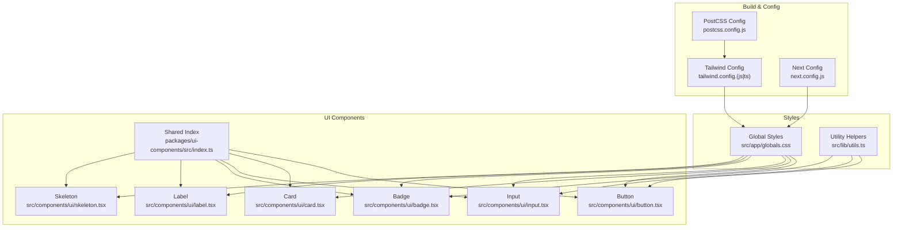
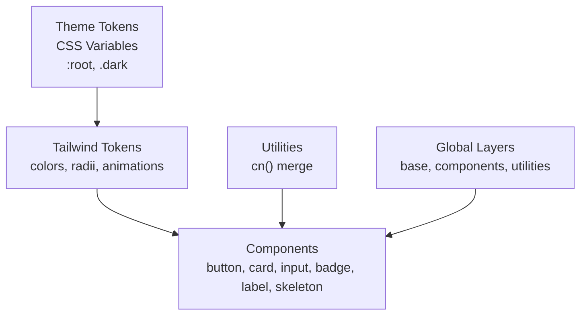
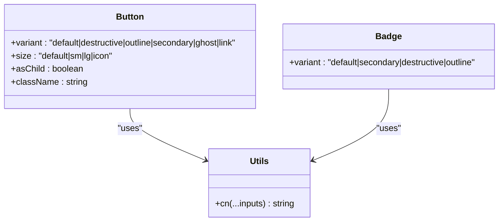
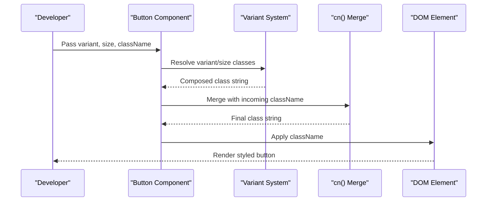
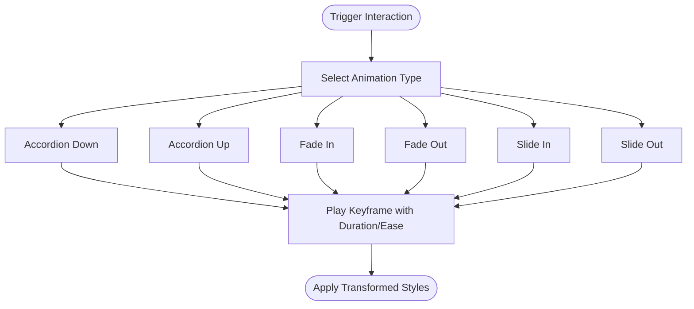
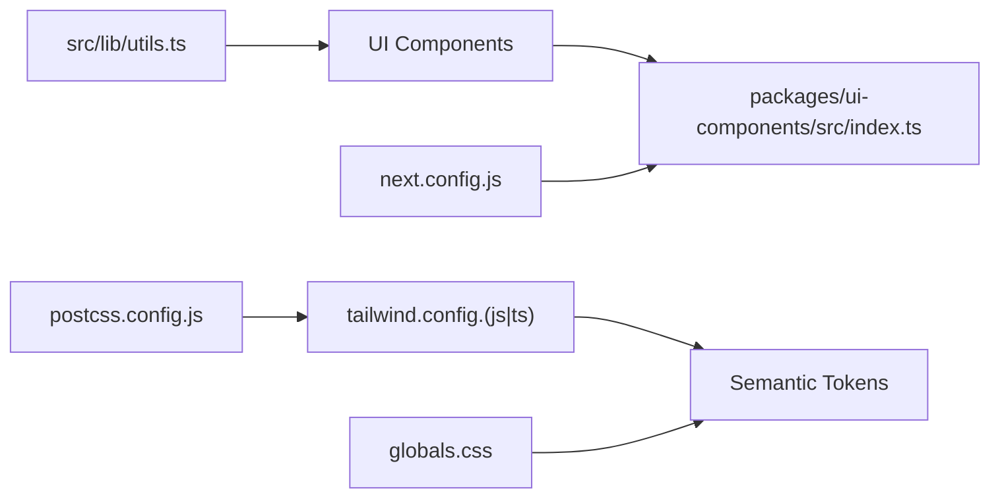

# Styling & Design System

<cite>
**Referenced Files in This Document**
- [tailwind.config.js](file://tailwind.config.js)
- [tailwind.config.ts](file://tailwind.config.ts)
- [postcss.config.js](file://postcss.config.js)
- [next.config.js](file://next.config.js)
- [src/app/globals.css](file://src/app/globals.css)
- [src/lib/utils.ts](file://src/lib/utils.ts)
- [src/components/ui/button.tsx](file://src/components/ui/button.tsx)
- [src/components/ui/card.tsx](file://src/components/ui/card.tsx)
- [src/components/ui/input.tsx](file://src/components/ui/input.tsx)
- [src/components/ui/badge.tsx](file://src/components/ui/badge.tsx)
- [src/components/ui/label.tsx](file://src/components/ui/label.tsx)
- [src/components/ui/skeleton.tsx](file://src/components/ui/skeleton.tsx)
- [packages/ui-components/package.json](file://packages/ui-components/package.json)
- [packages/ui-components/src/index.ts](file://packages/ui-components/src/index.ts)
</cite>

## Table of Contents
1. [Introduction](#introduction)
2. [Project Structure](#project-structure)
3. [Core Components](#core-components)
4. [Architecture Overview](#architecture-overview)
5. [Detailed Component Analysis](#detailed-component-analysis)
6. [Dependency Analysis](#dependency-analysis)
7. [Performance Considerations](#performance-considerations)
8. [Troubleshooting Guide](#troubleshooting-guide)
9. [Conclusion](#conclusion)
10. [Appendices](#appendices)

## Introduction
This document describes the styling and design system built on Tailwind CSS. It explains the design system architecture, color palette, typography system, component styling conventions, and theme implementation including dark mode. It also documents responsive design patterns, accessibility considerations, global styles, utility class patterns, and custom CSS integration. Guidance is included for performance optimization, CSS optimization, and cross-browser compatibility, with practical examples drawn from the repository’s configuration and components.

## Project Structure
The styling system spans configuration, global CSS, and reusable UI components:
- Tailwind configuration defines design tokens, plugins, and animations.
- Global CSS sets CSS variables for light/dark themes and registers base/component/utility layers.
- Shared UI components encapsulate consistent styling via variant systems and design tokens.
- PostCSS pipeline compiles Tailwind and vendor prefixes.
- Next.js configuration enables server components and external package transpilation.

**Diagram sources**
- [tailwind.config.js](file://tailwind.config.js#L1-L108)
- [tailwind.config.ts](file://tailwind.config.ts#L1-L133)
- [postcss.config.js](file://postcss.config.js#L1-L7)
- [next.config.js](file://next.config.js#L1-L56)
- [src/app/globals.css](file://src/app/globals.css#L1-L141)
- [src/lib/utils.ts](file://src/lib/utils.ts#L1-L6)
- [src/components/ui/button.tsx](file://src/components/ui/button.tsx#L1-L55)
- [src/components/ui/card.tsx](file://src/components/ui/card.tsx#L1-L78)
- [src/components/ui/input.tsx](file://src/components/ui/input.tsx#L1-L24)
- [src/components/ui/badge.tsx](file://src/components/ui/badge.tsx#L1-L35)
- [src/components/ui/label.tsx](file://src/components/ui/label.tsx#L1-L23)
- [src/components/ui/skeleton.tsx](file://src/components/ui/skeleton.tsx#L1-L17)
- [packages/ui-components/src/index.ts](file://packages/ui-components/src/index.ts#L1-L12)

**Section sources**
- [tailwind.config.js](file://tailwind.config.js#L1-L108)
- [tailwind.config.ts](file://tailwind.config.ts#L1-L133)
- [postcss.config.js](file://postcss.config.js#L1-L7)
- [next.config.js](file://next.config.js#L1-L56)
- [src/app/globals.css](file://src/app/globals.css#L1-L141)
- [src/lib/utils.ts](file://src/lib/utils.ts#L1-L6)
- [packages/ui-components/src/index.ts](file://packages/ui-components/src/index.ts#L1-L12)

## Core Components
- Design tokens: CSS variables define semantic color roles and corner radius. Dark mode toggles via a class on the root element.
- Theme extension: Tailwind maps tokens to semantic color scales and adds brand-specific palettes and animations.
- Typography: Tailwind Typography plugin integrates with tokens for prose defaults.
- Utilities: Global layers register reusable component and utility classes.
- Component library: Variants and design tokens are applied consistently across shared components.

Key implementation references:
- Tokens and dark mode: [src/app/globals.css](file://src/app/globals.css#L5-L67)
- Token-driven theme: [tailwind.config.js](file://tailwind.config.js#L10-L53), [tailwind.config.ts](file://tailwind.config.ts#L10-L88)
- Typography integration: [tailwind.config.js](file://tailwind.config.js#L88-L100), [tailwind.config.ts](file://tailwind.config.ts#L119-L127)
- Global utilities and components: [src/app/globals.css](file://src/app/globals.css#L78-L141)
- Utility merging helper: [src/lib/utils.ts](file://src/lib/utils.ts#L4-L6)

**Section sources**
- [src/app/globals.css](file://src/app/globals.css#L5-L67)
- [tailwind.config.js](file://tailwind.config.js#L10-L53)
- [tailwind.config.ts](file://tailwind.config.ts#L10-L88)
- [tailwind.config.js](file://tailwind.config.js#L88-L100)
- [tailwind.config.ts](file://tailwind.config.ts#L119-L127)
- [src/app/globals.css](file://src/app/globals.css#L78-L141)
- [src/lib/utils.ts](file://src/lib/utils.ts#L4-L6)

## Architecture Overview
The design system architecture centers on:
- CSS custom properties for theme tokens and dark mode switching.
- Tailwind’s tokenized color system mapped to CSS variables.
- A variant-based component model using class variance authority and a merge utility.
- Global layers for base, components, and utilities to standardize styles.
- Plugins for forms, typography, and animation.

**Diagram sources**
- [src/app/globals.css](file://src/app/globals.css#L5-L67)
- [tailwind.config.js](file://tailwind.config.js#L10-L53)
- [tailwind.config.ts](file://tailwind.config.ts#L10-L88)
- [src/lib/utils.ts](file://src/lib/utils.ts#L4-L6)
- [src/app/globals.css](file://src/app/globals.css#L78-L141)

**Section sources**
- [src/app/globals.css](file://src/app/globals.css#L5-L67)
- [tailwind.config.js](file://tailwind.config.js#L10-L53)
- [tailwind.config.ts](file://tailwind.config.ts#L10-L88)
- [src/lib/utils.ts](file://src/lib/utils.ts#L4-L6)
- [src/app/globals.css](file://src/app/globals.css#L78-L141)

## Detailed Component Analysis

### Color Palette and Theming
- Semantic tokens: background, foreground, primary, secondary, muted, accent, destructive, border, input, ring, popover, card.
- Brand palettes: ember and rose color families; steam level colors for contextual states.
- Dark mode: toggled by adding/removing a class on the root element; all tokens flip to dark variants.
- Animations: accordion, fade, slide, and pulse-glow keyframes with durations and easing.

Practical usage examples:
- Using semantic tokens in components: [src/components/ui/button.tsx](file://src/components/ui/button.tsx#L10-L20), [src/components/ui/input.tsx](file://src/components/ui/input.tsx#L12-L15)
- Defining tokens and brand colors: [tailwind.config.ts](file://tailwind.config.ts#L19-L88)
- Applying dark mode tokens: [src/app/globals.css](file://src/app/globals.css#L38-L66)

**Section sources**
- [tailwind.config.ts](file://tailwind.config.ts#L19-L88)
- [src/app/globals.css](file://src/app/globals.css#L38-L66)
- [src/components/ui/button.tsx](file://src/components/ui/button.tsx#L10-L20)
- [src/components/ui/input.tsx](file://src/components/ui/input.tsx#L12-L15)

### Typography System
- Tailwind Typography plugin applies prose defaults aligned with semantic tokens.
- Links inherit primary color with hover overrides.
- Prose editor class demonstrates a reusable composition of prose and dark-mode inversion.

References:
- Typography configuration: [tailwind.config.js](file://tailwind.config.js#L88-L100), [tailwind.config.ts](file://tailwind.config.ts#L119-L127)
- Prose editor class: [src/app/globals.css](file://src/app/globals.css#L79-L81)

**Section sources**
- [tailwind.config.js](file://tailwind.config.js#L88-L100)
- [tailwind.config.ts](file://tailwind.config.ts#L119-L127)
- [src/app/globals.css](file://src/app/globals.css#L79-L81)

### Component Styling Conventions
- Variants: Buttons and badges use class variance authority to define variant and size sets that resolve to semantic tokens.
- Composition: Utility merging ensures className precedence and avoids conflicts.
- Base styles: Cards and inputs rely on semantic tokens and focus/ring behavior.

References:
- Button variants and sizes: [src/components/ui/button.tsx](file://src/components/ui/button.tsx#L6-L33)
- Badge variants: [src/components/ui/badge.tsx](file://src/components/ui/badge.tsx#L5-L23)
- Card parts and tokens: [src/components/ui/card.tsx](file://src/components/ui/card.tsx#L4-L76)
- Input base styles: [src/components/ui/input.tsx](file://src/components/ui/input.tsx#L7-L21)
- Utility merging: [src/lib/utils.ts](file://src/lib/utils.ts#L4-L6)

**Section sources**
- [src/components/ui/button.tsx](file://src/components/ui/button.tsx#L6-L33)
- [src/components/ui/badge.tsx](file://src/components/ui/badge.tsx#L5-L23)
- [src/components/ui/card.tsx](file://src/components/ui/card.tsx#L4-L76)
- [src/components/ui/input.tsx](file://src/components/ui/input.tsx#L7-L21)
- [src/lib/utils.ts](file://src/lib/utils.ts#L4-L6)

### Responsive Design Patterns
- Container: Centered layout with max-width and padding; 2xl breakpoint adjusts container width.
- Breakpoints: Tailwind default breakpoints apply across components; use responsive prefixes to scale layouts.
- Scroll behavior: Custom scrollbar utilities demonstrate responsive-like adjustments for scrollbars.

References:
- Container configuration: [tailwind.config.js](file://tailwind.config.js#L11-L17), [tailwind.config.ts](file://tailwind.config.ts#L11-L17)
- Scrollbar utilities: [src/app/globals.css](file://src/app/globals.css#L121-L140)

**Section sources**
- [tailwind.config.js](file://tailwind.config.js#L11-L17)
- [tailwind.config.ts](file://tailwind.config.ts#L11-L17)
- [src/app/globals.css](file://src/app/globals.css#L121-L140)

### Accessibility Compliance
- Focus states: Inputs and buttons apply ring and focus-visible outlines for keyboard navigation.
- Contrast: Semantic tokens provide accessible foreground/background pairs; dark mode flips contrast accordingly.
- ARIA-friendly composition: Components forward refs and attributes to native elements.

References:
- Focus ring on inputs/buttons: [src/components/ui/input.tsx](file://src/components/ui/input.tsx#L12-L15), [src/components/ui/button.tsx](file://src/components/ui/button.tsx#L6-L7)
- Semantic tokens for contrast: [src/app/globals.css](file://src/app/globals.css#L5-L67)

**Section sources**
- [src/components/ui/input.tsx](file://src/components/ui/input.tsx#L12-L15)
- [src/components/ui/button.tsx](file://src/components/ui/button.tsx#L6-L7)
- [src/app/globals.css](file://src/app/globals.css#L5-L67)

### Dark Mode Support
- Toggle mechanism: Add/remove a class on the root element to switch between light and dark tokens.
- Full coverage: All semantic tokens flip to dark equivalents; animations and brand colors remain coherent.

References:
- Dark mode class and tokens: [src/app/globals.css](file://src/app/globals.css#L38-L66)
- Tailwind dark mode strategy: [tailwind.config.js](file://tailwind.config.js#L3), [tailwind.config.ts](file://tailwind.config.ts#L4)

**Section sources**
- [src/app/globals.css](file://src/app/globals.css#L38-L66)
- [tailwind.config.js](file://tailwind.config.js#L3)
- [tailwind.config.ts](file://tailwind.config.ts#L4)

### Global Styles, Utilities, and Custom CSS
- Base layer: Applies border and text colors globally; normalizes default element borders.
- Components layer: Reusable compositions like prose-editor, gradient-text, glass-morphism, glow, card-hover, and button variants.
- Utilities layer: Animation delays, text wrapping balance, and thin scrollbar styling.

References:
- Base layer: [src/app/globals.css](file://src/app/globals.css#L69-L76)
- Components layer: [src/app/globals.css](file://src/app/globals.css#L78-L106)
- Utilities layer: [src/app/globals.css](file://src/app/globals.css#L108-L141)

**Section sources**
- [src/app/globals.css](file://src/app/globals.css#L69-L76)
- [src/app/globals.css](file://src/app/globals.css#L78-L106)
- [src/app/globals.css](file://src/app/globals.css#L108-L141)

### Tailwind Customization and Plugins
- Plugins: Forms, Typography, and tailwindcss-animate are enabled.
- Content scanning: Includes app, pages, components, and shared UI components packages.
- Animations: Custom keyframes and durations for common interactions.

References:
- Plugins and content: [tailwind.config.js](file://tailwind.config.js#L103-L108), [tailwind.config.ts](file://tailwind.config.ts#L5-L9), [tailwind.config.ts](file://tailwind.config.ts#L130)
- Animations: [tailwind.config.js](file://tailwind.config.js#L59-L87), [tailwind.config.ts](file://tailwind.config.ts#L94-L127)

**Section sources**
- [tailwind.config.js](file://tailwind.config.js#L103-L108)
- [tailwind.config.ts](file://tailwind.config.ts#L5-L9)
- [tailwind.config.ts](file://tailwind.config.ts#L130)
- [tailwind.config.js](file://tailwind.config.js#L59-L87)
- [tailwind.config.ts](file://tailwind.config.ts#L94-L127)

### Component Class Variance Authority Pattern

**Diagram sources**
- [src/components/ui/button.tsx](file://src/components/ui/button.tsx#L6-L33)
- [src/components/ui/badge.tsx](file://src/components/ui/badge.tsx#L5-L23)
- [src/lib/utils.ts](file://src/lib/utils.ts#L4-L6)

**Section sources**
- [src/components/ui/button.tsx](file://src/components/ui/button.tsx#L6-L33)
- [src/components/ui/badge.tsx](file://src/components/ui/badge.tsx#L5-L23)
- [src/lib/utils.ts](file://src/lib/utils.ts#L4-L6)

### Component Styling Sequence

**Diagram sources**
- [src/components/ui/button.tsx](file://src/components/ui/button.tsx#L41-L51)
- [src/lib/utils.ts](file://src/lib/utils.ts#L4-L6)

**Section sources**
- [src/components/ui/button.tsx](file://src/components/ui/button.tsx#L41-L51)
- [src/lib/utils.ts](file://src/lib/utils.ts#L4-L6)

### Animation Flow

**Diagram sources**
- [tailwind.config.js](file://tailwind.config.js#L59-L87)
- [tailwind.config.ts](file://tailwind.config.ts#L94-L127)

**Section sources**
- [tailwind.config.js](file://tailwind.config.js#L59-L87)
- [tailwind.config.ts](file://tailwind.config.ts#L94-L127)

## Dependency Analysis
- Tailwind configuration depends on CSS variables and plugins; components depend on Tailwind tokens and the utility merge helper.
- Shared UI components export index for centralized imports.
- Next.js configuration enables transpilation of shared packages and image remote patterns.

**Diagram sources**
- [tailwind.config.js](file://tailwind.config.js#L1-L108)
- [tailwind.config.ts](file://tailwind.config.ts#L1-L133)
- [src/app/globals.css](file://src/app/globals.css#L1-L141)
- [src/lib/utils.ts](file://src/lib/utils.ts#L1-L6)
- [packages/ui-components/src/index.ts](file://packages/ui-components/src/index.ts#L1-L12)
- [postcss.config.js](file://postcss.config.js#L1-L7)
- [next.config.js](file://next.config.js#L1-L56)

**Section sources**
- [tailwind.config.js](file://tailwind.config.js#L1-L108)
- [tailwind.config.ts](file://tailwind.config.ts#L1-L133)
- [src/app/globals.css](file://src/app/globals.css#L1-L141)
- [src/lib/utils.ts](file://src/lib/utils.ts#L1-L6)
- [packages/ui-components/src/index.ts](file://packages/ui-components/src/index.ts#L1-L12)
- [postcss.config.js](file://postcss.config.js#L1-L7)
- [next.config.js](file://next.config.js#L1-L56)

## Performance Considerations
- Purge unused CSS: Tailwind content globs scan app, pages, components, and shared packages to remove dead styles.
- Minimal custom CSS: Prefer Tailwind utilities to reduce custom CSS bloat.
- Utility merging: Use the merge utility to avoid redundant classes and maintain small bundles.
- Animations: Keep keyframes minimal and reuse durations/easing for consistency and performance.
- Images and assets: Configure remote patterns in Next.js to optimize asset delivery.

References:
- Content scanning: [tailwind.config.js](file://tailwind.config.js#L4-L9), [tailwind.config.ts](file://tailwind.config.ts#L5-L9)
- Utility merging: [src/lib/utils.ts](file://src/lib/utils.ts#L4-L6)
- Remote patterns: [next.config.js](file://next.config.js#L7-L23)

**Section sources**
- [tailwind.config.js](file://tailwind.config.js#L4-L9)
- [tailwind.config.ts](file://tailwind.config.ts#L5-L9)
- [src/lib/utils.ts](file://src/lib/utils.ts#L4-L6)
- [next.config.js](file://next.config.js#L7-L23)

## Troubleshooting Guide
- Dark mode not applying: Ensure the dark mode class is toggled on the root element and CSS variables are present.
- Tokens not resolving: Verify Tailwind theme extends match CSS variable names and that globals.css is imported.
- Animations not playing: Confirm keyframes and animation names are defined and Tailwind plugins are enabled.
- Conflicting classes: Use the utility merge helper to prevent class collisions.
- Build errors for shared components: Ensure Next.js transpilation includes shared packages.

References:
- Dark mode class and tokens: [src/app/globals.css](file://src/app/globals.css#L38-L66)
- Tailwind theme and plugins: [tailwind.config.js](file://tailwind.config.js#L10-L108), [tailwind.config.ts](file://tailwind.config.ts#L10-L131)
- Utility merging: [src/lib/utils.ts](file://src/lib/utils.ts#L4-L6)
- Transpilation: [next.config.js](file://next.config.js#L6)

**Section sources**
- [src/app/globals.css](file://src/app/globals.css#L38-L66)
- [tailwind.config.js](file://tailwind.config.js#L10-L108)
- [tailwind.config.ts](file://tailwind.config.ts#L10-L131)
- [src/lib/utils.ts](file://src/lib/utils.ts#L4-L6)
- [next.config.js](file://next.config.js#L6)

## Conclusion
The design system leverages Tailwind’s tokenized theming, CSS variables for light/dark modes, and a variant-driven component model to ensure brand consistency and scalability. Global layers and utility helpers streamline maintenance and performance. With responsive containers, accessible focus states, and curated animations, the system balances developer productivity with strong UX outcomes.

## Appendices
- Brand color families: ember, rose, and steam levels are defined in the Tailwind theme.
- Prose and component utilities: Reusable classes for editor content, gradients, glass morphism, and scrollbars.
- Shared component exports: Centralized index for importing UI components and utilities.

References:
- Brand colors: [tailwind.config.ts](file://tailwind.config.ts#L53-L87)
- Component utilities: [src/app/globals.css](file://src/app/globals.css#L78-L106)
- Shared exports: [packages/ui-components/src/index.ts](file://packages/ui-components/src/index.ts#L1-L12)

**Section sources**
- [tailwind.config.ts](file://tailwind.config.ts#L53-L87)
- [src/app/globals.css](file://src/app/globals.css#L78-L106)
- [packages/ui-components/src/index.ts](file://packages/ui-components/src/index.ts#L1-L12)