# Tailwind CSS Configuration

<cite>
**Referenced Files in This Document**
- [tailwind.config.js](file://tailwind.config.js)
- [tailwind.config.ts](file://tailwind.config.ts)
- [postcss.config.js](file://postcss.config.js)
- [package.json](file://package.json)
- [src/app/layout.tsx](file://src/app/layout.tsx)
- [src/components/providers.tsx](file://src/components/providers.tsx)
- [src/app/globals.css](file://src/app/globals.css)
- [src/styles/globals.css](file://src/styles/globals.css)
- [src/components/ui/button.tsx](file://src/components/ui/button.tsx)
- [src/components/ui/card.tsx](file://src/components/ui/card.tsx)
- [packages/ui-components/package.json](file://packages/ui-components/package.json)
</cite>

## Table of Contents
1. [Introduction](#introduction)
2. [Project Structure](#project-structure)
3. [Core Components](#core-components)
4. [Architecture Overview](#architecture-overview)
5. [Detailed Component Analysis](#detailed-component-analysis)
6. [Dependency Analysis](#dependency-analysis)
7. [Performance Considerations](#performance-considerations)
8. [Troubleshooting Guide](#troubleshooting-guide)
9. [Conclusion](#conclusion)

## Introduction
This document explains the Tailwind CSS configuration and build system setup for the project. It covers the configuration architecture, content paths, plugin integration, dark mode implementation using the class strategy, container configuration, responsive breakpoints, theme extension patterns (custom colors, border radius variables, animation keyframes), practical examples for extending the design system, adding custom utilities, and build optimization strategies. It also documents PostCSS integration, the CSS processing pipeline, and best practices for performance and troubleshooting.

## Project Structure
The project uses a dual Tailwind configuration setup:
- A JavaScript configuration file defines dark mode, content scanning paths, theme extensions, and plugins.
- A TypeScript configuration file extends the JS config with additional custom colors and animations, and integrates the animation plugin.

Key build-time assets:
- PostCSS configuration enables Tailwind and Autoprefixer.
- Global CSS layers define base tokens, component utilities, and utilities.
- Providers wrap the app with a theme provider to manage the class-based dark mode.

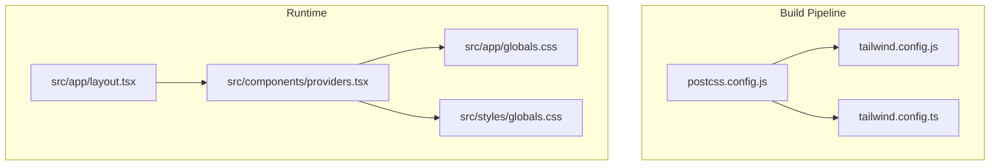

**Diagram sources**
- [postcss.config.js](file://postcss.config.js#L1-L7)
- [tailwind.config.js](file://tailwind.config.js#L1-L108)
- [tailwind.config.ts](file://tailwind.config.ts#L1-L133)
- [src/app/layout.tsx](file://src/app/layout.tsx#L1-L102)
- [src/components/providers.tsx](file://src/components/providers.tsx#L1-L55)
- [src/app/globals.css](file://src/app/globals.css#L1-L141)
- [src/styles/globals.css](file://src/styles/globals.css#L1-L288)

**Section sources**
- [tailwind.config.js](file://tailwind.config.js#L1-L108)
- [tailwind.config.ts](file://tailwind.config.ts#L1-L133)
- [postcss.config.js](file://postcss.config.js#L1-L7)
- [src/app/layout.tsx](file://src/app/layout.tsx#L1-L102)
- [src/components/providers.tsx](file://src/components/providers.tsx#L1-L55)
- [src/app/globals.css](file://src/app/globals.css#L1-L141)
- [src/styles/globals.css](file://src/styles/globals.css#L1-L288)

## Core Components
- Dark mode strategy: configured via the class attribute to toggle themes.
- Content scanning: includes pages, components, app directory, and shared UI components package.
- Theme extensions: container sizing, custom HSL color palette, border radius variables, animation keyframes, and typography defaults.
- Plugins: forms, typography, and tailwindcss-animate.
- PostCSS pipeline: Tailwind and Autoprefixer applied in order.
- Runtime theme provider: sets the class attribute on the root element and manages theme transitions.

**Section sources**
- [tailwind.config.js](file://tailwind.config.js#L3-L9)
- [tailwind.config.js](file://tailwind.config.js#L10-L101)
- [tailwind.config.js](file://tailwind.config.js#L103-L108)
- [postcss.config.js](file://postcss.config.js#L1-L7)
- [src/components/providers.tsx](file://src/components/providers.tsx#L40-L45)
- [src/app/globals.css](file://src/app/globals.css#L5-L67)

## Architecture Overview
The Tailwind configuration is split between two files:
- tailwind.config.js: baseline configuration with dark mode, content paths, theme extensions, and plugins.
- tailwind.config.ts: extended configuration for custom brand colors and additional animations, plus the animation plugin.

PostCSS applies Tailwind and Autoprefixer during the build. At runtime, the theme provider toggles a class on the html element, enabling the class-based dark mode strategy. Global CSS layers define design tokens and component utilities.

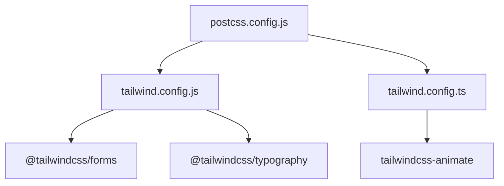

**Diagram sources**
- [postcss.config.js](file://postcss.config.js#L1-L7)
- [tailwind.config.js](file://tailwind.config.js#L103-L108)
- [tailwind.config.ts](file://tailwind.config.ts#L130-L131)
- [package.json](file://package.json#L65-L66)

## Detailed Component Analysis

### Tailwind Configuration Architecture
- Dark mode: class strategy ensures the html element receives a class that switches the theme.
- Content paths: scan across pages, components, app, and the shared UI components package to discover class usage.
- Container: centered layout with padding and a max-width breakpoint.
- Theme extensions:
  - Colors: HSL-based semantic palette mapped to CSS variables.
  - Border radius: variables derived from a root CSS variable.
  - Keyframes and animation: accordion, fade, slide, and pulse-glow animations.
  - Typography: default theme binding text and link colors to semantic tokens.
- Plugins: forms, typography, and tailwindcss-animate.

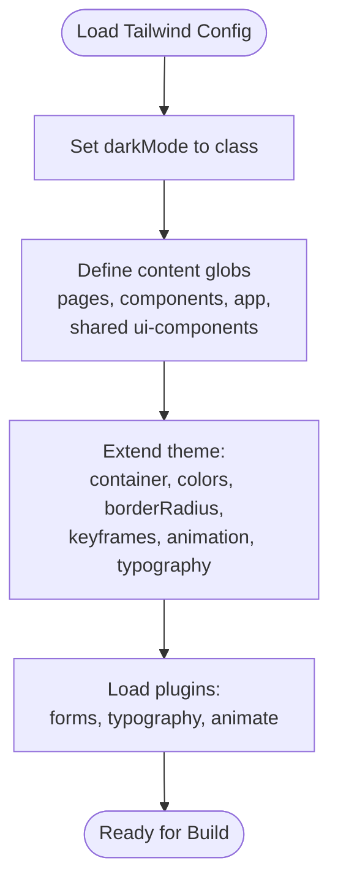

**Diagram sources**
- [tailwind.config.js](file://tailwind.config.js#L3-L9)
- [tailwind.config.js](file://tailwind.config.js#L10-L101)
- [tailwind.config.js](file://tailwind.config.js#L103-L108)

**Section sources**
- [tailwind.config.js](file://tailwind.config.js#L3-L101)
- [tailwind.config.js](file://tailwind.config.js#L103-L108)

### Dark Mode Implementation (Class Strategy)
- Runtime: The theme provider sets the attribute to class and toggles the theme without transition flashes.
- CSS tokens: Base and dark modes define HSL variables for background, foreground, borders, inputs, rings, and card/popover palettes.
- Component usage: UI components rely on semantic color classes (e.g., background, foreground, border) that automatically adapt to the current theme.

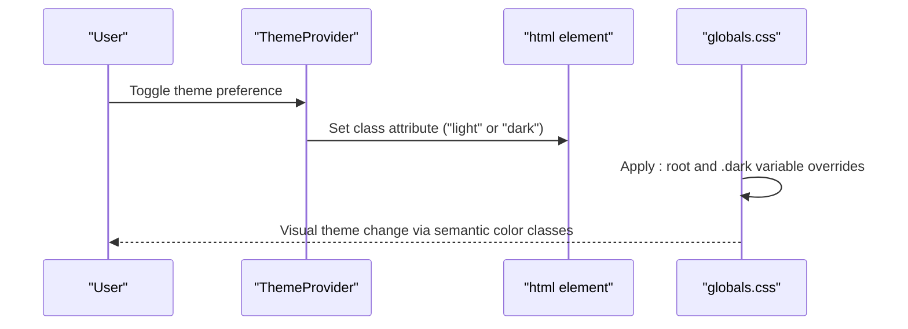

**Diagram sources**
- [src/components/providers.tsx](file://src/components/providers.tsx#L40-L45)
- [src/app/globals.css](file://src/app/globals.css#L5-L67)
- [src/styles/globals.css](file://src/styles/globals.css#L5-L58)

**Section sources**
- [src/components/providers.tsx](file://src/components/providers.tsx#L40-L45)
- [src/app/globals.css](file://src/app/globals.css#L5-L67)
- [src/styles/globals.css](file://src/styles/globals.css#L5-L58)

### Container Configuration and Responsive Breakpoints
- Container: Centered layout with padding and a 2xl breakpoint at 1400px.
- Responsive behavior: Components and layouts adapt to viewport constraints using container utilities and Tailwind spacing scales.

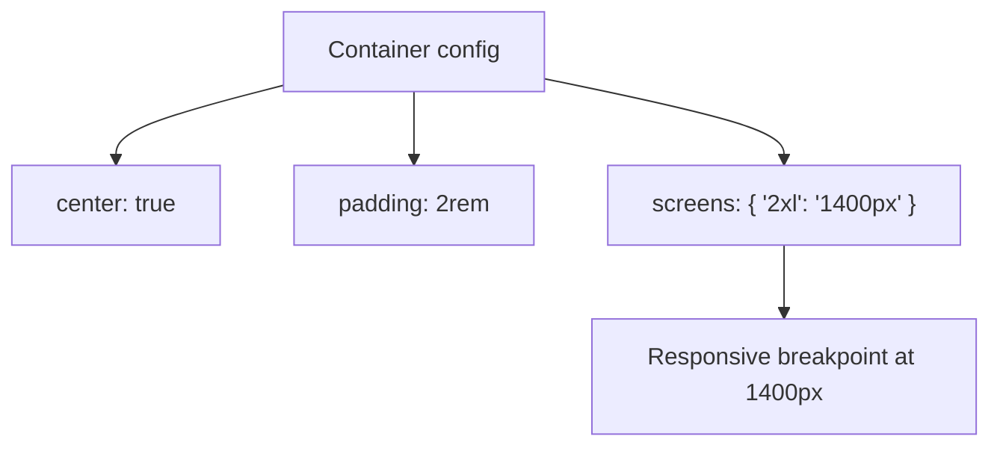

**Diagram sources**
- [tailwind.config.js](file://tailwind.config.js#L10-L17)

**Section sources**
- [tailwind.config.js](file://tailwind.config.js#L10-L17)

### Theme Extension Patterns
- Semantic colors: HSL variables mapped to Tailwind color keys for consistent design tokens.
- Brand colors: Extended palette includes ember and rose shades, and steam level colors.
- Border radius: Derived from a root CSS variable for scalable sizing.
- Animations: Keyframes and animation utilities for interactive components.

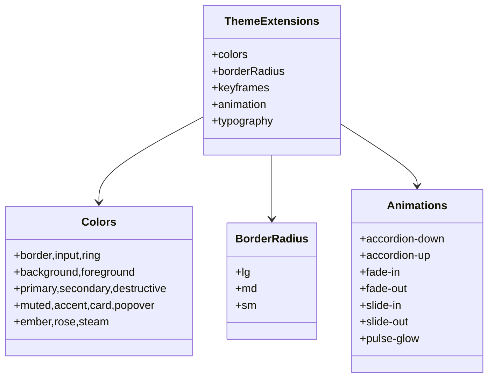

**Diagram sources**
- [tailwind.config.ts](file://tailwind.config.ts#L18-L129)

**Section sources**
- [tailwind.config.ts](file://tailwind.config.ts#L18-L129)

### Plugin Integration
- Forms: Improves form controls styling.
- Typography: Enhances prose styles with sensible defaults.
- Tailwindcss-animate: Adds animation utilities and utilities for common motion patterns.

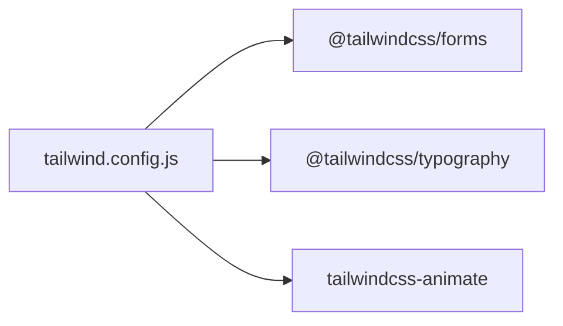

**Diagram sources**
- [tailwind.config.js](file://tailwind.config.js#L103-L108)
- [package.json](file://package.json#L65-L66)

**Section sources**
- [tailwind.config.js](file://tailwind.config.js#L103-L108)
- [package.json](file://package.json#L65-L66)

### PostCSS Integration and CSS Processing Pipeline
- Tailwind: Processes design tokens and utilities from the configuration.
- Autoprefixer: Adds vendor prefixes for compatibility.
- Layer directives: Base, components, and utilities are processed in order to ensure proper cascade and overrides.

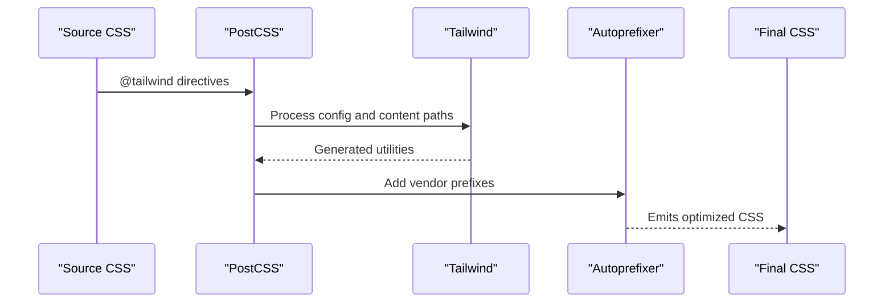

**Diagram sources**
- [postcss.config.js](file://postcss.config.js#L1-L7)
- [src/app/globals.css](file://src/app/globals.css#L1-L3)
- [src/styles/globals.css](file://src/styles/globals.css#L1-L3)

**Section sources**
- [postcss.config.js](file://postcss.config.js#L1-L7)
- [src/app/globals.css](file://src/app/globals.css#L1-L3)
- [src/styles/globals.css](file://src/styles/globals.css#L1-L3)

### Practical Examples: Extending the Design System
- Using semantic tokens: Components apply background, foreground, border, and ring classes that automatically switch in dark mode.
- Brand color usage: Buttons and badges leverage extended colors (e.g., ember, rose, steam) for thematic consistency.
- Animation utilities: Accordion, fade, slide, and pulse-glow animations are available via animation utilities.

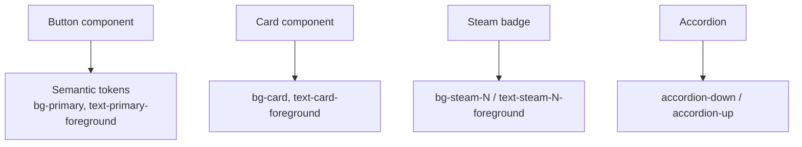

**Diagram sources**
- [src/components/ui/button.tsx](file://src/components/ui/button.tsx#L10-L20)
- [src/components/ui/card.tsx](file://src/components/ui/card.tsx#L10-L13)
- [src/styles/globals.css](file://src/styles/globals.css#L114-L137)
- [tailwind.config.ts](file://tailwind.config.ts#L120-L127)

**Section sources**
- [src/components/ui/button.tsx](file://src/components/ui/button.tsx#L10-L20)
- [src/components/ui/card.tsx](file://src/components/ui/card.tsx#L10-L13)
- [src/styles/globals.css](file://src/styles/globals.css#L114-L137)
- [tailwind.config.ts](file://tailwind.config.ts#L120-L127)

### Adding Custom Utilities
- Global CSS utilities: Define reusable utilities under the utilities layer (e.g., animation delays, text wrapping, custom scrollbars).
- Component utilities: Encapsulate component-specific styles in the components layer for maintainability.

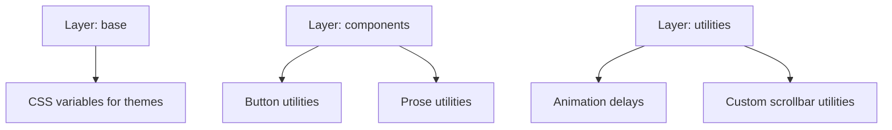

**Diagram sources**
- [src/app/globals.css](file://src/app/globals.css#L69-L106)
- [src/app/globals.css](file://src/app/globals.css#L108-L141)
- [src/styles/globals.css](file://src/styles/globals.css#L69-L150)

**Section sources**
- [src/app/globals.css](file://src/app/globals.css#L69-L141)
- [src/styles/globals.css](file://src/styles/globals.css#L69-L150)

## Dependency Analysis
- Tailwind dependencies:
  - Tailwind CSS and PostCSS are installed.
  - Tailwind plugins are declared in configuration and installed as dev dependencies.
- Shared UI components package:
  - Depends on tailwindcss-animate for animation utilities.
- Runtime theme provider:
  - Uses next-themes to set the class attribute on the html element.

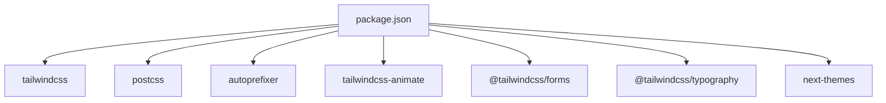

**Diagram sources**
- [package.json](file://package.json#L60-L66)
- [packages/ui-components/package.json](file://packages/ui-components/package.json#L39-L39)

**Section sources**
- [package.json](file://package.json#L60-L66)
- [packages/ui-components/package.json](file://packages/ui-components/package.json#L39-L39)

## Performance Considerations
- Keep content paths scoped to reduce scanning overhead.
- Prefer semantic color classes to minimize custom utility proliferation.
- Limit the number of keyframes and animation utilities to essential interactions.
- Use container utilities to constrain wide content and reduce rendering costs.
- Ensure Autoprefixer runs after Tailwind to avoid redundant prefixes.

[No sources needed since this section provides general guidance]

## Troubleshooting Guide
- Utilities not generated:
  - Verify content globs include the files where utilities are used.
  - Confirm Tailwind directives are present in global CSS.
- Dark mode not switching:
  - Ensure the theme provider sets the class attribute on the html element.
  - Confirm CSS variable overrides exist for both light and dark modes.
- Animation utilities missing:
  - Ensure tailwindcss-animate is installed and loaded in configuration.
- Build errors with PostCSS:
  - Confirm Tailwind and Autoprefixer are configured in PostCSS and installed as dependencies.

**Section sources**
- [tailwind.config.js](file://tailwind.config.js#L3-L9)
- [src/components/providers.tsx](file://src/components/providers.tsx#L40-L45)
- [src/app/globals.css](file://src/app/globals.css#L5-L67)
- [tailwind.config.js](file://tailwind.config.js#L103-L108)
- [postcss.config.js](file://postcss.config.js#L1-L7)

## Conclusion
The project’s Tailwind setup combines a baseline JS configuration with a TS extension to deliver a robust, themeable design system. The class-based dark mode strategy, container configuration, and extensive theme extensions enable consistent, scalable UI development. Integrating Tailwind with PostCSS and leveraging plugins streamlines the build pipeline while maintaining performance. Following the best practices and troubleshooting tips outlined here will help sustain a reliable and efficient Tailwind configuration.