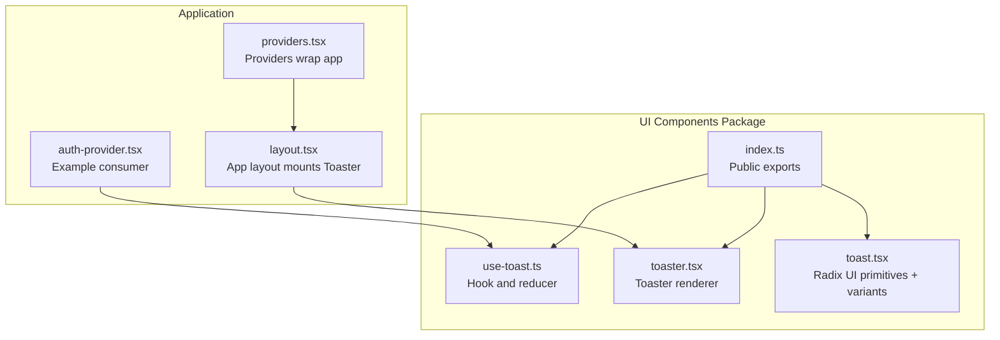
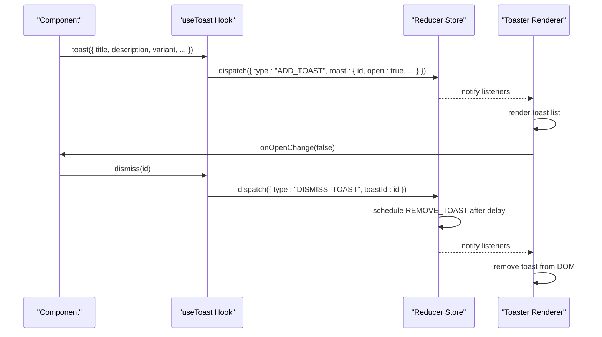
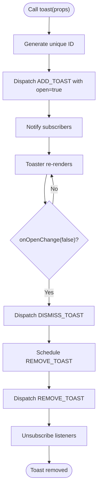
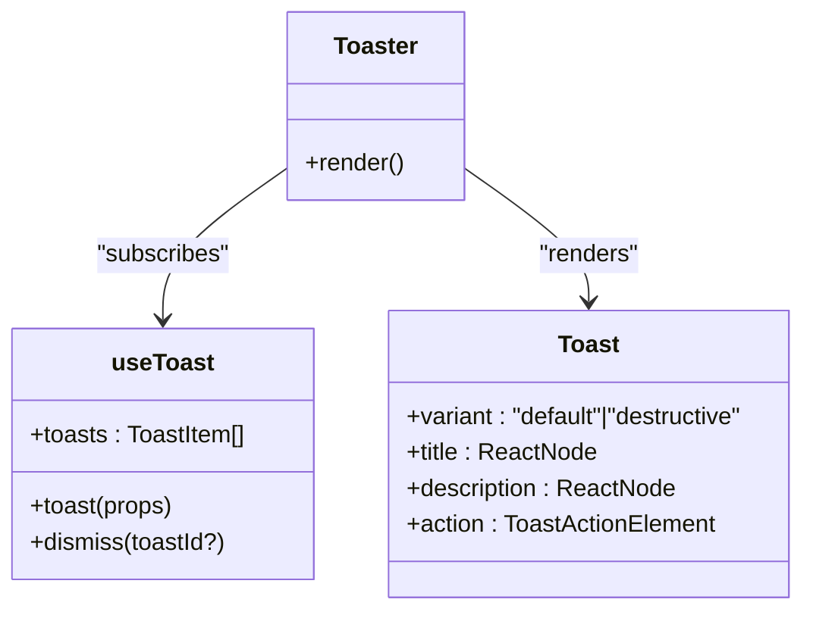
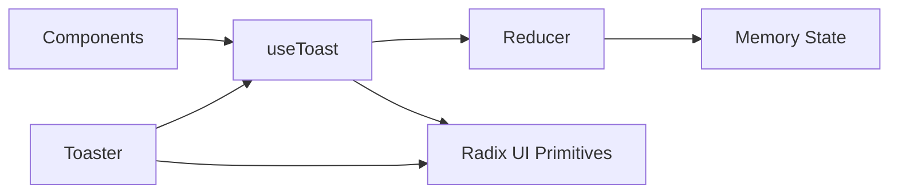

# Component Hooks

<cite>
**Referenced Files in This Document**
- [use-toast.ts](file://packages/ui-components/src/hooks/use-toast.ts)
- [toaster.tsx](file://packages/ui-components/src/components/toaster.tsx)
- [toast.tsx](file://packages/ui-components/src/components/toast.tsx)
- [index.ts](file://packages/ui-components/src/index.ts)
- [toaster.tsx](file://src/components/ui/toaster.tsx)
- [auth-provider.tsx](file://src/components/auth/auth-provider.tsx)
- [providers.tsx](file://src/app/providers.tsx)
- [layout.tsx](file://src/app/layout.tsx)
</cite>

## Table of Contents
1. [Introduction](#introduction)
2. [Project Structure](#project-structure)
3. [Core Components](#core-components)
4. [Architecture Overview](#architecture-overview)
5. [Detailed Component Analysis](#detailed-component-analysis)
6. [Dependency Analysis](#dependency-analysis)
7. [Performance Considerations](#performance-considerations)
8. [Troubleshooting Guide](#troubleshooting-guide)
9. [Conclusion](#conclusion)

## Introduction
This document provides comprehensive documentation for the use-toast hook and related toast infrastructure. It explains the hook's API, parameters, and return values, demonstrates how to integrate toast notifications across the application, and covers best practices for state management, error handling, and user notification strategies. The implementation leverages a lightweight Redux-like reducer pattern with React hooks and Radix UI primitives to render toast notifications.

## Project Structure
The toast system is composed of:
- A reusable hook that manages toast state and exposes a simple API
- A Toaster component that subscribes to the global toast state and renders individual toasts
- A set of Radix UI-based toast primitives with variant styling
- Export re-exports for easy consumption across the application

**Diagram sources**
- [index.ts](file://packages/ui-components/src/index.ts#L1-L12)
- [use-toast.ts](file://packages/ui-components/src/hooks/use-toast.ts#L1-L191)
- [toaster.tsx](file://packages/ui-components/src/components/toaster.tsx#L1-L35)
- [toast.tsx](file://packages/ui-components/src/components/toast.tsx#L1-L126)
- [layout.tsx](file://src/app/layout.tsx#L1-L10)
- [providers.tsx](file://src/app/providers.tsx#L1-L37)
- [auth-provider.tsx](file://src/components/auth/auth-provider.tsx#L1-L165)

**Section sources**
- [index.ts](file://packages/ui-components/src/index.ts#L1-L12)
- [layout.tsx](file://src/app/layout.tsx#L1-L10)
- [providers.tsx](file://src/app/providers.tsx#L1-L37)

## Core Components
This section documents the use-toast hook and its supporting components.

- useToast hook
  - Purpose: Provides access to global toast state and APIs to show/update/dismiss toasts.
  - Returns: An object containing:
    - toasts: array of current toast items
    - toast(props): function to enqueue a new toast
    - dismiss(toastId?): function to dismiss a specific toast or all toasts
  - Internals:
    - Maintains a single toast limit
    - Generates unique IDs per toast
    - Uses a reducer to manage state transitions
    - Subscribes to a global listener-based store

- toast function
  - Purpose: Enqueue a new toast with the given properties.
  - Parameters: Accepts all props supported by the underlying Toast primitive plus optional variant and action.
  - Returns: An object with id, dismiss, and update methods for programmatic control.

- Toaster component
  - Purpose: Renders the toast container and all active toasts.
  - Behavior: Maps over the global toasts and renders each with title, description, optional action, and close controls.

- Toast primitives and variants
  - Provider and viewport: Configure positioning and stacking behavior.
  - Variants: default and destructive variants for neutral and error-style notifications.
  - Actions and close controls: Support interactive actions and manual dismissal.

**Section sources**
- [use-toast.ts](file://packages/ui-components/src/hooks/use-toast.ts#L171-L191)
- [use-toast.ts](file://packages/ui-components/src/hooks/use-toast.ts#L142-L169)
- [toaster.tsx](file://packages/ui-components/src/components/toaster.tsx#L13-L35)
- [toast.tsx](file://packages/ui-components/src/components/toast.tsx#L24-L38)
- [toast.tsx](file://packages/ui-components/src/components/toast.tsx#L112-L126)

## Architecture Overview
The toast system follows a unidirectional data flow:
- Consumers call toast(...) to enqueue a toast
- The hook dispatches an ADD_TOAST action with a generated ID
- The reducer updates the in-memory state and notifies subscribers
- Toaster reads the current state and renders toasts
- Dismiss triggers REMOVE_TOAST after a delay, clearing the toast

**Diagram sources**
- [use-toast.ts](file://packages/ui-components/src/hooks/use-toast.ts#L142-L169)
- [use-toast.ts](file://packages/ui-components/src/hooks/use-toast.ts#L74-L127)
- [toaster.tsx](file://packages/ui-components/src/components/toaster.tsx#L13-L35)

## Detailed Component Analysis

### useToast Hook API
- Function: useToast()
- Returns:
  - toasts: array of toast items
  - toast(props): enqueues a toast
  - dismiss(toastId?): dismisses a toast or all toasts
- Internal behavior:
  - Subscribes to a global listener list to receive state updates
  - Dispatches actions to add/update/dismiss/remove toasts
  - Manages a timeout queue to automatically remove toasts after a delay

**Diagram sources**
- [use-toast.ts](file://packages/ui-components/src/hooks/use-toast.ts#L142-L169)
- [use-toast.ts](file://packages/ui-components/src/hooks/use-toast.ts#L58-L72)
- [use-toast.ts](file://packages/ui-components/src/hooks/use-toast.ts#L74-L127)

**Section sources**
- [use-toast.ts](file://packages/ui-components/src/hooks/use-toast.ts#L171-L191)
- [use-toast.ts](file://packages/ui-components/src/hooks/use-toast.ts#L142-L169)
- [use-toast.ts](file://packages/ui-components/src/hooks/use-toast.ts#L58-L72)

### Toaster Component
- Purpose: Mounts the toast provider and renders all active toasts
- Behavior:
  - Reads toasts from the hook
  - Renders title and description blocks
  - Supports custom action elements
  - Includes a close control and viewport for proper stacking

**Diagram sources**
- [toaster.tsx](file://packages/ui-components/src/components/toaster.tsx#L13-L35)
- [toast.tsx](file://packages/ui-components/src/components/toast.tsx#L112-L126)
- [use-toast.ts](file://packages/ui-components/src/hooks/use-toast.ts#L171-L191)

**Section sources**
- [toaster.tsx](file://packages/ui-components/src/components/toaster.tsx#L13-L35)
- [toast.tsx](file://packages/ui-components/src/components/toast.tsx#L24-L38)

### Toast Primitives and Variants
- Provider and Viewport: Position and animate toasts
- Variants: default and destructive
- Action and Close: Interactive elements for user control
- Props: Extends Radix UI Root with variant styling

**Section sources**
- [toast.tsx](file://packages/ui-components/src/components/toast.tsx#L7-L22)
- [toast.tsx](file://packages/ui-components/src/components/toast.tsx#L24-L38)
- [toast.tsx](file://packages/ui-components/src/components/toast.tsx#L112-L126)

### Integration Patterns
- Mount Toaster at the app root so consumers can call toast anywhere
- Wrap the app with Providers to ensure theme and other contexts are available
- Import Toaster via the shared package export for consistency

**Section sources**
- [layout.tsx](file://src/app/layout.tsx#L1-L10)
- [providers.tsx](file://src/app/providers.tsx#L1-L37)
- [toaster.tsx](file://src/components/ui/toaster.tsx#L1-L1)

### Example Scenarios and Best Practices
- Success message
  - Use default variant with a concise title and optional description
  - Keep duration reasonable; rely on automatic dismissal
  - Reference: [auth-provider.tsx](file://src/components/auth/auth-provider.tsx#L77-L80)

- Error message
  - Use destructive variant to signal severity
  - Include a clear, user-friendly description
  - Reference: [auth-provider.tsx](file://src/components/auth/auth-provider.tsx#L82-L86)

- Warning message
  - Use destructive variant sparingly; prefer info for warnings
  - Provide actionable guidance in the description
  - Reference: [auth-provider.tsx](file://src/components/auth/auth-provider.tsx#L101-L104)

- Info message
  - Use default variant for informational feedback
  - Keep messages brief and contextual
  - Reference: [auth-provider.tsx](file://src/components/auth/auth-provider.tsx#L126-L129)

- Programmatic control
  - Use returned id to dismiss or update a toast later
  - Reference: [use-toast.ts](file://packages/ui-components/src/hooks/use-toast.ts#L164-L169)

- Global dismissal
  - Call dismiss() without arguments to clear all toasts
  - Reference: [use-toast.ts](file://packages/ui-components/src/hooks/use-toast.ts#L187-L188)

**Section sources**
- [auth-provider.tsx](file://src/components/auth/auth-provider.tsx#L77-L129)
- [use-toast.ts](file://packages/ui-components/src/hooks/use-toast.ts#L164-L169)
- [use-toast.ts](file://packages/ui-components/src/hooks/use-toast.ts#L187-L188)

## Dependency Analysis
The toast system is modular and decoupled:
- Consumers depend on the exported hook and Toaster
- Toaster depends on the hook and Radix UI primitives
- The hook encapsulates state and dispatch logic, minimizing coupling

**Diagram sources**
- [use-toast.ts](file://packages/ui-components/src/hooks/use-toast.ts#L171-L191)
- [toaster.tsx](file://packages/ui-components/src/components/toaster.tsx#L13-L35)
- [toast.tsx](file://packages/ui-components/src/components/toast.tsx#L1-L126)

**Section sources**
- [index.ts](file://packages/ui-components/src/index.ts#L1-L12)
- [use-toast.ts](file://packages/ui-components/src/hooks/use-toast.ts#L1-L191)
- [toaster.tsx](file://packages/ui-components/src/components/toaster.tsx#L1-L35)

## Performance Considerations
- Single toast limit: Prevents excessive DOM nodes and ensures clarity
- Efficient state updates: Listener-based updates avoid unnecessary re-renders
- Automatic cleanup: Toast removal is scheduled and cleaned up via timeouts
- Minimal re-renders: Toaster only re-renders when state changes

[No sources needed since this section provides general guidance]

## Troubleshooting Guide
- Toast does not appear
  - Ensure Toaster is mounted at the app root
  - Verify Providers wrap the application
  - Reference: [layout.tsx](file://src/app/layout.tsx#L1-L10), [providers.tsx](file://src/app/providers.tsx#L1-L37)

- Toast appears but does not dismiss
  - Confirm onOpenChange is wired to dismiss
  - Reference: [use-toast.ts](file://packages/ui-components/src/hooks/use-toast.ts#L158-L161)

- Multiple toasts stack unexpectedly
  - The system enforces a single-toast limit; verify no external modifications
  - Reference: [use-toast.ts](file://packages/ui-components/src/hooks/use-toast.ts#L79)

- Styling issues
  - Ensure Radix UI provider and variants are applied correctly
  - Reference: [toast.tsx](file://packages/ui-components/src/components/toast.tsx#L24-L38)

**Section sources**
- [layout.tsx](file://src/app/layout.tsx#L1-L10)
- [providers.tsx](file://src/app/providers.tsx#L1-L37)
- [use-toast.ts](file://packages/ui-components/src/hooks/use-toast.ts#L79)
- [use-toast.ts](file://packages/ui-components/src/hooks/use-toast.ts#L158-L161)
- [toast.tsx](file://packages/ui-components/src/components/toast.tsx#L24-L38)

## Conclusion
The use-toast hook provides a simple, robust mechanism for delivering user feedback across the application. By combining a minimal API with a clear state model and Radix UI primitives, it enables consistent, accessible notifications. Following the integration patterns and best practices outlined here will help maintain a reliable and user-friendly notification experience.