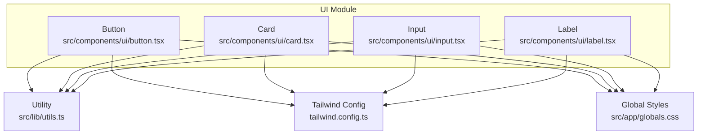
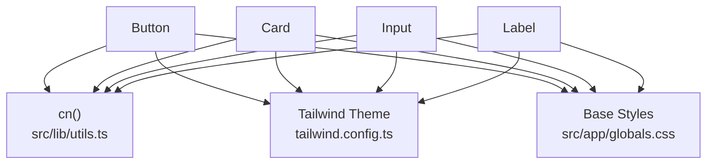
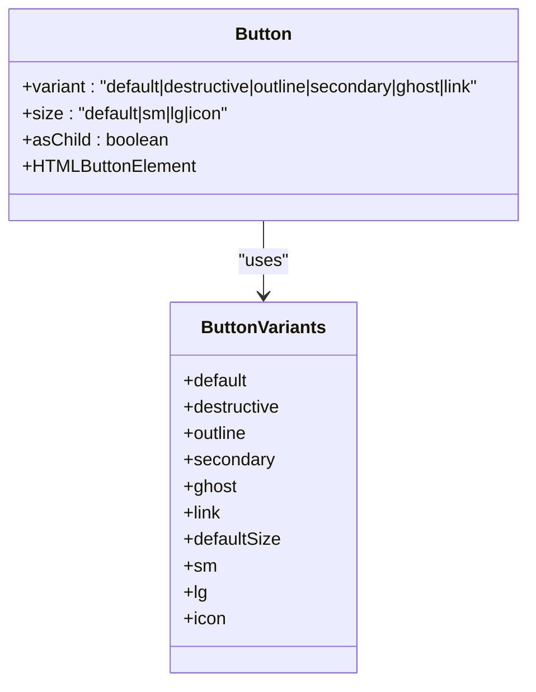
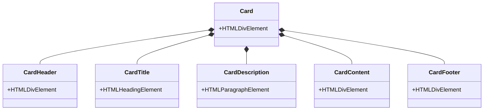
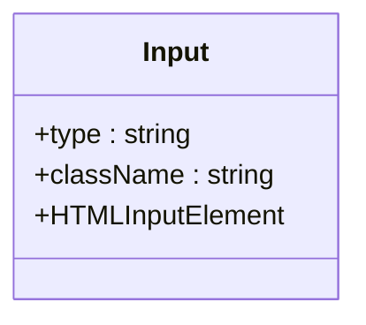
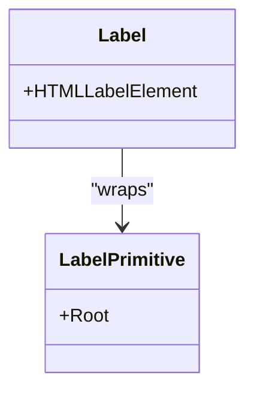
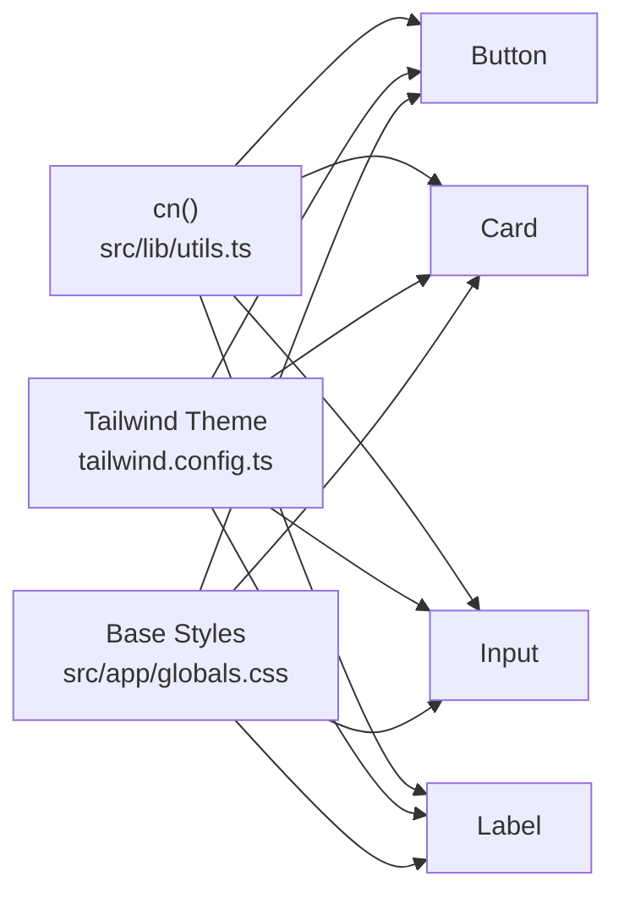
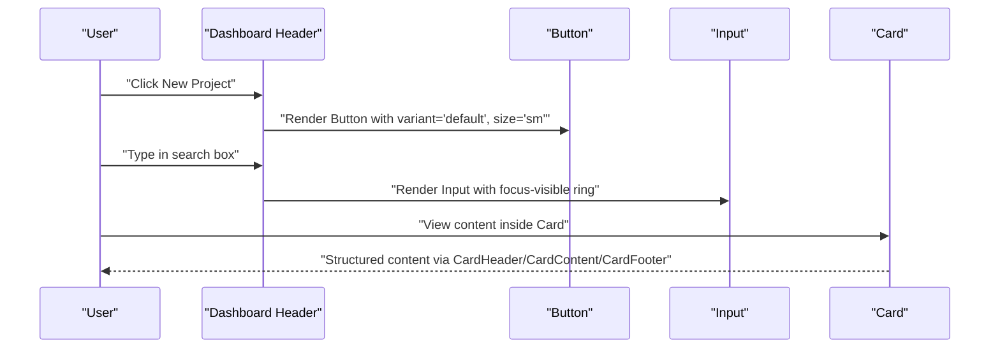

# Core Components

<cite>
**Referenced Files in This Document**
- [button.tsx](file://src/components/ui/button.tsx)
- [card.tsx](file://src/components/ui/card.tsx)
- [input.tsx](file://src/components/ui/input.tsx)
- [label.tsx](file://src/components/ui/label.tsx)
- [utils.ts](file://src/lib/utils.ts)
- [tailwind.config.ts](file://tailwind.config.ts)
- [globals.css](file://src/app/globals.css)
- [dashboard-shell.tsx](file://src/components/dashboard/dashboard-shell.tsx)
- [index.ts](file://packages/ui-components/src/index.ts)
</cite>

## Table of Contents
1. [Introduction](#introduction)
2. [Project Structure](#project-structure)
3. [Core Components](#core-components)
4. [Architecture Overview](#architecture-overview)
5. [Detailed Component Analysis](#detailed-component-analysis)
6. [Dependency Analysis](#dependency-analysis)
7. [Performance Considerations](#performance-considerations)
8. [Accessibility Guidelines](#accessibility-guidelines)
9. [Usage Examples and Composition Patterns](#usage-examples-and-composition-patterns)
10. [Troubleshooting Guide](#troubleshooting-guide)
11. [Conclusion](#conclusion)

## Introduction
This document provides comprehensive documentation for the core UI components: Button, Card, Input, and Label. It explains each component’s props, variants, sizes, styling options, and how they integrate with the design system. It also covers accessibility guidelines, best practices, and composition patterns for forms and layouts.

## Project Structure
The core UI components are located under the application’s UI module and are built with Tailwind CSS and Radix UI primitives. They rely on a shared utility for merging class names and a centralized Tailwind configuration that defines semantic color tokens and spacing.

**Diagram sources**
- [button.tsx](file://src/components/ui/button.tsx#L1-L55)
- [card.tsx](file://src/components/ui/card.tsx#L1-L78)
- [input.tsx](file://src/components/ui/input.tsx#L1-L24)
- [label.tsx](file://src/components/ui/label.tsx#L1-L23)
- [utils.ts](file://src/lib/utils.ts#L1-L6)
- [tailwind.config.ts](file://tailwind.config.ts#L1-L133)
- [globals.css](file://src/app/globals.css#L1-L141)

**Section sources**
- [button.tsx](file://src/components/ui/button.tsx#L1-L55)
- [card.tsx](file://src/components/ui/card.tsx#L1-L78)
- [input.tsx](file://src/components/ui/input.tsx#L1-L24)
- [label.tsx](file://src/components/ui/label.tsx#L1-L23)
- [utils.ts](file://src/lib/utils.ts#L1-L6)
- [tailwind.config.ts](file://tailwind.config.ts#L1-L133)
- [globals.css](file://src/app/globals.css#L1-L141)

## Core Components
This section summarizes the props, variants, sizes, and styling options for each component.

- Button
  - Props: Inherits standard button attributes plus variant, size, and asChild.
  - Variants: default, destructive, outline, secondary, ghost, link.
  - Sizes: default, sm, lg, icon.
  - Styling: Uses class variance authority (CVA) with Tailwind tokens for colors and spacing.
  - Composition: Supports rendering as a child element via asChild.

- Card
  - Props: Standard div attributes; includes Card, CardHeader, CardTitle, CardDescription, CardContent, CardFooter.
  - Styling: Uses semantic card tokens and consistent spacing.
  - Composition: Designed as a cohesive group for content sections.

- Input
  - Props: Inherits standard input attributes; supports type and className.
  - Styling: Uses semantic tokens for borders, backgrounds, and focus states.
  - Composition: Intended to be paired with Label for accessible forms.

- Label
  - Props: Inherits Radix Label attributes; supports CVA variants.
  - Styling: Uses semantic tokens and disabled state handling via peer variants.
  - Composition: Designed to wrap form controls for accessible labeling.

**Section sources**
- [button.tsx](file://src/components/ui/button.tsx#L35-L55)
- [card.tsx](file://src/components/ui/card.tsx#L4-L78)
- [input.tsx](file://src/components/ui/input.tsx#L4-L24)
- [label.tsx](file://src/components/ui/label.tsx#L10-L23)

## Architecture Overview
The components follow a consistent pattern:
- Shared utility merges Tailwind classes safely.
- Tailwind theme defines semantic tokens for colors, borders, and backgrounds.
- Global CSS applies base layer styles and utility classes.
- Components expose variants and sizes via CVA and compose with Radix UI where applicable.

**Diagram sources**
- [utils.ts](file://src/lib/utils.ts#L1-L6)
- [tailwind.config.ts](file://tailwind.config.ts#L1-L133)
- [globals.css](file://src/app/globals.css#L1-L141)
- [button.tsx](file://src/components/ui/button.tsx#L1-L55)
- [card.tsx](file://src/components/ui/card.tsx#L1-L78)
- [input.tsx](file://src/components/ui/input.tsx#L1-L24)
- [label.tsx](file://src/components/ui/label.tsx#L1-L23)

## Detailed Component Analysis

### Button
- Purpose: Primary interactive element with consistent focus, hover, and disabled states.
- Props:
  - Inherits button HTML attributes.
  - variant: Selects semantic style (default, destructive, outline, secondary, ghost, link).
  - size: Controls height, padding, and corner radius (default, sm, lg, icon).
  - asChild: Renders as a radix Slot to compose with links or other elements.
- Implementation highlights:
  - Uses CVA for variant and size combinations.
  - Merges classes via cn() to avoid conflicts.
  - Integrates with focus-visible ring tokens and disabled pointer-events.
- Accessibility:
  - Inherits native button semantics.
  - Focus ring applied via theme tokens.
- Composition patterns:
  - Icon buttons via size "icon".
  - Link-like buttons via variant "link".
  - Child composition via asChild for anchor tags.

**Diagram sources**
- [button.tsx](file://src/components/ui/button.tsx#L6-L33)

**Section sources**
- [button.tsx](file://src/components/ui/button.tsx#L35-L55)

### Card
- Purpose: Container for grouped content with consistent elevation and spacing.
- Subcomponents:
  - Card: Outer container with border and background.
  - CardHeader: Vertical stack with spacing.
  - CardTitle: Large, semibold heading.
  - CardDescription: Smaller muted text.
  - CardContent: Main content area with top padding reset.
  - CardFooter: Footer actions with consistent alignment.
- Styling:
  - Uses card and foreground tokens.
  - Consistent padding and spacing across subcomponents.
- Composition patterns:
  - Typical usage: Header -> Title/Description -> Content -> Footer.
  - Ideal for forms, dashboards, and content sections.

**Diagram sources**
- [card.tsx](file://src/components/ui/card.tsx#L4-L78)

**Section sources**
- [card.tsx](file://src/components/ui/card.tsx#L4-L78)

### Input
- Purpose: Text input field with consistent focus, disabled, and placeholder styling.
- Props:
  - Inherits input HTML attributes.
  - Supports type and className extension.
- Styling:
  - Uses input, background, muted foreground, and ring tokens.
  - Focus-visible ring and disabled cursor states included.
- Composition patterns:
  - Pair with Label for accessible forms.
  - Combine with Button for search bars and actions.

**Diagram sources**
- [input.tsx](file://src/components/ui/input.tsx#L4-L24)

**Section sources**
- [input.tsx](file://src/components/ui/input.tsx#L4-L24)

### Label
- Purpose: Accessible label for form controls.
- Props:
  - Inherits Radix Label attributes.
  - Supports CVA variants via class merging.
- Styling:
  - Uses semantic tokens and peer-disabled states.
- Composition patterns:
  - Wrap inputs or other controls to associate labels.
  - Use with Input and other form controls.

**Diagram sources**
- [label.tsx](file://src/components/ui/label.tsx#L10-L23)

**Section sources**
- [label.tsx](file://src/components/ui/label.tsx#L10-L23)

## Dependency Analysis
- Utility dependency:
  - All components depend on cn() to merge classes safely.
- Design system dependency:
  - Tailwind theme defines semantic tokens for colors, borders, and backgrounds.
  - Global CSS applies base layer styles and utility classes.
- Component interdependencies:
  - Button integrates with focus-visible ring tokens.
  - Card composes multiple subcomponents for structured layouts.
  - Input pairs with Label for accessible forms.
  - Label leverages Radix UI primitives.

**Diagram sources**
- [utils.ts](file://src/lib/utils.ts#L1-L6)
- [tailwind.config.ts](file://tailwind.config.ts#L1-L133)
- [globals.css](file://src/app/globals.css#L1-L141)
- [button.tsx](file://src/components/ui/button.tsx#L1-L55)
- [card.tsx](file://src/components/ui/card.tsx#L1-L78)
- [input.tsx](file://src/components/ui/input.tsx#L1-L24)
- [label.tsx](file://src/components/ui/label.tsx#L1-L23)

**Section sources**
- [utils.ts](file://src/lib/utils.ts#L1-L6)
- [tailwind.config.ts](file://tailwind.config.ts#L1-L133)
- [globals.css](file://src/app/globals.css#L1-L141)
- [button.tsx](file://src/components/ui/button.tsx#L1-L55)
- [card.tsx](file://src/components/ui/card.tsx#L1-L78)
- [input.tsx](file://src/components/ui/input.tsx#L1-L24)
- [label.tsx](file://src/components/ui/label.tsx#L1-L23)

## Performance Considerations
- Prefer variant and size props over inline className overrides to leverage CVA caching and reduce re-renders.
- Use asChild for Button only when composing with anchor tags to avoid unnecessary DOM nodes.
- Keep className additions minimal; rely on the shared cn() utility to merge efficiently.
- Avoid excessive nesting of Card subcomponents; use only what is necessary for readability and performance.

## Accessibility Guidelines
- Button
  - Use variant "link" for navigational actions; otherwise keep native button semantics.
  - Ensure sufficient color contrast against backgrounds defined by theme tokens.
  - Provide visible focus rings via theme defaults.
- Card
  - Structure content with CardHeader, CardTitle, CardDescription, CardContent, and CardFooter for screen reader comprehension.
- Input
  - Always pair with a Label; associate via htmlFor or wrapping behavior.
  - Respect disabled state and communicate disabled intent to assistive technologies.
- Label
  - Use Radix Label primitive to maintain proper association with form controls.
  - Apply peer-disabled styles to reflect disabled states visually and programmatically.

## Usage Examples and Composition Patterns
Below are practical usage patterns for forms and layouts. Replace “…” with your own content and props.

- Button variants and sizes
  - Primary action: variant="default", size="default"
  - Small destructive action: variant="destructive", size="sm"
  - Outline secondary: variant="outline", size="lg"
  - Icon-only: variant="ghost", size="icon"
  - Link-style: variant="link"

- Card composition
  - Header with title and description
  - Content area for form fields
  - Footer with action buttons

- Input and Label pairing
  - Wrap an Input with a Label for accessible forms
  - Use Input with type="password" or type="email" as needed

- Layout composition
  - Dashboard header with search input and action buttons
  - Sidebar navigation using Button variants for active states
  - Responsive mobile menu toggled with Button and overlays

**Diagram sources**
- [dashboard-shell.tsx](file://src/components/dashboard/dashboard-shell.tsx#L179-L215)
- [button.tsx](file://src/components/ui/button.tsx#L35-L55)
- [input.tsx](file://src/components/ui/input.tsx#L4-L24)
- [card.tsx](file://src/components/ui/card.tsx#L4-L78)

**Section sources**
- [dashboard-shell.tsx](file://src/components/dashboard/dashboard-shell.tsx#L179-L215)
- [button.tsx](file://src/components/ui/button.tsx#L35-L55)
- [input.tsx](file://src/components/ui/input.tsx#L4-L24)
- [card.tsx](file://src/components/ui/card.tsx#L4-L78)

## Troubleshooting Guide
- Button not styled correctly
  - Ensure variant and size are valid; confirm Tailwind theme tokens are present.
  - Verify className merging via cn() is not overriding CVA unintentionally.
- Input focus ring missing
  - Confirm focus-visible ring tokens are defined in theme and global CSS.
  - Check that disabled state classes are not overriding focus styles.
- Label not associated with input
  - Wrap the input with Label or use htmlFor to create an explicit association.
  - Ensure Label wraps the intended control.
- Card spacing issues
  - Use CardContent to reset top padding when needed.
  - Confirm CardHeader and CardFooter paddings align with layout expectations.

**Section sources**
- [button.tsx](file://src/components/ui/button.tsx#L6-L33)
- [input.tsx](file://src/components/ui/input.tsx#L12-L15)
- [label.tsx](file://src/components/ui/label.tsx#L14-L19)
- [card.tsx](file://src/components/ui/card.tsx#L10-L15)
- [card.tsx](file://src/components/ui/card.tsx#L61-L63)

## Conclusion
These core components provide a consistent, accessible, and extensible foundation for building forms and layouts. By leveraging CVA for variants and sizes, semantic Tailwind tokens, and Radix UI primitives, the components remain predictable, maintainable, and aligned with the design system. Use the composition patterns outlined here to build robust user interfaces while preserving accessibility and performance.