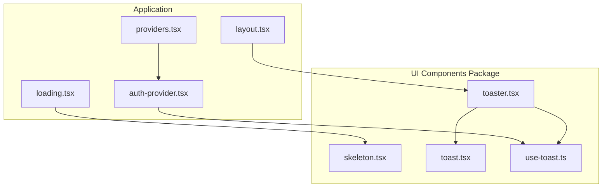
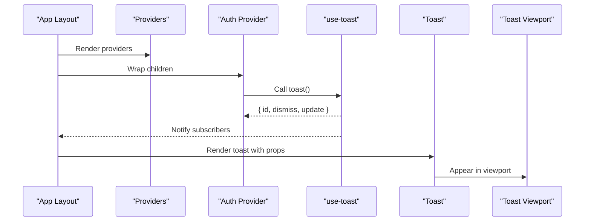
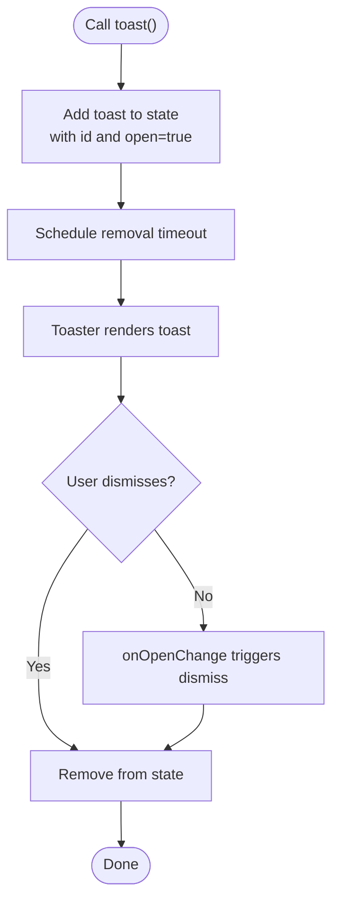
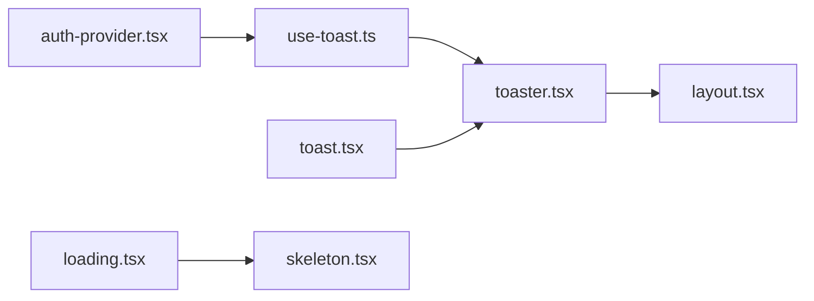

# Feedback Components

<cite>
**Referenced Files in This Document**
- [skeleton.tsx](file://packages/ui-components/src/components/skeleton.tsx)
- [toast.tsx](file://packages/ui-components/src/components/toast.tsx)
- [toaster.tsx](file://packages/ui-components/src/components/toaster.tsx)
- [use-toast.ts](file://packages/ui-components/src/hooks/use-toast.ts)
- [layout.tsx](file://src/app/layout.tsx)
- [auth-provider.tsx](file://src/components/auth/auth-provider.tsx)
- [loading.tsx](file://src/app/loading.tsx)
- [providers.tsx](file://src/components/providers.tsx)
</cite>

## Table of Contents
1. [Introduction](#introduction)
2. [Project Structure](#project-structure)
3. [Core Components](#core-components)
4. [Architecture Overview](#architecture-overview)
5. [Detailed Component Analysis](#detailed-component-analysis)
6. [Dependency Analysis](#dependency-analysis)
7. [Performance Considerations](#performance-considerations)
8. [Accessibility Considerations](#accessibility-considerations)
9. [Troubleshooting Guide](#troubleshooting-guide)
10. [Conclusion](#conclusion)

## Introduction
This document explains the feedback components in the project: Skeleton, Toast, and Toaster. It covers skeleton loading patterns, progressive loading states, the toast notification system (positioning, timing, styling), the toaster provider pattern, and how to manage multiple notifications. It also includes practical examples of loading states, success/error messages, and user feedback patterns, along with accessibility guidance for screen readers and keyboard navigation.

## Project Structure
The feedback components are organized under a dedicated UI components package and consumed by the application via a global provider and layout integration.

**Diagram sources**
- [layout.tsx](file://src/app/layout.tsx#L1-L102)
- [providers.tsx](file://src/components/providers.tsx#L1-L55)
- [auth-provider.tsx](file://src/components/auth/auth-provider.tsx#L1-L165)
- [loading.tsx](file://src/app/loading.tsx#L1-L40)
- [skeleton.tsx](file://packages/ui-components/src/components/skeleton.tsx#L1-L15)
- [toast.tsx](file://packages/ui-components/src/components/toast.tsx#L1-L126)
- [toaster.tsx](file://packages/ui-components/src/components/toaster.tsx#L1-L35)
- [use-toast.ts](file://packages/ui-components/src/hooks/use-toast.ts#L1-L191)

**Section sources**
- [layout.tsx](file://src/app/layout.tsx#L1-L102)
- [providers.tsx](file://src/components/providers.tsx#L1-L55)

## Core Components
- Skeleton: A lightweight component that renders a pulse animation to indicate loading states.
- Toast: A primitive notification element with title, description, close controls, and optional action.
- Toaster: A provider-driven renderer that displays queued toasts and manages viewport positioning.
- use-toast: A hook that exposes a toast factory and state management for adding, updating, dismissing, and removing notifications.

Key responsibilities:
- Skeleton provides progressive loading feedback while data loads.
- Toast encapsulates presentation and behavior for individual notifications.
- Toaster orchestrates toast lifecycle and viewport placement.
- use-toast centralizes toast state and scheduling.

**Section sources**
- [skeleton.tsx](file://packages/ui-components/src/components/skeleton.tsx#L1-L15)
- [toast.tsx](file://packages/ui-components/src/components/toast.tsx#L1-L126)
- [toaster.tsx](file://packages/ui-components/src/components/toaster.tsx#L1-L35)
- [use-toast.ts](file://packages/ui-components/src/hooks/use-toast.ts#L1-L191)

## Architecture Overview
The feedback system is client-side and integrates with the application’s provider stack. The Toaster is mounted at the root layout and renders notifications from the shared use-toast store. Authentication actions trigger toast notifications for user feedback.

**Diagram sources**
- [layout.tsx](file://src/app/layout.tsx#L83-L99)
- [providers.tsx](file://src/components/providers.tsx#L10-L54)
- [auth-provider.tsx](file://src/components/auth/auth-provider.tsx#L24-L130)
- [use-toast.ts](file://packages/ui-components/src/hooks/use-toast.ts#L142-L169)
- [toast.tsx](file://packages/ui-components/src/components/toast.tsx#L9-L22)
- [toaster.tsx](file://packages/ui-components/src/components/toaster.tsx#L13-L35)

## Detailed Component Analysis

### Skeleton Loading Pattern
Skeleton provides a simple, reusable loading indicator using a pulse animation and a muted background. It accepts a className to customize sizing and shape.

Implementation highlights:
- Uses a pulse animation to imply activity.
- Applies a rounded modifier and a muted background color.
- Accepts arbitrary HTML attributes for flexibility.

Progressive loading strategies:
- Replace static content with Skeleton blocks while fetching data.
- Use multiple Skeleton lines to represent lists or cards.
- Combine Skeleton with shimmer or gradient overlays for advanced effects.

Example usage locations:
- Application loading page demonstrates Skeleton usage for various widths and heights.

**Section sources**
- [skeleton.tsx](file://packages/ui-components/src/components/skeleton.tsx#L1-L15)
- [loading.tsx](file://src/app/loading.tsx#L1-L40)

### Toast Notification System
Toast defines the building blocks for a single notification, including:
- Provider: Root context provider for toast primitives.
- Viewport: Fixed-position container for toast display with responsive behavior.
- Toast: Base element with variant support (default/destructive).
- Title and Description: Semantic elements for content.
- Close: Accessible close control with focus-visible styling.
- Action: Optional interactive action element.

Positioning and timing:
- Viewport is fixed at the top with reverse stacking on mobile and bottom-right on larger screens.
- Animations handle open/close transitions and swipe gestures.
- Timing is managed centrally by the toast store.

Styling options:
- Variants allow default and destructive presentations.
- Tailwind-based class composition ensures consistent spacing and shadows.

**Section sources**
- [toast.tsx](file://packages/ui-components/src/components/toast.tsx#L1-L126)

### Toaster Provider Pattern
Toaster consumes the shared toast state and renders each toast with title, description, optional action, and a close control. It mounts a ToastViewport to ensure proper stacking and visibility.

Key behaviors:
- Iterates over the current toasts array and renders each with a unique key.
- Wraps content in a grid layout for title and description.
- Renders the viewport after all toasts to maintain stacking order.

Integration:
- Mounted at the root layout to render notifications across the app.
- Works alongside other providers (theme, auth, web socket).

**Section sources**
- [toaster.tsx](file://packages/ui-components/src/components/toaster.tsx#L1-L35)
- [layout.tsx](file://src/app/layout.tsx#L83-L99)

### Managing Multiple Notifications
The toast store enforces a limit and schedules removal:
- Limit: Only a single toast is shown at a time.
- Removal delay: A long default delay is used internally; removal is triggered by dismissal or timeout.
- Queue management: New toasts replace older ones respecting the limit.

API surface:
- toast(): Creates a new toast with an auto-generated id and returns dismiss/update helpers.
- useToast(): Returns current toasts and the toast factory.
- dismiss(): Dismisses a specific toast or all toasts.

**Diagram sources**
- [use-toast.ts](file://packages/ui-components/src/hooks/use-toast.ts#L8-L169)

**Section sources**
- [use-toast.ts](file://packages/ui-components/src/hooks/use-toast.ts#L1-L191)
- [toaster.tsx](file://packages/ui-components/src/components/toaster.tsx#L13-L35)

### Practical Examples and Patterns
- Login/signup/logout feedback: The auth provider triggers toasts for success and error states, including destructive variant for errors.
- Progressive loading: The loading page uses Skeleton to simulate content areas while data is being fetched.

Patterns demonstrated:
- Success feedback: Short-lived success messages with concise titles and descriptions.
- Error feedback: Destructive variant to signal negative outcomes; includes user-friendly messages.
- Progressive loading: Skeleton blocks layered over empty states to improve perceived performance.

**Section sources**
- [auth-provider.tsx](file://src/components/auth/auth-provider.tsx#L67-L131)
- [loading.tsx](file://src/app/loading.tsx#L1-L40)

## Dependency Analysis
The feedback system relies on Radix UI primitives for accessibility and animations, and on a custom hook for state management. The Toaster is integrated at the application root and depends on the provider chain.

**Diagram sources**
- [use-toast.ts](file://packages/ui-components/src/hooks/use-toast.ts#L1-L191)
- [toaster.tsx](file://packages/ui-components/src/components/toaster.tsx#L1-L35)
- [toast.tsx](file://packages/ui-components/src/components/toast.tsx#L1-L126)
- [layout.tsx](file://src/app/layout.tsx#L83-L99)
- [auth-provider.tsx](file://src/components/auth/auth-provider.tsx#L24-L130)
- [loading.tsx](file://src/app/loading.tsx#L1-L40)
- [skeleton.tsx](file://packages/ui-components/src/components/skeleton.tsx#L1-L15)

**Section sources**
- [use-toast.ts](file://packages/ui-components/src/hooks/use-toast.ts#L1-L191)
- [toast.tsx](file://packages/ui-components/src/components/toast.tsx#L1-L126)
- [toaster.tsx](file://packages/ui-components/src/components/toaster.tsx#L1-L35)
- [layout.tsx](file://src/app/layout.tsx#L83-L99)
- [auth-provider.tsx](file://src/components/auth/auth-provider.tsx#L24-L130)
- [loading.tsx](file://src/app/loading.tsx#L1-L40)
- [skeleton.tsx](file://packages/ui-components/src/components/skeleton.tsx#L1-L15)

## Performance Considerations
- Keep the toast limit low to avoid stacking overhead; the current implementation enforces a single toast at a time.
- Avoid heavy content in toast descriptions; prefer concise, scannable text.
- Reuse Skeleton components for repeated layouts to minimize reflows.
- Defer non-critical animations; the pulse animation used by Skeleton is lightweight.

## Accessibility Considerations
- Focus management: Toasts rely on Radix UI primitives that manage focus traps and keyboard interactions. Ensure the viewport remains focusable and visible.
- Screen readers: Toasts are rendered as semantic elements; provide clear, descriptive titles and descriptions. Avoid relying solely on color to convey meaning.
- Keyboard navigation: Users should be able to dismiss toasts via keyboard; the close control supports focus-visible styling.
- Contrast and readability: Use the destructive variant sparingly and ensure sufficient contrast for text.
- Announcements: For critical updates, pair toasts with ARIA live regions to announce changes to assistive technologies.

## Troubleshooting Guide
Common issues and resolutions:
- Toasts not appearing:
  - Verify Toaster is rendered in the root layout.
  - Confirm use-toast is imported from the correct package and used within a provider chain.
- Multiple toasts not stacking:
  - The current implementation enforces a single-toast limit; adjust the limit and scheduling logic if multi-toast behavior is desired.
- Close button not accessible:
  - Ensure the close control receives focus and is reachable via keyboard.
- Animation glitches:
  - Check that the viewport is not clipped by parent containers and that z-index is appropriate.

**Section sources**
- [layout.tsx](file://src/app/layout.tsx#L83-L99)
- [toaster.tsx](file://packages/ui-components/src/components/toaster.tsx#L13-L35)
- [use-toast.ts](file://packages/ui-components/src/hooks/use-toast.ts#L8-L169)

## Conclusion
The feedback components provide a cohesive, accessible, and efficient way to communicate loading states and user outcomes. Skeleton offers straightforward progressive loading, while Toast and Toaster deliver a polished notification experience with thoughtful positioning, timing, and styling. Integrating the Toaster at the application root and leveraging use-toast enables consistent, centralized feedback across the app.