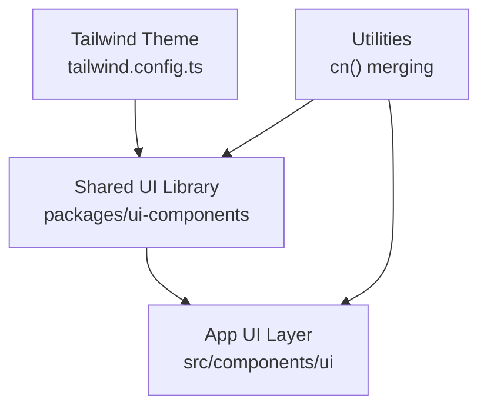
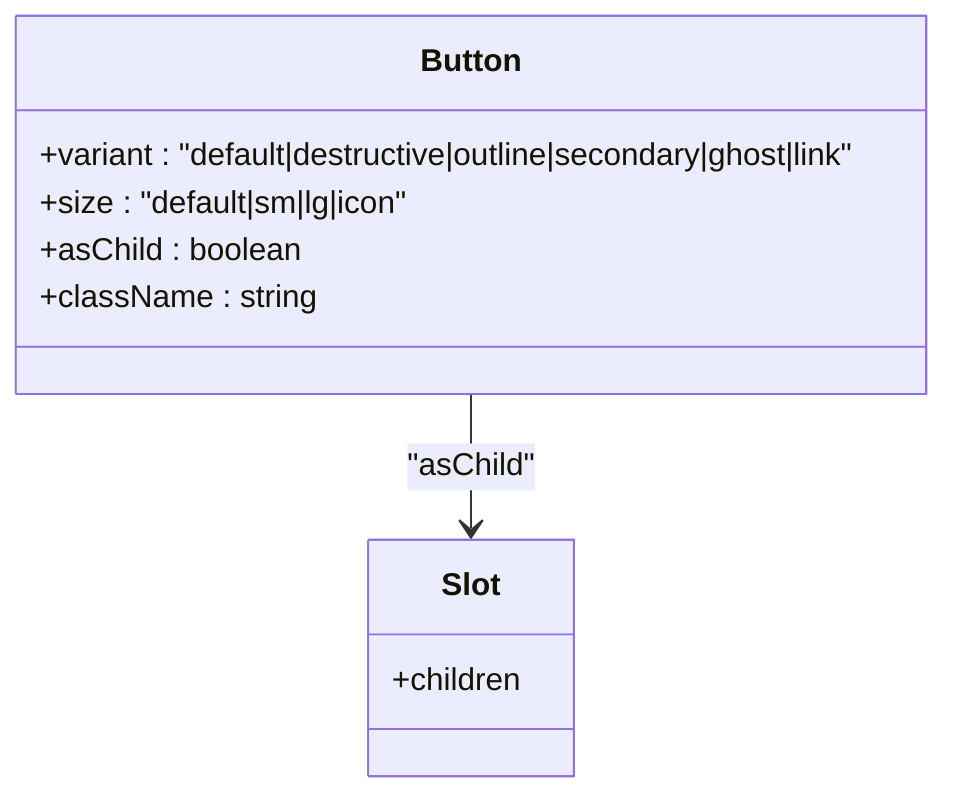
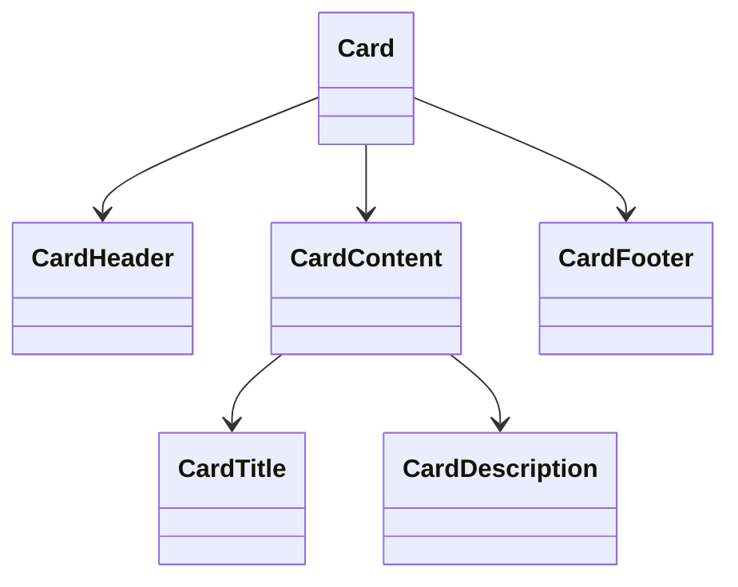
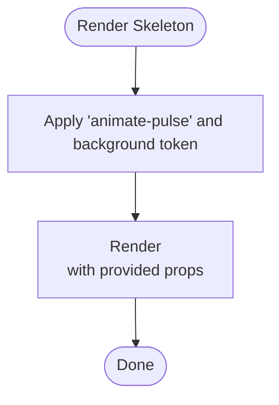
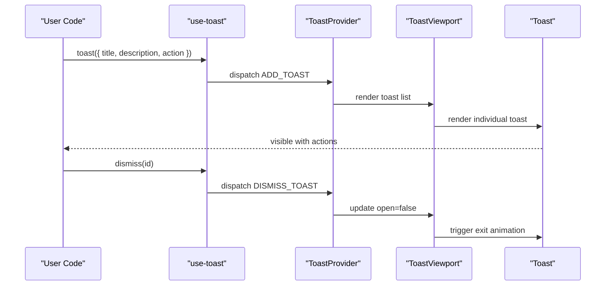
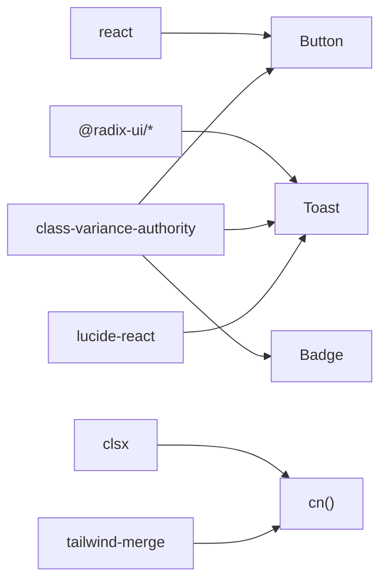

# UI Component System

<cite>
**Referenced Files in This Document**
- [package.json](file://packages/ui-components/package.json)
- [index.ts](file://packages/ui-components/src/index.ts)
- [utils.ts](file://packages/ui-components/src/lib/utils.ts)
- [button.tsx](file://packages/ui-components/src/components/button.tsx)
- [card.tsx](file://packages/ui-components/src/components/card.tsx)
- [skeleton.tsx](file://packages/ui-components/src/components/skeleton.tsx)
- [toast.tsx](file://packages/ui-components/src/components/toast.tsx)
- [use-toast.ts](file://packages/ui-components/src/hooks/use-toast.ts)
- [toaster.tsx](file://src/components/ui/toaster.tsx)
- [input.tsx](file://src/components/ui/input.tsx)
- [badge.tsx](file://src/components/ui/badge.tsx)
- [label.tsx](file://src/components/ui/label.tsx)
- [globals.css](file://src/styles/globals.css)
- [tailwind.config.ts](file://tailwind.config.ts)
- [postcss.config.js](file://postcss.config.js)
- [next.config.js](file://next.config.js)
</cite>

## Table of Contents
1. [Introduction](#introduction)
2. [Project Structure](#project-structure)
3. [Core Components](#core-components)
4. [Architecture Overview](#architecture-overview)
5. [Detailed Component Analysis](#detailed-component-analysis)
6. [Dependency Analysis](#dependency-analysis)
7. [Performance Considerations](#performance-considerations)
8. [Troubleshooting Guide](#troubleshooting-guide)
9. [Conclusion](#conclusion)
10. [Appendices](#appendices)

## Introduction
This document describes the UI component system built with React and a shared component library. It focuses on the reusable component library architecture, design system implementation via Tailwind CSS and class variance authority, and theming support. It documents component props, events, composition patterns, and customization options, and provides guidelines for responsive design, accessibility, animations/transitions, cross-browser compatibility, and performance optimization.

## Project Structure
The UI system is split into two packages:
- Shared component library under packages/ui-components: exports reusable components, hooks, and utilities.
- Application-level components under src/components/ui: thin wrappers that re-export from the shared library and apply local styling.

Key elements:
- Component exports are centralized in the shared library’s index file.
- Utilities consolidate Tailwind class merging and conditional class composition.
- Radix UI primitives power accessible base behaviors (toasts, dialogs, etc.).
- Tailwind CSS config and PostCSS enable design tokens and animations.

```mermaid
graph TB
subgraph "Shared Library (packages/ui-components)"
SL_IDX["src/index.ts"]
SL_BTN["src/components/button.tsx"]
SL_CARD["src/components/card.tsx"]
SL_SKELETON["src/components/skeleton.tsx"]
SL_TOAST["src/components/toast.tsx"]
SL_HOOKS["src/hooks/use-toast.ts"]
SL_UTILS["src/lib/utils.ts"]
end
subgraph "App Layer (src/components/ui)"
APP_BTN["src/components/ui/button.tsx"]
APP_INPUT["src/components/ui/input.tsx"]
APP_BADGE["src/components/ui/badge.tsx"]
APP_LABEL["src/components/ui/label.tsx"]
APP_SKELETON["src/components/ui/skeleton.tsx"]
APP_TOASTER["src/components/ui/toaster.tsx"]
end
SL_IDX --> SL_BTN
SL_IDX --> SL_CARD
SL_IDX --> SL_SKELETON
SL_IDX --> SL_TOAST
SL_IDX --> SL_HOOKS
SL_IDX --> SL_UTILS
APP_BTN --> SL_BTN
APP_INPUT --> SL_BTN
APP_BADGE --> SL_BTN
APP_LABEL --> SL_BTN
APP_SKELETON --> SL_SKELETON
APP_TOASTER --> SL_TOAST
```

**Diagram sources**
- [index.ts](file://packages/ui-components/src/index.ts#L1-L12)
- [button.tsx](file://packages/ui-components/src/components/button.tsx#L1-L55)
- [card.tsx](file://packages/ui-components/src/components/card.tsx#L1-L78)
- [skeleton.tsx](file://packages/ui-components/src/components/skeleton.tsx#L1-L15)
- [toast.tsx](file://packages/ui-components/src/components/toast.tsx#L1-L126)
- [use-toast.ts](file://packages/ui-components/src/hooks/use-toast.ts#L1-L191)
- [utils.ts](file://packages/ui-components/src/lib/utils.ts#L1-L6)
- [toaster.tsx](file://src/components/ui/toaster.tsx#L1-L1)
- [input.tsx](file://src/components/ui/input.tsx#L1-L24)
- [badge.tsx](file://src/components/ui/badge.tsx#L1-L35)
- [label.tsx](file://src/components/ui/label.tsx#L1-L23)

**Section sources**
- [package.json](file://packages/ui-components/package.json#L1-L54)
- [index.ts](file://packages/ui-components/src/index.ts#L1-L12)

## Core Components
This section summarizes the primary components and their roles in the design system.

- Button
  - Purpose: Primary interactive element with variant and size options.
  - Variants: default, destructive, outline, secondary, ghost, link.
  - Sizes: default, sm, lg, icon.
  - Props: Inherits standard button attributes plus variant, size, asChild.
  - Composition: Uses Slot for semantic composition; integrates with Radix focus ring.
  - Accessibility: Inherits native button semantics and focus management.

- Card
  - Purpose: Container with header, title, description, content, and footer parts.
  - Composition: Exports Card, CardHeader, CardTitle, CardDescription, CardContent, CardFooter.
  - Theming: Uses Tailwind tokens for background, border, and text colors.

- Skeleton
  - Purpose: Lightweight loading placeholder with pulse animation.
  - Animation: Built-in animate-pulse class.

- Toast and Toaster
  - Purpose: Non-blocking notifications with viewport positioning and swipe/close actions.
  - Variants: default, destructive.
  - Hooks: use-toast manages toast lifecycle and queue limits.
  - Animations: Uses Radix data-state attributes and CSS transitions.

- Input
  - Purpose: Text field with consistent focus states and placeholder styling.
  - Theming: Inherits background and ring tokens from design system.

- Badge
  - Purpose: Label-like indicator with variant styling.
  - Variants: default, secondary, destructive, outline.

- Label
  - Purpose: Accessible label for form controls.
  - Theming: Uses class variance authority for consistent typography.

**Section sources**
- [button.tsx](file://packages/ui-components/src/components/button.tsx#L1-L55)
- [card.tsx](file://packages/ui-components/src/components/card.tsx#L1-L78)
- [skeleton.tsx](file://packages/ui-components/src/components/skeleton.tsx#L1-L15)
- [toast.tsx](file://packages/ui-components/src/components/toast.tsx#L1-L126)
- [use-toast.ts](file://packages/ui-components/src/hooks/use-toast.ts#L1-L191)
- [input.tsx](file://src/components/ui/input.tsx#L1-L24)
- [badge.tsx](file://src/components/ui/badge.tsx#L1-L35)
- [label.tsx](file://src/components/ui/label.tsx#L1-L23)

## Architecture Overview
The system follows a layered architecture:
- Shared library encapsulates components, hooks, and utilities.
- App layer re-exports components and applies local overrides.
- Design tokens and animations are centralized via Tailwind and Radix UI.

**Diagram sources**
- [package.json](file://packages/ui-components/package.json#L1-L54)
- [index.ts](file://packages/ui-components/src/index.ts#L1-L12)
- [utils.ts](file://packages/ui-components/src/lib/utils.ts#L1-L6)
- [tailwind.config.ts](file://tailwind.config.ts)

## Detailed Component Analysis

### Button
- Props
  - Inherits standard button attributes.
  - variant: default | destructive | outline | secondary | ghost | link.
  - size: default | sm | lg | icon.
  - asChild: composes with @radix-ui/react-slot to render a different tag while preserving behavior.
- Events
  - Standard click and keyboard activation handled by native button semantics.
- Slots
  - asChild enables rendering a child component as the button element.
- Customization
  - Variant and size classes are generated via class-variance-authority.
  - Additional className merges with cn() utility.
- Accessibility
  - Focus-visible ring via Radix focus management.
  - Disabled state handled with pointer-events-none and opacity classes.
- Composition
  - Can wrap icons or text; supports custom anchor/link rendering via asChild.

**Diagram sources**
- [button.tsx](file://packages/ui-components/src/components/button.tsx#L35-L55)

**Section sources**
- [button.tsx](file://packages/ui-components/src/components/button.tsx#L1-L55)

### Card
- Composition
  - Card: container with rounded corners, border, and shadow.
  - CardHeader: vertical stack with spacing.
  - CardTitle: heading with typography tokens.
  - CardDescription: muted text for subheadings.
  - CardContent: padding wrapper.
  - CardFooter: horizontal alignment helper.
- Theming
  - Background, border, and text color rely on Tailwind tokens.
- Accessibility
  - Semantic headings for CardTitle; ensure appropriate heading hierarchy.

**Diagram sources**
- [card.tsx](file://packages/ui-components/src/components/card.tsx#L1-L78)

**Section sources**
- [card.tsx](file://packages/ui-components/src/components/card.tsx#L1-L78)

### Skeleton
- Behavior
  - Renders a div with animate-pulse and background token.
- Use cases
  - Placeholder during async data load.
- Customization
  - Accepts className to adjust shape and size.

**Diagram sources**
- [skeleton.tsx](file://packages/ui-components/src/components/skeleton.tsx#L1-L15)

**Section sources**
- [skeleton.tsx](file://packages/ui-components/src/components/skeleton.tsx#L1-L15)

### Toast and Toaster
- Components
  - ToastProvider: wraps app to enable toast context.
  - ToastViewport: positions toasts in corner or bottom-right.
  - Toast: base toast item with variant and Radix animations.
  - ToastTitle, ToastDescription: structured content.
  - ToastAction, ToastClose: interactive actions.
- Hook
  - use-toast: exposes toast() creation and dismiss/update APIs.
  - Queue management enforces a limit and auto-dismiss timers.
- States and Transitions
  - Uses Radix data-state attributes for enter/exit animations.
  - Swipe gestures supported via CSS variables from Radix.
- Customization
  - Variant styling via class-variance-authority.
  - Close button uses Lucide icon.

**Diagram sources**
- [toast.tsx](file://packages/ui-components/src/components/toast.tsx#L1-L126)
- [use-toast.ts](file://packages/ui-components/src/hooks/use-toast.ts#L1-L191)

**Section sources**
- [toast.tsx](file://packages/ui-components/src/components/toast.tsx#L1-L126)
- [use-toast.ts](file://packages/ui-components/src/hooks/use-toast.ts#L1-L191)

### Input
- Props
  - Inherits standard input attributes.
  - Supports type prop and className.
- Styling
  - Consistent height, padding, border, focus ring, and disabled states.
- Accessibility
  - Proper labeling via associated Label component recommended.

**Section sources**
- [input.tsx](file://src/components/ui/input.tsx#L1-L24)

### Badge
- Props
  - Inherits standard div attributes.
  - variant: default | secondary | destructive | outline.
- Theming
  - Variant classes applied via class-variance-authority.

**Section sources**
- [badge.tsx](file://src/components/ui/badge.tsx#L1-L35)

### Label
- Props
  - Inherits Radix label attributes with optional variant styling.
- Accessibility
  - Integrates with form controls for improved labeling.

**Section sources**
- [label.tsx](file://src/components/ui/label.tsx#L1-L23)

## Dependency Analysis
External libraries and their roles:
- React and ReactDOM: core framework.
- Radix UI: accessible base primitives (dialogs, toasts, labels, navigation menu, etc.).
- class-variance-authority: variant-based class composition.
- clsx and tailwind-merge: safe class merging.
- lucide-react: icons for close button.
- tailwindcss-animate: prebuilt animation utilities.

**Diagram sources**
- [package.json](file://packages/ui-components/package.json#L14-L39)
- [button.tsx](file://packages/ui-components/src/components/button.tsx#L1-L55)
- [badge.tsx](file://src/components/ui/badge.tsx#L1-L35)
- [toast.tsx](file://packages/ui-components/src/components/toast.tsx#L1-L126)
- [utils.ts](file://packages/ui-components/src/lib/utils.ts#L1-L6)

**Section sources**
- [package.json](file://packages/ui-components/package.json#L1-L54)

## Performance Considerations
- Class Merging
  - Use cn() to avoid conflicting Tailwind classes and reduce runtime overhead.
- Variant Composition
  - Keep variant sets minimal to reduce CSS bloat.
- Animations
  - Prefer hardware-accelerated properties (transform/opacity) for smooth transitions.
- Bundle Size
  - Tree-shake unused components and icons.
- Rendering
  - Memoize heavy computations; avoid unnecessary re-renders in lists.

## Troubleshooting Guide
- Missing Theme Tokens
  - Ensure Tailwind theme includes required tokens (primary, destructive, muted, etc.).
- Toast Not Showing
  - Verify ToastProvider is mounted at the root and use-toast is called after provider.
- Focus Ring Not Visible
  - Confirm focus-visible ring utilities are enabled in Tailwind.
- Disabled Button Still Receives Events
  - Disabled state is handled via pointer-events-none and opacity; ensure parent event handlers do not bypass this.

**Section sources**
- [tailwind.config.ts](file://tailwind.config.ts)
- [toast.tsx](file://packages/ui-components/src/components/toast.tsx#L1-L126)
- [use-toast.ts](file://packages/ui-components/src/hooks/use-toast.ts#L1-L191)

## Conclusion
The UI component system leverages a shared library pattern, Radix UI primitives, and Tailwind CSS to deliver a consistent, accessible, and customizable design system. Components are composable, themeable, and optimized for performance. Following the guidelines herein ensures robust integration, responsive layouts, and cross-browser compatibility.

## Appendices

### Theming and Design Tokens
- Tailwind theme defines color scales and spacing tokens consumed by components.
- Use semantic tokens (primary, secondary, destructive, muted) consistently across components.
- Extend tokens in the Tailwind config to match brand guidelines.

**Section sources**
- [tailwind.config.ts](file://tailwind.config.ts)
- [globals.css](file://src/styles/globals.css)

### Responsive Design Guidelines
- Use Tailwind responsive prefixes (sm:, md:, lg:, etc.) to adapt component sizes and spacing.
- Prefer fluid typography and flexible grid layouts.
- Test breakpoints with real devices and screen readers.

### Accessibility Compliance
- Buttons and links must be keyboard accessible and announce meaningful labels.
- Inputs should be paired with labels; errors communicated via aria-live regions.
- Toasts should be announced by assistive technologies; avoid auto-dismiss for critical messages.

### Cross-Browser Compatibility
- Use Tailwind’s default utilities; avoid vendor-prefixed properties.
- Test animations and focus rings across browsers; polyfill where necessary.

### Component Composition Patterns
- Wrap base components with app-layer wrappers to centralize styling and behavior.
- Use asChild to compose semantic elements (e.g., Link as Button).
- Compose cards with skeletons for loading states.

### Live Demo References
- Toast demo: see [toast.tsx](file://packages/ui-components/src/components/toast.tsx#L1-L126) and [use-toast.ts](file://packages/ui-components/src/hooks/use-toast.ts#L1-L191).
- Button variants: see [button.tsx](file://packages/ui-components/src/components/button.tsx#L1-L55).
- Card composition: see [card.tsx](file://packages/ui-components/src/components/card.tsx#L1-L78).