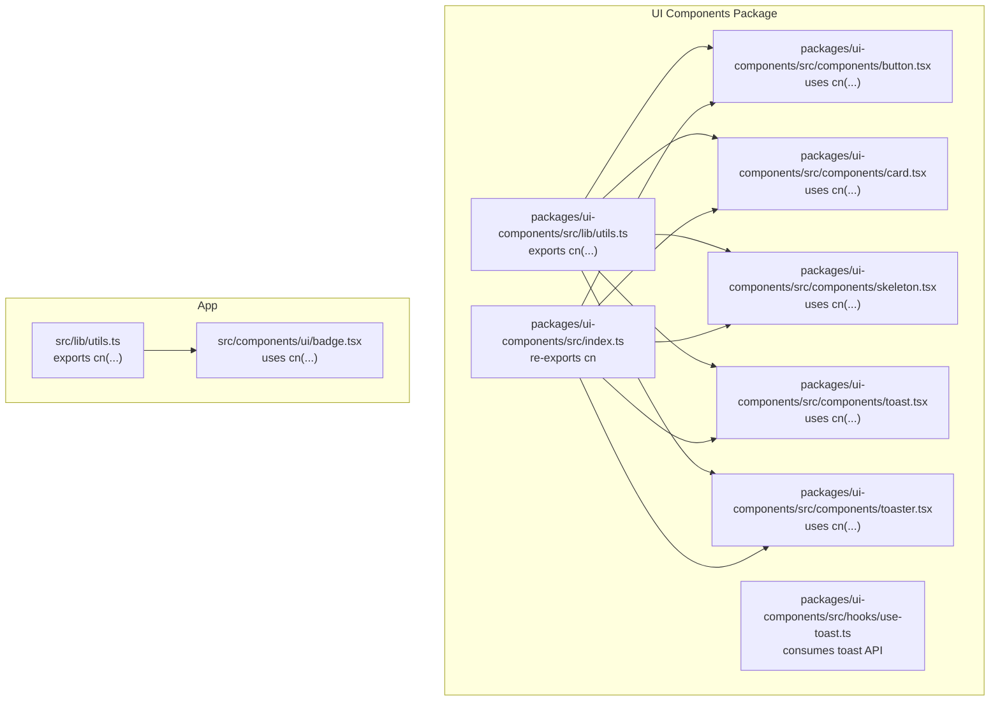
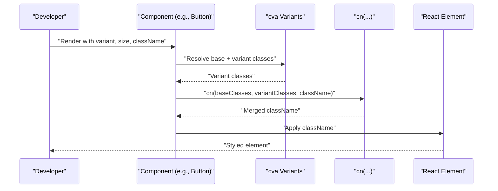
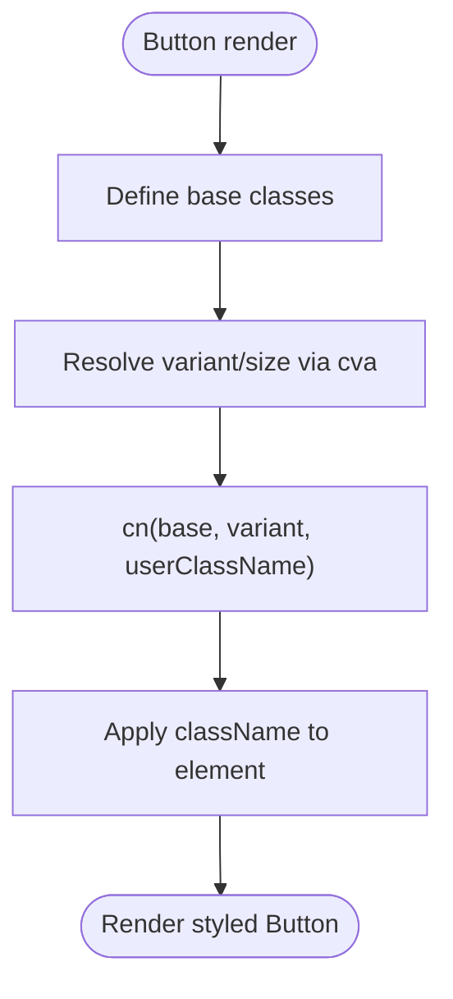
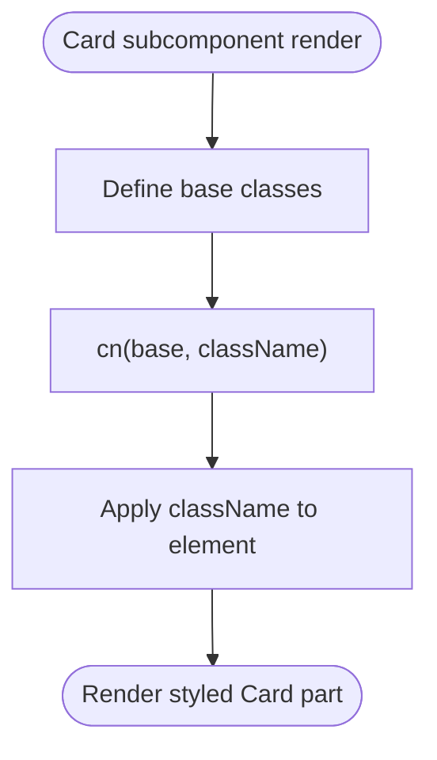
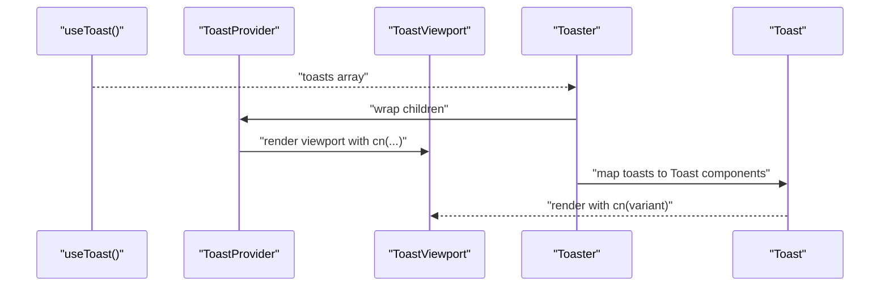
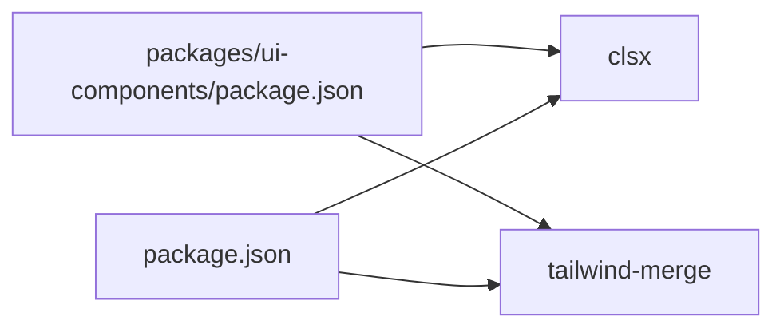

# Utility Helpers

<cite>
**Referenced Files in This Document**
- [packages/ui-components/src/lib/utils.ts](file://packages/ui-components/src/lib/utils.ts)
- [src/lib/utils.ts](file://src/lib/utils.ts)
- [packages/ui-components/src/index.ts](file://packages/ui-components/src/index.ts)
- [packages/ui-components/src/components/button.tsx](file://packages/ui-components/src/components/button.tsx)
- [packages/ui-components/src/components/card.tsx](file://packages/ui-components/src/components/card.tsx)
- [packages/ui-components/src/components/skeleton.tsx](file://packages/ui-components/src/components/skeleton.tsx)
- [packages/ui-components/src/components/toast.tsx](file://packages/ui-components/src/components/toast.tsx)
- [packages/ui-components/src/components/toaster.tsx](file://packages/ui-components/src/components/toaster.tsx)
- [packages/ui-components/src/hooks/use-toast.ts](file://packages/ui-components/src/hooks/use-toast.ts)
- [src/components/ui/badge.tsx](file://src/components/ui/badge.tsx)
- [packages/ui-components/package.json](file://packages/ui-components/package.json)
- [package.json](file://package.json)
</cite>

## Table of Contents
1. [Introduction](#introduction)
2. [Project Structure](#project-structure)
3. [Core Components](#core-components)
4. [Architecture Overview](#architecture-overview)
5. [Detailed Component Analysis](#detailed-component-analysis)
6. [Dependency Analysis](#dependency-analysis)
7. [Performance Considerations](#performance-considerations)
8. [Troubleshooting Guide](#troubleshooting-guide)
9. [Conclusion](#conclusion)

## Introduction
This document focuses on the utility functions and helper methods that power consistent, composable UI across the component library. The primary utility is the cn function (clsx wrapper with tailwind-merge), which simplifies conditional class names and prevents Tailwind CSS conflicts. We explain how cn and related helpers improve component composition, reduce boilerplate, and maintain theme consistency. We also provide usage patterns, best practices, and guidance for extending functionality safely.

## Project Structure
The utility helpers live in two locations:
- Shared utility for the UI components package
- Shared utility for the main application

Both expose a cn function built on clsx and tailwind-merge. Components import cn locally from their own package or the app’s shared utils to compose base styles with variant classes and user-provided overrides.

**Diagram sources**
- [packages/ui-components/src/lib/utils.ts](file://packages/ui-components/src/lib/utils.ts#L1-L6)
- [packages/ui-components/src/index.ts](file://packages/ui-components/src/index.ts#L11-L12)
- [packages/ui-components/src/components/button.tsx](file://packages/ui-components/src/components/button.tsx#L1-L55)
- [packages/ui-components/src/components/card.tsx](file://packages/ui-components/src/components/card.tsx#L1-L78)
- [packages/ui-components/src/components/skeleton.tsx](file://packages/ui-components/src/components/skeleton.tsx#L1-L15)
- [packages/ui-components/src/components/toast.tsx](file://packages/ui-components/src/components/toast.tsx#L1-L126)
- [packages/ui-components/src/components/toaster.tsx](file://packages/ui-components/src/components/toaster.tsx#L1-L35)
- [src/lib/utils.ts](file://src/lib/utils.ts#L1-L6)
- [src/components/ui/badge.tsx](file://src/components/ui/badge.tsx#L1-L35)

**Section sources**
- [packages/ui-components/src/lib/utils.ts](file://packages/ui-components/src/lib/utils.ts#L1-L6)
- [src/lib/utils.ts](file://src/lib/utils.ts#L1-L6)
- [packages/ui-components/src/index.ts](file://packages/ui-components/src/index.ts#L11-L12)

## Core Components
- cn function: A thin wrapper around clsx and tailwind-merge that merges class names while deduplicating conflicting Tailwind utilities. It accepts a variable number of inputs and returns a single merged string suitable for React className.
- Export surface: Both packages re-export cn via their index.ts so consumers can import cn directly from the package root.

How cn improves composition:
- Reduces boilerplate by merging base classes, variant classes, and user-provided className seamlessly.
- Prevents class conflicts by deduplicating Tailwind utilities, ensuring only the last utility wins.
- Encourages consistent patterns across components by centralizing class composition logic.

**Section sources**
- [packages/ui-components/src/lib/utils.ts](file://packages/ui-components/src/lib/utils.ts#L1-L6)
- [src/lib/utils.ts](file://src/lib/utils.ts#L1-L6)
- [packages/ui-components/src/index.ts](file://packages/ui-components/src/index.ts#L11-L12)

## Architecture Overview
The cn helper is consumed by UI components and hooks across the library. Components define base styles and optional variants using class-variance-authority, then merge them with user-provided className through cn. The toast system demonstrates a complementary pattern: variant classes are composed via cva, then merged with user props using cn.

**Diagram sources**
- [packages/ui-components/src/components/button.tsx](file://packages/ui-components/src/components/button.tsx#L6-L33)
- [packages/ui-components/src/lib/utils.ts](file://packages/ui-components/src/lib/utils.ts#L4-L6)

**Section sources**
- [packages/ui-components/src/components/button.tsx](file://packages/ui-components/src/components/button.tsx#L6-L33)
- [packages/ui-components/src/lib/utils.ts](file://packages/ui-components/src/lib/utils.ts#L4-L6)

## Detailed Component Analysis

### cn Function and Its Role
- Purpose: Merge class names with conflict resolution.
- Inputs: Variable-length list of class values (strings, nullish, objects, arrays).
- Behavior: Runs clsx to normalize inputs, then tailwind-merge to deduplicate conflicting utilities.
- Usage sites:
  - UI components: Button, Card, Skeleton, Toast, Toaster, Badge.
  - Hooks: use-toast exposes a toast API; components render with cn.

Benefits:
- Keeps className logic centralized and consistent.
- Eliminates manual string concatenation and conditionals.
- Ensures Tailwind utilities do not stack unintentionally.

**Section sources**
- [packages/ui-components/src/lib/utils.ts](file://packages/ui-components/src/lib/utils.ts#L1-L6)
- [src/lib/utils.ts](file://src/lib/utils.ts#L1-L6)
- [packages/ui-components/src/components/button.tsx](file://packages/ui-components/src/components/button.tsx#L46)
- [packages/ui-components/src/components/card.tsx](file://packages/ui-components/src/components/card.tsx#L10-L13)
- [packages/ui-components/src/components/skeleton.tsx](file://packages/ui-components/src/components/skeleton.tsx#L9)
- [packages/ui-components/src/components/toast.tsx](file://packages/ui-components/src/components/toast.tsx#L48)
- [src/components/ui/badge.tsx](file://src/components/ui/badge.tsx#L31)

### Button Component Pattern
- Uses cva for variant and size classes.
- Merges base, variant, and user className via cn.
- Supports asChild for semantic composition.

**Diagram sources**
- [packages/ui-components/src/components/button.tsx](file://packages/ui-components/src/components/button.tsx#L6-L33)
- [packages/ui-components/src/lib/utils.ts](file://packages/ui-components/src/lib/utils.ts#L4-L6)

**Section sources**
- [packages/ui-components/src/components/button.tsx](file://packages/ui-components/src/components/button.tsx#L6-L33)

### Card Component Pattern
- Each Card subcomponent (Card, CardHeader, CardTitle, CardDescription, CardContent, CardFooter) composes its own base classes with user className via cn.

**Diagram sources**
- [packages/ui-components/src/components/card.tsx](file://packages/ui-components/src/components/card.tsx#L10-L13)
- [packages/ui-components/src/components/card.tsx](file://packages/ui-components/src/components/card.tsx#L25)
- [packages/ui-components/src/components/card.tsx](file://packages/ui-components/src/components/card.tsx#L37-L40)
- [packages/ui-components/src/components/card.tsx](file://packages/ui-components/src/components/card.tsx#L52)
- [packages/ui-components/src/components/card.tsx](file://packages/ui-components/src/components/card.tsx#L62)
- [packages/ui-components/src/components/card.tsx](file://packages/ui-components/src/components/card.tsx#L72)

**Section sources**
- [packages/ui-components/src/components/card.tsx](file://packages/ui-components/src/components/card.tsx#L1-L78)

### Toast System Pattern
- Toast provider and viewport use cn to merge variant classes and user className.
- The Toaster component renders a list of toasts resolved from the use-toast hook.

**Diagram sources**
- [packages/ui-components/src/hooks/use-toast.ts](file://packages/ui-components/src/hooks/use-toast.ts#L171-L189)
- [packages/ui-components/src/components/toast.tsx](file://packages/ui-components/src/components/toast.tsx#L15-L18)
- [packages/ui-components/src/components/toaster.tsx](file://packages/ui-components/src/components/toaster.tsx#L13-L34)

**Section sources**
- [packages/ui-components/src/components/toast.tsx](file://packages/ui-components/src/components/toast.tsx#L1-L126)
- [packages/ui-components/src/components/toaster.tsx](file://packages/ui-components/src/components/toaster.tsx#L1-L35)
- [packages/ui-components/src/hooks/use-toast.ts](file://packages/ui-components/src/hooks/use-toast.ts#L1-L191)

### Badge Component Pattern
- Uses cva for variant classes and cn to merge with user className.

**Section sources**
- [src/components/ui/badge.tsx](file://src/components/ui/badge.tsx#L5-L23)
- [src/components/ui/badge.tsx](file://src/components/ui/badge.tsx#L29-L33)

## Dependency Analysis
The cn helper depends on clsx and tailwind-merge. These libraries are declared in both the UI components package and the main app package.

**Diagram sources**
- [packages/ui-components/package.json](file://packages/ui-components/package.json#L35-L39)
- [package.json](file://package.json#L38-L59)

**Section sources**
- [packages/ui-components/package.json](file://packages/ui-components/package.json#L14-L40)
- [package.json](file://package.json#L13-L62)

## Performance Considerations
- cn performs minimal work: normalization via clsx and a single pass deduplication via tailwind-merge. This is negligible compared to rendering costs.
- Prefer passing only necessary className values to avoid unnecessary string concatenation upstream.
- Keep variant sets concise to minimize cva-generated class strings.

## Troubleshooting Guide
Common issues and resolutions:
- Unexpected Tailwind overrides: Ensure user className is passed after variant classes so it can override as intended.
- Conflicting variants: If multiple variants set the same utility, the last one wins due to tailwind-merge. Verify variant order and className precedence.
- Missing className: Confirm that cn is called with all relevant inputs (base, variant, user).

Best practices:
- Always merge user className last to preserve intended overrides.
- Use cva for variant definitions to keep base classes consistent.
- Centralize cn usage to enforce uniform composition across components.

## Conclusion
The cn helper is a small but powerful utility that standardizes class composition across the component library. By combining clsx and tailwind-merge, it reduces boilerplate, prevents style conflicts, and enforces consistent patterns. Components like Button, Card, Toast, and Badge rely on cn to merge base, variant, and user-provided classes cleanly. The toast system further demonstrates how variant classes and user props are combined consistently. Extending functionality involves adding new variants via cva and ensuring cn receives all inputs, preserving the established patterns.