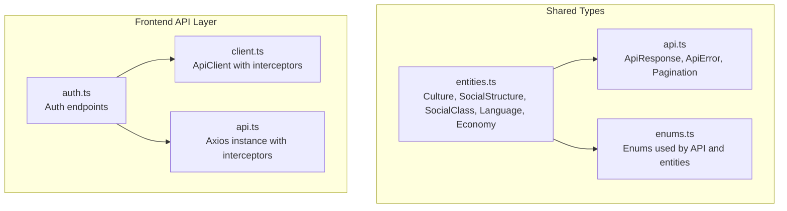
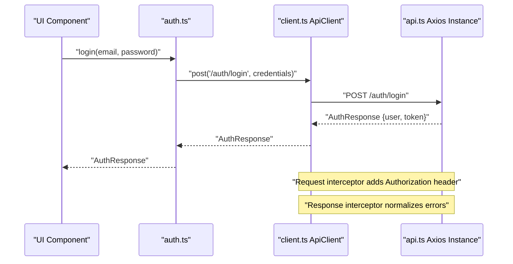
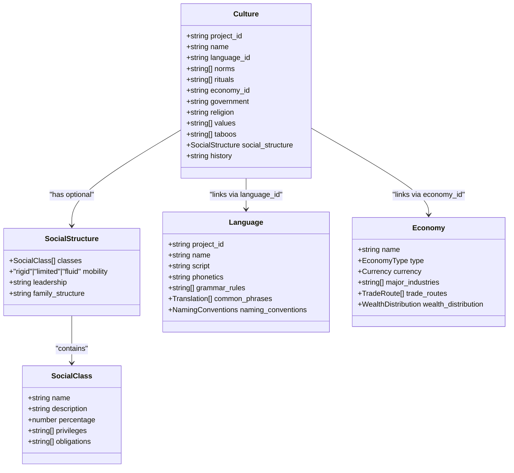
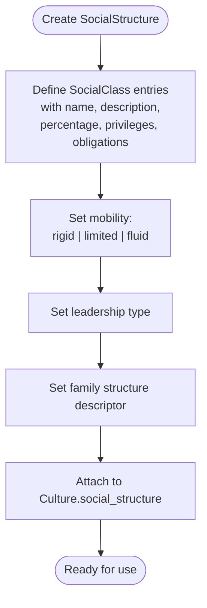
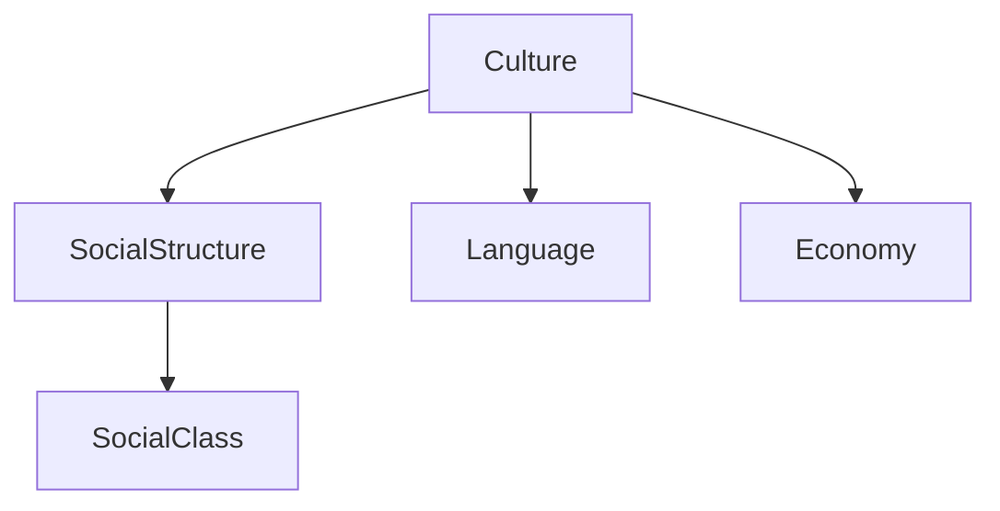

# Cultural & Social Systems

<cite>
**Referenced Files in This Document**
- [entities.ts](file://packages/shared-types/src/entities.ts)
- [api.ts](file://packages/shared-types/src/api.ts)
- [enums.ts](file://packages/shared-types/src/enums.ts)
- [client.ts](file://src/lib/api/client.ts)
- [api.ts](file://src/lib/api.ts)
- [auth.ts](file://src/lib/api/auth.ts)
- [README.md](file://README.md)
- [IMPLEMENTATION_PLAN.md](file://IMPLEMENTATION_PLAN.md)
- [EXECUTIVE_SUMMARY.md](file://EXECUTIVE_SUMMARY.md)
</cite>

## Table of Contents
1. [Introduction](#introduction)
2. [Project Structure](#project-structure)
3. [Core Components](#core-components)
4. [Architecture Overview](#architecture-overview)
5. [Detailed Component Analysis](#detailed-component-analysis)
6. [Dependency Analysis](#dependency-analysis)
7. [Performance Considerations](#performance-considerations)
8. [Troubleshooting Guide](#troubleshooting-guide)
9. [Conclusion](#conclusion)
10. [Appendices](#appendices)

## Introduction
This document explains the cultural and social modeling system for the platform. It focuses on the Culture entity, the SocialStructure interface, and how cultural practices (norms, rituals, values, taboos) are represented. It also covers language integration, economic relationships, and how these elements influence narrative content. The goal is to make the system understandable for beginners while providing sufficient technical depth for developers implementing or extending the model.

## Project Structure
The cultural and social modeling lives primarily in shared types and integrates with the frontend API layer. The key files are:
- Shared entity definitions for Culture, SocialStructure, SocialClass, Language, and Economy
- API types and enums used across the platform
- Frontend API clients and authentication utilities

**Diagram sources**
- [entities.ts](file://packages/shared-types/src/entities.ts#L180-L208)
- [api.ts](file://packages/shared-types/src/api.ts#L1-L65)
- [enums.ts](file://packages/shared-types/src/enums.ts#L172-L191)
- [auth.ts](file://src/lib/api/auth.ts#L25-L55)
- [client.ts](file://src/lib/api/client.ts#L3-L16)
- [api.ts](file://src/lib/api.ts#L3-L8)

**Section sources**
- [README.md](file://README.md#L96-L109)
- [IMPLEMENTATION_PLAN.md](file://IMPLEMENTATION_PLAN.md#L36-L47)

## Core Components
This section documents the primary data structures that define cultures and societies.

- Culture
  - Represents a society’s identity and structure.
  - Fields include identifiers, name, associated language, economy, government, religion, and historical notes.
  - Cultural attributes: norms, rituals, values, taboos.
  - Optional embedded SocialStructure describing classes, mobility, leadership, and family structure.

- SocialStructure
  - Defines the formal hierarchy and social dynamics.
  - Includes an array of SocialClass entries, mobility mode, leadership type, and family structure descriptor.

- SocialClass
  - Describes a class by name, description, proportional population, privileges, and obligations.

- Language
  - Provides linguistic foundation for a culture, including script, phonetics, grammar rules, common phrases, and naming conventions.

- Economy
  - Captures economic type, currency, major industries, trade routes, and wealth distribution statistics.

Practical implications:
- Culture links to Language via language_id and to Economy via economy_id.
- SocialStructure enables modeling of class systems and social mobility.
- Norms, rituals, values, and taboos provide behavioral and symbolic scaffolding for narrative generation.

**Section sources**
- [entities.ts](file://packages/shared-types/src/entities.ts#L180-L208)
- [entities.ts](file://packages/shared-types/src/entities.ts#L210-L238)
- [entities.ts](file://packages/shared-types/src/entities.ts#L240-L276)

## Architecture Overview
The cultural/social model is consumed by the frontend through typed API clients. Authentication tokens are attached automatically to requests, and errors are normalized for consistent handling.

**Diagram sources**
- [auth.ts](file://src/lib/api/auth.ts#L25-L55)
- [client.ts](file://src/lib/api/client.ts#L18-L35)
- [client.ts](file://src/lib/api/client.ts#L37-L80)
- [api.ts](file://src/lib/api.ts#L10-L22)

## Detailed Component Analysis

### Culture Entity and Social Structure
The Culture entity encapsulates a society’s identity and optional embedded social framework. SocialStructure ties into SocialClass definitions to model hierarchy and dynamics.

**Diagram sources**
- [entities.ts](file://packages/shared-types/src/entities.ts#L180-L208)
- [entities.ts](file://packages/shared-types/src/entities.ts#L210-L238)
- [entities.ts](file://packages/shared-types/src/entities.ts#L240-L276)

**Section sources**
- [entities.ts](file://packages/shared-types/src/entities.ts#L180-L208)

### Social Mobility and Leadership Flow
This flow illustrates how mobility and leadership are modeled and how they influence class dynamics.

**Diagram sources**
- [entities.ts](file://packages/shared-types/src/entities.ts#L195-L208)

**Section sources**
- [entities.ts](file://packages/shared-types/src/entities.ts#L195-L208)

### Cultural Practices Documentation
Cultural practices are stored as arrays of strings within the Culture entity. These can represent:
- Norms: expected behaviors
- Rituals: ceremonial or recurring actions
- Values: guiding principles
- Taboos: prohibited actions

Implementation guidance:
- Keep entries concise but meaningful for downstream processing.
- Use consistent terminology across cultures to enable comparison and filtering.
- Consider associating each practice with context or examples for richer narrative generation.

**Section sources**
- [entities.ts](file://packages/shared-types/src/entities.ts#L180-L193)

### Language Integration
Language underpins identity and communication within a culture. The Language entity supports:
- Script and phonetics for linguistic authenticity
- Grammar rules for generative coherence
- Common phrases for dialogue and naming
- Naming conventions for first names, surnames, place names, and titles

Integration tips:
- Link Culture.language_id to Language.id to connect identity and language.
- Use Translation entries to support multilingual outputs and localized naming.

**Section sources**
- [entities.ts](file://packages/shared-types/src/entities.ts#L210-L238)

### Economic Relationships
Economy ties a culture’s production, trade, and wealth distribution to its social model:
- Economy.type defines the monetary system (e.g., barter, currency, gift, market)
- Currency describes denominations and exchange rates
- TradeRoute captures commerce pathways
- WealthDistribution quantifies inequality and class composition

Narrative impact:
- Economic type influences class mobility and privileges.
- Trade routes can drive inter-cultural relationships and conflicts.
- Wealth distribution informs social tensions and opportunities.

**Section sources**
- [entities.ts](file://packages/shared-types/src/entities.ts#L240-L276)

### Practical Examples

- Creating a culture
  - Steps:
    - Define norms, rituals, values, taboos
    - Optionally define SocialStructure with classes, mobility, leadership, and family structure
    - Link to Language and Economy by ID
    - Save to backend via API
  - Example reference paths:
    - Culture creation payload shape: [entities.ts](file://packages/shared-types/src/entities.ts#L180-L193)
    - SocialStructure definition: [entities.ts](file://packages/shared-types/src/entities.ts#L195-L200)
    - SocialClass definition: [entities.ts](file://packages/shared-types/src/entities.ts#L202-L208)

- Managing social classes
  - Steps:
    - Create SocialClass entries with accurate percentages that sum to 100
    - Assign privileges and obligations aligned with the culture’s economy and government
    - Choose mobility mode consistent with leadership and values
  - Example reference paths:
    - SocialClass fields: [entities.ts](file://packages/shared-types/src/entities.ts#L202-L208)
    - SocialStructure mobility: [entities.ts](file://packages/shared-types/src/entities.ts#L197)

- Documenting cultural practices
  - Steps:
    - Populate norms, rituals, values, taboos arrays
    - Add historical context in history
  - Example reference paths:
    - Culture practice fields: [entities.ts](file://packages/shared-types/src/entities.ts#L184-L192)

- Language integration
  - Steps:
    - Create Language with grammar_rules, common_phrases, and naming_conventions
    - Link Culture.language_id to Language.id
  - Example reference paths:
    - Language fields: [entities.ts](file://packages/shared-types/src/entities.ts#L210-L218)
    - NamingConventions: [entities.ts](file://packages/shared-types/src/entities.ts#L227-L232)

- Economic relationships
  - Steps:
    - Define Economy with type, currency, major_industries, trade_routes, and wealth_distribution
    - Link Culture.economy_id to Economy.id
  - Example reference paths:
    - Economy fields: [entities.ts](file://packages/shared-types/src/entities.ts#L240-L248)

**Section sources**
- [entities.ts](file://packages/shared-types/src/entities.ts#L180-L208)
- [entities.ts](file://packages/shared-types/src/entities.ts#L210-L238)
- [entities.ts](file://packages/shared-types/src/entities.ts#L240-L276)

### Cultural Evolution, Inter-Cultural Relationships, and Narrative Impact
- Cultural evolution
  - Model change over time by updating Culture.norms, rituals, values, taboos, and social_structure.
  - Use Timeline and TimelineEvent to anchor shifts historically.
- Inter-cultural relationships
  - TradeRoute can represent cross-culture exchange.
  - Language common_phrases can include loanwords or translanguaged expressions.
- Narrative impact
  - Placeholders and TextVersion can encode content ratings and safety overrides for culturally sensitive material.
  - RelationshipType and PlaceholderType help manage character dynamics and content filtering.

**Section sources**
- [entities.ts](file://packages/shared-types/src/entities.ts#L285-L294)
- [entities.ts](file://packages/shared-types/src/entities.ts#L304-L335)
- [entities.ts](file://packages/shared-types/src/entities.ts#L422-L428)
- [entities.ts](file://packages/shared-types/src/entities.ts#L430-L435)

## Dependency Analysis
The cultural/social model depends on shared types and API infrastructure. Cohesion is strong within entities.ts; coupling is primarily through IDs (language_id, economy_id) and optional embedded structures (social_structure).

**Diagram sources**
- [entities.ts](file://packages/shared-types/src/entities.ts#L180-L208)

**Section sources**
- [entities.ts](file://packages/shared-types/src/entities.ts#L180-L208)

## Performance Considerations
- Normalize cultural data to reduce duplication (e.g., reuse Language and Economy records).
- Paginate and filter Culture lists using shared API pagination params.
- Cache frequently accessed Language common_phrases and Economy trade_routes.
- Keep SocialClass percentage sums accurate to avoid runtime normalization overhead.

[No sources needed since this section provides general guidance]

## Troubleshooting Guide
Common issues and resolutions:
- Authentication failures
  - Symptom: 401 responses after token expiration.
  - Resolution: Use the refresh endpoint and update cookies/local storage accordingly.
  - References:
    - [client.ts](file://src/lib/api/client.ts#L44-L67)
    - [api.ts](file://src/lib/api.ts#L30-L43)
- Error normalization
  - Symptom: Inconsistent error shapes across endpoints.
  - Resolution: Use the standardized ApiError and ApiResponse types.
  - References:
    - [api.ts](file://packages/shared-types/src/api.ts#L10-L17)
    - [client.ts](file://src/lib/api/client.ts#L70-L78)

**Section sources**
- [client.ts](file://src/lib/api/client.ts#L44-L67)
- [client.ts](file://src/lib/api/client.ts#L70-L78)
- [api.ts](file://src/lib/api.ts#L30-L43)
- [api.ts](file://packages/shared-types/src/api.ts#L10-L17)

## Conclusion
The cultural and social modeling system centers on the Culture entity and its optional SocialStructure, enriched by Language and Economy. This design enables robust storytelling by capturing identity, hierarchy, communication, and economic dynamics. By following the practical examples and leveraging the shared types and API infrastructure, teams can implement nuanced cultures that evolve over time and interact meaningfully with narrative content.

[No sources needed since this section summarizes without analyzing specific files]

## Appendices

### API and Type Reference Index
- Culture, SocialStructure, SocialClass, Language, Economy definitions
  - [entities.ts](file://packages/shared-types/src/entities.ts#L180-L276)
- API response/error types and pagination
  - [api.ts](file://packages/shared-types/src/api.ts#L1-L65)
- Authentication endpoints and flows
  - [auth.ts](file://src/lib/api/auth.ts#L25-L55)
- Frontend API client and interceptors
  - [client.ts](file://src/lib/api/client.ts#L3-L16)
  - [client.ts](file://src/lib/api/client.ts#L18-L80)
  - [api.ts](file://src/lib/api.ts#L3-L8)
  - [api.ts](file://src/lib/api.ts#L10-L22)
  - [api.ts](file://src/lib/api.ts#L24-L43)

**Section sources**
- [entities.ts](file://packages/shared-types/src/entities.ts#L180-L276)
- [api.ts](file://packages/shared-types/src/api.ts#L1-L65)
- [auth.ts](file://src/lib/api/auth.ts#L25-L55)
- [client.ts](file://src/lib/api/client.ts#L3-L16)
- [client.ts](file://src/lib/api/client.ts#L18-L80)
- [api.ts](file://src/lib/api.ts#L3-L8)
- [api.ts](file://src/lib/api.ts#L10-L22)
- [api.ts](file://src/lib/api.ts#L24-L43)