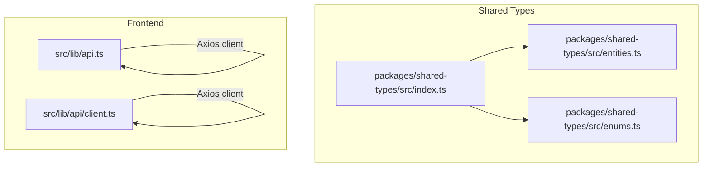
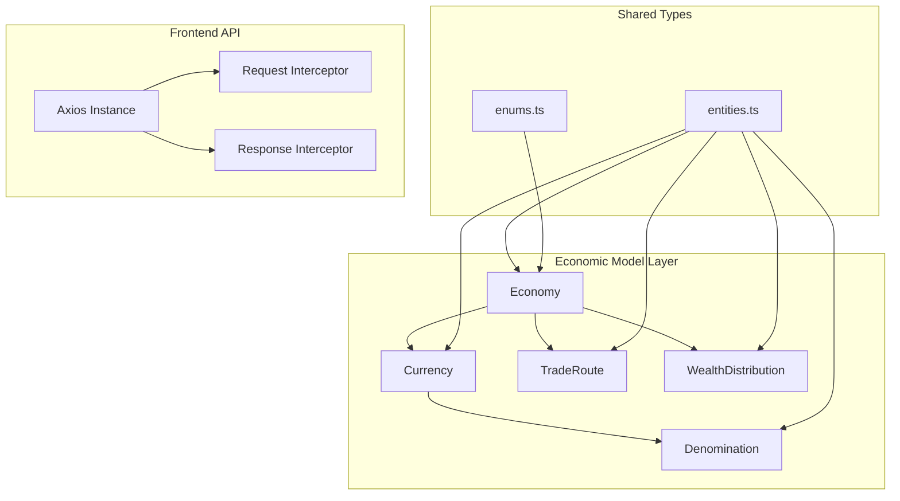
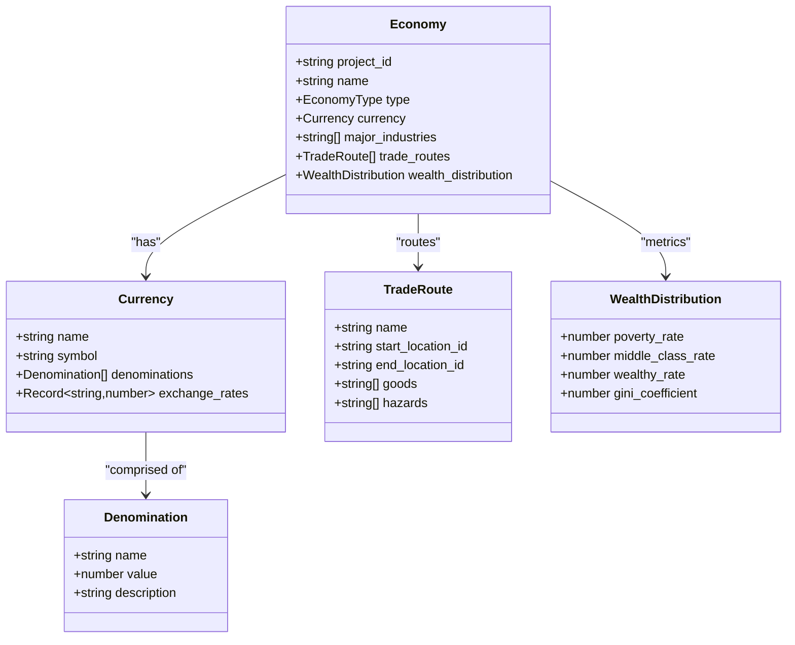
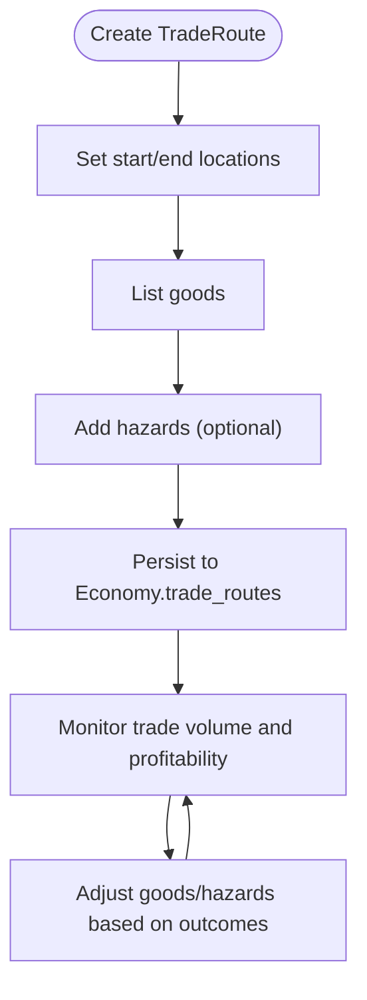
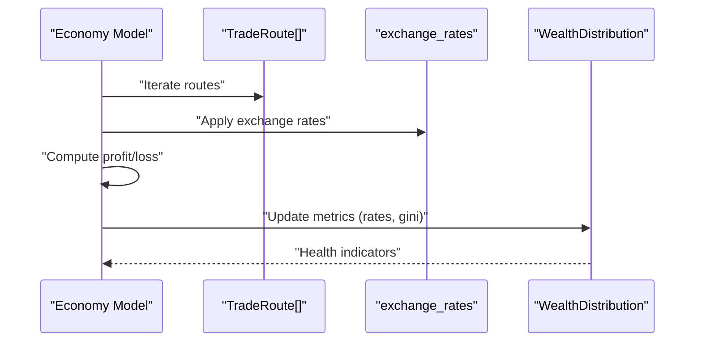
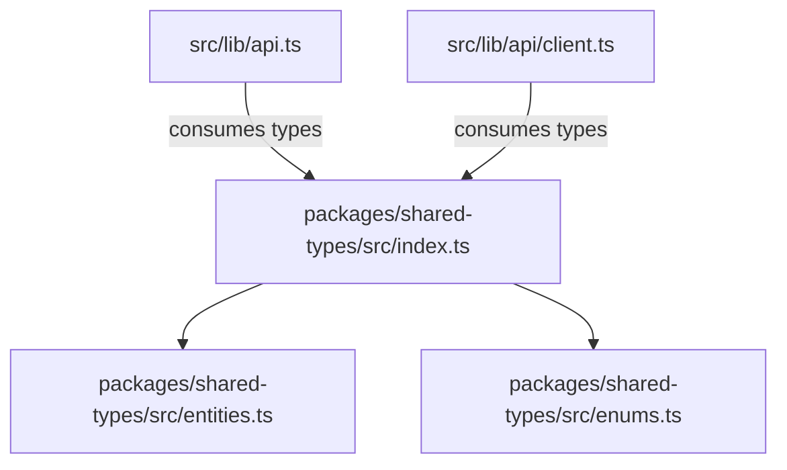

# Economic Modeling

<cite>
**Referenced Files in This Document**
- [README.md](file://README.md)
- [entities.ts](file://packages/shared-types/src/entities.ts)
- [enums.ts](file://packages/shared-types/src/enums.ts)
- [index.ts](file://packages/shared-types/src/index.ts)
- [api.ts](file://src/lib/api.ts)
- [client.ts](file://src/lib/api/client.ts)
</cite>

## Table of Contents
1. [Introduction](#introduction)
2. [Project Structure](#project-structure)
3. [Core Components](#core-components)
4. [Architecture Overview](#architecture-overview)
5. [Detailed Component Analysis](#detailed-component-analysis)
6. [Dependency Analysis](#dependency-analysis)
7. [Performance Considerations](#performance-considerations)
8. [Troubleshooting Guide](#troubleshooting-guide)
9. [Conclusion](#conclusion)
10. [Appendices](#appendices)

## Introduction
This document explains the economic modeling system for the platform, focusing on the Economy entity, currency systems, and trade route management. It documents the Currency interface (including denominations and exchange rates), major industries, trade routes, and wealth distribution modeling. Practical examples describe how to create economic systems, manage currency exchanges, and track trade relationships. Economic indicators and wealth metrics are covered alongside guidance for economic simulation, trade impact analysis, and integrating economic storytelling into the worldbuilding workflow.

## Project Structure
The economic modeling types are defined in a shared package and consumed by the frontend application. The shared package exposes core entity and enumeration types, while the frontend provides API client utilities for interacting with backend services.

**Diagram sources**
- [entities.ts](file://packages/shared-types/src/entities.ts#L1-L458)
- [enums.ts](file://packages/shared-types/src/enums.ts#L1-L241)
- [index.ts](file://packages/shared-types/src/index.ts#L1-L7)
- [api.ts](file://src/lib/api.ts#L1-L67)
- [client.ts](file://src/lib/api/client.ts#L1-L138)

**Section sources**
- [README.md](file://README.md#L73-L104)
- [index.ts](file://packages/shared-types/src/index.ts#L1-L7)

## Core Components
This section introduces the primary economic constructs and their roles in the system.

- Economy: Represents a region’s economic system, including type, currency, major industries, trade routes, and wealth distribution.
- Currency: Defines the monetary system, including denominations and optional exchange rates against other currencies.
- Denomination: A unit of currency with a numeric value and optional description.
- TradeRoute: A named route connecting two locations, carrying goods and optionally noting hazards.
- WealthDistribution: Metrics capturing poverty, middle class, wealthy rates, and optionally the Gini coefficient.

These types are exported via the shared-types index and are foundational for building economic models in the application.

**Section sources**
- [entities.ts](file://packages/shared-types/src/entities.ts#L240-L276)

## Architecture Overview
The economic modeling architecture centers on shared TypeScript types and an API client layer. The frontend uses Axios-based clients to communicate with backend endpoints, applying interceptors for authentication and error handling.

**Diagram sources**
- [entities.ts](file://packages/shared-types/src/entities.ts#L240-L276)
- [enums.ts](file://packages/shared-types/src/enums.ts#L450-L458)
- [api.ts](file://src/lib/api.ts#L1-L67)
- [client.ts](file://src/lib/api/client.ts#L1-L138)

## Detailed Component Analysis

### Economy Entity
The Economy entity encapsulates a region’s economic profile:
- project_id: Links the economy to a project.
- name: Human-readable identifier.
- type: EconomyType enum defining the economic model (e.g., barter, currency, mixed, gift, command, market).
- currency: Currency object detailing denominations and exchange rates.
- major_industries: List of primary industry sectors.
- trade_routes: List of TradeRoute objects representing commerce corridors.
- wealth_distribution: WealthDistribution metrics.

Practical usage:
- Create a new Economy by assembling Currency, TradeRoute[], and WealthDistribution.
- Assign Economy.type based on historical or cultural context.
- Populate major_industries with sector names relevant to the world’s technology and culture level.

**Section sources**
- [entities.ts](file://packages/shared-types/src/entities.ts#L240-L248)
- [enums.ts](file://packages/shared-types/src/enums.ts#L450-L458)

### Currency Interface
Currency defines the monetary system:
- name: Full currency name.
- symbol: Short symbol for display.
- denominations: Array of Denomination entries.
- exchange_rates: Optional mapping to other currencies (rates as numbers).

Denomination:
- name: Name of the coin/note (e.g., “silver piece”).
- value: Numeric value in base units.
- description: Optional flavor text.

Exchange rate management:
- Use exchange_rates to define conversion factors between currencies.
- When simulating trade, convert values using these rates before aggregating totals.

**Diagram sources**
- [entities.ts](file://packages/shared-types/src/entities.ts#L240-L276)

**Section sources**
- [entities.ts](file://packages/shared-types/src/entities.ts#L250-L261)

### TradeRoute Management
TradeRoute captures the movement of goods between locations:
- name: Route identifier.
- start_location_id / end_location_id: References to geographic locations.
- goods: List of traded commodities.
- hazards: Optional list of risks (weather, bandits, political instability).

Use cases:
- Model supply chains by chaining routes.
- Track route viability by correlating hazards with economic outcomes.
- Aggregate trade volumes per route to inform wealth_distribution metrics.

**Diagram sources**
- [entities.ts](file://packages/shared-types/src/entities.ts#L263-L269)

**Section sources**
- [entities.ts](file://packages/shared-types/src/entities.ts#L263-L269)

### Wealth Distribution Modeling
WealthDistribution provides key metrics:
- poverty_rate, middle_class_rate, wealthy_rate: Percentages of population in each category.
- gini_coefficient: Optional measure of income inequality.

Guidance:
- Use gini_coefficient to reflect economic disparity; higher values indicate greater inequality.
- Align rates with historical periods and cultural norms for realism.

**Section sources**
- [entities.ts](file://packages/shared-types/src/entities.ts#L271-L276)

### Economic Simulation and Trade Impact Analysis
Simulation workflow:
- Initialize Economy with Currency, TradeRoute[], and WealthDistribution.
- For each TradeRoute, compute profitability considering costs, hazards, and exchange rates.
- Aggregate regional totals to update Economy.wealth_distribution metrics.
- Iterate over time steps to model growth, decline, or shifts due to external shocks.

Impact analysis:
- Sensitivity analysis by varying exchange_rates or adding/removing hazards.
- Scenario modeling for trade embargoes or natural disasters.

[No sources needed since this diagram shows conceptual workflow, not actual code structure]

### Economic Storytelling Integration
- Use Economy.major_industries to seed plot hooks (resource booms or busts).
- Link TradeRoute.hazards to adventure plots or political intrigue.
- Reflect WealthDistribution changes in character arcs and social tensions.

[No sources needed since this section doesn't analyze specific source files]

## Dependency Analysis
The shared-types package centralizes economic types and enums. The frontend API clients depend on Axios and apply interceptors for authentication and error handling.

**Diagram sources**
- [index.ts](file://packages/shared-types/src/index.ts#L1-L7)
- [entities.ts](file://packages/shared-types/src/entities.ts#L1-L458)
- [enums.ts](file://packages/shared-types/src/enums.ts#L1-L241)
- [api.ts](file://src/lib/api.ts#L1-L67)
- [client.ts](file://src/lib/api/client.ts#L1-L138)

**Section sources**
- [index.ts](file://packages/shared-types/src/index.ts#L1-L7)
- [entities.ts](file://packages/shared-types/src/entities.ts#L1-L458)
- [enums.ts](file://packages/shared-types/src/enums.ts#L1-L241)
- [api.ts](file://src/lib/api.ts#L1-L67)
- [client.ts](file://src/lib/api/client.ts#L1-L138)

## Performance Considerations
- Minimize repeated conversions: cache computed totals per route and recalculate only when inputs change.
- Batch updates: aggregate changes to WealthDistribution and persist in a single operation.
- Use exchange_rates judiciously: precompute derived values to avoid runtime multiplication in hot loops.

[No sources needed since this section provides general guidance]

## Troubleshooting Guide
Common issues and resolutions:
- Unauthorized requests: Ensure the API client attaches Authorization headers. The interceptors handle token injection and refresh for both clients.
- Token refresh failures: On 401 responses, the interceptors attempt a refresh; if it fails, the user is redirected to the login page.
- Consistent error handling: The response interceptor normalizes errors with message, status, code, and details for easier debugging.

**Section sources**
- [api.ts](file://src/lib/api.ts#L10-L65)
- [client.ts](file://src/lib/api/client.ts#L18-L81)

## Conclusion
The economic modeling system is built around clear, composable types: Economy, Currency, Denomination, TradeRoute, and WealthDistribution. These types enable realistic simulations, robust trade impact analysis, and seamless integration with storytelling. By leveraging the shared-types package and the provided API clients, teams can implement scalable economic features that remain maintainable and extensible.

[No sources needed since this section summarizes without analyzing specific files]

## Appendices

### Practical Examples

- Creating an Economy
  - Assemble a Currency with Denomination entries and optional exchange_rates.
  - Define TradeRoute entries linking locations and specifying goods and hazards.
  - Set major_industries aligned with the world’s technology and culture.
  - Initialize WealthDistribution with baseline rates and optional Gini coefficient.

- Managing Currency Exchanges
  - Maintain exchange_rates keyed by currency code.
  - Convert values using these rates before aggregating across routes or regions.
  - Periodically adjust rates to reflect inflation, devaluation, or trade imbalances.

- Tracking Trade Relationships
  - Store TradeRoute.goods as a list of commodity identifiers.
  - Use hazards to influence risk-adjusted returns.
  - Monitor route throughput to infer economic health.

- Economic Indicators and Wealth Metrics
  - Track poverty_rate, middle_class_rate, wealthy_rate over time.
  - Compute or update gini_coefficient to reflect inequality trends.
  - Use these metrics to drive narrative tension and character motivation.

[No sources needed since this section provides general guidance]