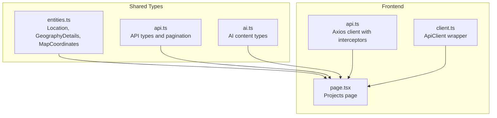
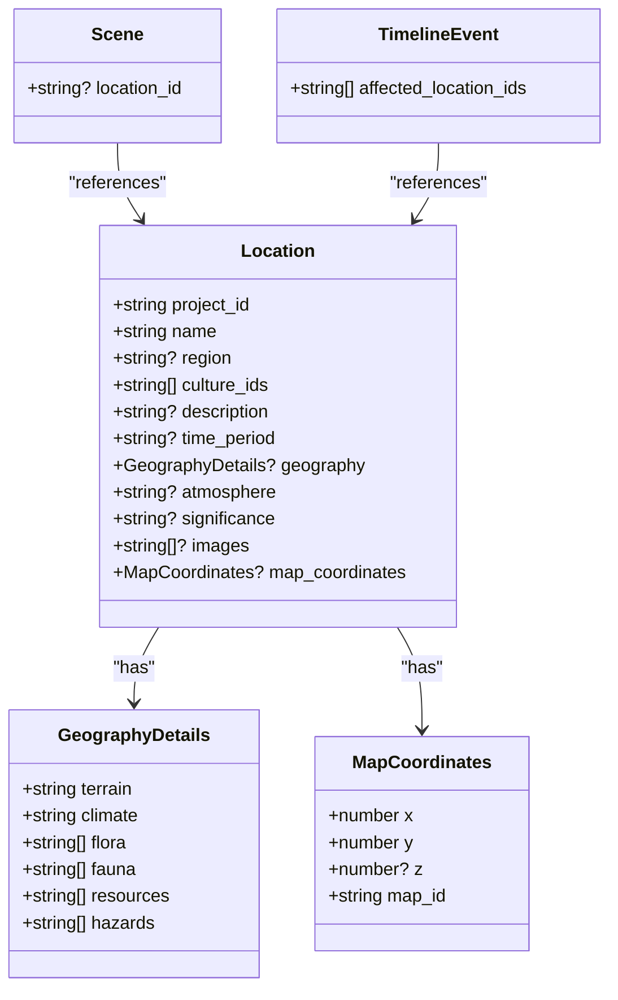
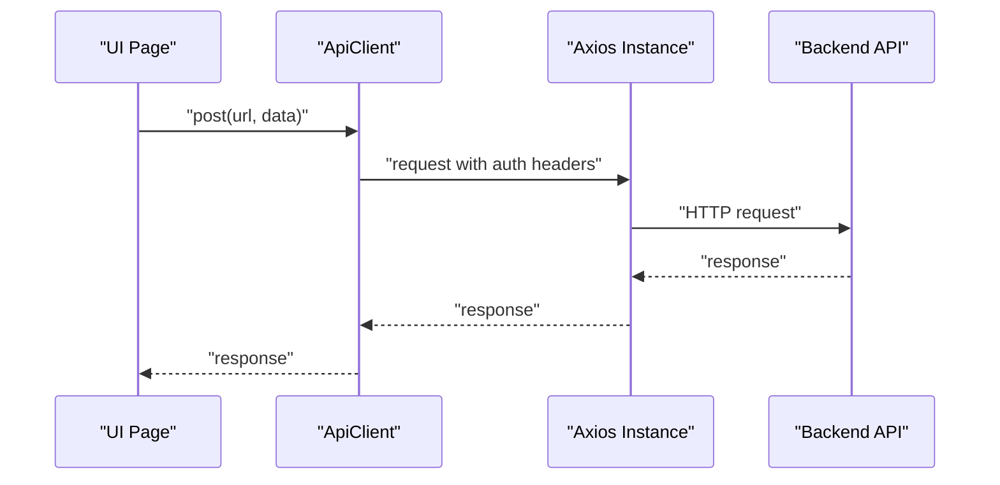
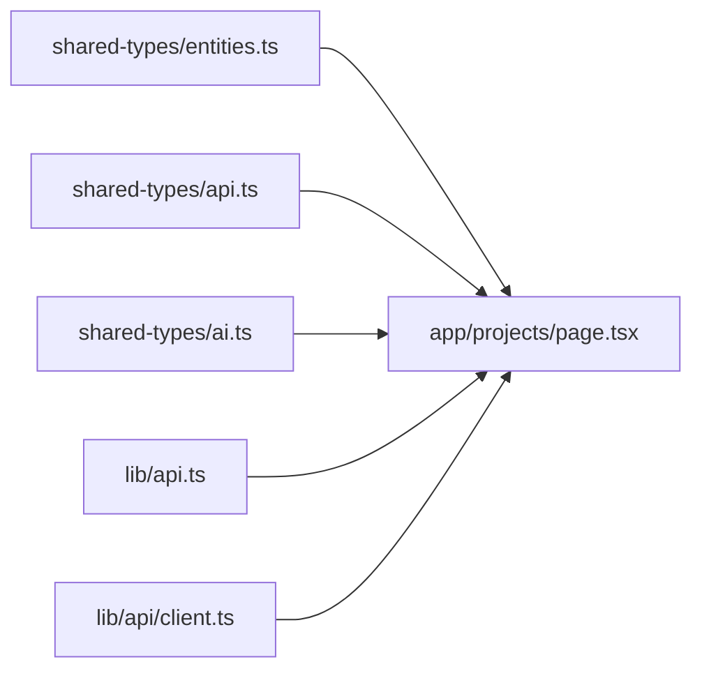
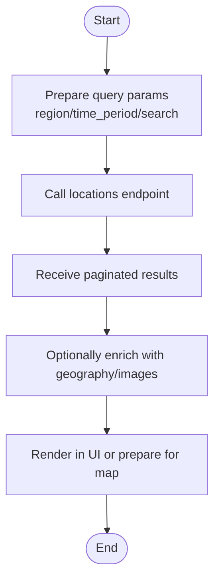

# Geographic Mapping & Locations

<cite>
**Referenced Files in This Document**
- [entities.ts](file://packages/shared-types/src/entities.ts)
- [api.ts](file://packages/shared-types/src/api.ts)
- [ai.ts](file://packages/shared-types/src/ai.ts)
- [api.ts](file://src/lib/api.ts)
- [client.ts](file://src/lib/api/client.ts)
- [page.tsx](file://src/app/projects/page.tsx)
</cite>

## Table of Contents
1. [Introduction](#introduction)
2. [Project Structure](#project-structure)
3. [Core Components](#core-components)
4. [Architecture Overview](#architecture-overview)
5. [Detailed Component Analysis](#detailed-component-analysis)
6. [Dependency Analysis](#dependency-analysis)
7. [Performance Considerations](#performance-considerations)
8. [Troubleshooting Guide](#troubleshooting-guide)
9. [Conclusion](#conclusion)
10. [Appendices](#appendices)

## Introduction
This document explains the geographic mapping and location management system in the platform. It covers the Location entity, GeographyDetails, and MapCoordinates, and shows how they integrate with narrative content. It also documents workflows for creating and organizing locations, modeling geographic features, handling map coordinates, and preparing for visualization and search. The goal is to make geographic worldbuilding accessible to beginners while providing the technical depth needed by developers.

## Project Structure
The geographic domain is defined in a shared package and consumed by the frontend application. Key areas:
- Shared types define the Location entity, GeographyDetails, and MapCoordinates used across the platform.
- API clients and interceptors enable authenticated requests to the backend.
- Frontend pages demonstrate how geographic data integrates with narrative features like Scenes and Events.

**Diagram sources**
- [entities.ts](file://packages/shared-types/src/entities.ts#L149-L178)
- [api.ts](file://packages/shared-types/src/api.ts#L1-L65)
- [ai.ts](file://packages/shared-types/src/ai.ts#L1-L360)
- [page.tsx](file://src/app/projects/page.tsx#L1-L394)
- [api.ts](file://src/lib/api.ts#L1-L67)
- [client.ts](file://src/lib/api/client.ts#L1-L138)

**Section sources**
- [entities.ts](file://packages/shared-types/src/entities.ts#L149-L178)
- [api.ts](file://packages/shared-types/src/api.ts#L1-L65)
- [ai.ts](file://packages/shared-types/src/ai.ts#L1-L360)
- [page.tsx](file://src/app/projects/page.tsx#L1-L394)
- [api.ts](file://src/lib/api.ts#L1-L67)
- [client.ts](file://src/lib/api/client.ts#L1-L138)

## Core Components
- Location: Represents a place within a project, optionally linked to culture IDs, time period, description, atmosphere, significance, images, and map coordinates. It embeds GeographyDetails for terrain, climate, flora, fauna, resources, and hazards.
- GeographyDetails: Describes the environmental and resource profile of a location.
- MapCoordinates: Encodes spatial position with optional elevation and a map identifier.

These types are foundational for modeling places, their environments, and their spatial placement.

**Section sources**
- [entities.ts](file://packages/shared-types/src/entities.ts#L149-L178)

## Architecture Overview
The geographic model is part of the broader worldbuilding domain. Locations connect to narrative content via Scenes and Events, enabling geographic search and visualization downstream.

**Diagram sources**
- [entities.ts](file://packages/shared-types/src/entities.ts#L149-L178)
- [entities.ts](file://packages/shared-types/src/entities.ts#L263-L294)

**Section sources**
- [entities.ts](file://packages/shared-types/src/entities.ts#L149-L178)
- [entities.ts](file://packages/shared-types/src/entities.ts#L263-L294)

## Detailed Component Analysis

### Location Entity
- Purpose: A place within a project with optional cultural, temporal, and geographic attributes.
- Key fields:
  - project_id: Ownership and scoping.
  - name, region, culture_ids, time_period, description, atmosphere, significance, images.
  - geography: Optional GeographyDetails.
  - map_coordinates: Optional MapCoordinates for spatial placement.
- Integration: Linked to Scenes via location_id and to TimelineEvents via affected_location_ids.

Practical usage patterns:
- Create a Location with minimal fields and enrich later with GeographyDetails and map_coordinates.
- Use region to group related locations for regional organization.
- Attach culture_ids to reflect local societies.

**Section sources**
- [entities.ts](file://packages/shared-types/src/entities.ts#L149-L162)
- [entities.ts](file://packages/shared-types/src/entities.ts#L65-L66)
- [entities.ts](file://packages/shared-types/src/entities.ts#L291-L292)

### GeographyDetails
- Purpose: Describe the natural and resource profile of a Location.
- Fields:
  - terrain, climate
  - flora, fauna, resources, hazards
- Modeling guidance:
  - Keep lists concise but evocative.
  - Use hazards to encode environmental risks affecting narrative tension.
  - Align resources with economic systems modeled elsewhere.

**Section sources**
- [entities.ts](file://packages/shared-types/src/entities.ts#L164-L171)

### MapCoordinates
- Purpose: Encode spatial position for potential map visualization and coordinate-based queries.
- Fields:
  - x, y, optional z (elevation), map_id (map identifier)
- Coordinate handling:
  - Use consistent units and origin conventions across maps.
  - Consider projection implications if moving to geographic coordinates later.
- Regional boundaries:
  - map_id can separate distinct maps or regions.
  - Combine with region to organize at multiple scales.

**Section sources**
- [entities.ts](file://packages/shared-types/src/entities.ts#L173-L178)

### Narrative Integration
- Scenes reference locations via location_id, enabling geographic storytelling and filtering.
- TimelineEvents reference locations via affected_location_ids, supporting historical and event-driven geography.

**Section sources**
- [entities.ts](file://packages/shared-types/src/entities.ts#L65-L66)
- [entities.ts](file://packages/shared-types/src/entities.ts#L291-L292)

### API and Client Integration
- The frontend uses Axios-based clients to communicate with the backend, handling authentication and error responses.
- These clients can be extended to support geographic endpoints (e.g., list locations by region, search by coordinates, bulk operations).

**Diagram sources**
- [client.ts](file://src/lib/api/client.ts#L1-L138)
- [api.ts](file://src/lib/api.ts#L1-L67)

**Section sources**
- [client.ts](file://src/lib/api/client.ts#L1-L138)
- [api.ts](file://src/lib/api.ts#L1-L67)

## Dependency Analysis
- Shared types define the canonical Location, GeographyDetails, and MapCoordinates interfaces.
- API types and AI content types describe request/response contracts and AI-assisted content generation.
- Frontend pages consume these types and integrate with API clients.

**Diagram sources**
- [entities.ts](file://packages/shared-types/src/entities.ts#L149-L178)
- [api.ts](file://packages/shared-types/src/api.ts#L1-L65)
- [ai.ts](file://packages/shared-types/src/ai.ts#L1-L360)
- [page.tsx](file://src/app/projects/page.tsx#L1-L394)
- [api.ts](file://src/lib/api.ts#L1-L67)
- [client.ts](file://src/lib/api/client.ts#L1-L138)

**Section sources**
- [entities.ts](file://packages/shared-types/src/entities.ts#L149-L178)
- [api.ts](file://packages/shared-types/src/api.ts#L1-L65)
- [ai.ts](file://packages/shared-types/src/ai.ts#L1-L360)
- [page.tsx](file://src/app/projects/page.tsx#L1-L394)
- [api.ts](file://src/lib/api.ts#L1-L67)
- [client.ts](file://src/lib/api/client.ts#L1-L138)

## Performance Considerations
- Data transfer: Keep Location payloads lean by conditionally loading geography and images only when needed.
- Pagination: Use pagination parameters for listing locations and related geographic data.
- Caching: Consider caching frequently accessed geographic summaries to reduce network load.
- Computation: Offload heavy geographic computations (e.g., proximity queries) to the backend.

[No sources needed since this section provides general guidance]

## Troubleshooting Guide
- Authentication failures: Both API clients handle 401 responses by attempting token refresh or redirecting to login. Inspect error responses for consistent handling.
- Error shaping: The client transforms responses to a standardized ApiError shape for easier handling.
- Network retries: The client sets timeouts and can retry requests after refreshing tokens.

**Section sources**
- [client.ts](file://src/lib/api/client.ts#L37-L80)
- [api.ts](file://src/lib/api.ts#L24-L65)

## Conclusion
The geographic mapping system centers on the Location entity enriched with GeographyDetails and MapCoordinates. These types integrate naturally with narrative constructs like Scenes and TimelineEvents, enabling geographic storytelling and search. The shared-type contracts ensure consistency across the frontend and backend, while the API clients provide robust transport and error handling. Extending the system to support map visualization and coordinate-based queries involves adding backend endpoints and UI components aligned with these contracts.

[No sources needed since this section summarizes without analyzing specific files]

## Appendices

### Practical Workflows

- Create a Location
  - Initialize with project_id, name, and optional region.
  - Optionally attach culture_ids and time_period.
  - Reference: [Location interface](file://packages/shared-types/src/entities.ts#L150-L162)

- Add Geographic Details
  - Populate GeographyDetails with terrain, climate, flora, fauna, resources, and hazards.
  - Reference: [GeographyDetails interface](file://packages/shared-types/src/entities.ts#L164-L171)

- Assign Map Coordinates
  - Set x, y, optional z, and map_id for spatial placement.
  - Reference: [MapCoordinates interface](file://packages/shared-types/src/entities.ts#L173-L178)

- Integrate with Narrative Content
  - Link Scenes via location_id.
  - Reference: [Scene location_id](file://packages/shared-types/src/entities.ts#L65-L66)
  - Reference TimelineEvents via affected_location_ids for geographic impact.
  - Reference: [TimelineEvent affected_location_ids](file://packages/shared-types/src/entities.ts#L291-L292)

- Geographic Search and Filtering
  - Use API pagination and filter parameters to query locations by region, time period, or keywords.
  - Reference: [Pagination and filter types](file://packages/shared-types/src/api.ts#L30-L47)

- AI-Assisted Geographic Content
  - Leverage AI content types for generating or summarizing location descriptions.
  - Reference: [AI content types](file://packages/shared-types/src/ai.ts#L1-L360)

### Coordinate-Based Queries Flow

[No sources needed since this diagram shows conceptual workflow, not actual code structure]