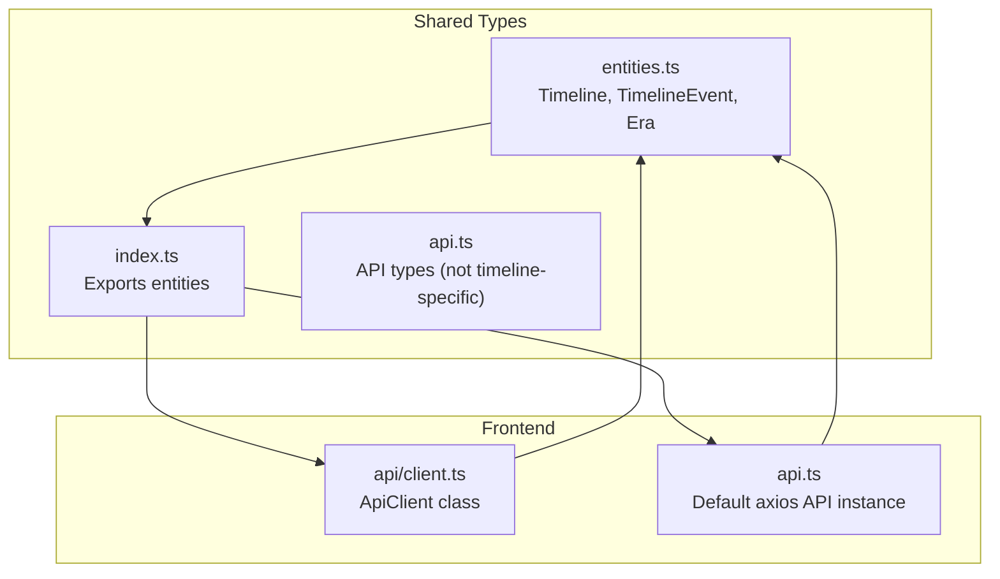
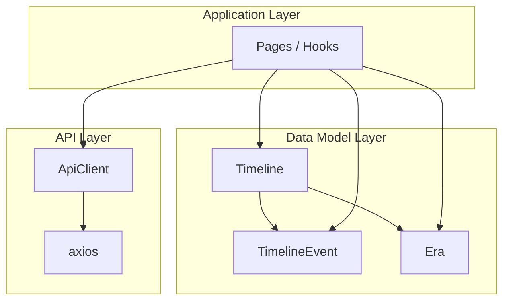
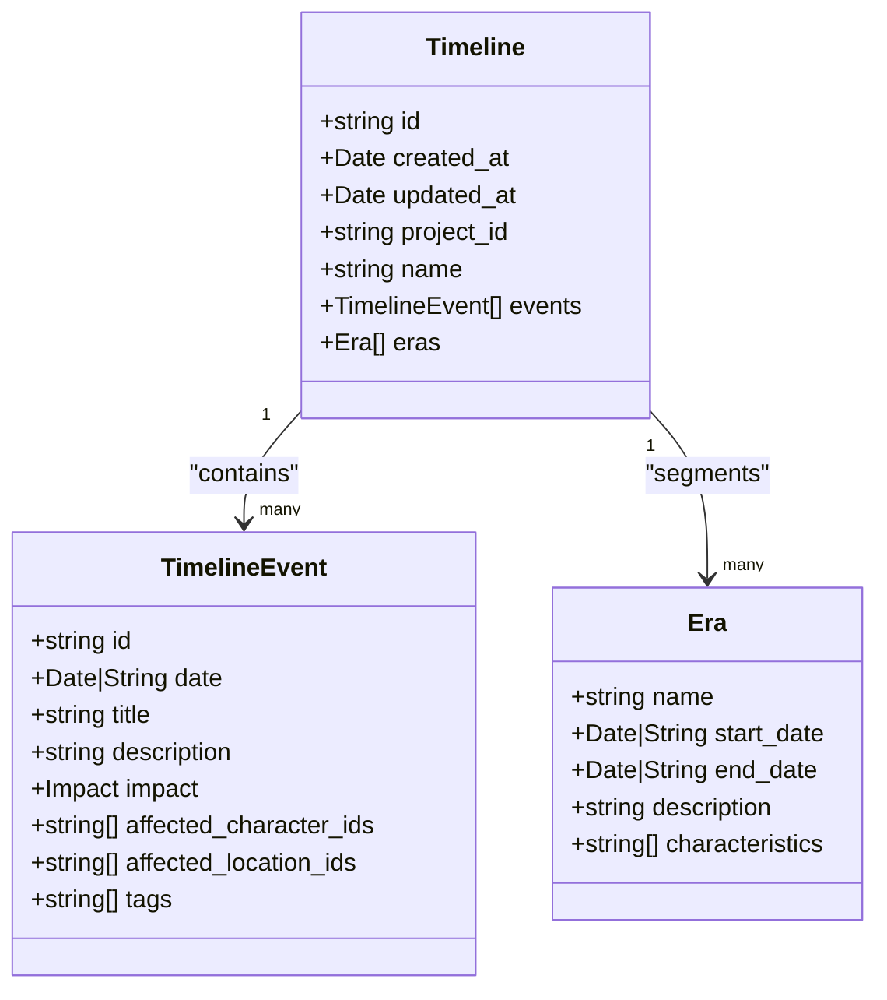
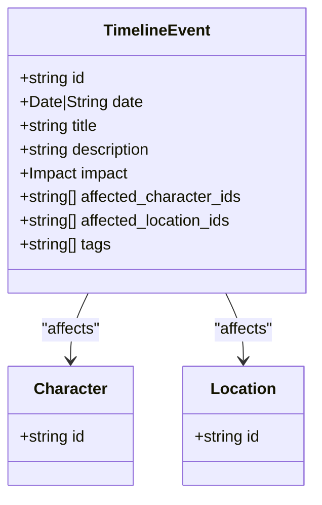
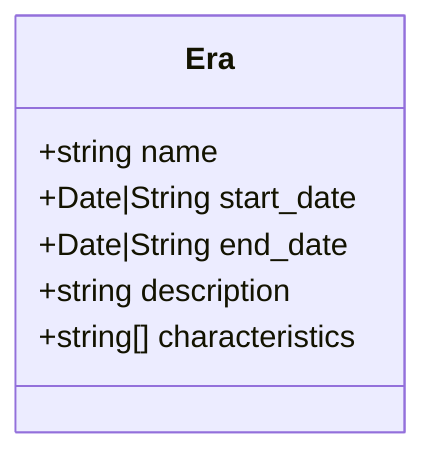
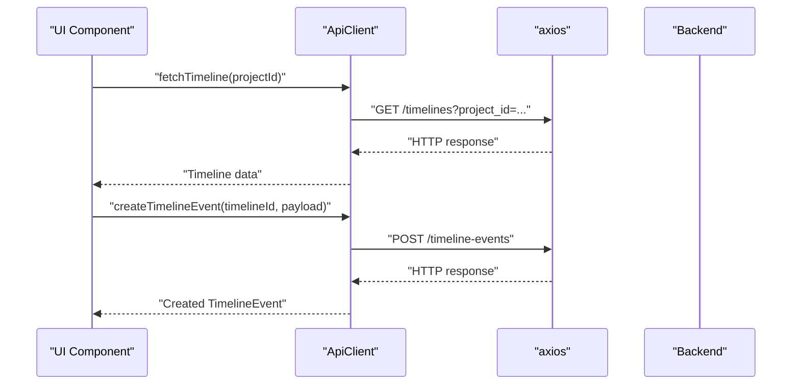
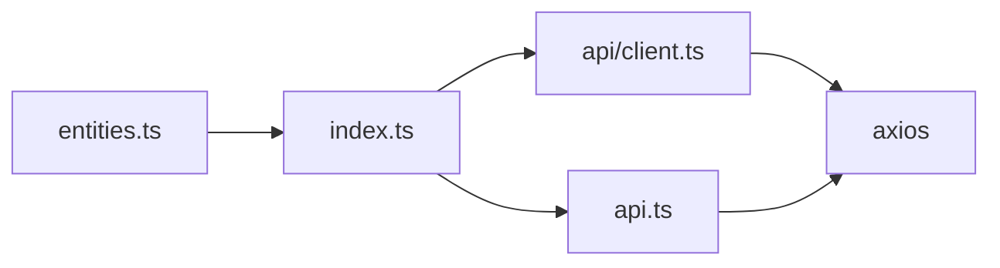
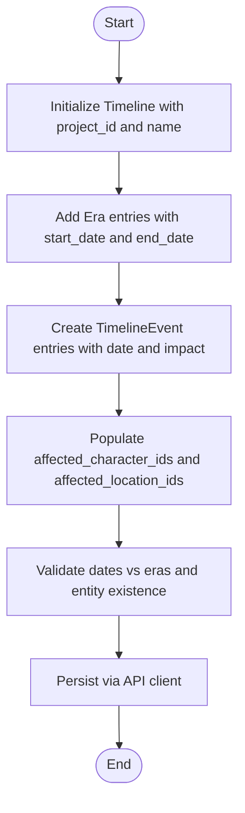

# Historical Timeline & Events

<cite>
**Referenced Files in This Document**
- [entities.ts](file://packages/shared-types/src/entities.ts)
- [index.ts](file://packages/shared-types/src/index.ts)
- [api.ts](file://packages/shared-types/src/api.ts)
- [client.ts](file://src/lib/api/client.ts)
- [api.ts](file://src/lib/api.ts)
- [IMPLEMENTATION_PLAN.md](file://IMPLEMENTATION_PLAN.md)
- [START_HERE.md](file://START_HERE.md)
</cite>

## Table of Contents
1. [Introduction](#introduction)
2. [Project Structure](#project-structure)
3. [Core Components](#core-components)
4. [Architecture Overview](#architecture-overview)
5. [Detailed Component Analysis](#detailed-component-analysis)
6. [Dependency Analysis](#dependency-analysis)
7. [Performance Considerations](#performance-considerations)
8. [Troubleshooting Guide](#troubleshooting-guide)
9. [Conclusion](#conclusion)
10. [Appendices](#appendices)

## Introduction
This document explains the historical timeline and event management system for the WorldBest platform. It focuses on the Timeline entity model, TimelineEvent interface, and the Era definition system. It also covers date handling, impact assessment, affected entity relationships, era creation, and temporal documentation. Practical examples demonstrate creating timelines, managing chronological events, linking events to characters and locations, and navigating timelines. Additional guidance addresses timeline consistency checks, impact tracking, and historical accuracy validation. The content is designed to be accessible to beginners while providing sufficient technical depth for experienced developers.

## Project Structure
The timeline and event management system is defined in the shared types package and consumed by the frontend application. The shared types define the canonical data models, while the frontend provides API clients and runtime usage patterns.

**Diagram sources**
- [entities.ts](file://packages/shared-types/src/entities.ts#L278-L302)
- [index.ts](file://packages/shared-types/src/index.ts#L1-L7)
- [client.ts](file://src/lib/api/client.ts#L1-L138)
- [api.ts](file://src/lib/api.ts#L1-L67)

**Section sources**
- [entities.ts](file://packages/shared-types/src/entities.ts#L278-L302)
- [index.ts](file://packages/shared-types/src/index.ts#L1-L7)
- [client.ts](file://src/lib/api/client.ts#L1-L138)
- [api.ts](file://src/lib/api.ts#L1-L67)

## Core Components
This section documents the primary data structures that underpin the timeline system.

- Timeline
  - Purpose: Groups events and eras within a project context.
  - Key fields:
    - project_id: Links the timeline to a project.
    - name: Human-readable identifier.
    - events: Ordered collection of TimelineEvent entries.
    - eras: Periodic segments that contextualize events temporally.

- TimelineEvent
  - Purpose: Represents a single historical occurrence.
  - Key fields:
    - id: Unique identifier.
    - date: Date or ISO string representing the event’s timing.
    - title: Short headline.
    - description: Narrative details.
    - impact: Qualitative severity ('minor' | 'moderate' | 'major').
    - affected_character_ids: Character identifiers linked to the event.
    - affected_location_ids: Location identifiers linked to the event.
    - tags: Free-form categorization for filtering and discovery.

- Era
  - Purpose: Defines a historical period with start and optional end dates.
  - Key fields:
    - name: Title of the era.
    - start_date: Start date or ISO string.
    - end_date: Optional end date or ISO string.
    - description: Narrative summary of the era.
    - characteristics: List of traits or themes associated with the era.

Temporal handling
- Dates are modeled as either Date objects or ISO strings. This dual representation supports flexible serialization and deserialization across network boundaries and storage layers.

Impact assessment
- The impact field enables coarse-grained prioritization of events for dashboards, filters, and downstream analytics.

Affected entity relationships
- Events link to characters and locations via arrays of identifiers. These references enable cross-referencing and filtering without embedding full entity data.

Practical usage patterns
- Create a Timeline with a project_id and initial name.
- Add TimelineEvent entries with appropriate dates and impact levels.
- Define Era entries to segment the timeline into meaningful periods.
- Link events to characters and locations using affected_*_ids arrays.

**Section sources**
- [entities.ts](file://packages/shared-types/src/entities.ts#L278-L302)

## Architecture Overview
The timeline system follows a clean separation of concerns:
- Shared data models live in the shared-types package.
- Frontend API clients encapsulate HTTP interactions and authentication.
- Consumers (pages, hooks, services) import the shared types and use the API clients to manage timelines.

**Diagram sources**
- [entities.ts](file://packages/shared-types/src/entities.ts#L278-L302)
- [client.ts](file://src/lib/api/client.ts#L1-L138)

**Section sources**
- [entities.ts](file://packages/shared-types/src/entities.ts#L278-L302)
- [client.ts](file://src/lib/api/client.ts#L1-L138)

## Detailed Component Analysis

### Timeline Entity
The Timeline entity aggregates events and eras for a given project. It ensures that all temporal data is scoped to a project and ordered via the events array.

**Diagram sources**
- [entities.ts](file://packages/shared-types/src/entities.ts#L278-L302)

**Section sources**
- [entities.ts](file://packages/shared-types/src/entities.ts#L278-L302)

### TimelineEvent Interface
TimelineEvent captures the who, what, when, and impact of a historical moment. It links to characters and locations via identifier arrays, enabling flexible queries and filtering.

**Diagram sources**
- [entities.ts](file://packages/shared-types/src/entities.ts#L285-L294)

**Section sources**
- [entities.ts](file://packages/shared-types/src/entities.ts#L285-L294)

### Era Definition System
Eras provide narrative and analytical scaffolding for the timeline. They define temporal bounds and thematic characteristics.

**Diagram sources**
- [entities.ts](file://packages/shared-types/src/entities.ts#L296-L302)

**Section sources**
- [entities.ts](file://packages/shared-types/src/entities.ts#L296-L302)

### API Integration Pattern
Frontend consumers use an API client to fetch, create, update, and delete timeline resources. The client handles authentication and error normalization.

**Diagram sources**
- [client.ts](file://src/lib/api/client.ts#L83-L101)

**Section sources**
- [client.ts](file://src/lib/api/client.ts#L1-L138)

### Practical Examples

- Creating a historical timeline
  - Steps:
    - Initialize a Timeline with project_id and name.
    - Optionally pre-seed with Era entries to establish periods.
    - Save the Timeline to the backend via the API client.
  - Reference: [Timeline interface](file://packages/shared-types/src/entities.ts#L278-L283)

- Managing chronological events
  - Steps:
    - Create TimelineEvent entries with accurate dates and impact levels.
    - Maintain the events array in chronological order.
    - Use tags for categorization and filtering.
  - Reference: [TimelineEvent interface](file://packages/shared-types/src/entities.ts#L285-L294)

- Linking events to characters and locations
  - Steps:
    - Populate affected_character_ids and affected_location_ids with valid identifiers.
    - Ensure referenced entities exist in the project’s database.
  - Reference: [TimelineEvent interface](file://packages/shared-types/src/entities.ts#L285-L294)

- Timeline navigation and filtering
  - Navigation:
    - Sort events by date to render a chronological view.
    - Group events by era for high-level browsing.
  - Filtering:
    - Filter by tags, impact severity, or affected entity ids.
  - Reference: [TimelineEvent tags and impact](file://packages/shared-types/src/entities.ts#L285-L294), [Era segmentation](file://packages/shared-types/src/entities.ts#L296-L302)

- Temporal analysis
  - Compute duration between eras.
  - Aggregate event counts by era or tag.
  - Identify clusters of high-impact events.

- Consistency checking
  - Verify that event dates fall within era bounds.
  - Ensure no overlapping eras with conflicting dates.
  - Confirm that affected entity ids correspond to existing entities.

- Impact tracking and historical accuracy validation
  - Use impact levels to weight downstream analytics.
  - Cross-reference events against known historical facts or project settings.
  - Maintain audit trails for timeline edits.

**Section sources**
- [entities.ts](file://packages/shared-types/src/entities.ts#L278-L302)

## Dependency Analysis
The frontend depends on shared types for canonical models and on API clients for HTTP operations.

**Diagram sources**
- [entities.ts](file://packages/shared-types/src/entities.ts#L278-L302)
- [index.ts](file://packages/shared-types/src/index.ts#L1-L7)
- [client.ts](file://src/lib/api/client.ts#L1-L138)
- [api.ts](file://src/lib/api.ts#L1-L67)

**Section sources**
- [entities.ts](file://packages/shared-types/src/entities.ts#L278-L302)
- [index.ts](file://packages/shared-types/src/index.ts#L1-L7)
- [client.ts](file://src/lib/api/client.ts#L1-L138)
- [api.ts](file://src/lib/api.ts#L1-L67)

## Performance Considerations
- Prefer ISO string dates for transport to avoid timezone serialization pitfalls.
- Paginate timeline loads when events count grows large.
- Cache frequently accessed eras and character/location metadata.
- Use efficient sorting and filtering on the client side after fetching minimal payloads.
- Batch operations for bulk updates to reduce network overhead.

## Troubleshooting Guide
Common issues and resolutions:
- Unauthorized requests
  - Symptom: 401 responses when calling timeline endpoints.
  - Resolution: Ensure the API client attaches a valid bearer token. The client attempts token refresh on 401; if it fails, re-authenticate the user.
  - References: [ApiClient interceptors](file://src/lib/api/client.ts#L18-L81), [Default API instance interceptors](file://src/lib/api.ts#L10-L65)

- Timeline slippage and feature delivery
  - The implementation plan indicates timeline slippage risks and mitigation strategies. Use buffered schedules and weekly reviews to keep timeline features on track.
  - References: [Implementation plan risks](file://EXECUTION_SUMMARY.md#L217-L243), [Timeline estimate](file://IMPLEMENTATION_PLAN.md#L1085-L1123), [Critical path](file://START_HERE.md#L314-L351)

- Data model alignment
  - Ensure that TimelineEvent.date and Era.start_date/end_date are consistently formatted as Date objects or ISO strings across the stack.
  - Validate that affected_character_ids and affected_location_ids match existing entity ids.

**Section sources**
- [client.ts](file://src/lib/api/client.ts#L18-L81)
- [api.ts](file://src/lib/api.ts#L10-L65)
- [EXECUTION_SUMMARY.md](file://EXECUTION_SUMMARY.md#L217-L243)
- [IMPLEMENTATION_PLAN.md](file://IMPLEMENTATION_PLAN.md#L1085-L1123)
- [START_HERE.md](file://START_HERE.md#L314-L351)

## Conclusion
The timeline and event management system centers on three core types: Timeline, TimelineEvent, and Era. Together, they support chronological storytelling, era-based segmentation, and cross-entity linking. The shared types package ensures consistent models across the frontend and backend, while the API client provides robust HTTP interactions with authentication and error handling. By following the practical examples and troubleshooting guidance, teams can implement reliable timeline features, maintain consistency, and deliver accurate historical narratives.

## Appendices

### Appendix A: Timeline Creation Workflow

[No sources needed since this diagram shows conceptual workflow, not actual code structure]