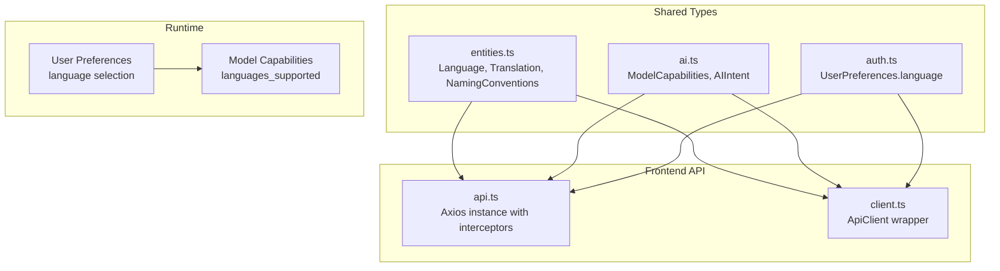
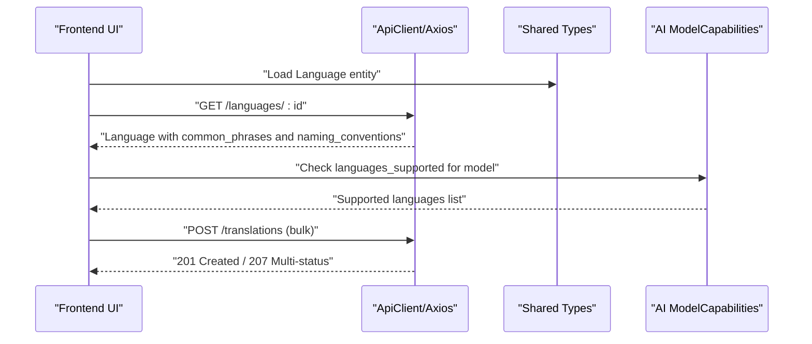
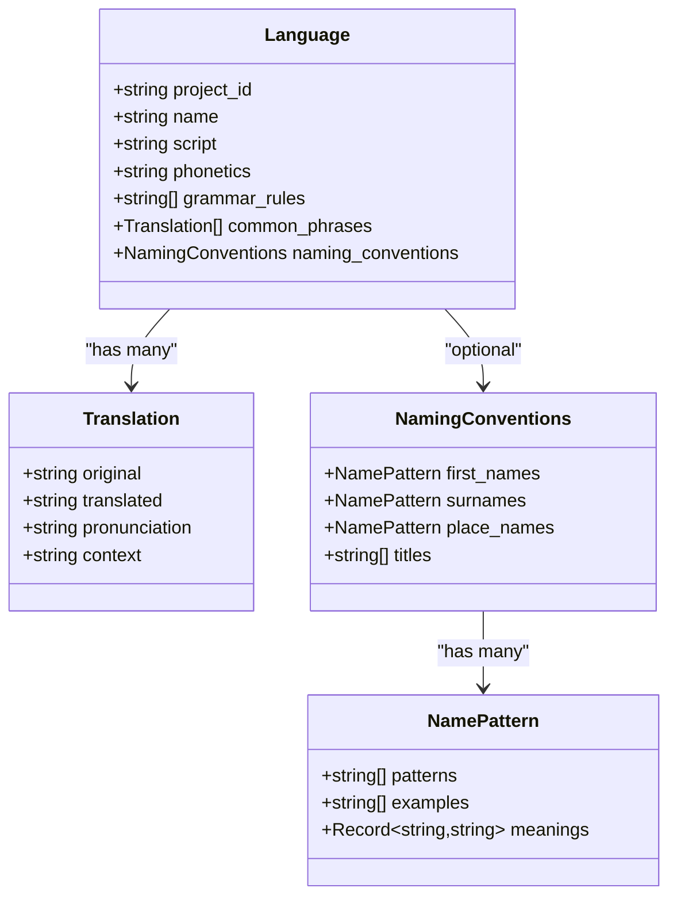
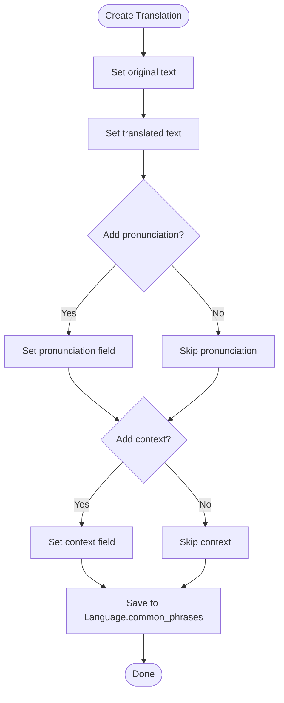
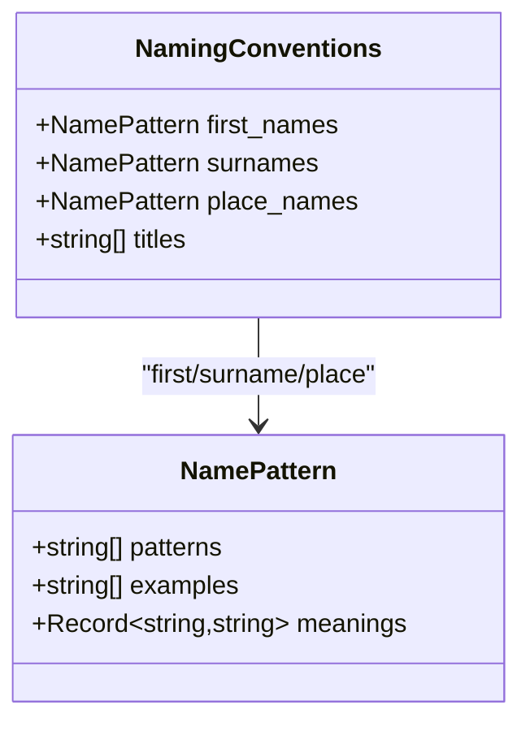
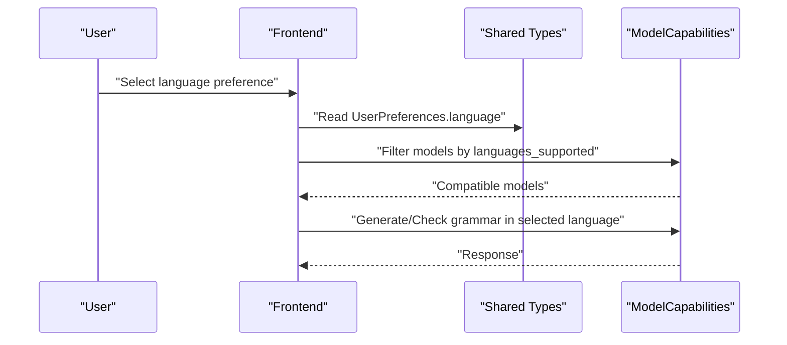
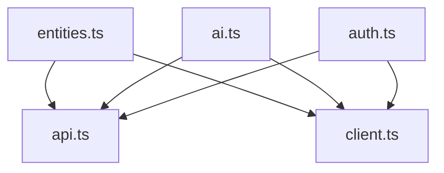

# Language & Communication

<cite>
**Referenced Files in This Document**
- [entities.ts](file://packages/shared-types/src/entities.ts)
- [ai.ts](file://packages/shared-types/src/ai.ts)
- [auth.ts](file://packages/shared-types/src/auth.ts)
- [api.ts](file://src/lib/api.ts)
- [client.ts](file://src/lib/api/client.ts)
- [README.md](file://README.md)
- [EXECUTIVE_SUMMARY.md](file://EXECUTIVE_SUMMARY.md)
- [DEPLOYMENT.md](file://DEPLOYMENT.md)
</cite>

## Table of Contents
1. [Introduction](#introduction)
2. [Project Structure](#project-structure)
3. [Core Components](#core-components)
4. [Architecture Overview](#architecture-overview)
5. [Detailed Component Analysis](#detailed-component-analysis)
6. [Dependency Analysis](#dependency-analysis)
7. [Performance Considerations](#performance-considerations)
8. [Troubleshooting Guide](#troubleshooting-guide)
9. [Conclusion](#conclusion)
10. [Appendices](#appendices)

## Introduction
This document explains the language and communication system for the platform, focusing on the Language entity, translation structures, and naming convention modeling. It also documents how translation dictionaries are represented, how pronunciation and context are modeled, and how naming patterns apply to people, places, and titles. Practical guidance is included for creating languages, managing translation dictionaries, and implementing naming systems. Additional topics include phonetic systems, grammar rule documentation, linguistic evolution tracking, multilingual support, translation consistency, and language-based narrative elements.

## Project Structure
The language and communication system is primarily defined in shared types and integrated with the frontend API layer. The key elements are:
- Language entity definition and relationships
- Translation dictionary structure
- Naming convention patterns
- AI capabilities supporting multilingual generation and grammar checks
- Authentication and preferences affecting language usage
- Frontend API clients for network operations

**Diagram sources**
- [entities.ts](file://packages/shared-types/src/entities.ts#L210-L238)
- [ai.ts](file://packages/shared-types/src/ai.ts#L228-L237)
- [auth.ts](file://packages/shared-types/src/auth.ts#L21-L28)
- [api.ts](file://src/lib/api.ts#L1-L67)
- [client.ts](file://src/lib/api/client.ts#L1-L138)

**Section sources**
- [entities.ts](file://packages/shared-types/src/entities.ts#L210-L238)
- [ai.ts](file://packages/shared-types/src/ai.ts#L228-L237)
- [auth.ts](file://packages/shared-types/src/auth.ts#L21-L28)
- [api.ts](file://src/lib/api.ts#L1-L67)
- [client.ts](file://src/lib/api/client.ts#L1-L138)

## Core Components
- Language: Represents a constructed or natural language with optional script, phonetics, grammar rules, common phrases, and naming conventions.
- Translation: A dictionary entry capturing original text, translated text, optional pronunciation guide, and optional context.
- NamingConventions: Defines patterns for first names, surnames, place names, and titles, including pattern templates and example outputs.
- NamePattern: Holds pattern templates, example outputs, and optional meaning mappings for deeper cultural insight.
- AI ModelCapabilities: Includes a list of supported languages for multilingual generation and grammar checking.
- UserPreferences.language: Allows users to select a default language impacting UI and potentially generation preferences.

Practical implications:
- Languages can be associated with cultures and projects.
- Translation dictionaries enable consistent phrase usage across contexts.
- Naming conventions support coherent naming systems for characters, locations, and titles.
- AI models can be selected based on language support for generation and grammar checks.

**Section sources**
- [entities.ts](file://packages/shared-types/src/entities.ts#L210-L238)
- [ai.ts](file://packages/shared-types/src/ai.ts#L228-L237)
- [auth.ts](file://packages/shared-types/src/auth.ts#L21-L28)

## Architecture Overview
The language and communication system spans shared domain models and frontend networking. The frontend uses Axios-based clients to communicate with the backend, while the shared types define the Language, Translation, and NamingConventions structures. AI model capabilities inform language-aware generation and grammar checking.

**Diagram sources**
- [entities.ts](file://packages/shared-types/src/entities.ts#L210-L238)
- [ai.ts](file://packages/shared-types/src/ai.ts#L228-L237)
- [client.ts](file://src/lib/api/client.ts#L83-L101)

## Detailed Component Analysis

### Language Entity
The Language entity encapsulates:
- Identity and association: project_id, name
- Script and phonetics: optional fields for writing system and sound system
- Grammar rules: array of rule identifiers or descriptions
- Common phrases: array of Translation entries
- Naming conventions: optional NamingConventions for names, places, and titles

**Diagram sources**
- [entities.ts](file://packages/shared-types/src/entities.ts#L210-L238)

**Section sources**
- [entities.ts](file://packages/shared-types/src/entities.ts#L210-L238)

### Translation Dictionary
The Translation interface models:
- original: source text
- translated: target text
- pronunciation: optional phonetic guide
- context: optional situational or cultural context

Translation dictionaries are stored within Language.common_phrases and can be managed via API endpoints. They support multilingual generation and grammar checks when paired with AI models that declare supported languages.

**Diagram sources**
- [entities.ts](file://packages/shared-types/src/entities.ts#L220-L225)

**Section sources**
- [entities.ts](file://packages/shared-types/src/entities.ts#L220-L225)

### Naming Convention Patterns
NamingConventions defines:
- first_names: NamePattern
- surnames: NamePattern
- place_names: NamePattern
- titles: string[]

NamePattern includes:
- patterns: template strings for generating names
- examples: representative generated names
- meanings: optional mapping of pattern components to cultural meanings

**Diagram sources**
- [entities.ts](file://packages/shared-types/src/entities.ts#L227-L238)

**Section sources**
- [entities.ts](file://packages/shared-types/src/entities.ts#L227-L238)

### Multilingual Support and Grammar Checks
AI ModelCapabilities exposes languages_supported, enabling selection of models that support the desired language for generation and grammar checks. UserPreferences.language allows users to set a default language, which can influence generation prompts and grammar checks.

**Diagram sources**
- [ai.ts](file://packages/shared-types/src/ai.ts#L228-L237)
- [auth.ts](file://packages/shared-types/src/auth.ts#L21-L28)

**Section sources**
- [ai.ts](file://packages/shared-types/src/ai.ts#L228-L237)
- [auth.ts](file://packages/shared-types/src/auth.ts#L21-L28)

### Practical Examples

- Creating a Language
  - Define Language with project_id, name, optional script and phonetics, grammar_rules, common_phrases, and naming_conventions.
  - Populate common_phrases with Translation entries for key phrases.
  - Define naming_conventions with NamePattern entries for first_names, surnames, place_names, and titles.

- Managing Translation Dictionaries
  - Add Translation entries to Language.common_phrases.
  - Use pronunciation to capture phonetic guidance.
  - Use context to annotate cultural or situational nuances.

- Implementing Naming Systems
  - Design NamePattern.patterns with template strings.
  - Provide NamePattern.examples for representative outputs.
  - Optionally map NamePattern.meanings for cultural interpretation.

- Integrating with AI
  - Choose models whose languages_supported align with the target language.
  - Use UserPreferences.language to set defaults for generation and grammar checks.

**Section sources**
- [entities.ts](file://packages/shared-types/src/entities.ts#L210-L238)
- [ai.ts](file://packages/shared-types/src/ai.ts#L228-L237)
- [auth.ts](file://packages/shared-types/src/auth.ts#L21-L28)

## Dependency Analysis
The frontend API clients depend on shared types for data contracts. AI model capabilities inform language-aware operations. Authentication preferences influence language defaults.

**Diagram sources**
- [entities.ts](file://packages/shared-types/src/entities.ts#L210-L238)
- [ai.ts](file://packages/shared-types/src/ai.ts#L228-L237)
- [auth.ts](file://packages/shared-types/src/auth.ts#L21-L28)
- [api.ts](file://src/lib/api.ts#L1-L67)
- [client.ts](file://src/lib/api/client.ts#L1-L138)

**Section sources**
- [entities.ts](file://packages/shared-types/src/entities.ts#L210-L238)
- [ai.ts](file://packages/shared-types/src/ai.ts#L228-L237)
- [auth.ts](file://packages/shared-types/src/auth.ts#L21-L28)
- [api.ts](file://src/lib/api.ts#L1-L67)
- [client.ts](file://src/lib/api/client.ts#L1-L138)

## Performance Considerations
- Keep Translation dictionaries concise and focused on high-frequency phrases to minimize payload sizes.
- Use NamePattern.patterns efficiently; avoid overly complex templates that increase generation time.
- Prefer model selection based on languages_supported to reduce retries and failures.
- Cache frequently accessed Language entities and their common_phrases to reduce network overhead.

## Troubleshooting Guide
- Authentication and Authorization
  - Ensure access tokens are present in local storage or cookies for protected endpoints.
  - Handle 401 responses by refreshing tokens and retrying requests.

- Network Layer
  - Use ApiClient for consistent request/response handling and error transformation.
  - Verify baseURL and environment variables for API connectivity.

- Language and Naming
  - Validate that Language.common_phrases and NamingConventions are populated before generation.
  - Confirm that AI models support the selected language via languages_supported.

**Section sources**
- [api.ts](file://src/lib/api.ts#L10-L65)
- [client.ts](file://src/lib/api/client.ts#L18-L81)
- [entities.ts](file://packages/shared-types/src/entities.ts#L210-L238)
- [ai.ts](file://packages/shared-types/src/ai.ts#L228-L237)

## Conclusion
The language and communication system centers on the Language entity, Translation dictionary, and NamingConventions, with strong ties to AI model capabilities and user preferences. By structuring languages with phonetics, grammar rules, and naming patterns, and by maintaining robust translation dictionaries, creators can achieve multilingual consistency and coherent narrative elements across characters, places, and titles.

## Appendices

### Deployment and Environment Notes
- The platform is configured for deployment on Vercel with Supabase backend.
- Environment variables for database and Supabase are required for runtime operation.

**Section sources**
- [README.md](file://README.md#L214-L238)
- [EXECUTIVE_SUMMARY.md](file://EXECUTIVE_SUMMARY.md#L140-L150)
- [DEPLOYMENT.md](file://DEPLOYMENT.md#L14-L34)