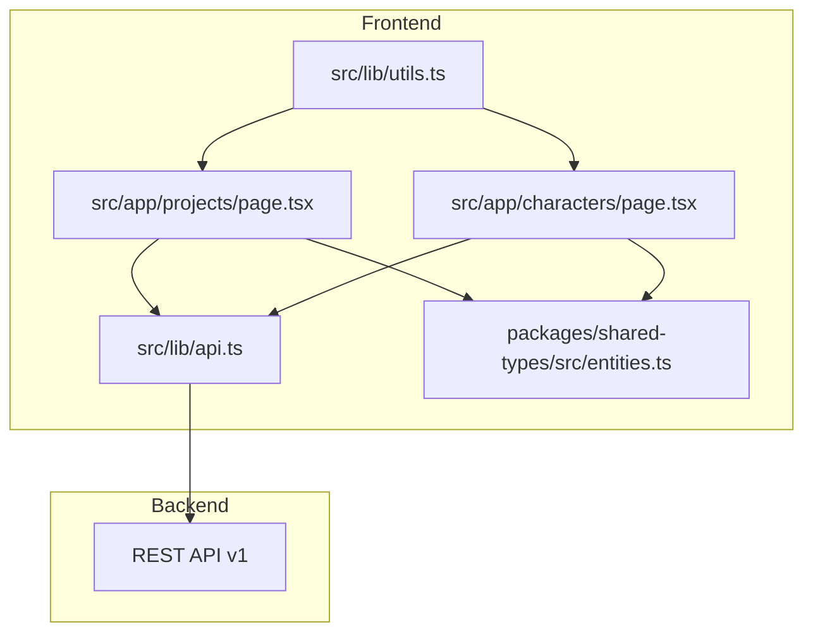
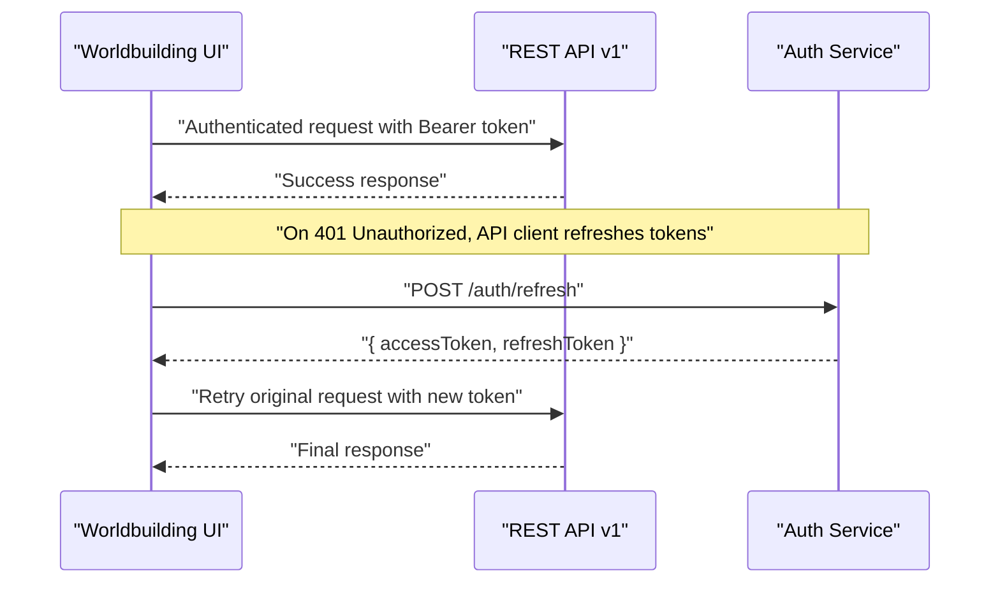
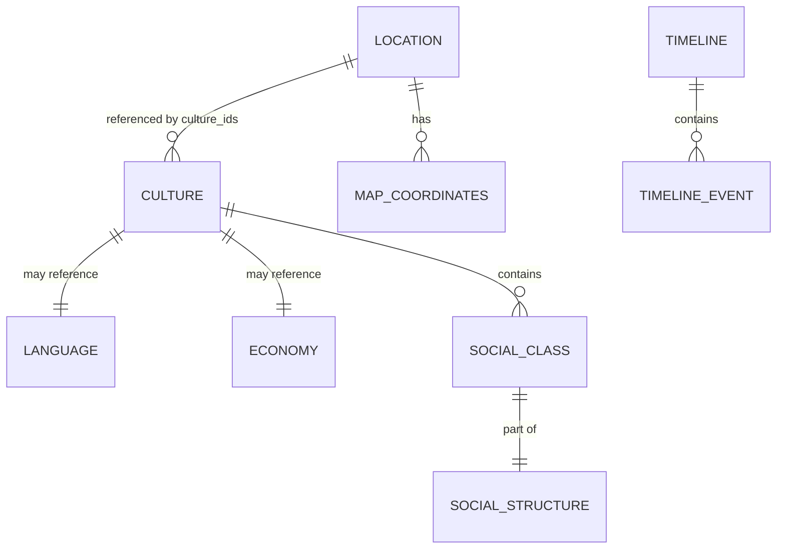
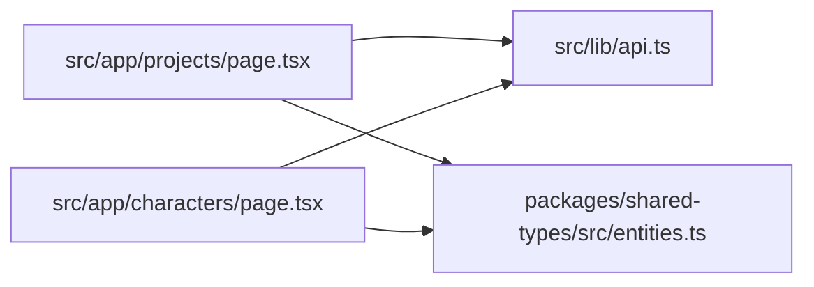

# Worldbuilding Tools

<cite>
**Referenced Files in This Document**
- [README.md](file://README.md)
- [EXECUTIVE_SUMMARY.md](file://EXECUTIVE_SUMMARY.md)
- [IMPLEMENTATION_PLAN.md](file://IMPLEMENTATION_PLAN.md)
- [DOCS_INDEX.md](file://DOCS_INDEX.md)
- [START_HERE.md](file://START_HERE.md)
- [src/app/projects/page.tsx](file://src/app/projects/page.tsx)
- [src/app/characters/page.tsx](file://src/app/characters/page.tsx)
- [src/lib/api.ts](file://src/lib/api.ts)
- [src/lib/utils.ts](file://src/lib/utils.ts)
- [packages/shared-types/src/entities.ts](file://packages/shared-types/src/entities.ts)
</cite>

## Table of Contents
1. [Introduction](#introduction)
2. [Project Structure](#project-structure)
3. [Core Components](#core-components)
4. [Architecture Overview](#architecture-overview)
5. [Detailed Component Analysis](#detailed-component-analysis)
6. [Dependency Analysis](#dependency-analysis)
7. [Performance Considerations](#performance-considerations)
8. [Troubleshooting Guide](#troubleshooting-guide)
9. [Conclusion](#conclusion)
10. [Appendices](#appendices)

## Introduction
This document explains the worldbuilding system for the AI-powered writing platform. It focuses on setting creation, location management, cultural modeling, timeline construction, and export capabilities. It also covers data models, geographic tools, economic modeling, and integration with narrative content. The content is designed to be accessible to beginners while providing sufficient technical depth for experienced developers.

## Project Structure
The worldbuilding system is part of a larger Next.js application with a modular structure:
- Pages and routes under src/app define the UI surfaces for projects, characters, and dashboards.
- Shared data models live in packages/shared-types for type safety across the frontend and backend.
- API client utilities centralize HTTP requests and authentication handling.
- Utility functions provide shared helpers for styling and composition.

**Diagram sources**
- [src/app/projects/page.tsx](file://src/app/projects/page.tsx#L1-L394)
- [src/app/characters/page.tsx](file://src/app/characters/page.tsx#L1-L512)
- [src/lib/api.ts](file://src/lib/api.ts#L1-L67)
- [src/lib/utils.ts](file://src/lib/utils.ts#L1-L6)
- [packages/shared-types/src/entities.ts](file://packages/shared-types/src/entities.ts#L150-L289)

**Section sources**
- [README.md](file://README.md#L73-L104)
- [DOCS_INDEX.md](file://DOCS_INDEX.md#L27-L46)

## Core Components
The worldbuilding system centers around three primary domains:
- Locations: Geographic and atmospheric details, with optional map coordinates and imagery.
- Cultures: Social structures, norms, rituals, values, taboos, languages, and economies.
- Timelines: Historical events organized by eras, enabling narrative anchoring.

Data models for these domains are defined in shared types and used across the UI and API layers.

**Section sources**
- [packages/shared-types/src/entities.ts](file://packages/shared-types/src/entities.ts#L150-L289)
- [IMPLEMENTATION_PLAN.md](file://IMPLEMENTATION_PLAN.md#L213-L224)

## Architecture Overview
The worldbuilding features are implemented as Next.js app-router pages backed by a REST API. The API client injects authentication tokens and handles token refresh. Shared entity types ensure consistent data contracts across the stack.

**Diagram sources**
- [src/lib/api.ts](file://src/lib/api.ts#L10-L65)

**Section sources**
- [src/lib/api.ts](file://src/lib/api.ts#L1-L67)
- [README.md](file://README.md#L319-L341)

## Detailed Component Analysis

### Worldbuilding Data Model
The shared entities define the core structures for worldbuilding:
- Location: Includes project association, region, culture links, description, time period, geography, atmosphere, significance, images, and map coordinates.
- GeographyDetails: Terrain, climate, flora, fauna, resources, and hazards.
- MapCoordinates: X/Y/Z coordinates linked to a map identifier.
- Culture: Includes norms, rituals, values, taboos, social structure, and optional language and economy references.
- SocialStructure: Classes, mobility, leadership, and family structure.
- SocialClass: Class name, description, percentage, privileges, and obligations.
- Economy: Type, currency, major industries, trade routes, and wealth distribution.
- Timeline: Events and eras for historical organization.
- TimelineEvent: Title, description, and date.

**Diagram sources**
- [packages/shared-types/src/entities.ts](file://packages/shared-types/src/entities.ts#L150-L289)

**Section sources**
- [packages/shared-types/src/entities.ts](file://packages/shared-types/src/entities.ts#L150-L289)

### Geographic Tools and Mapping
Locations capture geographic and atmospheric details, with optional map coordinates. This enables:
- Region and time period tagging for historical context.
- Optional imagery and significance notes.
- Integration with a map system via map_id and coordinate triplets.

Practical usage:
- Add a new location with region and geography details.
- Optionally attach map coordinates to integrate with a map view.
- Tag cultures associated with the location to reflect cultural spread.

**Section sources**
- [packages/shared-types/src/entities.ts](file://packages/shared-types/src/entities.ts#L150-L178)

### Timeline Management
Timelines enable historical organization:
- Create named timelines with eras and events.
- Store event dates, titles, and descriptions.
- Use eras to segment long histories.

Practical usage:
- Define eras that bracket major historical periods.
- Add events chronologically; ensure dates align with era boundaries.
- Use timelines to anchor narrative scenes and plot points.

**Section sources**
- [packages/shared-types/src/entities.ts](file://packages/shared-types/src/entities.ts#L278-L289)

### Cultural Modeling
Cultures encapsulate social systems:
- Norms, rituals, values, and taboos.
- Optional language and economy references.
- Social structure with classes, mobility, leadership, and family structure.

Practical usage:
- Define a culture’s values and taboos to inform character motivations.
- Link a language to provide linguistic color and naming conventions.
- Model an economy to reflect trade, industry, and wealth distribution.

**Section sources**
- [packages/shared-types/src/entities.ts](file://packages/shared-types/src/entities.ts#L180-L209)
- [packages/shared-types/src/entities.ts](file://packages/shared-types/src/entities.ts#L240-L276)

### Economy Modeling
Economy supports macro-level world details:
- Currency with denominations and optional exchange rates.
- Major industries and trade routes.
- Wealth distribution metrics.

Practical usage:
- Define a currency and denominations for transactions.
- Model trade routes to connect locations and influence power dynamics.
- Use wealth distribution to reflect inequality and social tensions.

**Section sources**
- [packages/shared-types/src/entities.ts](file://packages/shared-types/src/entities.ts#L240-L276)

### Data Visualization Features
While the current UI pages focus on lists and cards, the worldbuilding domain is structured for richer visualizations:
- Locations can be plotted on maps using map coordinates.
- Cultures can be visualized as nodes with edges representing trade routes or kinship.
- Timelines can be rendered as interactive timelines or Gantt-style views.

Note: Visualization components are planned and not yet implemented in the current codebase snapshot.

**Section sources**
- [IMPLEMENTATION_PLAN.md](file://IMPLEMENTATION_PLAN.md#L213-L224)

### World Export Options
Export capabilities are planned and include:
- ePub generation with metadata and images.
- PDF generation with styling and table of contents.
- JSON export for full data portability.

Import functionality is also planned to restore world data from external sources.

**Section sources**
- [IMPLEMENTATION_PLAN.md](file://IMPLEMENTATION_PLAN.md#L756-L792)

### Practical Examples

#### Creating a World
- Define a Timeline with eras and key events.
- Create Locations with regions, climates, and optional map coordinates.
- Model Cultures with norms, values, taboos, and social structures.
- Attach Economies to reflect trade and wealth distribution.
- Export the world as JSON for backup or sharing.

**Section sources**
- [packages/shared-types/src/entities.ts](file://packages/shared-types/src/entities.ts#L150-L289)
- [IMPLEMENTATION_PLAN.md](file://IMPLEMENTATION_PLAN.md#L756-L792)

#### Managing Locations
- Use region and time period to contextualize locations historically.
- Add geography details to inform travel, climate effects, and resource availability.
- Attach images and significance notes for narrative richness.

**Section sources**
- [packages/shared-types/src/entities.ts](file://packages/shared-types/src/entities.ts#L150-L178)

#### Developing Cultural Systems
- Align culture values with character motivations and conflicts.
- Use taboos to create dramatic tension.
- Model social classes to reflect power dynamics and mobility.

**Section sources**
- [packages/shared-types/src/entities.ts](file://packages/shared-types/src/entities.ts#L180-L209)

### Integration with Narrative Content
- Characters can be linked to cultures and locations.
- Scenes can reference locations and timelines to anchor narrative events.
- AI suggestions can leverage cultural and economic models to enrich content.

**Section sources**
- [src/app/characters/page.tsx](file://src/app/characters/page.tsx#L31-L54)
- [src/app/projects/page.tsx](file://src/app/projects/page.tsx#L31-L46)

## Dependency Analysis
The worldbuilding system relies on:
- Shared entity types for type safety.
- API client for authenticated requests and token refresh.
- UI pages for project and character management that will integrate with worldbuilding features.

**Diagram sources**
- [packages/shared-types/src/entities.ts](file://packages/shared-types/src/entities.ts#L150-L289)
- [src/lib/api.ts](file://src/lib/api.ts#L1-L67)
- [src/app/projects/page.tsx](file://src/app/projects/page.tsx#L1-L394)
- [src/app/characters/page.tsx](file://src/app/characters/page.tsx#L1-L512)

**Section sources**
- [src/lib/api.ts](file://src/lib/api.ts#L1-L67)
- [src/lib/utils.ts](file://src/lib/utils.ts#L1-L6)

## Performance Considerations
- Keep UI rendering efficient by virtualizing large lists of locations, cultures, and timeline events.
- Debounce search and filter operations to reduce unnecessary re-renders.
- Lazy-load heavy components (e.g., map views) to improve initial load times.
- Use server-side pagination for large datasets.

[No sources needed since this section provides general guidance]

## Troubleshooting Guide
Common issues and resolutions:
- Authentication failures: Ensure tokens are stored and refreshed correctly. The API client handles token refresh on 401 responses.
- Missing or inconsistent token storage: The current implementation uses localStorage. Align with the project’s authentication strategy to avoid conflicts.
- API client duplication: The plan addresses duplicate client instances; consolidate to a single API client module.
- WebSocket authentication fragility: The plan identifies cookie parsing issues; address with robust authentication handling.

**Section sources**
- [src/lib/api.ts](file://src/lib/api.ts#L10-L65)
- [EXECUTIVE_SUMMARY.md](file://EXECUTIVE_SUMMARY.md#L38-L44)
- [IMPLEMENTATION_PLAN.md](file://IMPLEMENTATION_PLAN.md#L114-L150)

## Conclusion
The worldbuilding system is structured around shared data models for locations, cultures, economies, and timelines. The UI pages provide foundational surfaces for project and character management, with worldbuilding features planned for implementation. The API client ensures secure, authenticated access with automatic token refresh. As features mature, expect map integration, timeline visualizations, and export/import capabilities to enhance world creation and narrative integration.

[No sources needed since this section summarizes without analyzing specific files]

## Appendices

### Appendix A: API Endpoints (Planned)
- Projects: List, create, get, update, delete.
- Characters: CRUD, relationships, search.
- AI Generation: Generation requests, persona management.
- Analytics: Usage statistics, progress tracking.
- Billing: Subscription management, payment processing, invoice retrieval.

**Section sources**
- [README.md](file://README.md#L319-L341)

### Appendix B: Implementation Roadmap
- Phase 1: Foundation (state management, hooks, API clients).
- Phase 2: Core features (story bible, worldbuilding pages, AI integration).
- Phase 3: Testing infrastructure.
- Phase 4: Production optimization (performance, security, monitoring).
- Phase 5: Documentation and DevOps (CI/CD, Docker, monitoring).
- Phase 6: Advanced features (export, analytics, voice/OCR).
- Phase 7: Bug fixes and refactoring.

**Section sources**
- [START_HERE.md](file://START_HERE.md#L98-L189)
- [EXECUTIVE_SUMMARY.md](file://EXECUTIVE_SUMMARY.md#L15-L67)