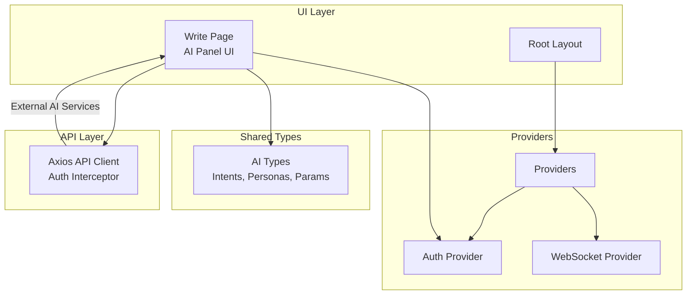
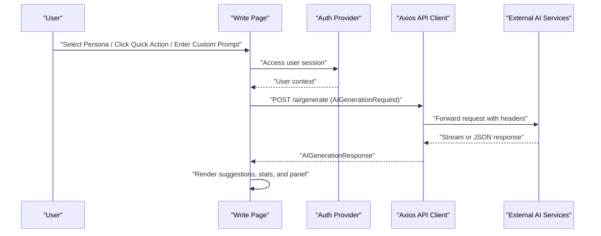
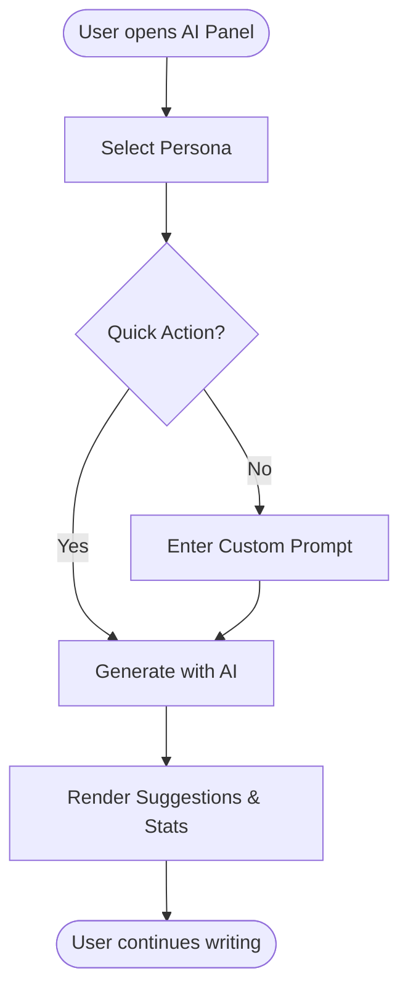
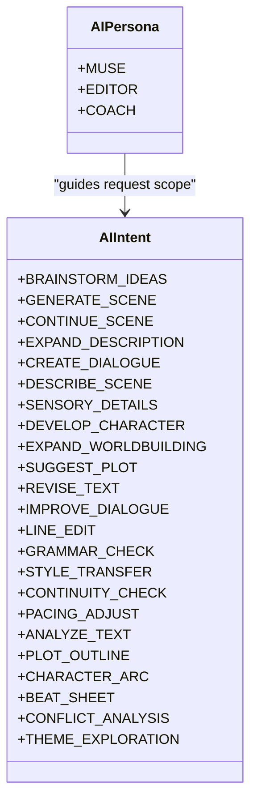
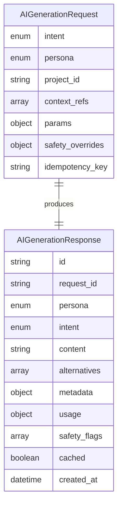
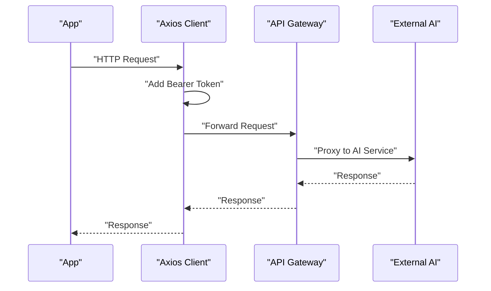
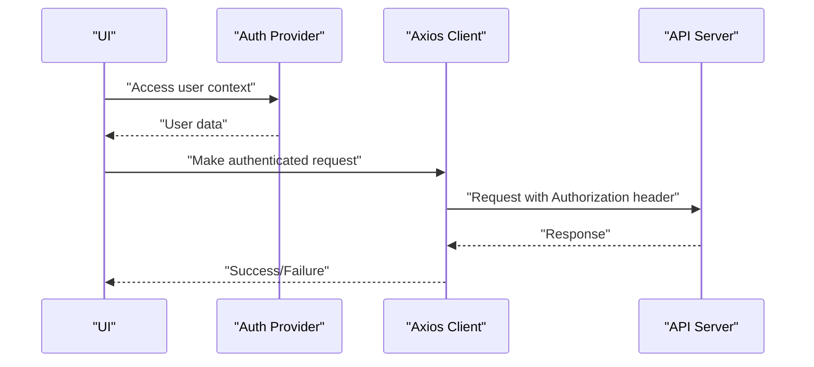
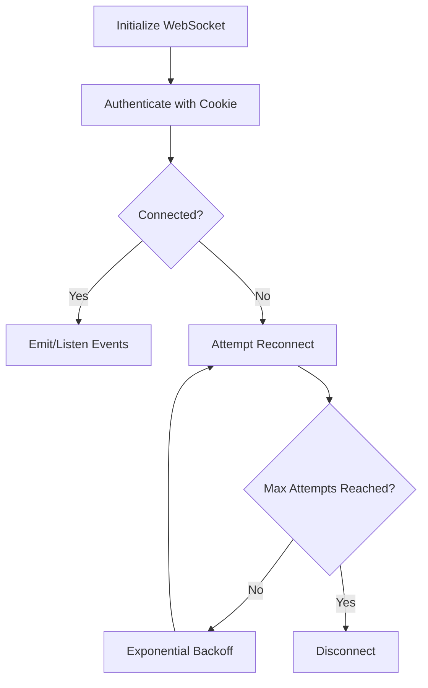
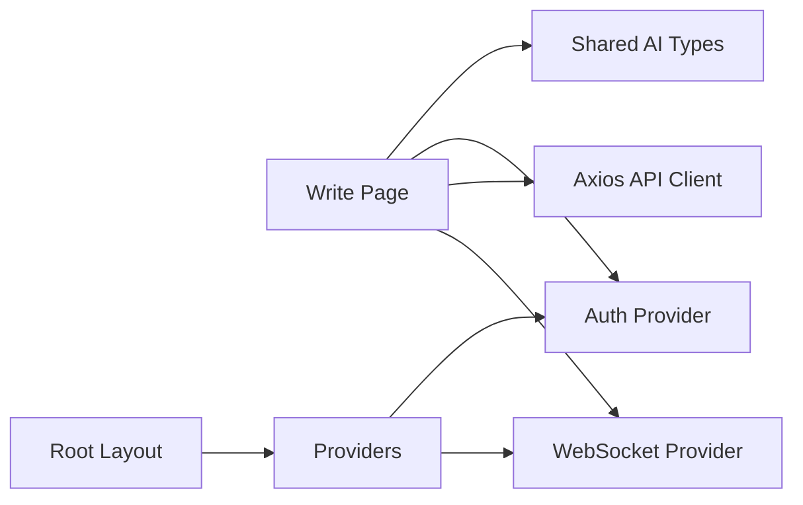

# AI Assistant System

<cite>
**Referenced Files in This Document**
- [write.page.tsx](file://src/app/projects/[id]/write/page.tsx)
- [ai.ts](file://packages/shared-types/src/ai.ts)
- [api.ts](file://src/lib/api.ts)
- [websocket-provider.tsx](file://src/components/websocket/websocket-provider.tsx)
- [providers.tsx](file://src/components/providers.tsx)
- [auth-provider.tsx](file://src/components/auth/auth-provider.tsx)
- [layout.tsx](file://src/app/layout.tsx)
- [IMPLEMENTATION_PLAN.md](file://IMPLEMENTATION_PLAN.md)
</cite>

## Table of Contents
1. [Introduction](#introduction)
2. [Project Structure](#project-structure)
3. [Core Components](#core-components)
4. [Architecture Overview](#architecture-overview)
5. [Detailed Component Analysis](#detailed-component-analysis)
6. [Dependency Analysis](#dependency-analysis)
7. [Performance Considerations](#performance-considerations)
8. [Troubleshooting Guide](#troubleshooting-guide)
9. [Conclusion](#conclusion)

## Introduction
This document describes the AI assistant system designed to support three specialized AI personas—Muse, Editor, and Coach—within the writing workflow. It explains persona selection, persona-specific capabilities, AI request/response handling, action buttons, custom prompts, recent suggestions, and integration with external AI services. Practical workflows demonstrate creative inspiration, grammar improvement, and story structure analysis. The document also covers visibility controls for the AI panel and user interaction patterns.

## Project Structure
The AI assistant resides primarily in the writing page component and leverages shared types, API clients, and WebSocket connectivity. The system is structured around:
- UI shell and layout configuration
- Authentication and session management
- Provider stack for state and connectivity
- Shared AI types and enums
- API client with authentication and token refresh
- WebSocket provider for real-time features

**Diagram sources**
- [layout.tsx](file://src/app/layout.tsx#L83-L102)
- [providers.tsx](file://src/components/providers.tsx#L10-L55)
- [auth-provider.tsx](file://src/components/auth/auth-provider.tsx#L20-L165)
- [websocket-provider.tsx](file://src/components/websocket/websocket-provider.tsx#L17-L138)
- [write.page.tsx](file://src/app/projects/[id]/write/page.tsx#L100-L626)
- [ai.ts](file://packages/shared-types/src/ai.ts#L3-L113)
- [api.ts](file://src/lib/api.ts#L1-L67)

**Section sources**
- [layout.tsx](file://src/app/layout.tsx#L83-L102)
- [providers.tsx](file://src/components/providers.tsx#L10-L55)
- [auth-provider.tsx](file://src/components/auth/auth-provider.tsx#L20-L165)
- [websocket-provider.tsx](file://src/components/websocket/websocket-provider.tsx#L17-L138)
- [write.page.tsx](file://src/app/projects/[id]/write/page.tsx#L100-L626)
- [ai.ts](file://packages/shared-types/src/ai.ts#L3-L113)
- [api.ts](file://src/lib/api.ts#L1-L67)

## Core Components
- AI Personas: Muse (creative inspiration), Editor (grammar/style), Coach (structure/pacing)
- AI Intents: Enumerated capabilities per persona for generation, revision, analysis, and worldbuilding
- Generation Parameters: Temperature, tokens, penalties, streaming, and model overrides
- Safety Overrides: Content policy controls for moderation
- Response Model: Structured response with usage metrics, safety flags, and suggestions
- API Types: Shared interfaces for generation requests/responses and related models
- Authentication and API Client: Axios client with bearer token injection and automatic refresh
- WebSocket Provider: Real-time connectivity for collaborative features and streaming updates

**Section sources**
- [write.page.tsx](file://src/app/projects/[id]/write/page.tsx#L68-L98)
- [ai.ts](file://packages/shared-types/src/ai.ts#L33-L90)
- [ai.ts](file://packages/shared-types/src/ai.ts#L101-L139)
- [ai.ts](file://packages/shared-types/src/ai.ts#L205-L258)
- [api.ts](file://src/lib/api.ts#L1-L67)
- [websocket-provider.tsx](file://src/components/websocket/websocket-provider.tsx#L17-L138)

## Architecture Overview
The AI assistant integrates with the editor UI and relies on shared types and an authenticated API client. The flow connects user actions (persona selection, quick actions, custom prompts) to generation requests and displays results in the AI panel.

**Diagram sources**
- [write.page.tsx](file://src/app/projects/[id]/write/page.tsx#L518-L622)
- [auth-provider.tsx](file://src/components/auth/auth-provider.tsx#L20-L165)
- [api.ts](file://src/lib/api.ts#L1-L67)
- [ai.ts](file://packages/shared-types/src/ai.ts#L3-L113)

## Detailed Component Analysis

### AI Panel UI and Interaction
The AI panel appears as a sidebar with:
- Persona selection cards (Muse, Editor, Coach)
- Quick action buttons for common tasks
- Custom prompt input area
- Recent suggestions list
- Visibility toggle to show/hide the panel

Key behaviors:
- Persona selection updates the active persona state
- Quick actions trigger generation based on selection or content
- Custom prompt allows free-form requests
- Recent suggestions provide contextual recency

**Diagram sources**
- [write.page.tsx](file://src/app/projects/[id]/write/page.tsx#L518-L622)

**Section sources**
- [write.page.tsx](file://src/app/projects/[id]/write/page.tsx#L518-L622)

### AI Personas and Capabilities
Personas are defined with distinct roles and icons:
- Muse: Creative inspiration, scene generation, dialogue creation, worldbuilding expansion
- Editor: Grammar checks, line edits, style transfer, continuity and pacing adjustments
- Coach: Plot outlines, character arcs, beat sheets, conflict and theme analysis

Each persona maps to a set of AI intents that guide request formatting and response interpretation.

**Diagram sources**
- [write.page.tsx](file://src/app/projects/[id]/write/page.tsx#L68-L98)
- [ai.ts](file://packages/shared-types/src/ai.ts#L33-L69)

**Section sources**
- [write.page.tsx](file://src/app/projects/[id]/write/page.tsx#L68-L98)
- [ai.ts](file://packages/shared-types/src/ai.ts#L33-L69)

### AI Request/Response Handling
The system defines a structured request/response model:
- Request: intent, persona, project_id, context references, parameters, optional safety overrides
- Response: content, alternatives, metadata (model, finish reason, confidence), usage metrics, safety flags, cache info

Generation parameters include temperature, max tokens, penalties, stop sequences, model override, determinism, streaming, and target length.

**Diagram sources**
- [ai.ts](file://packages/shared-types/src/ai.ts#L3-L113)

**Section sources**
- [ai.ts](file://packages/shared-types/src/ai.ts#L3-L113)
- [ai.ts](file://packages/shared-types/src/ai.ts#L77-L90)
- [ai.ts](file://packages/shared-types/src/ai.ts#L101-L139)

### Integration with External AI Services
The API client injects Authorization headers and handles token refresh automatically. Requests are sent to the configured API base URL, enabling integration with external AI services behind the API gateway.

**Diagram sources**
- [api.ts](file://src/lib/api.ts#L1-L67)

**Section sources**
- [api.ts](file://src/lib/api.ts#L1-L67)

### Authentication and Session Management
Authentication is handled via cookies and the Auth Provider. The API client reads tokens from local storage and attaches them to requests. On 401 responses, it attempts token refresh and retries the request.

**Diagram sources**
- [auth-provider.tsx](file://src/components/auth/auth-provider.tsx#L20-L165)
- [api.ts](file://src/lib/api.ts#L1-L67)

**Section sources**
- [auth-provider.tsx](file://src/components/auth/auth-provider.tsx#L20-L165)
- [api.ts](file://src/lib/api.ts#L1-L67)

### WebSocket Connectivity
The WebSocket provider manages connection lifecycle, authentication, and reconnection logic. It exposes emit/on/off methods for real-time features.

**Diagram sources**
- [websocket-provider.tsx](file://src/components/websocket/websocket-provider.tsx#L17-L138)

**Section sources**
- [websocket-provider.tsx](file://src/components/websocket/websocket-provider.tsx#L17-L138)

### Practical Workflows

#### Creative Inspiration (Muse)
- Use the Muse persona to brainstorm ideas, generate scenes, expand descriptions, create dialogue, and develop characters.
- Example: Select "Generate Scene" to continue writing after a pause, or "Suggest Plot" to explore narrative directions.

#### Grammar Improvement (Editor)
- Switch to the Editor persona for grammar checks, line edits, style transfers, and continuity/pacing adjustments.
- Example: Highlight text and choose "Improve Selection" to refine grammar and style.

#### Story Structure Analysis (Coach)
- Use the Coach persona for plot outlines, character arcs, beat sheets, conflict analysis, and theme exploration.
- Example: Request "Beat Sheet" to analyze scene progression and emotional beats.

These workflows leverage the AI panel’s quick actions and custom prompts to tailor assistance to the writer’s immediate needs.

**Section sources**
- [write.page.tsx](file://src/app/projects/[id]/write/page.tsx#L560-L602)
- [ai.ts](file://packages/shared-types/src/ai.ts#L33-L69)

### Best Practices
- Choose the persona aligned with the current writing phase (creativity, editing, analysis).
- Use context-aware prompts by selecting relevant text or chapters to inform the AI.
- Adjust generation parameters (temperature, tokens) for desired creativity vs precision.
- Monitor usage metrics and safety flags to maintain quality and compliance.
- Keep the AI panel visible during intensive writing sessions for rapid iteration.

[No sources needed since this section provides general guidance]

## Dependency Analysis
The AI assistant depends on:
- Shared AI types for request/response contracts
- Axios client for authenticated HTTP requests
- Auth provider for user session and token management
- WebSocket provider for real-time collaboration/streaming
- Root layout and providers for application-wide setup

**Diagram sources**
- [write.page.tsx](file://src/app/projects/[id]/write/page.tsx#L100-L626)
- [ai.ts](file://packages/shared-types/src/ai.ts#L3-L113)
- [auth-provider.tsx](file://src/components/auth/auth-provider.tsx#L20-L165)
- [api.ts](file://src/lib/api.ts#L1-L67)
- [websocket-provider.tsx](file://src/components/websocket/websocket-provider.tsx#L17-L138)
- [layout.tsx](file://src/app/layout.tsx#L83-L102)
- [providers.tsx](file://src/components/providers.tsx#L10-L55)

**Section sources**
- [write.page.tsx](file://src/app/projects/[id]/write/page.tsx#L100-L626)
- [ai.ts](file://packages/shared-types/src/ai.ts#L3-L113)
- [auth-provider.tsx](file://src/components/auth/auth-provider.tsx#L20-L165)
- [api.ts](file://src/lib/api.ts#L1-L67)
- [websocket-provider.tsx](file://src/components/websocket/websocket-provider.tsx#L17-L138)
- [layout.tsx](file://src/app/layout.tsx#L83-L102)
- [providers.tsx](file://src/components/providers.tsx#L10-L55)

## Performance Considerations
- Use streaming where supported to reduce perceived latency.
- Tune generation parameters (temperature, max tokens) to balance quality and cost.
- Cache frequent requests with idempotency keys to avoid redundant processing.
- Monitor usage metrics to track token consumption and optimize model tiers.
- Debounce rapid successive requests to prevent API throttling.

[No sources needed since this section provides general guidance]

## Troubleshooting Guide
Common issues and resolutions:
- Authentication failures: Verify tokens and refresh logic; ensure cookies are set correctly.
- API errors: Inspect Axios interceptors and error handling; confirm base URL configuration.
- WebSocket disconnections: Check reconnection attempts and authentication events.
- Generation timeouts: Reduce max tokens or adjust model parameters; enable streaming.

**Section sources**
- [api.ts](file://src/lib/api.ts#L24-L65)
- [websocket-provider.tsx](file://src/components/websocket/websocket-provider.tsx#L56-L87)
- [auth-provider.tsx](file://src/components/auth/auth-provider.tsx#L115-L141)

## Conclusion
The AI assistant system integrates three specialized personas—Muse, Editor, and Coach—into a cohesive writing environment. Its structured request/response model, robust authentication and API client, and real-time WebSocket connectivity enable efficient creative workflows. By aligning persona selection with writing goals and leveraging quick actions and custom prompts, writers can accelerate ideation, improve text quality, and analyze narrative structure effectively.