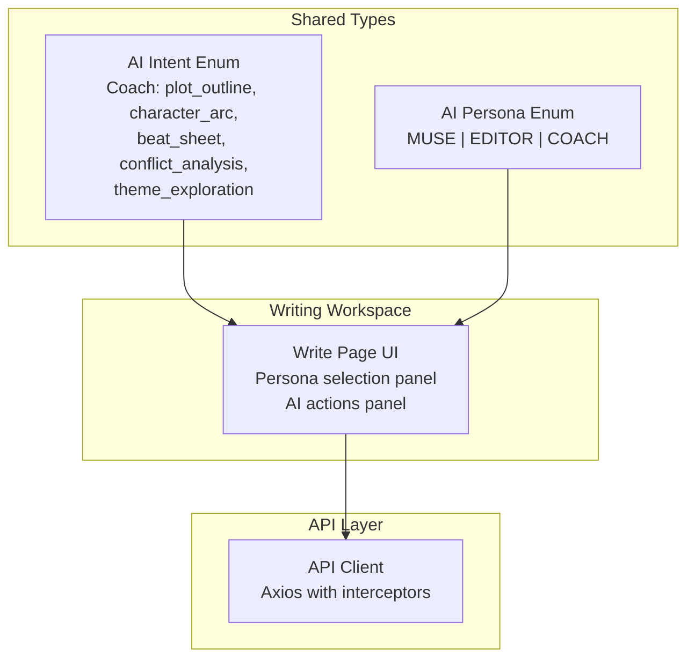
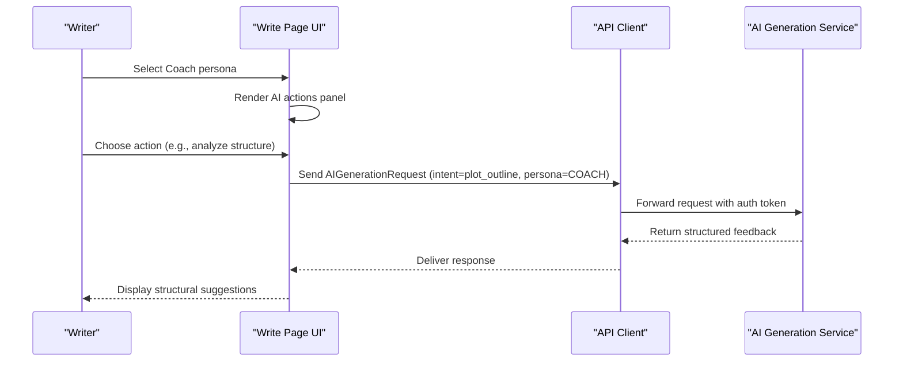
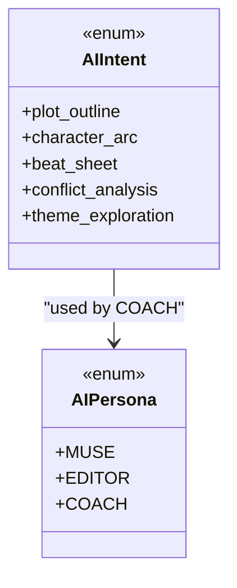
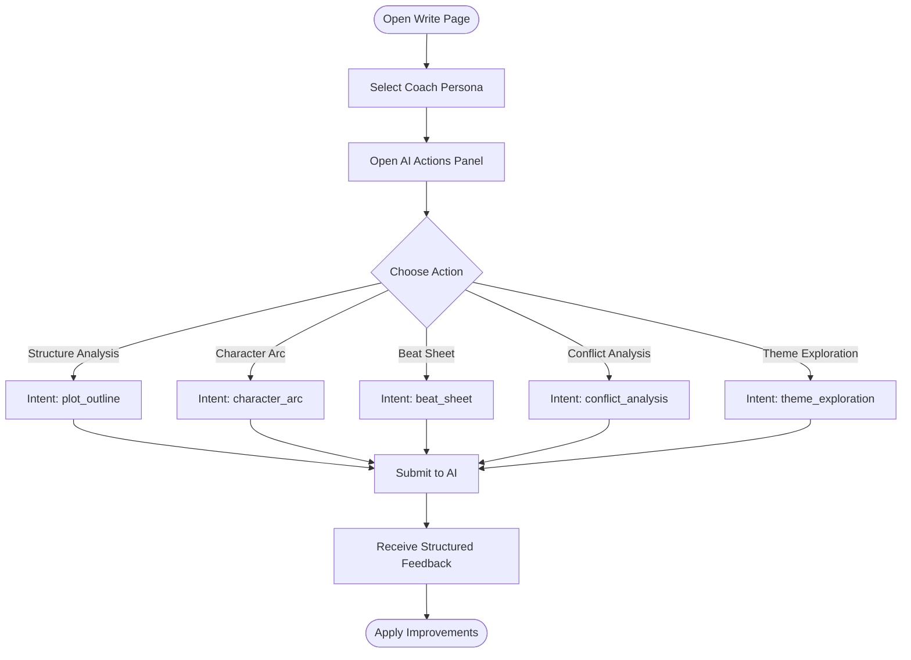
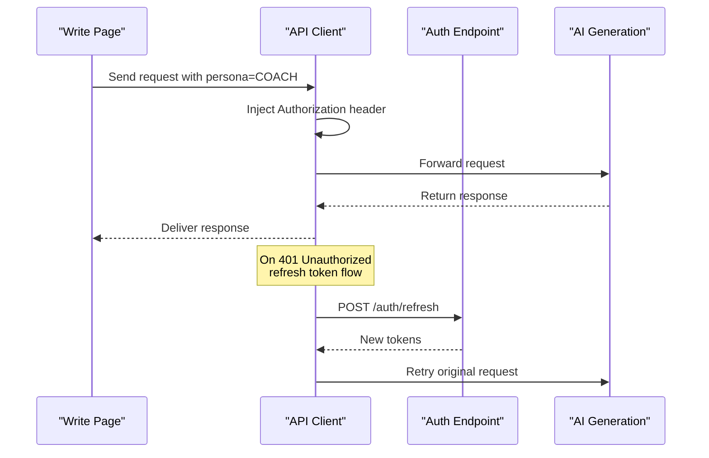
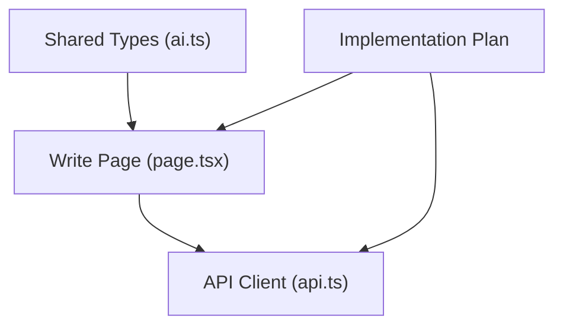

# Coach Persona

<cite>
**Referenced Files in This Document**
- [ai.ts](file://packages/shared-types/src/ai.ts)
- [page.tsx](file://src/app/projects/[id]/write/page.tsx)
- [api.ts](file://src/lib/api.ts)
- [README.md](file://README.md)
- [IMPLEMENTATION_PLAN.md](file://IMPLEMENTATION_PLAN.md)
</cite>

## Table of Contents
1. [Introduction](#introduction)
2. [Project Structure](#project-structure)
3. [Core Components](#core-components)
4. [Architecture Overview](#architecture-overview)
5. [Detailed Component Analysis](#detailed-component-analysis)
6. [Dependency Analysis](#dependency-analysis)
7. [Performance Considerations](#performance-considerations)
8. [Troubleshooting Guide](#troubleshooting-guide)
9. [Conclusion](#conclusion)

## Introduction
This document describes the Coach AI persona for story structure analysis, pacing evaluation, and narrative guidance. The Coach persona focuses on structural feedback, identifying plot holes, and suggesting organizational improvements. It complements the Muse (creative inspiration) and Editor (grammar/style) personas within the AI assistant system. The Coach persona integrates with the broader platform through a unified AI intent and persona taxonomy, and it is designed to work alongside the writing workspace and AI generation pipeline.

## Project Structure
The Coach persona is part of a larger AI assistant system with three distinct personas: Muse, Editor, and Coach. The shared types define the AI intents and persona taxonomy, while the writing workspace exposes persona selection and quick actions. The API client handles authentication and request/response flows.

**Diagram sources**
- [ai.ts](file://packages/shared-types/src/ai.ts#L33-L75)
- [page.tsx](file://src/app/projects/[id]/write/page.tsx#L532-L589)
- [api.ts](file://src/lib/api.ts#L1-L67)

**Section sources**
- [ai.ts](file://packages/shared-types/src/ai.ts#L33-L75)
- [page.tsx](file://src/app/projects/[id]/write/page.tsx#L532-L589)
- [api.ts](file://src/lib/api.ts#L1-L67)

## Core Components
- AI Intent taxonomy: The Coach persona is identified by a set of structural analysis intents: plot_outline, character_arc, beat_sheet, conflict_analysis, and theme_exploration. These intents define the specific analytical actions the Coach can perform.
- AI Persona taxonomy: The Coach persona is represented as COACH within the AIPersona enum, enabling unified routing and configuration across the system.
- UI integration: The writing workspace includes a persona selection panel and an AI actions panel. The Coach persona is visually represented with a green-themed identity and a checkmark icon, aligning with its role in reviewing and validating narrative structure.
- API integration: The API client manages authentication and request/response flows, providing the foundation for invoking AI generation with the selected persona and intent.

Practical example paths:
- Coach persona definition: [AI Persona enum](file://packages/shared-types/src/ai.ts#L71-L75)
- Coach intents: [AI Intent enum](file://packages/shared-types/src/ai.ts#L56-L61)
- UI persona selection: [Write page persona list](file://src/app/projects/[id]/write/page.tsx#L76-L98)
- UI actions panel: [Write page AI actions](file://src/app/projects/[id]/write/page.tsx#L560-L589)
- API client: [Axios client with interceptors](file://src/lib/api.ts#L1-L67)

**Section sources**
- [ai.ts](file://packages/shared-types/src/ai.ts#L33-L75)
- [page.tsx](file://src/app/projects/[id]/write/page.tsx#L76-L98)
- [page.tsx](file://src/app/projects/[id]/write/page.tsx#L560-L589)
- [api.ts](file://src/lib/api.ts#L1-L67)

## Architecture Overview
The Coach persona participates in a three-persona AI assistant system. The UI presents persona options and quick actions, while the API client manages authentication and request lifecycle. The shared types define the intent taxonomy that the backend will interpret to deliver structural analysis and pacing recommendations.

**Diagram sources**
- [page.tsx](file://src/app/projects/[id]/write/page.tsx#L532-L589)
- [api.ts](file://src/lib/api.ts#L10-L22)
- [ai.ts](file://packages/shared-types/src/ai.ts#L3-L11)

**Section sources**
- [page.tsx](file://src/app/projects/[id]/write/page.tsx#L532-L589)
- [api.ts](file://src/lib/api.ts#L10-L22)
- [ai.ts](file://packages/shared-types/src/ai.ts#L3-L11)

## Detailed Component Analysis

### Coach Persona Definition and Intents
The Coach persona is defined by a dedicated set of intents that enable structural analysis and pacing evaluation:
- plot_outline: Analyze and suggest improvements to the overall story arc and major beats.
- character_arc: Evaluate character development arcs for coherence and growth.
- beat_sheet: Break down scenes and chapters into dramatic beats and pacing markers.
- conflict_analysis: Identify and strengthen internal and external conflicts.
- theme_exploration: Suggest thematic consistency and depth across the narrative.

These intents are part of the shared AI intent taxonomy and are routed to the Coach persona for structural feedback.

**Diagram sources**
- [ai.ts](file://packages/shared-types/src/ai.ts#L33-L75)

**Section sources**
- [ai.ts](file://packages/shared-types/src/ai.ts#L56-L61)
- [ai.ts](file://packages/shared-types/src/ai.ts#L71-L75)

### UI Integration: Persona Selection and Actions
The writing workspace exposes the Coach persona alongside Muse and Editor. The persona selection panel highlights the Coach persona with a green-themed identity and a checkmark icon, reflecting its role in reviewing and validating narrative structure. The AI actions panel provides quick-access buttons for structural analysis and pacing recommendations.

Key UI elements:
- Persona selection: The write page defines a list of personas, including Coach with a green color scheme and a checkmark icon.
- Quick actions: Buttons for structural analysis and pacing adjustments are available in the AI actions panel.
- Recent suggestions: The UI displays recent suggestions attributed to the Coach persona, reinforcing its analytical role.

**Diagram sources**
- [page.tsx](file://src/app/projects/[id]/write/page.tsx#L76-L98)
- [page.tsx](file://src/app/projects/[id]/write/page.tsx#L560-L589)

**Section sources**
- [page.tsx](file://src/app/projects/[id]/write/page.tsx#L76-L98)
- [page.tsx](file://src/app/projects/[id]/write/page.tsx#L560-L589)

### API Integration and Authentication
The API client manages authentication and request/response flows, ensuring secure and reliable communication with the AI generation service. Interceptors add the bearer token to outgoing requests and handle token refresh on 401 responses.

**Diagram sources**
- [api.ts](file://src/lib/api.ts#L10-L22)
- [api.ts](file://src/lib/api.ts#L24-L65)

**Section sources**
- [api.ts](file://src/lib/api.ts#L10-L22)
- [api.ts](file://src/lib/api.ts#L24-L65)

### Practical Examples of Coach Interactions
Below are concrete examples of how the Coach persona can assist with structural feedback and pacing recommendations. These examples illustrate typical workflows users might follow in the writing workspace.

- Analyzing chapter organization:
  - Use the beat_sheet intent to break scenes into dramatic beats and evaluate pacing distribution across chapters.
  - Apply suggestions to balance emotional peaks and valleys for improved reader engagement.

- Evaluating character development arcs:
  - Use the character_arc intent to assess whether character growth aligns with plot progression and thematic goals.
  - Adjust dialogue and internal monologue to reinforce arc consistency.

- Identifying plot holes:
  - Use the plot_outline intent to review major beats and ensure cause-and-effect relationships are clear and consistent.
  - Strengthen transitions and foreshadowing to eliminate gaps in narrative logic.

- Suggesting organizational improvements:
  - Use the conflict_analysis intent to identify weak or underdeveloped conflicts and propose enhancements.
  - Leverage the theme_exploration intent to deepen thematic resonance across scenes and chapters.

Example paths:
- Beat sheet analysis: [AI actions panel](file://src/app/projects/[id]/write/page.tsx#L560-L589)
- Character arc evaluation: [AI actions panel](file://src/app/projects/[id]/write/page.tsx#L560-L589)
- Plot outline review: [AI actions panel](file://src/app/projects/[id]/write/page.tsx#L560-L589)
- Conflict analysis: [AI actions panel](file://src/app/projects/[id]/write/page.tsx#L560-L589)
- Theme exploration: [AI actions panel](file://src/app/projects/[id]/write/page.tsx#L560-L589)

**Section sources**
- [page.tsx](file://src/app/projects/[id]/write/page.tsx#L560-L589)

### Best Practices for Using Structural Feedback
- Use the Coach persona iteratively: Apply structural feedback incrementally, focusing on one aspect (arc, beats, conflict) per session to avoid overwhelming changes.
- Cross-reference with the Muse persona: After receiving structural suggestions, use the Muse persona to brainstorm creative solutions that align with the Coach’s recommendations.
- Maintain thematic consistency: Use the theme_exploration intent to ensure that structural changes reinforce central themes rather than distract from them.
- Validate pacing: Use the beat_sheet intent to verify that pacing improvements support the intended emotional rhythm of each chapter.
- Document changes: Keep a record of applied suggestions and their rationale to maintain continuity across long projects.

[No sources needed since this section provides general guidance]

## Dependency Analysis
The Coach persona relies on shared AI types and integrates with the writing workspace and API client. The implementation plan outlines tasks to complete state management, hooks, and API modules, which will further solidify the Coach persona’s integration.

**Diagram sources**
- [ai.ts](file://packages/shared-types/src/ai.ts#L33-L75)
- [page.tsx](file://src/app/projects/[id]/write/page.tsx#L532-L589)
- [api.ts](file://src/lib/api.ts#L1-L67)
- [IMPLEMENTATION_PLAN.md](file://IMPLEMENTATION_PLAN.md#L25-L150)

**Section sources**
- [ai.ts](file://packages/shared-types/src/ai.ts#L33-L75)
- [page.tsx](file://src/app/projects/[id]/write/page.tsx#L532-L589)
- [api.ts](file://src/lib/api.ts#L1-L67)
- [IMPLEMENTATION_PLAN.md](file://IMPLEMENTATION_PLAN.md#L25-L150)

## Performance Considerations
- Token efficiency: Use appropriate model configurations and generation parameters to minimize token usage during structural analysis.
- Streaming responses: Enable streaming where supported to reduce latency for real-time feedback.
- Caching: Leverage caching for repeated structural queries to improve responsiveness.
- Debouncing: Debounce user interactions in the AI actions panel to prevent excessive requests.

[No sources needed since this section provides general guidance]

## Troubleshooting Guide
- Authentication failures: If requests fail with 401 errors, the API client automatically attempts token refresh. Verify refresh token availability and network connectivity.
- UI not responding: Ensure the AI actions panel is open and that a persona is selected before generating suggestions.
- Missing suggestions: Confirm that the selected intent corresponds to the Coach persona and that the content area has sufficient context for analysis.

**Section sources**
- [api.ts](file://src/lib/api.ts#L24-L65)
- [page.tsx](file://src/app/projects/[id]/write/page.tsx#L532-L589)

## Conclusion
The Coach persona provides essential structural feedback and pacing guidance within the AI assistant system. By leveraging dedicated intents for plot outline, character arcs, beat sheets, conflict analysis, and theme exploration, the Coach helps writers identify weaknesses and improve narrative organization. Its green-themed UI integration and analytical approach complement the Muse and Editor personas, offering a comprehensive toolkit for crafting compelling stories.