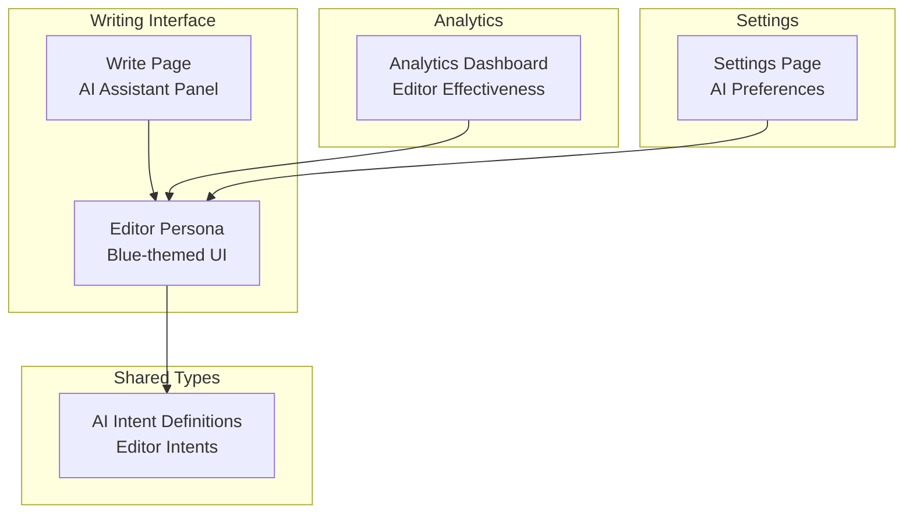
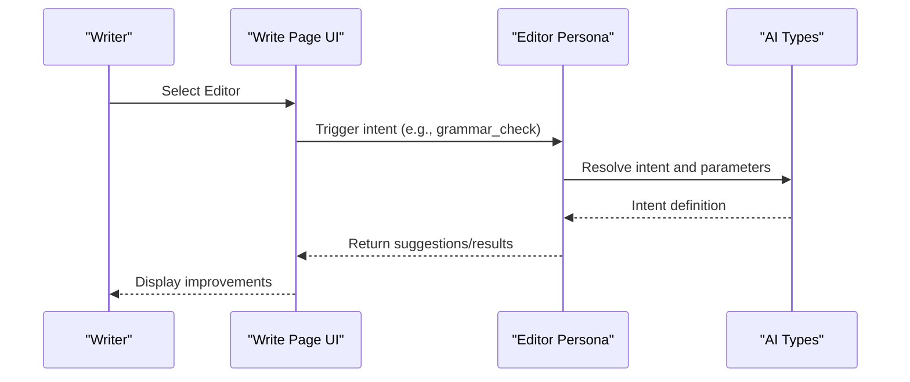
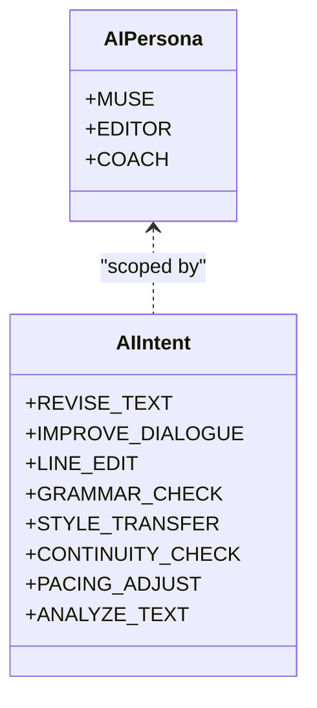
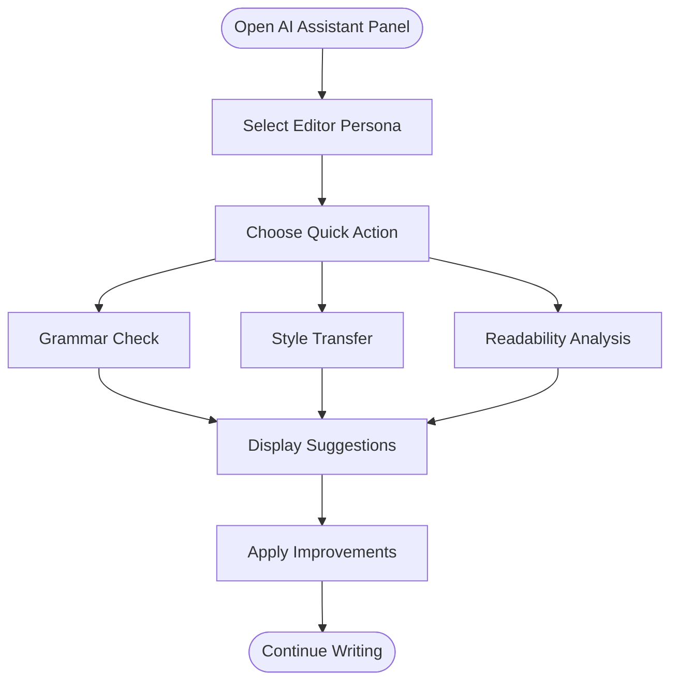
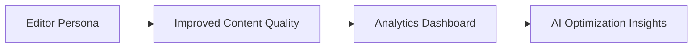
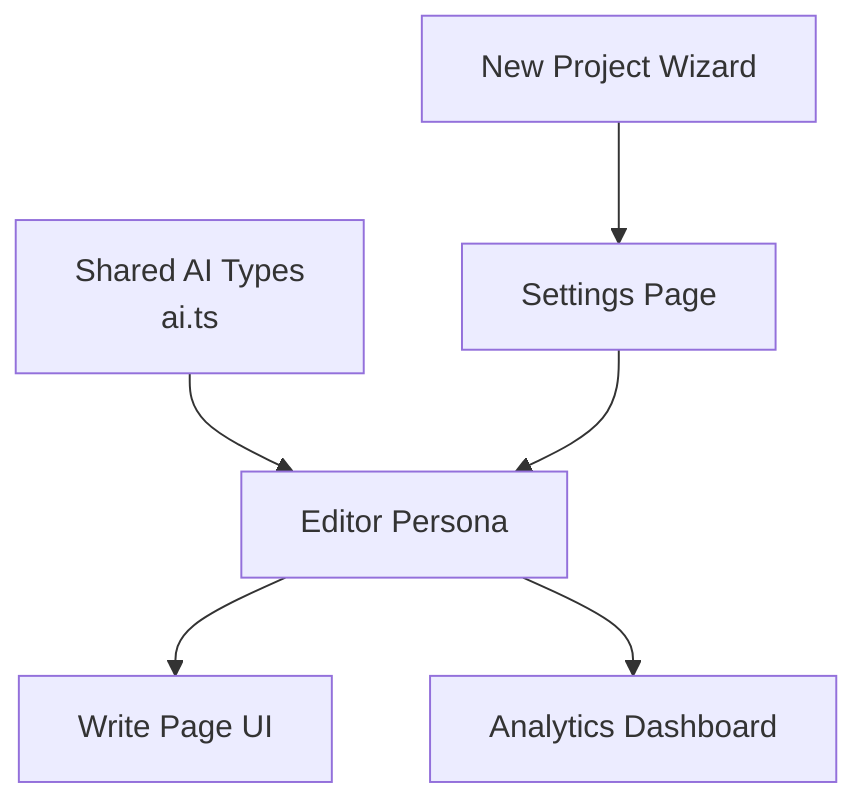

# Editor Persona

<cite>
**Referenced Files in This Document**
- [ai.ts](file://packages/shared-types/src/ai.ts)
- [page.tsx](file://src/app/projects/[id]/write/page.tsx)
- [page.tsx](file://src/app/analytics/page.tsx)
- [page.tsx](file://src/app/settings/page.tsx)
- [page.tsx](file://src/app/projects/new/page.tsx)
</cite>

## Table of Contents
1. [Introduction](#introduction)
2. [Project Structure](#project-structure)
3. [Core Components](#core-components)
4. [Architecture Overview](#architecture-overview)
5. [Detailed Component Analysis](#detailed-component-analysis)
6. [Dependency Analysis](#dependency-analysis)
7. [Performance Considerations](#performance-considerations)
8. [Troubleshooting Guide](#troubleshooting-guide)
9. [Conclusion](#conclusion)

## Introduction
The Editor persona is one of three specialized AI personas designed to enhance writing quality through precise linguistic feedback and targeted improvements. As a blue-themed analytical companion, the Editor focuses on grammar correction, style enhancement, readability optimization, and consistency maintenance. This document explains the Editor's role, capabilities, and integration within the broader AI assistant ecosystem, along with best practices for balancing AI suggestions with personal writing style.

## Project Structure
The Editor persona is integrated into the writing interface and analytics ecosystem:
- The Editor is selectable alongside Muse and Coach in the AI Assistant panel within the writing environment.
- Editor-specific analytics highlight its effectiveness in improving content quality.
- User preferences allow customization of AI models and behavior, indirectly affecting Editor performance.

**Diagram sources**
- [page.tsx](file://src/app/projects/[id]/write/page.tsx#L518-L622)
- [ai.ts](file://packages/shared-types/src/ai.ts#L33-L69)
- [page.tsx](file://src/app/analytics/page.tsx#L457-L465)
- [page.tsx](file://src/app/settings/page.tsx#L395-L427)

**Section sources**
- [page.tsx](file://src/app/projects/[id]/write/page.tsx#L518-L622)
- [ai.ts](file://packages/shared-types/src/ai.ts#L33-L69)
- [page.tsx](file://src/app/analytics/page.tsx#L457-L465)
- [page.tsx](file://src/app/settings/page.tsx#L395-L427)

## Core Components
The Editor persona is defined by a set of intents that govern its linguistic capabilities:
- Grammar correction and sentence structure refinement
- Style transfer and consistency enforcement
- Continuity checks and pacing adjustments
- Text analysis and readability improvements

These intents are part of a unified AI intent taxonomy that also includes Muse and Coach personas, enabling a cohesive writing assistance experience.

**Section sources**
- [ai.ts](file://packages/shared-types/src/ai.ts#L33-L69)

## Architecture Overview
The Editor persona operates within a persona-driven architecture where each persona exposes distinct intents for specific writing tasks. The writing interface provides a blue-themed panel for selecting the Editor and invoking its capabilities.

**Diagram sources**
- [page.tsx](file://src/app/projects/[id]/write/page.tsx#L518-L622)
- [ai.ts](file://packages/shared-types/src/ai.ts#L33-L69)

**Section sources**
- [page.tsx](file://src/app/projects/[id]/write/page.tsx#L518-L622)
- [ai.ts](file://packages/shared-types/src/ai.ts#L33-L69)

## Detailed Component Analysis

### Editor Persona Definition and Intents
The Editor persona is represented by a dedicated identifier and associated intents that enable precise linguistic improvements:
- Grammar correction and sentence structure refinement
- Style transfer and consistency enforcement
- Continuity checks and pacing adjustments
- Text analysis and readability improvements

These intents are defined in shared types and provide a standardized contract for Editor behavior across the application.

**Diagram sources**
- [ai.ts](file://packages/shared-types/src/ai.ts#L71-L75)
- [ai.ts](file://packages/shared-types/src/ai.ts#L33-L69)

**Section sources**
- [ai.ts](file://packages/shared-types/src/ai.ts#L71-L75)
- [ai.ts](file://packages/shared-types/src/ai.ts#L33-L69)

### Editor Integration in the Writing Interface
The Editor is accessible via the AI Assistant panel in the writing environment. The panel presents persona selection with a blue-themed visual identity and provides quick-action buttons for common Editor tasks. The panel also displays recent suggestions and supports custom prompts.

**Diagram sources**
- [page.tsx](file://src/app/projects/[id]/write/page.tsx#L518-L622)

**Section sources**
- [page.tsx](file://src/app/projects/[id]/write/page.tsx#L518-L622)

### Analytics Validation of Editor Effectiveness
Analytics data highlights the Editor persona's impact on writing quality, demonstrating measurable improvements in content quality and user satisfaction. This insight validates the Editor's role in maintaining consistency and elevating prose.

**Diagram sources**
- [page.tsx](file://src/app/analytics/page.tsx#L457-L465)

**Section sources**
- [page.tsx](file://src/app/analytics/page.tsx#L457-L465)

### User Preferences and Model Selection
While the Editor persona is selected within the writing interface, user preferences allow customization of AI models and behavior. These preferences influence how the Editor operates, including model choice and generation parameters.

**Section sources**
- [page.tsx](file://src/app/settings/page.tsx#L395-L427)
- [page.tsx](file://src/app/projects/new/page.tsx#L395-L427)

## Dependency Analysis
The Editor persona depends on shared AI types and integrates with the writing interface and analytics systems. The following diagram illustrates these relationships:

**Diagram sources**
- [ai.ts](file://packages/shared-types/src/ai.ts#L33-L69)
- [page.tsx](file://src/app/projects/[id]/write/page.tsx#L518-L622)
- [page.tsx](file://src/app/analytics/page.tsx#L457-L465)
- [page.tsx](file://src/app/settings/page.tsx#L395-L427)
- [page.tsx](file://src/app/projects/new/page.tsx#L395-L427)

**Section sources**
- [ai.ts](file://packages/shared-types/src/ai.ts#L33-L69)
- [page.tsx](file://src/app/projects/[id]/write/page.tsx#L518-L622)
- [page.tsx](file://src/app/analytics/page.tsx#L457-L465)
- [page.tsx](file://src/app/settings/page.tsx#L395-L427)
- [page.tsx](file://src/app/projects/new/page.tsx#L395-L427)

## Performance Considerations
- Model selection: Choose appropriate models for grammar and style tasks to balance accuracy and speed.
- Token limits: Configure maximum tokens per generation to manage costs and response sizes.
- Temperature controls: Adjust creativity vs. precision for different writing stages.
- Caching: Leverage response caching for repeated Editor actions to reduce latency and API usage.

## Troubleshooting Guide
- Suggestions not appearing: Verify the Editor persona is selected and that the content area has sufficient text for analysis.
- Slow responses: Adjust model settings and token limits in user preferences to optimize performance.
- Inconsistent results: Use continuity and pacing intents to maintain narrative coherence across longer passages.

## Conclusion
The Editor persona serves as a focused, blue-themed linguistic partner that enhances writing quality through grammar correction, style improvement, readability optimization, and consistency maintenance. Its integration with the writing interface, supported by analytics validation and configurable user preferences, ensures a practical and effective writing assistance experience. By thoughtfully applying Editor suggestions while preserving personal voice, writers can achieve polished prose that meets professional standards.