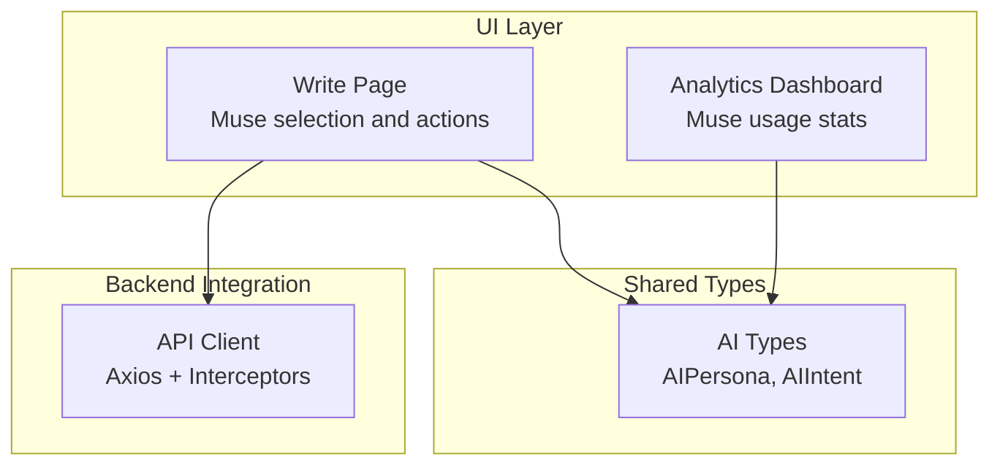
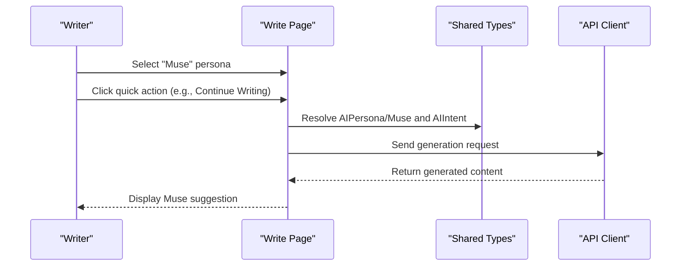
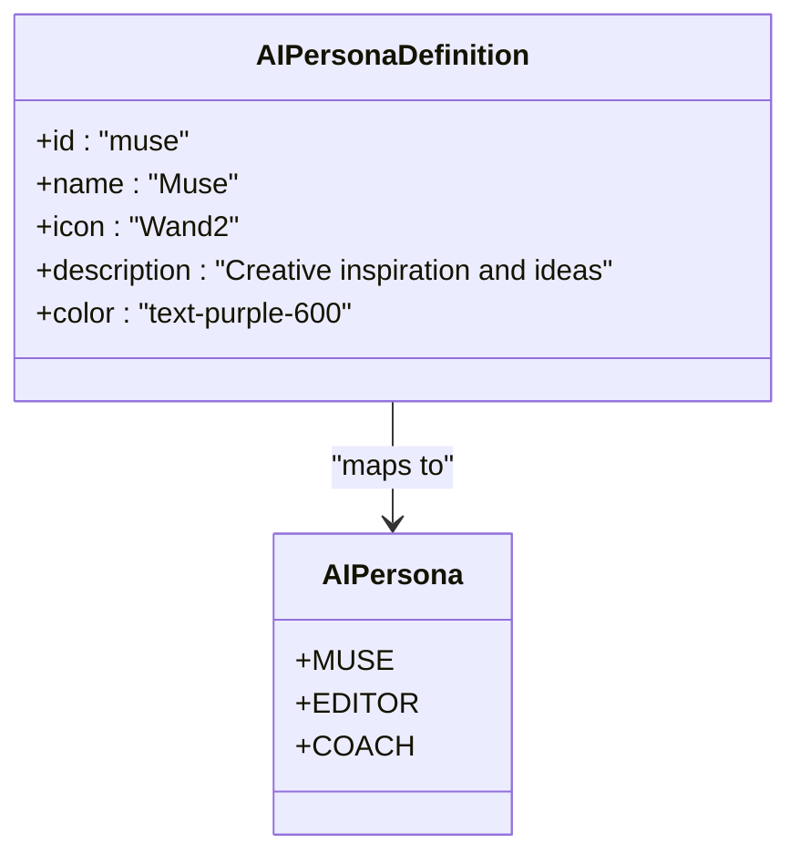
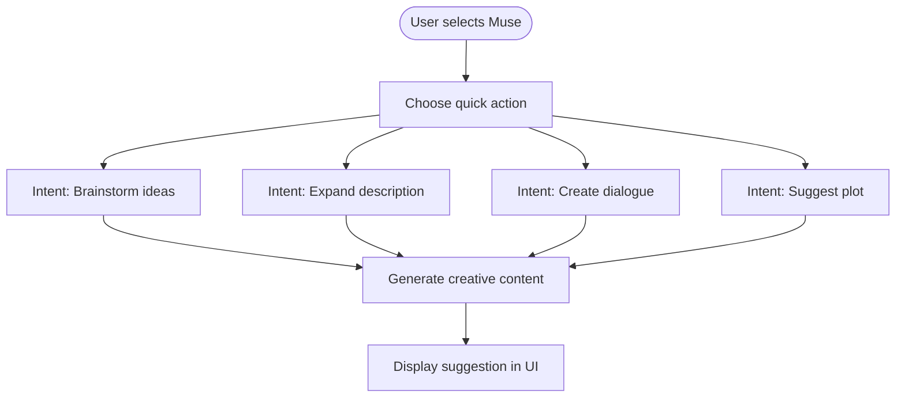
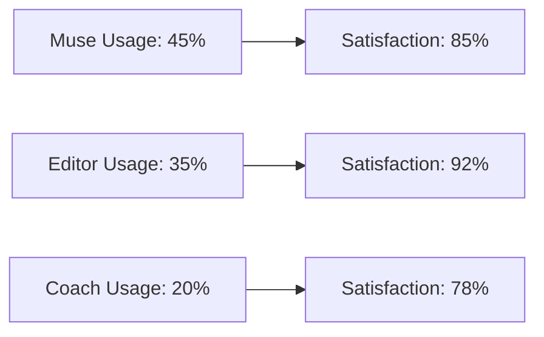
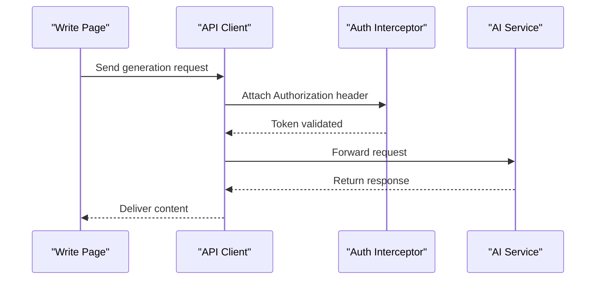
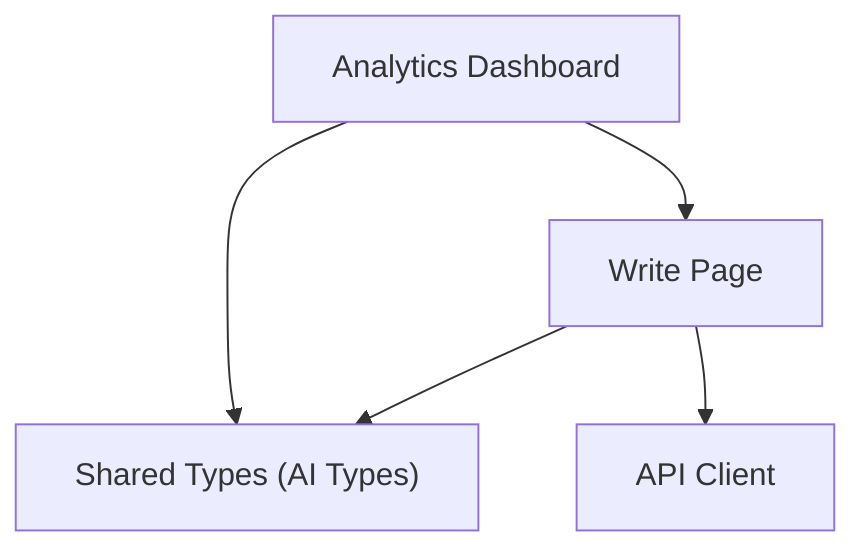

# Muse Persona

<cite>
**Referenced Files in This Document**
- [README.md](file://README.md)
- [ai.ts](file://packages/shared-types/src/ai.ts)
- [page.tsx](file://src/app/projects/[id]/write/page.tsx)
- [page.tsx](file://src/app/analytics/page.tsx)
- [api.ts](file://src/lib/api.ts)
</cite>

## Table of Contents
1. [Introduction](#introduction)
2. [Project Structure](#project-structure)
3. [Core Components](#core-components)
4. [Architecture Overview](#architecture-overview)
5. [Detailed Component Analysis](#detailed-component-analysis)
6. [Dependency Analysis](#dependency-analysis)
7. [Performance Considerations](#performance-considerations)
8. [Troubleshooting Guide](#troubleshooting-guide)
9. [Conclusion](#conclusion)
10. [Appendices](#appendices)

## Introduction
The Muse persona is one of three specialized AI personas designed to spark creativity and overcome writer’s block. Its primary role is to provide inspirational content, expand ideas, and offer narrative suggestions that fuel the creative writing process. In this project, Muse integrates with the broader AI assistant system to deliver targeted creative assistance within the writing environment.

Muse’s identity is reflected in its purple-themed interface and its focus on creative inspiration. The persona is part of a triad of AI assistants—Muse (creative spark), Editor (grammar/style), and Coach (structure/pacing)—each tailored to distinct stages of the writing lifecycle.

## Project Structure
The Muse persona is implemented across shared types, the writing interface, analytics, and the API client. The shared types define the AI intent taxonomy and persona enumeration, while the writing page hosts the interactive UI for selecting the Muse persona and triggering quick actions. Analytics surfaces usage statistics and satisfaction metrics for Muse, and the API client manages authentication and request/response handling.

**Diagram sources**
- [page.tsx](file://src/app/projects/[id]/write/page.tsx#L76-L98)
- [page.tsx](file://src/app/analytics/page.tsx#L151-L155)
- [ai.ts](file://packages/shared-types/src/ai.ts#L71-L75)
- [api.ts](file://src/lib/api.ts#L1-L67)

**Section sources**
- [README.md](file://README.md#L34-L34)
- [page.tsx](file://src/app/projects/[id]/write/page.tsx#L76-L98)
- [page.tsx](file://src/app/analytics/page.tsx#L151-L155)
- [ai.ts](file://packages/shared-types/src/ai.ts#L71-L75)
- [api.ts](file://src/lib/api.ts#L1-L67)

## Core Components
- Muse persona definition and color scheme: The writing page defines the Muse persona with a purple color identifier and a creative description, aligning with its role as a source of inspiration.
- AI intent taxonomy: The shared types enumerate Muse-specific intents such as brainstorming ideas, expanding descriptions, generating scenes, and suggesting plots.
- Quick action panel: The writing page exposes a panel with buttons for common Muse actions, including continuing writing and generating dialogue.
- Analytics integration: The analytics dashboard includes Muse usage percentages and satisfaction metrics, reflecting its prominence among the personas.

Practical implications:
- Purple-themed UI: The Muse persona is visually distinct with purple accents, reinforcing its inspirational role.
- Action-driven UX: Users can quickly trigger Muse-assisted actions without leaving the writing context.
- Usage insights: Analytics highlight Muse’s usage share and satisfaction, guiding optimization and feature prioritization.

**Section sources**
- [page.tsx](file://src/app/projects/[id]/write/page.tsx#L76-L98)
- [ai.ts](file://packages/shared-types/src/ai.ts#L33-L44)
- [page.tsx](file://src/app/projects/[id]/write/page.tsx#L560-L620)
- [page.tsx](file://src/app/analytics/page.tsx#L151-L155)

## Architecture Overview
The Muse persona participates in a layered architecture:
- UI layer: The writing page renders the Muse persona selector and quick actions.
- Shared types layer: Defines the persona and intent contracts used across the system.
- Backend integration: The API client handles authentication and request/response flows.

**Diagram sources**
- [page.tsx](file://src/app/projects/[id]/write/page.tsx#L100-L185)
- [ai.ts](file://packages/shared-types/src/ai.ts#L3-L11)
- [api.ts](file://src/lib/api.ts#L1-L67)

**Section sources**
- [page.tsx](file://src/app/projects/[id]/write/page.tsx#L100-L185)
- [ai.ts](file://packages/shared-types/src/ai.ts#L3-L11)
- [api.ts](file://src/lib/api.ts#L1-L67)

## Detailed Component Analysis

### Muse Persona Definition and UI
The Muse persona is defined with a purple color identifier and a creative description. The UI allows users to select Muse and triggers quick actions tailored to creative inspiration.

**Diagram sources**
- [ai.ts](file://packages/shared-types/src/ai.ts#L71-L75)
- [page.tsx](file://src/app/projects/[id]/write/page.tsx#L76-L98)

**Section sources**
- [page.tsx](file://src/app/projects/[id]/write/page.tsx#L76-L98)
- [ai.ts](file://packages/shared-types/src/ai.ts#L71-L75)

### Muse Intents and Actions
Muse intents are enumerated in shared types and include:
- Brainstorm ideas
- Generate scene
- Continue scene
- Expand description
- Create dialogue
- Describe scene
- Sensory details
- Develop character
- Expand worldbuilding
- Suggest plot

These intents map to the quick actions exposed in the writing page, enabling users to request specific forms of creative assistance.

**Diagram sources**
- [ai.ts](file://packages/shared-types/src/ai.ts#L33-L44)
- [page.tsx](file://src/app/projects/[id]/write/page.tsx#L560-L620)

**Section sources**
- [ai.ts](file://packages/shared-types/src/ai.ts#L33-L44)
- [page.tsx](file://src/app/projects/[id]/write/page.tsx#L560-L620)

### Analytics and Satisfaction Metrics
The analytics dashboard includes Muse usage statistics and satisfaction scores, indicating its prominence among the personas. These metrics inform product decisions and highlight areas for improvement.

**Diagram sources**
- [page.tsx](file://src/app/analytics/page.tsx#L151-L155)

**Section sources**
- [page.tsx](file://src/app/analytics/page.tsx#L151-L155)

### API Integration and Authentication
The API client manages authentication via interceptors and provides a foundation for sending Muse requests. While the write page currently logs generation attempts, the API client ensures proper token handling for future integration.

**Diagram sources**
- [api.ts](file://src/lib/api.ts#L10-L22)
- [api.ts](file://src/lib/api.ts#L24-L65)
- [page.tsx](file://src/app/projects/[id]/write/page.tsx#L182-L185)

**Section sources**
- [api.ts](file://src/lib/api.ts#L10-L22)
- [api.ts](file://src/lib/api.ts#L24-L65)
- [page.tsx](file://src/app/projects/[id]/write/page.tsx#L182-L185)

## Dependency Analysis
Muse’s dependencies span UI, shared types, and backend integration. The writing page depends on shared types for persona and intent definitions and on the API client for authenticated requests. Analytics consumes usage data produced by the UI layer.

**Diagram sources**
- [page.tsx](file://src/app/projects/[id]/write/page.tsx#L100-L185)
- [ai.ts](file://packages/shared-types/src/ai.ts#L3-L11)
- [api.ts](file://src/lib/api.ts#L1-L67)
- [page.tsx](file://src/app/analytics/page.tsx#L151-L155)

**Section sources**
- [page.tsx](file://src/app/projects/[id]/write/page.tsx#L100-L185)
- [ai.ts](file://packages/shared-types/src/ai.ts#L3-L11)
- [api.ts](file://src/lib/api.ts#L1-L67)
- [page.tsx](file://src/app/analytics/page.tsx#L151-L155)

## Performance Considerations
- UI responsiveness: The quick action panel should remain responsive during AI generation requests. Debounce repeated clicks and provide loading states.
- Token efficiency: Use appropriate temperature and max_tokens for Muse to balance creativity and coherence.
- Caching: Consider caching frequent Muse suggestions to reduce latency and API costs.
- Analytics overhead: Ensure analytics collection does not block UI rendering; defer non-critical updates.

## Troubleshooting Guide
Common issues and resolutions:
- Authentication failures: Verify that the auth interceptor attaches the Authorization header and refreshes tokens when needed.
- Empty or stale suggestions: Confirm that the UI disables actions when no text is selected and word count is zero, and that the API client handles 401 responses gracefully.
- Purple theme inconsistencies: Ensure the Muse color class is consistently applied across persona cards and action buttons.

**Section sources**
- [api.ts](file://src/lib/api.ts#L10-L22)
- [api.ts](file://src/lib/api.ts#L24-L65)
- [page.tsx](file://src/app/projects/[id]/write/page.tsx#L560-L620)

## Conclusion
The Muse persona is a cornerstone of the AI-assisted writing experience, offering creative spark and practical assistance through a purple-themed interface and curated quick actions. Its integration with shared types, the writing UI, analytics, and the API client establishes a cohesive system for delivering inspirational content. By focusing on actionable intents, robust authentication, and insightful metrics, Muse enhances the creative writing process and supports writers in overcoming blocks and expanding their narratives.

## Appendices
- Best practices for using Muse:
  - Use “Continue Writing” to maintain momentum when stuck.
  - Apply “Describe Scene” and “Sensory Details” to enrich atmospheric elements.
  - Try “Suggest Plot” and “Expand Worldbuilding” to develop overarching story elements.
  - Use “Develop Character” to deepen motivation and arc alignment.
  - Combine Muse with Editor and Coach for iterative refinement and structure.