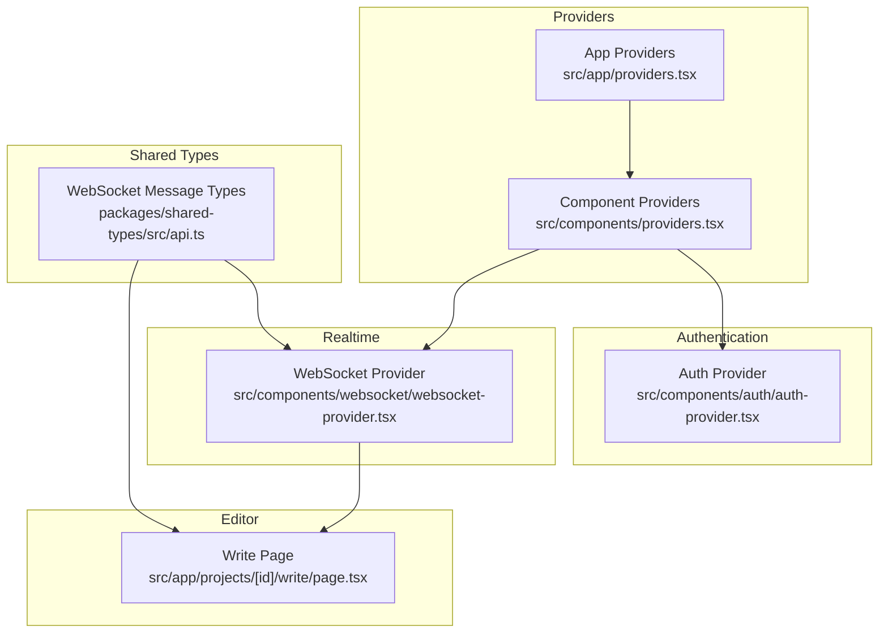
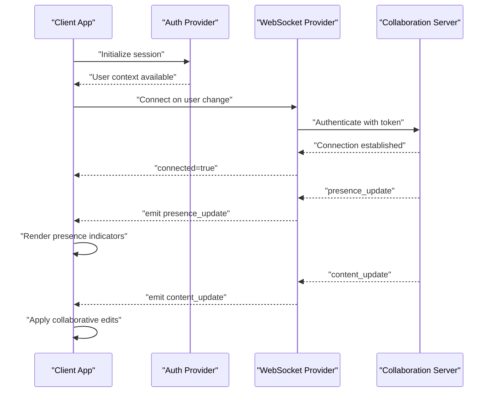
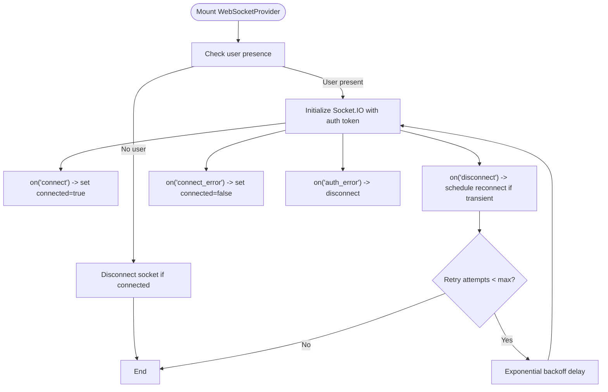
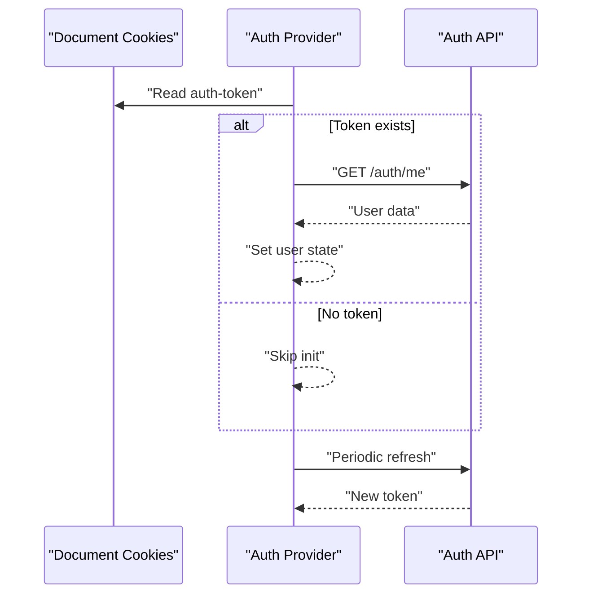
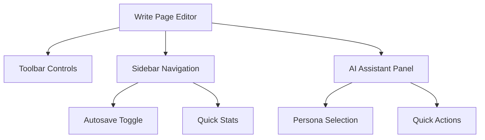
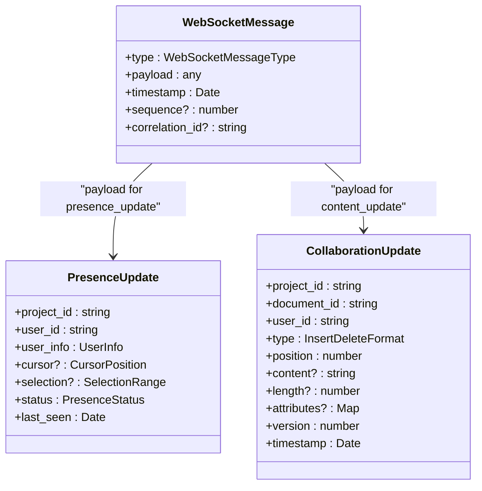
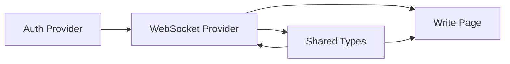

# Collaboration Integration

<cite>
**Referenced Files in This Document**
- [README.md](file://README.md)
- [IMPLEMENTATION_PLAN.md](file://IMPLEMENTATION_PLAN.md)
- [START_HERE.md](file://START_HERE.md)
- [EXECUTIVE_SUMMARY.md](file://EXECUTIVE_SUMMARY.md)
- [src/app/providers.tsx](file://src/app/providers.tsx)
- [src/components/providers.tsx](file://src/components/providers.tsx)
- [src/components/auth/auth-provider.tsx](file://src/components/auth/auth-provider.tsx)
- [src/components/websocket/websocket-provider.tsx](file://src/components/websocket/websocket-provider.tsx)
- [src/app/projects/[id]/write/page.tsx](file://src/app/projects/[id]/write/page.tsx)
- [packages/shared-types/src/api.ts](file://packages/shared-types/src/api.ts)
</cite>

## Table of Contents
1. [Introduction](#introduction)
2. [Project Structure](#project-structure)
3. [Core Components](#core-components)
4. [Architecture Overview](#architecture-overview)
5. [Detailed Component Analysis](#detailed-component-analysis)
6. [Dependency Analysis](#dependency-analysis)
7. [Performance Considerations](#performance-considerations)
8. [Troubleshooting Guide](#troubleshooting-guide)
9. [Conclusion](#conclusion)
10. [Appendices](#appendices)

## Introduction
This document explains the collaboration integration for real-time editing coordination and multi-user workspace management in the writing workspace. It covers the collaboration features currently integrated, presence indicators, collaborative editing modes, conflict resolution strategies, WebSocket integration patterns, real-time content synchronization, and user activity tracking. It also documents practical collaborative writing workflows, integration points with the existing editor architecture, state management for collaborative sessions, user permission systems, collaboration panel features, user visibility controls, and communication channels within the writing interface.

The platform’s tech stack includes Next.js 14, Socket.IO for real-time collaboration, and shared TypeScript types that define collaboration message schemas. The current write page provides a rich text editor and an AI assistant panel, while the WebSocket provider establishes authenticated connections and supports reconnection logic. The shared types define collaboration message types and presence update structures that inform future collaboration components.

**Section sources**
- [README.md](file://README.md#L28-L46)
- [src/components/websocket/websocket-provider.tsx](file://src/components/websocket/websocket-provider.tsx#L1-L138)
- [packages/shared-types/src/api.ts](file://packages/shared-types/src/api.ts#L77-L121)

## Project Structure
The collaboration integration spans several layers:
- Provider hierarchy: application-level providers wrap authentication and WebSocket providers to inject session and connectivity into components.
- Editor page: hosts the rich text editor, toolbar, sidebar, and AI assistant panel.
- Shared types: define WebSocket message types and collaboration payloads used across the frontend and backend.
- Implementation plan: outlines planned collaboration components (presence, cursor, comments, activity feed) and acceptance criteria.

**Diagram sources**
- [src/app/providers.tsx](file://src/app/providers.tsx#L9-L36)
- [src/components/providers.tsx](file://src/components/providers.tsx#L10-L54)
- [src/components/auth/auth-provider.tsx](file://src/components/auth/auth-provider.tsx#L20-L156)
- [src/components/websocket/websocket-provider.tsx](file://src/components/websocket/websocket-provider.tsx#L17-L138)
- [src/app/projects/[id]/write/page.tsx](file://src/app/projects/[id]/write/page.tsx#L100-L626)
- [packages/shared-types/src/api.ts](file://packages/shared-types/src/api.ts#L77-L121)

**Section sources**
- [src/app/providers.tsx](file://src/app/providers.tsx#L9-L36)
- [src/components/providers.tsx](file://src/components/providers.tsx#L10-L54)
- [src/components/auth/auth-provider.tsx](file://src/components/auth/auth-provider.tsx#L20-L156)
- [src/components/websocket/websocket-provider.tsx](file://src/components/websocket/websocket-provider.tsx#L17-L138)
- [src/app/projects/[id]/write/page.tsx](file://src/app/projects/[id]/write/page.tsx#L100-L626)
- [packages/shared-types/src/api.ts](file://packages/shared-types/src/api.ts#L77-L121)

## Core Components
- WebSocket Provider: Establishes authenticated connections using Socket.IO, manages connection lifecycle, and exposes emit/on/off APIs for collaboration events.
- Auth Provider: Manages user session state and JWT token handling, ensuring WebSocket auth aligns with user identity.
- Write Page: Rich text editor with toolbar, sidebar, and AI assistant panel; serves as the primary canvas for collaborative editing.
- Shared Types: Define WebSocket message types (e.g., cursor_update, selection_update, content_update, presence_update) and collaboration payloads.

Key collaboration message types and presence structures:
- WebSocket message types include connect/disconnect/ping/pong, auth, subscribe/unsubscribe, collaboration events, notifications, AI events, and system messages.
- Presence update includes user info, optional cursor and selection positions, status, and last seen timestamp.
- Collaboration update includes insert/delete/format operations with position, content, attributes, version, and timestamp.

**Section sources**
- [src/components/websocket/websocket-provider.tsx](file://src/components/websocket/websocket-provider.tsx#L17-L138)
- [src/components/auth/auth-provider.tsx](file://src/components/auth/auth-provider.tsx#L20-L156)
- [src/app/projects/[id]/write/page.tsx](file://src/app/projects/[id]/write/page.tsx#L100-L626)
- [packages/shared-types/src/api.ts](file://packages/shared-types/src/api.ts#L77-L121)
- [packages/shared-types/src/api.ts](file://packages/shared-types/src/api.ts#L136-L155)
- [packages/shared-types/src/api.ts](file://packages/shared-types/src/api.ts#L123-L134)

## Architecture Overview
The collaboration architecture centers on the WebSocket provider emitting and receiving collaboration events. The write page listens for presence and content updates and renders collaborative state. Authentication ensures only authorized users participate in collaboration.

**Diagram sources**
- [src/components/websocket/websocket-provider.tsx](file://src/components/websocket/websocket-provider.tsx#L24-L93)
- [src/components/auth/auth-provider.tsx](file://src/components/auth/auth-provider.tsx#L27-L49)
- [src/app/projects/[id]/write/page.tsx](file://src/app/projects/[id]/write/page.tsx#L100-L626)
- [packages/shared-types/src/api.ts](file://packages/shared-types/src/api.ts#L77-L121)

## Detailed Component Analysis

### WebSocket Provider
The WebSocket provider encapsulates connection management, authentication, and event handling. It:
- Creates a Socket.IO client with transport fallback and authentication via cookie token.
- Handles connect/disconnect/connect_error/auth_error lifecycle events.
- Implements exponential backoff reconnection with a maximum retry count.
- Exposes emit/on/off methods for collaboration event handling.

**Diagram sources**
- [src/components/websocket/websocket-provider.tsx](file://src/components/websocket/websocket-provider.tsx#L24-L93)

**Section sources**
- [src/components/websocket/websocket-provider.tsx](file://src/components/websocket/websocket-provider.tsx#L17-L138)

### Auth Provider
The authentication provider initializes user state from cookies, refreshes tokens periodically, and logs users out on token errors. It ensures the WebSocket provider receives a valid user context to connect.

**Diagram sources**
- [src/components/auth/auth-provider.tsx](file://src/components/auth/auth-provider.tsx#L27-L49)
- [src/components/auth/auth-provider.tsx](file://src/components/auth/auth-provider.tsx#L133-L141)

**Section sources**
- [src/components/auth/auth-provider.tsx](file://src/components/auth/auth-provider.tsx#L20-L156)

### Write Page Editor
The write page provides:
- Rich text editing via a contentEditable div.
- Toolbar actions for formatting and saving.
- Sidebar with chapter navigation, quick stats, autosave toggle, and version history.
- AI assistant panel with persona selection and quick actions.

Collaboration-ready editor hooks and state slices are planned in the implementation plan to manage collaborative content, selections, and presence.

**Diagram sources**
- [src/app/projects/[id]/write/page.tsx](file://src/app/projects/[id]/write/page.tsx#L187-L349)
- [src/app/projects/[id]/write/page.tsx](file://src/app/projects/[id]/write/page.tsx#L394-L492)
- [src/app/projects/[id]/write/page.tsx](file://src/app/projects/[id]/write/page.tsx#L517-L622)

**Section sources**
- [src/app/projects/[id]/write/page.tsx](file://src/app/projects/[id]/write/page.tsx#L100-L626)

### Shared Types for Collaboration
The shared types define:
- WebSocket message types for collaboration events (cursor_update, selection_update, content_update, presence_update).
- Presence update payload with user info, cursor/selection positions, status, and timestamps.
- Collaboration update payload for insert/delete/format operations with versioning and timestamps.

**Diagram sources**
- [packages/shared-types/src/api.ts](file://packages/shared-types/src/api.ts#L77-L83)
- [packages/shared-types/src/api.ts](file://packages/shared-types/src/api.ts#L136-L155)
- [packages/shared-types/src/api.ts](file://packages/shared-types/src/api.ts#L123-L134)

**Section sources**
- [packages/shared-types/src/api.ts](file://packages/shared-types/src/api.ts#L77-L121)
- [packages/shared-types/src/api.ts](file://packages/shared-types/src/api.ts#L136-L155)
- [packages/shared-types/src/api.ts](file://packages/shared-types/src/api.ts#L123-L134)

### Planned Collaboration Components
The implementation plan outlines planned collaboration components and acceptance criteria:
- Cursor presence: show other users’ cursors, user identification, and cursor color coding.
- Collaborative editing: operational transformation or CRDT, conflict resolution, sync state management.
- Comments system: inline comments, comment threads, mention support.
- Activity feed: real-time updates, activity filtering, notification integration.
- Presence indicators: who’s online, active document viewers, typing indicators.

Acceptance criteria emphasize simultaneous multi-user editing, no data loss, sub-100ms real-time updates, and proper conflict resolution.

**Section sources**
- [IMPLEMENTATION_PLAN.md](file://IMPLEMENTATION_PLAN.md#L278-L318)
- [IMPLEMENTATION_PLAN.md](file://IMPLEMENTATION_PLAN.md#L1051-L1084)

## Dependency Analysis
The collaboration integration depends on:
- Authentication state to authorize WebSocket connections.
- WebSocket provider for real-time event emission and reception.
- Shared types for standardized collaboration message schemas.
- Editor page to render collaborative state and accept user edits.

**Diagram sources**
- [src/components/auth/auth-provider.tsx](file://src/components/auth/auth-provider.tsx#L20-L156)
- [src/components/websocket/websocket-provider.tsx](file://src/components/websocket/websocket-provider.tsx#L17-L138)
- [packages/shared-types/src/api.ts](file://packages/shared-types/src/api.ts#L77-L121)
- [src/app/projects/[id]/write/page.tsx](file://src/app/projects/[id]/write/page.tsx#L100-L626)

**Section sources**
- [src/components/auth/auth-provider.tsx](file://src/components/auth/auth-provider.tsx#L20-L156)
- [src/components/websocket/websocket-provider.tsx](file://src/components/websocket/websocket-provider.tsx#L17-L138)
- [packages/shared-types/src/api.ts](file://packages/shared-types/src/api.ts#L77-L121)
- [src/app/projects/[id]/write/page.tsx](file://src/app/projects/[id]/write/page.tsx#L100-L626)

## Performance Considerations
- Real-time collaboration complexity risk is mitigated by using proven libraries and allocating extra time; fallback is launching without collaboration if needed.
- WebSocket connection limits risk is mitigated by load balancing and connection pooling with long polling fallback.
- Recommendations:
  - Use efficient CRDT or OT libraries for collaborative editing to minimize latency and conflicts.
  - Batch and throttle presence and selection updates to reduce network overhead.
  - Implement optimistic updates with conflict resolution and rollback strategies.
  - Monitor connection quality and adjust reconnection backoff dynamically.

**Section sources**
- [EXECUTIVE_SUMMARY.md](file://EXECUTIVE_SUMMARY.md#L218-L243)
- [START_HERE.md](file://START_HERE.md#L358-L373)

## Troubleshooting Guide
Common collaboration issues and resolutions:
- Authentication errors: ensure the auth token cookie is present and valid; the WebSocket provider disconnects on auth_error.
- Disconnections: verify user presence; the provider disconnects when user is null and reconnects with exponential backoff.
- Presence not updating: confirm the server emits presence_update and the client listens via on/off methods.
- Content synchronization: ensure content_update messages are handled and applied with versioning to prevent overwrites.

Operational steps:
- Verify token validity and refresh cycles.
- Confirm WebSocket URL and environment variables.
- Check event subscriptions and message types.
- Validate presence and collaboration payloads against shared types.

**Section sources**
- [src/components/websocket/websocket-provider.tsx](file://src/components/websocket/websocket-provider.tsx#L82-L86)
- [src/components/websocket/websocket-provider.tsx](file://src/components/websocket/websocket-provider.tsx#L25-L33)
- [src/components/websocket/websocket-provider.tsx](file://src/components/websocket/websocket-provider.tsx#L66-L74)
- [packages/shared-types/src/api.ts](file://packages/shared-types/src/api.ts#L77-L121)

## Conclusion
The collaboration integration leverages a robust provider hierarchy, authenticated WebSocket connections, and shared schemas to enable real-time editing coordination. While the write page currently focuses on rich text editing and AI assistance, the implementation plan outlines comprehensive collaboration features—presence, cursor tracking, collaborative editing, comments, and activity feeds—alongside strict acceptance criteria. By adhering to the outlined patterns and performance recommendations, the platform can achieve reliable, low-latency multi-user editing experiences.

[No sources needed since this section summarizes without analyzing specific files]

## Appendices

### Practical Collaborative Workflows
- Invite collaborators: share project access and ensure users are authenticated.
- Start editing: open the write page; WebSocket connects automatically with auth token.
- Real-time presence: observe presence indicators and typing status.
- Concurrent edits: collaborative editing applies remote changes with conflict resolution.
- Manage permissions: rely on backend roles and permissions for access control.
- Track activity: use the activity feed for real-time updates and notifications.

**Section sources**
- [IMPLEMENTATION_PLAN.md](file://IMPLEMENTATION_PLAN.md#L278-L318)
- [src/components/websocket/websocket-provider.tsx](file://src/components/websocket/websocket-provider.tsx#L35-L47)
- [src/components/auth/auth-provider.tsx](file://src/components/auth/auth-provider.tsx#L67-L131)