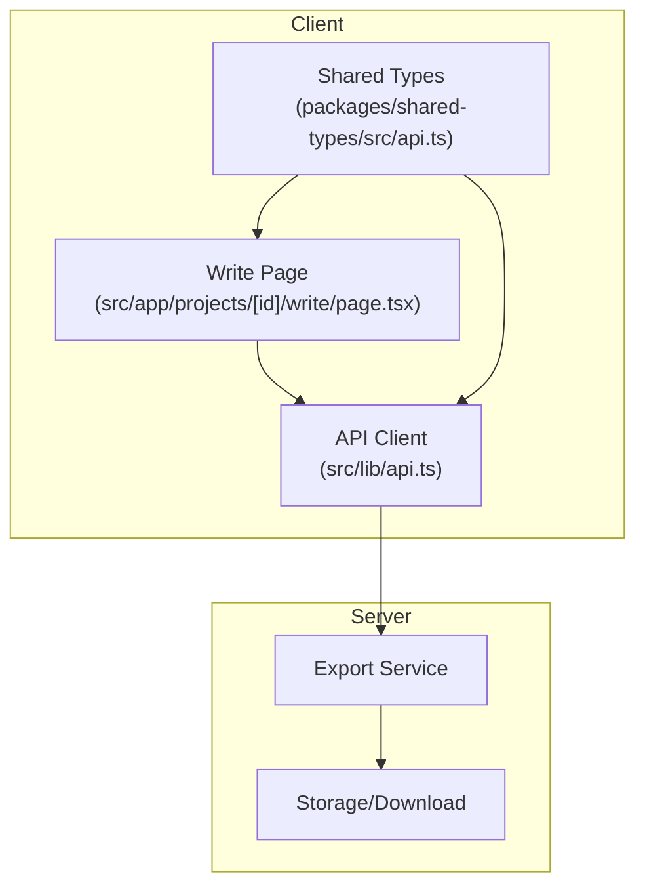
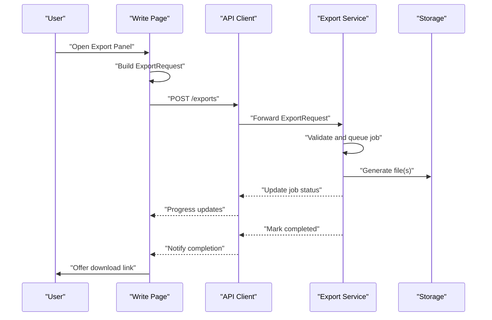
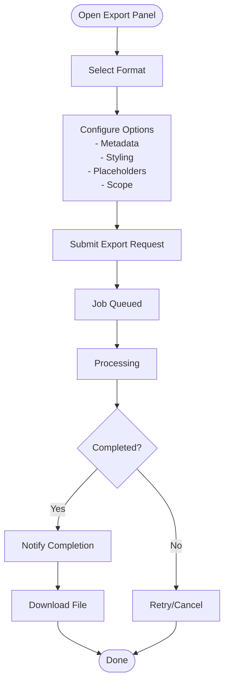
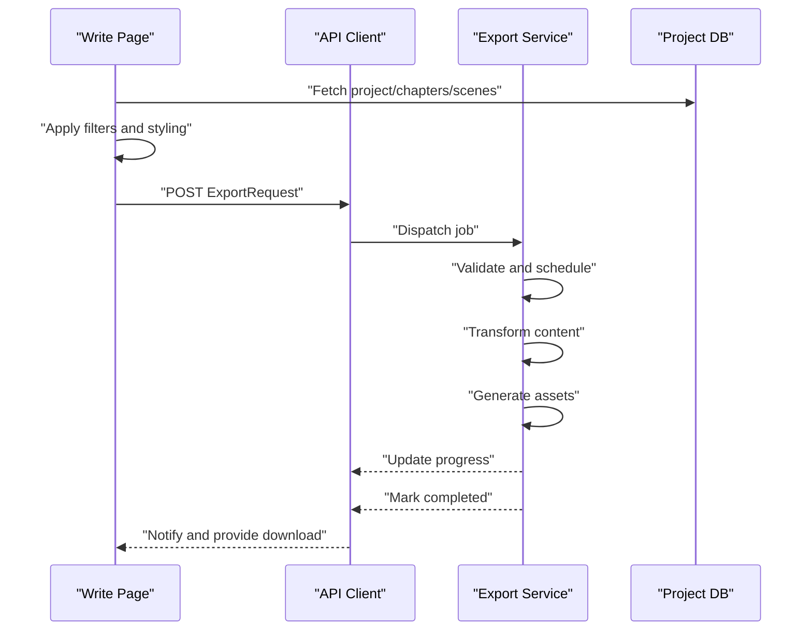
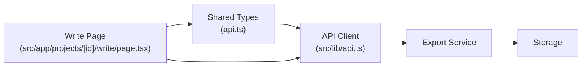

# Export Functionality

<cite>
**Referenced Files in This Document**
- [page.tsx](file://src/app/projects/[id]/write/page.tsx)
- [api.ts](file://packages/shared-types/src/api.ts)
- [api.ts](file://src/lib/api.ts)
- [IMPLEMENTATION_PLAN.md](file://IMPLEMENTATION_PLAN.md)
</cite>

## Table of Contents
1. [Introduction](#introduction)
2. [Project Structure](#project-structure)
3. [Core Components](#core-components)
4. [Architecture Overview](#architecture-overview)
5. [Detailed Component Analysis](#detailed-component-analysis)
6. [Dependency Analysis](#dependency-analysis)
7. [Performance Considerations](#performance-considerations)
8. [Troubleshooting Guide](#troubleshooting-guide)
9. [Conclusion](#conclusion)
10. [Appendices](#appendices)

## Introduction
This document explains the export functionality for transforming writing workspace content into various file formats. It covers available export options, styling and metadata preservation, the end-to-end export workflow, integration with external export services, quality assurance processes, and practical scenarios such as chapter exports and full manuscript compilation. It also documents the export panel interface, format-specific options, batch export capabilities, and the relationship between export functionality and project management hierarchies.

## Project Structure
The export system is designed around a shared API contract and a Next.js client page that orchestrates export requests. The key elements are:
- Shared export types define the request payload, supported formats, and job lifecycle
- The writing workspace page provides the UI for initiating exports and viewing progress
- An API client handles authentication and request/response handling

**Diagram sources**
- [page.tsx](file://src/app/projects/[id]/write/page.tsx#L1-L626)
- [api.ts](file://packages/shared-types/src/api.ts#L157-L242)
- [api.ts](file://src/lib/api.ts#L1-L67)

**Section sources**
- [page.tsx](file://src/app/projects/[id]/write/page.tsx#L1-L626)
- [api.ts](file://packages/shared-types/src/api.ts#L157-L242)
- [api.ts](file://src/lib/api.ts#L1-L67)

## Core Components
- Export request model: Defines the export payload including project identifier, target format, and options
- Export options: Controls metadata inclusion, styling, placeholders, chapter scoping, and date range filtering
- Format-specific options: Provides per-format controls such as PDF page size/margins, fonts, and EPUB cover/table of contents depth
- Export job lifecycle: Tracks queued, processing, completed, failed, canceled, and expired states
- Notification integration: Uses notification types to signal completion and other events

Key export types and enums:
- ExportRequest: project_id, format, options
- ExportFormat: json, epub, pdf, docx, markdown, html, latex, scrivener, final_draft
- ExportOptions: include_metadata, include_comments, include_revision_history, include_character_sheets, include_world_bible, apply_placeholders, placeholder_mode, style_profile_id, format_options, chapters, date_range
- FormatSpecificOptions: PDF (page_size, margins, font_family, font_size, line_height), EPUB (cover_image, toc_depth, chapter_break), common (title_page, table_of_contents, page_numbers, headers, footers)
- ExportJob: id, user_id, project_id, format, status, progress, file_url, file_size, error, timestamps, metadata
- ExportStatus: queued, processing, completed, failed, canceled, expired

**Section sources**
- [api.ts](file://packages/shared-types/src/api.ts#L157-L242)

## Architecture Overview
The export workflow integrates the writing workspace with an export service via a typed API. The client constructs an export request, sends it to the server, tracks job progress, and retrieves the generated file when ready.

**Diagram sources**
- [page.tsx](file://src/app/projects/[id]/write/page.tsx#L1-L626)
- [api.ts](file://packages/shared-types/src/api.ts#L157-L242)
- [api.ts](file://src/lib/api.ts#L1-L67)

## Detailed Component Analysis

### Export Panel Interface
The writing workspace page provides a contextual export experience:
- Access from the write page header or sidebar
- Export options panel with:
  - Format selector (json, epub, pdf, docx, markdown, html, latex, scrivener, final_draft)
  - Metadata toggles (include_metadata, include_comments, include_revision_history, include_character_sheets, include_world_bible)
  - Styling controls (style_profile_id, format_options)
  - Content scoping (chapters array, date_range)
  - Placeholder handling (apply_placeholders, placeholder_mode)
  - Batch export controls (multiple chapters or date windows)
- Job progress and completion notifications
- Download link when ready

**Section sources**
- [page.tsx](file://src/app/projects/[id]/write/page.tsx#L350-L490)
- [api.ts](file://packages/shared-types/src/api.ts#L157-L242)

### Export Workflow: From Preparation to Download
- Content preparation:
  - Resolve project hierarchy (project, chapters, scenes)
  - Apply chapter scoping and date range filters
  - Assemble metadata and styling profiles
- Validation:
  - Verify export options against format capabilities
  - Check placeholder mode and redaction requirements
- Processing:
  - Queue job with ExportRequest
  - Transform content to target format with preserved styling
  - Generate ancillary assets (covers, TOCs)
- Completion:
  - Update job status to completed
  - Store file URL and metadata
  - Emit export_complete notification

**Diagram sources**
- [page.tsx](file://src/app/projects/[id]/write/page.tsx#L114-L135)
- [api.ts](file://packages/shared-types/src/api.ts#L157-L242)
- [api.ts](file://src/lib/api.ts#L1-L67)

**Section sources**
- [page.tsx](file://src/app/projects/[id]/write/page.tsx#L114-L166)
- [api.ts](file://packages/shared-types/src/api.ts#L157-L242)

### Format-Specific Options
- PDF:
  - Page size: A4, Letter, A5
  - Margins: top, bottom, left, right
  - Typography: font_family, font_size, line_height
- EPUB:
  - Cover image URL
  - Table of contents depth
  - Chapter break behavior (page, none)
- Common:
  - Title page, table of contents, page numbers
  - Headers and footers

These options are passed via FormatSpecificOptions within ExportOptions.

**Section sources**
- [api.ts](file://packages/shared-types/src/api.ts#L192-L216)

### Quality Assurance Processes
- Validation pipeline:
  - Format capability checks
  - Placeholder mode correctness
  - Styling profile existence
- Error handling:
  - ExportStatus transitions to failed with error messages
  - Graceful degradation for unsupported features
- Completion verification:
  - File URL availability and metadata presence
  - Notification delivery (export_complete)

**Section sources**
- [api.ts](file://packages/shared-types/src/api.ts#L218-L242)

### Practical Export Scenarios
- Chapter export:
  - Scope by chapters array
  - Include metadata and comments
  - Apply style profile for consistent formatting
- Full manuscript compilation:
  - Include character sheets and world bible
  - Enable table of contents and page numbers
  - Use date_range to select recent edits
- Batch export:
  - Multiple chapter selections
  - Placeholder replacement for redaction or summaries
- Cross-platform publishing:
  - EPUB for e-readers
  - PDF for print-ready documents
  - DOCX for collaborative editing
  - LaTeX for academic publishing

**Section sources**
- [api.ts](file://packages/shared-types/src/api.ts#L175-L190)

### Relationship to Project Management Hierarchies
- Project-level:
  - ExportRequest targets a project_id
  - Includes world bible and character sheets when requested
- Chapter-level:
  - Chapters array scopes content
  - Date_range filters content by creation/update timestamps
- Scene-level:
  - Scenes are aggregated into chapters for export
  - Revision history can be included per scene

**Section sources**
- [page.tsx](file://src/app/projects/[id]/write/page.tsx#L114-L135)
- [api.ts](file://packages/shared-types/src/api.ts#L157-L190)

## Dependency Analysis
The export system relies on:
- Shared types for request/response contracts
- API client for authentication and transport
- Export service for processing and file generation
- Storage for file persistence and retrieval

**Diagram sources**
- [api.ts](file://packages/shared-types/src/api.ts#L157-L242)
- [api.ts](file://src/lib/api.ts#L1-L67)
- [page.tsx](file://src/app/projects/[id]/write/page.tsx#L1-L626)

**Section sources**
- [api.ts](file://packages/shared-types/src/api.ts#L157-L242)
- [api.ts](file://src/lib/api.ts#L1-L67)
- [page.tsx](file://src/app/projects/[id]/write/page.tsx#L1-L626)

## Performance Considerations
- Prefer scoped exports (chapter/date range) for large projects
- Use placeholders to reduce file size when appropriate
- Leverage batch export for multiple chapters to minimize overhead
- Monitor job progress to avoid repeated submissions

## Troubleshooting Guide
Common issues and resolutions:
- Authentication failures:
  - Ensure access tokens are present and valid
  - Refresh tokens are used automatically on 401 responses
- Export fails:
  - Check ExportStatus for failure details
  - Verify format-specific options compatibility
- Missing file:
  - Confirm file_url is present in the completed job
  - Validate storage permissions and URLs

**Section sources**
- [api.ts](file://src/lib/api.ts#L10-L65)
- [api.ts](file://packages/shared-types/src/api.ts#L218-L242)

## Conclusion
The export system provides a robust, extensible framework for transforming writing workspace content into multiple formats while preserving styling and metadata. Its design supports project hierarchies, flexible scoping, and quality assurance, enabling practical workflows from chapter exports to full manuscript compilation.

## Appendices

### Implementation Plan Alignment
- Export tasks are defined in the implementation plan and awaiting development
- The shared types align with planned features for ePub, PDF, JSON, import, and redaction

**Section sources**
- [IMPLEMENTATION_PLAN.md](file://IMPLEMENTATION_PLAN.md#L756-L792)