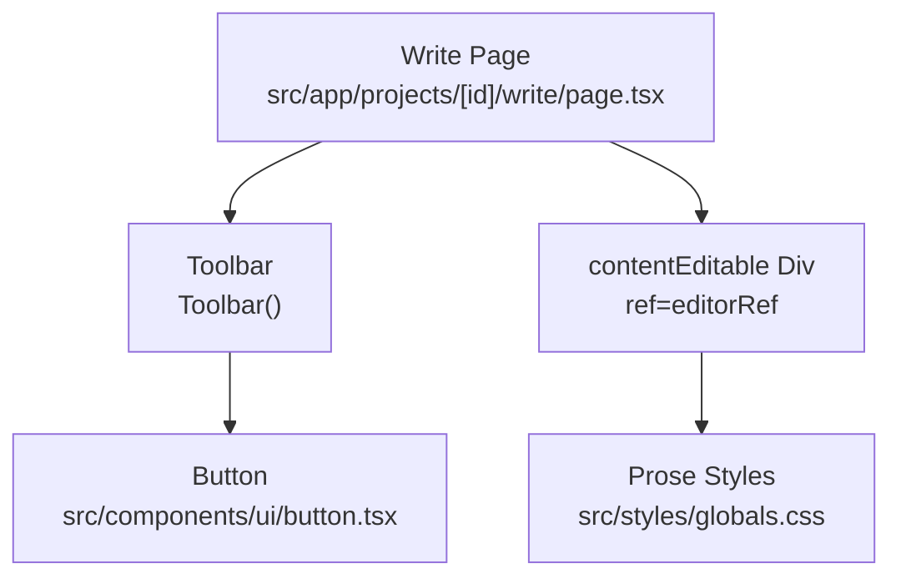
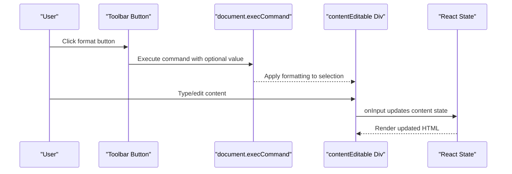
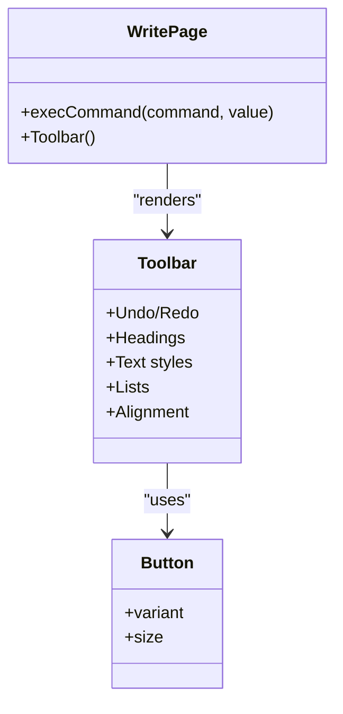
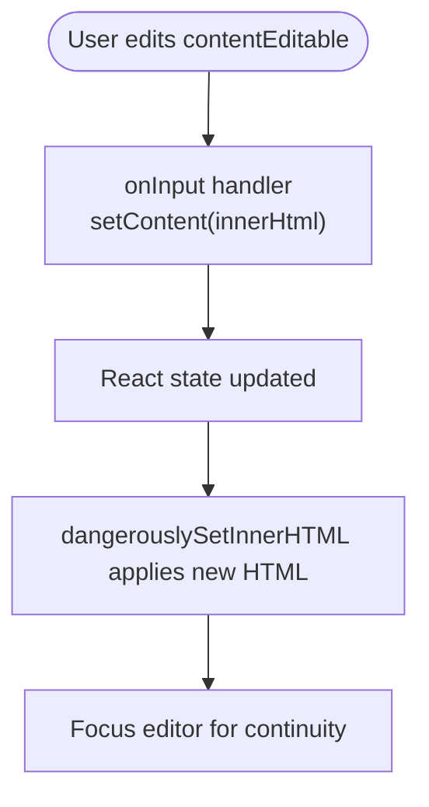
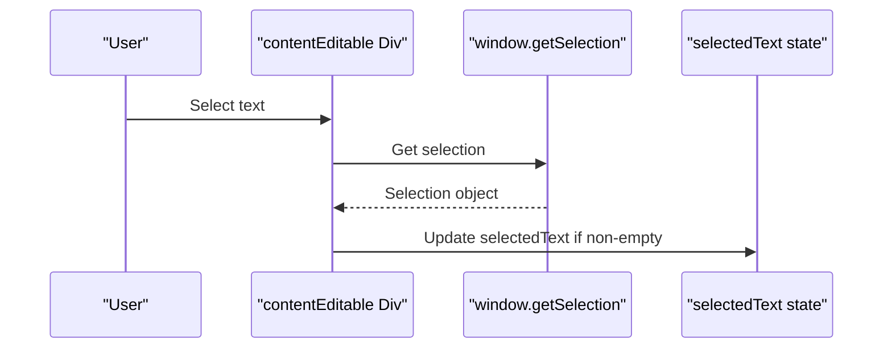
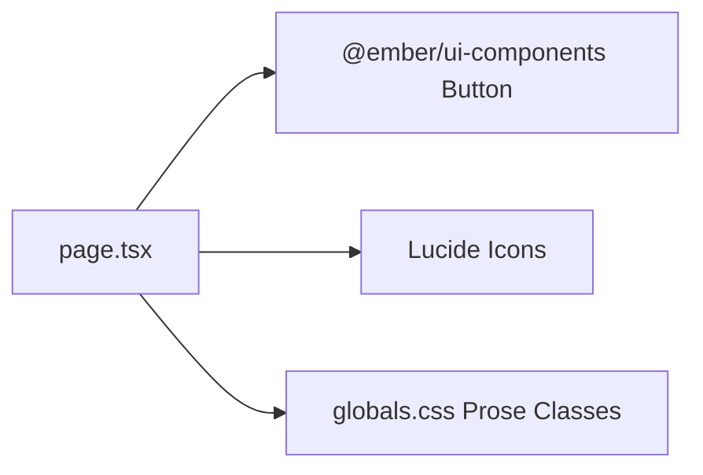

# Rich Text Editor

<cite>
**Referenced Files in This Document**
- [page.tsx](file://src/app/projects/[id]/write/page.tsx)
- [button.tsx](file://src/components/ui/button.tsx)
- [globals.css](file://src/styles/globals.css)
</cite>

## Table of Contents
1. [Introduction](#introduction)
2. [Project Structure](#project-structure)
3. [Core Components](#core-components)
4. [Architecture Overview](#architecture-overview)
5. [Detailed Component Analysis](#detailed-component-analysis)
6. [Dependency Analysis](#dependency-analysis)
7. [Performance Considerations](#performance-considerations)
8. [Troubleshooting Guide](#troubleshooting-guide)
9. [Conclusion](#conclusion)
10. [Appendices](#appendices)

## Introduction
This document explains the rich text editor implementation centered on a contentEditable div architecture and a formatting toolbar. It covers DOM manipulation via document.execCommand, content sanitization strategies, real-time content updates, and the toolbar’s integration with Lucide icons. It also documents supported formatting commands (headings, lists, text styles, alignment), selection handling, editor initialization, content preservation, browser compatibility considerations, accessibility notes, and integration with the writing workflow and state management patterns.

## Project Structure
The editor is implemented within a Next.js page component that composes:
- A toolbar with buttons using Lucide icons
- A contentEditable div for rich text input
- UI primitives from a local Button component
- Global prose styles for rendering

**Diagram sources**
- [page.tsx](file://src/app/projects/[id]/write/page.tsx#L187-L349)
- [button.tsx](file://src/components/ui/button.tsx#L41-L53)
- [globals.css](file://src/styles/globals.css#L69-L150)

**Section sources**
- [page.tsx](file://src/app/projects/[id]/write/page.tsx#L100-L137)
- [button.tsx](file://src/components/ui/button.tsx#L1-L55)
- [globals.css](file://src/styles/globals.css#L69-L150)

## Core Components
- WritePage: Hosts editor state, toolbar, sidebar, AI panel, and autosave logic.
- Toolbar: Provides formatting controls wired to document.execCommand.
- contentEditable div: The primary input surface with real-time content updates.
- Button: Reusable UI primitive used by toolbar items.
- Prose styles: Tailwind-based prose classes for consistent rendering.

Key behaviors:
- Real-time content updates via onInput handler that syncs innerHTML to state.
- Selection handling via window.getSelection to capture user selections.
- Formatting executed through document.execCommand with optional values.
- Autosave triggered after inactivity with configurable interval.

**Section sources**
- [page.tsx](file://src/app/projects/[id]/write/page.tsx#L100-L171)
- [page.tsx](file://src/app/projects/[id]/write/page.tsx#L187-L349)
- [page.tsx](file://src/app/projects/[id]/write/page.tsx#L500-L512)
- [button.tsx](file://src/components/ui/button.tsx#L41-L53)

## Architecture Overview
The editor follows a unidirectional data flow:
- User interacts with the toolbar or contentEditable div.
- The toolbar executes document.execCommand commands against the active selection.
- The contentEditable div fires onInput, updating React state.
- Side panels (sidebar, AI assistant) remain decoupled but can influence content indirectly (e.g., AI suggestions).

**Diagram sources**
- [page.tsx](file://src/app/projects/[id]/write/page.tsx#L168-L171)
- [page.tsx](file://src/app/projects/[id]/write/page.tsx#L504-L505)

## Detailed Component Analysis

### Toolbar Implementation
The toolbar groups formatting actions into logical sections:
- Undo/Redo
- Headings (H1, H2)
- Text styles (Bold, Italic, Underline)
- Lists (Bulleted, Numbered, Blockquote)
- Alignment (Left, Center, Right)
- Version history and AI assist controls

Each button triggers document.execCommand with appropriate commands and values. Buttons use the shared Button component and Lucide icons for visual clarity.

**Diagram sources**
- [page.tsx](file://src/app/projects/[id]/write/page.tsx#L187-L349)
- [button.tsx](file://src/components/ui/button.tsx#L41-L53)

Formatting commands used:
- Undo/Redo: undo, redo
- Headings: formatBlock with block tags
- Text styles: bold, italic, underline
- Lists: insertUnorderedList, insertOrderedList
- Blockquote: formatBlock with blockquote tag
- Alignment: justifyLeft, justifyCenter, justifyRight

Keyboard shortcuts are not explicitly bound in the provided code; commands are invoked via toolbar clicks.

**Section sources**
- [page.tsx](file://src/app/projects/[id]/write/page.tsx#L187-L306)

### ContentEditable Div and Real-Time Updates
The contentEditable div is initialized with:
- contentEditable enabled
- Prose classes for rendering
- Initial HTML injected via dangerouslySetInnerHTML
- Focus applied after execCommand to maintain caret position

Real-time update mechanism:
- onInput captures innerHTML and updates state
- State change re-renders the div’s innerHTML
- Selection handlers update selected text state

**Diagram sources**
- [page.tsx](file://src/app/projects/[id]/write/page.tsx#L500-L512)

**Section sources**
- [page.tsx](file://src/app/projects/[id]/write/page.tsx#L500-L512)

### Selection Handling
Selection handling:
- Mouse up and key up events trigger selection extraction
- Selected text is stored in state for downstream use (e.g., AI assist)
- Empty selection clears selected text state

**Diagram sources**
- [page.tsx](file://src/app/projects/[id]/write/page.tsx#L173-L180)

**Section sources**
- [page.tsx](file://src/app/projects/[id]/write/page.tsx#L173-L180)

### Content Sanitization
Current implementation:
- Uses dangerouslySetInnerHTML to inject initial HTML
- onInput synchronizes content from the div’s innerHTML

Recommended sanitization approach:
- Before applying innerHTML, sanitize HTML to prevent XSS and unwanted markup.
- Use a library to parse and filter HTML, allowing only safe tags and attributes.
- After sanitization, apply sanitized HTML back to the editor.

Note: The provided code does not implement sanitization; this is a recommended enhancement.

**Section sources**
- [page.tsx](file://src/app/projects/[id]/write/page.tsx#L504-L505)

### Editor Initialization and Content Preservation
Initialization:
- Initialize content state from chapter scene content
- Set up autosave timer dependent on state and preferences
- Apply prose classes and inline styles for typography

Content preservation:
- Autosave on inactivity
- Word count computed from content state
- Version history toggle for UI affordance

**Section sources**
- [page.tsx](file://src/app/projects/[id]/write/page.tsx#L114-L155)
- [page.tsx](file://src/app/projects/[id]/write/page.tsx#L157-L166)

### State Management Patterns
- Local React state manages content, selection, autosave, and UI toggles
- Effects orchestrate autosave timing and derived metrics (word count)
- Ref maintains a stable reference to the contentEditable element

Integration points:
- Sidebar and AI panel are separate UI regions; they can influence content indirectly (e.g., inserting suggestions) without altering the core editor state flow.

**Section sources**
- [page.tsx](file://src/app/projects/[id]/write/page.tsx#L100-L155)

## Dependency Analysis
The editor depends on:
- Shared Button component for toolbar items
- Global prose styles for rendering
- Lucide icons for toolbar visuals

**Diagram sources**
- [page.tsx](file://src/app/projects/[id]/write/page.tsx#L5-L46)
- [button.tsx](file://src/components/ui/button.tsx#L41-L53)
- [globals.css](file://src/styles/globals.css#L69-L150)

**Section sources**
- [page.tsx](file://src/app/projects/[id]/write/page.tsx#L5-L46)
- [button.tsx](file://src/components/ui/button.tsx#L41-L53)
- [globals.css](file://src/styles/globals.css#L69-L150)

## Performance Considerations
- Avoid frequent re-renders by minimizing unnecessary state updates; the current onInput updates content on every keystroke.
- Debounce autosave to reduce network or storage overhead.
- Consider virtualizing long content if performance becomes an issue.
- Keep HTML minimal and avoid excessive nested tags to improve rendering speed.

## Troubleshooting Guide
Common issues and remedies:
- Formatting not applied: Ensure the contentEditable div is focused after execCommand; the implementation focuses the editor after command execution.
- Selection lost after typing: Verify onInput updates state consistently; confirm that the component re-renders innerHTML after state changes.
- Styling inconsistencies: Confirm prose classes and global CSS are loaded; adjust prose overrides if needed.
- Autosave not triggering: Check effect dependencies and ensure content state changes activate the timer.

**Section sources**
- [page.tsx](file://src/app/projects/[id]/write/page.tsx#L168-L171)
- [page.tsx](file://src/app/projects/[id]/write/page.tsx#L504-L505)
- [page.tsx](file://src/app/projects/[id]/write/page.tsx#L139-L148)

## Conclusion
The editor leverages a straightforward contentEditable div with a toolbar of Lucide-powered buttons executing document.execCommand. It supports essential formatting commands, real-time updates, selection handling, and autosave. Enhancements such as content sanitization, keyboard shortcuts, and improved accessibility would further strengthen the implementation while preserving the existing state and rendering patterns.

## Appendices

### Supported Formatting Commands Reference
- Undo/Redo: undo, redo
- Headings: formatBlock with block tags
- Text styles: bold, italic, underline
- Lists: insertUnorderedList, insertOrderedList
- Blockquote: formatBlock with blockquote tag
- Alignment: justifyLeft, justifyCenter, justifyRight

**Section sources**
- [page.tsx](file://src/app/projects/[id]/write/page.tsx#L187-L306)

### Accessibility Considerations
- Add role="textbox" and aria-multiline="true" to the contentEditable div.
- Provide keyboard shortcuts for power users.
- Ensure sufficient color contrast for prose rendering.
- Announce formatting changes and selection updates for screen readers.

[No sources needed since this section provides general guidance]